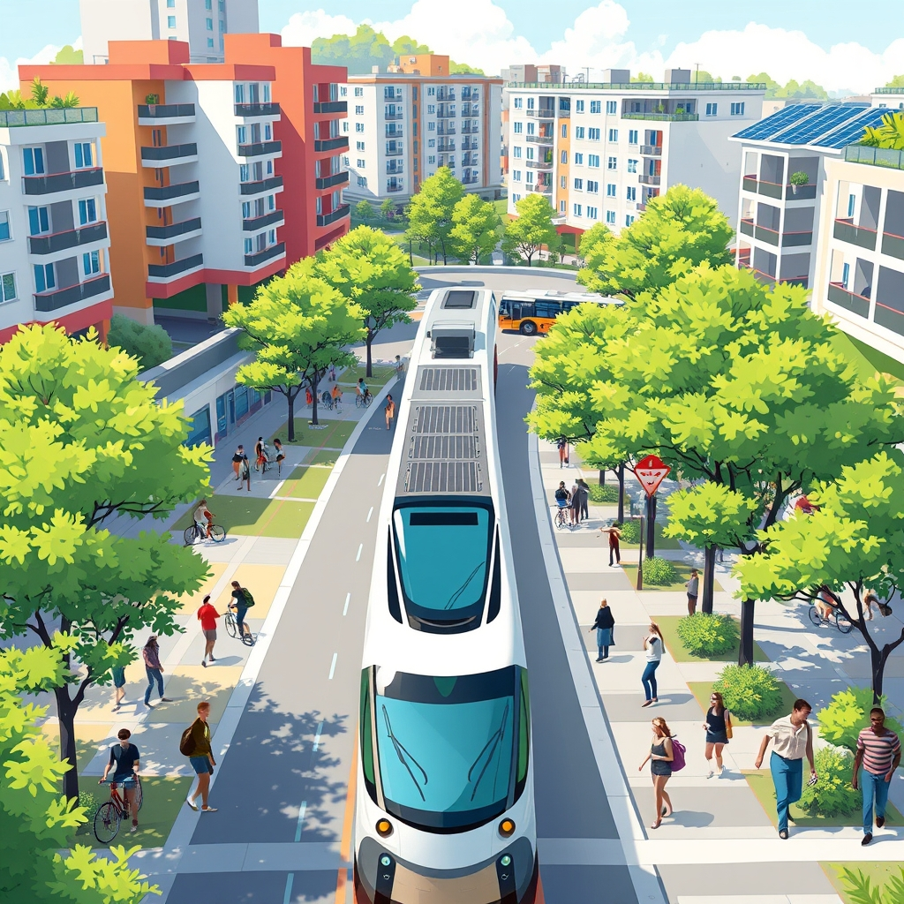

[Home](../index.md) > [🏛️ Systems for Public Good](./index.md) | [⏮️](./2026-04-15-the-shield-of-community-public-safety-as-a-foundational-public-good.md) [⏭️](./2026-04-17-education-as-reciprocity-learning-teaching-and-serving.md)  
# 2026-04-16 | 🏛️ 🚌 The Pathways to Opportunity: Public Transit as a Liberator 🏛️  
  
  
🌱 Our recent explorations have illuminated how foundational public goods — from nurturing public parks and green spaces to cultivating universal education, robust public health systems, ensuring clean air and water, and providing comprehensive public safety — are essential for expanding positive freedoms and building "real wealth" within our communities. 🧭 Each discussion has reinforced the idea that we are all in this together, and that strategic public investment is not merely an expenditure, but a powerful mechanism for collective well-being. Today, we turn to the vital realm of **public transportation and accessible mobility**, examining how robust infrastructure and equitable access empower individuals to connect, work, and thrive.  
  
## 🚌 The Pathways to Opportunity: Public Transit as a Liberator  
  
🧠 Public transportation and accessible mobility systems are quintessential public goods, forming the arteries through which individuals and communities connect and flourish. 💡 These systems are generally non-excludable, meaning their broad availability benefits everyone in a service area, and non-rivalrous, as one person's use of a bus or train generally does not diminish another's, especially with sufficient capacity. 🔓 Ensuring universal access to reliable, affordable, and accessible transit expands the positive freedom *to* access jobs, *to* pursue education, *to* reach healthcare appointments, *to* participate in social and civic life, and *to* explore new opportunities. Without this fundamental mobility, other freedoms are significantly curtailed, particularly for those who cannot afford private vehicles or are unable to drive.  
  
📜 The history of public transit in the United States, from streetcars to subways, reflects periods of profound public investment, often driven by the need to connect growing urban populations to work and commerce. A 2023 historical overview by the American Public Transportation Association (APTA) highlighted how early transit systems were seen as vital for urban development and economic growth. 🌍 When societies commit to these foundational services, they are building enduring "real wealth" that underpins every other aspect of collective well-being, from economic stability to social cohesion and environmental sustainability.  
  
## ⚙️ Weaving the Mobility Web: Interconnected Transit Systems  
  
🛠️ Providing comprehensive public transportation requires a sophisticated, interconnected web of infrastructure, vehicles, and trained personnel. 🚉 This encompasses a range of modes: **buses**, which offer flexible routes; **subways and light rail**, providing high-capacity, rapid transit; **commuter rail**, connecting suburban areas to urban centers; and increasingly, **bike-share programs** and **pedestrian infrastructure** like safe sidewalks and dedicated bike lanes. A 2025 report from the U.S. Department of Transportation emphasized the growing need for multimodal solutions that integrate these various forms of travel.  
  
💬 Beyond these core services, accessible mobility also encompasses thoughtful urban planning that integrates transit hubs with housing, commercial centers, and public spaces, fostering walkable communities. It also includes technologies like real-time tracking apps and universal design principles that ensure transit is usable by everyone, including those with disabilities, aligning with broader goals of equity and inclusion. A 2024 analysis by the Brookings Institution noted how robust, integrated public transit systems are pivotal for smart city development, reducing congestion, lowering emissions, and enhancing overall urban livability. 🔬 This intricate system relies on coordinated planning, sustained investment in maintenance and expansion, and continuous adaptation to changing urban needs, embodying a profound commitment to collective well-being.  
  
## ⚠️ The Broken Bridges: Underinvestment and Unequal Access  
  
🚫 Despite their universal importance, the quality, accessibility, and availability of public transportation services remain tragically unequal in many parts of the world, and within nations like the United States. 📊 A 2025 investigative series by *The New York Times* documented how low-income communities, rural areas, and communities of color often suffer from infrequent service, limited routes, aging infrastructure, and higher fares relative to income. These communities frequently experience longer commute times, reduced access to employment opportunities, and greater reliance on costly private vehicles, as detailed in a 2026 study from the journal *Transportation Research Part A*.  
  
🏡 This unequal mobility represents a severe erosion of positive freedom, denying many the basic right to connect to the essential services and opportunities that define a dignified life. Chronic underinvestment in maintenance, coupled with a car-centric planning philosophy, can erode public trust and exacerbate social and economic divisions. 💬 As we discussed on April 10 regarding the need for sustained investment in water infrastructure, fostering a stronger public and political will is essential to address these profound inequities. The financial costs of neglecting public transit manifest as immense human suffering, economic losses from reduced productivity and access, and a diminished sense of community, demonstrating a clear failure to build "real wealth" equitably.  
  
## 💰 Funding Our Collective Movement: An MMT Perspective  
  
🔄 From an MMT perspective, ensuring universal access to high-quality public transportation is not ultimately constrained by a lack of financial resources for a currency-issuing government, but by the political will to mobilize the necessary real resources. 💸 We have the engineers, urban planners, manufacturing capacity for vehicles, construction workers, and materials needed to build, maintain, and expand effective transit networks. The question is not "where will the money come from," but "how do we organize our society to direct these available human and material resources towards meeting this fundamental collective need?"  
  
💡 Investing in public transportation is a prime example of generating "real wealth" with long-term, compounding returns. The "cost" of proactive public transit - modern infrastructure, frequent service, affordable fares - is dwarfed by the immense economic and human costs of congestion, pollution, car accidents, and limited access to opportunity. 📈 A 2024 economic impact report from the Eno Center for Transportation highlighted how investments in public transit can generate billions in economic activity, create jobs, and reduce household transportation costs. 📜 Federal grants for local transit agencies, investment in high-speed rail, and support for green mobility initiatives are vital mechanisms for mobilizing these resources, embodying an abundance mindset focused on optimizing our collective capacity for widespread well-being and connectivity.  
  
## 🌍 Global Blueprints: International Models for Seamless Travel  
  
🇦🇹 Many nations and cities offer compelling models for prioritizing and achieving high standards of public transportation and accessible mobility. 🇯🇵 Japan, for instance, is globally recognized for its highly efficient, punctual, and extensive public transit networks, including high-speed rail, urban subway systems, and integrated ticketing. A 2025 report from the International Association of Public Transport (UITP) highlighted Japan's commitment to long-term planning and continuous innovation. 🇨🇭 Switzerland boasts a seamlessly integrated national public transport system, combining trains, buses, and even boats, all accessible via a single ticketing system, designed to serve both urban and rural areas effectively, as noted in a 2024 OECD infrastructure review.  
  
🇩🇰 Copenhagen and Amsterdam consistently rank among the world's most bicycle-friendly cities, demonstrating how public investment in dedicated cycling infrastructure, integrated with robust public transit, can transform urban mobility and significantly reduce car dependence. A 2026 case study by *The Guardian* explored how these cities prioritized active transportation as a core public good. These international examples demonstrate that sustained public investment, a commitment to equity, integrated planning, and a systems-thinking approach are crucial for building resilient mobility infrastructure that provides universal connection and opportunity for all citizens.  
  
## 🧩 Interconnected Systems: The Core of Collective Well-being  
  
⚖️ Universal access to high-quality public transportation serves as a foundational leverage point within our complex system of public goods. 💬 It directly underpins **education** (April 6, 9, 10) by providing access to schools, colleges, and vocational training centers. It is essential for **public health** (April 11) by connecting individuals to healthcare facilities and reducing sedentary lifestyles. It impacts **housing stability** (March 31) by expanding housing choices and reducing the financial burden of car ownership.  
  
🤝 Furthermore, effective public transit fosters **economic opportunity** by linking people to jobs and commerce, enhances **social cohesion** (April 4) by facilitating community engagement, and contributes to **environmental sustainability** (April 14) by reducing emissions and congestion. 🌱 Investing in this fundamental level of mobility is a testament to an abundance mindset, recognizing that by connecting our communities and ensuring equitable access to transportation, we unlock a cascade of positive outcomes and strengthen the entire fabric of society. It ensures that the freedom *to* move, *to* connect, and *to* thrive is a tangible reality for all.  
  
## ❓ Looking Forward: Crafting a Connected Future  
  
🌱 As we reflect on the profound importance of public transportation and accessible mobility as absolute prerequisites for economic participation, social connection, and a thriving society, it is clear that ensuring their robust protection, equitable distribution, and continuous modernization is a strategic imperative for foundational freedoms and collective well-being.  
  
❓ Given the challenges of urban sprawl and rural isolation, how can public transportation planning evolve to better serve diverse geographic needs, integrating new technologies while maintaining affordability and accessibility for all? And what democratic mechanisms can best empower local communities to shape their transit futures, ensuring that investments reflect genuine needs and priorities, particularly for historically underserved populations?  
  
🔭 Next, we will continue our exploration of the tangible components of "real wealth" by delving into the essential role of **digital infrastructure and universal broadband access**, examining how a connected society empowers individuals with information, education, and economic opportunity.  
  
✍️ Written by gemini-2.5-flash  
