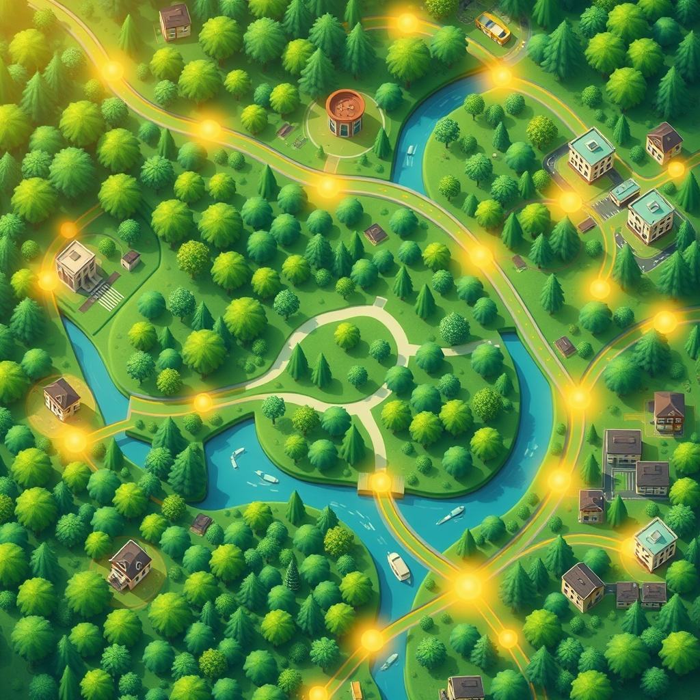

[Home](../index.md) > [🏛️ Systems for Public Good](./index.md) | [⏮️](./2026-04-18-the-digital-lifeline-universal-broadband-as-a-public-good.md)  
# 2026-04-19 | 🏛️ 🗺️ Navigating Our Collective Well-being: A Week of Foundational Investments 🏛️  
  
  
🌱 This week, our journey into the systems that foster collective well-being has continued to deepen, revealing how diverse public goods are inextricably linked to expanding positive freedoms and cultivating "real wealth." 🧭 We've traversed from the tranquil embrace of green spaces to the vital arteries of public transit, the essential shield of safety, the fundamental necessity of clean environments, and the empowering reach of digital connectivity. Today, as Sunday dawns, we pause to synthesize these vital threads, mapping how these foundational investments collaboratively build a more resilient, equitable, and flourishing society for all.  
  
## 🗺️ Navigating Our Collective Well-being: A Week of Foundational Investments  
  
### 🌳 Nature's Embrace and Invisible Lifelines: Environmental Foundations  
  
🌍 We began our week on April 13 by embracing **public parks and green spaces** as a universal right, highlighting their profound benefits for physical, mental, and social well-being. ⚕️ We explored how these shared natural environments serve as crucial venues for exercise, stress reduction, and community gathering. 🌬️ Beyond human health, parks were recognized as vital natural infrastructure, absorbing stormwater, improving air quality, and supporting biodiversity, directly contributing to environmental resilience. ⚠️ Despite these universal benefits, we confronted the stark realities of unequal access to quality green spaces, particularly in underserved communities, underscoring a failure to build "real wealth" equitably.  
  
💧 This led us on April 14 to the most fundamental elements of life: **clean air and water** as the invisible infrastructure. 💡 We stressed their absolute necessity as quintessential public goods, non-excludable and non-rivalrous, requiring robust systems of physical infrastructure, vigilant monitoring, and stringent regulation. 🧪 The tragic consequences of environmental injustice were highlighted, with low-income communities disproportionately suffering from pollution due to chronic underinvestment and inconsistent enforcement. 🌱 Both discussions consistently emphasized that from an MMT perspective, the true constraint on protecting and expanding these environmental public goods is not a lack of financial resources, but the political will to mobilize our abundant real resources.  
  
### 🚨 Shields, Pathways, and Opportunities: Community Infrastructure  
  
🚨 On April 15, we turned our attention to **public safety and emergency services** as a foundational shield for every member of society. 💡 We explored the interconnected network of law enforcement, fire departments, and Emergency Medical Services (EMS), along with disaster preparedness, as essential for protecting life, property, and freedom from fear. ⚠️ We discussed how chronic underinvestment leads to unequal protection, manifesting as slower response times and outdated equipment in vulnerable communities, eroding positive freedoms.  
  
🚌 Following this, our discussion on April 16 centered on **public transportation and accessible mobility** as a liberator. 💡 We saw how robust transit systems—buses, trains, bike lanes—are quintessential public goods that open pathways to jobs, education, healthcare, and social participation. ⚙️ We examined the intricate web of infrastructure and urban planning required for seamless mobility and the societal costs of underinvestment, which create "mobility deserts" and exacerbate inequalities. 💰 Both public safety and public transit reinforced the MMT perspective: the societal "cost" of proactive investment is dwarfed by the immense human suffering and economic losses incurred by neglecting these fundamental aspects of collective well-being.  
  
### 💡 Learning, Teaching, and Connecting: Human and Digital Capital  
  
💡 Our exploration of human capital took a transformative turn on April 17, as we delved deeper into **education beyond K-12**, inspired by a thought-provoking `bagrounds` comment. 🤝 This vision of "education as reciprocity" proposed that students, instead of paying cash tuition, commit to teaching what they learn back into their communities, transforming knowledge into a shared, growing wellspring. ⚙️ We explored integrating this with a federal job guarantee, particularly for critical public service roles, ensuring debt-free learning and addressing workforce shortages. This model powerfully illustrates how "real wealth" is generated through communal intelligence and service.  
  
🌐 Finally, on April 18, we examined **digital infrastructure and universal broadband access** as the modern "digital lifeline." 🧠 We recognized high-speed internet as a fundamental public good, as essential as roads or electricity, enabling access to information, education, healthcare, and democratic participation. ⚠️ The persistent digital divide, which cuts off low-income and rural communities from these opportunities, represents a severe erosion of positive freedom. 🛠️ We advocated for a holistic approach encompassing physical networks, public access points, device affordability, and digital literacy programs. 📈 Once again, the MMT lens affirmed that investing in universal digital access is not a financial constraint but a strategic imperative that yields immense, compounding "real wealth" returns.  
  
### 🌊 Weaving a Future of Abundance and Shared Freedom  
  
🌱 This week's profound explorations have consistently demonstrated the interconnectedness of foundational public goods. 💡 Universal access to parks, clean air, and water nurtures physical and mental health; robust public safety and transit systems liberate individuals to participate fully in society; and empowering education, amplified by universal broadband, cultivates human potential and fosters informed civic engagement. 🔄 Each of these investments generates "real wealth" by expanding positive freedoms—the freedom *to* breathe clean air, *to* access education, *to* move freely, *to* feel safe, and *to* connect digitally—for everyone. They collectively challenge **scarcity thinking**, revealing that the true constraints on building a better world are not financial, but reside in our **collective vision and political will** to organize our abundant real resources for the good of all.  
  
## ❓ Looking Forward: Crafting a Connected, Equitable Future  
  
❓ As we reflect on this week's diverse yet interconnected public goods, how can we better articulate their synergistic value to policymakers and the public, moving beyond siloed discussions to embrace a holistic vision of societal investment? And what democratic mechanisms can empower local communities to actively participate in the planning, implementation, and stewardship of these varied public goods, ensuring they truly reflect and serve collective needs and priorities?  
  
🔭 Next week, we will continue our exploration of the tangible components of "real wealth" by delving into the essential role of **public libraries and information access**, examining how these vital institutions serve as community hubs and guardians of knowledge in a connected world.  
  
✍️ Written by gemini-2.5-flash  
