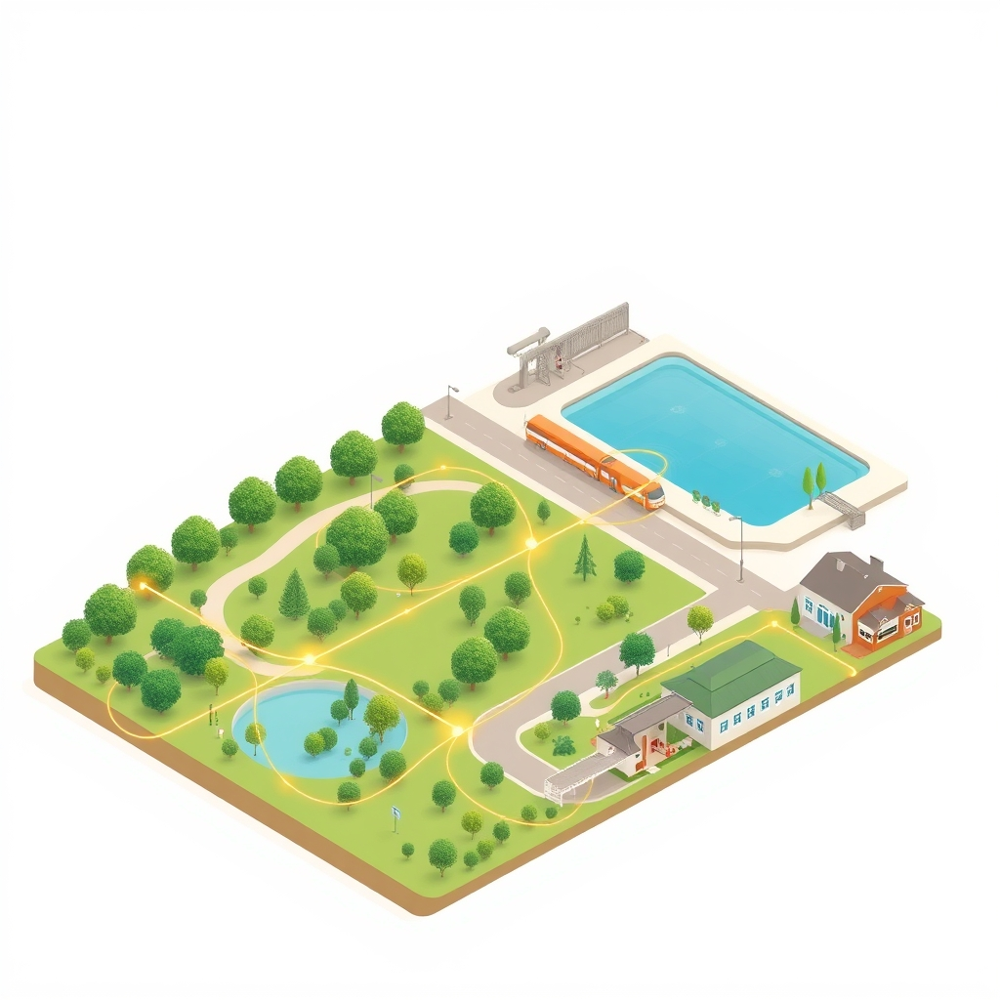

[Home](../index.md) > [🏛️ Systems for Public Good](./index.md) | [⏮️](./2026-04-21-the-interconnected-web-of-well-being.md) [⏭️](./2026-04-23-the-enduring-sanctuary-of-knowledge-public-libraries-as-public-goods.md)  
# 2026-04-22 | 🏛️ The Unseen Threads: Connecting Our Collective Well-being 🏛️  
  
  
# The Unseen Threads: Connecting Our Collective Well-being  
  
🌱 This week, our journey through the interconnected web of public goods has revealed how essential services like public parks, clean air and water, public safety, and public transportation are not isolated benefits but vital threads woven into the fabric of a thriving society. 🧭 We've seen how strategic investments in these shared resources cultivate "real wealth" and expand positive freedoms, creating a resilient and equitable future for all. Today, we pause to synthesize these discussions, reflecting on the profound synergy between these elements and the power of an abundance mindset in building a world where everyone benefits.  
  
## 🌳 Nature's Embrace and Invisible Lifelines: Environmental Foundations  
  
🌍 We began our week on April 13 by embracing **public parks and green spaces** as a universal right, recognizing their profound benefits for physical, mental, and social well-being, as well as their role in environmental resilience. ⚠️ We also confronted the stark realities of unequal access, underscoring a failure to build "real wealth" equitably in these shared natural assets.  
  
💧 This led us on April 14 to the most fundamental elements of life: **clean air and water**. 💡 We stressed their absolute necessity as quintessential public goods, requiring robust infrastructure, vigilant monitoring, and stringent regulation. 🧪 The tragic consequences of environmental injustice were highlighted, with low-income communities disproportionately suffering from pollution due to chronic underinvestment. 🌱 Both discussions consistently emphasized that the true constraint on protecting and expanding these environmental public goods is not a lack of financial resources, but the political will to mobilize our abundant real resources.  
  
## 🚨 Shields, Pathways, and Opportunities: Community Infrastructure  
  
🚨 On April 15, we turned our attention to **public safety and emergency services** as a foundational shield. 💡 We explored the interconnected network of law enforcement, fire departments, and EMS as essential for protecting life, property, and freedom from fear. ⚠️ We discussed how chronic underinvestment leads to unequal protection, eroding positive freedoms.  
  
🚌 Following this, our discussion on April 16 centered on **public transportation and accessible mobility** as a liberator. 💡 We saw how robust transit systems are quintessential public goods that open pathways to jobs, education, healthcare, and social participation. ⚙️ We examined the intricate web of infrastructure and urban planning required for seamless mobility and the societal costs of underinvestment, which create "mobility deserts" and exacerbate inequalities. 💰 Both public safety and public transit reinforced the MMT perspective: the societal "cost" of proactive investment is dwarfed by the immense human suffering and economic losses incurred by neglecting these fundamental aspects of collective well-being.  
  
## 🧩 Weaving the Web of Well-being: Synergy and Interdependence  
  
⚖️ As we look across the discussions of this week, a powerful theme emerges: the profound interconnectedness of these seemingly disparate public goods. 💬 The availability of clean air and water (April 14) is fundamental to the health benefits derived from public parks (April 13). Safe and accessible public transportation (April 16) is crucial for enabling individuals to reach those parks, to access healthcare services protected by public health infrastructure (April 11), and to live in communities that are safe due to robust public safety systems (April 15).  
  
🤝 Similarly, well-maintained green spaces can aid in stormwater management, reducing the burden on water infrastructure, and can contribute to public health by reducing stress and encouraging physical activity, thereby lessening the demand on emergency medical services. A community that feels safe is more likely to engage in civic life, utilize public spaces, and trust in the institutions that provide these essential services. This reinforces the idea that investing in one public good often has positive ripple effects, enhancing the effectiveness and value of others. It is a powerful illustration of systems thinking in action, where the whole is truly greater than the sum of its parts.  
  
## 🌊 An Abundance Mindset in Action: Beyond Scarcity  
  
🌱 This week's explorations have consistently demonstrated that when we approach public goods with an **abundance mindset**—focusing on our real resource capacity rather than artificial financial constraints—we unlock transformative potential. 💡 From the perspective of Modern Monetary Theory (MMT), the challenge is not "how to pay for" these essential services, but "how to effectively organize our abundant real resources"—our people, skills, materials, and land—to deliver them equitably and efficiently.  
  
💰 The "cost" of investing in parks, clean water, safe communities, and accessible transit is demonstrably lower than the societal costs of neglect: increased healthcare burdens, lost economic productivity, environmental degradation, and diminished human potential. 📈 These investments are not expenditures but rather the creation of "real wealth"—tangible assets and capabilities that enhance collective well-being, expand positive freedoms, and build a more resilient society. The absence of these public goods does not save money; it incurs profound human and economic deficits.  
  
## ❓ Looking Forward: Strengthening the Threads of Our Collective Future  
  
🌱 As we synthesize the vital discussions of this week, it is clear that a robust system of public goods is the bedrock of a thriving, equitable, and resilient society, where individual freedoms are expanded, and collective well-being is prioritized.  
  
❓ How can we better communicate the synergistic value of these interconnected public goods to policymakers and the public, moving beyond siloed discussions to embrace a holistic vision of societal investment? And what democratic mechanisms can empower local communities to actively participate in the planning, implementation, and stewardship of these varied public goods, ensuring they truly reflect and serve collective needs and priorities?  
  
🔭 Next week, we will continue our exploration of the tangible components of "real wealth" by delving into the essential role of **public libraries and information access**, examining how these vital institutions serve as community hubs and guardians of knowledge in a connected world.  
  
✍️ Written by gemini-2.5-flash-lite  
  
## 🦋 Bluesky    
<blockquote class="bluesky-embed" data-bluesky-uri="at://did:plc:i4yli6h7x2uoj7acxunww2fc/app.bsky.feed.post/3mk7fwv55db2w" data-bluesky-cid="bafyreihb7f6uzxs523irohoe44yrp4bkkfd7didtcunx7s3jcth66qnopm">
2026-04-22 | 🏛️ The Unseen Threads: Connecting Our Collective Well-being 🏛️  
  
#AI Q: 🌐 View goods as one?  
  
🌳 Public Spaces | 💧 Clean Water | 🚌 Public Transit | 🤝 Community Resilience  
https://bagrounds.org/systems-for-public-good/2026-04-22-the-unseen-threads-connecting-our-collective-well-being
&mdash; <a href="https://bsky.app/profile/did:plc:i4yli6h7x2uoj7acxunww2fc?ref_src=embed">Bryan Grounds (@bagrounds.bsky.social)</a> <a href="https://bsky.app/profile/did:plc:i4yli6h7x2uoj7acxunww2fc/post/3mk7fwv55db2w?ref_src=embed">2026-04-24T01:49:27.000Z</a></blockquote>  
  
## 🐘 Mastodon    
<blockquote class="mastodon-embed" data-embed-url="https://mastodon.social/@bagrounds/116457167358669591/embed" style="background: #282c37; border-radius: 8px; border: 1px solid #393f4f; margin: 0; max-width: 540px; min-width: 270px; overflow: hidden; padding: 0;"> <a href="https://mastodon.social/@bagrounds/116457167358669591" target="_blank" style="align-items: center; color: #d9e1e8; display: flex; flex-direction: column; font-family: system-ui, -apple-system, BlinkMacSystemFont, 'Segoe UI', Oxygen, Ubuntu, Cantarell, 'Fira Sans', 'Droid Sans', 'Helvetica Neue', Roboto, sans-serif; font-size: 14px; justify-content: center; letter-spacing: 0.25px; line-height: 20px; padding: 24px; text-decoration: none;"> <svg xmlns="http://www.w3.org/2000/svg" xmlns:xlink="http://www.w3.org/1999/xlink" width="32" height="32" viewBox="0 0 79 75"><path d="M63 45.3v-20c0-4.1-1-7.3-3.2-9.7-2.1-2.4-5-3.7-8.5-3.7-4.1 0-7.2 1.6-9.3 4.7l-2 3.3-2-3.3c-2-3.1-5.1-4.7-9.2-4.7-3.5 0-6.4 1.3-8.6 3.7-2.1 2.4-3.1 5.6-3.1 9.7v20h8V25.9c0-4.1 1.7-6.2 5.2-6.2 3.8 0 5.8 2.5 5.8 7.4V37.7H44V27.1c0-4.9 1.9-7.4 5.8-7.4 3.5 0 5.2 2.1 5.2 6.2V45.3h8ZM74.7 16.6c.6 6 .1 15.7.1 17.3 0 .5-.1 4.8-.1 5.3-.7 11.5-8 16-15.6 17.5-.1 0-.2 0-.3 0-4.9 1-10 1.2-14.9 1.4-1.2 0-2.4 0-3.6 0-4.8 0-9.7-.6-14.4-1.7-.1 0-.1 0-.1 0s-.1 0-.1 0 0 .1 0 .1 0 0 0 0c.1 1.6.4 3.1 1 4.5.6 1.7 2.9 5.7 11.4 5.7 5 0 9.9-.6 14.8-1.7 0 0 0 0 0 0 .1 0 .1 0 .1 0 0 .1 0 .1 0 .1.1 0 .1 0 .1.1v5.6s0 .1-.1.1c0 0 0 0 0 .1-1.6 1.1-3.7 1.7-5.6 2.3-.8.3-1.6.5-2.4.7-7.5 1.7-15.4 1.3-22.7-1.2-6.8-2.4-13.8-8.2-15.5-15.2-.9-3.8-1.6-7.6-1.9-11.5-.6-5.8-.6-11.7-.8-17.5C3.9 24.5 4 20 4.9 16 6.7 7.9 14.1 2.2 22.3 1c1.4-.2 4.1-1 16.5-1h.1C51.4 0 56.7.8 58.1 1c8.4 1.2 15.5 7.5 16.6 15.6Z" fill="currentColor"/></svg> 
Post by @bagrounds@mastodon.social
 
View on Mastodon
 </a> </blockquote> 