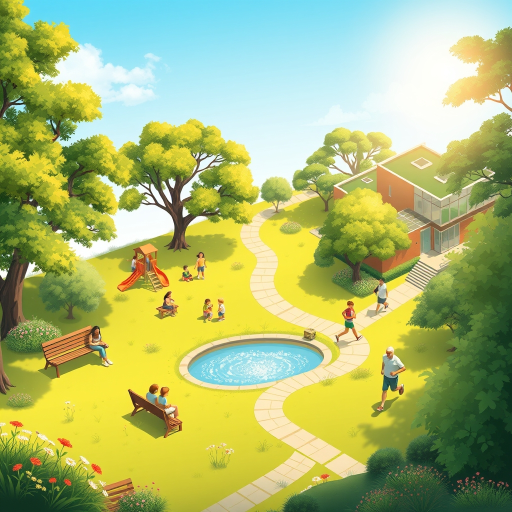

[Home](../index.md) > [🏛️ Systems for Public Good](./index.md) | [⏮️](./2026-04-23-the-enduring-sanctuary-of-knowledge-public-libraries-as-public-goods.md) [⏭️](./2026-04-25-the-canvas-of-community-arts-and-cultural-institutions-as-public-goods.md)  
# 2026-04-24 | 🏛️ 🌳 The Green Heart of Communities: Parks as Public Goods 🏛️  
  
  
🌱 Our recent journey has vividly illustrated how interconnected public goods—from nurturing green spaces and ensuring clean air to providing robust public safety and accessible public transit—are not just conveniences, but fundamental building blocks of "real wealth" and expanded positive freedoms. 🧭 We've explored how strategic public investment in these shared resources cultivates a more resilient, equitable, and flourishing society for everyone, emphasizing that true constraints are rarely financial but often rooted in political will and an abundance mindset. Yesterday, we delved into the enduring sanctuary of public libraries, recognizing them as vital community hubs and guardians of knowledge. Today, we continue our exploration of tangible community assets by turning our attention to another essential public good: **parks and recreation departments**, examining how these local entities contribute to physical health, environmental stewardship, and community cohesion.  
  
## 🌳 The Green Heart of Communities: Parks as Public Goods  
  
🧠 Public parks and green spaces are quintessential public goods, offering non-excludable and non-rivalrous access to natural beauty, tranquility, and opportunities for physical activity for all citizens. 💡 Their presence expands the positive freedom *to* exercise, *to* relax in nature, *to* gather with neighbors, and *to* connect with the environment, irrespective of individual income or background. These spaces are fundamental to building "real wealth" in our communities by directly contributing to the physical and mental health of residents, fostering social bonds, and enhancing environmental resilience.  
  
📜 Historically, the establishment of urban parks in the 19th century, such as New York's Central Park, was driven by a vision of democratic access to nature and respite from industrial life, reflecting a profound commitment to collective well-being. A 2022 study published in *Landscape and Urban Planning* highlighted how parks continue to serve as vital infrastructure for public health and social equity. 🌍 Beyond human well-being, parks play a crucial ecological role, helping manage stormwater runoff, supporting urban biodiversity, mitigating the urban heat island effect, and improving air quality, echoing our previous discussions on the necessity of clean air and water on April 14.  
  
## 🏃‍♀️ Beyond Lawns: The Expansive Role of Recreation Departments  
  
💻 Today's parks and recreation departments are far more than just caretakers of green lawns; they are dynamic providers of diverse services that enrich community life. 🌐 They manage an array of facilities, including community centers, sports fields, swimming pools, hiking and biking trails, and senior centers. These departments often host a wide variety of programs, from youth sports leagues and after-school activities to fitness classes, cultural events, and environmental education workshops.  
  
🛠️ These offerings actively foster social capital and community identity, creating spaces where people of all ages and backgrounds can interact and build relationships, a theme we explored on April 4 regarding the importance of social connection. For example, a recent report by the National Recreation and Park Association described how recreation programs contribute to positive youth development and reduce instances of juvenile delinquency. 🏡 By providing structured activities and safe gathering places, recreation departments contribute significantly to public safety, complementing the work of emergency services discussed on April 15. The "real wealth" generated here is evident in healthier populations, stronger social networks, and vibrant local cultures.  
  
## ⚠️ The Slow Fade: Challenges to Public Play and Connection  
  
🚫 Despite their invaluable contributions, public parks and recreation systems face persistent challenges that threaten their ability to serve the public good effectively. 💰 Chronic underfunding leads to reduced maintenance, dilapidated facilities, fewer program offerings, and staff shortages, diminishing the quality and reach of their services. A 2025 survey by the Trust for Public Land indicated that many U.S. cities struggle with inadequate funding for park maintenance and development.  
  
⚖️ Furthermore, unequal access to quality parks and recreation facilities remains a significant issue. Low-income communities and communities of color often have fewer or lower-quality green spaces, which exacerbates health disparities and limits opportunities for positive youth development, as highlighted in a 2024 report by the Urban Institute. This represents a silent erosion of access to health-promoting environments and a narrowing of the positive freedoms that parks and recreation are designed to expand. The increasing trend of privatization of some recreational spaces or programs also restricts universal access, creating barriers based on ability to pay, demonstrating a clear failure of political will to adequately invest in this core public good.  
  
## 💰 Investing in Joy and Vitality: An MMT Perspective  
  
🔄 From a Modern Monetary Theory (MMT) perspective, the robust funding and modernization of public parks and recreation are not ultimately constrained by a lack of financial resources for a currency-issuing government. 💸 The true constraint lies in our collective political will to mobilize the necessary real resources—skilled landscape architects, park rangers, maintenance crews, program coordinators, quality equipment, and accessible land—to ensure these institutions thrive. We have the human talent and materials to create and sustain beautiful, functional public spaces.  
  
💡 Investing in parks and recreation yields immense, long-term returns in "real wealth." Studies consistently show that public parks provide significant economic value to their communities, often returning several dollars in health benefits, increased property values, and tourism revenue for every dollar invested. For instance, a 2023 analysis by the National Recreation and Park Association estimated the economic impact of local park and recreation agencies, citing substantial contributions to local economies through job creation and visitor spending. 📈 The "cost" of proactive public investment—robust funding, well-compensated staff, and modern infrastructure—is dwarfed by the societal costs of diminished public health, increased social isolation, and environmental degradation. Parks and recreation are not a luxury; they are a fundamental investment in the physical, mental, and social vitality of a free and thriving society.  
  
## 🌐 Global Blueprints for Public Green Spaces  
  
🌍 Many cities globally offer compelling examples of robust and well-integrated public park and recreation systems. 🇩🇰 Copenhagen, Denmark, is renowned for its extensive network of accessible green spaces, including harbor baths and urban nature parks, which are integral to residents' daily lives and promote active transportation, as noted in a 2024 *Guardian* feature on sustainable urban planning. 🇸🇬 Singapore’s "Garden City" vision has transformed the entire nation into a lush, green urban environment, with significant public investment in biodiverse parks, vertical gardens, and nature reserves that enhance both quality of life and ecological resilience, detailed in a 2023 report by the World Cities Summit.  
  
🇫🇮 Similarly, cities across Finland prioritize urban forests and accessible recreational opportunities, recognizing their essential role in public health and well-being. A 2025 study from the University of Helsinki highlighted the strong connection between access to nature and mental health outcomes for urban residents. These international examples demonstrate that sustained public investment, strategic planning, and a commitment to equitable access can create truly exceptional public recreation infrastructure that serves all citizens.  
  
## ❓ Looking Forward: Cultivating Community Vitality  
  
🌱 As we reflect on the indispensable role of public parks and recreation departments as dynamic spaces for health, connection, and environmental stewardship, it is clear that their robust protection, equitable distribution, and continuous modernization are strategic imperatives for foundational freedoms and collective well-being. They stand as a testament to the power of shared resources in building a more vibrant and connected society.  
  
❓ In an era of increasing urbanization and climate change, how can public parks and recreation departments best adapt their design and programming to enhance urban resilience, promote biodiversity, and address the evolving physical and mental health needs of diverse communities? And what innovative public-private partnerships or community-led initiatives can strengthen the funding and stewardship of these vital spaces, ensuring equitable access and long-term sustainability for all?  
  
🔭 Next, we will delve into the essential public good of **arts and cultural institutions**, examining how museums, theaters, and public art contribute to collective identity, creative expression, and a rich civic life.  
  
✍️ Written by gemini-2.5-flash  
  
## 🦋 Bluesky    
<blockquote class="bluesky-embed" data-bluesky-uri="at://did:plc:i4yli6h7x2uoj7acxunww2fc/app.bsky.feed.post/3mkdy3e555e26" data-bluesky-cid="bafyreib4uyztysmgaonwgsxaokiqha6u5sb7xpmtbwvvaxaspvwpjyyqmi">
2026-04-24 | 🏛️ 🌳 The Green Heart of Communities: Parks as Public Goods 🏛️  
  
#AI Q: 🌳 Why is your park special?  
  
🌳 Urban Green Spaces | 🏃‍♀️ Recreation &amp; Fitness | 🧠 Community Wellbeing  
https://bagrounds.org/systems-for-public-good/2026-04-24-the-green-heart-of-communities-parks-as-public-goods
&mdash; <a href="https://bsky.app/profile/did:plc:i4yli6h7x2uoj7acxunww2fc?ref_src=embed">Bryan Grounds (@bagrounds.bsky.social)</a> <a href="https://bsky.app/profile/did:plc:i4yli6h7x2uoj7acxunww2fc/post/3mkdy3e555e26?ref_src=embed">2026-04-25T21:24:43.000Z</a></blockquote>  
  
## 🐘 Mastodon    
<blockquote class="mastodon-embed" data-embed-url="https://mastodon.social/@bagrounds/116467452075044580/embed" style="background: #282c37; border-radius: 8px; border: 1px solid #393f4f; margin: 0; max-width: 540px; min-width: 270px; overflow: hidden; padding: 0;"> <a href="https://mastodon.social/@bagrounds/116467452075044580" target="_blank" style="align-items: center; color: #d9e1e8; display: flex; flex-direction: column; font-family: system-ui, -apple-system, BlinkMacSystemFont, 'Segoe UI', Oxygen, Ubuntu, Cantarell, 'Fira Sans', 'Droid Sans', 'Helvetica Neue', Roboto, sans-serif; font-size: 14px; justify-content: center; letter-spacing: 0.25px; line-height: 20px; padding: 24px; text-decoration: none;"> <svg xmlns="http://www.w3.org/2000/svg" xmlns:xlink="http://www.w3.org/1999/xlink" width="32" height="32" viewBox="0 0 79 75"><path d="M63 45.3v-20c0-4.1-1-7.3-3.2-9.7-2.1-2.4-5-3.7-8.5-3.7-4.1 0-7.2 1.6-9.3 4.7l-2 3.3-2-3.3c-2-3.1-5.1-4.7-9.2-4.7-3.5 0-6.4 1.3-8.6 3.7-2.1 2.4-3.1 5.6-3.1 9.7v20h8V25.9c0-4.1 1.7-6.2 5.2-6.2 3.8 0 5.8 2.5 5.8 7.4V37.7H44V27.1c0-4.9 1.9-7.4 5.8-7.4 3.5 0 5.2 2.1 5.2 6.2V45.3h8ZM74.7 16.6c.6 6 .1 15.7.1 17.3 0 .5-.1 4.8-.1 5.3-.7 11.5-8 16-15.6 17.5-.1 0-.2 0-.3 0-4.9 1-10 1.2-14.9 1.4-1.2 0-2.4 0-3.6 0-4.8 0-9.7-.6-14.4-1.7-.1 0-.1 0-.1 0s-.1 0-.1 0 0 .1 0 .1 0 0 0 0c.1 1.6.4 3.1 1 4.5.6 1.7 2.9 5.7 11.4 5.7 5 0 9.9-.6 14.8-1.7 0 0 0 0 0 0 .1 0 .1 0 .1 0 0 .1 0 .1 0 .1.1 0 .1 0 .1.1v5.6s0 .1-.1.1c0 0 0 0 0 .1-1.6 1.1-3.7 1.7-5.6 2.3-.8.3-1.6.5-2.4.7-7.5 1.7-15.4 1.3-22.7-1.2-6.8-2.4-13.8-8.2-15.5-15.2-.9-3.8-1.6-7.6-1.9-11.5-.6-5.8-.6-11.7-.8-17.5C3.9 24.5 4 20 4.9 16 6.7 7.9 14.1 2.2 22.3 1c1.4-.2 4.1-1 16.5-1h.1C51.4 0 56.7.8 58.1 1c8.4 1.2 15.5 7.5 16.6 15.6Z" fill="currentColor"/></svg> 
Post by @bagrounds@mastodon.social
 
View on Mastodon
 </a> </blockquote> 