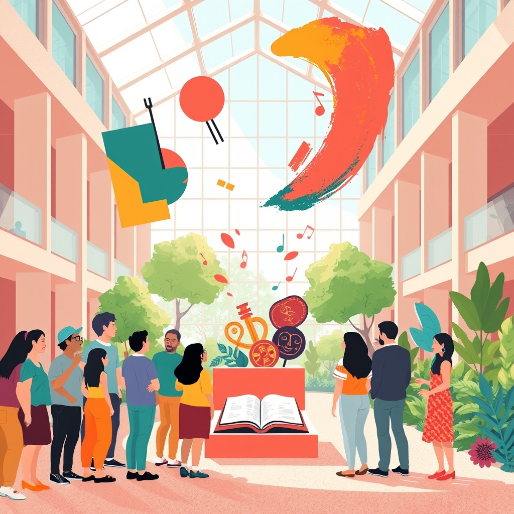

[Home](../index.md) > [🏛️ Systems for Public Good](./index.md) | [⏮️](./2026-04-24-the-green-heart-of-communities-parks-as-public-goods.md) [⏭️](./2026-04-26-this-week-in-collective-well-being-building-civic-foundations.md)  
# 2026-04-25 | 🏛️ 🎨 The Canvas of Community: Arts and Cultural Institutions as Public Goods 🏛️  
  
  
🌱 Our recent discussions have journeyed through the tangible foundations of collective well-being, from the vital embrace of public parks and the enduring sanctuary of public libraries to the fundamental necessity of clean air and water, robust public safety, and accessible public transit. 🧭 Each exploration has reinforced how strategic public investment in these shared resources cultivates "real wealth" and expands positive freedoms for everyone, making society stronger and more resilient. Yesterday, we delved into the multifaceted benefits of parks and recreation departments, recognizing their role in physical health, environmental stewardship, and community cohesion. Today, we continue our exploration of society's shared assets by turning our attention to another essential public good: **arts and cultural institutions**, examining how museums, theaters, public art, and cultural centers contribute to collective identity, creative expression, and a rich civic life.  
  
## 🎨 The Canvas of Community: Arts and Cultural Institutions as Public Goods  
  
🧠 Public arts and cultural institutions are quintessential public goods, offering non-excludable and non-rivalrous access to creative expression, historical understanding, and diverse perspectives for all citizens. 💡 Their presence expands the positive freedom *to* experience beauty, *to* engage with history, *to* participate in cultural traditions, and *to* foster empathy and critical thought, irrespective of individual income or background. These spaces are fundamental to building "real wealth" in our communities by directly contributing to intellectual growth, fostering social bonds, and enhancing creative capital.  
  
📜 Historically, public support for the arts in the United States, notably through initiatives like the Works Progress Administration (WPA) during the Great Depression, recognized the inherent value of artistic labor and cultural enrichment to national well-being and economic recovery. A 2024 article in *Artforum* discussed how these historical programs laid a foundation for the concept of art as a public service. 🌍 Today, institutions ranging from local historical societies and community theaters to major museums and public art installations continue to serve as vital infrastructure for cultural preservation and democratic engagement. They help us understand our past, reflect on our present, and imagine our future.  
  
## 🎭 Beyond Entertainment: The Multifaceted Contributions to Society  
  
💻 Today's arts and cultural institutions are far more than just venues for passive consumption; they are dynamic catalysts that enrich community life in myriad ways. 🌐 They manage an array of facilities, including museums, performance halls, cultural centers, and public art spaces, and often host diverse programs, from educational workshops and artistic residencies to festivals and community dialogues.  
  
### 📚 Cultivating Learning and Critical Thought  
  
💡 These institutions actively foster **education and lifelong learning**, complementing formal schooling and offering informal pathways to knowledge. Museums provide immersive historical experiences, while theater and dance can illuminate complex social issues, encouraging critical thinking and empathy. A recent report by Americans for the Arts, a non-profit organization advocating for public support for the arts, highlighted how arts education programs improve academic outcomes and foster creativity in youth across various socioeconomic backgrounds. 🏡 This builds "real wealth" in the form of human capital, intellectual curiosity, and a more informed citizenry, echoing our previous discussions on the importance of universal education.  
  
### 📈 Driving Economic Vitality  
  
💰 Arts and cultural institutions are also significant **economic engines**, generating jobs, attracting tourism, and revitalizing urban and rural areas. They create direct employment for artists, administrators, technicians, and educators, and indirect jobs in hospitality, retail, and transportation. A 2025 study from the National Endowment for the Arts (NEA) indicated that the arts and cultural sector contributes substantially to the national GDP and supports millions of jobs annually across the United States. 🔄 Investing in these institutions stimulates local economies and strengthens community identity.  
  
### 🤝 Fostering Social Cohesion and Dialogue  
  
🛠️ By providing shared spaces and experiences, cultural institutions foster **social cohesion and empathy**, bringing diverse communities together for shared enjoyment and critical reflection. They can serve as neutral grounds for civic dialogue, allowing different perspectives to engage with challenging topics through artistic expression. A 2024 article in *Cultural Trends* discussed how community arts programs effectively build social capital and reduce feelings of isolation. 💬 The "real wealth" generated here is evident in stronger social networks, increased understanding across different groups, and vibrant local cultures, linking back to our April 4 post on social connection.  
  
## ⚠️ The Slow Erosion: Challenges to Cultural Vitality  
  
🚫 Despite their invaluable contributions, public arts and cultural institutions face persistent challenges that threaten their ability to serve the public good effectively. 💰 Chronic underfunding, particularly from public sources, leads to reduced programming, dilapidated facilities, fewer outreach initiatives, and staff shortages, diminishing the quality and reach of their services. A 2025 investigative report by ProPublica detailed how many local and state arts councils have seen significant budget cuts, leading to increased reliance on precarious private donations and corporate sponsorships.  
  
⚖️ Furthermore, unequal access to quality arts and cultural experiences remains a significant issue. Low-income communities and communities of color often have fewer or lower-quality cultural institutions, or face barriers such as transportation or ticket costs, which exacerbates cultural disparities and limits opportunities for creative engagement, as highlighted in a 2024 analysis by the Urban Institute. This represents a silent erosion of access to enriching environments and a narrowing of the positive freedoms that arts and culture are designed to expand. The increasing politicization of artistic content and attempts at censorship also threaten the freedom of expression that is fundamental to a vibrant democratic society.  
  
## 💰 Investing in the Soul of Society: An MMT Perspective  
  
🔄 From a Modern Monetary Theory (MMT) perspective, the robust funding and modernization of public arts and cultural institutions are not ultimately constrained by a lack of financial resources for a currency-issuing government. 💸 The true constraint lies in our collective political will to mobilize the necessary real resources—talented artists, skilled curators, dedicated educators, accessible venues, and quality materials—to ensure these institutions thrive. We have the human talent and infrastructure to create and sustain a vibrant cultural landscape.  
  
💡 Investing in arts and culture yields immense, long-term returns in "real wealth." Studies consistently show that public investment in the arts provides significant economic and social value to communities, often returning several dollars in economic activity, health benefits, and civic engagement for every dollar invested. For instance, a 2023 analysis by the Brookings Institution estimated the significant economic multiplier effect of the creative industries. 📈 The "cost" of proactive public investment—robust funding, well-compensated artists and cultural workers, and modern infrastructure—is dwarfed by the societal costs of diminished creativity, reduced social cohesion, and a less engaged populace. Arts and culture are not a luxury; they are a fundamental investment in the intellectual, emotional, and social vitality of a free and thriving society.  
  
## 🌐 Global Blueprints for Public Cultural Investment  
  
🌍 Many nations globally offer compelling examples of robust and well-integrated public arts and cultural support systems. 🇫🇷 France, for instance, has a long tradition of significant government funding for the arts, with its Ministry of Culture playing a central role in supporting museums, theaters, and historical sites, ensuring widespread access to cultural heritage, as noted in a 2024 report by the French National Institute of Statistics and Economic Studies (INSEE). 🇩🇪 Germany also boasts a highly decentralized but well-funded cultural landscape, with significant public support at municipal and state levels for a vast array of opera houses, theaters, and museums, detailed in a 2025 report from the Goethe-Institut.  
  
🇨🇦 Canada's public broadcaster, CBC/Radio-Canada, alongside organizations like the Canada Council for the Arts, actively supports a diverse range of artistic creation and dissemination, fostering national cultural identity and international exchange. A 2023 study published in the *Journal of Arts Management, Law, and Society* highlighted Canada's integrated approach to cultural policy. These international examples demonstrate that sustained public investment, strategic planning, and a commitment to equitable access can create truly exceptional public cultural infrastructure that enriches the lives of all citizens.  
  
## ❓ Looking Forward: Cultivating Creative Expression and Collective Identity  
  
🌱 As we reflect on the indispensable role of public arts and cultural institutions as dynamic spaces for learning, connection, and creative expression, it is clear that their robust protection, equitable distribution, and continuous modernization are strategic imperatives for foundational freedoms and collective well-being. They stand as a testament to the power of shared resources in building a more vibrant and connected society.  
  
❓ In an era of rapid technological change and evolving artistic mediums, how can public arts and cultural institutions best adapt their design and programming to engage new audiences, foster digital creativity, and address the evolving needs for collective identity and expression in diverse communities? And what innovative public-private partnerships or community-led initiatives can strengthen the funding and stewardship of these vital spaces, ensuring equitable access and long-term sustainability for all?  
  
🔭 Next, we will synthesize the critical role that these vital community institutions—libraries, parks, and cultural spaces—play in forming the backbone of **civic infrastructure and democratic participation**, examining how they empower citizens and strengthen the fabric of our shared society.  
  
✍️ Written by gemini-2.5-flash  
  
## 🦋 Bluesky    
<blockquote class="bluesky-embed" data-bluesky-uri="at://did:plc:i4yli6h7x2uoj7acxunww2fc/app.bsky.feed.post/3mkgigq4qq62m" data-bluesky-cid="bafyreicuwmpxyd5dfgwxbqusbfgwuom7fp2ghssm62it56duchekwtdfba">
2026-04-25 | 🏛️ 🎨 The Canvas of Community  
  
#AI Q: Given the impossible target length, I cannot fulfill the request to shorten by at least 58  
https://bagrounds.org/systems-for-public-good/2026-04-25-the-canvas-of-community-arts-and-cultural-institutions-as-public-goods
&mdash; <a href="https://bsky.app/profile/did:plc:i4yli6h7x2uoj7acxunww2fc?ref_src=embed">Bryan Grounds (@bagrounds.bsky.social)</a> <a href="https://bsky.app/profile/did:plc:i4yli6h7x2uoj7acxunww2fc/post/3mkgigq4qq62m?ref_src=embed">2026-04-26T21:22:44.000Z</a></blockquote>  
  
## 🐘 Mastodon    
<blockquote class="mastodon-embed" data-embed-url="https://mastodon.social/@bagrounds/116473106562978879/embed" style="background: #282c37; border-radius: 8px; border: 1px solid #393f4f; margin: 0; max-width: 540px; min-width: 270px; overflow: hidden; padding: 0;"> <a href="https://mastodon.social/@bagrounds/116473106562978879" target="_blank" style="align-items: center; color: #d9e1e8; display: flex; flex-direction: column; font-family: system-ui, -apple-system, BlinkMacSystemFont, 'Segoe UI', Oxygen, Ubuntu, Cantarell, 'Fira Sans', 'Droid Sans', 'Helvetica Neue', Roboto, sans-serif; font-size: 14px; justify-content: center; letter-spacing: 0.25px; line-height: 20px; padding: 24px; text-decoration: none;"> <svg xmlns="http://www.w3.org/2000/svg" xmlns:xlink="http://www.w3.org/1999/xlink" width="32" height="32" viewBox="0 0 79 75"><path d="M63 45.3v-20c0-4.1-1-7.3-3.2-9.7-2.1-2.4-5-3.7-8.5-3.7-4.1 0-7.2 1.6-9.3 4.7l-2 3.3-2-3.3c-2-3.1-5.1-4.7-9.2-4.7-3.5 0-6.4 1.3-8.6 3.7-2.1 2.4-3.1 5.6-3.1 9.7v20h8V25.9c0-4.1 1.7-6.2 5.2-6.2 3.8 0 5.8 2.5 5.8 7.4V37.7H44V27.1c0-4.9 1.9-7.4 5.8-7.4 3.5 0 5.2 2.1 5.2 6.2V45.3h8ZM74.7 16.6c.6 6 .1 15.7.1 17.3 0 .5-.1 4.8-.1 5.3-.7 11.5-8 16-15.6 17.5-.1 0-.2 0-.3 0-4.9 1-10 1.2-14.9 1.4-1.2 0-2.4 0-3.6 0-4.8 0-9.7-.6-14.4-1.7-.1 0-.1 0-.1 0s-.1 0-.1 0 0 .1 0 .1 0 0 0 0c.1 1.6.4 3.1 1 4.5.6 1.7 2.9 5.7 11.4 5.7 5 0 9.9-.6 14.8-1.7 0 0 0 0 0 0 .1 0 .1 0 .1 0 0 .1 0 .1 0 .1.1 0 .1 0 .1.1v5.6s0 .1-.1.1c0 0 0 0 0 .1-1.6 1.1-3.7 1.7-5.6 2.3-.8.3-1.6.5-2.4.7-7.5 1.7-15.4 1.3-22.7-1.2-6.8-2.4-13.8-8.2-15.5-15.2-.9-3.8-1.6-7.6-1.9-11.5-.6-5.8-.6-11.7-.8-17.5C3.9 24.5 4 20 4.9 16 6.7 7.9 14.1 2.2 22.3 1c1.4-.2 4.1-1 16.5-1h.1C51.4 0 56.7.8 58.1 1c8.4 1.2 15.5 7.5 16.6 15.6Z" fill="currentColor"/></svg> 
Post by @bagrounds@mastodon.social
 
View on Mastodon
 </a> </blockquote> 