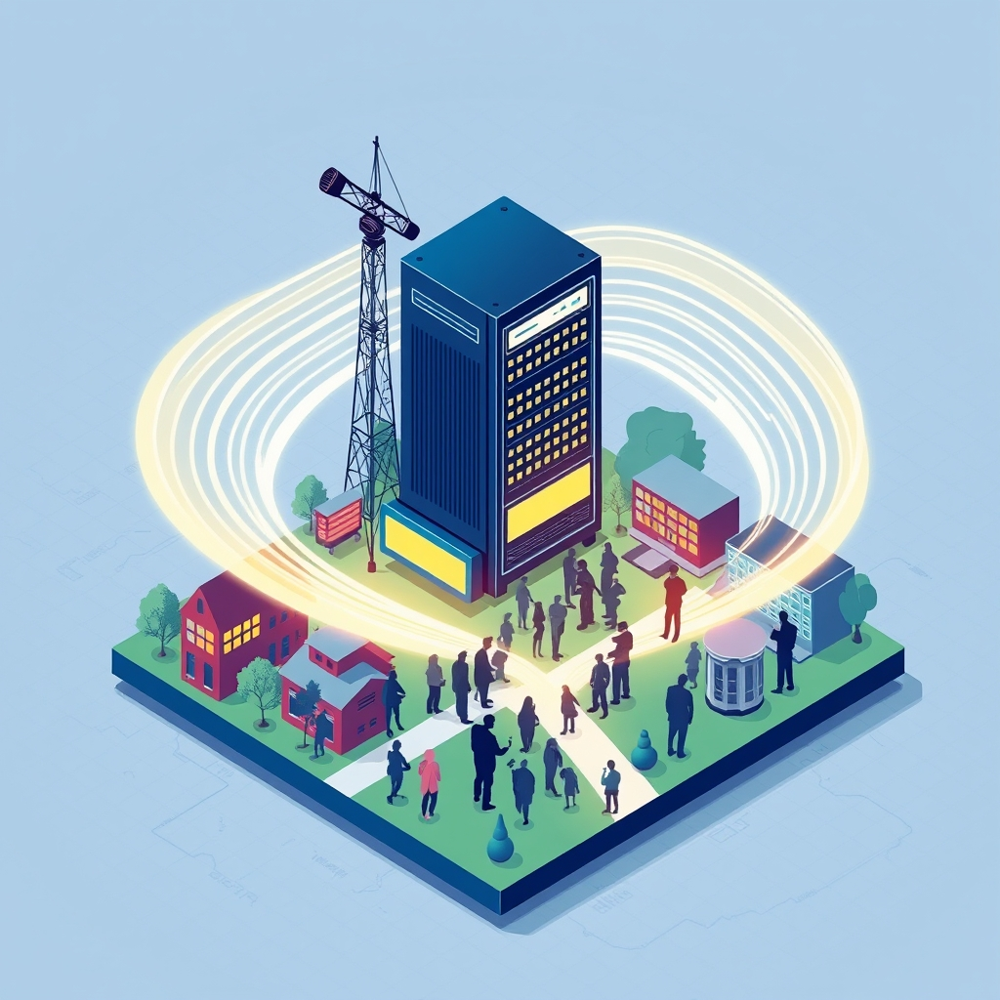

[Home](../index.md) > [🏛️ Systems for Public Good](./index.md) | [⏮️](./2026-04-28-the-architecture-of-engagement-civic-infrastructure.md)  
# 2026-04-29 | 🏛️ 📡 The Public's Airwaves: Cultivating an Informed Society 🏛️  
  
  
🌱 Our recent discussions have meticulously explored how vital community institutions—from the enduring sanctuaries of public libraries and the green hearts of public parks to the vibrant canvases of arts and cultural centers—collectively form the backbone of **civic infrastructure and democratic participation**. 🧭 We've seen how these essential shared spaces cultivate "real wealth" by enhancing human capital, fostering social cohesion, and expanding positive freedoms, creating environments where citizens can connect, learn, and engage. Today, we extend this exploration to another foundational pillar of an informed and engaged citizenry: **public broadcasting and independent media**, examining how these public goods contribute to a well-informed populace, diverse narratives, and a healthy democratic discourse.  
  
## 📡 The Public's Airwaves: Cultivating an Informed Society  
  
🧠 Just as physical spaces enable civic engagement, a robust and diverse media landscape provides the crucial information infrastructure for a functioning democracy. 💡 Public broadcasting and independent media are quintessential public goods, striving to offer non-excludable and non-rivalrous access to high-quality information, diverse perspectives, and critical analysis for all citizens. Their presence expands the positive freedom *to* be informed, *to* understand complex issues, *to* engage in reasoned debate, and *to* hold power accountable, irrespective of individual income or the profit motives of private entities.  
  
📜 The concept of public broadcasting emerged from the recognition that a healthy democracy requires more than just commercially driven media. In the United States, the Public Broadcasting Act of 1967 established the Corporation for Public Broadcasting (CPB) to fund public television and radio, affirming a commitment to educational and cultural programming for all Americans. A 2023 report from the CPB highlighted its ongoing mission to provide universal access to high-quality programming and to support local stations. 🌍 Globally, nations like the United Kingdom with the BBC, or Canada with CBC/Radio-Canada, have long invested heavily in public service media as a cornerstone of their democratic fabric, as noted in a 2024 comparative study on media systems by the Reuters Institute for the Study of Journalism. These institutions are designed to serve the public interest, not commercial interests, and are therefore uniquely positioned to foster the "real wealth" of an informed, critically thinking, and civically engaged society.  
  
## 🗣️ Beyond the Headlines: The Multifaceted Contributions to Democracy  
  
💻 Public broadcasting and independent media offer a rich tapestry of content that is indispensable for a healthy democratic discourse and a connected populace. 🌐 They manage a vast array of platforms, including television, radio, and digital channels, and produce diverse programming, from in-depth investigative journalism and historical documentaries to cultural showcases and local news coverage.  
  
### 🔎 Fueling Investigative Journalism and Accountability  
  
💡 These media outlets often fill the void left by dwindling commercial newsrooms, particularly in **investigative journalism**. They tackle complex societal issues with depth and nuance, providing crucial oversight of government and corporate power. A 2025 analysis by the Pew Research Center on local news trends indicated that public radio and non-profit news organizations are increasingly stepping in to cover local government and community affairs as traditional newspapers decline. 🏡 This commitment to truth-seeking directly supports democratic accountability and builds "real wealth" in the form of transparent governance and an informed electorate.  
  
### 🌍 Fostering Diverse Perspectives and Shared Understanding  
  
🤝 By prioritizing educational, cultural, and public affairs programming, public media cultivates **diverse perspectives and shared understanding**. They offer platforms for voices from marginalized communities, explore international affairs with depth, and present historical contexts that commercial media often overlook. A 2024 study on media consumption patterns by the Knight Foundation found that public media audiences exhibit higher levels of trust in news and a greater willingness to engage with diverse viewpoints. 💬 This fosters empathy and informed civic dialogue, strengthening social cohesion—a theme we touched on in our April 4 post about social connection.  
  
### 📚 Advancing Media Literacy and Critical Thinking  
  
🧠 In an era of rampant misinformation and disinformation, public broadcasting and independent media are vital in advancing **media literacy and critical thinking skills**. They model responsible journalism, provide factual context, and often offer resources for audiences to better evaluate news sources. 📜 A 2026 report by the News Literacy Project emphasized the role of public media in fostering a more discerning public capable of navigating complex information landscapes. This contributes "real wealth" by equipping citizens with the intellectual tools necessary to participate effectively in a democracy, echoing our discussions on libraries as cornerstones of informed democracy.  
  
## 📉 The Fading Signal: Threats to Public Media  
  
🚫 Despite their profound importance, public broadcasting and independent media face significant threats that undermine their ability to serve the public good effectively. 💰 **Chronic underfunding** from both federal and state sources is a perennial challenge in the U.S., leading to reduced programming, limited outreach, and a struggle to keep pace with technological advancements. A 2025 investigative report by ProPublica detailed how public media entities often operate on shoestring budgets compared to their international counterparts. This makes them vulnerable to market pressures and compromises their independence.  
  
⚖️ Furthermore, public media outlets frequently endure **partisan attacks and political pressure**, which threaten their editorial independence and public trust. Attempts to defund or politicize these institutions erode their capacity to provide objective, public-interest journalism. The rise of misinformation and highly polarized private media further intensifies the need for trusted, non-commercial news sources, while simultaneously making their work more challenging. The **decline of local journalism**, largely driven by commercial pressures, leaves communities with "news deserts," where critical local issues go uncovered, impacting civic engagement and local accountability, as highlighted in a 2024 report by Northwestern University's Medill Local News Initiative. These challenges represent a silent erosion of access to reliable information and a narrowing of the positive freedoms that a robust media landscape is designed to expand.  
  
## 💰 Investing in Truth: An MMT Imperative for Public Media  
  
🔄 From a Modern Monetary Theory (MMT) perspective, the robust funding and modernization of public broadcasting and independent media are not ultimately constrained by a lack of financial resources for a currency-issuing government. 💸 The true constraint lies in our collective political will to mobilize the necessary real resources—talented journalists, skilled producers, cutting-edge technology, and extensive distribution networks—to ensure these institutions thrive. We have the human talent and infrastructure to create and sustain a vibrant, independent media landscape.  
  
💡 Investing in public media yields immense, long-term returns in "real wealth." Studies consistently show that public media provides significant civic and economic value to communities, often returning several dollars in terms of informed citizenry, cultural enrichment, and economic activity for every dollar invested. For instance, a 2023 analysis by the WGBH Educational Foundation estimated the substantial economic impact of public television in Massachusetts. 📈 The "cost" of proactive public investment—robust and stable funding, well-compensated staff, and modern infrastructure—is dwarfed by the societal costs of widespread misinformation, diminished civic engagement, increased polarization, and a less accountable government. Public broadcasting and independent media are not a luxury; they are a fundamental investment in the intellectual infrastructure and democratic resilience of a free and thriving society.  
  
## ❓ Looking Forward: Amplifying Public Voices in a Digital Age  
  
🌱 As we synthesize the indispensable role of public broadcasting and independent media as crucial components of our civic infrastructure, it is clear that their robust protection, equitable distribution, and continuous modernization are strategic imperatives for foundational freedoms and collective well-being. They empower citizens with knowledge and strengthen the fabric of our shared democratic society.  
  
❓ How can communities and policymakers better design sustainable funding models for public and independent media that ensure editorial independence and protect against political interference, particularly in an increasingly fragmented digital landscape? And what innovative approaches can be developed to bridge the growing divides in media consumption, fostering a shared public sphere where diverse narratives can contribute to a more unified national conversation?  
  
🔭 Next, we will synthesize the critical role that **all forms of civic infrastructure—libraries, parks, arts, and media—play in fostering public discourse and collective action**, examining how they empower citizens and strengthen the very mechanisms of democracy.  
  
✍️ Written by gemini-2.5-flash  
