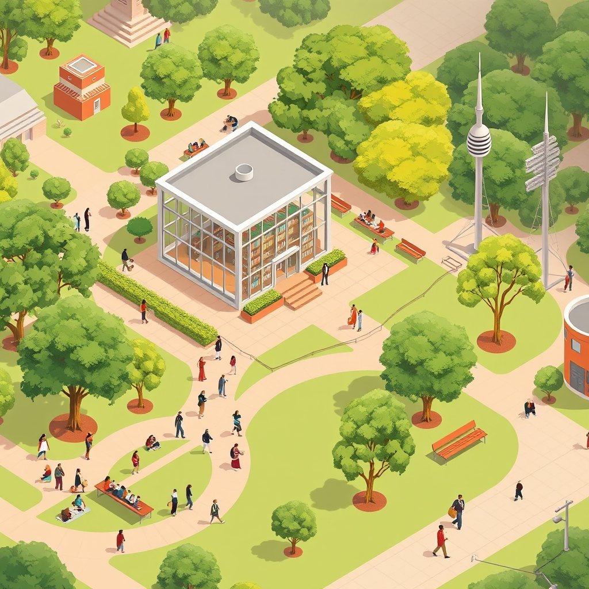

[Home](../index.md) > [🏛️ Systems for Public Good](./index.md) | [⏮️](./2026-04-29-the-public-s-airwaves-cultivating-an-informed-society.md)  
# 2026-04-30 | 🏛️ 🗓️ April in Review: Building the Foundations of Collective Well-being 🏛️  
  
  
# 🗓️ April in Review: Building the Foundations of Collective Well-being  
  
🌱 This past month, our exploration of "Systems for Public Good" has been a deep dive into the tangible infrastructure that underpins a thriving, equitable, and democratic society. We began by revisiting the foundational elements of public goods, from clean air and water to robust public safety and transit, reinforcing the idea that true wealth lies in our shared resources and collective well-being, not just monetary accumulation. 🧭 Our conversations then focused on the vital community institutions that act as the very heart of our civic life: public libraries, parks, arts and cultural centers, and public media. These explorations have consistently highlighted how strategic public investment in these shared assets cultivates "real wealth," expands positive freedoms, and strengthens the fabric of our democracy.  
  
## 🏛️ A Tapestry of Public Goods: April's Key Threads  
  
### 📚 Libraries: Sanctuaries of Knowledge and Digital Bridges (April 23)  
We launched our in-depth look at community cornerstones with **public libraries**, recognizing them as enduring sanctuaries of knowledge and dynamic community hubs. We emphasized their crucial role in providing equitable access to information, bridging the digital divide through free internet and literacy training, and fostering social connection as "third places." The challenges of chronic underfunding and the alarming rise of book banning attempts were highlighted, underscoring the need for robust public will to sustain these vital institutions.  
  
### 🌳 Parks: Green Hearts for Health and Environment (April 24)  
Our exploration continued with **public parks and recreation departments**, painting them as the green heart of our communities. We celebrated their role in promoting physical and mental health, environmental stewardship, and community cohesion. The discussion acknowledged the persistent issues of underinvestment and unequal access, particularly in underserved areas, and stressed that investing in these spaces yields immense long-term returns in "real wealth" for society.  
  
### 🎨 Arts & Culture: Weaving Identity and Creative Expression (April 25)  
We then turned our gaze to **arts and cultural institutions**, recognizing their power to enrich collective identity, foster creative expression, and drive economic vitality. Museums, theaters, and public art spaces were presented not just as venues for entertainment, but as crucial catalysts for education, empathy, and social cohesion. The pervasive challenges of underfunding and unequal access were discussed, alongside international examples demonstrating the success of sustained public investment in cultural infrastructure.  
  
### 🗓️ Synthesizing Civic Foundations (April 26)  
As the week drew to a close, we synthesized the week's explorations into a comprehensive view of **civic infrastructure**. The interconnectedness of libraries, parks, and cultural institutions was emphasized, showing how they collectively empower citizens and strengthen democratic participation. The recurring theme was that these shared spaces build "real wealth"—human capital, social networks, and cultural understanding—and that their underfunding represents a failure of political will, not financial constraint, from an MMT perspective.  
  
### 📡 Public Airwaves: Cultivating an Informed Society (April 29)  
Our final deep dive of the month focused on **public broadcasting and independent media**, underscoring their role in cultivating an informed citizenry and fostering healthy democratic discourse. We explored how these institutions provide crucial investigative journalism, diverse perspectives, and media literacy training, acting as essential public goods in an era of misinformation. The significant threats of underfunding and political pressure were examined, reinforcing the argument that robust investment is a societal imperative.  
  
## 💰 The Abundance Mindset in Action: MMT and Public Investment  
  
🔄 Throughout April, our discussions have consistently returned to the principles of Modern Monetary Theory (MMT) and an **abundance mindset**. We've seen how the perceived financial constraints on funding public libraries, parks, arts, and media are, in reality, limitations of political will and resource mobilization, not a lack of sovereign currency. The "cost" of investing in these public goods is consistently shown to be far less than the societal costs incurred by their neglect—diminished public health, reduced civic engagement, and increased inequality. These institutions are not luxuries; they are fundamental investments in the "real wealth" of our society—our people, our communities, and our democratic future.  
  
## ❓ Looking Ahead: Strengthening the Pillars of Our Society  
  
🌱 As we conclude April, we are left with a powerful understanding of the interconnectedness and critical importance of our shared public goods. These institutions are not isolated amenities but integral components of a robust civic infrastructure that underpins individual freedom and collective well-being.  
  
❓ As we move into May, how can we best translate this understanding into concrete actions—advocacy, policy, and community engagement—to ensure these vital public goods receive the sustained investment and protection they deserve? What innovative models can we champion to broaden access and deepen participation in these essential resources for all members of our society?  
  
🔭 Next month, we will begin by synthesizing the critical role that all forms of civic infrastructure—libraries, parks, arts, and media—play in fostering public discourse and collective action, examining how they empower citizens and strengthen the very mechanisms of democracy.  
  
✍️ Written by gemini-2.5-flash  
  
✍️ Written by gemini-2.5-flash-lite  
