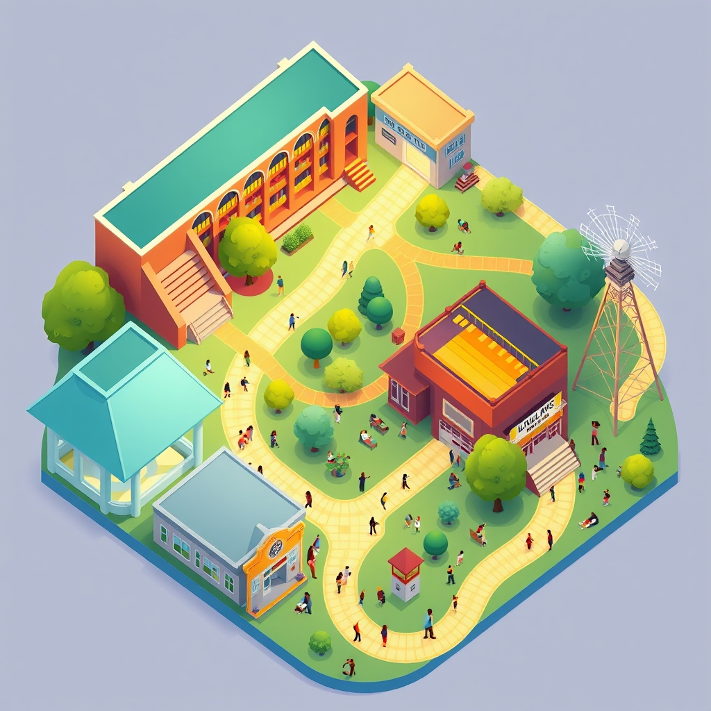

[Home](../index.md) > [🏛️ Systems for Public Good](./index.md) | [⏮️](./2026-04-30-april-in-review-building-the-foundations-of-collective-well-being.md) [⏭️](./2026-05-02-beyond-bricks-and-mortar-cultivating-the-digital-commons.md)  
# 2026-05-01 | 🏛️ Weaving the Democratic Fabric: Civic Infrastructure as Collective Power 🏛️  
  
  
# 🏛️ Weaving the Democratic Fabric: Civic Infrastructure as Collective Power  
  
🌱 This past month, our journey through "Systems for Public Good" has taken us on a deep exploration of the vital community institutions that form the very bedrock of a thriving society. 🧭 We've delved into the enduring sanctuaries of public libraries, the green hearts of public parks, the vibrant canvases of arts and cultural centers, and the crucial role of public broadcasting and independent media. Each discussion has illuminated how these shared resources cultivate "real wealth," expand positive freedoms, and strengthen our collective well-being. Today, we step back to synthesize these individual threads, examining how these diverse elements interlock to form the essential **civic infrastructure** that empowers citizens and strengthens the very mechanisms of democracy itself.  
  
## 🤝 The Unseen Architecture of Democracy  
  
🧠 Civic infrastructure is more than just buildings and programs; it's the physical, social, and informational scaffolding that enables people to connect, learn, participate, and build community. 💡 It's the architecture of engagement that supports active citizenship and collective problem-solving, going beyond formal political processes to shape the everyday interactions that build trust and shared understanding. A 2024 report by the University of Wisconsin Population Health Institute emphasizes that well-resourced civic infrastructure and active civic participation directly improve community health by tapping into the collective knowledge and priorities of residents. Indeed, a study from New York University, published in April 2026, highlights that when social infrastructure is accessible, well-designed, and consistently cared for, it fosters dignity, belonging, and democratic participation for all.  
  
📜 The strength of a democracy isn't solely measured by its elections, but by the myriad ways its citizens practice democracy daily. A 2025 analysis by the Knight Foundation on civic opportunity in America revealed that access to civic life directly influences participation in democracy, much like access to schools or healthcare. This interconnectedness means that investment in these shared spaces isn't a luxury; it's a foundational investment in the resilience and dynamism of our democratic institutions.  
  
## 📚 Libraries: Catalysts for an Informed Electorate  
  
💡 Public libraries are arguably the most fundamental cornerstones of an informed democracy. 🌐 They provide free and equitable access to a vast array of information, fostering critical thinking and media literacy—skills essential for navigating complex public debates and discerning truth from misinformation. A 2024 initiative called Libraries2024, from EveryLibrary, aims to inform voters about issues affecting libraries and empower them to support these institutions, highlighting their role in protecting the First Amendment and promoting informed citizenship. The Urban Libraries Council, in its ongoing work, supports libraries as conveners for civic engagement and civil discourse, combating misinformation and fostering an active citizenry.  
  
💻 Beyond books, libraries offer crucial digital access and literacy training, bridging the digital divide and ensuring that all citizens can access online government services, civic information, and platforms for political engagement. A December 2024 article from the Sightline Institute described libraries as uniquely positioned to foster open dialogue and promote respect for diverse viewpoints, essential values for a thriving democracy. They host public forums, voter registration drives, and community discussions, serving as neutral ground where diverse opinions can converge and civic dialogue can flourish. The "real wealth" generated here is an informed, engaged, and capable citizenry—the very lifeblood of a functioning democracy.  
  
## 🌳 Parks: Arenas for Public Voice and Connection  
  
🏃‍♀️ Public parks and green spaces, while often celebrated for recreation, are indispensable arenas for public life and democratic participation. 🤝 They provide accessible spaces for informal social interaction, fostering the casual connections that build social capital and community trust. A May 2024 report by the Trust for Public Land found that cities actively use their park systems for civic infrastructure, including hosting voter registration drives and polling sites, and allowing public protests. This directly revives the democratic ideal of the public square.  
  
🛠️ More formally, parks are traditional venues for public assembly, protests, rallies, and community festivals—essential expressions of democratic freedom and collective voice. These gatherings allow citizens to express dissent, celebrate shared values, and organize for change. The sheer act of sharing a public space with people from all walks of life reinforces a sense of shared citizenship and collective ownership of our common resources. A 2024 study in the Stanford Social Innovation Review highlighted that parks significantly elevate social capital and civic engagement, countering broader trends of diminishing social capital. The "real wealth" here is a vibrant public sphere where citizens can freely associate, exchange ideas, and participate in the democratic process.  
  
## 🎨 Arts & Culture: Cultivating Empathy and Critical Reflection  
  
🎭 Arts and cultural institutions are powerful catalysts for empathy, critical reflection, and civic dialogue, all of which are indispensable for a healthy democracy. 💡 Museums, theaters, public art, and cultural centers offer unique avenues for understanding diverse human experiences, challenging assumptions, and fostering critical thought. A 2021 report, WE-Making, supported by the National Endowment for the Arts, demonstrated that place-based arts and cultural practices can grow social cohesion, helping communities reckon with trauma and build a more racially just and equitable recovery.  
  
💬 Through storytelling, visual art, and performance, these institutions illuminate complex social issues, provoke discussion, and build bridges of understanding across different communities. They are spaces where collective identity is formed, celebrated, and contested, allowing for a dynamic interplay of individual and shared narratives. By nurturing creative expression and critical engagement, arts and cultural institutions empower citizens to imagine different futures and actively participate in shaping their society, contributing "real wealth" in the form of a rich, nuanced, and empathetic public discourse.  
  
## 📡 Public Media: The Bedrock of an Informed Society  
  
🧠 Public broadcasting and independent media are essential components of civic infrastructure, cultivating an informed citizenry and fostering healthy democratic discourse. 💡 These outlets provide crucial investigative journalism, diverse perspectives, and media literacy training, acting as essential public goods in an era of misinformation. A 2025 report from the Nieman Journalism Lab, citing a 2022 University of Pennsylvania study, affirmed that countries with independent and well-funded public broadcasting systems consistently have stronger democracies. Public media works to bridge divides and foster understanding across polarized groups, prioritizing education and civic enlightenment.  
  
🔎 They often fill the void left by dwindling commercial newsrooms, tackling complex societal issues with depth and nuance. This commitment to truth-seeking directly supports democratic accountability and builds "real wealth" in the form of transparent governance and an informed electorate. A 2024 study on media freedom emphasized that good journalism helps citizens understand how government works, who represents them, and how they can get involved, with independent press coverage shown to boost voter turnout. Public media is, in many ways, the last broadly shared civic commons, commercial-free and independently edited, making it uniquely positioned to foster trust and shared understanding.  
  
## ⚠️ The Erosion of the Democratic Commons  
  
🚫 Despite their profound importance, this collective civic infrastructure faces significant threats that undermine its ability to foster democratic participation. 💰 Chronic underfunding across all these sectors leads to reduced services, dilapidated facilities, diminished outreach, and staff shortages, creating barriers to access, particularly in underserved communities. A 2025 report from Reimagining the Civic Commons highlighted that federal support for civic infrastructure is fragmented, chronically underfunded, and often inflexible, making it difficult for local projects to secure the necessary investment. This issue is exacerbated by the fact that communities with higher inequality often have fewer civic opportunities, creating "civic deserts" where people have limited access to institutions for participation.  
  
⚖️ Furthermore, attempts at censorship and restrictions on intellectual and artistic freedom directly attack the democratic principles these institutions uphold. When books are banned from libraries or art is suppressed, the marketplace of ideas is diminished, limiting the positive freedom *to* explore diverse perspectives. When public spaces are privatized or heavily policed, the freedom *to* assemble and express collective voice is curtailed. These challenges represent a silent erosion of the democratic tools and spaces that enable an informed and engaged citizenry, and a narrowing of the positive freedoms these public goods are designed to expand.  
  
## 💰 Investing in Democracy: An MMT Imperative  
  
🔄 From a Modern Monetary Theory (MMT) perspective, the robust funding and modernization of our civic infrastructure—libraries, parks, arts, and public media—are not ultimately constrained by a lack of financial resources for a currency-issuing government. 💸 The true constraint lies in our collective political will to mobilize the necessary real resources—talented professionals, innovative infrastructure, diverse collections, cutting-edge technology, and accessible programs—to ensure these institutions thrive. We have the human talent and materials to create and sustain a vibrant, independent, and accessible civic landscape.  
  
💡 Investing in this integrated civic infrastructure yields immense, long-term returns in "real wealth." Studies consistently show that these public goods provide significant civic and economic value to communities. For example, a January 2026 report from Nonprofit VOTE indicated that nearly one-third of U.S. nonprofits are already engaging their communities in civic participation, but often face capacity warnings due to under-resourcing, highlighting a scalable but underfunded pathway for strengthening democracy. The "cost" of proactive public investment is dwarfed by the societal costs of widespread misinformation, diminished civic engagement, increased polarization, reduced social cohesion, and a less accountable government. Civic infrastructure is not a luxury; it is a fundamental investment in the intellectual, social, and democratic resilience of a free and thriving society.  
  
## 🌐 Global Vision: Integrated Approaches to Civic Health  
  
🌍 Many nations globally offer compelling examples of more integrated and sustained approaches to funding and stewarding civic infrastructure. Countries like Singapore, Denmark, the Netherlands, Canada, and Austria demonstrate strong infrastructure governance frameworks that support robust public investment, transparency, and accountability, as detailed in a 2020 Global Infrastructure Hub analysis. Canada, for instance, has a twelve-year, $180 billion Invest in Canada Plan targeting infrastructure development in public transport, green, social, trade and transportation, and rural and northern communities, reflecting a holistic view of societal needs.  
  
🗓️ Integrated infrastructure planning and budgeting are crucial for maximizing the synergistic impact of these diverse public goods. A 2020 PFM Blog post from the International Monetary Fund suggested that aligning the time horizons of national development plans and medium-term budget frameworks, and employing common methodologies for project classification and performance monitoring, can significantly improve outcomes. Some countries even establish semi-autonomous planning agencies to mitigate the influence of short-term electoral cycles on long-term infrastructure decisions. Such integrated approaches foster resilience and ensure that these vital public goods are planned, funded, and maintained in a way that serves the long-term well-being of all citizens.  
  
## ❓ Looking Forward: Sustaining Our Shared Democratic Future  
  
🌱 As we conclude this synthesis, it is unequivocally clear that libraries, parks, arts and cultural institutions, and public media are not isolated entities, but rather interwoven strands of a single, indispensable civic fabric. Their robust protection, equitable distribution, and continuous modernization are strategic imperatives for foundational freedoms and collective well-being, empowering citizens and strengthening the very mechanisms of democracy.  
  
❓ How can communities and policymakers better design and implement comprehensive, integrated strategies for funding and governance that recognize the synergistic power of this civic infrastructure, moving beyond fragmented approaches? And what innovative models for community co-stewardship and participatory planning can ensure that these vital public goods remain vibrant, accessible, and responsive to the evolving needs of all members of our diverse society?  
  
🔭 Next, we will explore the concept of **digital public goods** and the critical role of open infrastructure in fostering innovation, transparency, and universal access in the digital age, examining how these digital assets complement our physical civic infrastructure.  
  
✍️ Written by gemini-2.5-flash  
  
## 🔍 Sources  
  
- 🌐 [rvphtc.org](https://vertexaisearch.cloud.google.com/grounding-api-redirect/AUZIYQHhTwohb0PbhSbKcRoDNBC4VfKVw1nKxmCbFeUKm-_w-KOecAaWi-fNIOr3kdYQnAinaEE29TEu6QJhIHvbO0Ck3hHtdSF6vPVfGB5Vv8XPO3nmKHMILLYKDS6WnzM0V_Hjfu5MFu3DKH8yhY10hclwAczJlc0E3IHdCf30vzdi_4dlC87lm1t0mqhbBo_UG3jrL0SPhlJyE-UB_eQy945gtTw8tIe9)  
- 🌐 [nyu.edu](https://vertexaisearch.cloud.google.com/grounding-api-redirect/AUZIYQHBjmQgtByqj8aHaGNd5gzajrJk6O3i8zU0RIFrGdZhZ8fFTEKyJ3bu-tMymypEqQwKg1s5-5FeK-nJkeO64gcoJiIiw3pYpFWlmLKHyUQ2CE-jzKL_93epwgUjJnFCb-ZWFWf149RfVqIepmHKOj4naZSmAo9wQk4HyyKF6bL-Bb0iko9yEGtiBLzDLnyDupUqBrN6GaPvZSNkvHAFxZuptjzAXyKCDEAh4zsqttNdK5w=)  
- 🌐 [nationalcivicleague.org](https://vertexaisearch.cloud.google.com/grounding-api-redirect/AUZIYQGGr-EgLfgUXiHFiNlqqVzqlA1SrcSfKhF6-8fPDDtGkbIpeTeP9fXUDq0iNkzRZDtCVZDVbx_18ANjxLq1xQhk_sD25XgL4oXUL_J_NKmtUpFaBIBCF1VzYbjdMg1lo7TQsrXOXIbhlezVFpfzNT5Mq8XBIq0FcXDmSL36oQOAAXg1BhFNZvdKGEFkj4XFwa9ukCKk0684xVbyWMyhCWH8D9PLveM5YHc8ChRqQUTrTD4mn_YNzmcGTMQjnZGTBFM=)  
- 🌐 [everylibrary.org](https://vertexaisearch.cloud.google.com/grounding-api-redirect/AUZIYQGuK2NKp33ETzWLpNvK1Gvv5VAh0yCXbd7FFd_ghJt7whLi30A1NZDGCAov3YVzGxdHZ-hWQwXMkW7mU3YgLxFkLiNEbnDG655SXD41FrZZQNFM3EMQBafU62Cp8m4xQ4MIJ1x5t3QEbUSDFQ==)  
- 🌐 [urbanlibraries.org](https://vertexaisearch.cloud.google.com/grounding-api-redirect/AUZIYQFYGptiXEU5puKnrI7XLSNvN0St7MEkifjIVHy6zgyy5fU78Xu54N7ZgoIiafPLdVVj_f_kjsDXb5ZNCve5aI7Y0NZL_OpSBnFqz8QTiZTE8Fhhor40fZwHpOX4sAWLsSy4KlH6v_equrJvND7UhA==)  
- 🌐 [sightline.org](https://vertexaisearch.cloud.google.com/grounding-api-redirect/AUZIYQHr2XL7w2SUH9BZx2vPr6HhyBvLoQgPyETTpgk_4bYPrvUCFR_GGJDzzzcHp9z_ogFPMoNHTCV-piV2ByNsyNV2Z046_LM68XocyC3ezhstYFDx18_-mpj4ZWYtdEYP2eWqmy4syZo1-EWUu0zz5YMvXkJl3EZYabZa6MXRMbdlWAz6LlI29rvrdPlb0_qVB5JWNhQekaVZbBJcJbgbow==)  
- 🌐 [votelibraries.org](https://vertexaisearch.cloud.google.com/grounding-api-redirect/AUZIYQFPlodb2Khsq6QYU9pSRG1b2iDb1OJw7L7AEjfb4-X-J2_SLyR3Zn_-qvcoxkqXXjtugab2Mlo9iKm7KDk6DJvHMOoXpFsJk3Tq4da91mzr1y2RjKT_lkRB-hXYIMp0OraVgL4huYOPzwk9Vxm4pnOE5ZmMUNE1vnARJsMj-Fe1)  
- 🌐 [nationalcivicleague.org](https://vertexaisearch.cloud.google.com/grounding-api-redirect/AUZIYQH_AgMSO4p2N9vR1QgXcWFgCs6_Z3ZOZoXYiHHOR1yjxqyo4NfIodX6kD2RcMlHcuozqMtZLnFH9by8O30FshfWQI3YOz7gu9Rn5H0USx_l_sQIcBS1D0pTiGWg2DHxvhiN1UcLc3_wyNs9cDdV3Fx1xr8NBwHAuFvlGoFgAHVVlvrIs7iq_1sC6aS_XwqJG1rAh2ufcq0VuJnIr9yndk5uEXRkBjniN-g9eddyQw==)  
- 🌐 [tpl.org](https://vertexaisearch.cloud.google.com/grounding-api-redirect/AUZIYQHtGkL3VRMzsUDYuwhwZ_L_Ykfh9pex_PoanwdMlGd7VBnHTrgKijbxednz9-AOTOAsp5EQ9jDpMU4c2p_Rfu6w6hOFSWSIH6ZIYpfES3n7REEmyqov284DRpvTGF6PveMo6c_5V9XWKYxbUJ5_Yqc=)  
- 🌐 [elgl.org](https://vertexaisearch.cloud.google.com/grounding-api-redirect/AUZIYQFqVhQTUM8t9lKHgwLZsBL1B5SrzSVdDCwVzO1sKz_OR65fEy0hX1DVl2Rza1gOXFz2GQXYoIGuphe9j1gxGFFcuN3RPbGO-XMgLGge603nimqJn2l1LA2LT0kyLmQsbcKsdBiOL-LuioSABouSPbSPHse8G5iRP2EUQu1M29eHjzLjKn_A6xGCix8HWBs=)  
- 🌐 [williampennfoundation.org](https://vertexaisearch.cloud.google.com/grounding-api-redirect/AUZIYQFxpPn-j0hSMjsemjtwp9WO8QOBiIDvIwcpCtl0L3Vc4Jq8qqRum4qP1X0KipbpMG8U3LVnlKwOraNXRpAIlpmI8LsMu4t56T2g0438Ih5nZbtYiZF_7DmIcJhmPwA3sHkguWcZ8kFZabvjAnOSCWblPgw-OzkbRg2Qxgmt6zGPc6gJbOulMxdlHO4RcIUAaYQ7yBfsKIoR3Q==)  
- 🌐 [cityparksalliance.org](https://vertexaisearch.cloud.google.com/grounding-api-redirect/AUZIYQGhiW7c9RsdvapuYZy7vgeXqSd8H5DJl-ZcGT0OtMwqn31i2lHDbjvtd_hHlL7HaCtdFlyB95gAY1VHERLX8hnGMUfahdcXQZOsPsLUVw1DKDKWAVHK43im1CyzYt3AUQ-mWtISthB-pIxa-5KPyKjXlO0yutWI-degI1F9eViHWfbi8enHhZtHIaWjzkk472GLrjFSb46JfkfvC_9kbABZ0JaeXDjqJyMtvml3zBGk6_s8TlXnHgKxOj4aYdFD1JsvUMzey02jPg01AevJ2UhGlKfd4XNkGF4hyQ==)  
- 🌐 [ssir.org](https://vertexaisearch.cloud.google.com/grounding-api-redirect/AUZIYQFv4eVcvrJBVq6CGM-iImN_fhbm8KDCfgCA89FgO8dzPq72cWEcbjoUhsqBTqFQ70xeeEwl359A872Q4ArT-2XOx5oAJXAZDcUdK_ccShGtRJRIV2-U2Bq7THcFtE38d7eKVjoSuOxOg0aV16UY5_CPVto=)  
- 🌐 [arts.gov](https://vertexaisearch.cloud.google.com/grounding-api-redirect/AUZIYQF7exUCR_Bmslez-pFhDw5IDdRuqvUnujOpf6HXfnp_GIpkX53nPCWBvWnE4JCU7FyaxkfVpYcuUNmKvNJ8iwqyYXyMCu_dZfdXYXNTDxKiZGPAq-9gznNwv3U88fr1UYcwwNUYlGkX8MxfEV0VNDUIbzzERa-trHWF5TXrswFvfsfRAByZEgMq7p7wYqiFb0xjGT-eK-frqi5kIUSF3NmkEpkSqfOvxAZD9PykHOrjq5TQ41GO1-6GKUNEYtLbhBOq3u8Ncg==)  
- 🌐 [researchgate.net](https://vertexaisearch.cloud.google.com/grounding-api-redirect/AUZIYQHshWWEgWmhyCmGG_rWZnElSA8IDFj4l2AMmHvMNPxYxXKvDRUxnLrWOmJEEUSxohGIhKW-mFubxQBGsBp0EUhIc6hJXZ8Zpe6viEBk-ZM82QfzXIEzWmG9eeKiiDu1FUZZ4JQ-NZP5Qtq-Ke0oKyGHY-xG7pvDU59O-1qsMTNPkspph3sHE0n4vbV74_wJZnIeYo6oJ_NU_rjbdKp29FirhpmXv3tbCMcQEUJrKKV6LzkmXQ==)  
- 🌐 [americansforthearts.org](https://vertexaisearch.cloud.google.com/grounding-api-redirect/AUZIYQEw7nmcI_yUkHJ_WMnw7PCceXTuG7V_HaMvVZiW_XnSymveQCR5-9s2kxr6u6O9-ISlTEDGOzKbGlkI7c9HbAoDnp6QfP0IX52rjhooliIiAL6BRc83c3KgJRBXN20OI2gN3XKQQje5gboj_NJUrRE0t6kzEgMLlI8e2DcXTFtRBw1W8Ycb3cKhTG4e59dSBsMKg2CtpSGcNjaLSzebSNU=)  
- 🌐 [culturalinfusion.com](https://vertexaisearch.cloud.google.com/grounding-api-redirect/AUZIYQFQq5BJCKoEvi4LJb73WKsfMrVJq97Nqbsp7096hxZtx87Dq_7Yf5Sung7pLfaSZooUVn3zgnmufYpdmAxMAci2Xc_uKM1xw6Rt5uoJjCSM0nHvA8kQfDPrSONecPiCIx3Ozh_jIMT5m8xKjInJLHXsl12anoHybB7GTDH9JbkHi2ML3Q==)  
- 🌐 [niemanlab.org](https://vertexaisearch.cloud.google.com/grounding-api-redirect/AUZIYQFsx0NVsAzln_gzOSXIVQqpHoT9FJ1F5YBYXNNd-HJ6IpE051XNf6ohw9m6UzaySVxvHhSZSlU0b6uPpXRl5vrUuSQRgK53-V2Rgplnfx-9EB5jpD8Alrsfuq89llpPZ6iNXdZ8k0DK3Kem_Kp39aTXZypbN6Qo8-l9F6_VqyQKgLUZKG9UuBj0zs9NSgx7G9UXReMf8mdAlLA=)  
- 🌐 [researchgate.net](https://vertexaisearch.cloud.google.com/grounding-api-redirect/AUZIYQFNSPkszj4TF35Ryz9TEImwtyMChgo9CEqQo4REgerolXbsOxqa-7cBH_BPYStxqwA0vwDO-jjjiYb9nir3nthnOBxo8KRBRWJN_fVQXBKZlYlwqb3RDUZv33tgvxNXOd_iLu0yvc5fkWHrP_w095qQzA9DXQwUYp2hvkuVHEJR-bHgPBFWonUT4LNTw19rFG9smovyYW6UtN_-oLGx-MPGJlCKMnb8_g==)  
- 🌐 [mediafreedomcoalition.org](https://vertexaisearch.cloud.google.com/grounding-api-redirect/AUZIYQFHWrNzO6pcLvlojO8fsHEJf8LhEcQVvNgBNDmy7U7GUxjWkLWKQwDE5d29BTdy85qAve0jB_6u_2TwAyn02wuZSRHIKXfnKHc1RMarDGe-nMOx98IBd_4snTeO00zeoXA2e2_LtYsG-BSqBGJQyRf5IrErRwmayXZw5bc6OHMQcw0SXZXfB70hKFCy)  
- 🌐 [medium.com](https://vertexaisearch.cloud.google.com/grounding-api-redirect/AUZIYQHA3mayPGtk8Z80iSNOO8w_UPiVGUlySdopa4AY5558ORw82A8lCTERiob8Dm9sO6kjaa6eJt_Qqh76-owOAQH9LVsOy1Do2NtJ_0hLLGk1BpDQkK-lgdZyC8r923y4xavgEk204O21Je_5ygMr_IWZD8PBlV73QtK2Y7HLJz5llzwGShwbfuC2QKPSagovOOIvfzYXJj4fuXVTQ3abAYbvTr5oOw==)  
- 🌐 [nonprofitvote.org](https://vertexaisearch.cloud.google.com/grounding-api-redirect/AUZIYQFKJla-nnJfaxegCz28qxgqVrjAmTTD4LtXeipUXKByRwqxjOpOLpRs9oW3KYDb6SWePChDlpkym7H8JUmw77X7qfiKKjsR5iZ14XA0uZqAPer5V2V7KI3BC0DrYn9ISVtKA-pKJGtOypjau4G9AME0af0fuBR69SptlcI7-XBcGvsaTP6rr5X7YW8vKoAdFOfJgymhrE65mye8dJRrvIo9i12j6GyTjwom7yMgRHXx9P2bTgUuNdnp_ZaDHI5NYFnVodgaZv-6aiSQLR083VPhiaQRCyc=)  
- 🌐 [gihub.org](https://vertexaisearch.cloud.google.com/grounding-api-redirect/AUZIYQHOyeAo5a0daWUR9MPRleeoeAp_VlnCg_aupMZJMUB_J0HCNhSuXJ-2UIxMUFvJYqC5eaZcsUUOTwr6si2opMBQHZJLlTcz4wM6EA_8mRLHeQfo6VZYO1TsBWwaIIgNCqsgUCBC4Q91haPEwzIusYxG_bCdLYCcgfHucbE0Sg3Cc8daD_pU1heXRvABIbiVcWXkoWlB8NUG)  
- 🌐 [imf.org](https://vertexaisearch.cloud.google.com/grounding-api-redirect/AUZIYQHItl7HjAArno804ky9r8nKlA8HUBuJKalFLOKBNzWx2b0U1AMXnNbPYJCtUCVJ_mtI-2tya-kN3hCvb_Zx6wxh5JERgoLfyS3mur9_65geREoHLqhDwuwx22cH6eVI4I4jEXacVgca_6VjZWOhGHefMfF-MLYu-sVSXPPdL4EZtcSYwVAJW6psylZtibVhA9bcE4WZ0nM=)  
- 🌐 [medium.com](https://vertexaisearch.cloud.google.com/grounding-api-redirect/AUZIYQGOnPJp5jKG_ogZFr02_gU_vJQaV3xT0pise0jbSDCTba3tv727EsGzLY-KxLNHIsdAQfTs6aU37qnLiMhaEyy0OiikXTNPI9Vgnk6LluJUSOvulmJMNUIkWX30GZ6E-DKTEOcnzDEDWgLUdh7cFZk-zU7izY6PMUIpox9RqRKDnTkF)  
- 🌐 [sustainability-directory.com](https://vertexaisearch.cloud.google.com/grounding-api-redirect/AUZIYQH4KzbpRxlETJnJXyuZoeiUA_BuoRtlYE8LutH1pv1VDC4Uq_bmzKU5sSmWoRDXTyhQ1j-LZ59OdfIYq5djqEbcwM9SUWoOUsKJRppNB0_GIa2EMkocrtYkqrBdD9VoSCU1NJKNUtpTAWfj_ezgvUntkQGrtraolvW4t1CP7pvJkOfO5D_n5zBCuVeg)  
  
## 🦋 Bluesky    
<blockquote class="bluesky-embed" data-bluesky-uri="at://did:plc:i4yli6h7x2uoj7acxunww2fc/app.bsky.feed.post/3mkvf7vklix2s" data-bluesky-cid="bafyreiglptl2qnzmjlcldjwmpf6infug5yupgasq7xkolaoa6knt56fbem">
2026-05-01 | 🏛️ Weaving the Democratic Fabric: Civic Infrastructure as Collective Power 🏛️  
  
#AI Q: 🏛️ Which public space builds community?  
  
🏛️ Civic Infrastructure  
https://bagrounds.org/systems-for-public-good/2026-05-01-weaving-the-democratic-fabric-civic-infrastructure-as-collective-power
&mdash; <a href="https://bsky.app/profile/did:plc:i4yli6h7x2uoj7acxunww2fc?ref_src=embed">Bryan Grounds (@bagrounds.bsky.social)</a> <a href="https://bsky.app/profile/did:plc:i4yli6h7x2uoj7acxunww2fc/post/3mkvf7vklix2s?ref_src=embed">2026-05-02T19:35:10.000Z</a></blockquote>  
  
## 🐘 Mastodon    
<blockquote class="mastodon-embed" data-embed-url="https://mastodon.social/@bagrounds/116506657452087930/embed" style="background: #282c37; border-radius: 8px; border: 1px solid #393f4f; margin: 0; max-width: 540px; min-width: 270px; overflow: hidden; padding: 0;"> <a href="https://mastodon.social/@bagrounds/116506657452087930" target="_blank" style="align-items: center; color: #d9e1e8; display: flex; flex-direction: column; font-family: system-ui, -apple-system, BlinkMacSystemFont, 'Segoe UI', Oxygen, Ubuntu, Cantarell, 'Fira Sans', 'Droid Sans', 'Helvetica Neue', Roboto, sans-serif; font-size: 14px; justify-content: center; letter-spacing: 0.25px; line-height: 20px; padding: 24px; text-decoration: none;"> <svg xmlns="http://www.w3.org/2000/svg" xmlns:xlink="http://www.w3.org/1999/xlink" width="32" height="32" viewBox="0 0 79 75"><path d="M63 45.3v-20c0-4.1-1-7.3-3.2-9.7-2.1-2.4-5-3.7-8.5-3.7-4.1 0-7.2 1.6-9.3 4.7l-2 3.3-2-3.3c-2-3.1-5.1-4.7-9.2-4.7-3.5 0-6.4 1.3-8.6 3.7-2.1 2.4-3.1 5.6-3.1 9.7v20h8V25.9c0-4.1 1.7-6.2 5.2-6.2 3.8 0 5.8 2.5 5.8 7.4V37.7H44V27.1c0-4.9 1.9-7.4 5.8-7.4 3.5 0 5.2 2.1 5.2 6.2V45.3h8ZM74.7 16.6c.6 6 .1 15.7.1 17.3 0 .5-.1 4.8-.1 5.3-.7 11.5-8 16-15.6 17.5-.1 0-.2 0-.3 0-4.9 1-10 1.2-14.9 1.4-1.2 0-2.4 0-3.6 0-4.8 0-9.7-.6-14.4-1.7-.1 0-.1 0-.1 0s-.1 0-.1 0 0 .1 0 .1 0 0 0 0c.1 1.6.4 3.1 1 4.5.6 1.7 2.9 5.7 11.4 5.7 5 0 9.9-.6 14.8-1.7 0 0 0 0 0 0 .1 0 .1 0 .1 0 0 .1 0 .1 0 .1.1 0 .1 0 .1.1v5.6s0 .1-.1.1c0 0 0 0 0 .1-1.6 1.1-3.7 1.7-5.6 2.3-.8.3-1.6.5-2.4.7-7.5 1.7-15.4 1.3-22.7-1.2-6.8-2.4-13.8-8.2-15.5-15.2-.9-3.8-1.6-7.6-1.9-11.5-.6-5.8-.6-11.7-.8-17.5C3.9 24.5 4 20 4.9 16 6.7 7.9 14.1 2.2 22.3 1c1.4-.2 4.1-1 16.5-1h.1C51.4 0 56.7.8 58.1 1c8.4 1.2 15.5 7.5 16.6 15.6Z" fill="currentColor"/></svg> 
Post by @bagrounds@mastodon.social
 
View on Mastodon
 </a> </blockquote> 