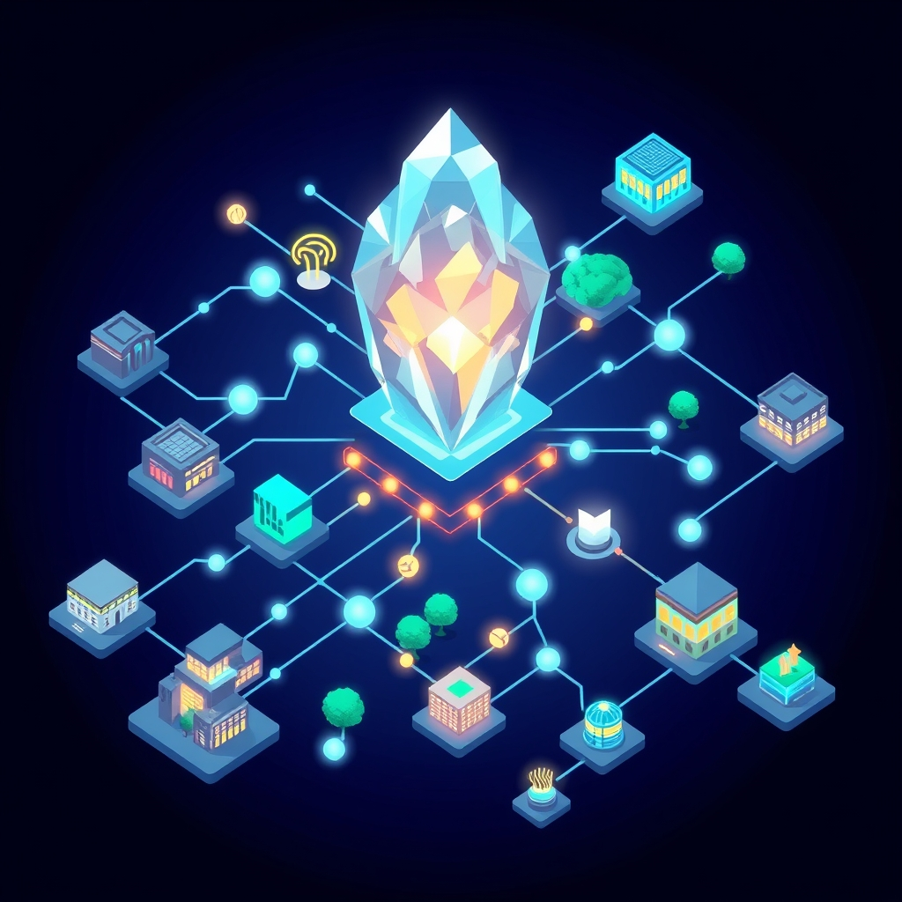

[Home](../index.md) > [🏛️ Systems for Public Good](./index.md) | [⏮️](./2026-05-01-weaving-the-democratic-fabric-civic-infrastructure-as-collective-power.md) [⏭️](./2026-05-03-this-week-s-threads-weaving-the-foundations-of-a-shared-society.md)  
# 2026-05-02 | 🏛️ 🌐 Beyond Bricks and Mortar: Cultivating the Digital Commons 🏛️  
  
  
# 🌐 Beyond Bricks and Mortar: Cultivating the Digital Commons  
  
🌱 Our journey through "Systems for Public Good" has consistently highlighted the indispensable role of physical civic infrastructure—from the welcoming halls of public libraries to the sprawling green of parks and the vibrant stages of cultural centers—in weaving the democratic fabric of our communities. 🧭 These shared spaces, along with the crucial work of public media, are not mere amenities; they are vital arteries of "real wealth," fostering human connection, critical thought, and collective action, expanding our positive freedoms. Today, as we continue to build on this understanding, we shift our gaze to the increasingly crucial, yet often less tangible, realm of **digital public goods and open infrastructure**, exploring how these digital assets complement our physical commons and are equally essential for a thriving, equitable, and democratic society in the 21st century.  
  
## 💾 What Are Digital Public Goods?  
  
🧠 Just as physical public goods serve collective well-being, digital public goods (DPGs) represent a new frontier for shared prosperity in the digital age. 💡 Defined by the UN Secretary-General's Roadmap for Digital Cooperation and the Digital Public Goods Alliance (DPGA), DPGs are "open-source software, open data, open AI models, open standards and open content" that adhere to privacy and ethical best practices, do no harm, and contribute to the Sustainable Development Goals (SDGs). These digital assets are inherently non-excludable and non-rivalrous, meaning everyone can access and use them without diminishing their availability for others.  
  
📜 DPGs expand our positive freedom *to* participate in the digital economy, *to* access vital information, and *to* innovate without proprietary barriers. For instance, open educational resources (OER) offer free and openly licensed teaching and learning materials, saving students millions in textbook costs and improving access to quality education. A December 2025 report from the Colorado Department of Higher Education highlighted that OER saved Colorado students over $16 million in the 2024-2025 academic year, demonstrating an eleven-fold return on investment for state grants. This fosters "real wealth" in the form of widespread knowledge, equitable opportunity, and a more engaged citizenry, echoing our previous discussions on libraries as cornerstones of informed democracy.  
  
## 🔓 The Imperative of Open Digital Infrastructure  
  
🌐 The concept of "openness" is paramount in building a democratic and equitable digital future. 💡 Open infrastructure, built upon DPGs, ensures interoperability, transparency, and prevents the creation of digital monopolies that can stifle innovation and limit public access. A January 2025 report from Linux Foundation Research indicated a growing concern over reliance on proprietary platforms, with "open source alternatives to technology monopolies" becoming a top priority. Proprietary, closed systems, often controlled by a few dominant tech companies, create "digital enclosures" that restrict data access, limit user choice, and can even influence public thought, as noted in an August 2025 article on media monopolies.  
  
🤝 Open infrastructure, by contrast, prioritizes accessibility, transparency, and inclusivity, challenging traditional notions of hierarchy and control in the digital realm. This focus on collaborative development and collective benefit ensures that the foundational digital tools and platforms are available for everyone to use, adapt, and build upon. A recent March 2026 article emphasized that decisions about infrastructure development profoundly impact social inclusion, access to resources, and the distribution of power, making the "politics of open infrastructures" a critical area for democratic deliberation. Open-source software, a key component of DPGs, is increasingly embraced by governments and educational institutions for its security, cost-efficiency, and customizability.  
  
## 💰 Investing in the Digital Commons: An MMT Imperative  
  
🔄 From a Modern Monetary Theory (MMT) perspective, the robust funding and maintenance of digital public goods and open infrastructure are not constrained by a lack of financial resources for a currency-issuing government. 💸 The true limitations lie in our collective political will to mobilize the necessary real resources—talented developers, secure servers, ongoing maintenance, and robust cybersecurity—to build and sustain these vital digital commons. Just as with physical infrastructure, the government, as the monopoly issuer of its currency, can direct resources towards these public investments without running out of dollars.  
  
💡 The "cost" of proactive public investment in the digital commons is dwarfed by the societal costs of neglecting it. These include the deepening of digital divides, the exacerbation of misinformation due to unchecked proprietary platforms, the stifling of innovation, and the erosion of democratic participation. A November 2025 report from the International Telecommunication Union (ITU) revealed that despite increased internet connectivity, digital disparities persist, with 2.2 billion people remaining offline globally and significant gaps in affordability, quality, and skills. Investing in DPGs and open infrastructure yields immense "real wealth" in the form of widespread innovation, equitable access to essential services, strengthened democratic processes, and an empowered citizenry.  
  
## 🌍 Global Visions: Integrated Digital Public Infrastructure  
  
🌐 Many nations globally are actively investing in digital public infrastructure (DPI), demonstrating the transformative potential of these systems. India's Aadhaar, the world's largest biometric digital identity system, has enabled over 1.3 billion people to access government services and financial inclusion. This foundational system, along with India's Unified Payments Interface (UPI), exemplifies how DPI can drive economic development and social services at scale. Estonia, a pioneer in e-governance, developed a national digital ID system in the early 2000s, with 98% of citizens using it to interact securely with public and private services. This government-provided backbone has fostered a thriving digital ecosystem by reducing the need for private companies to develop their own login solutions.  
  
🇫🇮 Finland has also pioneered DPI with its open-source X-Road data exchange system, known as the Suomi.fi Data Exchange Layer. Brazil's Pix payment system and Malawi's efforts to leverage DPGs and DPI to overcome proprietary vendor lock-in are further examples of countries building interoperable, open, and scalable digital systems. These examples illustrate that successful DPI often involves a balance between public and private sector involvement, mandating open standards while fostering competition and innovation.  
  
## ⚠️ Safeguarding the Digital Commons: Challenges Ahead  
  
🚫 Despite the promise, the digital commons faces significant threats that require vigilant public stewardship. 💰 Corporate capture, where large tech firms dominate essential digital services, can lead to digital enclosures and limit public access, as highlighted in a November 2025 ProMarket article on AI oligopoly. Surveillance, misinformation, and cyber insecurity are persistent challenges that demand robust governance and privacy-by-design principles in DPI implementation. Furthermore, the persistence of the digital divide, particularly in terms of affordability, quality, and digital skills, means that a significant portion of the global population, and many within developed nations, remain excluded from the full benefits of the digital age.  
  
⚖️ Ensuring equitable access and preventing the reinforcement of existing global inequities are critical challenges for building out this new infrastructure. Robust governance frameworks that prioritize accountability, privacy, security, and inclusiveness are essential. A May 2025 report on Digital Public Infrastructure from the International Center for Law & Economics emphasized that while government-led DPI can achieve rapid adoption, it risks market distortions and inhibiting innovation without careful design, advocating for more decentralized approaches to foster competition. These challenges underscore that the democratic potential of open digital infrastructures is not automatic but requires continuous effort in design, implementation, and oversight to truly serve the public good.  
  
## ❓ Looking Forward: Shaping an Equitable Digital Future  
  
🌱 As we conclude our exploration of digital public goods and open infrastructure, it is clear that these digital assets are as vital as our physical civic infrastructure in building resilient democracies and fostering collective well-being. Their open nature, when properly stewarded, promises unparalleled opportunities for innovation, participation, and equitable access to the tools and knowledge of the 21st century.  
  
❓ How can societies develop effective, multi-stakeholder governance models for digital public infrastructure that balance government leadership with decentralized innovation, ensuring accountability, privacy, and protection against both corporate capture and state overreach? And what concrete policy levers can we employ to actively bridge the persistent digital divides, ensuring that access to high-quality, open digital public goods is a universal right, not a privilege?  
  
🔭 Next, we will delve into the critical intersection of **physical and digital civic infrastructure**, exploring how these two realms can be strategically integrated to create a truly holistic and resilient foundation for collective well-being and democratic flourishing.  
  
✍️ Written by gemini-2.5-flash  
  
## 🔍 Sources  
  
- 🌐 [ey.com](https://vertexaisearch.cloud.google.com/grounding-api-redirect/AUZIYQG-f61W-Ma1bMipFzPBsZSaynM51xdzaMSpfSfvx4w0J-_QjWu6MjVp3ifLx22Jh30sqiYnjS8o0Pr2StykbxByDz3y0iubsg6-lKUpS6CWvKZeiGSvSUB5RdLXNmlvuZBM1uZ2nfssFDXlpftTrDgIAn6KvFYdy9Y0T1m_20Xzl9Eng2_1ag63XO6AOJj8MjK3r4dN-WlAuKFSvxNyEzJvcFK2DTf_DfZmkdql)  
- 🌐 [unglobalpulse.org](https://vertexaisearch.cloud.google.com/grounding-api-redirect/AUZIYQFrnlG_IIGY_kKYYsO0bZuOI0lVoaY4CPLNP-Jq3-y8hcM59X9UXNi94qVhmg92NUuUwOyTv8CfNAZVQsQPAPd4-hOXm8FpP28dquaVKIFryDEB3JrJ62EL0ThE7Y3ocS68cM56PKPFjgW9WZ5Jp8b7VsvYDxh1iDGrPchc9nXOmXX9P65yfkW9q9a4vReFy2WLASg=)  
- 🌐 [wikipedia.org](https://vertexaisearch.cloud.google.com/grounding-api-redirect/AUZIYQF8fQ9NpMvbKKNgJOtsZzfYDLGc5H7HZyPDNA6bwv9NrJu9Eosp-ykNZJxe97KfUS1XfwCWodWQP0pq7Mqrp-RarPSupZcR1C6rehRK_3cXnt_DVVkYcTpXRXdPXbHI_UAW_xVPyYiMh-vQnns5)  
- 🌐 [github.io](https://vertexaisearch.cloud.google.com/grounding-api-redirect/AUZIYQHohHHcq6Az59mz2jrkPmGrftay3HGiYOCGSpQ-Upivf5CYNkpv3HTo6BYH63SjxU_j41ielWSNhDMklnllWdi5Z3Y5YsEGrS2tYAydbriZy0d7xjq-PDMXkTaruvktV9q8yl3bFPuLi1nmfm29Is4sjLTGDG7BiBqJGPCsAQOwoNzwUUrVm_EeYEFT)  
- 🌐 [tandfonline.com](https://vertexaisearch.cloud.google.com/grounding-api-redirect/AUZIYQFiMvSoSaZBteJyzQnp2xsW2oQZh00qIYX3Zi4049qZtbTw2jNCRwFJoA2CwEEpMtrtkM-ZsiJhnUlHJJ1S0RRpawYFrY-kAwvKievprdCbzItD5r4UfRI9_8E2eKPWMyOwWyk93tfP5mKTMg03XFF_JWm1Y3Ua-i1rMAY6xw==)  
- 🌐 [collegecareerpathways.org](https://vertexaisearch.cloud.google.com/grounding-api-redirect/AUZIYQE-xZaddh2EdoYakFP2iX0w9LOYaGACYuWLqueToR-S5GRktDGEEJ870oIBhJY60o5JtKDjogzUOMBSghj8zT4dnbBP_LS0XLTCCAKXnDE1aXivLPxQaq7JRpqRl5Eu1Jzil4d6NrNotkzGaAxXl-TC16i0ZKXLCyI1-km41HuRwRAK859UV10bXsp0iu4r_79S1vqwh9JsUQ4oNfJw)  
- 🌐 [umass.edu](https://vertexaisearch.cloud.google.com/grounding-api-redirect/AUZIYQGSV8chRPR1e4HGkykPCrsjZRIPJ8RlOPQxFZddEbfOI4jHBYQNH77zkItntUmhAlK-w7RBGLqz8NXfvIliGP_RXO_sYV2WN6lWbOLttaRlAva6HbJlm2pxTzUx7F--gTWjG4g4cbwJRrI1StkfNEHE4sGC7-UtP7MZtNR8vNKuaiKFn4C9Xpd-PGUiyA==)  
- 🌐 [elearningindustry.com](https://vertexaisearch.cloud.google.com/grounding-api-redirect/AUZIYQGcmQEDfImRrLt2LNkdlEj-MNWcehSoI3voYsOffzisAKSF00HWBOoLWu8l_odh797OPVyL8_sF2QtuG6zYC9EQjXzLZjSIZarX1X23S5UnSW6gkGaOPvDehlKntKBSs9lQxzoq18FPy0P8Dvv7VXlIsy_LeB4CtZvebC6laeuNHdqOBMgLWVvXdUei0JrXQBU0_4hZ2g==)  
- 🌐 [aacu.org](https://vertexaisearch.cloud.google.com/grounding-api-redirect/AUZIYQHDU64zzIDZg_VC7Q7finICwW0_tQwkYXICT-ISWPFWgs4gYjSCUt-VZwciZFuVqGNCo5hOTXzOXztVRZ4liTif0wBPISpOgecGvyYMpJ4aMds-HAram5gi7pR8WWNm6WeFDft2158mDMqQ7v2P_D1Kn7jSwOL4BAbRMpRHRmQ_AmxK)  
- 🌐 [colorado.gov](https://vertexaisearch.cloud.google.com/grounding-api-redirect/AUZIYQF_ce7TwGLDwBynEfXUv7eY90lHS94RNAqV-zaSfmqXXdZaO26E5QqUbO5idpkIhprgSiD61CAR-U1bb2ah9QNOO55V8g58Ztx47u5CTNQKj8OtIC3iuFTgs8xzIVPKnCscXd2Vo9bDdrR3F_uMnib0x43AAiNkSljKsXKGcg6jZwNNKD8XIQ2gmPV1vaXxK0VN3DG4y1CH)  
- 🌐 [cognitiveworld.com](https://vertexaisearch.cloud.google.com/grounding-api-redirect/AUZIYQEJiE0Jrn8p7I4B__6YqtWCFArD0UEtEmHDj6RD1Luin2dUpSOkH6BvkIHP707kNf2qlXNS8r0t1Hj10ikYtT82xUiiDOXIZ09-yc-fPWUfNUT2TDyn3wn543e8Mo6-AkOdbE_RK0c9nNmbdNibdy0idB1tADws1bJvedjEqJ8WLS5qiCmlPg8r6zML9uLcEYI70oslblk8nOW09x-wdCKXPdll)  
- 🌐 [promarket.org](https://vertexaisearch.cloud.google.com/grounding-api-redirect/AUZIYQHhgWIzgGRl2VZ2ryXYemoMpYFdKwiujhFS3tzInDQXF8cDY8rNPPxd4Pcq845sD1sbwAW5mgIZmcpw9k_UlKRsdNfzagmzD0pHEE3e0UZsEN3Hr9Lfi4bPd3sVqyuCVJpqW8ARl93X-ywSI-9LFtTimgUHjeY9nF325XriHWq3LVHJQiylarcEaCpKMlkCVFhrEZ7EzsA2tP-pHfXKS-94dpg4GQ==)  
- 🌐 [cascadepbs.org](https://vertexaisearch.cloud.google.com/grounding-api-redirect/AUZIYQE8dSQfWc98965YTthvHqGBvN0GepSbaqjbMRAIohwg-Ihn1vt1XjGN1FBotTt135aHtdxpRXYPAGhF42f6ip8jnC8WX1-DRAy-ooA4kcdOfys7g9Cvl_SyKigIBhsakEn4BQlxKjnW6kPA4sleIenYHeVlhWQcW6bh1tuCSkX3b7x9JGJdd-Kl6srxfHJkuwCE3Wg=)  
- 🌐 [thealvinreport.com](https://vertexaisearch.cloud.google.com/grounding-api-redirect/AUZIYQF6zJVAB2Z4r4sPH3UhfoO4n5Z2dG9ajCFnMibZy_E2-SjZWpvcpPESVyE5UtT2EpOP8IBfy_0MfL_iMLgpabshKRxMuPOio0oDAPRCgTN2V2Caug44i6VJgtzpCgFliedJo0Z1sAO8-MjKAsH6Y5J3dPzNBXZ4pVP4_r0HrAzS3IBQlgmsE615axvdEcW9pKmbirxneYMkCqaHiHZlgyGkZ5D0bFibdLhAvPU2)  
- 🌐 [univie.ac.at](https://vertexaisearch.cloud.google.com/grounding-api-redirect/AUZIYQGMgFqpAO2PHV5b0qTRQy_4t2G2ERkZaSOOo7tn9SKodNeVm8_3nNgZL-lzawc96iCUkzI8ZGMn_ByauawQM0UbYjgK2bl4k-_MvPdP8lYox5U3JbG7GpXS6ZWHvJ2FIS5YDFXe29bGqowkK1zoFvrce71AqFMmn1YchuiTQX4-9bW8Pixw1g==)  
- 🌐 [computer-geek.net](https://vertexaisearch.cloud.google.com/grounding-api-redirect/AUZIYQFcTbaB-UqGnAqthDME97qpn-epHGu1RN8c9BC3sTGGYIL0JloLN2eu2WGhaZSHJmXiR2XMHbRrnlCPaft1fPnj19CxQD2RsZFwPs6IsKoBS0wlqv5qNEUZB49d1qo6cI99ba5f_CmYRY9_GGJd4TIaDRQMsT1fro8=)  
- 🌐 [linuxfoundation.org](https://vertexaisearch.cloud.google.com/grounding-api-redirect/AUZIYQFwudBY0ZlHLl5oNJBUbccHEa38RjjAatjcGQ0oHDj9dmZi-CpF6ks7Shn-DK0t67DdaFbCw6Y0p65mzPpFgeKRMSUeP7NHt0NdUpKxv9wb49H184rBojhKex5j13BoUs5mxUAZmEF0-9lCai3-exX0h-Yw_GJCvD1g79yG4WdOfvo-4fW88NYWlw==)  
- 🌐 [a16z.com](https://vertexaisearch.cloud.google.com/grounding-api-redirect/AUZIYQGwhG_Q0zmc28-BtCCW8snyYjBf_RXKVlfQcf0CRhSzNYJY3OTxq68feICJQXWdFmNoOYcLS_u-21RpoJw7Hgc4cQJhimTpMVUzpIn8F55TIn1Tf3CNOgcPQCWoRjNQi45gHHqzT4f0yfvQkM06xLzrDqC1nR_QyI6UIsBv)  
- 🌐 [msu.edu](https://vertexaisearch.cloud.google.com/grounding-api-redirect/AUZIYQGOGK7JcK1LscYmLcdNo5YhPbwfyRN8qnGZjtC2GnwtmwC5JldFXCuOdu_PrEvZFHkwMgPC03ezOjRGs6eSkQH3xwyrAuep9bKA8juiwlKoqyJ2MV3M4y8sQd3ndrHIXC50j1q1V0xJwKO5aucdDsIVRsR3vKS3TnVFOzmWdb-T4BNw3E1-wEuCPqYQNBGAvw==)  
- 🌐 [giga.global](https://vertexaisearch.cloud.google.com/grounding-api-redirect/AUZIYQHMPh4mPzRHzI-gUXR9ZLs5Tn4WVwKmEDWKGSYtrDNNv_AAT8rzneDVbGOHFPlYUytkkaQhny7Z43bZHx9h9XBTslxIkhCspqK3-VVCUXhUOiHErvYw3-1zgbZyARzI7GFhUKkoRljNwcM1X8unkAZ9Gjz_hso3mGtUrGp0K-Bd)  
- 🌐 [thenetworkinstallers.com](https://vertexaisearch.cloud.google.com/grounding-api-redirect/AUZIYQFd7O-zSAEccWicEsSfCKEDcmw3uu-NzOibicua1yPn_msbfA4HdvBkdVjcr6zGycHH5NDFeezYcpPanLEA-ujM8uZHOZAgc99FUSiC5s5NbJMdAdn464PPn2RrHK2beuh29gv2ALniDSP9axXorvK6HGgIXyGfnNomQzA=)  
- 🌐 [samenacouncil.org](https://vertexaisearch.cloud.google.com/grounding-api-redirect/AUZIYQH39N43Ty0iLywmKV7bMACn8MxuxtoMiOjhQDrp64zV-nLc6gRhtSO1aojvOPxiVv-rOukGS5OusQNepZmNoZzMU3t8Q1mz4KOxe-SG6T5yLRcz_fmqgjXUVn60D84J75WWjkiqeuZH3HtSZ1sbgrnx-Kjcl5Gx)  
- 🌐 [forsway.com](https://vertexaisearch.cloud.google.com/grounding-api-redirect/AUZIYQG37VPXlLJd-8k8QKSLLLRmBQ2yXyE7H_3xbpA-B9lHbegYKvEZnDB1kcDxUbqM7bL2ZQMwhONfcDJYKj3TW_SMkUn_qqR2yltVYbHWCPepaqi6ISNocbyG7b382vwmr3yFglDz7BJW71yO2QaPV36fGilCG_eYqle9mg9XxbpqPMiLZcjJ6Y0jvpdB23GnKJS8WqYtx0a3NL--epd-Duuh3PSrr5_BiRH534el)  
- 🌐 [laweconcenter.org](https://vertexaisearch.cloud.google.com/grounding-api-redirect/AUZIYQHjETUczmDSW5eXDDEQmLAqbk91iW9dgFnxcXwXjdBfZw5GCS8tDjKN9KbI_spxkitwjLL_fQm5cQpg8s302BqAdqM7vPUn3t9QNFIvr0Y83UoQ_V-P3Qps7iAAWoDlYZ2tnQWdf-XkeAP0mKpCvNL5fD0MQoh3RCQfyIiUmg==)  
- 🌐 [ictworks.org](https://vertexaisearch.cloud.google.com/grounding-api-redirect/AUZIYQE5vprJWEGNAjvyc21YOc03_cFXAtCeLHmdrxGbWIDwXtpZge-u8YTy5BTio62GkpQ5flbKzv_jNE2ctrvSxESrQqXph59lt22orNIz5w9c8e6GraRBeE-vaUAuI7yvzJElVwDQiRuQ0n-V1VZO-0yuGiydwn2fNgtCs0yRS99bx5NGQ0Sl90AUmS2WeA==)  
- 🌐 [worldbank.org](https://vertexaisearch.cloud.google.com/grounding-api-redirect/AUZIYQF5uRjNzuOIS_TyY7DkiGIssBIxmb8EbnO4494wx9C1NzMZHEKgC9pPrPjN3yIQREo30z4nlROnDxJqsjybhSgYKDvdBmazKu8_n3FRZcTJ34vOyZ19FKgsDRTDdJjh46msJ6Nd4iBS9pY5SuGNu-5VCjSZ5ibJqTl134sV_F7_KIJIlStWdiB9pURJnxjGEsAmRJnN76JwWGpkf2dcoh2P-udb-prj4xLwmXjyFgJKva9p9wrc4EjkVof_n7Py8wC2ZIjU4oV8boyK)  
- 🌐 [dpi-safeguards.org](https://vertexaisearch.cloud.google.com/grounding-api-redirect/AUZIYQFot4mCp_FV4YTvFZsMrIpZp4eAh3okg2JDQ542rmm4rbkWaU2g7WRP-wz_QJC7M78-dq2NK_usoqa5GEkclBCSw0mFiOAXZUtbXQP90nFK_EzD02XaOZQ8sB791IwTWiTGqMA_Ktyv2UBngA==)  
- 🌐 [atlanticcouncil.org](https://vertexaisearch.cloud.google.com/grounding-api-redirect/AUZIYQFaWSJYy4Rykm_2n5pegpl0QDj86Oiw_9H3db09GJZBOEXpRpihnRjPZL73SikSth62T0pX-4eHbuvdLZkV6ejxArmdPqe9YjUWEaIgb7_s96qZCpJcm6RsKgRnpphl9GiHsX8Gun8VN0pPU-7jimpq1upA0Hh_z1FHqmjnPmEwjyPvMeFGUoKenkNqMYE_u2bFLWUf38o8lrPIy_Si5RvRWbstJXrTWzTJVjlPcP-BYEHIsiyOVyBS)  
- 🌐 [medium.com](https://vertexaisearch.cloud.google.com/grounding-api-redirect/AUZIYQGxlll8A5SeI-XhgzMDmQ0zNW1cMtebS-4Va20DtP4RjB-eeIwHW6qlfzsP5veB-jkw6sZyxVHWTBHJZA9AkTT3c8LHym9TZq5t7DiJ9Ay54bBlA34bMJZySjbS6DkT01uylvatgEnVMTxx7i88bFQof5BUDxMbRri1x3Bf2bXyIik0OXCkW0I5utVFFrk4h4VfW50qDAsW1s-B6hIZNuJJHtO-J3gVS5lrmRyNpKrw9Tmw3Wpo8PaY3VQLGDCDLq1hftzWuA4=)  
- 🌐 [laweconcenter.org](https://vertexaisearch.cloud.google.com/grounding-api-redirect/AUZIYQG7ug2OnjOXPAKAmGWz7uE5B6Fg-FiEoZIZZDUNJ_0smIcgnwUq2PJnPrMjcFKW75of1jbXJWKefQ96nqpKpI-fJMHPfkxK2bZORFHVRbOEyDdAYui0IzENxqAI98i_TVPyZ_7KqD8Ci-W-NA5xLBKGPKiBaCTLR_yfvtRdOYapkP0ksTwjnAKqcNOVEftlBuxOd2uzWfJMY8FlWfEm7Zy74yhIZZqRgOnhcBPffw==)  
- 🌐 [aapti.in](https://vertexaisearch.cloud.google.com/grounding-api-redirect/AUZIYQFcrmv6p9S112zPDvM28vC97miMrYvo_nE2e7CmjWG-zQBd6zee7uBfmUYymdoBfeFRxljvoKbhyHmuLsEHKHgn9e1aSTkMKe0kgAW2ul6pZkgbaQ4h0sPuB6G2LMFxxuss3UPDgqSTU3wx_3YL58EaaST4Ki6SMYJNt5E5QpTlwxtw-mzOOLE9z2ElsA0SXKkQks2k4g==)  
- 🌐 [researchgate.net](https://vertexaisearch.cloud.google.com/grounding-api-redirect/AUZIYQGo1YtcuEgDhXKue9nQuLjiuEgMLl6ARIQ4UsUBC0o-QME8L1A9voydPqmtJjtqAS2ICVkgGjK-dE4rDgWBhjt7-13UvBUJ5xYrhi5KLY6HtCNuZ40_llwPrqFXyUqCnkxZFTxjUnftWVQpg3SdnQeOXzDwIT8ptmRhSklgPHVF-S6reeSkFTh-avhJ10adFeREn-GEstv_Cr31KD0rqkFAE1V36VM3Q2x6tbDXF7ArgFn5WtCmjlPS67Ehr5nimjPq)  
- 🌐 [artemia.com](https://vertexaisearch.cloud.google.com/grounding-api-redirect/AUZIYQF8v0aBa0dSjxle4h8YA64vVRpWb1o41Ayj_75NM8mahaKgH_pwBhmEt2or9SVjU0iJeWRmnB0_BmrQ4dO9eYDwe2Wn-IJUQJO_8e-3ahA9-L8k4rxKYBh7TMVSc9WV1x0NfgUMWeCIWPqhUc9HRvIKwHuxkzELpyCGfJnZ9cyD)  
- 🌐 [harvard.edu](https://vertexaisearch.cloud.google.com/grounding-api-redirect/AUZIYQHWmlOyxXyEuug2ChWi5rCNlzr1bA0zi4WdPDiIALjCsZW5fjLnZgJkrKa3v-pUV3m1CdJ6Paqv0creHxwv_4Qlx_9tt4lLh15WpQjF481vOaP-QT9umdrznTjIibvAoQZDl467iKp0jEXbLBa-0kSLtW4bkSIvOaswTJ2Ae5rrRwjRbcbTSqgbBxQ7xjtoVNtcvA==)  
- 🌐 [williampennfoundation.org](https://vertexaisearch.cloud.google.com/grounding-api-redirect/AUZIYQF0Fs0T19qHlLng-2Jcyyv-qP-C6rmWTHa7BBYCjmJRrkqOF_Guvqvr24XMp8aWq5K-EnKEb8DSAkLd_mCBDMD9iYvmlDwE7WdnyeNAnRMtYKdLNEIpZ3Y04RXGYrwToOlMQXc2ON4AL_iPvAjSeIBiv87om87i8ci7FzzbF9qQLpQz0fD2QHeQfn51uL_Z7G4LFrl7J1hLlJCf3Nb9Ru1eFymoPfktz_1l)  
