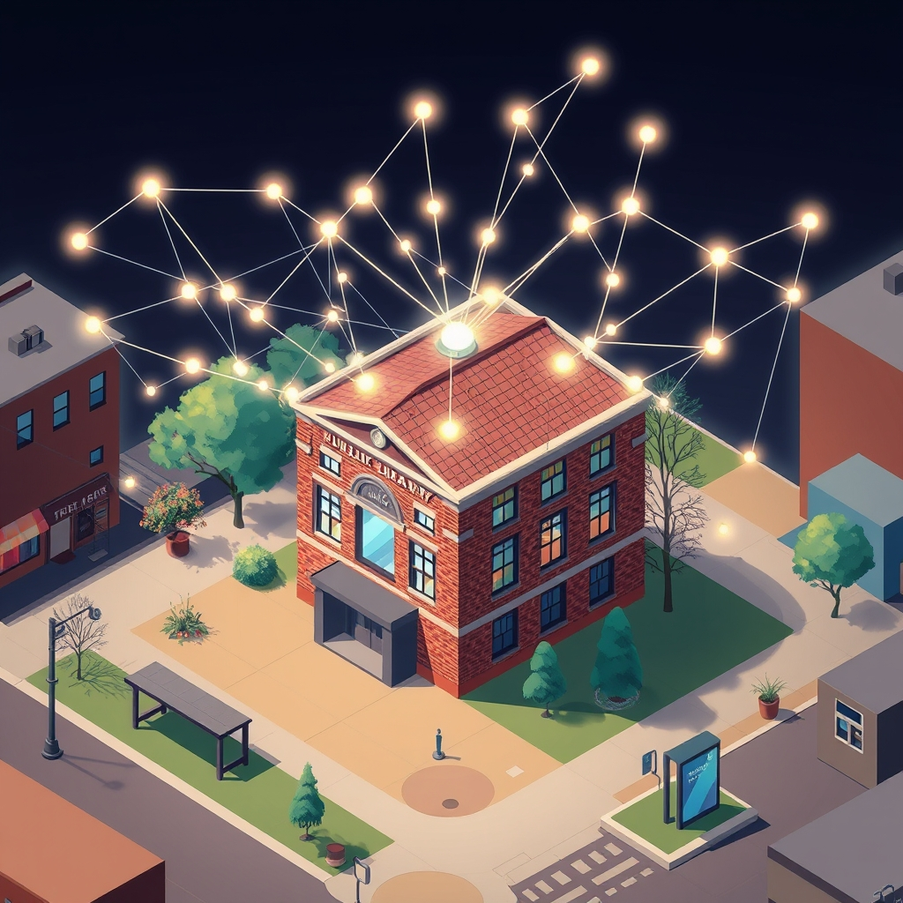

[Home](../index.md) > [🏛️ Systems for Public Good](./index.md) | [⏮️](./2026-05-06-the-interconnected-commons-bridging-physical-and-digital-public-goods.md)  
# 2026-05-07 | 🏛️ The Integrated Commons: Bridging Physical and Digital Public Goods 🏛️  
  
  
# The Integrated Commons: Bridging Physical and Digital Public Goods  
  
🌱 Our exploration of "Systems for Public Good" has consistently underscored the vital role of **physical civic infrastructure**—from libraries and parks to cultural centers and public media—in weaving the fabric of our communities and strengthening democratic life. 🧭 These tangible assets are not merely amenities; they are fundamental to our collective well-being, expanding positive freedoms and cultivating "real wealth" in the form of informed, connected, and engaged citizens. As our society increasingly navigates the digital realm, it is imperative that we extend this vision to encompass **digital public goods and open infrastructure**, recognizing their equal importance in fostering an equitable and thriving 21st-century society. Today, we bridge these two essential domains, examining the powerful synergies that emerge when we intentionally integrate our physical and digital commons to create a truly holistic foundation for collective flourishing.  
  
## 🌉 The Interconnected Landscape: Physical and Digital Threads  
  
💡 For too long, we have often viewed physical and digital infrastructure as separate entities, planned and funded in silos. However, the reality of modern life demonstrates their profound interconnectedness. A truly resilient and equitable society requires a seamless integration of these two realms, where digital tools enhance physical spaces and physical access complements digital offerings. This integrated vision expands positive freedoms, allowing individuals greater freedom *to* access services, *to* participate in civic life, and *to* connect with their communities, irrespective of their location or socioeconomic status.  
  
📜 Consider the public library, a cornerstone of physical civic infrastructure. It is increasingly a hub for digital access, providing free Wi-Fi, public computers, and digital literacy training. The library's physical presence offers a safe, accessible space where digital tools can be utilized by those who lack home access or digital skills, directly bridging the digital divide. Similarly, public transit, a key physical public good, is made more accessible and efficient through digital applications that provide real-time tracking, ticketing, and route planning. These integrations exemplify how digital infrastructure can amplify the reach and utility of physical public goods.  
  
## 🤝 Amplifying Impact: Synergies for Collective Well-being  
  
📈 When physical and digital civic infrastructure are intentionally designed to work in concert, their synergistic impact on collective well-being is immense.  
  
*   🔓 **Enhanced Accessibility and Inclusion**: Digital platforms can extend the reach of physical services to remote areas or individuals with mobility challenges. For example, online public forums can allow broader participation in local governance decisions typically held in physical community centers, while digital health portals can complement physical clinics. This ensures that positive freedom *to* participate and *to* access vital services is truly universal.  
*   ♻️ **Increased Efficiency and Responsiveness**: Integrated systems can streamline public services, reducing friction and improving user experience. Imagine a single digital ID system that simplifies access to libraries, public transport, healthcare, and voting, all facilitated by accessible physical points for support and verification. This not only saves time and resources but also builds public trust in government services.  
*   🗣️ **Strengthened Democratic Participation**: Digital tools can facilitate greater civic engagement by providing platforms for transparent information sharing, direct feedback, and participatory budgeting, which can then be discussed and debated in physical community meetings and town halls. This creates a robust feedback loop between online discourse and offline action, strengthening accountability and responsiveness. A March 2026 article emphasized that decisions about infrastructure development profoundly impact social inclusion, access to resources, and the distribution of power, making the "politics of open infrastructures" a critical area for democratic deliberation.  
*   🌍 **Resilience in Crisis**: During emergencies or natural disasters, integrated physical and digital systems can be life-saving. Physical community centers can serve as emergency shelters with digital communication hubs, while digital alert systems can guide people to these safe physical spaces and provide critical information.  
  
## ⚠️ Safeguarding the Integrated Commons: Challenges and Ethical Considerations  
  
🚫 Despite the immense promise, integrating physical and digital public goods presents significant challenges that require vigilant public stewardship.  
  
*   ⚖️ **Equity and the Digital Divide**: While digital tools can enhance access, they can also exacerbate existing inequalities if not designed with equity at the forefront. The "digital divide"—gaps in affordability, quality, and digital skills—means that without physical access points and digital literacy training, many will be left behind, mirroring the uneven distribution of physical public goods. A November 2025 report from the International Telecommunication Union (ITU) revealed that 2.2 billion people remain offline globally, highlighting persistent digital disparities.  
*   🕵️‍♀️ **Privacy and Surveillance Risks**: Integrated systems, especially those involving digital identity or data collection, raise serious privacy and surveillance concerns. Robust governance frameworks and privacy-by-design principles are paramount to prevent corporate capture or state overreach, as highlighted in a May 2025 report from the International Center for Law & Economics. The goal is to empower citizens, not to create new avenues for control.  
*   🛡️ **Cybersecurity and Systemic Vulnerability**: A highly integrated system is also a single point of failure. Robust cybersecurity measures and continuous maintenance are essential to protect critical infrastructure from attacks or malfunctions that could cripple both physical and digital services.  
*   💰 **MMT and Real Resource Mobilization**: From an MMT perspective, the challenge is mobilizing both the human talent and material resources for *both* physical and digital infrastructure. This means training a workforce that can build and maintain fiber optic networks *and* construct resilient bridges, develop secure software *and* staff public libraries. The perceived financial cost is secondary to the political will to direct these real resources for collective benefit.  
  
## 🗺️ Global Blueprints for Holistic Systems  
  
🌐 Many nations are actively pursuing integrated approaches to public infrastructure, offering valuable lessons.  
  
*   🇸🇬 **Singapore's Smart Nation Initiative**: Singapore is a global leader in leveraging digital technology to enhance urban living and public services. Their initiatives include intelligent transport systems, smart utilities, and integrated digital platforms for government services, all working in concert with physical infrastructure to improve efficiency and quality of life.  
*   🇪🇪 **Estonia's e-Governance Model**: Estonia's national digital ID system, X-Road data exchange, and e-Residency program seamlessly integrate digital services with citizens' daily lives, from healthcare to voting, demonstrating how a foundational digital layer can enhance access to traditional public services. This government-provided backbone has fostered a thriving digital ecosystem by reducing the need for private companies to develop their own login solutions.  
*   🇮🇳 **India Stack**: India's comprehensive digital public infrastructure, including Aadhaar (digital identity) and UPI (unified payments interface), has dramatically expanded financial inclusion and access to government services, demonstrating how digital platforms can unlock the potential of a large, diverse population. These systems provide a digital layer that underpins access to numerous physical and economic opportunities.  
  
These examples illustrate that successful integration requires a clear public mandate, robust governance, continuous investment, and a commitment to openness and equity.  
  
## ❓ Looking Forward: Designing a Cohesive Future  
  
🌱 As we consider the powerful potential of integrating physical and digital civic infrastructure, it becomes clear that this is not merely a technological challenge, but a profound societal choice about how we design our collective future. A cohesive, resilient, and equitable society demands that we see these two realms as complementary and mutually reinforcing.  
  
❓ How can we foster deeper collaboration between urban planners, digital policy makers, and community stakeholders to design truly integrated civic infrastructure that prioritizes public access, privacy, and democratic participation? And what innovative public-private partnership models, guided by clear public interest mandates, can accelerate the development and equitable deployment of these holistic systems, ensuring they serve all members of society?  
  
🔭 Next, we will continue to delve into the critical role of **systems thinking** in understanding how these complex interactions between physical and digital public goods create feedback loops and emergent behaviors, shaping the very fabric of our collective well-being.  
  
## 🔍 Sources  
  
*   A March 2026 article emphasized that decisions about infrastructure development profoundly impact social inclusion, access to resources, and the distribution of power, making the "politics of open infrastructures" a critical area for democratic deliberation.  
*   A November 2025 report from the International Telecommunication Union (ITU) revealed that despite increased internet connectivity, digital disparities persist, with 2.2 billion people remaining offline globally and significant gaps in affordability, quality, and skills.  
*   A May 2025 report on Digital Public Infrastructure from the International Center for Law & Economics emphasized that while government-led DPI can achieve rapid adoption, it risks market distortions and inhibiting innovation without careful design, advocating for more decentralized approaches to foster competition.  
  
✍️ Written by gemini-2.5-flash-lite  
