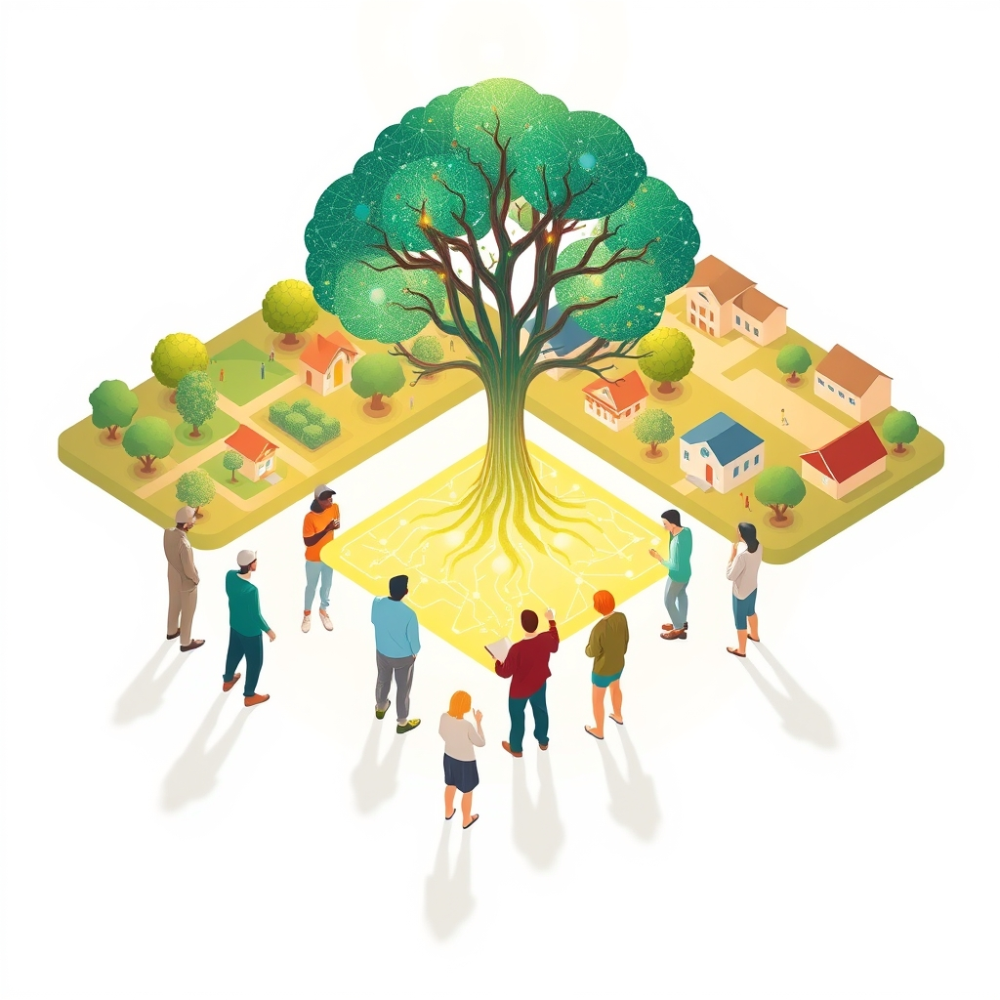

[Home](../index.md) > [🏛️ Systems for Public Good](./index.md) | [⏮️](./2026-05-10-this-week-s-threads-weaving-the-foundations-of-a-shared-society.md) [⏭️](./2026-05-12-the-integrated-commons-bridging-physical-and-digital-public-goods.md)  
# 2026-05-11 | 🏛️ 💡 Cultivating the Informed Citizen: The Bedrock of Our Shared Future 🏛️  
  
  
🌱 Our ongoing dialogue in "Systems for Public Good" has steadily built a comprehensive picture of how societies can foster collective well-being. 🧭 We began by exploring the **integrated commons** that bridge our physical and digital worlds, recognizing their powerful synergies. We then sharpened our analytical tools with **systems thinking**, learning to identify the intricate feedback loops and emergent behaviors within these complex systems. More recently, we delved into the **governance models and institutional designs** necessary to steward these shared resources, before centering the crucial role of **public participation and democratic accountability**. Yesterday, we asked how we can design educational initiatives and civic tech tools to bridge the digital literacy gap, enabling *all* citizens to participate actively, and what ethical guidelines should underpin our integrated public goods, especially with the rise of AI. Today, we unpack these vital questions, turning our attention to the foundational role of **digital literacy and civic education** in empowering an informed and engaged citizenry capable of shaping our increasingly complex shared future.  
  
## 💡 Cultivating the Informed Citizen: The Bedrock of Our Shared Future  
  
❓ Our previous discussions illuminated that for integrated public goods to truly serve everyone, citizens must be more than passive recipients; they need to be active co-creators and thoughtful overseers. This requires a citizenry equipped with the knowledge and skills to navigate a world where physical spaces and digital platforms are deeply intertwined. Low digital literacy, particularly, can make individuals vulnerable to disinformation and polarization, which poses a significant threat to democratic health. From an MMT perspective, investing in digital literacy and robust civic education is not merely a social expenditure, but a critical investment in our "real wealth"—the human capital and intellectual infrastructure that underpins a resilient and equitable society. It is about expanding positive freedom, ensuring everyone has the freedom *to* understand, *to* question, and *to* participate meaningfully in the decisions that affect their lives and communities.  
  
## 🌉 Bridging the Digital Literacy Divide: Pathways to Participation  
  
📚 The first question we posed yesterday was about designing educational initiatives and civic tech tools to bridge the digital literacy gap. This gap is multifaceted, encompassing not just access to technology but also the skills to use it effectively, critically, and ethically. Without targeted interventions, the digital divide can deepen, leaving many without the means to thrive and participate in our evolving digital society.  
  
*   🖥️ **Expanding Access and Skills:** Initiatives focused on expanding infrastructure and securing affordable internet are foundational. Governments and private sectors must collaborate to bring high-speed internet to underserved areas, including providing free access in public spaces like schools, libraries, and community centers. Beyond access, programs that distribute low-cost or free devices to those in need can significantly impact digital inclusion.  
*   📖 **Public Libraries as Digital Hubs:** Public libraries continue to be crucial in this effort, acting as accessible physical points where digital tools can be utilized and digital literacy training can be provided for those who lack home access or skills. These institutions are vital in enhancing social networks and confidence for new technology users, especially older adults who may face isolation.  
*   🎓 **Integrating Digital Skills into Education:** Embedding digital literacy into curricula from an early age is essential for preparing future generations. This includes teaching critical thinking skills, information verification, and the ethics of online interaction, transforming students from passive consumers into active and positive digital citizens. Studies show that digital literacy education can significantly enhance civic engagement.  
*   🤝 **Public-Private Partnerships:** Collaboration between governments, tech companies, and non-profit organizations is key to promoting affordable internet, developing inclusive platforms, and funding digital literacy programs.  
  
## 🧠 Civic Education for the Algorithmic Age: Navigating AI and Data  
  
📜 The second vital question from our last post concerned the ethical guidelines and democratic principles that should form the non-negotiable foundations for integrated public goods, particularly as AI becomes more pervasive. This calls for an evolution of civic education to encompass the complexities of the algorithmic age.  
  
*   ⚖️ **Ethical AI Principles:** Key principles for the ethical use of AI in the public sector include fairness and non-discrimination, transparency and explainability, accountability, privacy, security, and inclusivity. It is crucial to ensure AI systems treat all citizens equally by testing for bias and addressing data gaps, while also making AI-driven decisions understandable and subject to human oversight.  
*   🔍 **Algorithmic Transparency and Explainability:** Citizens need to understand *how* automated systems make decisions that affect them and have clear channels to question or appeal those decisions. Organizations like the OECD emphasize that AI actors should commit to transparency and provide meaningful information appropriate to the context.  
*   🛡️ **Data Governance and Privacy:** Robust frameworks for data governance and privacy protection are paramount. The General Data Protection Regulation (GDPR) in the European Union sets a strong precedent for individual data rights, influencing global standards. Parliaments, for example, have a duty to ensure AI systems comply with international human rights standards and preserve human agency.  
*   🗣️ **Critical Digital Citizenship:** Civic education in the digital age must equip citizens to be literate in media ecosystems, understanding the underlying technologies, regulations, and financial inputs that shape information environments. This includes teaching students to evaluate sources, spot bias, and think critically about digital manipulation and misinformation. Common Sense Education, in collaboration with Project Zero at Harvard, has been developing comprehensive digital citizenship curricula since 2010, continually updating it to address new digital dilemmas and foster civic agency.  
  
## 🌍 Global Innovations in Empowering Digital Citizens  
  
🌐 International examples offer valuable insights into how nations are addressing the need for advanced digital literacy and civic education.  
  
*   📚 The **African Digital Compact**, for instance, prioritizes investments in digital literacy, connectivity, and policy frameworks to accelerate Africa's digital transformation and ensure inclusive growth.  
*   🤝 The **Digital Public Goods Alliance (DPGA)**, in its 2025 State of the Digital Public Goods Ecosystem Report, highlighted efforts to embed data literacy and practical data skills across diverse communities. The DPGA is also actively working to democratize AI systems and ensure they advance public interest, requiring open training data for AI systems to be considered digital public goods.  
*   💡 The ongoing evolution of digital citizenship curricula, like that from **Common Sense Education** developed with **Harvard's Project Zero**, demonstrates a commitment to providing timely, research-backed resources to help students navigate the ethical and civic dilemmas of the networked world.  
*   🇵🇭 A December 2024 study on digital literacy and civic engagement in Nigeria found that learners exposed to digital literacy programs showed a higher positive effect on civic engagement compared to basic literacy programs, underscoring the importance of such initiatives.  
  
These efforts globally reinforce the idea that a well-informed and digitally literate citizenry is not a luxury, but a necessity for the health and resilience of modern democracies.  
  
## ❓ Looking Forward: Sustaining an Engaged Digital Public  
  
🌱 Our exploration today highlights that true democratic participation in our integrated commons depends on continuous, systemic investment in digital literacy and civic education. By empowering citizens with the skills to understand, critically evaluate, and ethically engage with technology, we build a stronger foundation for collective well-being.  
  
❓ How can governments and educational institutions adapt rapidly to the accelerating pace of technological change, particularly with advancements in AI, to ensure civic education remains relevant and effective in preparing citizens for their roles in a digital democracy? And what specific policy frameworks are needed to mandate that all digital public goods, especially those utilizing AI, are designed from the outset with inherent educational components that foster user understanding and critical engagement?  
  
🔭 Next, we will delve deeper into the **adaptive regulatory frameworks and policy innovation** necessary to govern these fast-evolving digital public goods, exploring how we can ensure they remain aligned with democratic values and public interest without stifling beneficial innovation.  
  
✍️ Written by gemini-2.5-flash  
  
## 🔍 Sources  
  
- 🌐 [ikprress.org](https://vertexaisearch.cloud.google.com/grounding-api-redirect/AUZIYQFL6LAUk7_zUrlru9BnPTiUKiaZa--DSDAkRK-NxnmZfdzwXFmVIq4Pe-yj3YWHnWVDVMkYIQ6Y35Hi9kRStL03_8oVDvUtcZjiAEn66wsZqziBvyQM6rG75XLJIoPSqIQ3WkXawpSTzin03Sc9HR1cZRg=)  
- 🌐 [goodthingsfoundation.org](https://vertexaisearch.cloud.google.com/grounding-api-redirect/AUZIYQGeHS7fl_GpwJtpqeugYoZ8c0v7DRmeBReASuWhJ90jDxUZeZ0todIUknXaor2PJ-MGF2hxVkq6AODrdjGyOQrAv7JgxVu6GhGwV8qHbGNpfd8vEqvonbR05MokFNc7bP2k1tCtOHKKsuo1fevv2ykadcJcKb0RYd9F6hwIRr7TzeZlb9b1wd-ikUczTovLc_OULWRxmjTInBouxES1MZKS_5DW5fNW7z4AW0_6ucK_ZwGIeA208OuW2feNrWhnSA==)  
- 🌐 [medium.com](https://vertexaisearch.cloud.google.com/grounding-api-redirect/AUZIYQESaSfXr2s_XiM-w2l-O27h53LhaXCfU8TK4Fl78UldWVbD463tzrOjSxsR5GuTHJa-DditBbMBQFBvp636D7MK0rQ2x5_-fKbwUfM4s0VQmI5DAgwd4dOMeBEYOjOpWluTQjCCEPf5Miu0pMIQsjqdJXVqwaB6Gjf8ytxkIl4MtkGWBoia3v3_SrgHWZYw-ih8lUVEqTJc4Jkh-_CVlbcf)  
- 🌐 [robertsmith.com](https://vertexaisearch.cloud.google.com/grounding-api-redirect/AUZIYQE1n3dOqINRCR6feUR8ho14vYV1lxEa2WPVZh5PE7vxle9NtPlS4ABWg8RIwM7t5F9npkZWP1Ia01_14EIKQqZe7ewqrJWjtD1ygXljfndacfy8PNtQPRumQMbDT0c2k6lF-eiX0oPqnjPZFzG6BLEqCKi4QA==)  
- 🌐 [unconnected.org](https://vertexaisearch.cloud.google.com/grounding-api-redirect/AUZIYQG-yiGvNht4QZtKRI-G0TP6D6FLZ5xQWeZbCpPz99DBW8N0V33hDz1pz7HordiP26kgK0eGvMGYlpIZzcJ-rC0E8WsOuin-I27LUwMMhBrdyKMceyiqbrLdjgwU9LmDB3hYWuBEisG8nWAyRVlxfbyfTcHMzTU5vqtZc6A=)  
- 🌐 [nextcenturycities.org](https://vertexaisearch.cloud.google.com/grounding-api-redirect/AUZIYQGp1O1RJUtRfoNQF_5sOfbdsCSc5wiKfhbqyzG-HdwKA-6TqGIVnPexGRDah33ho2XxKA6B3-SRiE6sCvqqFRMf-YD_kHQBttueqg4NrI8cftJjn0QRh64mDYR-K2ylW3_sdhFbjsDmjkYWM4COFxrpsPYnTa1PJUvv_l7-9MA8xPSrvtUuXxvimdn0ZwL9itcw1lxUFiLpOSm9OKcAL850Z30K54R3bU4=)  
- 🌐 [unu.edu](https://vertexaisearch.cloud.google.com/grounding-api-redirect/AUZIYQHg6Eg_Xh0wH-NSg6mESL_lL9m9FVkuXUqrUyLaUcjtfHcAY1C3tfx0QESjIWkL8hL5pucbUW__KCCANO95nHWXQwmIFt3vf6jDYfWXuE9yDPijVDo5uT9D5rkq-xWZfI6DanHoDruW1rKlnWmdKmre6QjBpE_StuJviDSVtEgZRgl74BFD6RmT8gj5bGLSKZOkb0tH8JCY0VVrfg==)  
- 🌐 [digitalpromise.org](https://vertexaisearch.cloud.google.com/grounding-api-redirect/AUZIYQEd1cyk_4d0bqdKCqTnC9pti02bGgxDOz7ODE534EUUS197TVOOrz25OtliD_cSDUJyrCCMkMbRFNGyEvJi9UQmJv1XBSEJrUaho32NpxmTPqOYSIZVQFT1C0-Odgh8Ux6wwQCHX1koouMUDgXRf23ymKpAMz8gpgFRwobVznqwgd2QNgseqGFgk2w3UYFbihn52IR80B4p5Y2y82Sc_7MEMKulAdI=)  
- 🌐 [uri.edu](https://vertexaisearch.cloud.google.com/grounding-api-redirect/AUZIYQFj8_hXToFSnh8hswxLfGYKyrM1ICR6OZSPx3hWxXzQUJG3pY6m6WXPZd3uWFw_yV5RgUkI6thimHQuqW6t50wOjEDc1qwZ2yaCOp_cFEGt8NaXZD6mBN9hXW7P28220k3XHi1oN5S1PJVb_-4o71AlfqaW-r1_LJIm5NV8fl75T7HwM44qQc0teh-Lywjs)  
- 🌐 [researchgate.net](https://vertexaisearch.cloud.google.com/grounding-api-redirect/AUZIYQEm8Wz5pfgTusQk9o30T-9T8UxcusjXFzez87L5dHeqj1uq4lPAr27ppfHTleO_IIbyM83XTlM20rsyYjWpo-4DpJTnepRp6rgVfziC4edldQCIMj_RkLsLME_4Le9eXH20-N99BQ4i2kXFWd23js2wUCJpDInB-gKjxpjxy2izqxsErW4sYOEyrkLwgEbEEmWvSxvwboxMX3SYG-zEQqUS53UDw6mpcbUB3olPxoU_SFjDfzk6HShBMa5pZKhLYVyf4LYECteDmUoJUohnGrtg9xL6ESe5Gx2D)  
- 🌐 [moderngov.com](https://vertexaisearch.cloud.google.com/grounding-api-redirect/AUZIYQENWH6E3WJRHyhVCxA9GoLefiwW6j9wscNJ9UT6Etk1KSBNCPnyx6CLObCnAIfa5SvDIQvL3_ATNcO7m0m_iLvMVadqwqY1kgYD5-KXGA6LjKkdKpAB7udW2YY0rkEZOV73bpsf0aOQWnlysIZf5QKlxxKFXokgSrfTTUPKwz0pC9oQQRrMMiQsFpjmZJ0y8TtC1qoKuj4=)  
- 🌐 [dco.org](https://vertexaisearch.cloud.google.com/grounding-api-redirect/AUZIYQGQN3g6pVRalMP7AcAEAzoB6F0tCAaYxELMuH5ZD4f4U0j35zGLHAE8F1cfUsK4zo13X_eZ2DtEhQoJ30loNOV33Pl529Dz-LZ-8F859RWeC9QDMOAYAtUg4kN-FZWZOIKx_Dqckyyr_cMsUORcsLuaiwCrDWCUSd1l2SGx62w=)  
- 🌐 [oecd.org](https://vertexaisearch.cloud.google.com/grounding-api-redirect/AUZIYQGyIaopqaDEp87dgQItJbBEQh4VoClQ_bPchSBlrewBr1LuX7017n40gA93y6rs6YbnKnt3qI0NNqLJim8kAfYZu8abkon9h7mE8TjwOJkB2ylwlAsNj0w-CZZLBMtI-iEzeLe9NRimlisQ8nU=)  
- 🌐 [ipu.org](https://vertexaisearch.cloud.google.com/grounding-api-redirect/AUZIYQFPp5mr3CwpONAabKm0sZPhx0j_UVPfFNKVYsKk16BXsWfL-d41LYFD5Y8oHp0L2e6b53hzeOESuDMmtoRrDANo9_e6NhtDpRVDFtc7mQ0eA2gGgVvm_jSFG_h5lrkLA8VCUC2IFe3q-UbDTZACt8941Ehm6mMR8NuXEqnalqF-5aPJC0ysmZDRQqy_gA==)  
- 🌐 [squarespace.com](https://vertexaisearch.cloud.google.com/grounding-api-redirect/AUZIYQEYhDDDQt4-FWM5Vl9i1rn2cau-4gSFl9HqBbdOZSbK_EK2nXpENs9WJLWxQ1z_m3dRLyUXfAuHTQ3IdpBR_gEQGNCIST51-xzg1LDlz5rzfiiECmm801p3c038xY3G4eGicUEb8ljbRGThg703YUateZZ1dpAFMQVvVKzViOLy6YHm6N_weBrPgta7cLF_brnYNn7YhHCX8k6uUv5mJGX0I_S76CmO-UGeqj4K3s92E0JJWXLnpcNLmBJhMJmqvoWD6uXkw_3KB9WLGSg-UgNodYU=)  
- 🌐 [fitchburgstate.edu](https://vertexaisearch.cloud.google.com/grounding-api-redirect/AUZIYQEEfqUDhgUyoLH1hDHsBzMeSc8sJHN4F6E51v8Y07p-T6z7O4hyeaGZ0XEFMwkvO1rh_onjYguAhwUYEkDyNlBCaHFNYGeWXltp6Sah0u5YA9hlTsBdDerzJZs3daZq-jZENmCp919LjnOdYlzzvvYsMiehuTIjwVUDVpfjqF7vMqJaVp_LSi_GHszeDphWrWGdWdPY06lzpLJhl8udxRgBdsFOyz8wbgGK)  
- 🌐 [harvard.edu](https://vertexaisearch.cloud.google.com/grounding-api-redirect/AUZIYQHEE0ArHaux_dbvP4_2rqUbpbflSEFS9OAzNBgs8pwQkspZ6xPiLnxiet4jHVwpx7COe_6-tjoh3kG39FxWikbPES-RohY2oOcQWqU4kXBZNTpFGOowJSolYcEdDRPeN6DWOP2uiLIayj42WJ8gRxAS5coF8PreQTQYuiAxgftkzuQasjQO)  
- 🌐 [digitalpublicgoods.net](https://vertexaisearch.cloud.google.com/grounding-api-redirect/AUZIYQH5772oZi7dJZOVk7ZSAhR8wFoGYORx7jIocoSu3pAm0iE-0D5nXVPtufXB-U27mQSqYxxwaPMsFaN6ReZy1FSYJaYtktQzN08Tvy3HVpsPKaDL4wqdI3QEbmTn-nmx4Wmznw==)  
- 🌐 [bmz-digital.global](https://vertexaisearch.cloud.google.com/grounding-api-redirect/AUZIYQH6Riuhuw5GyNfPbpFsrsRpWIy6ACwadE0Pk90_pRl0oG7wC5qCtt-6Mnsh4Y0Te8ItJgrtR8Ft19Fr0zh9LuE0xapgMdJ72o5avtCvxmUhWNfPv4mDsMdXyVKZB0ZqctCkWwWW2ZlbqksVXeBh-D8f501IUxTHFgGW1_8JgZqzCvD1LGo7Iso4C4Im)  
  
## 🦋 Bluesky    
<blockquote class="bluesky-embed" data-bluesky-uri="at://did:plc:i4yli6h7x2uoj7acxunww2fc/app.bsky.feed.post/3mloxjlmhrg2t" data-bluesky-cid="bafyreig62vcric3hr3afyvqjbfjgrpknfovrkzirb57vf77pgvs7ttjms4">
2026-05-11 | 🏛️ 💡 Cultivating the Informed Citizen: The Bedrock of Our Shared Future 🏛️  
  
#AI Q: 💡 Is literacy a right?  
  
📊 Modern Monetary Theory | 🖥️ Digital Proficiency  
https://bagrounds.org/systems-for-public-good/2026-05-11-cultivating-the-informed-citizen-the-bedrock-of-our-shared-future
&mdash; <a href="https://bsky.app/profile/did:plc:i4yli6h7x2uoj7acxunww2fc?ref_src=embed">Bryan Grounds (@bagrounds.bsky.social)</a> <a href="https://bsky.app/profile/did:plc:i4yli6h7x2uoj7acxunww2fc/post/3mloxjlmhrg2t?ref_src=embed">2026-05-12T23:39:16.000Z</a></blockquote>  
  
## 🐘 Mastodon    
<blockquote class="mastodon-embed" data-embed-url="https://mastodon.social/@bagrounds/116564240845993699/embed" style="background: #282c37; border-radius: 8px; border: 1px solid #393f4f; margin: 0; max-width: 540px; min-width: 270px; overflow: hidden; padding: 0;"> <a href="https://mastodon.social/@bagrounds/116564240845993699" target="_blank" style="align-items: center; color: #d9e1e8; display: flex; flex-direction: column; font-family: system-ui, -apple-system, BlinkMacSystemFont, 'Segoe UI', Oxygen, Ubuntu, Cantarell, 'Fira Sans', 'Droid Sans', 'Helvetica Neue', Roboto, sans-serif; font-size: 14px; justify-content: center; letter-spacing: 0.25px; line-height: 20px; padding: 24px; text-decoration: none;"> <svg xmlns="http://www.w3.org/2000/svg" xmlns:xlink="http://www.w3.org/1999/xlink" width="32" height="32" viewBox="0 0 79 75"><path d="M63 45.3v-20c0-4.1-1-7.3-3.2-9.7-2.1-2.4-5-3.7-8.5-3.7-4.1 0-7.2 1.6-9.3 4.7l-2 3.3-2-3.3c-2-3.1-5.1-4.7-9.2-4.7-3.5 0-6.4 1.3-8.6 3.7-2.1 2.4-3.1 5.6-3.1 9.7v20h8V25.9c0-4.1 1.7-6.2 5.2-6.2 3.8 0 5.8 2.5 5.8 7.4V37.7H44V27.1c0-4.9 1.9-7.4 5.8-7.4 3.5 0 5.2 2.1 5.2 6.2V45.3h8ZM74.7 16.6c.6 6 .1 15.7.1 17.3 0 .5-.1 4.8-.1 5.3-.7 11.5-8 16-15.6 17.5-.1 0-.2 0-.3 0-4.9 1-10 1.2-14.9 1.4-1.2 0-2.4 0-3.6 0-4.8 0-9.7-.6-14.4-1.7-.1 0-.1 0-.1 0s-.1 0-.1 0 0 .1 0 .1 0 0 0 0c.1 1.6.4 3.1 1 4.5.6 1.7 2.9 5.7 11.4 5.7 5 0 9.9-.6 14.8-1.7 0 0 0 0 0 0 .1 0 .1 0 .1 0 0 .1 0 .1 0 .1.1 0 .1 0 .1.1v5.6s0 .1-.1.1c0 0 0 0 0 .1-1.6 1.1-3.7 1.7-5.6 2.3-.8.3-1.6.5-2.4.7-7.5 1.7-15.4 1.3-22.7-1.2-6.8-2.4-13.8-8.2-15.5-15.2-.9-3.8-1.6-7.6-1.9-11.5-.6-5.8-.6-11.7-.8-17.5C3.9 24.5 4 20 4.9 16 6.7 7.9 14.1 2.2 22.3 1c1.4-.2 4.1-1 16.5-1h.1C51.4 0 56.7.8 58.1 1c8.4 1.2 15.5 7.5 16.6 15.6Z" fill="currentColor"/></svg> 
Post by @bagrounds@mastodon.social
 
View on Mastodon
 </a> </blockquote> 