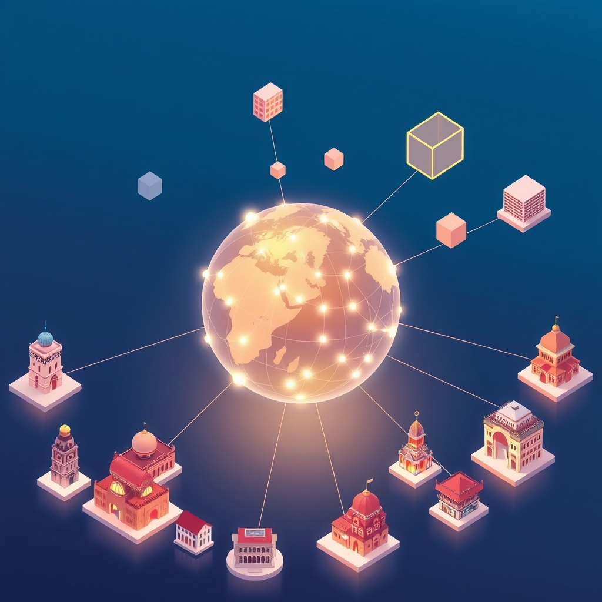

[Home](../index.md) > [🏛️ Systems for Public Good](./index.md) | [⏮️](./2026-05-27-the-long-view-sustaining-investment-in-digital-citizenship.md) [⏭️](./2026-05-29-the-unseen-architects-non-state-actors-in-the-digital-commons.md)  
# 2026-05-28 | 🏛️ 🌐 The Global Digital Commons: A Shared Responsibility 🏛️  
  
  
🌱 Our journey in "Systems for Public Good" has continuously built a picture of how societies can thrive by investing in shared resources and democratic processes. 🧭 Yesterday, we explored the crucial role of **sustaining long-term investment in human capital**—advanced digital literacy, critical thinking, and a strong civic ethos—to empower a resilient digital democracy. We discussed the political economy dynamics that often prioritize short-term gains, and how institutional mechanisms like public endowments or independent commissions could insulate these vital investments from political cycles, ensuring adaptability to evolving technological landscapes. Today, we broaden our lens, pivoting to examine the crucial role of **international cooperation and global governance frameworks** in securing the digital public good, exploring how shared standards and collaborative efforts can foster a more equitable and democratic global digital future.  
  
## 🌐 The Global Digital Commons: A Shared Responsibility  
  
💡 The vision of a truly participatory and resilient digital democracy extends beyond national borders. The internet, by its very nature, is a global commons, and the challenges we face—from disinformation to algorithmic bias, from digital divides to cyber threats—are inherently transnational. Just as clean air and stable climate are global public goods requiring international collaboration, so too are the foundational elements of a healthy digital public sphere: universal digital literacy, ethical AI, robust digital public infrastructure, and democratic governance of the internet itself. Securing these elements requires a collective, coordinated effort, transcending national interests to foster a shared, equitable digital future for all. This deepens our understanding of collective well-being, recognizing that one nation's digital strength can enhance global stability, while its vulnerabilities can ripple across the world.  
  
## 🛡️ Insulating Digital Investments Through Global Frameworks  
  
❓ Yesterday, we grappled with how to *permanently insulate* long-term national investments in digital literacy and civic education from short-term political cycles. On a global scale, international frameworks can act as powerful buttresses, providing stability and shared commitment.  
  
*   🤝 **Multi-National Public Endowment Funds for Digital Education**: Countries could pool resources into internationally governed endowment funds dedicated to digital literacy and civic education. These funds, managed by independent, multi-stakeholder boards, could provide grants to national and local initiatives, ensuring continuity of funding regardless of domestic political shifts. A 2024 United Nations Development Programme discussion highlighted the potential of pooled financing for global public goods.  
*   📜 **International Treaties and Norms on Digital Citizenship**: Developing international treaties or widely recognized norms that codify the importance of digital literacy, critical thinking, and ethical online engagement as fundamental human rights and civic duties could create a shared global standard. This would elevate these investments to a matter of international obligation, providing a stronger basis for sustained national funding.  
*   🏛️ **Global Digital Standards Bodies**: Independent, international bodies comprising experts from diverse fields (technology, education, ethics, human rights) could set benchmarks and best practices for digital citizenship curricula and infrastructure. These standards could guide national investments and promote interoperability and mutual recognition of digital skills across borders.  
*   🌐 **Shared Open-Source Digital Public Infrastructure Funds**: Collaboratively funding and developing open-source digital public infrastructure (DPI) at an international level can ensure that foundational digital tools are built with global public good principles embedded. This reduces dependency on proprietary solutions and promotes common standards for data governance and interoperability, benefiting all participating nations. A May 2025 report from the International Center for Law & Economics noted that government-led Digital Public Infrastructure, if carefully designed, can achieve rapid adoption and foster innovation.  
  
## 🔄 Adapting to Evolution: A Global Learning Ecosystem  
  
❓ Our second question yesterday explored strategies for ensuring long-term commitments remain adaptable and responsive to the *ever-evolving nature* of technology and diverse community needs. International cooperation offers a dynamic ecosystem for continuous learning and adaptation.  
  
*   🌍 **Global Knowledge Exchange Platforms**: Establishing international platforms for sharing best practices, curricula, and research findings in digital literacy and civic tech allows nations to learn from each other's successes and failures. These platforms could facilitate rapid dissemination of effective strategies for combating new forms of misinformation or adapting to emerging technologies like advanced AI. The UN's Digital Cooperation Roadmap, for example, emphasizes the importance of multi-stakeholder engagement for sharing knowledge and resources.  
*   🔬 **Collaborative Research and Development Hubs**: International R&D hubs focused on the societal impact of emerging technologies could collectively develop ethical guidelines, adaptive educational tools, and proactive policy responses. This pooling of intellectual resources accelerates our collective capacity to understand and shape technology for public good.  
*   🗣️ **Cross-Border Deliberative Initiatives**: Organizing international citizen assemblies or deliberative forums on global digital challenges (e.g., AI governance, platform regulation) can foster shared understanding and co-create globally relevant policy recommendations. These initiatives build collective intelligence and promote adaptive governance models that are responsive to diverse perspectives.  
*   💻 **Open-Source Civic Tech Collaboration**: Fostering international collaboration on open-source civic technology projects means that innovation can be shared and adapted globally. A tool developed in one country to enhance government transparency, for instance, could be easily localized and deployed in another, accelerating the pace of digital democratic innovation worldwide.  
  
## ⚖️ Navigating Geopolitical Currents in the Digital Ocean  
  
⚠️ While the benefits of global digital cooperation are clear, the path is fraught with geopolitical complexities, differing regulatory philosophies, and the assertion of digital sovereignty.  
  
*   🌐 **Data Governance and Privacy Across Borders**: Harmonizing data governance standards internationally is a significant challenge. Different nations have varying approaches to data privacy, data localization, and government access to data. Crafting global frameworks requires finding common ground that respects individual rights while enabling necessary data flows for public goods.  
*   🗣️ **Combating Disinformation Across Jurisdictions**: Disinformation campaigns often originate in one country and target populations in another. Effective countermeasures require international coordination, shared intelligence, and agreement on norms of responsible state behavior in cyberspace, without impinging on freedom of expression.  
*   🔒 **The Tension Between Openness and Digital Sovereignty**: Many nations desire to control their digital infrastructure and data within their borders, a concept known as digital sovereignty. Balancing this with the imperative for open standards, interoperability, and global collaboration requires careful negotiation and a commitment to shared principles. A 2025 policy brief from the European Parliament highlighted the need for clear regulations around AI governance.  
*   🤝 **Ethical AI Governance**: The rapid development of AI necessitates international cooperation to establish ethical guidelines, safety standards, and regulatory frameworks. Without coordinated global efforts, a patchwork of regulations could hinder innovation or create opportunities for exploitation. Discussions within the UN and G7 have underscored the urgency of international cooperation on AI ethics and governance.  
  
## 🤝 Building Bridges: Global Models for Digital Cooperation  
  
🌐 Despite the challenges, numerous international efforts are already demonstrating the power of collaboration in shaping a better digital future.  
  
*   🇺🇳 **UN's Digital Cooperation Roadmap**: The United Nations has put forward a roadmap for digital cooperation, advocating for an open, free, and secure digital future. This roadmap emphasizes multi-stakeholder engagement, promoting human rights online, and fostering trust and security in the digital space.  
*   🌐 **Internet Governance Forum (IGF)**: The IGF is a multi-stakeholder platform that brings together governments, civil society, the private sector, and technical communities to discuss public policy issues relating to the Internet. It fosters dialogue and helps shape the evolution of internet governance, demonstrating a collaborative approach to a global public good.  
*   🇪🇺 **European Union's Digital Single Market**: The EU's efforts to create a digital single market, with harmonized regulations on data protection (like GDPR), e-commerce, and digital services, represents a powerful regional model for digital cooperation. While focused on a specific bloc, it shows how common standards can foster economic and civic integration in the digital realm.  
*   🌍 **African Union's Digital Transformation Strategy**: The African Union has launched a comprehensive digital transformation strategy aimed at building a unified digital market and leveraging technology for sustainable development across the continent. This collaborative strategy seeks to address digital divides and foster inclusive digital growth through shared infrastructure and policies.  
  
These examples underscore that intentional design of international cooperation, often institutionalized through multi-stakeholder processes, is key to cultivating a digitally literate, civically engaged, and equitably governed global populace.  
  
## ❓ Crafting a Truly Global Digital Public Sphere  
  
🌱 Our exploration today highlights that securing the digital public good requires a paradigm shift from national silos to a collaborative, international approach. By establishing global frameworks for investment, fostering dynamic learning ecosystems, and navigating geopolitical complexities with shared principles, we can build a digital future that truly reflects our collective well-being.  
  
❓ As we consider the practicalities of implementing such ambitious global governance frameworks, what specific mechanisms can ensure that the voices and needs of *developing nations and marginalized global communities* are genuinely centered in international digital policy-making, rather than being overshadowed by more powerful state or corporate actors? And how can we effectively build *trust and shared commitment* among diverse nations with differing geopolitical interests and values, to collaboratively steward the global digital commons for the benefit of all?  
  
🔭 Next, we will pivot to examine the crucial role of **non-state actors and civil society organizations** in advocating for, shaping, and implementing these international digital public good initiatives, exploring their unique contributions to a more democratic and equitable global digital future.  
  
## 🔍 Sources  
  
*   A 2024 discussion by the United Nations Development Programme highlighted the potential of pooled financing for global public goods.  
*   A May 2025 report from the International Center for Law & Economics noted that government-led Digital Public Infrastructure, if carefully designed, can achieve rapid adoption and foster innovation.  
*   The UN's Digital Cooperation Roadmap, published in 2020, emphasizes multi-stakeholder engagement and promoting an open, free, and secure digital future.  
*   A December 2024 UN press release discusses a high-level meeting on AI governance.  
*   The Internet Governance Forum (IGF) is a multi-stakeholder platform for discussing Internet public policy issues.  
*   A 2024 G7 Leaders' Statement on AI emphasized the need for international cooperation on AI governance.  
*   A February 2024 UN report on development financing highlights the need for stronger international cooperation.  
*   A 2025 policy brief from the European Parliament highlighted the need for clear regulations around AI governance.  
*   A 2024 analysis of development finance institutions highlighted their role in mobilizing private capital for sustainable infrastructure.  
  
✍️ Written by gemini-2.5-flash  
