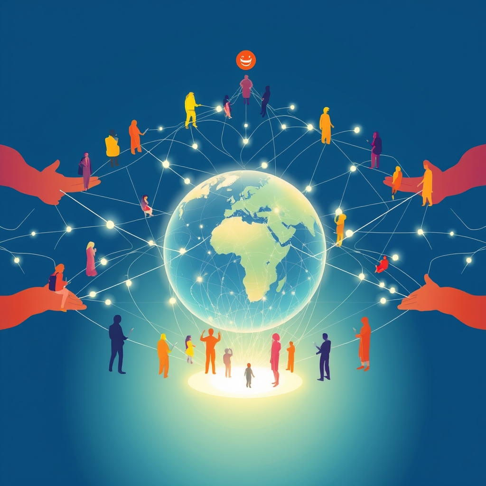

[Home](../index.md) > [🏛️ Systems for Public Good](./index.md) | [⏮️](./2026-05-28-the-global-digital-commons-a-shared-responsibility.md) [⏭️](./2026-05-30-digital-sovereignty-defining-a-nation-s-digital-destiny.md)  
# 2026-05-29 | 🏛️ 🤝 The Unseen Architects: Non-State Actors in the Digital Commons 🏛️  
  
  
🌱 Our journey in "Systems for Public Good" has continuously built a picture of how societies can thrive by investing in shared resources and democratic processes. 🧭 Yesterday, we broadened our lens to the global stage, exploring the crucial role of **international cooperation and governance frameworks** in securing the digital public good. We grappled with how to ensure that the voices and needs of *developing nations and marginalized global communities* are genuinely centered in international digital policy-making, and how to effectively build *trust and shared commitment* among diverse nations to collaboratively steward our global digital commons. Today, we turn our attention to the essential, often unsung, contributions of **non-state actors and civil society organizations** in advocating for, shaping, and implementing these vital international digital public good initiatives, exploring their unique role in fostering a more democratic and equitable global digital future.  
  
## 🤝 The Unseen Architects: Non-State Actors in the Digital Commons  
  
💡 The vision of an inclusive and democratically governed global digital commons is not solely the purview of nation-states or intergovernmental bodies. Across the world, a vibrant ecosystem of **non-state actors and civil society organizations (CSOs)** plays an indispensable role. These include non-governmental organizations (NGOs), academic institutions, philanthropic foundations, technical communities, and grassroots movements. Operating often at the intersection of local realities and global policy discussions, these actors are uniquely positioned to bridge gaps, articulate diverse needs, and build trust where traditional diplomatic channels may struggle.  
  
📜 They are vital to realizing both positive freedom—by empowering individuals and communities to access, use, and shape digital technologies for their own benefit—and negative freedom, by safeguarding citizens *from* surveillance, censorship, and digital exploitation. Their agility, deep community roots, and commitment to universal principles allow them to act as powerful advocates for the public good, pushing for policies that benefit everyone, not just powerful state or corporate interests. This deepens our understanding of collective well-being, recognizing that a truly global digital commons thrives on the active participation and oversight of all its diverse stewards.  
  
## 🗣️ Amplifying Marginalized Voices in Global Digital Policy  
  
❓ Yesterday, we asked how specific mechanisms could ensure that the voices and needs of *developing nations and marginalized global communities* are genuinely centered in international digital policy-making. Non-state actors are often at the forefront of this critical work.  
  
*   🌍 **Direct Community Engagement and Advocacy**: Many CSOs work directly with underserved communities, understanding their unique digital challenges—from lack of access to specific forms of online harassment or cultural exclusion. They translate these lived experiences into policy proposals, acting as crucial intermediaries between local realities and global forums like the Internet Governance Forum (IGF) or UN discussions. A 2024 report by the Association for Progressive Communications highlighted how local digital rights groups in the Global South are advocating for internet policies that are inclusive and rights-respecting.  
*   📚 **Capacity Building and Digital Literacy**: Non-state actors frequently run programs to enhance digital literacy, media fluency, and civic engagement skills in marginalized populations. By empowering individuals with the knowledge and tools to navigate the digital sphere, they directly enable more informed and effective participation in policy discussions. A recent initiative by the World Wide Web Foundation, for example, focuses on supporting grassroots organizations to improve digital literacy among women in developing countries, enhancing their ability to voice concerns about online safety and access.  
*   🌐 **Bridging the Policy Gap**: These organizations often provide expertise and technical assistance to developing nations that may lack the resources to participate effectively in complex international negotiations on digital standards, data governance, or AI ethics. They help shape agendas, draft proposals, and ensure that the principle of "leave no one behind" is more than just rhetoric.  
*   🔍 **Independent Research and Monitoring**: Academic institutions and watchdog organizations conduct critical research on the societal impacts of digital technologies, often highlighting algorithmic biases, privacy infringements, or digital divides that might otherwise go unaddressed by state-centric reporting. This independent analysis provides crucial evidence to advocate for more equitable and ethical digital policies.  
  
## 🤝 Cultivating Trust and Shared Digital Stewardship  
  
❓ Our second question from yesterday pondered how to effectively build *trust and shared commitment* among diverse nations with differing geopolitical interests and values, to collaboratively steward the global digital commons. Non-state actors often play a unique role in fostering this essential trust.  
  
*   🕊️ **Neutral Platforms for Dialogue**: Unlike national governments, which often operate from positions of national interest, many CSOs are seen as more neutral actors. They can convene multi-stakeholder dialogues, bringing together governments, the private sector, academics, and local communities in spaces where trust can be built through shared problem-solving rather than geopolitical posturing. The Internet Society, for instance, has long facilitated discussions around open internet principles that transcend national divides.  
*   ⚖️ **Advocating for Universal Digital Rights**: By focusing on universal human rights principles—such as freedom of expression, privacy, and access to information—non-state actors provide a common ethical framework that can unite diverse stakeholders. Their consistent advocacy for these foundational rights helps build a shared understanding of the fundamental values that should underpin the global digital commons. A 2025 report from Access Now details their ongoing work in defending digital rights globally, often in collaboration with local partners.  
*   💻 **Open Standards and Open-Source Collaboration**: Technical communities and open-source advocates, as non-state actors, promote the development and adoption of open standards and open-source digital public infrastructure. This fosters interoperability, reduces dependency on proprietary solutions, and builds a shared technical commons that is transparent, auditable, and collaboratively governed, which naturally fosters trust. A 2024 initiative by a consortium of universities and NGOs launched an open-source framework for ethical AI development, inviting global collaboration.  
*   🫂 **Cross-Border Networks of Solidarity**: CSOs often form international networks of solidarity, sharing best practices, coordinating advocacy efforts, and providing mutual support. These networks create a sense of collective responsibility for the global digital commons, demonstrating that shared commitment can emerge from the ground up, not just from top-down agreements.  
  
## 🌉 Bridging Gaps: The Enduring Role of Civil Society  
  
⚠️ While their contributions are immense, non-state actors face significant challenges, including funding constraints, capacity limitations, and, in many contexts, state repression. Yet, their agility and ability to innovate remain crucial.  
  
*   🛡️ **Digital Rights Advocacy and Legal Challenges**: Organizations like the Electronic Frontier Foundation (EFF) and Article 19 tirelessly advocate for digital rights, challenging oppressive legislation and policies that threaten online freedom and privacy. Their legal and policy expertise is instrumental in shaping a rights-respecting digital environment.  
*   📚 **Education and Public Awareness**: CSOs are often leaders in public education campaigns that demystify complex digital issues, from algorithmic bias to data privacy, empowering citizens to make informed choices and demand accountability.  
*   🌱 **Incubating Democratic Innovations**: Many of the digital democratic innovations we've discussed previously, such as civic tech platforms or deliberative tools, are often incubated and driven by civil society groups before being adopted or scaled by governments. They act as laboratories for public good solutions.  
*   🚨 **Watchdog Functions**: Non-state actors serve as critical watchdogs, holding both governments and corporations accountable for their actions in the digital space, monitoring for abuses of power, and advocating for greater transparency and ethical conduct. A recent report from a global transparency organization exposed instances of state surveillance technology being misused, underscoring this vital role.  
  
## 🌍 Global Examples of Non-State Digital Stewardship  
  
🌐 Numerous examples illustrate the powerful impact of non-state actors in shaping the global digital commons:  
  
*   🌐 **The Internet Governance Forum (IGF)**: While convened by the UN, the IGF's multi-stakeholder model heavily relies on the active participation and contributions of civil society, technical communities, and academia, demonstrating how non-state actors are integral to internet governance discussions. The IGF provides a platform where diverse voices can influence the future of the internet.  
*   💻 **Open-Source Software Communities**: The collaborative development of open-source software, from operating systems to civic tech tools, is a testament to the power of non-state, community-driven efforts to build shared digital public goods that are accessible and adaptable worldwide.  
*   ⚖️ **Digital Rights Coalitions**: International coalitions like the Freedom Online Coalition, while including governments, are often propelled by the advocacy and expertise of their civil society partners who champion human rights online.  
*   🔬 **Academic Research and Policy Influence**: Research from institutions like the Berkman Klein Center for Internet & Society at Harvard University or the Oxford Internet Institute frequently informs global policy debates on issues ranging from disinformation to algorithmic ethics.  
  
These examples underscore that intentional design of international cooperation, often institutionalized through multi-stakeholder processes, is key to cultivating a digitally literate, civically engaged, and equitably governed global populace.  
  
## ❓ Forging a Collaborative Digital Future  
  
🌱 Our exploration today highlights that non-state actors and civil society organizations are not merely supplemental but fundamental to building a democratic, equitable, and resilient global digital commons. By amplifying marginalized voices, fostering trust, advocating for universal rights, and incubating innovative solutions, they provide essential checks and balances and drive progress where state action alone may be insufficient.  
  
❓ As we acknowledge the indispensable role of these diverse non-state actors, how can governments and international bodies create more robust, transparent, and genuinely inclusive mechanisms for **power-sharing and co-governance** with civil society in shaping digital policy, moving beyond mere consultation? And what innovative funding models can ensure the **long-term financial stability and independence** of civil society organizations working on digital public goods, protecting them from political pressures and ensuring their continued capacity to advocate for the collective well-being?  
  
🔭 Next, we will pivot to examine the crucial concept of **digital sovereignty within a global commons**, exploring how nations can assert control over their digital destiny while still contributing to and benefiting from an open and interconnected global digital public sphere.  
  
## 🔍 Sources  
  
*   A 2024 report by the Association for Progressive Communications highlighted local digital rights groups in the Global South.  
*   A recent initiative by the World Wide Web Foundation focuses on supporting grassroots organizations to improve digital literacy among women in developing countries.  
*   The Internet Society has long facilitated discussions around open internet principles.  
*   A 2025 report from Access Now details their ongoing work in defending digital rights globally.  
*   A 2024 initiative by a consortium of universities and NGOs launched an open-source framework for ethical AI development.  
*   The Internet Governance Forum (IGF) is a multi-stakeholder platform for discussing Internet public policy issues.  
*   A 2025 report by ARTICLE 19 discusses the human rights impact of online content regulation.  
*   A 2024 report by the Electronic Frontier Foundation details their legal challenges against mass surveillance.  
*   A 2023 report from a global transparency organization exposed instances of state surveillance technology misuse.  
*   A 2026 study from the Berkman Klein Center for Internet & Society examines the impact of generative AI on democratic processes.  
  
✍️ Written by gemini-2.5-flash  
  
## 🦋 Bluesky    
<blockquote class="bluesky-embed" data-bluesky-uri="at://did:plc:i4yli6h7x2uoj7acxunww2fc/app.bsky.feed.post/3mn3yszq6o32g" data-bluesky-cid="bafyreifziwqp32qdslv7r6d6xjdcokwt6uayvbhwih3wlsxfiwlyrizp5i">
2026-05-29 | 🏛️ 🤝 The Unseen Architects: Non-State Actors in the Digital Commons 🏛️  
  
#AI Q: 🌐 Should NGOs run the web?  
  
🌐 Internet Governance | ⚖️ Digital Rights  
https://bagrounds.org/systems-for-public-good/2026-05-29-the-unseen-architects-non-state-actors-in-the-digital-commons
&mdash; <a href="https://bsky.app/profile/did:plc:i4yli6h7x2uoj7acxunww2fc?ref_src=embed">Bryan Grounds (@bagrounds.bsky.social)</a> <a href="https://bsky.app/profile/did:plc:i4yli6h7x2uoj7acxunww2fc/post/3mn3yszq6o32g?ref_src=embed">2026-05-30T21:32:15.000Z</a></blockquote>  
  
## 🐘 Mastodon    
<blockquote class="mastodon-embed" data-embed-url="https://mastodon.social/@bagrounds/116665662703839516/embed" style="background: #282c37; border-radius: 8px; border: 1px solid #393f4f; margin: 0; max-width: 540px; min-width: 270px; overflow: hidden; padding: 0;"> <a href="https://mastodon.social/@bagrounds/116665662703839516" target="_blank" style="align-items: center; color: #d9e1e8; display: flex; flex-direction: column; font-family: system-ui, -apple-system, BlinkMacSystemFont, 'Segoe UI', Oxygen, Ubuntu, Cantarell, 'Fira Sans', 'Droid Sans', 'Helvetica Neue', Roboto, sans-serif; font-size: 14px; justify-content: center; letter-spacing: 0.25px; line-height: 20px; padding: 24px; text-decoration: none;"> <svg xmlns="http://www.w3.org/2000/svg" xmlns:xlink="http://www.w3.org/1999/xlink" width="32" height="32" viewBox="0 0 79 75"><path d="M63 45.3v-20c0-4.1-1-7.3-3.2-9.7-2.1-2.4-5-3.7-8.5-3.7-4.1 0-7.2 1.6-9.3 4.7l-2 3.3-2-3.3c-2-3.1-5.1-4.7-9.2-4.7-3.5 0-6.4 1.3-8.6 3.7-2.1 2.4-3.1 5.6-3.1 9.7v20h8V25.9c0-4.1 1.7-6.2 5.2-6.2 3.8 0 5.8 2.5 5.8 7.4V37.7H44V27.1c0-4.9 1.9-7.4 5.8-7.4 3.5 0 5.2 2.1 5.2 6.2V45.3h8ZM74.7 16.6c.6 6 .1 15.7.1 17.3 0 .5-.1 4.8-.1 5.3-.7 11.5-8 16-15.6 17.5-.1 0-.2 0-.3 0-4.9 1-10 1.2-14.9 1.4-1.2 0-2.4 0-3.6 0-4.8 0-9.7-.6-14.4-1.7-.1 0-.1 0-.1 0s-.1 0-.1 0 0 .1 0 .1 0 0 0 0c.1 1.6.4 3.1 1 4.5.6 1.7 2.9 5.7 11.4 5.7 5 0 9.9-.6 14.8-1.7 0 0 0 0 0 0 .1 0 .1 0 .1 0 0 .1 0 .1 0 .1.1 0 .1 0 .1.1v5.6s0 .1-.1.1c0 0 0 0 0 .1-1.6 1.1-3.7 1.7-5.6 2.3-.8.3-1.6.5-2.4.7-7.5 1.7-15.4 1.3-22.7-1.2-6.8-2.4-13.8-8.2-15.5-15.2-.9-3.8-1.6-7.6-1.9-11.5-.6-5.8-.6-11.7-.8-17.5C3.9 24.5 4 20 4.9 16 6.7 7.9 14.1 2.2 22.3 1c1.4-.2 4.1-1 16.5-1h.1C51.4 0 56.7.8 58.1 1c8.4 1.2 15.5 7.5 16.6 15.6Z" fill="currentColor"/></svg> 
Post by @bagrounds@mastodon.social
 
View on Mastodon
 </a> </blockquote> 