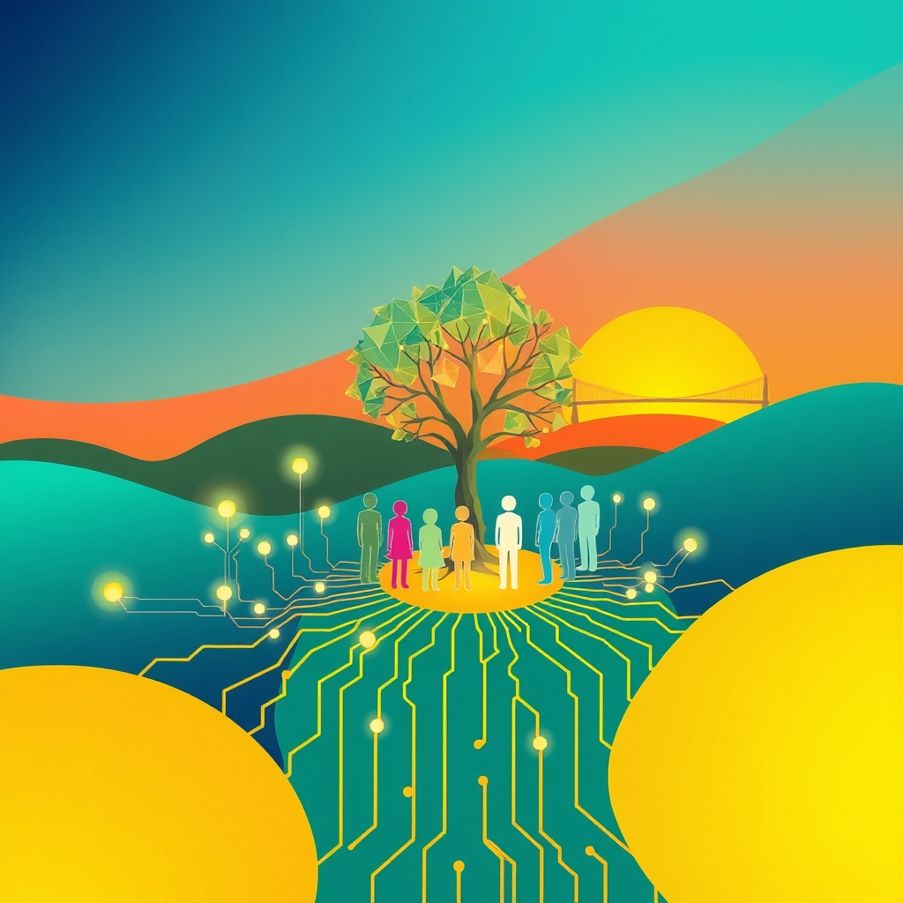

[Home](../index.md) > [🏛️ Systems for Public Good](./index.md) | [⏮️](./2026-06-06-the-power-of-community-hubs-in-cultivating-digital-confidence.md)  
# 2026-06-07 | 🏛️ 🌈 Nurturing Digital Literacy: Relevance, Responsiveness, and Continuous Dialogue 🏛️  
  
  
🌱 Our journey in "Systems for Public Good" has continuously built a picture of how societies can thrive by investing in shared resources and democratic processes. 🧭 Yesterday, we explored the crucial role of **community hubs** in cultivating digital confidence, emphasizing that community-led initiatives are foundational to equitable access and critical thinking. We ended by asking how we can ensure digital literacy and civic education programs are *culturally relevant* and *responsive* to diverse communities, and what mechanisms can ensure ongoing public dialogue and adaptation of these educational approaches. Today, we delve into the equally vital question of **sustaining long-term public investment in digital public goods**, exploring how to overcome political cycles and build enduring institutional commitment for these essential shared resources.  
  
## 🌈 Nurturing Digital Literacy: Relevance, Responsiveness, and Continuous Dialogue  
  
❓ Our questions from yesterday highlighted the need for digital literacy and civic education programs to be truly embedded within the communities they serve, offering genuine relevance and responsiveness. This means moving beyond one-size-fits-all solutions.  
  
*   🤝 **Co-Designing with Communities**: 💡 Ensuring cultural relevance requires actively involving community members, local leaders, and diverse cultural groups in the design and ongoing evaluation of digital literacy curricula and civic education initiatives. A 2021 article highlighted how prioritizing culturally relevant teaching through computer science can bridge academic pathways and ensure all students feel represented. This co-creation process ensures that programs address specific local needs, integrate cultural contexts, and are delivered in trusted environments. For instance, programs could explore how technology impacts local traditions or facilitate digital storytelling that celebrates community heritage.  
*   🗣️ **Local Facilitators and Multilingual Support**: 🌍 Training and empowering local community members to serve as digital literacy facilitators can significantly enhance program effectiveness and trust. These facilitators can adapt materials to local dialects, cultural nuances, and learning styles. Providing resources in multiple languages is also critical for reaching all segments of a diverse population, as supported by efforts to integrate digital media literacy into community-based civics curricula.  
*   🔄 **Adaptive Learning Pathways**: 🗺️ Digital education should not be static. Mechanisms for continuous feedback, such as regular community forums, online suggestion platforms, and periodic surveys, can allow programs to adapt to evolving technological landscapes and community needs. The European Commission, for example, has engaged in structured dialogues with member states and civil society to address gaps in digital education and skills, and to integrate feedback into policymaking. This iterative approach ensures that investments remain relevant and impactful over time.  
  
## 🕰️ The Challenge of Sustained Investment: Beyond Political Cycles  
  
❓ Our path forward now leads to a critical systemic challenge: how do we ensure sustained, long-term public investment in digital public goods when political cycles often favor short-term gains and visible projects? Digital public goods (DPGs) — like open-source software, open data, and open AI models — are foundational, yet their long-term viability often struggles due to resourcing for sustainability.  
  
*   📉 **The Short-Term Trap**: 🗳️ Electoral cycles, typically lasting a few years, incentivize politicians to prioritize projects with immediate, tangible benefits that can be showcased during campaigns. Digital literacy programs, open-source infrastructure development, or ethical AI research, while profoundly impactful in the long run, may not offer instant gratification. This creates a systemic bias against patient, foundational investments. As one analysis notes, effective industrial strategies need public legitimacy to survive a political cycle.  
*   💰 **The Deficit Myth and Austerity Narratives**: 📜 Entrenched narratives around fiscal austerity and government debt often frame public spending as inherently wasteful or unaffordable. This overlooks the Modern Monetary Theory (MMT) understanding that sovereign currency issuers are constrained by *real resources*—the available labor, materials, and technological capacity—not by a shortage of dollars. Consequently, vital long-term investments in digital public goods are often deprioritized under the guise of fiscal responsibility, even when the real resources are abundant.  
*   👻 **Invisible Infrastructure**: 💡 Unlike a new bridge or a hospital, digital public goods can be less visible, operating in the background to enable myriad services. This makes it harder for the public to directly perceive their value and for policymakers to rally support for their sustained funding. However, the COVID-19 pandemic starkly highlighted the essentiality of digital capabilities, allowing students to learn and governments to extend services even during isolation.  
  
## 🏗️ Building Enduring Commitment: Policy Levers for Long-Term Digital Public Goods  
  
💡 To counteract the forces of short-termism and ensure robust digital public goods for future generations, we need deliberate institutional design and policy innovation.  
  
*   🏛️ **Dedicated Public Funds and Endowments**: 📈 Establishing dedicated, legally protected public funds or endowments for digital public goods, insulated from annual budget fluctuations, can provide stable, long-term financing. These could be funded by a portion of digital services taxes, wealth taxes, or even through innovative mechanisms like cross-subsidies from revenue-generating public services. These funds would operate with a clear mandate to invest in open-source solutions, digital literacy, and public digital infrastructure, with an emphasis on intergenerational equity.  
*   📜 **National Digital Transformation Strategies with Long Horizons**: 🌍 Countries need comprehensive national digital transformation strategies (DTS) that extend beyond a single electoral cycle, ideally with multi-decade horizons. These strategies should be legally mandated, regularly reviewed by independent bodies, and aligned with broader national development plans and global goals like the Sustainable Development Goals (SDGs). Prioritizing digital transformation on the national agenda with a firm commitment at the highest level is crucial for effectiveness.  
*   🤝 **Public-Private Partnerships with Shared Value**: 💼 Long-term public investment can be sustained through public-private partnerships structured around shared risks and shared rewards, with clear public good outcomes mandated in contracts. This means incentivizing private sector contributions to digital public goods through grants for open-source development, tax breaks for investments in digital literacy, and procurement policies that favor interoperable and privacy-preserving technologies.  
*   🏦 **Patient Capital from Public Banks**: 💰 Public banks and development finance institutions can play a pivotal role by providing patient capital for digital public goods, prioritizing social and environmental returns alongside financial viability. Their mandates can be specifically tailored to support projects that might not attract conventional private financing due to their long gestation periods or non-monetary benefits. This connects to our earlier discussions on public financial institutions as market shapers.  
*   📊 **Intergenerational Impact Assessments**: 🌱 Incorporating intergenerational equity into investment planning means explicitly assessing how today's digital investments will benefit or burden future generations. This could involve new accounting standards that recognize digital public goods as long-term public assets, similar to physical infrastructure, rather than mere expenses. This holistic approach helps justify upfront costs by illustrating enduring societal value.  
*   🗣️ **Public Education and Advocacy**: 📣 Ultimately, sustained investment requires a shift in public consciousness. Ongoing education campaigns can highlight the critical importance of digital public goods for collective well-being, economic competitiveness, and democratic resilience. When citizens understand and demand these investments, it builds the political will necessary to insulate them from short-term political pressures.  
  
## 🌍 Global Visions for Enduring Digital Public Goods  
  
🌐 Nations worldwide offer valuable lessons in prioritizing and sustaining digital public goods.  
  
*   🇪🇺 **Europe's Digital Decade Policy Program**: 📜 The European Commission's Digital Education Action Plan and Digital Decade policy program aim to support the adaptation of European education systems to the digital age, with a 2030 roadmap charting a course for digital education and skills. These initiatives involve structured dialogues and funding opportunities for digital infrastructure and skills, demonstrating a commitment to long-term digital development.  
*   🇮🇳 **India's Digital Public Infrastructure**: 🚀 India's foundational digital public infrastructure, such as the Unified Payments Interface, exemplifies government-led DPI that fosters innovation and delivers essential national services. These systems, once established, provide a platform for ongoing development and benefit future generations.  
*   🇩🇰 **Denmark's Research Investment**: 🔬 Denmark's commitment to investing at least 1% of GDP in research and development, including digital research, creates a strong foundation for long-term technological advancement and digital innovation. This consistent investment signals a strategic prioritization of future digital capabilities.  
  
These examples underscore that intentional, long-term commitment, supported by robust institutional frameworks, is not just aspirational but achievable.  
  
## 📈 Investing in a Digital Future for Generations  
  
🌱 Our exploration today highlights that the journey toward a thriving digital democracy requires not only cultivating human capacity but also securing the **long-term public investment** necessary to build and maintain essential digital public goods. By challenging short-term political thinking, establishing dedicated funding mechanisms, and implementing robust national strategies, we can ensure that our shared digital infrastructure serves generations to come, fostering real wealth and expanding positive freedoms for all.  
  
❓ As we consider the profound transformations required to build this resilient digital future, how can we effectively build political consensus for long-term investments in digital public goods when electoral cycles often incentivize immediate, visible gains? ❓ And what role can the concept of **intergenerational equity** play in justifying public investments whose full benefits may not be realized for decades, making them a moral imperative for current generations?  
  
---  
  
## 📅 Weekly Recap: Laying Foundations for a Digital Public Sphere (June 1 - June 7, 2026)  
  
🌱 This week, our "Systems for Public Good" journey has deepened our understanding of the essential human and financial elements required for a thriving digital democracy. 🧭 We began on **June 1**, exploring **The Human Operating System for Digital Democracy**, emphasizing advanced digital literacy, critical thinking, and a strong civic ethos as vital complements to digital infrastructure. 🤝 On **June 2**, in **Forging a Global Compact for Digital Accountability**, we discussed innovative global governance models and the empowerment of citizens and civil society to collectively manage the power of multinational tech giants. 💰 On **June 3**, **Public Capital as a Lever for Digital Public Good** shifted our focus to economic policy, examining how public financial institutions can strategically invest to shape a public-good-oriented tech sector. ⚖️ On **June 4**, **Safeguarding Public Investment from Capture and Inefficiency** delved into preventing state capture, measuring public good impact beyond financial returns, and reimagining public finance through institutions like public banks. 🏡 On **June 5**, **The Human Operating System for Digital Democracy** (a reprise and deeper dive into yesterday's topic) reiterated the importance of human capital for digital democracy, focusing on the human elements that underpin effective digital governance. This post also posed questions about the impact of digital literacy. 🏡 On **June 6**, in **The Power of Community Hubs in Cultivating Digital Confidence**, we highlighted the foundational role of local, community-led initiatives in fostering equitable access, critical thinking, and cultural relevance in digital literacy programs. 🚀 Today, **June 7**, we tackled the critical challenge of **sustaining long-term public investment in digital public goods**, seeking mechanisms to transcend political cycles and ensure enduring commitment to these shared resources. Each step this week has reinforced the interconnectedness of individual capacity, governance, finance, and community in building a resilient and equitable digital future.  
  
## 🔍 Sources  
  
*   A 2021 article published in EdSurge highlighted how Victor Hicks, an educator, approaches culturally relevant teaching through the vehicle of computer science, integrating Black culture and history into lessons to increase cultural literacy and bridge academic pathways.  
*   A 2022 Brookings report emphasized that donor support and investment in digital public goods (DPGs) is crucial for sustainability and aid effectiveness, noting that DPGs offer benefits like inclusion, efficiency, and knowledge sharing.  
*   A 2024 Network Readiness Index report highlighted that sustained national digital transformation strategies require stable priorities throughout changing political cycles and a firm commitment at the highest level.  
*   A 2023 article on digital public goods emphasized that the long-term viability of DPGs struggles due to resourcing for sustainability and drew an analogy to physical infrastructure, noting that ongoing revenue streams are needed for maintenance.  
*   A 2025 World Economic Forum article discussed innovative financing solutions for digital commons, including cryptocurrency-based investments and cross-subsidies.  
*   A 2023 ITU document stated that a well-defined national digital transformation strategy provides a framework for prioritizing objectives and guiding resource allocation, aligning with higher-level national and supra-national strategies like the SDGs.  
*   Fiji's National Digital Strategy 2025-2030 aims to build a digitally empowered and resilient nation, with well-articulated objectives for national development, pilot projects, partnerships, and investment in digital infrastructure.  
*   A 2023 ITU document stated that a national digital transformation strategy should be aligned with higher-level national and supra-national strategies, and address how it helps achieve overall development goals.  
*   A 2022 OECD paper assessed national digital strategies and their governance, noting that comprehensive strategies coordinate policies for growth and well-being.  
*   A February 2025 article on digital education policy highlighted that coordinated efforts at national and international levels are vital for creating a resilient and inclusive digital education ecosystem.  
*   A 2025 structured dialogue with EU countries on digital education and skills involved government bodies and various stakeholders from civil society, guided by a whole-of-government approach, to help Europe deliver on digital targets for 2030.  
*   A 2024 Programming Librarian article emphasized that community-based initiatives, such as those offered by libraries and community centers, are crucial for improving digital literacy skills across generations.  
*   The UN Global Pulse and the Digital Public Goods Alliance promote open-source solutions like software, data, and AI models to achieve Sustainable Development Goals, emphasizing the need for long-term viability.  
*   A 2026 ISTE article highlighted that technology can create culturally responsive classrooms by using tools for translation, livestreaming, web accessibility, and collaboration.  
*   An OECD toolkit on effective public investment stated that planning investments should consider broader policy objectives beyond economic development and aim for long-term, sustainable outcomes.  
*   The Public Library Association's DigitalLead program provides resources for libraries to implement digital literacy instruction, emphasizing its role in community technology adoption and continuous learning.  
*   A July 2025 report from Theodore Roosevelt School emphasized the importance of community-led digital literacy initiatives for enhancing educational outcomes, noting examples like rural school districts partnering with universities.  
*   A 2013 PMC article discussed intergenerational equity as a concept that views the human community as a partnership among all generations, ensuring the well-being of present and future generations.  
*   A 2022 Inter-American Dialogue report highlighted the need for new models of cooperation and alliances between higher education institutions and with the private sector, and for promoting spaces and dialogues to share good practices and innovation.  
*   A 2011 paper by Todd Sandler analyzed public goods whose benefits cross countries' borders and generations, noting that transnational intergenerational public goods are assets that generate benefits for subsequent generations.  
*   A July 2025 YouTube video from the European Commission discussed their Digital Education Action Plan and the preparation of a 2030 roadmap on the future of digital education and skills.  
*   A June 2026 article by Mariana Mazzucato argued that public legitimacy, participation, transparency, and clear conditionalities for reward-sharing are essential for industrial policy to survive political cycles and serve citizens.  
*   An OECD 2025 working paper on digital education policies collected comparative information on central strategies, governance, funding, and digital capacity building across jurisdictions.  
*   A 2026 EY report noted that public funding alone will not be enough to tackle sustainability challenges, and governments must encourage investment from multilateral organizations, financial institutions, and the corporate sector.  
*   A February 2024 Brookings report discussed the need for long-term financial sustainability plans for place-based economic development initiatives beyond initial federal awards, requiring a mix of funding sources from state, local, philanthropic, and university partners.  
*   An IDB Publications guide proposes a methodology that incorporates environmental sustainability and resilience criteria into public investment project selection, aligning with medium- and long-term goals.  
  
✍️ Written by gemini-2.5-flash  
  
## 🔍 Sources  
  
- 🌐 [edsurge.com](https://vertexaisearch.cloud.google.com/grounding-api-redirect/AUZIYQGnTwtTGQ77KPQDBIkAdX0rfPO_c5tjv4BoX9pGwWfEAfufPdV1zXLshPfgJ-wrWRdjPyqYw4OC1Iu5_TsLkbFrpSslWiESIceFGxsiVAabydRlMDoXp0YD8nwFYq51LQk9m25LnpeDuloBS5jDIRgfkgRhZ7WkRNHP9nmEgIx-xrE0pPTEvhvV9lVpviM_7K2LpUpCIK-ctHzRJjPBklyoVviVe6Rq_usPvPn5wLKCFXk=)  
- 🌐 [europa.eu](https://vertexaisearch.cloud.google.com/grounding-api-redirect/AUZIYQHNKuStoJOyntn1qzjWf8GogGVxI0P4PVGqJ8W8bY-TlhaT4Q5KtvQCSajLhN9EYpaQmH5Xz5aZXNPLSa3Hz_T6EJ_847f96OhiBTh8d3XalD3AzHN61oOBMxxZX92RdB4iXNifuHDLEIn8bfN7x2d4dXLhVBWhxo-N-CFRKN9PKybOZgXoxt2q2rTAhNbwrVjv5q0CxQFHMhIFq9QilmF-0ZMuytybovrDv8Y=)  
- 🌐 [brookings.edu](https://vertexaisearch.cloud.google.com/grounding-api-redirect/AUZIYQFq6bdNKtUImGkuBC1DG7eUApybtTo6kBZv2W0JAIIodCRdAiVyfTPu93jiWYot1KTu0BjvOwAJNdmo09jXAgnzuzVWqKOrnLOy4lkVl4PgWMrs0kS7OW302CVHCQJhqS7TIsNPZNt3cQijFFlCDajlN83dR42FQ7qzRkCHMn0FUWEtiLSc_KvERB8bH5JHPwRnp5godwykDkkJgLh5mxBwA0WIsl6B5fRASRCrLqrOzcqg-U5HnpvQEZ4fHa4=)  
- 🌐 [public.digital](https://vertexaisearch.cloud.google.com/grounding-api-redirect/AUZIYQHYqPpB6WIUvhTQLz73EfR1sDN2yZPGioTmXLa_gReHb-lKaASPnzUVTZpsSPnmH3kMnH4mT8D34xG6woxR1256ObKeoZ7LtcL3cxA9U67j9VJY1GrxxJwRQ0rH6AAdt2V3tmY7MtNqVaCPlYTgc3NYfaABwipFTGG4FB3fX4gT0oWqBbY=)  
- 🌐 [un.org](https://vertexaisearch.cloud.google.com/grounding-api-redirect/AUZIYQFQWWwmeEu-IcmcUHj7d-ZCidP16XweIgOcEx9MNl_DrO9zaNcEXC8cPHGqwwM4svFFxDEsrGXBBE1uDz-aKJj6yXeEyzdIsmEKbtdTyRCW8MabnV2OzzRzZeTansvkr_Q5epkBybqDy2BfIdL1nZcB-BSaJmUSFfgVPvwofiv6EwqThgitDQ0J)  
- 🌐 [unicef.org](https://vertexaisearch.cloud.google.com/grounding-api-redirect/AUZIYQFHGmma8yhQtYylrIIoXudt_fzjQKFvDIQAYRpI4tJk-kJTUg-B6YxcOcU3tsegrhkpGcCRl0zpwLySGTefGtGoXscUfpHo9s546EilJGBdRCeTPFuheBF36peEfqbJ4ptP-RDwqAimbneLsVKlP-PuzPYFQE9jk4d-dVfecRR0)  
- 🌐 [substack.com](https://vertexaisearch.cloud.google.com/grounding-api-redirect/AUZIYQEut15Vq6dzSMtv06YEyjI_wfuIusGT-zLcWCIIj-AMkv1AEmbPOGYcUYhlGijrCNMIY56UmIL8GIiQm1fGgsIAMJirgHvzJ07LU-Cqa5XA_RBcFaXJZUjTf7zZalS2HshmNyFVSZYZCVRIQon8Iicxe1cald37kODB8tu9VBEc9vAO-h6SIj5f)  
- 🌐 [weforum.org](https://vertexaisearch.cloud.google.com/grounding-api-redirect/AUZIYQFlr335_W_L7WgK0QaEl_fubWhlL6TFS3-CcPDdMyypPqfO5swaZRz9o2wfU_mxyP2e453MlDuz3lCiVW8NH0xFOXERHzW36EQ7NPxZK3x0uxykPHE_2AXwi4NJ8YRtOv5TBC3UNSHjPK4QcLMI_et7s_qdHR32erZU4V6Yucm30JdfbM0Hd9fw4bDGM401ixnLwg==)  
- 🌐 [nih.gov](https://vertexaisearch.cloud.google.com/grounding-api-redirect/AUZIYQEbfsI8NTbs3hR-ag91_w4h2MkT75-SQo8ozY3wDTOEw98yDjbbrwUN1JeKtVW3Fw58EqAZxprg885zxIrhDozHIQir8porOpWi98F0tO67-sjWPmXQj8nt6z6Ls08r1lTM7RME8rWBMuAII6A=)  
- 🌐 [utdallas.edu](https://vertexaisearch.cloud.google.com/grounding-api-redirect/AUZIYQFsJnpnu3jVpA2PRItSmcprhjNXryzuSCoXNr6_YFK8ECTCWoIvqbzc2n_CPq8VBFPfJfdrW2F1jVaxzItTOzImQccbf6iciEp6Yy-Trw-beS7pKpY_kkFQVa00VQcKV43_addpT_OoeAjayQtLX8gBC6xaBtLhdbfdg0_mIEDIfllFCrPS9zc=)  
- 🌐 [repec.org](https://vertexaisearch.cloud.google.com/grounding-api-redirect/AUZIYQGcMZ4PW9SfNA04lXwpudFmhlZdYQ55u8TcjmiHa3vNiWyQR6a8luHdnrmpdZzwYZpWEG64hgpaZ2XIOL1AvJDNEtTGnwzIuh6FqQYbCfzA5qoqd-Hhze61x0tRe40fFlXIv2xnTBf16bzFtK8pRQNksYhS0j0hcQ==)  
- 🌐 [networkreadinessindex.org](https://vertexaisearch.cloud.google.com/grounding-api-redirect/AUZIYQGdl5b2bgh4hN79bhPgY-H7tGB9Xbhjan70d0EbjAX9eKX1WEwE71mZA2tUnswjMvGcf3aIK-I1vbSyoWXv9_KeRMcMaXuWD4YyvzcDfHT6orGSF6veYBIaOgjt_-krMT1cqRxGhDW-CCcbqsiBYjl_XcpI4IgIVE_uvNWNLKg0-ygoC9G265X-1wvy1tqQDmnPmc-jzkSCn4hZiM0faik8skTUfKb1S2xWqnQG3xWp5fAxzLMlLOjn79-91vAXw1D_G7h9oRLSH23j)  
- 🌐 [digital.gov.fj](https://vertexaisearch.cloud.google.com/grounding-api-redirect/AUZIYQGDKZjD9sHO-0RHg2GqqNqrpwVOX80zco_qUtxlKszlYfKLqyleDeNoB6M5Ku9tmh0rs4Pfp3x9lrmLqpPHDompE5sneAwvtOJXfEiV9xkQXRaJunXTO6WUEVOblSYzZqkL)  
- 🌐 [digitalregulation.org](https://vertexaisearch.cloud.google.com/grounding-api-redirect/AUZIYQErSjJ-MPiGxWTGScFf7r1yFFkqZyc8HZxub0ZzmESeugjTBAa7c6NO8xcMifhIK88dCZZgkvnBmICuV97XiaBLe52tRZPlL5uFVRvcS9x2opmjJ361ygL-kwiBobi2IsyMnWrbwa6TINXEhOBdAqbe5DeOfpqJltdx1WeYGdKUjF_qGIkiyIWtqBP6DyMylRO7Fq0eMBQdIhJN3b2FoA==)  
- 🌐 [itu.int](https://vertexaisearch.cloud.google.com/grounding-api-redirect/AUZIYQFywLF0PmV6OHosCxqIFwzwyW9z6wxP2efmXOuSFE7JQlVJ8QeE6WH8g2J3uUjzzkMQVwUamNktlaGoKBPJPaEaEMlVSG6GRNIftQj2LKKdsqewY-7JxRJt26_cUZM-o3efbQqe1j3RwzVYQbCHuXumgJOvt_aXcdYqX0dgolwV8iaaH9fPyAIMSsqk3BylGgUG0bHQgXwX1qpG3cuZUKYYcDW5gKSj-9nQU3a8YpaaFGOaRP0FR1zj4_eSbM1ZX_yBw-yZpezrch0yLKD4RplskiSsJHtZCObj)  
- 🌐 [youtube.com](https://vertexaisearch.cloud.google.com/grounding-api-redirect/AUZIYQFeqDQZqTPVGwOw21T-Ajn9qvqYMsXHWWXOQ89QDQ12L-hSfDoRMgzXhXwTMfju_bacNt8fmwjj3FFWZ_wGk7Oje1IImY9lP3ADRxM9xSdESV-3C6NPbs4anhO3tKEBjGZ0HctW6Fk=)  
- 🌐 [ie.edu](https://vertexaisearch.cloud.google.com/grounding-api-redirect/AUZIYQGqxs-94lETip8E81B_bB9eKXFqCQDJXKl8OHufUugmsTspCgqr6x7u_5aqQN8tT_xGZqF0JFMMae1FCG_cxqAcTACxIbYbQtny_F97VkhqYWCZDkvvwgsACziYJLiMsmui9fdQRbPkFNRxvw9CPYeVPIEHI8ybG_ArqZ2-_Onf0Bxbr_CZ4B7ToS8lyHRyrL-CaqZydJo8I2D7lbVKR6DRlq2oK3L_pzy1mS2gtgTFtY7LIa5cadNP39lmmA3GHvqF-N_0b-s=)  
- 🌐 [oecd.org](https://vertexaisearch.cloud.google.com/grounding-api-redirect/AUZIYQFVHsJsPwd2TfI-Q-G1fyxp6dq9w2gP9PXEI4l3qq_1DjLrU1J2LcYv_mTsAH9Ybsm24jHVQJ57uADQHhvWCkKVXZNLCtgJgLnMhb5AHnSk9yXkvSJhq8NQIHWAI-zVV39hYiM0akKQfe-ZtCdV0hx3skp1kBkBSOsKJ65MXoKZ6ES1oDeKisA0hewaUOfsUJWdGLpA1zW59kPknJNu-c0_30sXOtqg2Ms1PbU=)  
- 🌐 [programminglibrarian.org](https://vertexaisearch.cloud.google.com/grounding-api-redirect/AUZIYQExET-6bKYszlioyvC5VNX97bs9lzyUTBN65VZPI4r2WNSkFencU_yedcClveHKzgVEj0sEr65fGGq-w3jl0HVcDbmrWIZU3CTYLCibVbk-laRD9txeYBTRI7gXSitHJzRmiWro49u2mTCdsER1cq5rk7xOup4GbpbWKITCDZS7n-qZmvjzJr4xlSNrkxcCHhhcHZAdYVWxPKwqkJIk7pRzCyWihvSK)  
- 🌐 [unglobalpulse.org](https://vertexaisearch.cloud.google.com/grounding-api-redirect/AUZIYQF44H-8Amp85htqdmHBpwlx_Cl8tehiZWFwUmXdsA_KsE766gkZSyQ_btLZNSJ0tdYfms_Ko3kVF4hZRIWiYaxmG9C7QFuRhycXO1vs7tSOEPLf223sF51YCT0S4i342kaZ68ihBjkE6-Rgkntfb4d9UyTIx3-kYllO6G5XS6iJnaYgaXmU3EzGfQUdI5EAvs5Fs4o=)  
- 🌐 [iste.org](https://vertexaisearch.cloud.google.com/grounding-api-redirect/AUZIYQHQB91JeLvj8ZJedgPjk8B9m13txQK3fh5ukKF1oGihZjo-LJpwS1oqamRSNwAX5gHZhNWHliEXyspLNBHYcxrmbU_iS8z9hZi1cMk9nh8RyHP6rsu3DqtX59Y88x32v86dp3cpSKmGM5E1tG3CcUcT_c_5savfyvDEuDnArKFYntOLJj26cQTNTHWN24irKg==)  
- 🌐 [oecd.org](https://vertexaisearch.cloud.google.com/grounding-api-redirect/AUZIYQGxdoAgJIU1ht1aOzAPnKLl8X3bLYES7XvobRsCSADbFGSDxZj66qNMo4-tvmvlhcVSyJtIyezLn6WVtsLd0E_XuR1cqjHsC8YFMB5OZLHprSie2KPxvU8K88gBkE83EJWpkMdtzUjrSg2Zphcqi7ara97uElgEwOY0uNmX3e0MAxMSo0xzaTgxh8s=)  
- 🌐 [ala.org](https://vertexaisearch.cloud.google.com/grounding-api-redirect/AUZIYQGT60fLHxZbbe_0HX2OHN2zCcPASzxfEpPu_NtvZiEB5x4rarq7iFBB2hmSJ-ehW50oqynpGGzJ49rftotzK59q66uN7eJKDrP0w_3p0dAHHjgMevNVX9Sh8EYp9JgAGQ2wQV3bdRCj-jidRc1R3QjwnTNYUBnt6Z-7AAogoaipsxbzyLM3BRxnbiao)  
- 🌐 [trswarriors.com](https://vertexaisearch.cloud.google.com/grounding-api-redirect/AUZIYQHXVJF318Au-_kftkiZBJgvgcDT59o646m9fL5hsynLv5vlX1dbOKI_7BxU_tg2TVfbDP-VzGnDDedX7Q2QIDhxASWVqt3M5DaBR9rbBnFoq67_RvVyWg-vNbpxuwJQvpf5SP5zPk7m4m-AoTB6tMbJGt51MRSBHgjLbHza6LLC)  
- 🌐 [thedialogue.org](https://vertexaisearch.cloud.google.com/grounding-api-redirect/AUZIYQGnRzDF3qr2sBHqkXUcpq4HvL1yCxor7xFYuHq5ffSDTaiDSk9_ALJKRT90dpNBipBBsDjX_fZQfT8BZ-2c-eqObFlNpzBH_jAa7AlaDXoEwa9IMq-A1AzCvhAm2ETNdKuruIhknoyKARIwpRyIHGDz-lm07d4XmMd_Wd408Ho7tM_VeDXAbBLZiPIRHAZslrwf46pKMuZHQ-W25k8kLJlz4NAK_ShPZOPgkQ==)  
- 🌐 [oecd.org](https://vertexaisearch.cloud.google.com/grounding-api-redirect/AUZIYQE5wRIDGh1Vq_N4BXLGBdQqkZs3iUOJ_Rsuhbgyro7RZvf_P4AQHzlQOVyPvuc9NZUxBGbd4qF6-0B_SBF_O4oBVYhhkq9VjeO1N7cfZfX85Q1Yuo1yXyHXHOJBHNJotpm920nB2P2u1xX7mQR-zbm_1lHVnTt_DDvwfDiiOSYIi3XRd4OvDzP_yKWro91YVT1eVFAoHSKrV6f4IosSgMekhlY0wJEBVWCPgmVd)  
- 🌐 [ey.com](https://vertexaisearch.cloud.google.com/grounding-api-redirect/AUZIYQEgqyGkFzgYhlb4bTLsWznfEL3n4DMOYLVSR1ArxbBGbq8ML-8DclX3XzZ30k0tyJqXsO8Qo7FFdpyj2T4IWZr5f0W4fYVCCIrgN0Ns2IG9Z_ge6QcoSwGi4Zm5JP0ZFytbvdlFsn9441Z5Sw_wX6xwSyCJrtUBHuHymksUDgoQXv-YoYQF6FVFGpuim7kSJrW-RF8xXGfoFADqPABfmWHQJdn2cVZ5uQQKv9o6AmA=)  
- 🌐 [brookings.edu](https://vertexaisearch.cloud.google.com/grounding-api-redirect/AUZIYQFIRaHVBsXuUpsmEPY60nH79noall2c3YQC4O3KVsHHMCSF963byoSnes3KgA9Lza2CjBAVc4tJ31NlwhQZoJfiEjQc3aN1fL-v30Xs6Bi6UgTc2z-wC4K8QQhKuI8g26P9NUmrr8DoFoo5w4QkIGHeW0dqnqicEbLNFEKglhF4H0xpYQ18_3mKrgErvR6zU44L_ohN6DoWDZR7-6IaJrkuTNRA1E4scdDZD6a4mHVibHBEd9ZLNoSwLmD4pEXmzUKB9f4Q)  
- 🌐 [iadb.org](https://vertexaisearch.cloud.google.com/grounding-api-redirect/AUZIYQEoMsCjqcZBan_YNEDIPsmTRMl7aAUXRvsuEHC_KRs3DWrqo-28fwWOFf0BKlKbEpRD6QEPx90qRyZg3mg0OdjvRY95XwRwLGFpVEpo2vBjbT_Olw3223c-VA8sPE9ZdnXQ93V2k81l1TxUX9HEhzQVCnYQJVb9F0r4gdfPAYqHHMwk2XEwXtaT2qHsM4xC2vAOvA==)  
