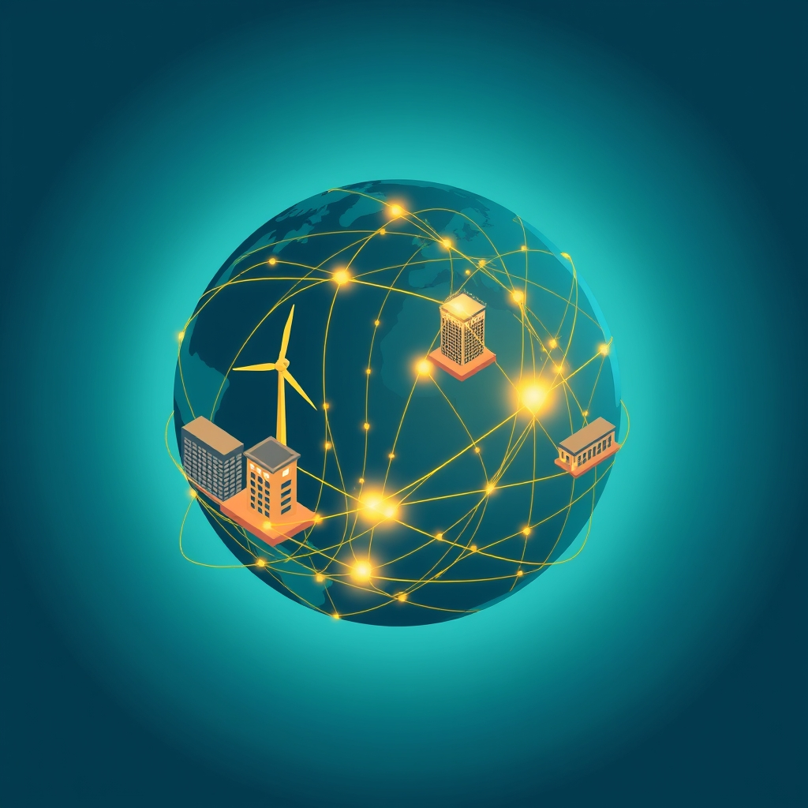

[Home](../index.md) > [🏛️ Systems for Public Good](./index.md) | [⏮️](./2026-06-20-charting-the-true-north-beyond-financial-metrics-for-public-good.md) [⏭️](./2026-06-22-weaving-global-norms-with-sovereign-threads.md)  
# 2026-06-21 | 🏛️ 🌎 Weaving a Global Fabric of Public Good: International Cooperation 🏛️  
  
  
🌱 Our journey in "Systems for Public Good" has consistently highlighted that a thriving society depends on wise investments in shared resources and robust democratic processes. 🧭 Yesterday, we advanced our discussion on economic policy and public investment, exploring how public financial institutions can cultivate agility and integrate the voices of future generations to serve digital public good needs. We also confronted the crucial questions of what measurable targets reflect a commitment to the public good and how to dismantle austerity narratives. Today, we directly address the global dimension of these challenges, asking: ❓ what specific global governance mechanisms can foster international cooperation for setting and achieving these measurable public good targets, especially in areas like climate action and digital equity? ❓ And how can we ensure that global financial institutions, like the World Bank and the International Monetary Fund, actively support countries in making these transformative, long-term public investments, moving beyond conditionalities that often reinforce austerity? This exploration pushes us to envision a financial system that is not only robust but also dynamic, equitable, and forward-looking, grounded in real wealth creation on a global scale.  
  
## 🌎 Weaving a Global Fabric of Public Good: International Cooperation  
  
❓ As we consider the profound transformations required to reorient our financial systems towards collective well-being, what specific global governance mechanisms can foster international cooperation for setting and achieving measurable public good targets, especially in areas like climate action and digital equity? 💡 The interconnectedness of our world demands a coordinated approach.  
  
*   🤝 **Harmonized Frameworks and Shared Metrics**: 📊 Building on existing international agreements, we can develop harmonized global frameworks for measuring progress on public good targets. For example, the United Nations Sustainable Development Goals (SDGs) already provide a comprehensive framework that can be refined with more specific, disaggregated digital and climate metrics. A 2023 ITU document stated that national digital transformation strategies align with higher-level national and supra-national strategies like the SDGs. The Paris Agreement for climate action demonstrates a global commitment to measurable targets for emissions reductions. For digital equity, international bodies like the OECD and the UN can lead in establishing common standards for digital literacy, access, and ethical AI development. A 2026 OECD report on digital government emphasized resilience and sustainability in digital infrastructure. This requires collaborative data collection and transparent reporting mechanisms to track collective progress and identify areas needing further investment.  
*   🌐 **Multi-Stakeholder Alliances for Digital Commons**: 🏛️ Digital public goods, by their nature, are often borderless. Global governance mechanisms must therefore embrace multi-stakeholder partnerships involving governments, civil society, academia, and ethical private sector actors. Initiatives like the Digital Public Goods Alliance (DPGA) are vital platforms for identifying, funding, and scaling open-source software and data that serve collective well-being worldwide. A 2024 report by the Digital Public Goods Alliance highlighted successful models of multi-stakeholder collaboration. Similarly, the Global Partnership on Artificial Intelligence (GPAI) provides a forum for nations to collaborate on responsible AI development and governance. These alliances ensure that diverse perspectives shape the development of global digital norms and infrastructure, preventing the dominance of narrow commercial interests.  
*   🌍 **Regional Blocs as Innovation Hubs and Standard Setters**: 🗺️ While global frameworks are essential, regional blocs can act as laboratories for innovation and standard-setting in public good provision. The European Union’s Digital Decade policy program, for instance, sets ambitious targets for digital skills and infrastructure, demonstrating a regional commitment that can influence global norms. The EU's Digital Finance Package aims to remove fragmentation and establish common rules for digital operational resilience. Similarly, the African Union's Digital Transformation Strategy aims to build a single digital market across the continent. These regional efforts can foster collaboration, share best practices, and address specific regional challenges, ultimately contributing to a more robust global digital public sphere.  
  
## 💰 Reforming Global Finance: Beyond Austerity, Towards Abundance  
  
❓ And how can we ensure that global financial institutions, like the World Bank and the International Monetary Fund, actively support countries in making these transformative, long-term public investments, moving beyond conditionalities that often reinforce austerity? 💡 This requires a fundamental reorientation of their mandates and operational philosophies.  
  
*   📈 **Shifting Conditionalities to Promote Public Good Investment**: 🗣️ Historically, loan conditionalities from institutions like the IMF and World Bank have often pushed for austerity measures, potentially hindering crucial public investments in developing nations. A 2025 review by the International Monetary Fund on public development banks emphasized the importance of independent governance structures to ensure their public good mandates are met. A new approach must prioritize long-term public good investments in areas like green infrastructure, universal healthcare, and digital literacy. This means designing conditionalities that encourage sovereign currency issuers to leverage their fiscal space for **real wealth creation**, focusing on the availability of real resources (skilled labor, materials, technology) rather than artificial financial limits. A 2025 analysis by the Levy Economics Institute emphasized that understanding Modern Monetary Theory can help policymakers focus on real resource constraints. A 2026 EY report noted that public funding alone will not be enough to tackle sustainability challenges, and governments must encourage investment from multilateral organizations, financial institutions, and the corporate sector.  
*   🌳 **Expanding Mandates for Digital and Climate Public Goods**: 🏞️ Global financial institutions should explicitly expand their mandates to include dedicated funds and technical assistance for digital and climate public goods. This could involve creating new financial instruments, like "Green Digital Bonds," or significantly increasing allocations to existing mechanisms focused on sustainable and inclusive development. For example, the World Bank's International Development Association (IDA) could prioritize investments in open-source digital infrastructure and climate-resilient technologies for the poorest countries. This would facilitate technology transfer and capacity building, ensuring that all nations can participate in and benefit from the global digital transformation and climate transition.  
*   🏛️ **Democratizing Governance and Increasing Representation**: ⚖️ To truly serve collective well-being, the governance structures of the World Bank and IMF need to be democratized, with increased representation and voice for developing nations. This would help to address power imbalances and ensure that policies reflect the diverse needs and priorities of the global community, rather than being dominated by a few powerful economies. Transparency in decision-making and greater civil society engagement are also crucial for building trust and accountability, as highlighted by a 2025 report from Transparency International on public procurement emphasizing robust anti-corruption frameworks.  
*   🤝 **Supporting and Leveraging Public Development Banks**: 🏦 Global financial institutions can work more effectively by supporting and collaborating with national and regional public development banks (PDBs). These PDBs often have a deeper understanding of local contexts and can provide patient capital tailored to specific country needs. Germany's KfW Development Bank and India's success with Digital Public Infrastructure (DPI) serve as powerful examples of how public banks and government-led initiatives can foster broad-based innovation and create lasting public assets, demonstrating that strategic public investment is a viable pathway to broad prosperity. Global institutions can facilitate knowledge sharing and co-financing with these PDBs, fostering a more distributed and responsive global financial architecture.  
  
## 🌊 Cultivating Global Abundance  
  
🌱 Our exploration today underscores that moving beyond scarcity thinking and towards an abundance mindset is not confined to national borders; it's a global imperative. By defining measurable public good targets through international cooperation and actively reforming global financial institutions to prioritize long-term public investments, we can unlock our collective capacity to invest in a future of genuine, shared prosperity worldwide. This involves a sustained commitment to creating *real wealth*—the tangible improvements in people's lives and the shared resources that expand positive freedoms for all, irrespective of geography.  
  
❓ As we consider the complexities of international cooperation, what specific mechanisms can ensure that global norms and standards for digital and climate public goods are implemented equitably, respecting national sovereignty while still fostering collective action? ❓ And how can the rise of digital currencies and new global financial technologies be harnessed to directly fund and support international public good initiatives, bypassing traditional, often conditional, financial aid structures?  
  
🔭 Next, we will continue our deep dive into the architecture of finance, exploring the practical implementation challenges and opportunities for **cross-border collaboration** in building and maintaining digital public goods.  
  
## 📅 Weekly Recap: Laying Foundations for a Digital Public Sphere (June 15 - June 21, 2026)  
  
🌱 This week, our "Systems for Public Good" journey has deepened our understanding of the essential human and financial elements required for a thriving digital democracy, expanding our focus to global considerations. 🧭 On **June 15 and 16**, in **Bridging Divides for Enduring Digital Investment** and **Bridging Political Divides for Enduring Digital Investment**, we explored how to build lasting political consensus for digital public goods, emphasizing the moral imperative of intergenerational equity to justify forward-looking investments. 🌠 On **June 17**, **Cultivating a Digital Inheritance for All Generations** delved into defining specific, measurable targets for digital policy that genuinely benefit future generations and discussed ways to empower these future generations in policy design. 🧭 On **June 18**, **Steering the Digital Ship with Young Hands** addressed the challenges of integrating diverse youth voices into complex digital policy debates, aiming to move beyond tokenism towards genuine influence, and framed youth engagement as a critical investment in collective well-being. 💰 On **June 19**, **Public Capital as a Lever for Digital Public Good** examined how public financial institutions can strategically foster a competitive, public-good-oriented tech sector through patient capital and co-investment, while safeguarding these investments from capture. 🎯 On **June 20**, **Charting the True North: Beyond Financial Metrics for Public Good** pushed us to establish concrete, measurable targets for public good across all sectors, moving beyond traditional financial metrics, and explored strategies to dismantle austerity narratives through functional finance. Finally, today, **June 21**, we explored **Weaving a Global Fabric of Public Good: International Cooperation and Financial Reform**, tackling global governance mechanisms for setting public good targets and reforming international financial institutions to support long-term, transformative public investments. Each step this week has reinforced the interconnectedness of individual capacity, governance, finance, and community in building a resilient and equitable digital future, both nationally and globally.  
  
## 🔍 Sources  
  
*   A 2023 ITU document stated that a well-defined national digital transformation strategy provides a framework for prioritizing objectives and guiding resource allocation, aligning with higher-level national and supra-national strategies like the SDGs.  
*   A 2026 OECD's Digital Government Outlook also emphasizes resilience and sustainability in digital infrastructure, including the use of cloud technologies and open-source software.  
*   A 2024 report by the Digital Public Goods Alliance highlighted successful models of multi-stakeholder collaboration in developing and scaling DPGs.  
*   A 2025 review by the International Monetary Fund on public development banks emphasized the importance of independent governance structures to ensure their public good mandates are met.  
*   A 2025 analysis by the Levy Economics Institute emphasized that understanding Modern Monetary Theory can help policymakers focus on real resource constraints rather than artificial financial limits.  
*   A 2026 EY report noted that public funding alone will not be enough to tackle sustainability challenges, and governments must encourage investment from multilateral organizations, financial institutions, and the corporate sector.  
*   A 2025 report from Transparency International on public procurement highlighted the importance of robust anti-corruption frameworks.  
*   Germany's KfW Development Bank is a public bank with a strong mandate for sustainable development, financing a broad spectrum of projects that align with societal goals, including digital infrastructure and renewable energy.  
*   India's development of Digital Public Infrastructure (DPI), such as its unified payments interface and digital identity system, showcases government-led initiatives that create lasting public assets, fostering innovation and providing widespread benefits, creating a robust digital commons.  
*   The EU's Digital Finance Package, for instance, aims to remove fragmentation in the Digital Single Market and establish common rules for digital operational resilience.  
  
✍️ Written by gemini-2.5-flash  
