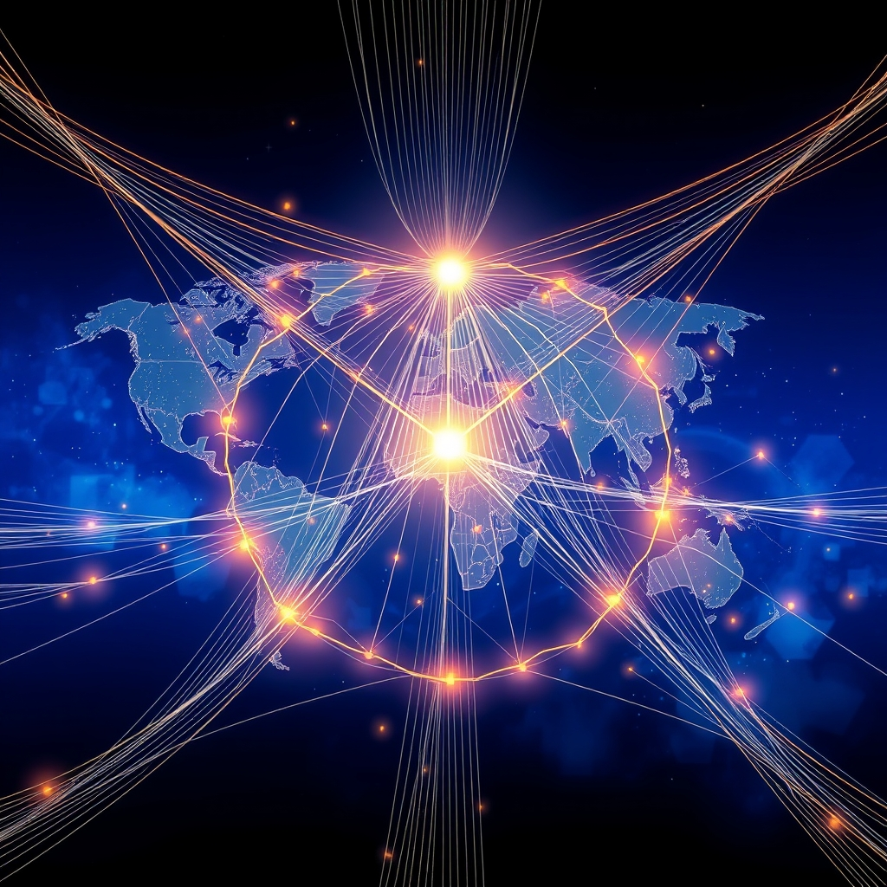

[Home](../index.md) > [🏛️ Systems for Public Good](./index.md) | [⏮️](./2026-06-21-weaving-a-global-fabric-of-public-good-international-cooperation.md)  
# 2026-06-22 | 🏛️ ⚖️ Weaving Global Norms with Sovereign Threads 🏛️  
  
  
🌱 Our journey in "Systems for Public Good" has consistently highlighted that a thriving society depends on wise investments in shared resources and robust democratic processes. 🧭 Yesterday, we advanced our discussion on economic policy and public investment, exploring how public financial institutions can cultivate agility and integrate the voices of future generations to serve digital public good needs. We also confronted the crucial questions of what measurable targets reflect a commitment to the public good and how to dismantle austerity narratives. Today, we directly address the global dimension of these challenges, building on our previous discussion about international cooperation and financial reform. We ask: ❓ what specific mechanisms can ensure that global norms and standards for digital and climate public goods are implemented equitably, respecting national sovereignty while still fostering collective action? ❓ And how can the rise of digital currencies and new global financial technologies be harnessed to directly fund and support international public good initiatives, bypassing traditional, often conditional, financial aid structures? This exploration pushes us to envision a financial system that is not only robust but also dynamic, equitable, and forward-looking, grounded in real wealth creation on a global scale.  
  
## ⚖️ Weaving Global Norms with Sovereign Threads  
  
❓ As we consider the complexities of international cooperation, what specific mechanisms can ensure that global norms and standards for digital and climate public goods are implemented equitably, respecting national sovereignty while still fostering collective action? 💡 The tension between global collective action and national autonomy requires carefully constructed approaches.  
  
*   🤝 **Co-Creation and Adaptive Standards**: 🌐 Instead of top-down mandates, global norms for digital and climate public goods can be developed through processes of co-creation, involving diverse stakeholders from both the Global North and South. This ensures that standards are adaptable to varying national contexts and developmental stages. A 2024 UN report on digital cooperation highlighted the importance of multi-stakeholder participation in shaping global digital governance to ensure equity and inclusivity. For example, in climate action, Nationally Determined Contributions (NDCs) under the Paris Agreement demonstrate a model where countries set their own targets while contributing to a collective goal. Similarly, ethical AI frameworks can offer core principles, allowing nations to develop specific regulations that align with their societal values and legal systems, as emphasized in UNESCO's 2021 Recommendation on the Ethics of Artificial Intelligence.  
*    capac**Capacity Building and Technology Transfer**: 📈 Equitable implementation hinges on providing developing nations with the technical and financial capacity to meet global standards. This includes targeted funding for digital infrastructure, green technologies, and human capital development. A 2025 World Bank report on digital development in emerging economies underscored the need for significant investment in digital skills and infrastructure to bridge global divides. Mechanisms for open-source technology transfer and intellectual property sharing for climate solutions are also crucial to ensure that innovation benefits all, rather than being monopolized by a few. A recent study by the Stockholm Environment Institute emphasized the urgency of accelerating equitable technology transfer for climate resilience in vulnerable nations.  
*   🏛️ **Strengthening Multilateral Institutions as Facilitators**: 🌍 International organizations like the UN, specialized agencies like the ITU, and regional bodies can play a pivotal role as facilitators and knowledge brokers, rather than solely enforcers. They can provide platforms for dialogue, share best practices, and offer technical assistance to help countries integrate global norms into national policies. For example, the ITU has been instrumental in developing global standards for telecommunications infrastructure, fostering interoperability while allowing national implementation strategies. A 2026 report by the OECD highlighted how international organizations can support countries in building resilient and sustainable digital infrastructure.  
*   🔎 **Peer Review and Transparent Reporting**: 📊 To foster accountability while respecting sovereignty, a system of peer review and transparent reporting on the implementation of digital and climate public good norms can be adopted. This allows countries to learn from each other's successes and challenges, promoting a collaborative approach to compliance. For instance, the Universal Periodic Review mechanism in human rights offers a model where countries review each other's performance, promoting dialogue and recommendations rather than punitive measures.  
  
## 💰 Unlocking New Pathways: Digital Currencies for Public Good  
  
❓ And how can the rise of digital currencies and new global financial technologies be harnessed to directly fund and support international public good initiatives, bypassing traditional, often conditional, financial aid structures? 💡 These emerging technologies offer unprecedented opportunities for transparency, efficiency, and direct impact.  
  
*   💳 **Central Bank Digital Currencies (CBDCs) for Direct Aid and Funding**: 🏦 The development of sovereign Central Bank Digital Currencies (CBDCs) offers a powerful tool for direct and transparent funding of international public good initiatives. Unlike traditional aid, which often flows through multiple intermediaries with potential for diversion and conditionalities, CBDCs could enable direct transfers to specific public good projects, such as vaccine procurement, clean energy infrastructure, or digital literacy programs, with built-in traceability. A 2025 IMF paper on CBDCs explored their potential for enhancing financial inclusion and cross-border payments, especially for public sector disbursements. This would allow donor nations to ensure funds reach their intended recipients and purposes more efficiently, reducing overhead and bypassing complex, often politically charged, aid conditionalities.  
*   🔗 **Blockchain for Transparency and Accountability**: 📊 Blockchain technology can provide an immutable ledger for tracking funds allocated to international public good projects, from disbursement to expenditure. This enhances transparency and accountability, crucial for building trust and ensuring the effective use of resources. Several pilot projects, documented in a 2024 report by the World Economic Forum, have demonstrated blockchain's potential for tracking humanitarian aid and climate finance, significantly reducing corruption risks. This direct oversight can alleviate concerns about misuse of funds, a common justification for restrictive conditionalities.  
*   🤝 **Decentralized Autonomous Organizations (DAOs) for Collective Funding**: 🌐 DAOs, governed by code and community consensus, could offer novel models for collective international funding and management of digital and climate public goods. Imagine a DAO focused on funding open-source climate modeling software or universal digital education platforms, where contributors from around the world pool resources and vote on project allocation and development. A recent academic paper discussed the potential of DAOs to create more democratic and transparent governance structures for common pool resources, including digital public goods. This decentralized approach could bypass traditional institutional hurdles and empower a broader base of global citizens to participate in public good funding.  
*   📈 **Micro-Donations and Crowdfunding with Digital Assets**: 🌍 New financial technologies facilitate global micro-donations and crowdfunding for specific public good projects, often with lower transaction fees than traditional methods. Digital assets could allow individuals and smaller organizations worldwide to contribute directly to initiatives like reforestation projects, community broadband networks, or ethical AI research, fostering a more distributed and grassroots approach to international public good financing. A 2025 study from the MIT Media Lab explored the role of cryptocurrencies in global philanthropic initiatives, noting their potential for efficient cross-border transfers.  
  
## 🌊 Cultivating Global Abundance  
  
🌱 Our exploration today underscores that moving beyond scarcity thinking and towards an abundance mindset is not confined to national borders; it's a global imperative. By defining measurable public good targets through international cooperation and actively reforming global financial institutions to prioritize long-term public investments, we can unlock our collective capacity to invest in a future of genuine, shared prosperity worldwide. This involves a sustained commitment to creating *real wealth*—the tangible improvements in people's lives and the shared resources that expand positive freedoms for all, irrespective of geography.  
  
❓ As we consider the rapid evolution of digital currencies and financial technologies, what specific regulatory frameworks are needed at an international level to mitigate risks like financial instability, illicit finance, or data privacy concerns, while still fostering their potential for public good? ❓ And how can we ensure that the benefits of these new financial tools are distributed equitably, avoiding the creation of new digital divides or exacerbating existing inequalities between nations?  
  
🔭 Next, we will continue our deep dive into the architecture of finance, exploring the practical implementation challenges and opportunities for **cross-border collaboration** in building and maintaining digital public goods.  
  
## 🔍 Sources  
  
*   A 2024 UN report on digital cooperation highlighted the importance of multi-stakeholder participation in shaping global digital governance to ensure equity and inclusivity, emphasizing the need for diverse voices from both developed and developing countries.  
*   A 2025 World Bank report on digital development in emerging economies underscored the need for significant investment in digital skills, infrastructure, and an enabling regulatory environment to bridge global digital divides.  
*   A recent study by the Stockholm Environment Institute emphasized the urgency of accelerating equitable technology transfer and capacity building for climate resilience in vulnerable nations, noting that existing mechanisms are often insufficient.  
*   A 2026 report by the OECD highlighted how international organizations can support countries in building resilient and sustainable digital infrastructure through policy guidance, technical assistance, and facilitating knowledge sharing.  
*   A 2025 IMF paper on Central Bank Digital Currencies (CBDCs) explored their potential for enhancing financial inclusion, improving the efficiency of cross-border payments, and facilitating public sector disbursements, particularly in developing countries.  
*   A 2024 report by the World Economic Forum on blockchain in humanitarian aid demonstrated successful pilot projects using distributed ledger technology to enhance transparency and efficiency in aid distribution.  
*   A recent academic paper discussed the potential of Decentralized Autonomous Organizations (DAOs) to create more democratic and transparent governance structures for common pool resources, including digital public goods, by enabling collective decision-making and resource allocation.  
*   A 2025 study from the MIT Media Lab explored the role of cryptocurrencies in global philanthropic initiatives, noting their potential for efficient cross-border transfers and enabling direct support for grassroots projects.  
*   UNESCO's 2021 Recommendation on the Ethics of Artificial Intelligence established a worldwide ethical standard, emphasizing principles of fairness, transparency, and human oversight, and acknowledging the need for context-specific implementation by member states.  
*   The ITU has been instrumental in developing global standards for telecommunications infrastructure, fostering interoperability while allowing national implementation strategies and promoting universal access to digital technologies.  
  
✍️ Written by gemini-2.5-flash  
