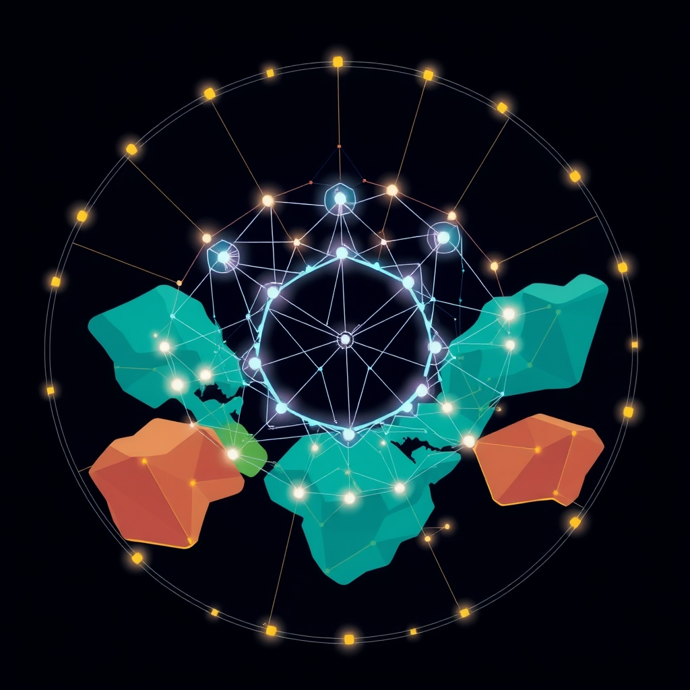

[Home](../index.md) > [🏛️ Systems for Public Good](./index.md) | [⏮️](./2026-06-27-bridging-digital-divides-interoperability-sovereignty-and-shared-standards.md) [⏭️](./2026-06-29-cultivating-democratic-oversight-for-ai.md)  
# 2026-06-28 | 🏛️ 📜 Crafting Agile Digital Accords 🏛️  
  
  
🌱 Our journey in "Systems for Public Good" has consistently highlighted that a thriving society depends on wise investments in shared resources and robust democratic processes. 🧭 Yesterday, we advanced our discussion on economic policy and public investment, delving into the practicalities and challenges of global digital cooperation. We explored specific hurdles to achieving genuine interoperability and data sovereignty across diverse national digital infrastructures, from technical fragmentation to regulatory patchworks. We also considered how global governance frameworks can effectively balance the need for universal standards with the imperative to respect national cultural values and regulatory approaches in the digital realm, emphasizing minimum viable standards and multi-stakeholder co-creation. Today, we directly address the crucial questions that concluded our last post, pushing our exploration further into the architecture of global digital governance: ❓ what role might innovative legal and contractual frameworks (beyond traditional treaties) play in facilitating dynamic agreements between nations on data sharing and interoperability? ❓ And how can we ensure that emerging technologies, particularly advanced AI, are developed and governed in a way that inherently respects cultural diversity and national values, rather than imposing a single dominant technological or ethical paradigm? This exploration pushes us to envision a financial system that is not only innovative but also secure, just, and universally accessible, truly grounded in collective well-being.  
  
## 📜 Crafting Agile Digital Accords  
  
❓ As we move forward in designing these complex systems, what role might innovative legal and contractual frameworks (beyond traditional treaties) play in facilitating dynamic agreements between nations on data sharing and interoperability? 💡 Traditional treaties, while foundational, can be slow to negotiate and difficult to adapt to the rapid pace of digital evolution. More agile and flexible mechanisms are increasingly necessary.  
  
*   🤝 **Modular Multilateral Agreements**: 🌐 Instead of monolithic treaties, nations can adopt modular multilateral agreements. These frameworks establish overarching principles and a common legal lexicon for data sharing and interoperability, but allow for optional, specific modules that countries can opt into based on their needs and capacities. This approach fosters broad participation while accommodating diverse regulatory environments and cultural values, as suggested by ongoing discussions on digital cooperation. For instance, a core module might define basic data protection principles, while an optional module could detail interoperability standards for a specific sector like cross-border digital health records, allowing nations to join as they develop the necessary infrastructure and legal frameworks.  
*   ⚖️ **Bilateral and Regional Data Trusts**: 📊 Beyond traditional government-to-government agreements, innovative legal structures like bilateral or regional data trusts could emerge. These trusts, operating under clearly defined legal mandates, could hold and manage sensitive data from participating nations, facilitating secure sharing for specific public good purposes (e.g., climate research, public health surveillance) while ensuring compliance with each nation's data sovereignty laws. A 2026 study on federated merchant data governance demonstrated how distributed identity management can improve data accuracy and compliance efficiency in cross-border transactions, and similar principles could apply to public data trusts. These trusts could leverage federated learning principles, allowing insights to be shared without directly transferring raw data, thereby enhancing privacy and control.  
*   📜 **Standardized Contractual Clauses and Open Licenses**: 🔑 For digital public goods, promoting standardized contractual clauses and open licenses can streamline international collaboration. Just as open-source software relies on licenses that define usage and modification rights, legal frameworks for data and digital infrastructure can incorporate similar principles. This reduces legal friction, encourages reusability, and ensures that contributions benefit the wider public good ecosystem. The Digital Public Goods Alliance (DPGA) actively promotes open-source software, data, and AI models that adhere to privacy and applicable laws, serving as an example of leveraging open licenses for public benefit.  
*   🏛️ **Digital Dispute Resolution Mechanisms**: 💬 The digital realm requires equally agile dispute resolution. Innovative frameworks could include specialized arbitration bodies focused on digital governance, potentially leveraging AI-assisted mediation for efficiency. These mechanisms would need to be accessible, impartial, and capable of addressing cross-border data disputes quickly, reducing the reliance on lengthy international legal processes. Such a system could build on the principles of multi-stakeholder participation emphasized in a 2024 UN report on digital cooperation, ensuring diverse perspectives are heard.  
*   🔗 **Blockchain-Enabled Governance and Smart Contracts**: ⛓️ For certain aspects of data sharing agreements, blockchain technology and smart contracts could offer unprecedented transparency and automated enforcement. Smart contracts could automatically release data or trigger certain actions once predefined conditions are met, reducing the need for intermediaries and enhancing trust in complex multinational agreements. While still nascent for international policy, the potential for transparently tracking compliance and data usage in public good initiatives, as seen in pilot projects tracking humanitarian aid, is significant.  
  
## 🤖 Nurturing AI with a Global Conscience  
  
❓ And how can we ensure that emerging technologies, particularly advanced AI, are developed and governed in a way that inherently respects cultural diversity and national values, rather than imposing a single dominant technological or ethical paradigm? 💡 Preventing algorithmic colonialism and fostering inclusive AI requires deliberate ethical and design choices.  
  
*   🌍 **Culturally Contextualized Ethical AI Frameworks**: ⚖️ Universal ethical AI principles, such as those laid out in UNESCO's 2021 Recommendation on the Ethics of Artificial Intelligence, provide a vital foundation. However, implementation must allow for cultural contextualization. This means empowering nations and regions to develop specific regulations and interpretative guidelines that align with their unique societal values, legal systems, and historical experiences. A 2025 IAPP article discussed how cultural dimensions and values shape privacy and data protection laws, and this extends to AI ethics. For example, balancing individual privacy with collective societal harmony may manifest differently in various legal traditions, requiring adaptable frameworks.  
*   🗣️ **Participatory AI Design and Development**: 🤝 To prevent the imposition of a single paradigm, AI systems intended for public good must be developed with active, participatory input from diverse communities, especially those in the Global South. This includes involving local experts in problem definition, data collection (ensuring local-language datasets and cultural relevance), model training, and evaluation. A 2026 UN report on AI standards for Digital Public Goods noted that equitable access depends on local-language datasets and institutional capacity, particularly in developing countries. This co-design approach helps embed cultural values directly into the AI's architecture and application, mitigating algorithmic bias that often arises from homogenous development teams and datasets.  
*   🔍 **Transparent Auditing and Algorithmic Accountability**: 📊 Mechanisms for independent and transparent auditing of AI systems are crucial to assess their fairness, impact, and adherence to ethical guidelines across different cultural contexts. This includes requiring detailed documentation of data sources, model architectures, and decision-making processes. International collaboration on developing common auditing standards and tools can enable cross-border accountability, allowing nations to scrutinize AI systems deployed within their borders for alignment with national values and regulations. The EU's approach to digital governance, balancing advancement with citizen rights and competitive markets, offers a model for robust regulatory oversight.  
*   📚 **Investment in Local AI Capacity and Digital Literacy**: 📈 Promoting digital sovereignty and preventing the dominance of a few tech hubs requires significant investment in local AI research, development, and education. This includes funding for local universities and research centers, fostering a diverse global talent pool, and ensuring that digital literacy programs include critical AI literacy. By building indigenous capacity, nations can develop AI solutions that are inherently tailored to their needs and values, rather than relying solely on foreign-developed technologies. A 2025 World Bank report on digital development in emerging economies underscored the need for significant investment in digital skills and infrastructure.  
*   🔄 **"Digital Sovereignty as Choice and Resilience"**: 💡 Reinforcing the idea that digital sovereignty is about choice and resilience, rather than isolation, is key. As highlighted at the UN Open Source Week in 2026, this means nations having the ability to own their data and infrastructure, and to switch vendors or models without disrupting essential services. Open standards and open-source AI models are central to this, empowering nations to inspect, adapt, and localize technologies in ways that respect their cultural diversity and national values, thereby fostering true autonomy within an interconnected ecosystem.  
  
## 🚀 Charting a Collective Digital Future  
  
🌱 Our exploration today highlights that the journey toward a globally interconnected digital public sphere is not about erasing national differences but about intelligently navigating them. By embracing agile legal frameworks, fostering multi-stakeholder governance, and adopting federated models, we can create digital public infrastructures that are both globally coherent and locally responsive. This delicate balance is essential for cultivating a global digital commons that is both resilient and equitable, contributing to a world where shared resources expand prosperity and positive freedoms for everyone.  
  
❓ As we consider the profound ethical implications of advanced AI, what specific mechanisms can be put in place to ensure ongoing public deliberation and democratic oversight of these rapidly evolving technologies, particularly when they impact fundamental rights and public goods? ❓ And how can we foster a global culture of responsible innovation that prioritizes human well-being and planetary health over purely commercial gains?  
  
🔭 Next, we will continue our deep dive into the architecture of finance, specifically examining **governance models for AI and other emerging technologies**, exploring how to embed public good principles from their inception.  
  
## 📅 Weekly Recap: Laying Foundations for a Digital Public Sphere (June 22 - June 28, 2026)  
  
🌱 This week, our "Systems for Public Good" journey has deepened our understanding of the essential human and financial elements required for a thriving digital democracy, expanding our focus to global considerations. 🧭 On **June 22, ⚖️ Weaving Global Norms with Sovereign Threads**, we explored mechanisms for equitably implementing global norms for digital and climate public goods while respecting national sovereignty, and discussed harnessing digital currencies to directly fund international public good initiatives. ⚖️ On **June 23, Navigating the Digital Tides: International Regulatory Frameworks**, we delved into specific international regulatory frameworks needed to mitigate risks associated with digital currencies, such as financial instability and data privacy, while ensuring their benefits are equitably distributed. 🏛️ On **June 24, Reimagining Global Guardians: Institutional Reforms for a Digital Age**, we proposed institutional reforms for global financial governance bodies like the IMF and World Bank, urging them to adapt to digital currencies and genuinely support international public good initiatives, fostering inclusive global dialogue. 🏛️ On **June 25, Navigating the Tides of Institutional Inertia**, we confronted the specific challenges of overcoming inertia and entrenched power dynamics within these long-standing global financial institutions, and explored how to create accountability mechanisms that truly prioritize international public good agendas. 🤝 On **June 26, Forging Digital Bridges: Effective Cross-Border Collaboration**, we examined effective models for cross-border collaboration for digital public goods, focusing on how nations can collectively build and maintain shared digital infrastructure with equitable access and sustainable funding. 🌐 On **June 27, Bridging Digital Divides: Interoperability, Sovereignty, and Shared Standards**, we addressed specific challenges in achieving genuine interoperability and data sovereignty across diverse national digital infrastructures, exploring how global governance frameworks can balance universal standards with national cultural values. Finally, today, **June 28**, we explored **Crafting Agile Digital Accords and Nurturing AI with a Global Conscience**, discussing innovative legal and contractual frameworks for dynamic international agreements and how to ensure emerging AI technologies respect cultural diversity and national values. Each step this week has reinforced the interconnectedness of individual capacity, governance, finance, and community in building a resilient and equitable digital future, both nationally and globally.  
  
## 🔍 Sources  
  
*   A 2026 study on federated merchant data governance demonstrated how this framework improves data accuracy and compliance efficiency in cross-border transactions by leveraging federated learning principles and distributed identity management.  
*   The Digital Public Goods Alliance (DPGA) emphasizes open-source software, data, AI models, and open standards that adhere to privacy and applicable laws, promoting adaptability for unique national needs.  
*   A 2024 UN report on digital cooperation emphasized the importance of multi-stakeholder participation in shaping global digital governance to ensure equity and inclusivity.  
*   A 2021 student brief on online content regulation discussed the broad range of practices and norms across the world, noting that cultures and politics yield varying policies, particularly between the US and China.  
*   A 2026 ZDNET report on UN Open Source Week stated that digital sovereignty is no longer about isolated national tech stacks but about owning data and infrastructure and the ability to switch vendors and models, achievable through open standards and open source.  
*   A 2025 World Bank report on digital development in emerging economies underscored the need for significant investment in digital skills, infrastructure, and an enabling regulatory environment to bridge global digital divides.  
*   UNESCO's 2021 Recommendation on the Ethics of Artificial Intelligence sets a worldwide ethical standard while acknowledging the need for context-specific implementation.  
*   A 2025 IAPP article discussed how cultural dimensions and values shape privacy and data protection laws, with countries reflecting their unique norms and traditions in regulating emerging technologies.  
*   A 2026 UN report on AI standards for Digital Public Goods noted that equitable access depends on computing infrastructure, local-language datasets, and institutional capacity, particularly in developing countries.  
*   A 2025 IE University policy paper explored the EU's "Third Way" of digital governance, characterized by robust regulations like GDPR and AI Act, aiming to balance innovation with citizen protection and human rights.  
  
✍️ Written by gemini-2.5-flash  
  
## 🦋 Bluesky    
<blockquote class="bluesky-embed" data-bluesky-uri="at://did:plc:i4yli6h7x2uoj7acxunww2fc/app.bsky.feed.post/3mphhgfb37g2g" data-bluesky-cid="bafyreidxnjp54244c53kn57sucfrevh2ir7o4nxy7jbuvsnrmqqtmt7vyy">
2026-06-28 | 🏛️ 📜 Crafting Agile Digital Accords 🏛️  
  
#AI Q: 🌐 Should global AI rules be standardized or locally tailored?  
  
⚖️ Legal Innovation | 🤖 Ethical AI | 🌐 Global Governance | 📊 Data Sovereignty  
https://bagrounds.org/systems-for-public-good/2026-06-28-crafting-agile-digital-accords
&mdash; <a href="https://bsky.app/profile/did:plc:i4yli6h7x2uoj7acxunww2fc?ref_src=embed">Bryan Grounds (@bagrounds.bsky.social)</a> <a href="https://bsky.app/profile/did:plc:i4yli6h7x2uoj7acxunww2fc/post/3mphhgfb37g2g?ref_src=embed">2026-06-29T21:43:17.000Z</a></blockquote>  
  
## 🐘 Mastodon    
<blockquote class="mastodon-embed" data-embed-url="https://mastodon.social/@bagrounds/116835575145104168/embed" style="background: #282c37; border-radius: 8px; border: 1px solid #393f4f; margin: 0; max-width: 540px; min-width: 270px; overflow: hidden; padding: 0;"> <a href="https://mastodon.social/@bagrounds/116835575145104168" target="_blank" style="align-items: center; color: #d9e1e8; display: flex; flex-direction: column; font-family: system-ui, -apple-system, BlinkMacSystemFont, 'Segoe UI', Oxygen, Ubuntu, Cantarell, 'Fira Sans', 'Droid Sans', 'Helvetica Neue', Roboto, sans-serif; font-size: 14px; justify-content: center; letter-spacing: 0.25px; line-height: 20px; padding: 24px; text-decoration: none;"> <svg xmlns="http://www.w3.org/2000/svg" xmlns:xlink="http://www.w3.org/1999/xlink" width="32" height="32" viewBox="0 0 79 75"><path d="M63 45.3v-20c0-4.1-1-7.3-3.2-9.7-2.1-2.4-5-3.7-8.5-3.7-4.1 0-7.2 1.6-9.3 4.7l-2 3.3-2-3.3c-2-3.1-5.1-4.7-9.2-4.7-3.5 0-6.4 1.3-8.6 3.7-2.1 2.4-3.1 5.6-3.1 9.7v20h8V25.9c0-4.1 1.7-6.2 5.2-6.2 3.8 0 5.8 2.5 5.8 7.4V37.7H44V27.1c0-4.9 1.9-7.4 5.8-7.4 3.5 0 5.2 2.1 5.2 6.2V45.3h8ZM74.7 16.6c.6 6 .1 15.7.1 17.3 0 .5-.1 4.8-.1 5.3-.7 11.5-8 16-15.6 17.5-.1 0-.2 0-.3 0-4.9 1-10 1.2-14.9 1.4-1.2 0-2.4 0-3.6 0-4.8 0-9.7-.6-14.4-1.7-.1 0-.1 0-.1 0s-.1 0-.1 0 0 .1 0 .1 0 0 0 0c.1 1.6.4 3.1 1 4.5.6 1.7 2.9 5.7 11.4 5.7 5 0 9.9-.6 14.8-1.7 0 0 0 0 0 0 .1 0 .1 0 .1 0 0 .1 0 .1 0 .1.1 0 .1 0 .1.1v5.6s0 .1-.1.1c0 0 0 0 0 .1-1.6 1.1-3.7 1.7-5.6 2.3-.8.3-1.6.5-2.4.7-7.5 1.7-15.4 1.3-22.7-1.2-6.8-2.4-13.8-8.2-15.5-15.2-.9-3.8-1.6-7.6-1.9-11.5-.6-5.8-.6-11.7-.8-17.5C3.9 24.5 4 20 4.9 16 6.7 7.9 14.1 2.2 22.3 1c1.4-.2 4.1-1 16.5-1h.1C51.4 0 56.7.8 58.1 1c8.4 1.2 15.5 7.5 16.6 15.6Z" fill="currentColor"/></svg> 
Post by @bagrounds@mastodon.social
 
View on Mastodon
 </a> </blockquote> 