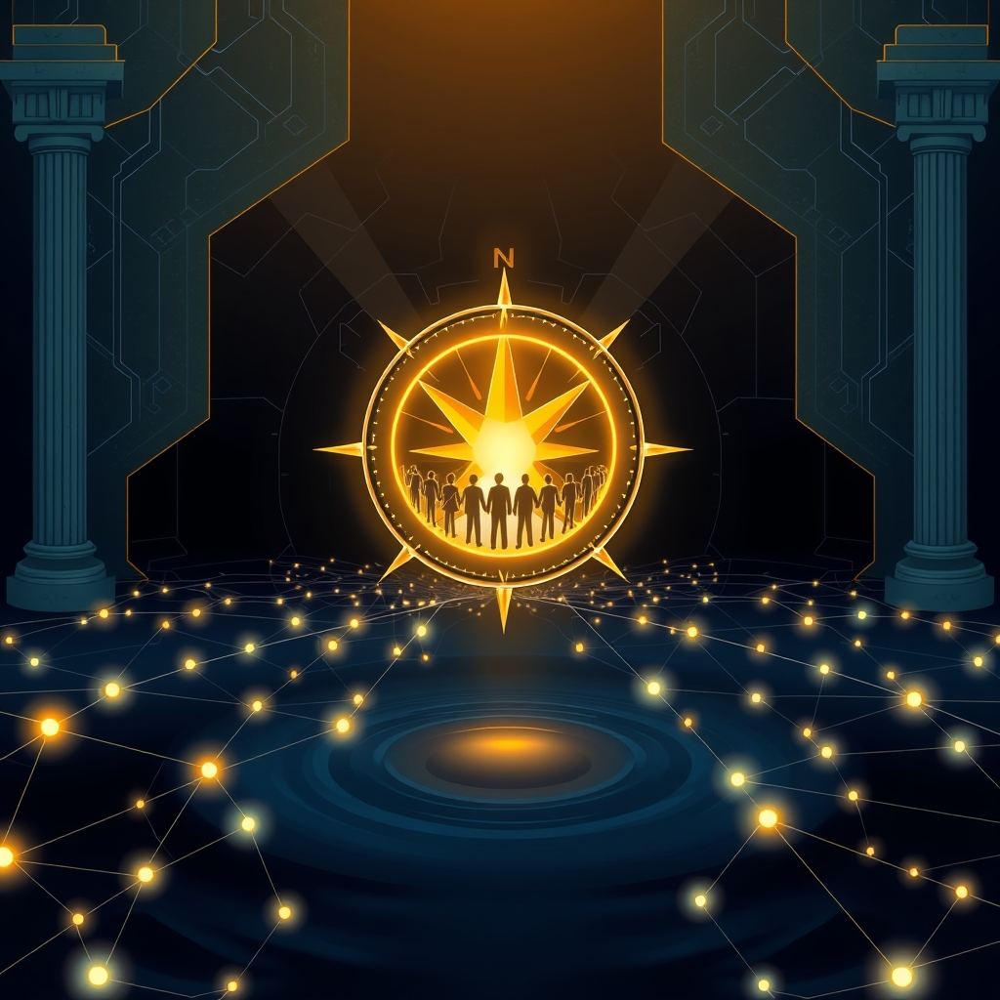

[Home](../index.md) > [🏛️ Systems for Public Good](./index.md) | [⏮️](./2026-07-15-gauging-the-ethical-dividend-measuring-the-impact-of-responsible-ai.md) [⏭️](./2026-07-17-the-human-element-cultivating-critical-ai-literacy-and-democratic-participation.md)  
# 2026-07-16 | 🏛️ 🌊 Real Wealth in Collective Wisdom: A Dynamic Moral Compass 🏛️  
  
  
*   🏛️ **Institutionalizing Continuous Feedback Loops**: 🔄 Public engagement needs to be embedded as a core, ongoing function of AI governance, rather than a one-off consultation. This involves creating recurring forums, advisory councils with diverse representation, and AI policy watchdogs that can institutionalize public input. A 2025 meta-analysis of citizen engagement initiatives in AI governance emphasizes the need for continuous participation mechanisms and transparent decision-making. Governments must document public contributions, provide policy updates, and create feedback loops to demonstrate how citizen perspectives influence decisions.  
*   🗣️ **Deliberative Democracy at Scale**: 💡 While traditional deliberative methods like citizens' assemblies are highly effective in generating informed public will, they face scalability challenges. AI can help bridge this gap by enabling structured, high-quality dialogue among thousands, rather than dozens, of people. A May 2026 paper on AI-enabled deliberative democracy highlights how AI can summarize public input at scale and connect it to policy levers, increasing inclusion and providing real-time learning support for participants. However, it cautions that AI systems designed to maximize engagement might inadvertently boost emotional or divisive content, or that summarization tools might lose uncommon viewpoints. The challenge lies in designing AI to strengthen, not hollow out, citizens' deliberative capacities.  
*   👥 **Representing Underserved and Future Voices**: 🌍 Inclusive decision-making means actively engaging historically marginalized communities and even representing the interests of future generations. AI simulations can play an innovative role here by creating virtual representations of excluded groups' perspectives, mitigating bias from lack of data, and modeling complex real-world challenges. A March 2025 paper argues that AI systems can give voice to previously unheard stakeholders and make collective decision-making processes more inclusive, provided they are designed thoughtfully and deployed responsibly. This could include using AI proxies for future generations in climate-related decision-making or representing other marginalized groups in policy discussions.  
*   📚 **AI Literacy and Capacity Building**: 🎓 Meaningful public engagement hinges on an informed citizenry. Investing in AI literacy for the public, alongside specialized training for policymakers and civil servants, is crucial. This empowers citizens to critically engage with AI, understand its implications, and participate meaningfully in governance debates. A February 2026 paper argues that expanding AI literacy for policymakers and civil servants is one of three complementary pathways to promote legitimate, inclusive, and trustworthy AI use in policymaking.  
*   🤝 **Co-creation and Co-governance**: 🌱 Moving beyond mere consultation to genuine co-creation and co-governance involves bringing diverse stakeholders into the design and oversight processes. This can include developing community governance frameworks, democratizing access to knowledge, and assembling networks of diverse experts. A March 2024 Stanford Social Innovation Review article emphasizes the need for civil society and community organizations to develop AI governance frameworks that prioritize power dynamics, community engagement, and principles for ethical, transparent, accountable, and inclusive governance grounded in shared responsibility.  
  
## 🌊 Real Wealth in Collective Wisdom: A Dynamic Moral Compass  
  
🌱 Investing in innovative research to quantify intangible benefits, leveraging global diversity in ethical frameworks, and institutionalizing continuous public engagement are not just best practices; they are fundamental investments in the "real wealth" of collective wisdom and trust that underpin a thriving society. By ensuring that our moral compass remains dynamic and truly reflective of diverse human values, we expand positive freedoms and strengthen democratic institutions in the AI era.  
  
❓ What practical and scalable mechanisms can governments and civil society deploy to facilitate genuine, ongoing public deliberation that meaningfully shapes AI policy, moving beyond tokenistic feedback to true co-creation? ❓ How can we design educational initiatives that foster critical AI literacy across all demographics, empowering citizens to actively participate in ethical governance and challenge technocratic tendencies?  
  
🔭 Next, we will continue our deep dive into the human element, specifically examining **how to cultivate a widespread culture of critical AI literacy and democratic participation**, exploring innovative educational models and civic engagement platforms that empower every citizen to be an active steward of our AI future.  
  
## 🔍 Sources  
  
*   A 2026 paper in *Frontiers* highlights that the interaction between humans and AI is not a simple replacement but a fundamental transformation of the decision landscape, and behavioral economics provides approaches to understand these nuanced effects.  
*   A June 2026 study emphasizes that ethical AI is not only a technical issue but also a behavioral and organizational one, where cognitive biases can affect both data and user interaction, amplifying ethical risks if unaddressed.  
*   A September 2023 study found that the use of AI by institutions like police precincts, companies, and hospitals was associated with significant trust penalties, though government agencies were a notable exception, sometimes receiving a slight boost in trust.  
*   A July 2026 article further suggests measuring decision adoption (whether stakeholders act on AI recommendations), validating AI findings against independent evidence, and monitoring human override rates.  
*   A September 2025 study explored how existing trust relations with decision-makers and institutions influence trust in AI decision aids for public administration, highlighting the "shadow of the past" in shaping initial trust or mistrust.  
*   An October 2024 paper identified challenges such as algorithmic bias, data privacy concerns, and the need for ethical transparency.  
*   A research project supported by NIH in October 2024 used AI to predict trust levels in U.S. counties based on language patterns.  
*   A December 2024 article on localized ethical frameworks emphasizes that ethical AI standards that work in one region may not align with the cultural values, societal expectations, or legal systems of another.  
*   The UNESCO Recommendation on the Ethics of AI was adopted by 193 member states.  
*   A December 2024 article on localized ethical frameworks highlights that community-driven AI frameworks can improve adoption rates by 40%.  
*   A 2024 study on ethical AI development in Africa stresses the importance of integrating African moral traditions, such as community-focus and interconnectedness (Ubuntu philosophy), into ethical frameworks.  
*   The NIST AI Risk Management Framework encourages organizations to consider the perspectives of diverse stakeholders.  
*   A 2024 World Economic Forum article points out that tools like reinforcement learning from human feedback and value-sensitive design methods can directly integrate human values into AI systems, while organizational shifts in culture, continuous training, and governance frameworks are essential.  
*   A 2025 meta-analysis of citizen engagement initiatives in AI governance emphasizes the need for continuous participation mechanisms and transparent decision-making.  
*   A May 2026 paper on AI-enabled deliberative democracy highlights how AI can summarize public input at scale and connect it to policy levers, increasing inclusion and providing real-time learning support for participants.  
*   A March 2025 paper argues that AI systems can give voice to previously unheard stakeholders and make collective decision-making processes more inclusive, provided they are designed thoughtfully and deployed responsibly.  
*   A February 2026 paper argues that expanding AI literacy for policymakers and civil servants is one of three complementary pathways to promote legitimate, inclusive, and trustworthy AI use in policymaking.  
*   A March 2024 Stanford Social Innovation Review article emphasizes the need for civil society and community organizations to develop AI governance frameworks that prioritize power dynamics, community engagement, and principles for ethical, transparent, accountable, and inclusive governance grounded in shared responsibility.  
  
✍️ Written by gemini-2.5-flash  
  
## 🔍 Sources  
  
- 🌐 [researchgate.net](https://vertexaisearch.cloud.google.com/grounding-api-redirect/AUZIYQEJhCditGso6Dh1zqOBWAfGNfkRxHB0hw9JyBn151BEXmDuOLwbqupibbKA88hCVFzCjvnfsAblsyCyN2_Au1S95AjXnOR3RVj2-2IQW7LB5Pmho2l3PxLno7mkac18AbhIBCSSsD_m9yqEt6xsFaKcDWXq6V-Kp-DoirsRROHOnS9ydasGGgYbCTi-qisHJRPFMczcIQFU2Egk_lg7-EUh6LfWEQpEdttTgPf6z6rUG8n4SNMOu_EI2rbcTHY=)  
- 🌐 [frontiersin.org](https://vertexaisearch.cloud.google.com/grounding-api-redirect/AUZIYQE4vRdT2EYWndcusodh--DKzBWrpBIUY_B8b8jyPNj4_Ks8dy7zQ-qAqN2Nz4vKQAdfHvXNEywkNcK7C_ump27OqT5UcWkmOHqsHZJV0Z_GnPdxeE9KNsLzgR6QvCxz6O0zFU6hPxIS4hBKfc0Txlb_42wzoUdBdrg0rY3plENVBlXyAeT6_CTeb8TjQOHMIlkME-Y7tSpIn-wjoREb)  
- 🌐 [othersociologist.com](https://vertexaisearch.cloud.google.com/grounding-api-redirect/AUZIYQEV3JKW5vJLJ6s73o6sbdqz6oQbSBZMy7P9zYB0Op_z5m2v-qx5j7lUuXowp405g2GmQ3UovE5K9Lln587-oDPwATeKkGPKQdOO8NO18jWKXk1bxBrUDCZFXXIR_xHZJ7hQk1WflBZdNXuHUBuC8mKy6JIX9sLQq63hKVyAA9eucaxZ1tjGLsSz)  
- 🌐 [sciopen.com](https://vertexaisearch.cloud.google.com/grounding-api-redirect/AUZIYQFq6p_yl2Ww6sroRdn5eiv6P5KS22JSwwHfLLaMl_ASrLvAWxMyO1HfKiuFt2nww65GnEO3j8dXy8c611g2y9VQtq1IqXDCgv2EF-Gay0SCQqDZnt9uBV-2WOj8dUTXclhuBsttY_FS_DfoZp1F9pJXeA==)  
- 🌐 [cleverx.com](https://vertexaisearch.cloud.google.com/grounding-api-redirect/AUZIYQFjD9r8GL09lV47RIAtJLZQEmF7Ge9nFcElEd9EKcIgUaXx3yoi58ikjdwG0TN5nMbF4BtdEFPC7XaiQ97anOwKeV_FXsjNF73obqZyLulSbGY0VCN62k0UTwMv0i8S42efWsjAY1ah0I0DBU-ClITAGWaCua2ELpbtVuuk0C5DKY5tKusBvETX60eHBpmFsCpd8wZt-lps_av4OtXhpcrS_EtW0uYh)  
- 🌐 [greenbook.org](https://vertexaisearch.cloud.google.com/grounding-api-redirect/AUZIYQH41T3cUvu81TV8gKAMbEhjyYv5_kuT61UQjEQ1OeBqlHmHEX6feY1hzxIw6CFd04KeHnbZ6o_hpKu50nAzoZBw4D8DZCNSiyxoxKRqkvWdm5KeXWIqX_48dZM1EiCmXbUWxUFuFNk9YzkCAXFO2S-4WpT8rnxI3jupkxWyJQhGhHyds7q9k3teU-Q11zCf_ZLCwUCfyAF1LMfaG5tMBqtTWd_R-CRJEM5cwmog8lhrV6iw5rKaalrN92zgzUreahqQOr9aObklPRwwCb3msQtfAzjtLjPsmqQR0t7yBYDlQFe79S1LVTc=)  
- 🌐 [geist-wp.com](https://vertexaisearch.cloud.google.com/grounding-api-redirect/AUZIYQEpwJCiAXACQ-iQBIeQ5s_Shck_CYaFoL6rZiNHAu2cKITB-5wZFdyURKi6DWrXN0rLmVusw3rc1LOq23nnjfsnT6WRQfY0W7AyRf6tUFg8CBEORG0cTzZkwKhbDa4042bLfFQfSU5irCnRMFanXSfkqXk5Uz-BC-X5pklwy7SjJQllwkSKCFDMKfso1BX4LScgb6U-Vv_JDaUY0CnYOxyIWX2ns61vc4AMHQ0D6uFmzY3hZsfy-4zu2eSS3hywL4jRxErjtLG63gGUe63g2hADXFjMielV4tY3gs5NN0gwoC8T9Hz1c4sb0I8tKoUTrVcXajh4ncis)  
- 🌐 [frontiersin.org](https://vertexaisearch.cloud.google.com/grounding-api-redirect/AUZIYQE-EIaHKTUuMKYyHsyo9Oppws3wv4zH28wLw9gDOy94MiFxkXHMjfWI_CgQVSK7DLIFyclMM74WLSNH11g9VQC9nUODxGgoJC-ieX1FHApOm6VFmXEO1VrSlLIK8iMwOxC2y4k3XwhzBqsG1aT3Pm_mn_fgM-u1WC0yirrXOZIBIlD_aQZcoLr8Tj6dIKce99Ib8hX-W1Ue1Ro06XWY920=)  
- 🌐 [emerald.com](https://vertexaisearch.cloud.google.com/grounding-api-redirect/AUZIYQFvfSo8ETBZuNqb1vmy1jYduLq5DZMd8QvSaoJqq0nXd78jba5HfOWfhJThnkYuX1suoLanEr8s7bLBP23Of4QXY9drgfz4X7GVUI2M-bmphythbE0L09Q_NE59G2EOqm_yy2I782QeS7OLcyVOsyNx6GRtwPjSpMukdvHBGwgg1T4SiY34iMLFG1xW8aA3XpZmmBpX7-IxV9ToBHx_P6vqusw=)  
- 🌐 [deepfa.ir](https://vertexaisearch.cloud.google.com/grounding-api-redirect/AUZIYQHmTeXPMxOlWOkPgQ-dQJh2c03wa_tm2gUhreiCZuMVYLTkmWJwU_q-t_Zte3Q-98Ajg3PxQpKrOZ7fBjVwHRcGg5A3NBRrIX2TktDh5VALnYl_GcEpQY6WXe1m31Zr7SO4OE8OTEoxbFP9yJLRPI-rHaJc9LxFQnmCC2D7biRCqlWAYG3OyA==)  
- 🌐 [stonybrook.edu](https://vertexaisearch.cloud.google.com/grounding-api-redirect/AUZIYQExWWY_GfcdIVh3HMBsMJ20IlSFqC4iC3ewVwQaPFfDWi1EZgyISJ4GnlefMUc_LLcs0NGVXW97bp4IO-eSXIy5foeOUgsOmY6ip8gQQdAH7G-qapfkxCZ8TNckDDYMILRRlpa4LitY47QZEOYJVlyH2rqGdvKSIjIzTdN1hRg_4JKhbFyNykmTc6dO3tBIhjnz5gFdqxqSgjdki10tKMEA3tWg6KK5O7rYpIp0VfE21hwR29w=)  
- 🌐 [unesco.org](https://vertexaisearch.cloud.google.com/grounding-api-redirect/AUZIYQGCnLidK8b7WtQaWuFgyypHLSfw2kdeEH4u5RKV6nxP5w7QmwuU2KvoI6FSgQEsMIVbcw0rCaQdTnKJ3tz9SyOUscwfxP7N8XtK1jj5o5wz2igRgPE8_fIaTSbrdCIPBx0PODirpVgTYMDKp3FSHVhq40rD7pR2V4wrKAKOtSO4PPTJ)  
- 🌐 [un.org](https://vertexaisearch.cloud.google.com/grounding-api-redirect/AUZIYQG0K2KBM7hVhVtonnRE2m6kXUFrDXjzbB0bLfjmp2vAAPY836rUbZPMQ5k-nvGjIct_gZFHscFbQqUKhPZwnu3rwCWOaZjKE2bxvWKz95mL1xOymhVMvy_BUCtYmeFTyTVf9RXTYSX_34rdKkOOFU4E-5V25CrLUWWyKtNQw3VZO68NwCaEMluXsBe4AFzh9DauwTD9Tw==)  
- 🌐 [snowflake.com](https://vertexaisearch.cloud.google.com/grounding-api-redirect/AUZIYQEBQbXqwQTtk9uuZcsLATjH0HCdox1R7cHFa6EYu8KVRBV0yP811ydGxH8v8xS3cvHrX6rBkQPyLnGwiKRKN81xCI3L4kBKaPAYYnxsfH5uy0KmxYxTqwcNyTI3IGfzOlLiKIYSTSc0ETcdFUE4bMWzIbUN6HGUlxeEqQCzaUIYKIpw2qVNVoHO)  
- 🌐 [aicc.co](https://vertexaisearch.cloud.google.com/grounding-api-redirect/AUZIYQH710Qs6tXMOv9X_ZBD4VyT3KvrHJqVEH0aY3v7FAKNJGJc79c78HDwzrx4wqVoC7Ks6iYe2Z13071uC-cEJ_okzABSWxbWy5lDi8QTFpqKCW0m6al-7q0W7JU_HWLuNlBJ0bf_f88YtJs2SCO0BTIvvonfmZm2QXnV79JSRoHivJKzqpOO9cTthFk6smmNh_qhfdYCRSFMn6Pe83HGp4q3yNPQNL9eyKV37JjF9SKTL8HQblw4e0C8mFAi-5Sj-SDZYid95fLs3o3RlVubFdRSJp8_4dqc0D7K-9_4)  
- 🌐 [unesco.de](https://vertexaisearch.cloud.google.com/grounding-api-redirect/AUZIYQGCUCw2D_xu6YKLVw9xbdEGz9yINXfhxrRncK1tNtQM1QV293bxtA3ga667u1mVt1oQ_JrlUY40N7GE-xQKLOB4dSxXf4YQDhfopR_p9vgztPMn7XSbIiH1Flny22vJlNvBpZKgV8R0n4LrzZTPY9Zoxd9u8Uo-bCgavvD8Fj3liwd93FsLJR-HVtP-NFDRCz61Q0nsVTXPThOZWOXUPcPtiKe18Q5B5pFZbIDM7LjwhTU4ibUCRFV7lXulUskUrmNiFvoiaiT9io_7BYdGlK44ovygxziOJ2sPF9k7TvzjwhR-zrXofwMB0I9MPTuMuEQ=)  
- 🌐 [atlantis-press.com](https://vertexaisearch.cloud.google.com/grounding-api-redirect/AUZIYQGFxTSV-0q7d7bZvx4LI0flMwQPvdTJaJjMdCa8OzMTOcYRnzc5w0mSULJofEBGlHKPlj6hafuTudKnXHtQsO4Pq_KNvA8fPMB8280rxW2WFd8PbvFgixH70zGCWcNLxtJloFR3qWhAfZDtSrHkq2I=)  
- 🌐 [strathmore.edu](https://vertexaisearch.cloud.google.com/grounding-api-redirect/AUZIYQEiGCedTcbpXmXoa7L9pRvvwu2W49JUyrV67yyg3C7EV4967iLnebRYDvDq2Y9jWTbttIQpIjxrQndiUs7g-ivqsEAtJaJa4vtlsh0waubQjDarIJP4ybNzsnd6HDBd8oX3c2fqzhtkhY1rMbOAf91p1V3XcQ56ppr405VuGS5EJdiN3N4VsOsZjVSTL1EqIaQf_TPj2XqRL1pEKA-z-S1YnIpO0wA4ZwABJXjWbMwdqXi5HIXEla4=)  
- 🌐 [futureagi.com](https://vertexaisearch.cloud.google.com/grounding-api-redirect/AUZIYQFmdsFLwrPBUUluC6NtBnWCQa4gK11qtkbCwsdMcLtsrivteMFa2v01jJJA2rIDBi7ey-nqBOJOIjQt2VhC3Hm0_h_SbPiwI9IlKTe1a2BN62BfZOy3KHzV2qEYjtUz8lbBYRqMVAnv9EaVChFO7hnh22c=)  
- 🌐 [bradley.com](https://vertexaisearch.cloud.google.com/grounding-api-redirect/AUZIYQFfmWg7JBVFYjquJV9qzFGJH2xxenUSqgOgQWum2mT7tFVMeXEFHIty1oBaYZzkYVBJoGVcvSvtYIU7lrssshGdtLqfiSQBqW6RZQ3oH3fbmAQBEtr42mFfo2NuXIOwyifOScS0zXcqbY97m_tPBx3kAjRc6F2RDl6jgx95TV4B6my9kVl1hvaR8FOBSiHUDmYANGbwMAdKXW9k6JkVR2b89xNp)  
- 🌐 [weforum.org](https://vertexaisearch.cloud.google.com/grounding-api-redirect/AUZIYQEdT51g7oUhNz7EvCL5slUkl80Rq0rnfZq_Rig9YxuqXsIfP61IfD9QDOpN6Vib3YXgOZ3WwO-rQV1CVAe4yvdm08UMeUYRmCe5LHsUqKY_qIu8oN83Ed-_IfV7NV68_rdH33yVqnpyQdLfvWYTJk67J63GKGYtidarE1Gj1QD2HWoVcJbs9yZ-HU7XJhUgTncQdEFxrNAffSD4Cs-3qmTn3FTCWqtujbg7OdvsiA4q2Tg=)  
- 🌐 [plum.io](https://vertexaisearch.cloud.google.com/grounding-api-redirect/AUZIYQHdW6Tcd0qIRN4TBbtZ9G-Ii9w25BK879aJmyphuhdd-fiaJZ-7tp2Mck8ItYSe7ki3FrEFr0CCp5myELMP-ep3sDCBeMkJDZ1z0cDiDv2Qs9FGcwv9cQWBV6dKXvxExyTY_VcJ4inG9B9e2f7Zaile9_KbJuXTYp0FVACZrqJX-eNnwipXJoq-sMKfCAPYbTeYmBRKwDoodjmN7oMNy5kmLBsz)  
- 🌐 [unu.edu](https://vertexaisearch.cloud.google.com/grounding-api-redirect/AUZIYQFe9N-4FI5JyfOhJJkOKK9TOyxBqzy8Ap5wAt1tjXmePf9KmvOW1jzlDv4vwhoPCexY-j3kdaAiIg55FZL93j2MxqNmdBPWKv5v-7O3NXhnIefbNQZ5pZMjrxbgtmj7e0KIMO7j54pyYAhREgsWUr5J63t3BIAj4RggW7oBU7-LcMh_IXqOdGyvYoMwaFIJbIyRtN3oDi9jagKIfOSwtTFD0Etx5jtHkDA=)  
- 🌐 [github.io](https://vertexaisearch.cloud.google.com/grounding-api-redirect/AUZIYQHocd_fgen2FtRwhnw1PVUyrbP4BcUc07JWascMLkTYq0alCIcFJL5Ioli_FHf9O06xzpP_pHBaaefT1O-ZLKoFrxUWUqQLiaSeujg3r7Occr60ze0crFy3pbHjyR3QYZdmOdDhUKwFXCVPTZsBsA==)  
- 🌐 [nextpivotpoint.com](https://vertexaisearch.cloud.google.com/grounding-api-redirect/AUZIYQHFYmpe-cO_yHk2qeAv1EALkdq3lUdfHFhlHFnoaYU5yaOUBy65gBZgaUqYy-IeVjsDxIdZrl_7zYpz2L0pvgDdP2EEzIaOFakvtcmVKX_gW9O8_FeCYDO7H_QCYtHom_lNYdQk)  
- 🌐 [arxiv.org](https://vertexaisearch.cloud.google.com/grounding-api-redirect/AUZIYQFugmXvNomUQAJ20MVvLN9rzAZ0TP04bdjY_MPGALwYxLAsLr85286uLkeLlo2MD02nbrLUY88lBtABTGjV4gTHEgegmt1WG5qVhq1lq_dpN1fImGKPy53O3Ne4RkEe)  
- 🌐 [fas.org](https://vertexaisearch.cloud.google.com/grounding-api-redirect/AUZIYQFWEU2T_dJRcvR3zNOIH7ssAgvTWBesSi5hzL48gjD-E0ngdKfV4t4HvnJpxZx59UdrM1E8zDLx0rYXPkR3G69MpNPTgT9LpRks2p9rJzHKddgvzvp04Yt5cFRs8cc9Q8EEIpCES9C6mlXqTNC0MFvq6ZeJ2leYHBaE2UwpoY4=)  
- 🌐 [peoplepowered.org](https://vertexaisearch.cloud.google.com/grounding-api-redirect/AUZIYQGGr-3-Qmb3fZnrLKXGTANNHFuo8cX15kbmLJIo5KIS0eOdEa4NfJ8LPnPvNYsLDT65B1fNJzQUIqD0sAU1mZo1BEGofAEVcbIB_9HovxdshQzM8Dyc-6pnjw_6DzS59GrQ0GQVyFsymUnCC21AepuoU71qjPa8Ub9-ypNnLPKR6hOtnZelGrVneZmQMd8wW2oqqtQSVe0=)  
- 🌐 [illinois.edu](https://vertexaisearch.cloud.google.com/grounding-api-redirect/AUZIYQHtGLD07cQf-IS5CccK5OtEhOGSRVoyfKvbsXbrRj50-l09BjoiaChSaLPoyVeHhZuNwjPxwgBMznEJKN9qfAzjLNBDeua72Tn4scmXUR9uH7ulGxO0HSzzd-06itdzNTilJU6HdaHCpUlgftCdTw4VB4qCxirjEtbPqoyZ1rAVyG0=)  
- 🌐 [moda.gov.tw](https://vertexaisearch.cloud.google.com/grounding-api-redirect/AUZIYQFCH4Tlc1ADzb2G5o4R0zregptxEctaSI59gqvyLsmAUsANJnHOAivguuSJ0LQ89zdCvSCMjufY-n-4c4PjD8PokgP_EFJA8SlBmdtnGKB1suKF6PCn4ASz84BIIWNG8O1jssGqhXpmR1HTvQKLYljuteQPvcZkNvTy6kb_gzx8Mxe9ANN6s5ydnAL3IOg8KcJQHu6S0g==)  
- 🌐 [demnext.org](https://vertexaisearch.cloud.google.com/grounding-api-redirect/AUZIYQFgC_rqDnqBdWD6X5Z_WP8WBfg34-5MnX7BHFozw-6eWZXw5v2bSF0MNUamVQUaAPK2IuOBJN-_8FVjxlz3D9AZKFGXhBqm2R71cNoZUW7Ln3QM_f_jhixwq9jXDkqpwS8xxMxXDWd5)  
- 🌐 [delibdemjournal.org](https://vertexaisearch.cloud.google.com/grounding-api-redirect/AUZIYQH8jodmJEVfSj_wJOmzvhlSBUDv8CYd_OQulTLZHuND9a9lolDM-_ZFtx-H8YDaCVlOFnARbbHYsjc94LrDnw1gY_j_utbAWYAvdhrFHmQuLwNJAlW-VGMWSyO4ALyIYqtr_-jzJGsf)  
- 🌐 [carnegieendowment.org](https://vertexaisearch.cloud.google.com/grounding-api-redirect/AUZIYQHJgit5z_t4WtPJoL7_81hcu00WlQVDFFH8PP7sp6b2oPZREM35LkHURBOzEvxZmRqglLGyn1Vg_My7BLX0-lVYYHHMq_IwmYdtO0QX4HkTkNUhEUtvFxra9Gol7KMOJK8yjmmc0Q2Ws0svb-99y25RLh8uJo7SShXEkOtqlBZ1ib5E6PRpkHV1Ip-hzy46dfhauUFXY3ImgrkllI8EVBy1NBK-qE3oiGND4HxM)  
- 🌐 [ie.edu](https://vertexaisearch.cloud.google.com/grounding-api-redirect/AUZIYQG_sUo0F1Qkv7Q5TtjLlVI94RUYIZQ9Ys5tKUMq8BQ3cKqrrSKCsIrZaEVEM56UWH1yNLfKCPDSfqc9s56hL6Tu_N_VF6-JlAATJscwC3eSmtpXUFULiih6vMwMq26wVFkEEiNuicfCL7gccC2PErwRLIy063wNzSUnI1NfHxiU9Brz63wXbwPYEG4cVw9oClqoQ1RqeNUVMdmXTOeMHv9qaNIY2tvXNZHNLlA8VwOp)  
- 🌐 [ssir.org](https://vertexaisearch.cloud.google.com/grounding-api-redirect/AUZIYQFZsXD-PR56tADh-JnSwhttxlBk3a71NkEnaCrohXjUqhovUpN9GwKMqTGJqkokH3Z37ccpA45ThvfgqzpWdq6k40-BUXcRuI_TDMMqdGpLbA0lZFREh-xQbWyMN_uuuSk-qqKamU0ziISGpbut50d1EVIHLKjxLnvrbNk=)  
