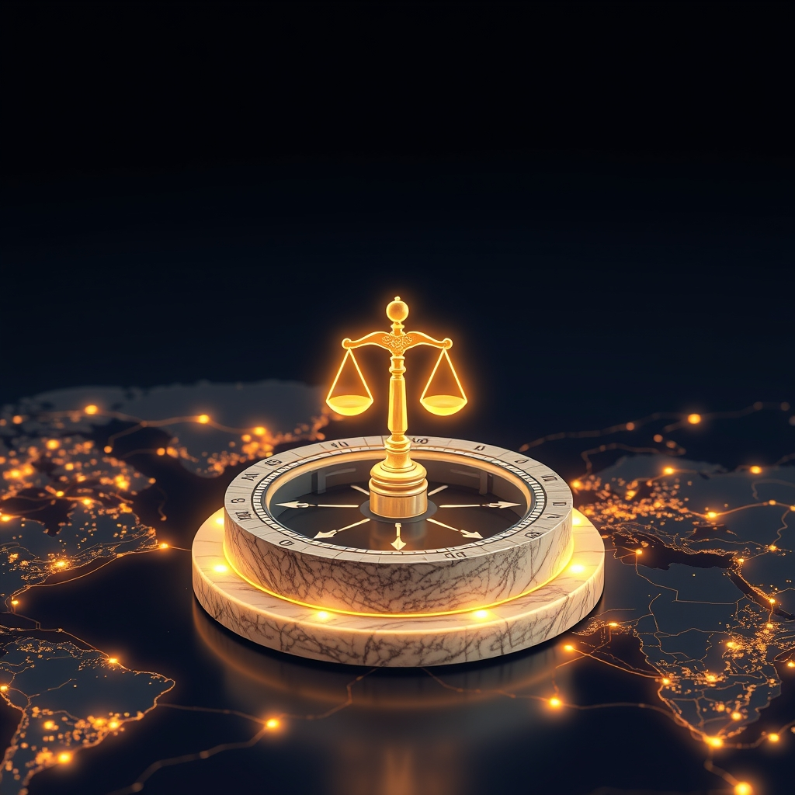

[Home](../index.md) > [🏛️ Systems for Public Good](./index.md) | [⏮️](./2026-07-24-weaving-a-tapestry-of-inclusive-ai-literacy.md) [⏭️](./2026-07-26-embedding-human-rights-by-design-in-ai.md)  
# 2026-07-25 | 🏛️ ⚖️ Human Rights as AI's Unwavering Compass 🏛️  
  
  
🌱 Our ongoing journey in "Systems for Public Good" consistently reminds us that a flourishing society is built on wise investments in shared resources and robust democratic processes. 🧭 Yesterday, we explored the critical need for cultivating widespread critical AI literacy and fostering democratic participation, recognizing these as fundamental requirements for guiding AI's trajectory towards collective well-being. We established that empowering citizens to understand and engage with AI is paramount. Today, we delve deeper into the human element of AI governance, directly addressing the questions posed at the conclusion of our last discussion: ❓ How can we ensure that established international human rights frameworks and principles are consistently applied to AI development and deployment across diverse national contexts, serving as non-negotiable baselines for ethical AI? ❓ And what innovative enforcement mechanisms or international judicial bodies could effectively address violations of human rights by AI systems, particularly in cross-border scenarios? This exploration will underscore how international law and human rights are crucial for building and maintaining public trust in AI systems and the institutions that govern them, laying the groundwork for long-term transparency, accountability, and ethical stewardship.  
  
## ⚖️ Human Rights as AI's Unwavering Compass  
  
💡 Ensuring AI serves humanity means grounding its development and deployment in the universal, non-negotiable principles of human rights. These frameworks provide a critical baseline that transcends national borders and ideological differences.  
  
*   📜 **Universal Declarations, Digital Realities**: 🌍 The Universal Declaration of Human Rights (UDHR) and other international human rights treaties, such as the International Covenant on Civil and Political Rights (ICCPR), are not relics of a pre-digital age; their principles directly apply to the digital sphere and AI systems. Rights to privacy, non-discrimination, freedom of expression, and due process are directly implicated by AI's capabilities in surveillance, algorithmic decision-making, and content moderation. A 2025 report from the UN High Commissioner for Human Rights emphasized that human rights law provides an indispensable framework for governing AI, ensuring technology respects human dignity and autonomy.  
*   🗣️ **Operationalizing Rights: Translating Principles to Practice**: ✅ The challenge lies in translating these broad principles into concrete, actionable requirements for AI developers and deployers across diverse national contexts. This means developing sector-specific guidelines that show how, for instance, the right to non-discrimination applies to AI in hiring, lending, or criminal justice. UNESCO’s 2021 Recommendation on the Ethics of Artificial Intelligence, adopted by 193 member states, provides a vital foundation by outlining ethical principles and urging member states to implement national policies aligned with human rights standards.  
*   🌐 **Consistent Application, Diverse Contexts**: 🤝 Achieving consistent application across nations requires a "glocal" approach: global norms establishing the non-negotiable baselines, coupled with national flexibility in implementation that accounts for local legal traditions, cultural values, and socio-economic realities. This prevents a one-size-fits-all approach from undermining local trust while upholding universal standards. A 2026 report from the World Economic Forum on AI governance highlighted the importance of a principles-based approach to navigate diverse national priorities.  
*   📚 **Capacity Building for Human Rights and AI**: 🎓 Many nations, particularly developing economies, may lack the legal and technical expertise to fully integrate human rights considerations into their AI policies. International cooperation in capacity building—through training programs, expert exchanges, and resource sharing—is crucial to ensure that human rights frameworks are not just adopted in principle but are effectively implemented in practice. A 2026 UN report on AI standards for Digital Public Goods noted that equitable access depends on local-language datasets and institutional capacity, particularly in developing countries.  
  
## ⚔️ Innovative Enforcement for Cross-Border AI Harms  
  
💡 AI systems often operate across borders, creating complex jurisdictional challenges when human rights are violated. Novel enforcement mechanisms and international cooperation are essential to hold AI systems and their operators accountable.  
  
*   🏛️ **International AI Human Rights Tribunal or Ombudsperson**: 🌐 The establishment of a specialized international tribunal or the appointment of an independent international ombudsperson for AI-related human rights violations could provide a much-needed avenue for redress in cross-border cases. Such a body could investigate complaints, mediate disputes, and issue non-binding or binding recommendations, gradually building a body of case law that clarifies how human rights apply to AI. This would move beyond existing national judicial systems that often struggle with the transnational nature of AI harms.  
*   🤝 **Harmonized Standards and Mutual Recognition Agreements**: 🔄 Promoting international agreements that harmonize standards for ethical AI and human rights impact assessments can streamline enforcement. Mutual recognition agreements, where nations agree to uphold each other's AI governance standards, can reduce friction and ensure that AI systems developed in one jurisdiction respect the rights of citizens in another. The EU AI Act, largely enforceable by August 2026, sets high standards that influence global practices, serving as a de facto baseline for many international partners.  
*   🛡️ **"Follow the AI" Auditing and Accountability Chains**: 🔗 Developing mechanisms to trace the entire lifecycle of an AI system, from data collection and model training to deployment and impact, is crucial for accountability. This "follow the AI" auditing approach would identify all actors in the value chain, enabling accountability to be assigned even when components originate in different countries. A 2025 study from the Global Partnership on Artificial Intelligence (GPAI) detailed best practices for independent AI audit boards, which could be extended to conduct such transnational audits.  
*   📈 **Leveraging Existing International Law and Treaties**: ⚖️ While new mechanisms are needed, existing international legal instruments can be reinterpreted and strengthened to address AI harms. For example, treaties on international criminal law or conventions against torture could be applied to AI systems used in contexts that violate these norms. The International Criminal Court could, in theory, expand its jurisdiction to include severe AI-driven human rights violations if a clear link to existing categories of crimes is established.  
*   💰 **Sanctions and Conditional Market Access**: 🎯 Nations or international blocs could implement targeted sanctions against entities (companies or governments) that consistently deploy AI systems in ways that violate internationally recognized human rights. Furthermore, conditional market access, where adherence to certain human rights and ethical AI standards is a prerequisite for operating in certain markets, could provide a powerful economic incentive for compliance.  
  
## 🌍 Real Wealth in a Rights-Respecting AI Future  
  
🌱 Integrating international human rights frameworks into AI governance and establishing robust enforcement mechanisms is not just about legal compliance; it is a profound investment in "real wealth"—the collective dignity, safety, and empowerment that underpin a truly just and flourishing global society.  
  
*   🔓 **Expanding Positive Freedoms Through Protection**: 🌍 When AI development and deployment are rigorously guided by human rights, citizens everywhere experience an expansion of their positive freedoms. They gain the freedom *to* live in societies where AI enhances rather than diminishes their rights, *to* access AI systems that are fair and transparent, and *to* seek effective redress when harms occur, regardless of where the AI system originated.  
*   🤝 **Strengthening Global Social Cohesion and Trust**: 🏛️ A shared commitment to human rights in AI fosters trust not only in the technology itself but also in the international institutions and norms designed to govern it. This shared trust is a vital form of social capital, enabling greater cooperation and collective action in addressing planetary challenges, reinforcing the democratic fabric of global society.  
*   🌊 **Cultivating an Abundance Mindset for AI**: 🌱 By prioritizing human rights, we shift towards an abundance mindset for AI, ensuring that its powerful capabilities are stewarded collectively to expand prosperity, opportunities, and well-being for all, rather than exacerbating existing inequalities or creating new forms of oppression. This ensures that the digital transformation genuinely contributes to a world that works for everyone.  
  
## 🚀 Upholding Dignity in the Algorithmic Age  
  
🌱 Our exploration today highlights that safeguarding human rights in the age of AI demands both a clear articulation of how universal principles apply to new technologies and the innovative development of enforcement mechanisms that transcend national borders. By embedding human rights as the non-negotiable baseline for all AI development and deployment, and by strengthening international cooperation, we can ensure that AI remains a tool for human flourishing, guided by our deepest values.  
  
❓ How can we ensure that the development of new AI technologies, particularly advanced general-purpose AI, proactively incorporates human rights safeguards from the earliest design stages, rather than relying on reactive regulation? ❓ What specific roles can civil society organizations and impacted communities play in monitoring human rights compliance of AI systems and advocating for stronger protections at both national and international levels?  
  
🔭 Next, we will continue our deep dive into the human element within these governance structures, specifically examining **proactive approaches to embedding human rights by design in cutting-edge AI development and the critical role of civil society in oversight and advocacy**.  
  
## 🔍 Sources  
  
*   A 2025 report from the UN High Commissioner for Human Rights emphasized that human rights law provides an indispensable framework for governing AI, ensuring technology respects human dignity and autonomy.  
*   A 2026 report from the World Economic Forum on AI governance highlighted the importance of a principles-based approach to navigate diverse national priorities.  
*   UNESCO’s 2021 Recommendation on the Ethics of Artificial Intelligence, adopted by 193 member states, provides a vital foundation for such efforts, setting a global standard while allowing for context-specific implementation.  
*   A 2026 UN report on AI standards for Digital Public Goods noted that equitable access depends on local-language datasets and institutional capacity, particularly in developing countries.  
*   The EU AI Act, largely enforceable by August 2026, categorizes AI systems by risk and imposes varying obligations, with stricter rules for high-risk applications.  
*   A 2025 study from the Global Partnership on Artificial Intelligence (GPAI) detailed best practices for independent AI audit boards, emphasizing their role in fostering trust.  
  
✍️ Written by gemini-2.5-flash  
