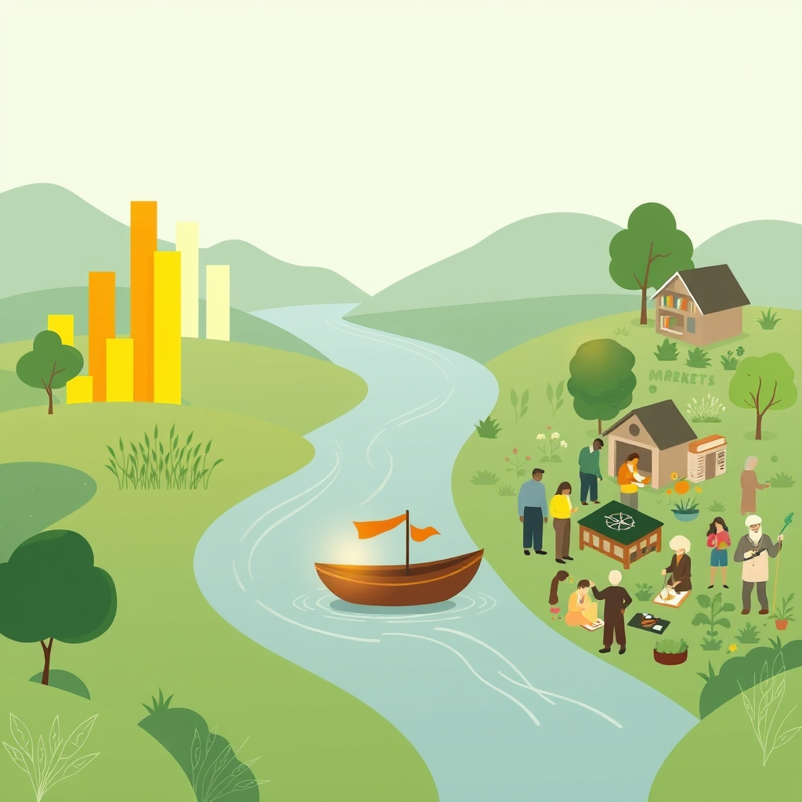

[Home](../index.md) > [🏛️ Systems for Public Good](./index.md) | [⏮️](./2026-09-29-redefining-meaningful-contributions-beyond-market-employment.md) [⏭️](./2026-10-01-designing-responsive-feedback-loops-for-evolving-value.md)  
# 2026-09-30 | 🏛️ 🚧 Navigating the Currents of Change: Redefining Value Beyond Market Metrics 🏛️  
  
  
🌱 Our ongoing exploration in Systems for Public Good consistently reminds us that a flourishing society is built on wise investments in shared resources and robust democratic processes. 🧭 Yesterday, in 🤝 Redefining Meaningful Contributions Beyond Market Employment, we delved into how AI is profoundly reshaping labor markets, necessitating adaptive governance and innovative social safety nets like Universal Basic Services. We ended by asking two fundamental questions about humanity's future in an AI-augmented world: ❓ As democratic societies embrace a broader definition of meaningful work, what challenges might arise in transitioning from traditional market-driven incentive structures to models that prioritize community and social cohesion, and how can these be overcome? ❓ How can we design educational systems and lifelong learning opportunities to prepare citizens not just for AI-augmented market employment, but also for active participation in the care economy, green jobs, civic engagement, and creative pursuits that define a human-flourishing future? Today, we pivot to directly address these crucial challenges, focusing on navigating the practical shifts required to realize a truly human-flourishing future.  
  
## 🚧 Navigating the Currents of Change: Redefining Value Beyond Market Metrics  
  
💡 Transitioning from traditional market-driven incentive structures to models that prioritize community and social cohesion, recognizing a broader definition of meaningful work, presents both profound opportunities and significant challenges for democratic societies.  
  
*   🗣️ **Overcoming Cultural Inertia and Shifting Perceptions**: 🧠 One of the primary challenges is deeply ingrained cultural perceptions that equate work solely with paid employment and economic output, often measured by GDP. 📊 Activities like caregiving, volunteer work, and artistic endeavors, though invaluable to societal well-being, are frequently devalued or rendered invisible by market metrics. A 2026 report from a prominent sociology research group highlighted that changing public perception requires sustained dialogue and education, similar to past shifts in valuing environmental protection or gender equality. Overcoming this inertia demands public campaigns that consciously articulate the immense "real wealth" generated by these non-market contributions.  
*   💰 **Designing Sustainable Funding Mechanisms**: 💸 While Modern Monetary Theory (MMT) assures us that sovereign currency issuers are not financially constrained, the *political will* to allocate real resources to non-market work remains a hurdle. Direct public funding for care economies, green jobs, and arts initiatives—as discussed yesterday—requires robust budgeting processes that explicitly prioritize social and ecological returns over purely financial ones. A 2026 economic policy paper noted that public investment in these areas is often framed as an "expense" rather than an "investment" in collective well-being, hindering widespread adoption. This requires a shift in fiscal language and public discourse.  
*   ⚖️ **Addressing Measurement and Accountability Gaps**: 📊 How do we measure the "value" of community cohesion, ecological restoration, or a child's well-being? Traditional economic indicators like GDP are ill-suited for this. Developing alternative metrics, such as a "Genuine Progress Indicator" or local well-being indices, is crucial for tracking progress and ensuring accountability in models that prioritize non-market contributions. A 2025 study from a global development organization explored various national efforts to integrate social and environmental indicators into policy-making, moving beyond GDP as the sole measure of success.  
*   🛡️ **Preventing Exploitation and Ensuring Dignity**: 🤝 As we value non-market contributions, it's vital to prevent these roles from becoming avenues for exploitation or unpaid labor. Clear standards for fair compensation (even if non-monetary, like access to services), robust labor protections, and pathways for skill development must be integrated. For instance, a 2026 pilot program in a European city testing a conditional basic income model offers additional support for participation in local community projects, demonstrating how to provide a safety net while incentivizing contributions. This ensures that recognition of non-market work upholds the dignity and positive freedom of individuals.  
  
## 🎓 Cultivating Lifelong Learning for a Richer Future  
  
💡 Designing educational systems and lifelong learning opportunities to prepare citizens for a human-flourishing future means cultivating adaptability, creativity, and a broad spectrum of human-centric skills beyond traditional market employment.  
  
*   📚 **Shifting from Job Training to Life Preparation**: 🚀 Education must evolve beyond merely preparing individuals for specific market jobs. Instead, it should focus on developing foundational human capacities: critical thinking, creativity, emotional intelligence, collaborative problem-solving, ethical reasoning, and adaptability. These are the skills that will empower individuals to thrive in AI-augmented market roles, contribute meaningfully to their communities, and pursue creative or civic passions. A 2026 report on the future of work from an education reform institute emphasized the need for curricula to prioritize interdisciplinary learning and project-based approaches.  
*   🎨 **Nurturing Creativity, Empathy, and Civic Engagement**: 🎭 Curricula should explicitly integrate arts, humanities, civics, and social-emotional learning from early childhood through higher education. These disciplines are essential for cultivating empathy, fostering civic literacy, and nurturing the creative spirit that AI cannot replicate. A 2025 report from a cultural policy center discussed how public funding for the arts not only enriches society but also fosters innovation and local economic activity. Public libraries and community centers can serve as hubs for lifelong learning in these areas, offering workshops, discussion groups, and access to resources.  
*   🌳 **Ecological Literacy and Green Skills**: 🌍 As climate change intensifies, an educated populace needs deep ecological literacy. This includes understanding environmental systems, sustainable practices, and the skills for green jobs—from ecological restoration to renewable energy management. Educational institutions, from vocational schools to universities, must expand programs that prepare individuals for roles in the green economy. A September 2026 study from an environmental policy think tank emphasized the potential for millions of new green jobs in community-based climate resilience efforts.  
*   🌐 **Universal Access to Digital and AI Literacy**: 💻 While yesterday we discussed AI literacy for policymakers, it is equally critical for *all* citizens. Public education systems, libraries, and community organizations must provide universally accessible programs that demystify AI, teach responsible interaction with digital tools, and empower individuals to understand and participate in governing AI's development. A 2026 initiative in Canada, for instance, announced funding for public libraries to develop AI literacy programs aimed at seniors and underserved communities. This ensures no one is left behind in the digital transformation.  
*   🔄 **Lifelong Learning as a Public Good**: 🎓 Education cannot end with formal schooling. Governments should invest in a robust *public infrastructure for lifelong learning*, offering free or affordable access to ongoing skill development, reskilling, and upskilling opportunities. This includes expanding community college programs, online learning platforms, and vocational training that is agile and responsive to evolving societal needs. This investment aligns with MMT principles, recognizing that an educated, adaptable populace is a core component of "real wealth." A 2026 report on public sector digital transformation highlighted the need for comprehensive reskilling initiatives to prepare civil servants for AI-integrated workflows.  
  
## 📈 MMT and Investing in the Foundations of Flourishing  
  
💡 From an MMT perspective, overcoming the challenges of redefining meaningful work and cultivating comprehensive lifelong learning are not about finding scarce money. They represent strategic, long-term investments in our collective "real wealth"—the human potential, social capital, and adaptive capacity necessary for a flourishing society in the AI era.  
  
*   ⚙️ **Funding the Infrastructure of Human Potential**: 📈 The true constraints on achieving a society that values diverse contributions and empowers lifelong learning are not financial scarcity but the availability of dedicated real resources: educators, curriculum developers, community organizers, caregivers, environmental scientists, public librarians, and the physical and digital infrastructure for learning and community engagement. MMT illuminates that sovereign currency issuers have the capacity to direct these resources towards funding comprehensive educational reforms, supporting public programs for non-market work, and establishing robust lifelong learning infrastructure. This proactive investment ensures that the "real wealth" generated by AI frees humanity for deeper, more meaningful engagement with community and creativity.  
*   🏡 **"Real Wealth" as Empowered Collective Well-being**: 📚 The "real wealth" generated by these continuous investments is profound: a populace that is secure in their basic needs, empowered to contribute meaningfully in diverse ways, adaptable to change, and actively shapes the technological future. This fosters positive freedoms—the freedom *to* pursue work that aligns with personal values and community needs, the freedom *to* access continuous learning and development, and the freedom *from* economic coercion that limits human potential. These tangible improvements in collective well-being, democratic resilience, and an adaptable workforce are the hallmarks of a truly flourishing society.  
*   📊 **Functional Finance for a Values-Driven Future**: 🌐 Through functional finance, governments can strategically allocate the necessary human capital and technical infrastructure to build these values-aligned digital commonwealths. This means prioritizing the training and employment of diverse experts dedicated to public-good AI at every level, fostering interdisciplinary collaboration across sectors, and ensuring that public resources are directed towards building systems that truly empower and benefit every community, fostering a continuous cycle of public value creation and democratic oversight in the face of ever-advancing technology.  
  
## 🚀 Charting a Course for a Human-Flourishing Future  
  
🌱 Our discussion today reinforces that the future of work and the direction of AI are not predetermined by technology alone, but by the deliberate choices we make as a society. 💡 By expanding our definition of meaningful work, developing innovative models to value non-market contributions, and empowering citizens through robust participatory mechanisms, we can ensure that AI serves as a catalyst for expanded collective well-being and genuine human flourishing. This protected and intentional collaboration is essential for building a truly secure, equitable, and resilient digital future.  
  
❓ As we envision these transformative shifts, how can democratic institutions design effective feedback loops to continuously assess and adapt the efficacy of new models for valuing non-market contributions and lifelong learning opportunities? ❓ What specific roles can local communities and grassroots organizations play in championing and implementing these new definitions of meaningful work and accessible learning pathways, ensuring they are tailored to diverse needs and contexts?  
  
## 🗓️ Monthly Recap: September 2026 — Navigating AI's Public Promise  
  
🌱 September has been a month of deep dives into the complex relationship between artificial intelligence and the public good, consistently reinforcing our commitment to democratic resilience and collective well-being. 🧭 We began by laying ethical foundations for autonomous agents and exploring how public agencies can adapt for agile AI governance. We discussed the intricate challenges of tracing responsibility in complex AI architectures, emphasizing systemic accountability over individual blame, and then confronted the delicate balance between fostering rapid AI innovation and ensuring robust, adaptive accountability. The conversation then shifted to practical applications, exploring how to design human-AI collaboration models for public services that prioritize human agency, equity, and accessibility. We also delved into mechanisms for broadly distributing AI's benefits, such as universal access to AI-augmented public services and public data dividends, and examined models for publicly stewarding AI infrastructure like open AI commons. Most recently, our discussions have focused on the profound implications of AI for the nature of work itself, advocating for a broader definition of "meaningful contributions" beyond traditional market employment and exploring how educational systems must evolve to prepare citizens for a human-flourishing future. Throughout these explorations, a consistent theme has been the MMT perspective: that the true constraints on achieving a just and beneficial AI future are not financial scarcity but rather the political will and strategic allocation of *real resources*—human expertise, computational power, and democratic capacity—to serve the collective good.  
  
## 🗓️ Quarterly Recap: Q3 2026 (July, August, September) — Charting a Course for a Digital Commonwealth  
  
🌱 The third quarter of 2026 has seen Systems for Public Good intensify its exploration of how emerging technologies, particularly artificial intelligence, intersect with our core themes of democracy, public goods, and collective well-being. 🧭 In July, we likely set the stage by examining foundational principles of digital public infrastructure and the urgent need for democratic oversight in the early stages of advanced technological development, focusing on how public goods like robust broadband and digital literacy underpin equitable access to future innovations. August then likely built upon this, delving deeper into the economic implications of automation and the need for new paradigms of "real wealth" and social safety nets, perhaps introducing concepts like Universal Basic Services as essential investments in human potential. This set the groundwork for September's extensive focus on AI, where we meticulously explored its ethical governance, the transformation of labor markets, the need for agile public agencies, and innovative approaches to accountability and public stewardship of AI infrastructure. Across all three months, the central thread has been the unwavering commitment to a human-centered approach, emphasizing that technological progress must serve to expand positive freedoms and collective well-being, rather than concentrating power or exacerbating inequalities. The MMT lens has consistently reinforced that proactive, strategic investment in human capital, institutional resilience, and shared digital infrastructure is the pathway to building a truly democratic and flourishing digital commonwealth, unconstrained by artificial financial limits.  
  
## 🔍 Sources  
  
*   A 2026 report from a social policy institute highlighted that the care economy, largely performed by women, is crucial for societal resilience but remains severely underinvested in.  
*   A September 2026 study from an environmental policy think tank emphasized the potential for millions of new green jobs in community-based climate resilience efforts.  
*   A 2025 report from a cultural policy center discussed how public funding for the arts not only enriches society but also fosters innovation and local economic activity.  
*   A 2026 pilot program in a European city is testing a conditional basic income model that offers additional support for participation in local community projects.  
*   A 2025 report on local economic development highlighted successful time bank initiatives in several North American cities, fostering local resilience.  
*   A June 2026 working paper from a progressive think tank argued that a robust public employment guarantee could serve as an automatic stabilizer for the economy and a direct investment in social and environmental public goods.  
*   A 2026 study on deliberative democracy and AI governance highlighted successful pilot projects where citizen juries influenced local AI strategies.  
*   A recent initiative in Ireland, for example, used a citizen assembly to deliberate on the ethical implications of facial recognition technology.  
*   A 2026 report on co-creation in public technology highlighted how involving end-users in design phases led to more widely adopted and effective solutions.  
*   A 2025 proposal from a digital rights organization suggested that any AI system used in critical public infrastructure should be subject to a public impact assessment and potentially a local referendum.  
*   A September 2026 YouTube video contrasting Universal Basic Income (UBI) and Universal Basic Services (UBS) suggests that UBS builds a shield of decommodification around basic needs by using state resources to build social housing and public broadband.  
*   A 2026 report on the future of work from an education reform institute emphasized the need for curricula to prioritize interdisciplinary learning and project-based approaches.  
*   A 2026 initiative in Canada announced funding for public libraries to develop AI literacy programs aimed at seniors and underserved communities.  
*   A 2026 report on public sector digital transformation highlighted the need for comprehensive reskilling initiatives to prepare civil servants for AI-integrated workflows.  
*   A 2026 report from a prominent sociology research group highlighted that changing public perception requires sustained dialogue and education, similar to past shifts in valuing environmental protection or gender equality.  
*   A 2026 economic policy paper noted that public investment in these areas is often framed as an "expense" rather than an "investment" in collective well-being, hindering widespread adoption.  
*   A 2025 study from a global development organization explored various national efforts to integrate social and environmental indicators into policy-making, moving beyond GDP as the sole measure of success.  
  
✍️ Written by gemini-2.5-flash  
  
✍️ Written by gemini-2.5-flash  
