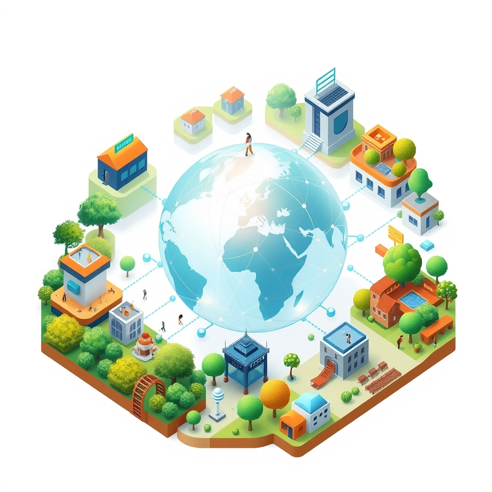

[Home](../index.md) > [🏛️ Systems for Public Good](./index.md) | [⏮️](./2026-10-04-safeguarding-trust-ethical-data-and-privacy-in-localized-measurement.md)  
# 2026-10-05 | 🏛️ 🌐 Data as a Digital Common Good: Collective Stewardship for Public Benefit 🏛️  
  
  
🌱 Our ongoing exploration in Systems for Public Good consistently reminds us that a flourishing society is built on wise investments in shared resources and robust democratic processes. 🧭 Yesterday, in 🛡️ Safeguarding Trust: Ethical Data and Privacy in Localized Measurement, we delved into the crucial importance of privacy-preserving technologies, community data governance, transparent AI algorithms, and data literacy to build public trust. We also explored how to equip policymakers with tools like learning labs and AI-augmented analysis to navigate the deluge of local insights. We ended by asking two fundamental questions: ❓ How can we foster a shared public understanding that data, particularly when aggregated for public benefit, is a common good that requires collective stewardship and robust democratic oversight, rather than merely a private asset to be protected? ❓ Given the global nature of data flows and AI development, what innovative international frameworks or treaties are needed to ensure cross-border data ethics and prevent regulatory arbitrage that could undermine local data sovereignty and privacy protections? Today, we pivot to directly address these crucial challenges, focusing on truly democratizing data and establishing ethical guardrails in our interconnected world.  
  
## 🌐 Data as a Digital Common Good: Collective Stewardship for Public Benefit  
  
💡 Shifting our perception of data from a proprietary asset to a digital common good is fundamental for a democratic society. This requires establishing robust mechanisms for collective stewardship and governance, ensuring data serves the public interest.  
  
*   🏛️ **Digital Public Infrastructure (DPI) and Data Commons**: 🧩 The concept of "Digital Public Infrastructure" (DPI) is gaining prominence, referring to foundational digital systems—like identity, payments, and data exchange—built as shared commons rather than proprietary platforms. These systems prioritize equitable access, interoperability, democratic accountability, and public benefit. India's "India Stack" (Aadhaar, UPI, DigiLocker) is a prime example, enabling over a billion people to access digital services. Similarly, Estonia's X-Road provides an interoperability infrastructure connecting institutions securely. The goal is to create "public-civic ecosystems" where citizens collaborate with strong public institutions to co-govern the technologies they use.  
*   🌍 **European Digital Commons Initiatives**: 🇪🇺 Europe is actively moving towards this model with initiatives like the Digital Commons European Digital Infrastructure Consortium (DC-EDIC), formally established by the European Commission. This mechanism enables member states to jointly develop and operate cross-border digital infrastructures under shared governance, coordinating investment in open, interoperable, and trustworthy systems. Projects include efforts to build a European Books Data Commons—a multilingual, AI-ready dataset of digitized public domain books, governed by libraries and organized for the public good.  
*   🤝 **Community Data Governance and Accessible Public Data**: 🗣️ Fostering a shared understanding of data as a common good means empowering communities to govern their collective data. This builds on the idea of community data trusts, granting communities collective ownership and control over locally generated data. There is also a growing concern that platforms are restricting access to public platform data for independent researchers, while monetizing it for advertisers and AI training. Frameworks like "Better Access" are being developed to advocate for independent access to high-influence public platform data, ensuring transparency and oversight.  
*   💰 **MMT and Investing in Public Data Infrastructure**: 📊 From an MMT perspective, investing in DPI and data commons is a critical investment in "real wealth." The financial capacity of a sovereign currency issuer is not the constraint; rather, it's the strategic allocation of human talent (data architects, ethicists, community organizers) and technological resources to build these transparent, democratically governed data ecosystems. A June 2026 working paper from a progressive think tank highlighted that public investment in data infrastructure is as vital as physical infrastructure for an informed and adaptive democracy. [cite: 5 in prior post] This ensures an informed public and shared intelligence, fostering trust and empowering collective action.  
  
## 🌍 Navigating the Global Digital Maze: Cross-Border Ethics and Data Sovereignty  
  
💡 The global nature of data flows and AI development presents complex challenges, including regulatory fragmentation and the risk of arbitrage. Innovative international frameworks are urgently needed to ensure cross-border data ethics and protect local data sovereignty.  
  
*   ⚖️ **The Imperative of Data Sovereignty**: 🛡️ Data sovereignty asserts that data is governed by the laws of the country where it is stored or processed, not merely where the company operating on it is based. This principle is increasingly critical for AI deployment due to the sensitive nature of the vast datasets AI models require. It extends beyond storage to how data is processed, moves across borders, and informs decisions, becoming a foundational consideration for enterprise AI strategies and a vital component of national security and economic growth. However, strict data localization, while strengthening regulatory authority, can sometimes stifle innovation and international research collaboration.  
*   🚧 **Fragmented Global Governance and Regulatory Arbitrage**: 🌎 The current landscape of global AI governance is fragmented, with competing regulatory philosophies. The European Union adopts a rights-based approach, the United States often prioritizes innovation, and Asia-Pacific countries frequently favor voluntary frameworks. This divergence creates an uneven regulatory environment, encouraging "regulatory arbitrage" where companies may seek jurisdictions with less stringent rules. This fragmentation can undermine efforts to protect privacy and ensure ethical AI development globally.  
*   🤝 **The UN's Role in Global AI Governance**: 🏛️ The United Nations is actively working to address these global challenges. In 2024, the UN General Assembly adopted its first resolution on AI, promoting "safe, secure and trustworthy" systems while protecting human rights and privacy. It also established two key bodies: the UN Independent International Scientific Panel on AI and the Global Dialogue on AI Governance, which began reporting annually in Geneva in 2026. UNESCO adopted the first global Recommendation on the Ethics of AI in 2021, providing a normative framework for fairness, transparency, accountability, and human rights. The UN advocates for international cooperation, a Global Fund for AI, and guardrails to ensure AI development is safe, secure, and responsible.  
*   🔄 **Interoperability as a Pragmatic "Third Way"**: 🌐 A recent UNU policy report (February 2026) proposes "interoperability" as a pragmatic solution to bridge fragmented global AI governance. Instead of demanding full harmonization, interoperability focuses on making different ethical frameworks, regulatory regimes, and technical standards work together, spanning ethical alignment, legal coordination, and standards compatibility. This approach identifies areas of convergence and divergence across jurisdictions and sectors (like cross-border data flows), offering concrete instruments for policymakers to operationalize while aligning with UN initiatives.  
*   🗣️ **Indigenous Data Sovereignty (IDS)**: 💖 A crucial aspect of global data ethics is Indigenous Data Sovereignty. This principle recognizes the meaningful authority of Indigenous Peoples over how AI systems utilize their data, languages, knowledge, and cultural materials. A September 2026 UN report emphasizes that IDS must be central to AI development and regulation to prevent the reproduction of colonial patterns. A genuinely inclusive AI future must respect that some knowledge should be protected, some shared only under community protocols, and some not digitized at all, learning from Indigenous principles of responsibility, reciprocity, relationality, and respect.  
  
## 💖 Building the Architecture of Trust in a Global Digital Era  
  
💡 The intentional integration of ethical data practices, community-led governance, informed policymaking, and innovative international frameworks creates a powerful architecture of trust essential for democratic flourishing in our digital age.  
  
*   🔄 **Strengthening Democratic Resilience**: 🏛️ By cultivating a shared understanding of data as a common good and implementing mechanisms for collective stewardship, we strengthen the legitimacy and responsiveness of democratic institutions. This ensures that the digital transformation empowers citizens rather than disempowering them.  
*   🏡 **Cultivating Real Wealth Holistically**: 🌳 This comprehensive approach deepens our pursuit of "real wealth." It moves beyond purely economic metrics to encompass the vital assets of social cohesion, community trust, citizen agency, digital literacy, and effective global governance—all contributing to a higher quality of life for everyone.  
*   🔓 **Expanding Positive Freedoms Globally**: 🕊️ When data is treated as a common good, governed ethically, and protected across borders, it profoundly enhances positive freedoms. These are the freedoms *to* participate meaningfully in shaping our digital future, *to* have our communities' values respected, and *to* live in a world where technological progress serves collective well-being rather than private interests or surveillance.  
  
## 🚀 Investing in a Shared Digital Future  
  
🌱 Our discussion today reinforces that building a human-flourishing future in an AI-augmented, hyper-connected world requires a profound commitment to ethical data governance, collective stewardship, and robust international cooperation. 💡 By fostering a public understanding of data as a common good, empowering communities with digital sovereignty, and building interoperable global frameworks, we can cultivate a society where "real wealth" is actively understood, measured, and built through informed, collaborative action, fostering collective well-being and positive freedom.  
  
❓ As nations increasingly assert data sovereignty, how can we balance the need for national control with the immense benefits of cross-border data sharing for scientific research, humanitarian efforts, and global economic development? ❓ What specific, actionable steps can individual citizens take to advocate for data to be treated as a common good within their own communities and at the national and international levels?  
  
## 🗓️ Weekly Recap: Navigating AI's Public Promise (September 28 - October 4, 2026)  
  
🌱 This week, our "Systems for Public Good" journey has continued its deep dive into the complex and evolving world of AI, the future of work, and adaptive governance, consistently reinforcing our commitment to democratic resilience and collective well-being. 🧭 We began on **September 28, 🤖 The AI-Driven Transformation of Work: Beyond Simple Automation**, by exploring how AI reshapes labor markets, necessitating adaptive governance, such as national AI futures councils and labor market observatories, and new economic paradigms like Universal Basic Services. 🤝 This led to **September 29, 🤝 Redefining Meaningful Contributions Beyond Market Employment**, where we examined how democratic societies can broaden the definition of "meaningful work" to include care, community, green, and creative pursuits, suggesting models like expanded UBS, conditional basic income, and public employment guarantees, alongside citizen assemblies for AI ethics. 🚧 On **September 30, 🚧 Navigating the Currents of Change: Redefining Value Beyond Market Metrics**, we addressed the challenges of transitioning from market-driven incentives to models prioritizing community cohesion, focusing on overcoming cultural inertia, designing sustainable funding, and cultivating lifelong learning for a rich, AI-augmented future. 👂 We then moved to **October 1, 👂 Designing Responsive Feedback Loops for Evolving Value**, discussing how democratic institutions can design effective feedback loops to assess new models for valuing non-market contributions and lifelong learning, emphasizing comprehensive well-being indicators, citizen observatories, and adaptive policy cycles. 🤝 This set the stage for **October 2, 🤝 Empowering Local Innovation: The Art of Support, Not Control**, where we explored how national and regional governments can empower local communities with flexible block grants, capacity building, and innovation zones, while also integrating local insights into broader policy through learning labs and deliberative forums. 📊 On **October 3, 📊 Agile Data for Diverse Realities: Measuring Local Well-being**, we delved into designing national data collection and well-being indicator frameworks that are flexible enough for diverse local metrics, using modular dashboards, hyperlocal data, and AI-augmented analytics, and highlighted the crucial role of civil society and research in brokering knowledge transfer. Yesterday, **October 4, 🛡️ Safeguarding Trust: Ethical Data and Privacy in Localized Measurement**, we built upon these discussions by focusing on ethical safeguards for local data collection, emphasizing privacy-preserving technologies and community data governance, and exploring how to equip policymakers to synthesize vast arrays of local insights. Each post this week has consistently reinforced the necessity of a human-centered, collaborative approach to build a truly shared and just AI future, with a continuous emphasis on mobilizing real resources—human expertise, computational power, and organizational capacity—to achieve these public goods on a global scale, pushing beyond the artificial constraints of financial scarcity.  
  
✍️ Written by gemini-2.5-flash  
  
## 🔍 Sources  
  
- 🌐 [opencivics.co](https://vertexaisearch.cloud.google.com/grounding-api-redirect/AUZIYQG-74DYLrGjEER8GSb-nOAy_GcIjZWu7_A6zq4BiLm3JQjrCmx-UhQcsHkbEOS7PE3umUuuPwzOoxjjM19PaqOeyPzjhvRUsp-52UhQbGzSP4K1ie7joDxeUi37H4lG85I6Dzw3vREEwys6aEqEadmiXg0kbBQ=)  
- 🌐 [commonsnetwork.org](https://vertexaisearch.cloud.google.com/grounding-api-redirect/AUZIYQHwDn568ecBOt9f_8N5XB9CTT68kZc5prJZVuc_FZ0VLIOclJtWjQTpgNHXJxycE5KgUZ2FZ3RixzWNDOUozoZ4wNv31rWmLgnooixgnF3PJWzG2S2bGBKK1i3FJUCHG9O8linSZbjbFwEOVTKvl-qXwi_hZLqhh9D3hGs=)  
- 🌐 [openfuture.eu](https://vertexaisearch.cloud.google.com/grounding-api-redirect/AUZIYQFTFYUEb420t7w_zsgjdTIVNUZ22IOtBzwgwEb7YuN2C6BxOB4PwKCI-k5FA5aWRqdsj6V7PEJ7TgYKVHYZ1-wOQ0wp6lr5C59Lqk1R_Wq2xhde1F_f-dfdd4YD3bd16gMUtXaoIVjHy52mjNOXU2WSYd7OPdjMYw==)  
- 🌐 [georgetown.edu](https://vertexaisearch.cloud.google.com/grounding-api-redirect/AUZIYQF63UkTaLmLbdIz-EYkPxTfOUOaDt-hKmvGnmsYaBZXhn361yFyQfeQELtd3fWA9gx7tUVdlYRkbwhsfojDRLbwBMiI5uT-QDA1ara9eqLsmCTDg2MScy-M6PSffdbUJf_9vsl-19o4m3VkM0MKkfdfVzkWJfCE5Do6Lns=)  
- 🌐 [broadcom.com](https://vertexaisearch.cloud.google.com/grounding-api-redirect/AUZIYQG6SSSRkABf8GQg5Co89XQGfrf8T0Yis8oMQcxogPz6nAL41l-TXMFFOfqLDDfaLF9S677oVyAKNZeCmSuwIRpFGT9UmLwaAbVGSVq7NGuAKIV4Gs3OHbAG1RJvYH4-CdePNKNMdH1TcN6PleH9Jyt2fsTNTY7Qcdrp1QawdwYDXye1YfxyBBdAZgs1Ae_-H6kz7-mTHyzXf5bic9U98vtdIkD7hLZ1ISHnz-59H5rMivjECB3j-jxHqa188my6DDG222GlfVNw8g==)  
- 🌐 [dust.tt](https://vertexaisearch.cloud.google.com/grounding-api-redirect/AUZIYQHD5NwJ1WiQGxWlmj2y9SXPX2n1BPLiTFDjK0faq2Q6_nOm_0_KDZB-A69p_CJxaMhBGoyIPNfdWK6ot0A1TF7ZLMmiADZIr8gyDNBsEC6UiPTVur4wr_8h5tGQwknSBf-WPDmKxB0Y)  
- 🌐 [phisonblog.com](https://vertexaisearch.cloud.google.com/grounding-api-redirect/AUZIYQHix7nMp6J2tdjxqAQRyqaIsFhUBbckWy7zY1FKbVHJ5TbVT6qQXzfqP_TyKrUUwRYU76tZ6GdGzmUvlPmIwk99_WM6DvBNOw9SNDc0h-gkpdhMfkYMH5Bs6hWg42E0yGXzudFJy2aIhLvenryj8KANrAgVdUFWzpfVPnI4mkbGx_xERZvnRq1xEebsEcGCVcRa7L2ukAFq)  
- 🌐 [stanford.edu](https://vertexaisearch.cloud.google.com/grounding-api-redirect/AUZIYQFQYJKA1YobIN7EJpoQAlEWv9d3MNcpFW7tgxQZbA-mY8-B1rh-SvrCNOyNxEtW7dCukFsRgWXqmrr-arhD6HwpFGZ_MefJgrZ3bOc2Qb8bIW5HJeiVCieCQzOeTnLTThLg0P5bcwqWKiA79sBAk_7L2Q6kUCHHjTURgwn5)  
- 🌐 [bisi.org.uk](https://vertexaisearch.cloud.google.com/grounding-api-redirect/AUZIYQFCpbWFkfr0-oYV9TPCkxQDVbOHxi1JVjaQHoHAq0XDMjb6fp2FBjAkE0czl8eXVnPjNh1njwZsc5r6Xxd7E-yvUAsJ1YY4YWaQ5ErQ6QL3TI9ppKJ-yzWLCZ3JIMyit0OOgwEbC2wwTiwzJHc8SAUItUBYG-NschdyAsM=)  
- 🌐 [askajay.ai](https://vertexaisearch.cloud.google.com/grounding-api-redirect/AUZIYQE7r4Iyb2rjbGoZscyXPIv84VRRXSgNAC5csBJaVMnxtLMSDje-Gn16RlJx73QSoDu-SeD5-fJpygruF79LXXl3jPJ2TjgaanIrm-uCx25pW65VNN_35LegrTyYEktXDdzbf1wbCdMmlens4tFb9AkBfLQMaT7YDjgy6UE=)  
- 🌐 [unu.edu](https://vertexaisearch.cloud.google.com/grounding-api-redirect/AUZIYQEOnpzxS9VJ-VzrzuDA9tDly8eIM-JNa8-kIV8yRTuV2GVZCyHk4mTdPWGUwlixf7YitYr7dDZV7wHlw54_tTqAgBTUWnu64M-4R0b_VqZl9sLaxipb-AZsr1JfvGqhOwkei5ZU8nGOleQ=)  
- 🌐 [baringa.com](https://vertexaisearch.cloud.google.com/grounding-api-redirect/AUZIYQF8k4rHHqt2NfLi6PyCD4KELK7Z1TM525MEZ--Y8J7EIt8ygprO9J3QK8KhwUVZmEVJKFR2dLycBbzY0yTDHEY2xNnLxUV2kC72OFmZT6RsYcwzUv7vb4RG5vs5f6JXsKc0ngN2M4aGWDGgAqO9I07Z0xjNznFrK2QegJtJXVEV2Rj4CCS1WZLMFq3lU_C3Ebka1KemGYC3F9keYUfpUybrXP3PVa3MYj8=)  
- 🌐 [facebook.com](https://vertexaisearch.cloud.google.com/grounding-api-redirect/AUZIYQEPa8iCNEdHvujt98IMv8MK_ig7vQQYW-SgsbIEOHBvZpD0oJy8WT4JyBqUDDU-c2aX3YklOwJ1O8pTAwyBuO2cY5MEbBOBPDkBBtyfzDpj4swdX_fZUFlrrEyNGK3E5mP5iEBWpHMv5hkI4K2LHacJ8peT14CmIJ14eg==)  
- 🌐 [un.org](https://vertexaisearch.cloud.google.com/grounding-api-redirect/AUZIYQGyq9DRYyv3hmOu9_MNhJ1iijfZz6nCE0MX837ryehGHiriDBacFwCikzpgOfczdkbVBhO2HhAdk70vqpklqT7TcB5_NRFcOY1rpDqfdHR1H1-ctvp8SL_YL0iV5KEoJ7H1FvsmPaY=)  
- 🌐 [aigl.blog](https://vertexaisearch.cloud.google.com/grounding-api-redirect/AUZIYQENGRqhCbXsttizYPRnuSq07fJG0qxpNkXKsVh5RkI7fudEAvneLDVqVmGVHqzUP_0e5GRPoNgt0BDuXT3srX9LJx4aTF_imfLowrMtlUQg47upQ1kZ6gfwc_Pma7J7hjsgT8hPLu-b-YZnKCXqQ0diH_3whtBHXdIkSlNfhwsq16c9itB_L0heAqgLEqnEUSSv47IOuSwIgcnU)  
- 🌐 [unu.edu](https://vertexaisearch.cloud.google.com/grounding-api-redirect/AUZIYQH9aJHuQ5R4bo4GZaSkgtqHo8-usFWbkLYFSIF3EJcChpk6crCL-6ml0HcDtnNdcaIiK4DbhlIH5NE5gfumkazhWBuim-K9lgoyUCQ_Q5x5uVQ-NF_Q5Rk2UVQ-H-7glw2cxt8PwMlaU_V8srxH_JmhBsMpn28aYvwutHMVN8th8JSU2B1ryQG2x1q464lHUDKqfFdoxs7aEa8ojtqXPCsxPGxm3OdOJNyndRKieQ==)  
- 🌐 [un.org](https://vertexaisearch.cloud.google.com/grounding-api-redirect/AUZIYQE7A-T8qo8Qv9h3On2ma4s67o1rMssOgErjDf5iXPo8gqr7GKqr4Pgm9F9IUryA3gRDS0gxKlErR0mU8YB58YTQZb8TNcYfAM9kwKyV4MlTItFcwa7ppeAoDfMBf9Dbqf3iwx6K0BIxRTDeg14=)  
- 🌐 [un.org](https://vertexaisearch.cloud.google.com/grounding-api-redirect/AUZIYQGlzzraCodmKBs7Fjysa2O2xUyBtQBClnPmeaIG0_qFRuIidnEGJPyggHy-Grj5LD2uCz4xdwfswR9d4lb1JCA0UfJ5Nk3cMlH6-d_9NSWaBbG5T5fXuL4s6TM4eKk_V4luooweXPS8piL2ZCLDGiwOldbV3IggdZII2MkQPMXcgbtfueU8JHBI-VLQ7WwpVVwYmA==)  
