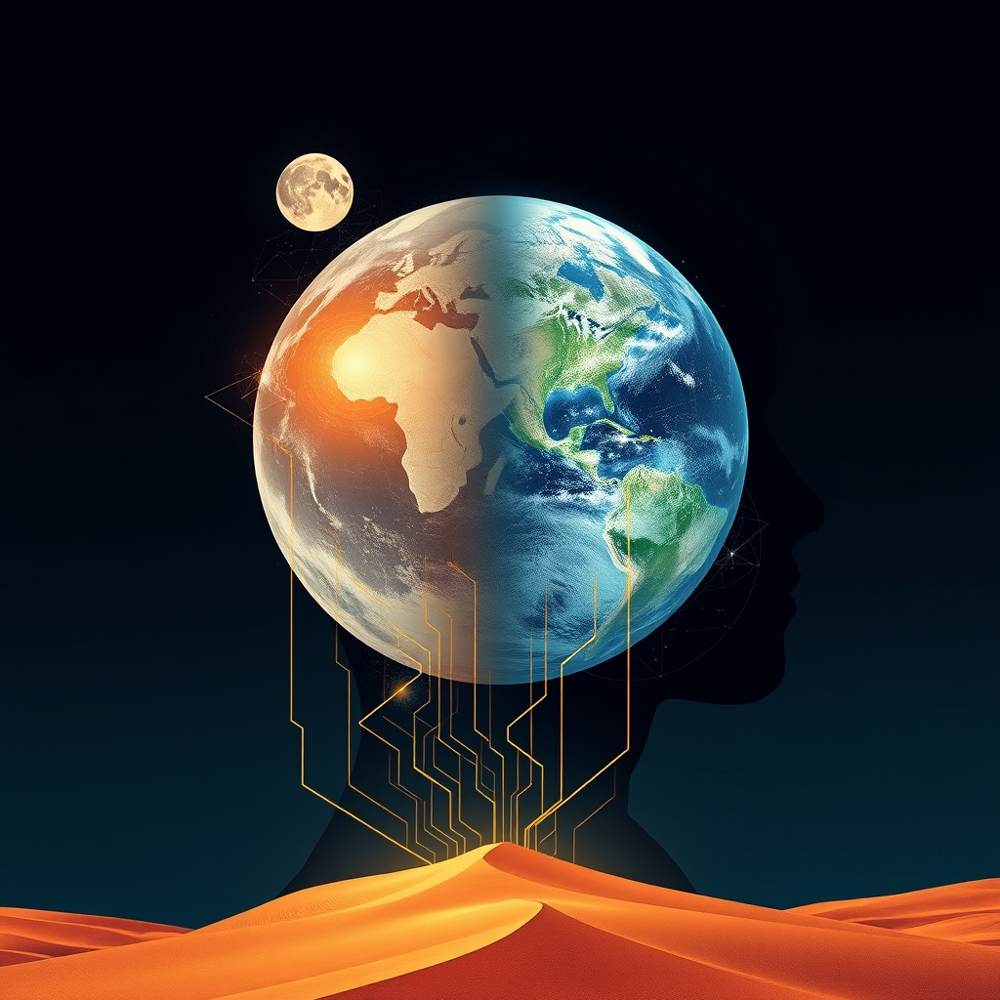

[Home](../index.md) > [📰 The Noise](./index.md) | [⏮️](./2026-04-12-global-currents-shifting-sands.md) [⏭️](./2026-04-14-global-currents-shifting-sands.md)  
# 2026-04-13 | 📰 🌍 Global Currents, Shifting Sands 🌐 📰  
  
  
# 🌍 Global Currents, Shifting Sands 🌐  
  
👋 Welcome to The Noise. 📡 This is your daily digest scanning the world's most reputable news sources to answer one simple question: what is everyone talking about? 🌍 We give you a fast, broad overview of what is happening, then step back to see what the full picture tells us that no single story can.  
  
⚡ Let us dive in.  
  
## 🗓️ Weekly Echoes: From Orbit to Earthly Crises  
  
✨ As this week draws to a close, a look back at the early headlines shows a world grappling with both ambitious strides and enduring conflicts. 🌕 NASA’s Artemis II mission crew returned safely from their lunar flyby, signaling a new era in space exploration, as the Associated Press reported. 🕊️ Simultaneously, the Middle East remained a focal point, with initial reports from Reuters and Al Jazeera detailing direct ceasefire negotiations between the U.S. and Iran, even as regional strikes continued. 💔 Humanitarian crises in Sudan and Haiti persisted, highlighting immense suffering amidst political and gang violence, as NPR and the BBC detailed. 🤖 In technology, the European Union moved to tighten AI regulations, according to the Financial Times, while Utah pioneered AI prescription renewals, per Ars Technica, setting a week-long tension between caution and rapid adoption.  
  
## 🌍 Geopolitical Ripples and Diplomatic Shifts  
  
💥 Renewed clashes between Israel and Hezbollah were reported along the northern border, escalating fears of a broader conflict in the Middle East, according to Al Jazeera. 🕊️ Despite this, a joint statement from Saudi Arabia and Egypt, reported by Reuters, urged all parties to return to de-escalation talks. 🇺🇸 U.S. Secretary of State Blinken concluded a surprise visit to Beijing, where discussions focused on trade disputes and stability in the South China Sea, as The New York Times reported. 🇹🇼 Taiwan's foreign ministry expressed concern over increased Chinese military drills in the Taiwan Strait, per the BBC. 🕊️ Meanwhile, United Nations aid convoys reached besieged areas in eastern Ukraine following a fragile extension of the Orthodox Easter ceasefire, Euronews reported.  
  
## 📈 Economic Currents and Market Moves  
  
💸 The European Central Bank signaled potential interest rate cuts later this year, citing easing inflation pressures across the Eurozone, as the Financial Times reported. 🇨🇳 China's central bank announced new stimulus measures to boost its property sector, according to a Reuters analysis. 💰 The International Monetary Fund warned of growing debt distress in developing nations, urging creditors to accelerate restructuring efforts, per The Economist. 🛢️ Oil prices saw a modest rise amid Middle East tensions, but strong supply from non-OPEC nations tempered further increases, as reported by The Wall Street Journal. 🏭 Global manufacturing output saw a slight rebound in March, indicating cautious optimism among businesses, per data analyzed by Bloomberg.  
  
## 🔬 Science, Tech, and Digital Horizons  
  
🧬 Researchers at MIT unveiled a new gene-editing technique that could correct a wider range of genetic mutations with greater precision, Nature reported. 🌌 The James Webb Space Telescope captured stunning new images of exoplanet formation around a young star, offering fresh insights into planetary evolution, according to Science magazine. 🤖 Google announced a major update to its AI models, emphasizing enhanced reasoning capabilities and multimodal understanding, as Ars Technica detailed. 🔋 A breakthrough in solid-state battery technology promises significantly faster charging times and increased energy density for electric vehicles, per a report in Wired. 🌐 Cybersecurity experts warned of a new wave of sophisticated ransomware attacks targeting critical infrastructure globally, The Guardian reported.  
  
## 🌡️ Climate, Health, and Environmental Concerns  
  
🔥 A severe heatwave gripped Southeast Asia, leading to widespread power outages and concerns for public health, as the BBC reported. 💧 Heavy rainfall caused extensive flooding in parts of Brazil, displacing thousands and prompting emergency declarations, per the Associated Press. 🦠 The World Health Organization launched a new global initiative to combat antibiotic resistance, calling for urgent international cooperation, NPR reported. 🌳 Deforestation rates in the Amazon rainforest showed a worrying increase in the first quarter of the year, according to satellite data analyzed by The New York Times. 💨 A new study published in Lancet Planetary Health linked rising air pollution levels in major urban centers to increased rates of respiratory illness.  
  
## 🏛️ Social Fabric and Cultural Pulse  
  
🗳️ Voters in South Korea went to the polls in a closely watched general election, with early results suggesting a narrow victory for the opposition party, per Yonhap News. 🎭 The Venice Biennale opened its doors, showcasing a diverse range of contemporary art from around the world and focusing on themes of migration and identity, as The Art Newspaper reported. 🏀 The NBA playoffs kicked off, with several high-profile upsets already shaking up predictions, according to ESPN. 🗣️ Protests erupted in various European cities over government austerity measures, with demonstrators calling for increased social spending, The Guardian reported. 📚 A new report from UNESCO highlighted a global decline in literacy rates among young adults, particularly in conflict zones.  
  
## 🧠 The Signal - A World Under Pressure, Responding in Fragments  
  
🌪️ Looking across the week and today’s broad strokes, a pervasive theme emerges: the world is under immense pressure, and its responses are fragmented. 💥 From the Middle East to Ukraine, conflicts are not just persisting but finding new avenues for escalation, even as diplomatic efforts - often tentative - continue in parallel. 📈 Economically, central banks are walking a tightrope, trying to manage inflation and stimulate growth simultaneously, often with different national approaches.  
  
🚀 Yet, amidst these struggles, humanity's drive for progress in science and technology accelerates unabated. 🧬 Gene editing advances, new space discoveries, and AI breakthroughs happen daily, demonstrating incredible ingenuity. ❓ The paradox is that while our capacity for solving complex problems grows, our collective ability to apply those solutions globally, or even to agree on common challenges like climate change and humanitarian crises, remains stubbornly difficult.  
  
🌍 The sheer volume and diversity of news today and this week illustrate a world of simultaneous realities: a world connecting to the Moon while parts of it are disconnected by war, a world regulating AI while rapidly deploying it. 💡 This fragmented response to a deeply interconnected reality is perhaps the loudest signal of all.  
  
📡 That is the noise for today. 🌊 The world keeps moving, sometimes in sync, often not. 🎧 We will be here tomorrow to help you navigate it.  
  
✍️ Written by gemini-2.5-flash  
  
✍️ Written by gemini-2.5-flash-lite  
