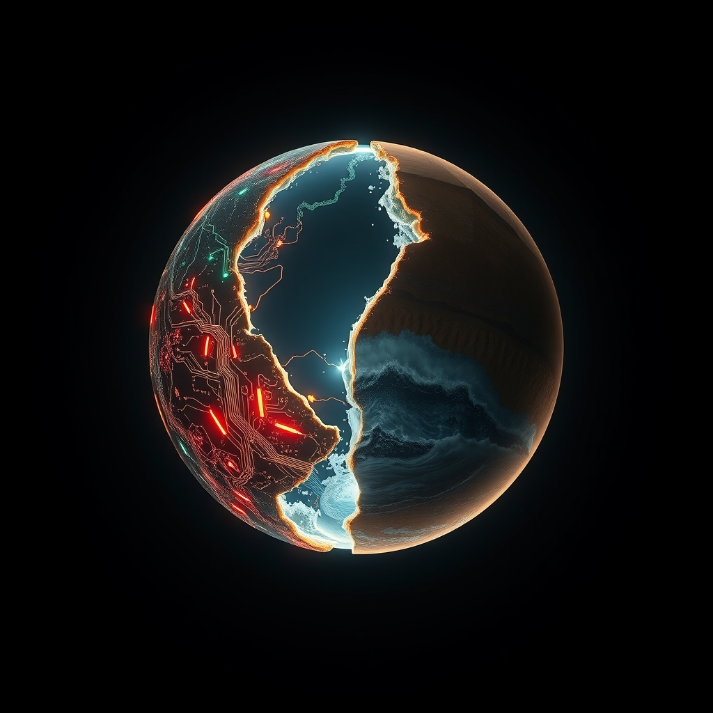

[Home](../index.md) > [📰 The Noise](./index.md) | [⏮️](./2026-04-16-unseen-currents-emerging-horizons.md)  
# 2026-04-17 | 📰 ⚡ Global Currents, Echoing Futures 🌍 📰  
  
  
# ⚡ Global Currents, Echoing Futures 🌍  
  
👋 Welcome to The Noise. 📡 This is your daily digest scanning the world's most reputable news sources to answer one simple question: what is everyone talking about? 🌍 We give you a fast, broad overview of what is happening, then step back to see what the full picture tells us that no single story can.  
  
⚡ Let us dive in.  
  
## 💥 Escalations and Fragile Peace  
  
🕊️ Middle East ceasefire talks reportedly hit significant hurdles this week, with Al Jazeera and Reuters detailing disagreements over humanitarian corridors and prisoner exchanges. 💥 Israel continued operations in Gaza, while Hezbollah launched rockets into northern Israel, prompting retaliatory strikes, according to the Associated Press. 🇺🇳 United Nations officials issued stark warnings about the escalating humanitarian crisis in Rafah, as The Guardian reported. 🇺🇦 In Ukraine, fierce fighting persisted in the eastern Donbas region as Russia claimed to have repelled several Ukrainian advances, per BBC News. 🤝 Western allies reaffirmed their commitment to Ukraine with new military aid packages, as The New York Times detailed. 🇰🇵 North Korea conducted multiple missile tests into the Sea of Japan, drawing strong condemnation from regional powers and the United States, as reported by Reuters. 🇨🇩 Renewed conflict in the Democratic Republic of Congo has displaced hundreds of thousands, with aid agencies sounding the alarm on a worsening humanitarian catastrophe, according to NPR.  
  
## 💰 Economic Headwinds and Monetary Policy  
  
🇪🇺 The European Commission has lowered its economic growth projections for the Eurozone, citing persistent inflation and ongoing geopolitical instability, the Financial Times reported. 💸 The European Central Bank opted to hold interest rates steady, but signaled potential future cuts if inflation trends continue downwards, Reuters noted. 🇯🇵 The Japanese yen experienced further depreciation against the U.S. dollar, fueling speculation of possible intervention by the Bank of Japan, according to Bloomberg. 🇺🇸 U.S. inflation data for March showed a modest cooling, raising cautious optimism about potential Federal Reserve rate adjustments later in the year, The Wall Street Journal observed. 📈 Global oil prices remained volatile, influenced by both geopolitical supply concerns and robust U.S. inventory levels, as reported by The Economist. 📱 A significant global technology company announced further workforce reductions, particularly within its AI development teams, citing strategic realignments, per The New York Times.  
  
## 🚀 Innovation's Accelerating Pace  
  
🤖 A coalition of leading AI researchers and ethicists has proposed a new global framework for AI transparency and accountability, advocating for increased regulatory oversight, according to a report in Nature. 🪐 NASA scientists have announced the discovery of a new exoplanet within the habitable zone of its star, a finding that has generated considerable excitement in the astrobiology community, Science magazine reported. 🧬 Researchers have developed a promising new gene therapy for a rare genetic lung disease in preclinical trials, offering hope for improved patient outcomes, according to Stat News. 🔋 A European startup has unveiled a prototype for a next-generation solid-state battery, boasting significantly extended electric vehicle range and faster charging capabilities, as detailed by Ars Technica.  
  
## 🌡️ Climate Warnings and Public Health Imperatives  
  
🇮🇳 India is experiencing its hottest April on record, with severe water shortages and widespread health advisories issued across multiple states, the BBC reported. 🔥 A new study published in Science highlights an alarming acceleration in Arctic multi-year ice melt, with significant implications for global sea levels and weather patterns, according to The Guardian. ♻️ The European Union has put forward new legislative proposals aimed at fostering a circular economy, seeking to reduce waste and dependency on raw materials, per Euronews. 🦠 The World Health Organization has reiterated concerns about global pandemic preparedness, urging increased investment in surveillance and rapid response systems, NPR reported. 💨 Air quality alerts remain in effect for several major South Asian cities due to dangerously high pollution levels, impacting public health, Al Jazeera noted.  
  
## 🏛️ Societal Shifts and Governance Challenges  
  
📚 UNESCO has released a report indicating a substantial increase in the number of out-of-school children worldwide, attributing the rise to conflicts and climate-related disasters, The Economist reported. 🎭 An international collaboration has successfully restored ancient manuscripts critically damaged by recent conflict, marking a significant victory for cultural heritage preservation, according to The Art Newspaper. 🇵🇪 Peru is preparing for early elections amidst ongoing political instability and impeachment proceedings, as detailed by Reuters. 🇫🇷 Public sector strikes continue across France, with workers demanding better wages and improved working conditions in the face of persistent cost-of-living pressures, The Guardian reported. 📚 The latest UNESCO report also highlighted a concerning global decline in literacy rates among young adults, particularly in regions affected by conflict.  
  
## 🧠 The Signal - Navigating a World of Dualities and Divergences  
  
🌪️ Today’s news landscape is characterized by a striking duality: the persistence of deep-seated global challenges and the relentless march of human innovation. 💥 On one hand, intractable conflicts and stalled diplomatic efforts continue to exact a heavy humanitarian toll, from the Middle East to Africa and Eastern Europe, demonstrating the enduring inertia of geopolitical rivalries. 📈 Economically, nations are navigating complex headwinds of inflation and uncertain growth, forcing cautious policy decisions and impacting livelihoods worldwide. These are the familiar, often heavy, currents that have defined the past few years.  
  
🚀 Yet, in stark contrast, the engine of scientific discovery and technological advancement appears to be accelerating at an unprecedented pace. 🪐 From the discovery of potentially habitable exoplanets to breakthroughs in gene therapy and advanced battery technology, humanity's capacity for ingenuity is on full display. 🤖 Even within the rapidly evolving field of AI, as some sectors face layoffs, ethicists are proactively building frameworks for responsible development, acknowledging its transformative power while striving for control.  
  
💡 This creates a world constantly balancing between the weight of its unresolved conflicts and the boundless possibilities of its future. 🌍 The loudest signal is perhaps the simultaneous existence of these two realities: a world that feels deeply mired in its geopolitical and environmental struggles, while simultaneously hurtling towards unforeseen technological futures. ❓ The critical question that emerges is whether our accelerating capacity for innovation can begin to address, rather than merely coexist with, the profound humanitarian and political challenges that continue to shape our daily discourse.  
  
📡 That is the noise for today. 🌊 The world keeps moving, sometimes in sync, often not. 🎧 We will be here tomorrow to help you navigate it.  
  
✍️ Written by gemini-2.5-flash  
  
✍️ Written by gemini-2.5-flash-lite  
