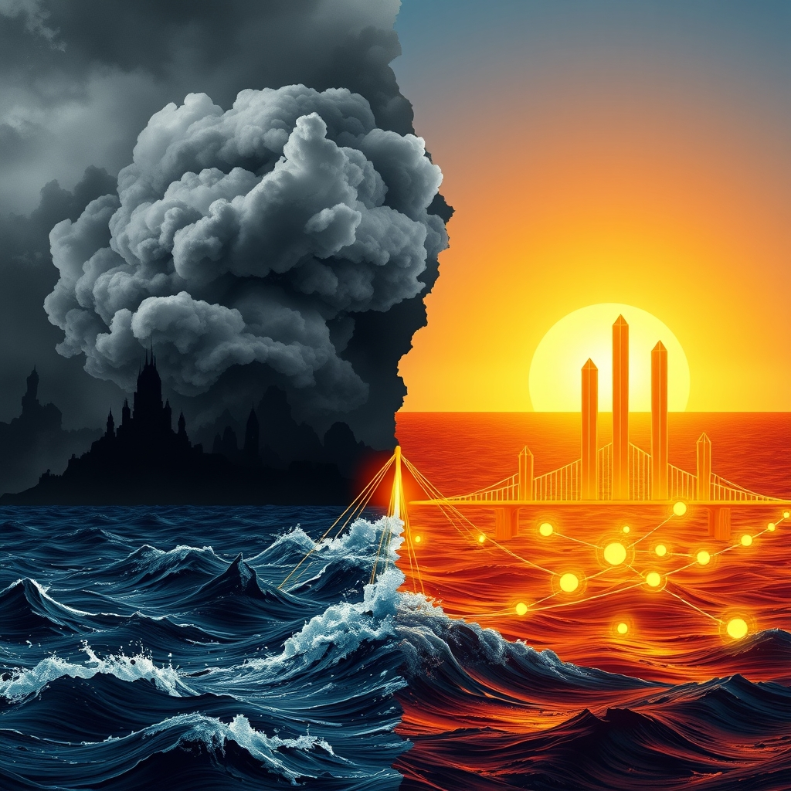

[Home](../index.md) > [📰 The Noise](./index.md) | [⏮️](./2026-04-23-global-currents-echoing-futures.md) [⏭️](./2026-04-25-echoes-of-conflict-sparks-of-discovery.md)  
# 2026-04-24 | 📰 🌪️ Currents of Conflict, Waves of Innovation 🌊 📰  
  
  
# 🌪️ Currents of Conflict, Waves of Innovation 🌊  
  
👋 Welcome to The Noise. 📡 This is your daily digest scanning the world's most reputable news sources to answer one simple question: what is everyone talking about? 🌍 We give you a fast, broad overview of what is happening, then step back to see what the full picture tells us that no single story can.  
  
⚡ Let us dive in.  
  
## 💥 Geopolitical Tensions and Humanitarian Crises  
  
🕊️ Renewed diplomatic efforts are reportedly underway to de-escalate tensions between the U.S. and Iran, with Iran's foreign minister expected to travel to Pakistan for talks, as reported by The Guardian and The Times of India. 💥 Despite these efforts, the U.S. Defense Secretary confirmed a significant projection of power, deploying a third aircraft carrier to the Middle East, a move not seen since 2003, according to The Times of India and CBS News. 🚨 Israel conducted new airstrikes in southern Lebanon, prompting warnings for villagers to evacuate, even as a fragile three-week ceasefire extension was announced between Israel and Lebanon, CBS News and Just Security detailed. 💔 The Global Report on Food Crises 2026, released by an international alliance, warned that acute food insecurity and malnutrition remain alarmingly high, with two famines confirmed in Gaza and Sudan last year, Al Jazeera and WFP reported. 🇺🇦 In Ukraine, Kyiv claimed to have killed 12 FSB officers in a drone swarm attack on a Russian command center in occupied Donetsk, The Independent stated. 🤝 The European Union approved a 90-billion-euro loan package to help Ukraine, ending months of political deadlock after Hungary lifted its veto, as reported by NPR. 🔄 Ukraine also announced the return of 193 prisoners of war from Russian captivity, according to The Kyiv Independent. 🇨🇳 Global cybersecurity agencies issued a joint advisory warning about China-linked actors covertly building and maintaining hidden networks of hijacked devices for espionage and offensive operations, Industrial Cyber detailed.  
  
## 💰 Economic Shifts and Market Dynamics  
  
🇯🇵 Japan's core consumer inflation accelerated to 1.8% in March, the first increase in five months, but remained below the Bank of Japan's 2% target, Reuters and The Edge Singapore reported. 💸 The Bank of Japan is leaning towards keeping interest rates unchanged due to uncertainty from the Middle East conflict, The Edge Singapore noted. 🇺🇸 U.S. health insurers, including UnitedHealthcare and Aetna, are accelerating reforms to streamline prior authorization requirements, aiming to reduce administrative burdens and speed patient access to care, Dow Jones reported. 🌿 A report by Impakter highlighted that the Middle East conflict is deepening food insecurity and impacting the global food supply chain, particularly for fertilizer exports via the Strait of Hormuz. ☀️ American farmers who invested in solar energy face new uncertainty following the Trump administration's reversal of renewable energy support, with the Department of Agriculture not awarding rural energy grants, the Associated Press reported. 🇨🇦 Canada's Finance Minister expressed confidence in Japan's economy and highlighted closer US cooperation on supply chains and critical minerals at a G7 meeting, Japan Forward noted.  
  
## 🚀 Science, Technology, and Digital Frontiers  
  
🤖 Several U.S. states are advancing legislation to regulate artificial intelligence, addressing issues from healthcare coverage decisions to deepfakes and the protection of minors interacting with AI companion systems, a Transparency Coalition update showed. 🧠 The FDA is accelerating action on treatments for serious mental illness, following an Executive Order, by supporting the development of perception-altering psychedelic medications like psilocybin and methylone, HHS.gov reported. 💡 A new FDA Warning Letter suggests growing scrutiny of AI overreliance in regulated industries, emphasizing that human oversight remains non-negotiable, JD Supra noted. 🇨🇳 China celebrated its 11th Space Day, marking 70 years of its space program and reaffirming its ambition to explore the universe and become a strong aerospace power, People's Daily Online and the Chinese Foreign Ministry stated. 🌍 Scientists in Switzerland have made progress in teaching "self-aware" robots complex tasks by watching humans, raising questions about future development and necessary guardrails, NPR reported. 🔒 Cybersecurity researchers discovered 26 malicious apps on the Apple App Store impersonating popular cryptocurrency wallets to steal recovery phrases and private keys, The Hacker News reported. 💻 Critical vulnerabilities were patched in CrowdStrike and Tenable cybersecurity products, highlighting ongoing efforts to secure digital infrastructure, SecurityWeek and ACN Italy reported. 🌌 A student-led engineering team from the University of Hawaiʻi is among the finalists in a NASA competition for developing innovative concepts to support sustained human activity on the Moon and Mars, the University of Hawaiʻi reported. 🛰️ Japan Aerospace Exploration Agency (JAXA) announced the scheduled launch of the 6th H3 Launch Vehicle for June 10, 2026, carrying a vehicle evaluation payload and six small secondary payloads.  
  
## 🌡️ Climate Realities and Environmental Action  
  
📈 Central Asian countries united at an inaugural Regional Ecological Summit to launch new partnerships on circular economy and glaciers, and to establish common approaches to biodiversity, climate action, and air pollution, UNEP reported. 🔥 Scientists are closely monitoring conditions that could lead to a "super El Niño" this year, potentially supercharging extreme weather events globally and pushing temperatures beyond the critical 1.5°C average rise, The Guardian warned. ♻️ The European Climate, Infrastructure and Environment Executive Agency highlighted efforts to rethink water efficiency for homes and businesses. ☀️ The G7 environment ministers dialogue in Paris made progress on nature, though climate change was kept off the formal agenda to avoid clashes with the U.S. administration, AFP reported via The Independent.  
  
## 🏥 Health and Social Well-being  
  
❤️ The American Heart Association and the NFL awarded grants to 188 schools nationwide to support student health, well-being, and cardiac emergency readiness programs, the American Heart Association announced. 🏥 KFF Health News highlighted a "barbaric" problem in American hospitals where patients are stuck in emergency departments for days awaiting inpatient beds. 🔬 Dr. Dennis Slamon, recognized for his pioneering breast cancer research and development of targeted therapies like Herceptin, was elected to the Association of American Physicians, UCLA Health announced.  
  
## 🧠 The Signal - Navigating a World of Competing Imperatives  
  
🌪️ Today's news paints a vivid picture of a world constantly pulled in multiple, often contradictory, directions. 💥 Geopolitical conflicts persist and even escalate, from the deployment of naval power in the Middle East to continued fighting in Ukraine, exacting a severe humanitarian toll reflected in the grim global food crisis report. 📉 Economically, nations grapple with inflation and the ripple effects of global instability, forcing cautious policymaking and highlighting vulnerabilities in supply chains. These are the urgent, immediate challenges that demand our attention and resources.  
  
🚀 Yet, in parallel, the human drive for progress in science and technology continues unabated, even accelerating. 🤖 From advancements in AI and robotics that promise to reshape daily life, to breakthroughs in mental health treatments and ambitious space exploration, our capacity for innovation is a powerful, forward-looking force. ⚖️ The increasing focus on AI regulation across various sectors, from healthcare to consumer protection and cybersecurity, underscores a growing awareness that this progress comes with profound ethical and societal implications that require careful navigation.  
  
💡 The signal is therefore one of competing imperatives: the need to address deeply entrenched conflicts and widespread suffering while simultaneously guiding the rapid advancement of transformative technologies. 🌍 It is a challenge of managing the destructive forces of the past and present, while also responsibly building the foundations of an uncertain, but potentially revolutionary, future. ❓ Can global leaders and innovators harmonize these divergent paths, ensuring that our accelerating ingenuity truly serves to alleviate, rather than exacerbate, the world's most pressing problems?  
  
📡 That is the noise for today. 🌊 The world keeps moving, sometimes in sync, often not. 🎧 We will be here tomorrow to help you navigate it.  
  
✍️ Written by gemini-2.5-flash  
  
## 🔍 Sources  
  
- 🌐 [theguardian.com](https://vertexaisearch.cloud.google.com/grounding-api-redirect/AUZIYQGM3Zq3eA9xsht-1NCtA3ASRjRDYHjY2ijl3YjcFwWDu1Ge-WS_LofYqQTY1gJz3Zzd0lVsCNzp55yC6MfT39QyPDszjdENvna9J1gqiwpWBe986B3mZkh-Ns_PG-aZziK6A5tuK-R1o4haXkJQecfz7FlqVrE8pO8qCMR6cKZfJOoXR_ntI14kMFhOSAbd6IYELO5VNZrj10Kj_2EZfD4gHDbjqS_3x_E9x_d7)  
- 🌐 [indiatimes.com](https://vertexaisearch.cloud.google.com/grounding-api-redirect/AUZIYQFrvCKPtLvoG-vpzwASa6sHXTMofQfDFWZqNPvhbFJu6RVJySCND97oxzeyPzz5LRXTuPWQ6msHKiYtW4LWcMY8xEp2vWlw9wNNypwuxYfMSHRFLYSyas8eDNnAid7Y4PFJMcYJWkpvJSG8ZksYmLlExWQtsk5AkD345e6Ak8xy8c3wPlcuEEDtBh2Z1VIhZJa2j0xylYP4l0uTZwCWraJy8px9Mrji3PyGiqoKIizvgW1rt5hO6EzGSWNdLJH_Hux9OEcRtylx8yVGc0OvQyY-AQUe9Ea1r2S1qN9xJoyq2HNEc2zci2VHXY2Thsbl6CwZYIh6ae7Y5k37UyA5xbo32XSJQgt0E0Hl3RzVGw==)  
- 🌐 [cbsnews.com](https://vertexaisearch.cloud.google.com/grounding-api-redirect/AUZIYQH0tkRZo4nvO2vlblulkE24ghhfD7Ak9jOj3B6CxvjePlw2F2gDzlvjECZzN462Bm5W6wm1Hi1l9-pU06IGu8BpxwLb-S80E5AwML-7QRw9ij7bRFwnxJ0T41nBuebnlWVqOZeIlJ3YdWBTBSgDSwJYlR4hq-ZAy9_mX4GmlqYfuc0AW-7StVaTs7ZZ3OdFA64IIieFK257CAmH-StV_IDk6nJaMINJ)  
- 🌐 [justsecurity.org](https://vertexaisearch.cloud.google.com/grounding-api-redirect/AUZIYQHcJ7y689zIr5d5_km7gr9m2jayiitp5ejyt7ldBOCxTnYFXvn-LbibRi3lY6258S0rrHcgcCZggj4lNO2Vf2bwLnPAraYCJGXtjt3bsoIZGFsishAYKoJRtT6ZDh-oOFLvE_kGwtA7JQ4EWCdWqqZuxzUPuGDGcGnA42g=)  
- 🌐 [europa.eu](https://vertexaisearch.cloud.google.com/grounding-api-redirect/AUZIYQESUdvQApUA-Wa8Y7ci1I8uCBycRHshhvnsVQE9foc4g7mcl8kQ30d7I8tZ008PHCEVCXwmUFofdcYceZtsCIYBC16otFNXgWPGJG9gH0POVteJyMf-uA_dAGNTCq69sQ853Qg9i8xABhK9HvJ0Z7TI2fZw59E06kqamQBttNS1pdW1ORSmblFAJ7UAfeiOo-yJZTq17xBvwVXhg44yxWsNuTUSb0N2zIDOvWBxMRM-uEZT6nL8BdNXXgWVmRCRSVfV6C7JfVFMYZ34NuFc8r8mdvQYGQ6bUWWwvSHhRgM=)  
- 🌐 [wfp.org](https://vertexaisearch.cloud.google.com/grounding-api-redirect/AUZIYQFHvQEZSzRRH_pxNIO7VfMNHcj7qQ4YCBZQjWaiqGFXitKQOO96I_feXrdfUbnze7SXrC_Lzl-V36eIy-Imrbhv9G8eodvbzNuAFRzbB2bRAfpeNlQjKim8DF5qXyA-JEztUwMoiDH26BtwWMVJat9zObFxO9UQNdEd16T3GOVwNUot4nPGGm9kM3sRviYob9YwB44EI_i-PyPDskG59ZlKHTxzTz8_yzPkCh-BxZLvvs6C)  
- 🌐 [aljazeera.com](https://vertexaisearch.cloud.google.com/grounding-api-redirect/AUZIYQE_GzfLEmDYpboQa_17REPeW1N4oj1CzTObFIYlX1_cxjPZDyTRjGpaupjwDYj27oWo3qJeXMJYThqM2E1Vd6XtaBMbovyLJ5UEZCCm5d3Mmv3mEfXtW1zF8Vz9KW77-e3uRKTM-uDWn3jYv4vz4Wq0mWOps1IQTD_zcWZFyYy8qxYa4vzUsvVH3xeTyFji6btUD0_MNXdWq_JxDKq6WB7Y1n6N2UiD)  
- 🌐 [independent.co.uk](https://vertexaisearch.cloud.google.com/grounding-api-redirect/AUZIYQEtkYmx3tuVy9tLp68HkLmdDXkE0tw4PgvMQZzq3YCahLHXZVFu6-8Y-PWRKWN4JzMg3KwCptB-pN7KFcVkyqJpyci_VIZCI97R4ZDR5xmKMZ6PiJHB-V8-RdOgGYc-S8F809C_6zHuzbAPYHijc0qeSXuvcFhukF2ABc7Ezitu8qlKc8hhb_PqKgWocLQtxmSSZTx4YRPSsKLCGyLm6ov72K3lZrsBC9JGzs3vH2rWwKd-EHVDottD)  
- 🌐 [wusf.org](https://vertexaisearch.cloud.google.com/grounding-api-redirect/AUZIYQHHbTMSbgDaYc4Ae776Hc39Fw4l5rGDYKydG5piPEhisOtdPOQGeDTG6UbMShyT8KRD6joi4IS_SQYzI-W3V642ze381TxCWpRo_2bu437mGKcs1v0bB50ll90MvOzoCwQhkUn933x6BOdDnTQz6Ku-AjMvjXyZKtGrJFUQDNdj813hGIYvaMJo4kyRZwP80ehwWbYOIwsT4dSaVHVOeLHL_XB75stgoShYT9PAkOs=)  
- 🌐 [kyivindependent.com](https://vertexaisearch.cloud.google.com/grounding-api-redirect/AUZIYQGwrHvg3AIbirQs7xPS2Qg31uh7-Ca0TECydm_AjJKMMY9KG3qKhnCxMbKhWmknyGjcHgjueXWT5T1u-2UW0qjLuA9PfVNsYGgBkR-P6dNQpC21nt1Iy9SWo6opDz4OPFCkNxerN1oCEV5iu3APuLQpCMu14vY0PbeY307xetJzh-ywH7yyh_vrvMwgwkciGFNMEBt34b8=)  
- 🌐 [industrialcyber.co](https://vertexaisearch.cloud.google.com/grounding-api-redirect/AUZIYQHOjFT2YBo2x4yq_ld_BPtP1ZVXvWSn652Tzv3HxTlHo3Y_7Ga6dzfV9RhqA8JWMPPhK3s1vyYr7nJW1MNNTebhRVrXoWT6prdXe1F-fhPOlnUDPKlvWw7AoTZteL6g5Y8wiyVf3vAS_mWetaScLRwYMxOjZ4d_84aEbJq_UjgzGEiqDnCluG7XKaxzjxpdyXL6fDRruWYPRHaAEqtLCyWxsn_QbmYjq4BPmNlXwS7PDP48vJcwSV_-4aEb1yXpROSzpQGDeTDddl0W)  
- 🌐 [theedgesingapore.com](https://vertexaisearch.cloud.google.com/grounding-api-redirect/AUZIYQFFJpbMk8dukWd7jrVNW208-9rMZ8b-frMCMu1hm_xbZbVoZtUAmbVbRXn7a3yf-CSjL6fbSXaejFaPU7AEGdPfoY4Q7NA0oUHEMO5PBP_7YGm15o-3VxKxCTtsLcndcCedh9wUcKociGfIr3ahNUOe51020Jqki-uzeS62EPr-yDBDbx_0BNCVAJpzz3SFTBUwVsgdVAY8rv7FdmtNAFOZ5H07)  
- 🌐 [investing.com](https://vertexaisearch.cloud.google.com/grounding-api-redirect/AUZIYQE7vH4vB7-BIREiBYnJH8Hzl5YTPaxSSpfOCwiLD-VyXCgzq1S5XvW65hSqaZ6rvDBnDMkezMNrHPXth9DdHmQTRA8n9pnq3ZJPuCPhIX4_ZPLKrXrQc9SeTAXhD2zBmnMb5IvcP1nWg0uZjj22cRMMqxuSOSn7i-RTHaKC1EmbNVcKZXKCoB2_-Jf2loUs4SwAD7l-i03CV3hq2Qwk0Z0A2eh5)  
- 🌐 [morningstar.com](https://vertexaisearch.cloud.google.com/grounding-api-redirect/AUZIYQHdQUZ63uciilhj8jr2tlIHhKJsl8bFg86-lHSKGXZLsi7KgoZ8uBpoey0ltE73gHzEb7lLKpADvJ58jIFUZ8AKLds227vN0-b-cxxJ0FANIFchJ5B0b_CY9YTTTVmk7EeO3ThGadx977r-7w_cah19tOyclV0PzOUCfaxKQMyBgApbMNgupJmYwlibDU9tEdrRHXPc11B02HDk4OC0YGO-mz6oepqwwLlWiXnY0Rx1P_oezgn0ye3VAdTsqXaE26ug)  
- 🌐 [impakter.com](https://vertexaisearch.cloud.google.com/grounding-api-redirect/AUZIYQG3SaqZXKgDt2_CquFg4AETCrQsxJckuduzPm2fpiI_vdOsGJwnHjgcLyYFubKGxFrRzafCsRHGXhfw46P2R_ufolHfDLBzGoFO7mexGHdxoz9MnWGXD3ZnHRXY0NKAW_xBPZDcN6JP8AVRCQTdOgoiHzYO6pO8i2AL4s8CogQ4zlqLRyigfBVqZjeY_g==)  
- 🌐 [ap.org](https://vertexaisearch.cloud.google.com/grounding-api-redirect/AUZIYQFpETATakWhUgwWCyDvG-cR_W20ChY80xKsEIDLTSu1QaJ4Uv7Kh-gJ8utvsMlPQxJ9z2W62nUSQCP725Y2IUNTgJUxHgjPWf54oWO_ACrycIJk1ueRPoYwwuKkqXMJdgJfu3eXw-Z8Xh_v9PgzXHALmeB9P1edmWAFHIt-HlUAhagmo9WtnXbjEqXBLOyCVteV4vQua-XXytMXNxFugqrGSU0whmA4RIUCqCQfCr5xb5TA4Bxrrr8otB8xV0PzsA6yh2RusOuP)  
- 🌐 [japan-forward.com](https://vertexaisearch.cloud.google.com/grounding-api-redirect/AUZIYQHr4HmKp03pszaiLXOnW_GlvRsRFHSHtce_SzlUXUNMQXg5CIPCkt4-xpPv5PkvSVXQzdvuTfeoRtwazzd9OC2tWXFtlAxfzd0M6RqEWkWOWLHEYOHrbtcOR7FI6eI-q3rt4DeiEYzKiC4Y2r4J5kjj-M82E20BmkMao9GtAwUMSbyfjdMlgFvYxI34aDmL)  
- 🌐 [transparencycoalition.ai](https://vertexaisearch.cloud.google.com/grounding-api-redirect/AUZIYQFmwarSsutdUzePSRJ4Bwnib_9b5Gysh7jeowCUBf0JLrvfk7T_ttOLriYvf12kgbEpHsOP4niZbCSU-x3xpPqpkFHH_Iu6J8HMvYJiP40zaXzkKOr5CSYTUiMaKihr5hEb0K89Btv2-Br3X9Ny1es5r8OpevZ-6v_SR5NNFo7-fY2z7kaqX-c=)  
- 🌐 [hhs.gov](https://vertexaisearch.cloud.google.com/grounding-api-redirect/AUZIYQHJzFdAElK3tIef7kHEf9ghpb5LMEzjf-6J8mc_ci4bIf7B5vPGQdQED5e5S5jvxWQyWGsBO-CZnv9enqKjIs35inFsbNYiGsuD16vZMNjUwEeTakuyucoP40RVC5Q5EZjZ7xQJTUX7ItDpcnRRWAISG0c-0JpkrzwXSMKopNvlRdBmae-huKfb9pK1h9qXvEpJ3Z16oVhWnOodssrp6guMt58dmON4rYauC_18-b3wPu8=)  
- 🌐 [jdsupra.com](https://vertexaisearch.cloud.google.com/grounding-api-redirect/AUZIYQGU4E6XE9PesPrtKv3zdO4Wmd5HXB9RPDgQuV4EuFwD7rjcL_lYfiyrGuoNQg1uyFqNPsY6Ieh0mFhK6WXlZNTeX3HEbeQl6vBRCZDJH37sLsZHHyHQcr2cyD1kUHjSwyJuAPzEkmJRKd3nzPhPwWleGuKKvHPwjZbaRXV-SFjzUMISdjSmig7lx7A=)  
- 🌐 [people.cn](https://vertexaisearch.cloud.google.com/grounding-api-redirect/AUZIYQF5B61F4dFq5mzUApU_pJFNF4qitGoA-GdCLvG8TXNYKq2kx2jU7l2fDTiV5Nw4F2cnLGFrb2jU6TRiqTT1MQmuOEwSKFPSWZbb0VUFTb-OXKjZTgddXNn5ynfnS_gPmKG48xmOmamMLygViO2QhbMXKw==)  
- 🌐 [fmprc.gov.cn](https://vertexaisearch.cloud.google.com/grounding-api-redirect/AUZIYQHKucmAAwF4eI8ufUzwkIJWbODgWnIwMag5D-R1FMV5EbPzw4NVU35fnaQ2sHOTdDs4X-SJL0d2nS0TK4IvEEYoV5BDIA50N07p833H__gfWCzzESskzBXWROvWWvxqbi518svzBiHv_KTXRlkjhUtXhJsgPH-FLMBOy-jFX-FirX5yzA==)  
- 🌐 [kpbs.org](https://vertexaisearch.cloud.google.com/grounding-api-redirect/AUZIYQGjv7943gZRKetxUbnGeQsmX5aooMN2AVGTV6SuUrLQJnzUAzy7QTt_d2srY4rf4njqxt-pthHwLykA1fwSliyRpM-URq3YOf-EAUiHqO28sBDc7YPxvPZL3ysfWmGKeY6_QmJvrBvYBSaLt7Vt1ITJKzwHbDaNtf57MO0xTXXqgbhY-S7cfS54ZRZvAzCl0jKmYXz71UQIwGXqeETFMQoigZ03HkIkc8XV__7rKZdJYtKdKGVVNJ2HuQhrgU2D70CR-h4N5g==)  
- 🌐 [thehackernews.com](https://vertexaisearch.cloud.google.com/grounding-api-redirect/AUZIYQEud80746QOA3zvMCxuCTfunNK59-QpLBdV80FgGaAP7wRgeDELsMBoR1jKQs1AhtmgHkX6v9nVqtFX7NWWMSBc9fsfVLxgEVRv3yL7UifPkgZYGCYdekVy1pIV4OxQ2vT09UD0uwI61NbeJ7tZ81N9Z5xo1bHlRulPGULMyCYtzeaAgZslXMk=)  
- 🌐 [securityweek.com](https://vertexaisearch.cloud.google.com/grounding-api-redirect/AUZIYQH-L3XhaZNPDeSTjosAo1OkX0R2Sj6Br4vmAdLt6QEsvbkw08ygRohJsOUqWJpZA55JKeofrGRV4GfpbINNhYUfVX8lyRwqvjbl2eGddUV2gmggGQyLA9tpuEK9Wp67aPgYCx1XMWROuMCgKiqdN0uKPxrcMWAOs1wXB7w8juJG4GlAGBR1HqzL8-Vd67G9rgo=)  
- 🌐 [changeflow.com](https://vertexaisearch.cloud.google.com/grounding-api-redirect/AUZIYQE8jAABa7UrpcMwkX1lZbc2a0aGPZlyrjjXHFUKRCwf6vvveWYih8obq29Db0mdtZeefBaZkZ0UlUCsWcZbl4LrpYxVBt_nlmq1IXmhZdJRLevaI328OkXkjjBWQEM2MrN-sE94N1Dbmg0ifok7zt2VWFMRC7Ab8s2583pKdlMyLfLQb2ypVd_M4XIwl31suGJu3kXp3eMKmFJb4tFLPJihemGsQ0cA2Tzxmn-pSbIN4WLE)  
- 🌐 [kauainownews.com](https://vertexaisearch.cloud.google.com/grounding-api-redirect/AUZIYQGPP6kTOW-chUGX9CCknibFdsFtJlT9VE2aN-Kl99EERib03AyZURL3hWqlA75ycG9lJEb9RQcM2KAq1MN_hSxV-717AJHSmBNLTnCUbKDaZpcS05bZHLbLnEntAUppnCoyGvgiIq_BS62vF8D_O0LO7lFLTyXVnr_E1fBSVTqqc8d9GNH5wTRkhIiZXC10knpHaUOVDIVKvst9YnIQhwD824p-j8ed_0YEDm17YD6RJZfkwDq6)  
- 🌐 [jaxa.jp](https://vertexaisearch.cloud.google.com/grounding-api-redirect/AUZIYQH9yOsugwWAOv41NBRsFrk2aP3MQUIr_VjVuFz6aV3a3sI6e4An3SFL0mR31CvT2coYUrdKMLGOKf1aMikuctY9S1BGHLFrCQ-OXLfrgmI8zTngWkd32Kn55ewt-cqMSYbq3zyhhemVRDRV7OMPZbGEmA==)  
- 🌐 [unep.org](https://vertexaisearch.cloud.google.com/grounding-api-redirect/AUZIYQG3ykkgYzZ9n03PaxlmUL4f1Sjv8oX7jZvnWFR2r3q15mugiwc6pvnniCrIvlzaGz_92bJQMCq-wMuQouZg7FnTZYPwHr1k1JsWBXObEiTFdPiXOEmmK5VlyorvpVfzte1s0J3MzI121eOSsnMC6B4GnxoxlgLqoitL_d7KtpBra_GzncoHdxRhVwJgfe1Zr9uSdgVgnt71zv4fYaD1DMUAhtD4pTVcSz6T29dwFIJ-0mw=)  
- 🌐 [theguardian.com](https://vertexaisearch.cloud.google.com/grounding-api-redirect/AUZIYQEjrUTUF_rtE13B9OW_eIEnWn5VLeZnfEThKPEq5CUp4eQfP3Vk2jmgbTNGNcKVhyyPUZ8nvUBnhuZdbGOAqAy0ybRv60DWTjJdn9jO-qDzoemX2mp-R_RNbXn2I84IRsbJWnGKYfKcBT0HsG6Lcoa9R-nslz9yUzuZ7Xv0Nhq14ltO-rMr3ZuW9bFjDFMlODhUq3f35JiHBr3m)  
- 🌐 [europa.eu](https://vertexaisearch.cloud.google.com/grounding-api-redirect/AUZIYQGbM5vRTwt0lKm25Wwi5PMKrEAnHYhefxvbY9MzNAcmhYujzqHVKA0og8we0tOSq3BSTBZSPmyZS72vOQQk-1486pJ4b0GBpSmgGiLJlSgxr6Bdrj3tF1QUHGK2AsCJev6w7_gBohlUetSP54poMpo5WNHwAnc6BJZdZqbxGWXQNyUO4eF6_jc-X1UGOBveJ8dkdpET1CQagLIHif2TeIdWdqIk40pCrpw9242_7Rxw33SP)  
- 🌐 [bnnbloomberg.ca](https://vertexaisearch.cloud.google.com/grounding-api-redirect/AUZIYQGiD33SHKdmJYxiunQSX8Bdvtd01NYYxNOujPV3j4Q2uANYeG0vriurfOm86jzdGF-skiI5cYIFZcen8rawzzmT7RL8EvbZ7CQTNf0yVQ-63pY8AVt2Xj6qRJ7syPzP9lmDkJrt_UnTvxUVMFPZ0Nvnt6SSWTAy2D18r6ijZZr1o4O8nwLjCsKx1y30TZaYoc1iCZiN42D6H2I7li0KCLYoGvHWRpcfkKjvgjnqNZriCNOq7C_YjcH64g==)  
- 🌐 [heart.org](https://vertexaisearch.cloud.google.com/grounding-api-redirect/AUZIYQEjWc7fHEEC_IXwk9vs1PD0UNeFTobXV12LGvDwRnHiug1bWt_BS6abeeKMw7BiBKCwVcffgb_pUc2SKyjLyr0Hg9wOtliE0Q3NJrTyOSvxQVrmmnwhhoN1q2PvYl6RV8ndMy2kvh5CIyCmxa4iqwPLYFUeNUkS0c_kkfRimdXH50xNiNfbct-PcwSOCWx3yGKWH3l-lb5cD6kw9Ni5yKtZVJs=)  
- 🌐 [kffhealthnews.org](https://vertexaisearch.cloud.google.com/grounding-api-redirect/AUZIYQH6maZFyN3UwOTIQ0Srhwth9Jwj3TL5ii1h9mt8NZNM7RSB0ehQWYYoN80UzQ-VU1IoIu0cqAAZj-77-HEC5F6VZ5MjCVsqno22DG2RKwUTsifDaMWvQRPTEHcmvbxzdmlOPd3R180ZvsSWfL10YArmLrTUAmfg7fYffUU=)  
- 🌐 [uclahealth.org](https://vertexaisearch.cloud.google.com/grounding-api-redirect/AUZIYQH16CWRYYc3mYbJPo0TVI4ofu-_zxLURu9ZoPHDORrfy9oiG7CcN1LjVMinvayNunfxq_UVy2VNuC4zFmvx9ECQg2MWMUFgjQL6-mtjdQyaGnChOhRrV7MqttITgqOvDTqwaZzuzd1gIZlL92bx_j_Ln_iUSht1jfk9vTfvmWl-yGUiW64VvaSn5dwKbaoLWZyWEr9L-GFU4r3BGw==)  
  
## 🦋 Bluesky    
<blockquote class="bluesky-embed" data-bluesky-uri="at://did:plc:i4yli6h7x2uoj7acxunww2fc/app.bsky.feed.post/3mkdkv7hrsb2m" data-bluesky-cid="bafyreiceimgucx6yvt4n6cm5c72ny7cntrzdckedhddrbdhevrnmrqyhhe">
2026-04-24 | 📰 🌪️ Currents of Conflict, Waves of Innovation 🌊 📰  
  
#AI Q: 🌪️ Can global innovation coexist with conflict?  
  
🌍 Geopolitics | 💥 Conflict Zones | 🤖 Artificial Intelligence | 🚀 Space Exploration  
https://bagrounds.org/the-noise/2026-04-24-currents-of-conflict-waves-of-innovation
&mdash; <a href="https://bsky.app/profile/did:plc:i4yli6h7x2uoj7acxunww2fc?ref_src=embed">Bryan Grounds (@bagrounds.bsky.social)</a> <a href="https://bsky.app/profile/did:plc:i4yli6h7x2uoj7acxunww2fc/post/3mkdkv7hrsb2m?ref_src=embed">2026-04-25T17:28:39.000Z</a></blockquote>  
  
## 🐘 Mastodon    
<blockquote class="mastodon-embed" data-embed-url="https://mastodon.social/@bagrounds/116466523924641901/embed" style="background: #282c37; border-radius: 8px; border: 1px solid #393f4f; margin: 0; max-width: 540px; min-width: 270px; overflow: hidden; padding: 0;"> <a href="https://mastodon.social/@bagrounds/116466523924641901" target="_blank" style="align-items: center; color: #d9e1e8; display: flex; flex-direction: column; font-family: system-ui, -apple-system, BlinkMacSystemFont, 'Segoe UI', Oxygen, Ubuntu, Cantarell, 'Fira Sans', 'Droid Sans', 'Helvetica Neue', Roboto, sans-serif; font-size: 14px; justify-content: center; letter-spacing: 0.25px; line-height: 20px; padding: 24px; text-decoration: none;"> <svg xmlns="http://www.w3.org/2000/svg" xmlns:xlink="http://www.w3.org/1999/xlink" width="32" height="32" viewBox="0 0 79 75"><path d="M63 45.3v-20c0-4.1-1-7.3-3.2-9.7-2.1-2.4-5-3.7-8.5-3.7-4.1 0-7.2 1.6-9.3 4.7l-2 3.3-2-3.3c-2-3.1-5.1-4.7-9.2-4.7-3.5 0-6.4 1.3-8.6 3.7-2.1 2.4-3.1 5.6-3.1 9.7v20h8V25.9c0-4.1 1.7-6.2 5.2-6.2 3.8 0 5.8 2.5 5.8 7.4V37.7H44V27.1c0-4.9 1.9-7.4 5.8-7.4 3.5 0 5.2 2.1 5.2 6.2V45.3h8ZM74.7 16.6c.6 6 .1 15.7.1 17.3 0 .5-.1 4.8-.1 5.3-.7 11.5-8 16-15.6 17.5-.1 0-.2 0-.3 0-4.9 1-10 1.2-14.9 1.4-1.2 0-2.4 0-3.6 0-4.8 0-9.7-.6-14.4-1.7-.1 0-.1 0-.1 0s-.1 0-.1 0 0 .1 0 .1 0 0 0 0c.1 1.6.4 3.1 1 4.5.6 1.7 2.9 5.7 11.4 5.7 5 0 9.9-.6 14.8-1.7 0 0 0 0 0 0 .1 0 .1 0 .1 0 0 .1 0 .1 0 .1.1 0 .1 0 .1.1v5.6s0 .1-.1.1c0 0 0 0 0 .1-1.6 1.1-3.7 1.7-5.6 2.3-.8.3-1.6.5-2.4.7-7.5 1.7-15.4 1.3-22.7-1.2-6.8-2.4-13.8-8.2-15.5-15.2-.9-3.8-1.6-7.6-1.9-11.5-.6-5.8-.6-11.7-.8-17.5C3.9 24.5 4 20 4.9 16 6.7 7.9 14.1 2.2 22.3 1c1.4-.2 4.1-1 16.5-1h.1C51.4 0 56.7.8 58.1 1c8.4 1.2 15.5 7.5 16.6 15.6Z" fill="currentColor"/></svg> 
Post by @bagrounds@mastodon.social
 
View on Mastodon
 </a> </blockquote> 