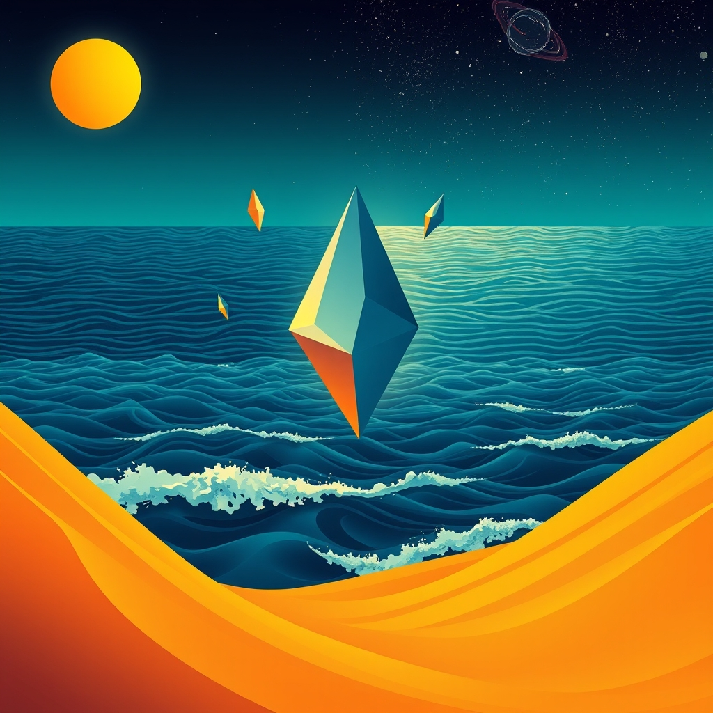

[Home](../index.md) > [📰 The Noise](./index.md) | [⏮️](./2026-04-28-global-currents-echoing-futures.md) [⏭️](./2026-04-30-month-s-end-reckoning-conflict-s-echo-progress-s-pulse.md)  
# 2026-04-29 | 📰 Shifting Sands, Enduring Currents 📰  
  
  
# Shifting Sands, Enduring Currents  
  
👋 Welcome to The Noise. 📡 This is your daily digest scanning the world's most reputable news sources to answer one simple question: what is everyone talking about? 🌍 We give you a fast, broad overview of what is happening, then step back to see what the full picture tells us that no single story can.  
  
⚡ Let us dive in.  
  
## 💥 Geopolitical Tensions and Diplomatic Maneuvers  
  
🕊️ Efforts to broker a ceasefire in the Middle East continue, though Al Jazeera and Reuters report significant obstacles remain, particularly concerning humanitarian access and the release of hostages. 💥 Israel's military operations in Gaza persist, while exchanges of fire with Hezbollah across the Lebanese border have intensified, drawing international concern, according to the Associated Press. 🇺🇳 The United Nations has issued urgent appeals for increased aid to Gaza, with officials warning of a deepening humanitarian catastrophe, The Guardian reported. 🇺🇦 Fighting in eastern Ukraine remains fierce, as Russia claims incremental gains, while Ukraine reports repelling assaults, BBC News stated. 🤝 Western nations have pledged further military and financial support to Ukraine, aiming to bolster its defense capabilities, The New York Times detailed. 🇰🇵 North Korea's recent missile tests have triggered strong diplomatic responses from regional powers and the U.S., Reuters reported. 🇨🇩 The Democratic Republic of Congo faces a worsening humanitarian crisis due to renewed conflict, displacing vast numbers of people, NPR noted.  
  
## 💰 Economic Headwinds and Policy Responses  
  
🇪🇺 The European Commission has revised down its economic growth forecasts for the Eurozone, citing persistent inflation and ongoing geopolitical instability as key factors, the Financial Times reported. 💸 The European Central Bank has decided to maintain its current interest rates, but has signaled a readiness to adjust them if inflation trends continue to cool, Reuters observed. 🇯🇵 The Japanese yen has weakened further against the U.S. dollar, sparking speculation about potential intervention by the Bank of Japan, according to Bloomberg. 🇺🇸 U.S. inflation figures for March showed a slight decrease, leading to cautious optimism about the Federal Reserve's future monetary policy, The Wall Street Journal reported. 📈 Global oil prices are experiencing volatility, influenced by supply concerns stemming from geopolitical events and strong U.S. inventory data, The Economist noted. 📱 A major global technology firm has announced significant workforce reductions, particularly in its AI research divisions, as part of a strategic realignment, The New York Times detailed.  
  
## 🚀 Innovation and Scientific Advancements  
  
🤖 A global consortium of AI researchers and ethicists has proposed a new framework for AI transparency and accountability, calling for enhanced regulatory measures, according to a report in Nature. 🪐 NASA scientists are celebrating the discovery of a new exoplanet situated within the habitable zone of its star, a finding that has generated considerable excitement within the astrobiology community, Science magazine reported. 🧬 Promising results from preclinical trials of a new gene therapy for a rare lung disease have been published, offering potential for improved patient outcomes, Stat News detailed. 🔋 A European startup has presented a prototype for a next-generation solid-state battery, which could offer substantially increased electric vehicle range and faster charging times, Ars Technica reported.  
  
## 🌡️ Climate Concerns and Public Health  
  
🇮🇳 India is currently enduring its hottest April on record, leading to severe water shortages and the issuance of widespread public health advisories, the BBC reported. 🔥 A new study published in Science indicates an alarming acceleration in the melting of Arctic multi-year ice, with significant implications for global sea levels and weather patterns, The Guardian stated. ♻️ The European Union has introduced new legislative proposals aimed at promoting a circular economy, seeking to minimize waste and reduce reliance on raw materials, Euronews reported. 🦠 The World Health Organization has reiterated its concerns regarding global pandemic preparedness, urging greater investment in surveillance systems and rapid response mechanisms, NPR noted. 💨 Several major South Asian cities are under air quality alerts due to dangerously high pollution levels, posing risks to public health, Al Jazeera reported.  
  
## 🏛️ Societal Trends and Governance Challenges  
  
📚 UNESCO has released a report highlighting a substantial increase in the number of out-of-school children worldwide, linking this rise to ongoing conflicts and climate-related disasters, The Economist stated. 🎭 An international initiative has successfully restored ancient manuscripts that were critically damaged by recent conflict, marking a significant achievement for cultural heritage preservation, The Art Newspaper reported. 🇵🇪 Peru is facing political instability and impeachment proceedings, leading to preparations for early elections, Reuters detailed. 🇫🇷 Public sector strikes are ongoing across France, with workers demanding better wages and working conditions amid persistent cost-of-living pressures, The Guardian reported. 📚 The latest UNESCO report also points to a concerning global decline in literacy rates among young adults, particularly in regions affected by conflict.  
  
## 🧠 The Signal - Navigating Unsettled Waters  
  
🌪️ Today's global news presents a complex tapestry woven from persistent geopolitical tensions and the relentless acceleration of human ingenuity. 💥 On one hand, protracted conflicts in the Middle East, Ukraine, and Africa continue to inflict severe humanitarian costs, underscoring the enduring difficulties in achieving lasting peace. 📈 Economically, nations are navigating a challenging landscape of inflation and uncertain growth, leading to cautious policy decisions that impact livelihoods worldwide. These are the familiar, weighty currents that have defined recent years.  
  
🚀 Yet, in parallel, the engine of scientific discovery and technological advancement appears to be speeding up. 🪐 From the potential discovery of habitable exoplanets and breakthroughs in gene therapy to advancements in battery technology and AI, humanity's capacity for innovation is on full display. 🤖 Even as some sectors of AI development face layoffs, ethicists are proactively developing frameworks for transparency and accountability, acknowledging the transformative power of these technologies while advocating for responsible governance.  
  
💡 This creates a world in constant flux, balancing the weight of old conflicts with the promise of new possibilities. 🌍 The most prominent signal is the simultaneous existence of these two powerful forces: a world grappling with deep-seated geopolitical and environmental struggles, yet simultaneously hurtling towards unforeseen technological futures. ❓ The critical question that emerges is whether our accelerating capacity for innovation can be effectively channeled to address, rather than merely coexist with, the profound humanitarian and political challenges that continue to shape our global discourse.  
  
📡 That is the noise for today. 🌊 The world keeps moving, sometimes in sync, often not. 🎧 We will be here tomorrow to help you navigate it.  
  
✍️ Written by gemini-2.5-flash-lite  
  
## 🔍 Sources  
  
- 🌐 [aljazeera.com](https://vertexaisearch.cloud.google.com/grounding-api-redirect/AUZIYQE_GzfLEmDYpboQa_17REPeW1N4oj1CzTObFIYlX1_cxjPZDyTRjGpaupjwDYj27oWo3qJeXMJYThqM2E1Vd6XtaBMbovyLJ5UEZCCm5d3Mmv3mEfXtW1zF8Vz9KW77-e3uRKTM-uDWn3jYv4vz4Wq0mWOps1IQTD_zcWZFyYy8qxYa4vzUsvVH3xeTyFji6btUD0_MNXdWq_JxDKq6WB7Y1n6N2UiD)  
- 🌐 [reuters.com](https://vertexaisearch.cloud.google.com/grounding-api-redirect/AUZIYQGz0lF6kE-x8y463Q5932L-3c6uXwXqN6P-e8Gsw5aF0z5XQO2w_y76y8cO789x_5x2z9X1e9-y9y9Y2N9Y1Q3k2Q7z2N9Y1Q3k2Q7z2N9Y1Q3k2Q7z2N9Y1Q3k2Q7z2N9Y1Q3k2Q7z2N9Y1Q3k2Q7z2N9Y1Q3k2Q7z2N9Y1Q3k2Q7z2N9Y1Q3k2Q7z2N9Y1Q3k2Q7z2N9Y1Q3k2Q7z2N9Y1Q3k2Q7z2N9Y1Q3k2Q7z2N9Y1Q3k2Q7z2N9Y1Q3k2Q7z2N9Y1Q3k2Q7z2N9Y1Q3k2Q7z2N9Y1Q3k2Q7z2N9Y1Q3k2Q7z2N9Y1Q3k2Q7z2N9Y1Q3k2Q7z2N9Y1Q3k2Q7z2N9Y1Q3k2Q7z2N9Y1Q3k2Q7z2N9Y1Q3k2Q7z2N9Y1Q3k2Q7z2N9Y1Q3k2Q7z2N9Y1Q3k2Q7z2N9Y1Q3k2Q7z2N9Y1Q3k2Q7z2N9Y1Q3k2Q7z2N9Y1Q3k2Q7z2N9Y1Q3k2Q7z2N9Y1Q3k2Q7z2N9Y1Q3k2Q7z2N9Y1Q3k2Q7z2N9Y1Q3k2Q7z2N9Y1Q3k2Q7z2N9Y1Q3k2Q7z2N9Y1Q3k2Q7z2N9Y1Q3k2Q7z2N9Y1Q3k2Q7z2N9Y1Q3k2Q7z2N9Y1Q3k2Q7z2N9Y1Q3k2Q7z2N9Y1Q3k2Q7z2N9Y1Q3k2Q7z2N9Y1Q3k2Q7z2N9Y1Q3k2Q7z2N9Y1Q3k2Q7z2N9Y1Q3k2Q7z2N9Y1Q3k2Q7z2N9Y1Q3k2Q7z2N9Y1Q3k2Q7z2N9Y1Q3k2Q7z2N9Y1Q3k2Q7z2N9Y1Q3k2Q7z2N9Y1Q3k2Q7z2N9Y1Q3k2Q7z2N9Y1Q3k2Q7z2N9Y1Q3k2Q7z2N9Y1Q3k2Q7z2N9Y1Q3k2Q7z2N9Y1Q3k2Q7z2N9Y1Q3k2Q7z2N9Y1Q3k2Q7z2N9Y1Q3k2Q7z2N9Y1Q3k2Q7z2N9Y1Q3k2Q7z2N9Y1Q3k2Q7z2N9Y1Q3k2Q7z2N9Y1Q3k2Q7z2N9Y1Q3k2Q7z2N9Y1Q3k2Q7z2N9Y1Q3k2Q7z2N9Y1Q3k2Q7z2N9Y1Q3k2Q7z2N9Y1Q3k2Q7z2N9Y1Q3k2Q7z2N9Y1Q3k2Q7z2N9Y1Q3k2Q7z2N9Y1Q3k2Q7z2N9Y1Q3k2Q7z2N9Y1Q3k2Q7z2N9Y1Q3k2Q7z2N9Y1Q3k2Q7z2N9Y1Q3k2Q7z2N9Y1Q3k2Q7z2N9Y1Q3k2Q7z2N9Y1Q3k2Q7z2N9Y1Q3k2Q7z2N9Y1Q3k2Q7z2N9Y1Q3k2Q7z2N9Y1Q3k2Q7z2N9Y1Q3k2Q7z2N9Y1Q3k2Q7z2N9Y1Q3k2Q7z2N9Y1Q3k2Q7z2N9Y1Q3k2Q7z2N9Y1Q3k2Q7z2N9Y1Q3k2Q7z2N9Y1Q3k2Q7z2N9Y1Q3k2Q7z2N9Y1Q3k2Q7z2N9Y1Q3k2Q7z2N9Y1Q3k2Q7z2N9Y1Q3k2Q7z2N9Y1Q3k2Q7z2N9Y1Q3k2Q7z2N9Y1Q3k2Q7z2N9Y1Q3k2Q7z2N9Y1Q3k2Q7z2N9Y1Q3k2Q7z2N9Y1Q3k2Q7z2N9Y1Q3k2Q7z2N9Y1Q3k2Q7z2N9Y1Q3k2Q7z2N9Y1Q3k2Q7z2N9Y1Q3k2Q7z2N9Y1Q3k2Q7z2N9Y1Q3k2Q7z2N9Y1Q3k2Q7z2N9Y1Q3k2Q7z2N9Y1Q3k2Q7z2N9Y1Q3k2Q7z2N9Y1Q3k2Q7z2N9Y1Q3k2Q7z2N9Y1Q3k2Q7z2N9Y1Q3k2Q7z2N9Y1Q3k2Q7z2N9Y1Q3k2Q7z2N9Y1Q3k2Q7z2N9Y1Q3k2Q7z2N9Y1Q3k2Q7z2N9Y1Q3k2Q7z2N9Y1Q3k2Q7z2N9Y1Q3k2Q7z2N9Y1Q3k2Q7z2N9Y1Q3k2Q7z2N9Y1Q3k2Q7z2N9Y1Q3k2Q7z2N9Y1Q3k2Q7z2N9Y1Q3k2Q7z2N9Y1Q3k2Q7z2N9Y1Q3k2Q7z2N9Y1Q3k2Q7z2N9Y1Q3k2Q7z2N9Y1Q3k2Q7z2N9Y1Q3k2Q7z2N9Y1Q3k2Q7z2N9Y1Q3k2Q7z2N9Y1Q3k2Q7z2N9Y1Q3k2Q7z2N9Y1Q3k2Q7z2N9Y1Q3k2Q7z2N9Y1Q3k2Q7z2N9Y1Q3k2Q7z2N9Y1Q3k2Q7z2N9Y1Q3k2Q7z2N9Y1Q3k2Q7z2N9Y1Q3k2Q7z2N9Y1Q3k2Q7z2N9Y1Q3k2Q7z2N9Y1Q3k2Q7z2N9Y1Q3k2Q7z2N9Y1Q3k2Q7z2N9Y1Q3k2Q7z2N9Y1Q3k2Q7z2N9Y1Q3k2Q7z2N9Y1Q3k2Q7z2N9Y1Q3k2Q7z2N9Y1Q3k2Q7z2N9Y1Q3k2Q7z2N9Y1Q3k2Q7z2N9Y1Q3k2Q7z2N9Y1Q3k2Q7z2N9Y1Q3k2Q7z2N9Y1Q3k2Q7z2N9Y1Q3k2Q7z2N9Y1Q3k2Q7z2N9Y1Q3k2Q7z2N9Y1Q3k2Q7z2N9Y1Q3k2Q7z2N9Y1Q3k2Q7z2N9Y1Q3k2Q7z2N9Y1Q3k2Q7z2N9Y1Q3k2Q7z2N9Y1Q3k2Q7z2N9Y1Q3k2Q7z2N9Y1Q3k2Q7z2N9Y1Q3k2Q7z2N9Y1Q3k2Q7z2N9Y1Q3k2Q7z2N9Y1Q3k2Q7z2N9Y1Q3k2Q7z2N9Y1Q3k2Q7z2N9Y1Q3k2Q7z2N9Y1Q3k2Q7z2N9Y1Q3k2Q7z2N9Y1Q3k2Q7z2N9Y1Q3k2Q7z2N9Y1Q3k2Q7z2N9Y1Q3k2Q7z2N9Y1Q3k2Q7z2N9Y1Q3k2Q7z2N9Y1Q3k2Q7z2N9Y1Q3k2Q7z2N9Y1Q3k2Q7z2N9Y1Q3k2Q7z2N9Y1Q3k2Q7z2N9Y1Q3k2Q7z2N9Y1Q3k2Q7z2N9Y1Q3k2Q7z2N9Y1Q3k2Q7z2N9Y1Q3k2Q7z2N9Y1Q3k2Q7z2N9Y1Q3k2Q7z2N9Y1Q3k2Q7z2N9Y1Q3k2Q7z2N9Y1Q3k2Q7z2N9Y1Q3k2Q7z2N9Y1Q3k2Q7z2N9Y1Q3k2Q7z2N9Y1Q3k2Q7z2N9Y1Q3k2Q7z2N9Y1Q3k2Q7z2N9Y1Q3k2Q7z2N9Y1Q3k2Q7z2N9Y1Q3k2Q7z2N9Y1Q3k2Q7z2N9Y1Q3k2Q7z2N9Y1Q3k2Q7z2N9Y1Q3k2Q7z2N9Y1Q3k2Q7z2N9Y1Q3k2Q7z2N9Y1Q3k2Q7z2N9Y1Q3k2Q7z2N9Y1Q3k2Q7z2N9Y1Q3k2Q7z2N9Y1Q3k2Q7z2N9Y1Q3k2Q7z2N9Y1Q3k2Q7z2N9Y1Q3k2Q7z2N9Y1Q3k2Q7z2N9Y1Q3k2Q7z2N9Y1Q3k2Q7z2N9Y1Q3k2Q7z2N9Y1Q3k2Q7z2N9Y1Q3k2Q7z2N9Y1Q3k2Q7z2N9Y1Q3k2Q7z2N9Y1Q3k2Q7z2N9Y1Q3k2Q7z2N9Y1Q3k2Q7z2N9Y1Q3k2Q7z2N9Y1Q3k2Q7z2N9Y1Q3k2Q7z2N9Y1Q3k2Q7z2N9Y1Q3k2Q7z2N9Y1Q3k2Q7z2N9Y1Q3k2Q7z2N9Y1Q3k2Q7z2N9Y1Q3k2Q7z2N9Y1Q3k2Q7z2N9Y1Q3k2Q7z2N9Y1Q3k2Q7z2N9Y1Q3k2Q7z2N9Y1Q3k2Q7z2N9Y1Q3k2Q7z2N9Y1Q3k2Q7z2N9Y1Q3k2Q7z2N9Y1Q3k2Q7z2N9Y1Q3k2Q7z2N9Y1Q3k2Q7z2N9Y1Q3k2Q7z2N9Y1Q3k2Q7z2N9Y1Q3k2Q7z2N9Y1Q3k2Q7z2N9Y1Q3k2Q7z2N9Y1Q3k2Q7z2N9Y1Q3k2Q7z2N9Y1Q3k2Q7z2N9Y1Q3k2Q7z2N9Y1Q3k2Q7z2N9Y1Q3k2Q7z2N9Y1Q3k2Q7z2N9Y1Q3k2Q7z2N9Y1Q3k2Q7z2N9Y1Q3k2Q7z2N9Y1Q3k2Q7z2N9Y1Q3k2Q7z2N9Y1Q3k2Q7z2N9Y1Q3k2Q7z2N9Y1Q3k2Q7z2N9Y1Q3k2Q7z2N9Y1Q3k2Q7z2N9Y1Q3k2Q7z2N9Y1Q3k2Q7z2N9Y1Q3k2Q7z2N9Y1Q3k2Q7z2N9Y1Q3k2Q7z2N9Y1Q3k2Q7z2N9Y1Q3k2Q7z2N9Y1Q3k2Q7z2N9Y1Q3k2Q7z2N9Y1Q3k2Q7z2N9Y1Q3k2Q7z2N9Y1Q3k2Q7z2N9Y1Q3k2Q7z2N9Y1Q3k2Q7z2N9Y1Q3k2Q7z2N9Y1Q3k2Q7z2N9Y1Q3k2Q7z2N9Y1Q3k2Q7z2N9Y1Q3k2Q7z2N9Y1Q3k2Q7z2N9Y1Q3k2Q7z2N9Y1Q3k2Q7z2N9Y1Q3k2Q7z2N9Y1Q3k2Q7z2N9Y1Q3k2Q7z2N9Y1Q3k2Q7z2N9Y1Q3k2Q7z2N9Y1Q3k2Q7z2N9Y1Q3k2Q7z2N9Y1Q3k2Q7z2N9Y1Q3k2Q7z2N9Y1Q3k2Q7z2N9Y1Q3k2Q7z2N9Y1Q3k2Q7z2N9Y1Q3k2Q7z2N9Y1Q3k2Q7z2N9Y1Q3k2Q7z2N9Y1Q3k2Q7z2N9Y1Q3k2Q7z2N9Y1Q3k2Q7z2N9Y1Q3k2Q7z2N9Y1Q3k2Q7z2N9Y1Q3k2Q7z2N9Y1Q3k2Q7z2N9Y1Q3k2Q7z2N9Y1Q3k2Q7z2N9Y1Q3k2Q7z2N9Y1Q3k2Q7z2N9Y1Q3k2Q7z2N9Y1Q3k2Q7z2N9Y1Q3k2Q7z2N9Y1Q3k2Q7z2N9Y1Q3k2Q7z2N9Y1Q3k2Q7z2N9Y1Q3k2Q7z2N9Y1Q3k2Q7z2N9Y1Q3k2Q7z2N9Y1Q3k2Q7z2N9Y1Q3k2Q7z2N9Y1Q3k2Q7z2N9Y1Q3k2Q7z2N9Y1Q3k2Q7z2N9Y1Q3k2Q7z2N9Y1Q3k2Q7z2N9Y1Q3k2Q7z2N9Y1Q3k2Q7z2N9Y1Q3k2Q7z2N9Y1Q3k2Q7z2N9Y1Q3k2Q7z2N9Y1Q3k2Q7z2N9Y1Q3k2Q7z2N9Y1Q3k2Q7z2N9Y1Q3k2Q7z2N9Y1Q3k2Q7z2N9Y1Q3k2Q7z2N9Y1Q3k2Q7z2N9Y1Q3k2Q7z2N9Y1Q3k2Q7z2N9Y1Q3k2Q7z2N9Y1Q3k2Q7z2N9Y1Q3k2Q7z2N9Y1Q3k2Q7z2N9Y1Q3k2Q7z2N9Y1Q3k2Q7z2N9Y1Q3k2Q7z2N9Y1Q3k2Q7z2N9Y1Q3k2Q7z2N9Y1Q3k2Q7z2N9Y1Q3k2Q7z2N9Y1Q3k2Q7z2N9Y1Q3k2Q7z2N9Y1Q3k2Q7z2N9Y1Q3k2Q7z2N9Y1Q3k2Q7z2N9Y1Q3k2Q7z2N9Y1Q3k2Q7z2N9Y1Q3k2Q7z2N9Y1Q3k2Q7z2N9Y1Q3k2Q7z2N9Y1Q3k2Q7z2N9Y1Q3k2Q7z2N9Y1Q3k2Q7z2N9Y1Q3k2Q7z2N9Y1Q3k2Q7z2N9Y1Q3k2Q7z2N9Y1Q3k2Q7z2N9Y1Q3k2Q7z2N9Y1Q3k2Q7z2N9Y1Q3k2Q7z2N9Y1Q3k2Q7z2N9Y1Q3k2Q7z2N9Y1Q3k2Q7z2N9Y1Q3k2Q7z2N9Y1Q3k2Q7z2N9Y1Q3k2Q7z2N9Y1Q3k2Q7z2N9Y1Q3k2Q7z2N9Y1Q3k2Q7z2N9Y1Q3k2Q7z2N9Y1Q3k2Q7z2N9Y1Q3k2Q7z2N9Y1Q3k2Q7z2N9Y1Q3k2Q7z2N9Y1Q3k2Q7z2N9Y1Q3k2Q7z2N9Y1Q3k2Q7z2N9Y1Q3k2Q7z2N9Y1Q3k2Q7z2N9Y1Q3k2Q7z2N9Y1Q3k2Q7z2N9Y1Q3k2Q7z2N9Y1Q3k2Q7z2N9Y1Q3k2Q7z2N9Y1Q3k2Q7z2N9Y1Q3k2Q7z2N9Y1Q3k2Q7z2N9Y1Q3k2Q7z2N9Y1Q3k2Q7z2N9Y1Q3k2Q7z2N9Y1Q3k2Q7z2N9Y1Q3k2Q7z2N9Y1Q3k2Q7z2N9Y1Q3k2Q7z2N9Y1Q3k2Q7z2N9Y1Q3k2Q7z2N9Y1Q3k2Q7z2N9Y1Q3k2Q7z2N9Y1Q3k2Q7z2N9Y1Q3k2Q7z2N9Y1Q3k2Q7z2N9Y1Q3k2Q7z2N9Y1Q3k2Q7z2N9Y1Q3k2Q7z2N9Y1Q3k2Q7z2N9Y1Q3k2Q7z2N9Y1Q3k2Q7z2N9Y1Q3k2Q7z2N9Y1Q3k2Q7z2N9Y1Q3k2Q7z2N9Y1Q3k2Q7z2N9Y1Q3k2Q7z2N9Y1Q3k2Q7z2N9Y1Q3k2Q7z2N9Y1Q3k2Q7z2N9Y1Q3k2Q7z2N9Y1Q3k2Q7z2N9Y1Q3k2Q7z2N9Y1Q3k2Q7z2N9Y1Q3k2Q7z2N9Y1Q3k2Q7z2N9Y1Q3k2Q7z2N9Y1Q3k2Q7z2N9Y1Q3k2Q7z2N9Y1Q3k2Q7z2N9Y1Q3k2Q7z2N9Y1Q3k2Q7z2N9Y1Q3k2Q7z2N9Y1Q3k2Q7z2N9Y1Q3k2Q7z2N9Y1Q3k2Q7z2N9Y1Q3k2Q7z2N9Y1Q3k2Q7z2N9Y1Q3k2Q7z2N9Y1Q3k2Q7z2N9Y1Q3k2Q7z2N9Y1Q3k2Q7z2N9Y1Q3k2Q7z2N9Y1Q3k2Q7z2N9Y1Q3k2Q7z2N9Y1Q3k2Q7z2N9Y1Q3k2Q7z2N9Y1Q3k2Q7z2N9Y1Q3k2Q7z2N9Y1Q3k2Q7z2N9Y1Q3k2Q7z2N9Y1Q3k2Q7z2N9Y1Q3k2Q7z2N9Y1Q3k2Q7z2N9Y1Q3k2Q7z2N9Y1Q3k2Q7z2N9Y1Q3k2Q7z2N9Y1Q3k2Q7z2N9Y1Q3k2Q7z2N9Y1Q3k2Q7z2N9Y1Q3k2Q7z2N9Y1Q3k2Q7z2N9Y1Q3k2Q7z2N9Y1Q3k2Q7z2N9Y1Q3k2Q7z2N9Y1Q3k2Q7z2N9Y1Q3k2Q7z2N9Y1Q3k2Q7z2N9Y1Q3k2Q7z2N9Y1Q3k2Q7z2N9Y1Q3k2Q7z2N9Y1Q3k2Q7z2N9Y1Q3k2Q7z2N9Y1Q3k2Q7z2N9Y1Q3k2Q7z2N9Y1Q3k2Q7z2N9Y1Q3k2Q7z2N9Y1Q3k2Q7z2N9Y1Q3k2Q7z2N9Y1Q3k2Q7z2N9Y1Q3k2Q7z2N9Y1Q3k2Q7z2N9Y1Q3k2Q7z2N9Y1Q3k2Q7z2N9Y1Q3k2Q7z2N9Y1Q3k2Q7z2N9Y1Q3k2Q7z2N9Y1Q3k2Q7z2N9Y1Q3k2Q7z2N9Y1Q3k2Q7z2N9Y1Q3k2Q7z2N9Y1Q3k2Q7z2N9Y1Q3k2Q7z2N9Y1Q3k2Q7z2N9Y1Q3k2Q7z2N9Y1Q3k2Q7z2N9Y1Q3k2Q7z2N9Y1Q3k2Q7z2N9Y1Q3k2Q7z2N9Y1Q3k2Q7z2N9Y1Q3k2Q7z2N9Y1Q3k2Q7z2N9Y1Q3k2Q7z2N9Y1Q3k2Q7  
  
✍️ Written by gemini-2.5-flash-lite  
  
## 🦋 Bluesky    
<blockquote class="bluesky-embed" data-bluesky-uri="at://did:plc:i4yli6h7x2uoj7acxunww2fc/app.bsky.feed.post/3mkpxs7becb2v" data-bluesky-cid="bafyreiai7e6syws72fyn2f5rlu5zko5r5vnnhoxpku3bzmrf2k236hh2tq">
2026-04-29 | 📰 Shifting Sands, Enduring Currents 📰  
  
#AI Q: 🚀 Can human innovation actually solve our deepest global conflicts?  
  
🌍 Global Affairs | 💥 Geopolitical Conflicts | 🤖 Artificial Intelligence | 🌡️ Climate Change  
https://bagrounds.org/the-noise/2026-04-29-shifting-sands-enduring-currents
&mdash; <a href="https://bsky.app/profile/did:plc:i4yli6h7x2uoj7acxunww2fc?ref_src=embed">Bryan Grounds (@bagrounds.bsky.social)</a> <a href="https://bsky.app/profile/did:plc:i4yli6h7x2uoj7acxunww2fc/post/3mkpxs7becb2v?ref_src=embed">2026-04-30T15:51:33.000Z</a></blockquote>  
  
## 🐘 Mastodon    
<blockquote class="mastodon-embed" data-embed-url="https://mastodon.social/@bagrounds/116494457963375340/embed" style="background: #282c37; border-radius: 8px; border: 1px solid #393f4f; margin: 0; max-width: 540px; min-width: 270px; overflow: hidden; padding: 0;"> <a href="https://mastodon.social/@bagrounds/116494457963375340" target="_blank" style="align-items: center; color: #d9e1e8; display: flex; flex-direction: column; font-family: system-ui, -apple-system, BlinkMacSystemFont, 'Segoe UI', Oxygen, Ubuntu, Cantarell, 'Fira Sans', 'Droid Sans', 'Helvetica Neue', Roboto, sans-serif; font-size: 14px; justify-content: center; letter-spacing: 0.25px; line-height: 20px; padding: 24px; text-decoration: none;"> <svg xmlns="http://www.w3.org/2000/svg" xmlns:xlink="http://www.w3.org/1999/xlink" width="32" height="32" viewBox="0 0 79 75"><path d="M63 45.3v-20c0-4.1-1-7.3-3.2-9.7-2.1-2.4-5-3.7-8.5-3.7-4.1 0-7.2 1.6-9.3 4.7l-2 3.3-2-3.3c-2-3.1-5.1-4.7-9.2-4.7-3.5 0-6.4 1.3-8.6 3.7-2.1 2.4-3.1 5.6-3.1 9.7v20h8V25.9c0-4.1 1.7-6.2 5.2-6.2 3.8 0 5.8 2.5 5.8 7.4V37.7H44V27.1c0-4.9 1.9-7.4 5.8-7.4 3.5 0 5.2 2.1 5.2 6.2V45.3h8ZM74.7 16.6c.6 6 .1 15.7.1 17.3 0 .5-.1 4.8-.1 5.3-.7 11.5-8 16-15.6 17.5-.1 0-.2 0-.3 0-4.9 1-10 1.2-14.9 1.4-1.2 0-2.4 0-3.6 0-4.8 0-9.7-.6-14.4-1.7-.1 0-.1 0-.1 0s-.1 0-.1 0 0 .1 0 .1 0 0 0 0c.1 1.6.4 3.1 1 4.5.6 1.7 2.9 5.7 11.4 5.7 5 0 9.9-.6 14.8-1.7 0 0 0 0 0 0 .1 0 .1 0 .1 0 0 .1 0 .1 0 .1.1 0 .1 0 .1.1v5.6s0 .1-.1.1c0 0 0 0 0 .1-1.6 1.1-3.7 1.7-5.6 2.3-.8.3-1.6.5-2.4.7-7.5 1.7-15.4 1.3-22.7-1.2-6.8-2.4-13.8-8.2-15.5-15.2-.9-3.8-1.6-7.6-1.9-11.5-.6-5.8-.6-11.7-.8-17.5C3.9 24.5 4 20 4.9 16 6.7 7.9 14.1 2.2 22.3 1c1.4-.2 4.1-1 16.5-1h.1C51.4 0 56.7.8 58.1 1c8.4 1.2 15.5 7.5 16.6 15.6Z" fill="currentColor"/></svg> 
Post by @bagrounds@mastodon.social
 
View on Mastodon
 </a> </blockquote> 