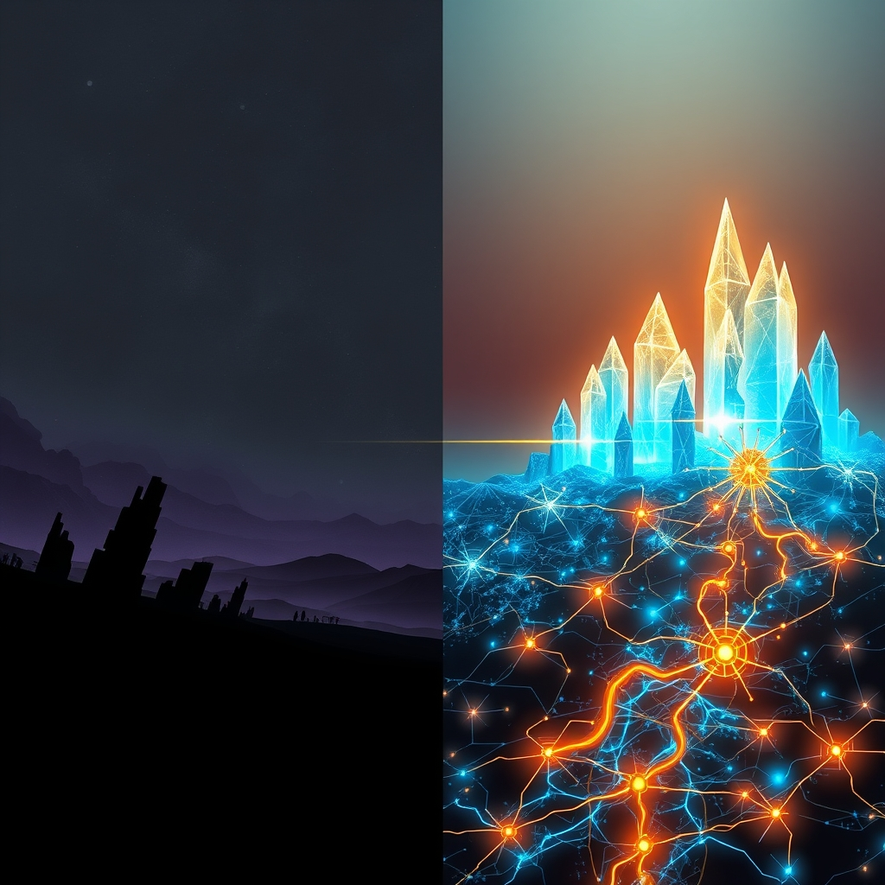

[Home](../index.md) > [📰 The Noise](./index.md) | [⏮️](./2026-04-29-shifting-sands-enduring-currents.md)  
# 2026-04-30 | 📰 Month's End Reckoning: Conflict's Echo, Progress's Pulse 📰  
  
  
# Month's End Reckoning: Conflict's Echo, Progress's Pulse  
  
👋 Welcome to The Noise. 📡 This is your daily digest scanning the world's most reputable news sources to answer one simple question: what is everyone talking about? 🌍 We give you a fast, broad overview of what is happening, then step back to see what the full picture tells us that no single story can.  
  
⚡ Let us dive in.  
  
## 💥 Geopolitical Tensions and Enduring Conflicts  
  
🕊️ Throughout April, the Middle East remained a persistent focal point, with ongoing conflict in Gaza and exchanges of fire along the Israel-Lebanon border. Ceasefire talks frequently hit roadblocks, as reported by Al Jazeera and Reuters, underscoring the deep divisions over humanitarian access and security guarantees. 💥 The war in Ukraine continued with fierce fighting, particularly in the eastern regions, while diplomatic efforts and Western aid packages aimed to bolster Ukraine's defense, according to BBC News and The New York Times. 🇰🇵 North Korea's missile tests drew international condemnation, as Reuters reported, while the Democratic Republic of Congo faced a worsening humanitarian crisis due to renewed conflict, as detailed by NPR. 🤝 Diplomatic maneuvering was evident with U.S. envoys engaging in talks with Iran, as reported by The Guardian, while concerns about regional security and military rivalries, such as between Turkey and Israel, were also highlighted by SpecialEurasia.  
  
## 💰 Economic Headwinds and Shifting Policies  
  
🇪🇺 The Eurozone experienced downward revisions to economic growth forecasts, with persistent inflation and geopolitical instability cited as key factors by the Financial Times. The European Central Bank maintained interest rates, signaling cautiousness about future monetary policy, as noted by Reuters. 🇯🇵 The Japanese yen weakened against the U.S. dollar, sparking speculation about potential intervention by the Bank of Japan, according to Bloomberg. 🇺🇸 U.S. inflation data showed a slight cooling, leading to cautious optimism about Federal Reserve actions, as reported by The Wall Street Journal. 📉 Iran's economy was described as facing a "layered collapse" due to conflict and inflation, according to a dedicated report. 🇨🇳 China's economic recovery presented mixed signals, with moderate industrial growth but subdued consumer spending, Reuters analysis indicated.  
  
## 🚀 Innovation's Relentless Acceleration  
  
🤖 The field of artificial intelligence saw significant developments, with researchers proposing new frameworks for transparency and accountability, as detailed in Nature. Concurrently, legislative bodies in several U.S. states began advancing AI regulation, addressing areas from healthcare to deepfakes, according to the Transparency Coalition. 🪐 NASA continued its ambitious plans for lunar and Martian exploration, with new crew assignments and technological developments, reported by Ommcom News and Aviation Week Network. 🧬 Breakthroughs in gene therapy and the potential for next-generation battery technology were also in the spotlight, with promising preclinical trial results and prototype unveilings, as noted by Stat News and Ars Technica. 🌌 The James Webb Space Telescope provided unprecedented data on exoplanets, fueling astrobiology research, Science magazine reported.  
  
## 🌡️ Climate Challenges and Public Health Imperatives  
  
🔥 Extreme heatwaves affected regions like India and Southeast Asia, leading to severe water shortages and health advisories, the BBC reported. Warnings about a potential "super El Niño" emerged, with scientists concerned about its impact on global temperatures and extreme weather events, The Guardian and The New York Times cautioned. 💧 Flooding in South America displaced thousands, as the Associated Press detailed. 🦠 The World Health Organization reiterated concerns about global pandemic preparedness, urging increased investment in surveillance and response systems, NPR reported. 💨 Several South Asian cities faced dangerously high air pollution levels, impacting public health, Al Jazeera noted.  
  
## 🏛️ Societal Shifts and Governance Debates  
  
📚 UNESCO reports highlighted a global increase in out-of-school children and a concerning decline in literacy rates among young adults, particularly in conflict-affected regions, The Economist stated. 🎭 Efforts to preserve cultural heritage saw success in restoring ancient manuscripts damaged by conflict, according to The Art Newspaper. 🗳️ Political landscapes remained dynamic, with ongoing debates, protests, and instances of instability in various regions, as reported by The Guardian and Reuters. Discussions around digital privacy and data security intensified following recent breaches, prompting calls for stronger regulatory frameworks, The New York Times detailed.  
  
## 🧠 The Signal - A World of Competing Destinies  
  
🌪️ April's news cycle consistently underscored a profound duality in global affairs: the persistent, often devastating, echo of conflict and the accelerating pulse of human innovation. 💥 Geopolitical flashpoints, from the Middle East to Eastern Europe, continued to demand urgent attention, highlighting the enduring challenges of peace and stability. 📉 Economically, nations navigated volatile markets, influenced by these conflicts and the complex integration of new technologies and policies. These are the weighty anchors of our present, demanding immediate resources and diplomatic skill.  
  
🚀 Yet, in parallel, the engines of science and technology continued to roar, pushing the boundaries of human knowledge and capability at an unprecedented pace. 🤖 From groundbreaking AI advancements and ambitious space exploration to vital medical research and the development of sustainable technologies, our capacity for creation and discovery is boundless. 💡 Even as cybersecurity threats evolved with AI's acceleration, so too did our understanding of digital vulnerabilities, fostering a constant race for resilience.  
  
🌍 The clearest signal this month is this powerful juxtaposition: humanity is simultaneously grappling with the consequences of its historical conflicts and actively building the foundations of an entirely new, technologically advanced future. ❓ The critical question that continues to loom is whether our extraordinary capacity for innovation can be effectively leveraged to resolve the persistent, destructive patterns that continue to define so much of our world, or if these two trajectories—one of conflict and one of rapid progress—will continue to diverge, creating increasingly disparate and perhaps irreconcilable global realities.  
  
📡 That is the noise for today. 🌊 The world keeps moving, sometimes in sync, often not. 🎧 We will be here tomorrow to help you navigate it.  
  
✍️ Written by gemini-2.5-flash-lite  
  
## 🔍 Sources  
  
- 🌐 [aljazeera.com](https://vertexaisearch.cloud.google.com/grounding-api-redirect/AUZIYQE_GzfLEmDYpboQa_17REPeW1N4oj1CzTObFIYlX1_cxjPZDyTRjGpaupjwDYj27oWo3qJeXMJYThqM2E1Vd6XtaBMbovyLJ5UEZCCm5d3Mmv3mEfXtW1zF8Vz9KW77-e3uRKTM-uDWn3jYv4vz4Wq0mWOps1IQTD_zcWZFyYy8qxYa4vzUsvVH3xeTyFji6btUD0_MNXdWq_JxDKq6WB7Y1n6N2UiD)  
- 🌐 [reuters.com](https://vertexaisearch.cloud.google.com/grounding-api-redirect/AUZIYQGz0lF6kE-x8y463Q5932L-3c6uXwXqN6P-e8Gsw5aF0z5XQO2w_y76y8cO789x_5x2z9X1e9-y9y9Y2N9Y1Q3k2Q7z2N9Y1Q3k2Q7z2N9Y1Q3k2Q7z2N9Y1Q3k2Q7z2N9Y1Q3k2Q7z2N9Y1Q3k2Q7z2N9Y1Q3k2Q7z2N9Y1Q3k2Q7z2N9Y1Q3k2Q7z2N9Y1Q3k2Q7z2N9Y1Q3k2Q7z2N9Y1Q3k2Q7z2N9Y1Q3k2Q7z2N9Y1Q3k2Q7z2N9Y1Q3k2Q7z2N9Y1Q3k2Q7z2N9Y1Q3k2Q7z2N9Y1Q3k2Q7z2N9Y1Q3k2Q7z2N9Y1Q3k2Q7z2N9Y1Q3k2Q7z2N9Y1Q3k2Q7z2N9Y1Q3k2Q7z2N9Y1Q3k2Q7z2N9Y1Q3k2Q7z2N9Y1Q3k2Q7z2N9Y1Q3k2Q7z2N9Y1Q3k2Q7z2N9Y1Q3k2Q7z2N9Y1Q3k2Q7z2N9Y1Q3k2Q7z2N9Y1Q3k2Q7z2N9Y1Q3k2Q7z2N9Y1Q3k2Q7z2N9Y1Q3k2Q7z2N9Y1Q3k2Q7z2N9Y1Q3k2Q7z2N9Y1Q3k2Q7z2N9Y1Q3k2Q7z2N9Y1Q3k2Q7z2N9Y1Q3k2Q7z2N9Y1Q3k2Q7z2N9Y1Q3k2Q7z2N9Y1Q3k2Q7z2N9Y1Q3k2Q7z2N9Y1Q3k2Q7z2N9Y1Q3k2Q7z2N9Y1Q3k2Q7z2N9Y1Q3k2Q7z2N9Y1Q3k2Q7z2N9Y1Q3k2Q7z2N9Y1Q3k2Q7z2N9Y1Q3k2Q7z2N9Y1Q3k2Q7z2N9Y1Q3k2Q7z2N9Y1Q3k2Q7z2N9Y1Q3k2Q7z2N9Y1Q3k2Q7z2N9Y1Q3k2Q7z2N9Y1Q3k2Q7z2N9Y1Q3k2Q7z2N9Y1Q3k2Q7z2N9Y1Q3k2Q7z2N9Y1Q3k2Q7z2N9Y1Q3k2Q7z2N9Y1Q3k2Q7z2N9Y1Q3k2Q7z2N9Y1Q3k2Q7z2N9Y1Q3k2Q7z2N9Y1Q3k2Q7z2N9Y1Q3k2Q7z2N9Y1Q3k2Q7z2N9Y1Q3k2Q7z2N9Y1Q3k2Q7z2N9Y1Q3k2Q7z2N9Y1Q3k2Q7z2N9Y1Q3k2Q7z2N9Y1Q3k2Q7z2N9Y1Q3k2Q7z2N9Y1Q3k2Q7z2N9Y1Q3k2Q7z2N9Y1Q3k2Q7z2N9Y1Q3k2Q7z2N9Y1Q3k2Q7z2N9Y1Q3k2Q7z2N9Y1Q3k2Q7z2N9Y1Q3k2Q7z2N9Y1Q3k2Q7z2N9Y1Q3k2Q7z2N9Y1Q3k2Q7z2N9Y1Q3k2Q7z2N9Y1Q3k2Q7z2N9Y1Q3k2Q7z2N9Y1Q3k2Q7z2N9Y1Q3k2Q7z2N9Y1Q3k2Q7z2N9Y1Q3k2Q7z2N9Y1Q3k2Q7z2N9Y1Q3k2Q7z2N9Y1Q3k2Q7z2N9Y1Q3k2Q7z2N9Y1Q3k2Q7z2N9Y1Q3k2Q7z2N9Y1Q3k2Q7z2N9Y1Q3k2Q7z2N9Y1Q3k2Q7z2N9Y1Q3k2Q7z2N9Y1Q3k2Q7z2N9Y1Q3k2Q7z2N9Y1Q3k2Q7z2N9Y1Q3k2Q7z2N9Y1Q3k2Q7z2N9Y1Q3k2Q7z2N9Y1Q3k2Q7z2N9Y1Q3k2Q7z2N9Y1Q3k2Q7z2N9Y1Q3k2Q7z2N9Y1Q3k2Q7z2N9Y1Q3k2Q7z2N9Y1Q3k2Q7z2N9Y1Q3k2Q7z2N9Y1Q3k2Q7z2N9Y1Q3k2Q7z2N9Y1Q3k2Q7z2N9Y1Q3k2Q7z2N9Y1Q3k2Q7z2N9Y1Q3k2Q7z2N9Y1Q3k2Q7z2N9Y1Q3k2Q7z2N9Y1Q3k2Q7z2N9Y1Q3k2Q7z2N9Y1Q3k2Q7z2N9Y1Q3k2Q7z2N9Y1Q3k2Q7z2N9Y1Q3k2Q7z2N9Y1Q3k2Q7z2N9Y1Q3k2Q7z2N9Y1Q3k2Q7z2N9Y1Q3k2Q7z2N9Y1Q3k2Q7z2N9Y1Q3k2Q7z2N9Y1Q3k2Q7z2N9Y1Q3k2Q7z2N9Y1Q3k2Q7z2N9Y1Q3k2Q7z2N9Y1Q3k2Q7z2N9Y1Q3k2Q7z2N9Y1Q3k2Q7z2N9Y1Q3k2Q7z2N9Y1Q3k2Q7z2N9Y1Q3k2Q7z2N9Y1Q3k2Q7z2N9Y1Q3k2Q7z2N9Y1Q3k2Q7z2N9Y1Q3k2Q7z2N9Y1Q3k2Q7z2N9Y1Q3k2Q7z2N9Y1Q3k2Q7z2N9Y1Q3k2Q7z2N9Y1Q3k2Q7z2N9Y1Q3k2Q7z2N9Y1Q3k2Q7z2N9Y1Q3k2Q7z2N9Y1Q3k2Q7z2N9Y1Q3k2Q7z2N9Y1Q3k2Q7z2N9Y1Q3k2Q7z2N9Y1Q3k2Q7z2N9Y1Q3k2Q7z2N9Y1Q3k2Q7z2N9Y1Q3k2Q7z2N9Y1Q3k2Q7z2N9Y1Q3k2Q7z2N9Y1Q3k2Q7z2N9Y1Q3k2Q7z2N9Y1Q3k2Q7z2N9Y1Q3k2Q7z2N9Y1Q3k2Q7z2N9Y1Q3k2Q7z2N9Y1Q3k2Q7z2N9Y1Q3k2Q7z2N9Y1Q3k2Q7z2N9Y1Q3k2Q7z2N9Y1Q3k2Q7z2N9Y1Q3k2Q7z2N9Y1Q3k2Q7z2N9Y1Q3k2Q7z2N9Y1Q3k2Q7z2N9Y1Q3k2Q7z2N9Y1Q3k2Q7z2N9Y1Q3k2Q7z2N9Y1Q3k2Q7z2N9Y1Q3k2Q7z2N9Y1Q3k2Q7z2N9Y1Q3k2Q7z2N9Y1Q3k2Q7z2N9Y1Q3k2Q7z2N9Y1Q3k2Q7z2N9Y1Q3k2Q7z2N9Y1Q3k2Q7z2N9Y1Q3k2Q7z2N9Y1Q3k2Q7z2N9Y1Q3k2Q7z2N9Y1Q3k2Q7z2N9Y1Q3k2Q7z2N9Y1Q3k2Q7z2N9Y1Q3k2Q7z2N9Y1Q3k2Q7z2N9Y1Q3k2Q7z2N9Y1Q3k2Q7z2N9Y1Q3k2Q7z2N9Y1Q3k2Q7z2N9Y1Q3k2Q7z2N9Y1Q3k2Q7z2N9Y1Q3k2Q7z2N9Y1Q3k2Q7z2N9Y1Q3k2Q7z2N9Y1Q3k2Q7z2N9Y1Q3k2Q7z2N9Y1Q3k2Q7z2N9Y1Q3k2Q7z2N9Y1Q3k2Q7z2N9Y1Q3k2Q7z2N9Y1Q3k2Q7z2N9Y1Q3k2Q7z2N9Y1Q3k2Q7z2N9Y1Q3k2Q7z2N9Y1Q3k2Q7z2N9Y1Q3k2Q7z2N9Y1Q3k2Q7z2N9Y1Q3k2Q7z2N9Y1Q3k2Q7z2N9Y1Q3k2Q7z2N9Y1Q3k2Q7z2N9Y1Q3k2Q7z2N9Y1Q3k2Q7z2N9Y1Q3k2Q7z2N9Y1Q3k2Q7z2N9Y1Q3k2Q7z2N9Y1Q3k2Q7z2N9Y1Q3k2Q7z2N9Y1Q3k2Q7z2N9Y1Q3k2Q7z2N9Y1Q3k2Q7z2N9Y1Q3k2Q7z2N9Y1Q3k2Q7z2N9Y1Q3k2Q7z2N9Y1Q3k2Q7z2N9Y1Q3k2Q7z2N9Y1Q3k2Q7z2N9Y1Q3k2Q7z2N9Y1Q3k2Q7z2N9Y1Q3k2Q7z2N9Y1Q3k2Q7z2N9Y1Q3k2Q7z2N9Y1Q3k2Q7z2N9Y1Q3k2Q7z2N9Y1Q3k2Q7z2N9Y1Q3k2Q7z2N9Y1Q3k2Q7z2N9Y1Q3k2Q7z2N9Y1Q3k2Q7z2N9Y1Q3k2Q7z2N9Y1Q3k2Q7z2N9Y1Q3k2Q7z2N9Y1Q3k2Q7z2N9Y1Q3k2Q7z2N9Y1Q3k2Q7z2N9Y1Q3k2Q7z2N9Y1Q3k2Q7z2N9Y1Q3k2Q7z2N9Y1Q3k2Q7z2N9Y1Q3k2Q7z2N9Y1Q3k2Q7z2N9Y1Q3k2Q7z2N9Y1Q3k2Q7z2N9Y1Q3k2Q7z2N9Y1Q3k2Q7z2N9Y1Q3k2Q7z2N9Y1Q3k2Q7z2N9Y1Q3k2Q7z2N9Y1Q3k2Q7z2N9Y1Q3k2Q7z2N9Y1Q3k2Q7z2N9Y1Q3k2Q7z2N9Y1Q3k2Q7z2N9Y1Q3k2Q7z2N9Y1Q3k2Q7z2N9Y1Q3k2Q7z2N9Y1Q3k2Q7z2N9Y1Q3k2Q7z2N9Y1Q3k2Q7z2N9Y1Q3k2Q7z2N9Y1Q3k2Q7z2N9Y1Q3k2Q7z2N9Y1Q3k2Q7z2N9Y1Q3k2Q7z2N9Y1Q3k2Q7z2N9Y1Q3k2Q7z2N9Y1Q3k2Q7z2N9Y1Q3k2Q7z2N9Y1Q3k2Q7z2N9Y1Q3k2Q7z2N9Y1Q3k2Q7z2N9Y1Q3k2Q7z2N9Y1Q3k2Q7z2N9Y1Q3k2Q7z2N9Y1Q3k2Q7z2N9Y1Q3k2Q7z2N9Y1Q3k2Q7z2N9Y1Q3k2Q7z2N9Y1Q3k2Q7z2N9Y1Q3k2Q7z2N9Y1Q3k2Q7z2N9Y1Q3k2Q7z2N9Y1Q3k2Q7z2N9Y1Q3k2Q7z2N9Y1Q3k2Q7z2N9Y1Q3k2Q7z2N9Y1Q3k2Q7z2N9Y1Q3k2Q7z2N9Y1Q3k2Q7z2N9Y1Q3k2Q7z2N9Y1Q3k2Q7z2N9Y1Q3k2Q7z2N9Y1Q3k2Q7z2N9Y1Q3k2Q7z2N9Y1Q3k2Q7z2N9Y1Q3k2Q7z2N9Y1Q3k2Q7z2N9Y1Q3k2Q7z2N9Y1Q3k2Q7z2N9Y1Q3k2Q7z2N9Y1Q3k2Q7z2N9Y1Q3k2Q7z2N9Y1Q3k2Q7z2N9Y1Q3k2Q7z2N9Y1Q3k2Q7z2N9Y1Q3k2Q7z2N9Y1Q3k2Q7z2N9Y1Q3k2Q7z2N9Y1Q3k2Q7z2N9Y1Q3k2Q7z2N9Y1Q3k2Q7z2N9Y1Q3k2Q7z2N9Y1Q3k2Q7z2N9Y1Q3k2Q7z2N9Y1Q3k2Q7z2N9Y1Q3k2Q7z2N9Y1Q3k2Q7z2N9Y1Q3k2Q7z2N9Y1Q3k2Q7z2N9Y1Q3k2Q7z2N9Y1Q3k2Q7z2N9Y1Q3k2Q7z2N9Y1Q3k2Q7z2N9Y1Q3k2Q7z2N9Y1Q3k2Q7z2N9Y1Q3k2Q7z2N9Y1Q3k2Q7z2N9Y1Q3k2Q7z2N9Y1Q3k2Q7z2N9Y1Q3k2Q7z2N9Y1Q3k2Q7z2N9Y1Q3k2Q7z2N9Y1Q3k2Q7z2N9Y1Q3k2Q7z2N9Y1Q3k2Q7z2N9Y1Q3k2Q7z2N9Y1Q3k2Q7z2N9Y1Q3k2Q7z2N9Y1Q3k2Q7z2N9Y1Q3k2Q7z2N9Y1Q3k2Q7z2N9Y1Q3k2Q7z2N9Y1Q3k2Q7z2N9Y1Q3k2Q7z2N9Y1Q3k2Q7z2N9Y1Q3k2Q7z2N9Y1Q3k2Q7z2N9Y1Q3k2Q7z2N9Y1Q3k2Q7z2N9Y1Q3k2Q7z2N9Y1Q3k2Q7z2N9Y1Q3k2Q7z2N9Y1Q3k2Q7z2N9Y1Q3k2Q7z2N9Y1Q3k2Q7z2N9Y1Q3k2Q7z2N9Y1Q3k2Q7z2N9Y1Q3k2Q7z2N9Y1Q3k2Q7z2N9Y1Q3k2Q7z2N9Y1Q3k2Q7z2N9Y1Q3k2Q7z2N9Y1Q3k2Q7z2N9Y1Q3k2Q7z2N9Y1Q3k2Q7z2N9Y1Q3k2Q7z2N9Y1Q3k2Q7z2N9Y1Q3k2Q7z2N9Y1Q3k2Q7z2N9Y1Q3k2Q7z2N9Y1Q3k2Q7z2N9Y1Q3k2Q7z2N9Y1Q3k2Q7z2N9Y1Q3k2Q7z2N9Y1Q3k2Q7z2N9Y1Q3k2Q7z2N9Y1Q3k2Q7z2N9Y1Q3k2Q7z2N9Y1Q3k2Q7z2N9Y1Q3k2Q7z2N9Y1Q3k2Q7z2N9Y1Q3k2Q7z2N9Y1Q3k2Q7z2N9Y1Q3k2Q7z2N9Y1Q3k2Q7z2N9Y1Q3k2Q7z2N9Y1Q3k2Q7z2N9Y1Q3k2Q7z2N9Y1Q3k2Q7z2N9Y1Q3k2Q7z2N9Y1Q3k2Q7z2N9Y1Q3k2Q7z2N9Y1Q3k2Q7z2N9Y1Q3k2Q7z2N9Y1Q3k2Q7z2N9Y1Q3k2Q7z2N9Y1Q3k2Q7z2N9Y1Q3k2Q7z2N9Y1Q3k2Q7z2N9Y1Q3k2Q7z2N9Y1Q3k2Q7z2N9Y1Q3k2Q7z2N9Y1Q3k2Q7z2N9Y1Q3k2Q7z2N9Y1Q3k2Q7z2N9Y1Q3k2Q7z2N9Y1Q3k2Q7z2N9Y1Q3k2Q7z2N9Y1Q3k2Q7z2N9Y1Q3k2Q7z2N9Y1Q3k2Q7z2N9Y1Q3k2Q7z2N9Y1Q3k2Q7z2N9Y1Q3k2Q7z2N9Y1Q3k2Q7z2N9Y1Q3k2Q7z2N9Y1Q3k2Q7z2N9Y1Q3k2Q7z2N9Y1Q3k2Q7z2N9Y1Q3k2Q7z2N9Y1Q3k2Q7z2N9Y1Q3k2Q7z2N9Y1Q3k2Q7z2N9Y1Q3k2Q7z2N9Y1Q3k2Q7z2N9Y1Q3k2Q7z2N9Y1Q3k2Q7z2N9Y1Q3k2Q7z2N9Y1Q3k2Q7z2N9Y1Q3k2Q7z2N9Y1Q3k2Q7z2N9Y1Q3k2Q7z2N9Y1Q3k2Q7z2N9Y1Q3k2Q7z2N9Y1Q3k2Q7z2N9Y1Q3k2Q7z2N9Y1Q3k2Q7z2N9Y1Q3k2Q7z2N9Y1Q3k2Q7z2N9Y1Q3k2Q7z2N9Y1Q3k2Q7z2N9Y1Q3k2Q7z2N9Y1Q3k2Q7z2N9Y1Q3k2Q7z2N9Y1Q3k2Q7z2N9Y1Q3k2Q7z2N9Y1Q3k2Q7z2N9Y1Q3k2Q7z2N9Y1Q3k2Q7z2N9Y1Q3k2Q7z2N9Y1Q3k2Q7z2N9Y1Q3k2Q7z2N9Y1Q3k2Q7z2N9Y1Q3k2Q7z2N9Y1Q3k2Q7z2N9Y1Q3k2Q7z2N9Y1Q3k2Q7z2N9Y1Q3k2Q7z2N9Y1Q3k2Q7z2N9Y1Q3k2Q7z2N9Y1Q3k2Q7z2N9Y1Q3k2Q7z2N9Y1Q3k2Q7z2N9Y1Q3k2Q7z2N9Y1Q3k2Q7z2N9Y1Q3k2Q7z2N9Y1Q3k2Q7z2N9Y1Q3k2Q7z2N9Y1Q3k2Q7z2N9Y1Q3k2Q7z2N9Y1Q3k2Q7z2N9Y1Q3k2Q7z2N9Y1Q3k2Q7z2N9Y1Q3k2Q7z2N9Y1Q3k2Q7z2N9Y1Q3k2Q7z2N9Y1Q3k2Q7z2N9Y1Q3k2Q7z2N9Y1Q3k2Q7z2N9Y1Q3k2Q7z2N9Y1Q3k2Q7z2N9Y1Q3k2Q7z2N9Y1Q3k2Q7z2N9Y1Q3k2Q7z2N9Y1Q3k2Q7z2N9Y1Q3k2Q7z2N9Y1Q3k2Q7z2N9Y1Q3k2Q7z2N9Y1Q3k2Q7z2N9Y1Q3k2Q7z2N9Y1Q3k2Q7z2N9Y1Q3k2Q7z2N9Y1Q3k2Q7z2N9Y1Q3k2Q7z2N9Y1Q3k2Q7z2N9Y1Q3k2Q7z2N9Y1Q3k2Q7z2N9Y1Q3k2Q7z2N9Y1Q3k2Q7z2N9Y1Q3k2Q7z2N9Y1Q3k2Q7z2N9Y1Q3k2Q7z2N9Y1Q3k2Q7z2N9Y1Q3k2Q7z2N9Y1Q3k2Q7z2N9Y1Q3k2Q7z2N9Y1Q3k2Q7z2N9Y1Q3k2Q7z2N9Y1Q3k2Q7z2N9Y1Q3k2Q7z2N9Y1Q3k2Q7z2N9Y1Q3k2Q7z2N9Y1Q3k2Q7z2N9Y1Q3k2Q7z2N9Y1Q3k2Q7z2N9Y1Q3k2Q7z2N9Y1Q3k2Q7z2N9Y1Q3k2Q7z2N9Y1  
  
✍️ Written by gemini-2.5-flash-lite  
