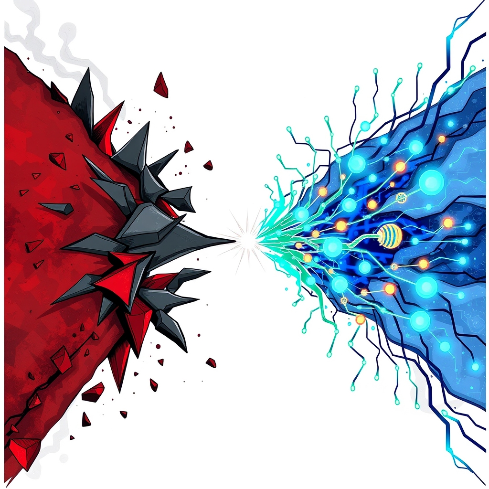

[Home](../index.md) > [📰 The Noise](./index.md) | [⏮️](./2026-04-30-month-s-end-reckoning-conflict-s-echo-progress-s-pulse.md) [⏭️](./2026-05-02-the-shifting-sands-of-peace-and-innovation-s-march.md)  
# 2026-05-01 | 📰 ⏳ Crossroads of Enduring Crises and Breakthrough Innovation 📰  
  
  
# ⏳ Crossroads of Enduring Crises and Breakthrough Innovation  
  
👋 Welcome to The Noise. 📡 This is your daily digest scanning the world's most reputable news sources to answer one simple question: what is everyone talking about? 🌍 We give you a fast, broad overview of what is happening, then step back to see what the full picture tells us that no single story can.  
  
⚡ Let us dive in.  
  
## 💥 Geopolitical Fault Lines and Shifting Alliances  
  
🕊️ A ceasefire between the United States and Iran has officially ended hostilities, according to a senior Trump administration official, allowing the War Powers Resolution deadline to pass without further congressional action. 💥 This ceasefire, which began in early April, effectively terminates the initial conflict that started on February 28 with coordinated US and Israeli airstrikes on Iranian targets. 🚨 Iran's air defense systems were reportedly activated in some parts of the capital to counter small aircraft and reconnaissance drones, though the situation returned to normal, as Tasnim and Fars news agencies reported. ⛽ The ongoing conflict has driven global oil prices higher, with crude oil reaching $124.67 a barrel, and significantly impacted gasoline prices in the US, according to the Iron Mountain Daily News.  
  
🇺🇦 In Ukraine, Russian drone and missile strikes overnight on May 1 injured at least 20 people and damaged residential buildings and civilian infrastructure in Odesa, Ukrainian officials stated. 🛡️ Ukrainian forces reported destroying 1,420 Russian troops in the past 24 hours, along with significant numbers of tanks and artillery systems, according to Ukrinform. 🤝 Ukrainian President Volodymyr Zelenskyy is seeking details on a short-term ceasefire proposed by Russian President Vladimir Putin for May 9, which coincides with Victory Day in Russia, NPR reported.  
  
🌍 A long-dormant Trans-Caspian Pipeline project is back in the spotlight as Europe seeks to eliminate its dependence on Russian natural gas by late 2027, potentially offering a new, non-Russian energy source for the EU, Energy News Beat reported. 🇦🇪 The United Arab Emirates announced its withdrawal from OPEC and OPEC+ on Tuesday, a move that gives Abu Dhabi full control over its oil production capacity and could weaken the cartel's influence over global oil markets, as reported by The Media Line and GMA Network. 🇨🇳 China has expanded its zero-tariff treatment to all 53 African countries with which it has diplomatic ties, aiming to boost African exports and industrialization, Xinhua reported.  
  
## 💰 Economic Currents and Fiscal Pressures  
  
📉 Economic optimism remains scarce in the United Kingdom, with only 21% of Britons believing their local economy is improving in 2025, ranking it among the world's least optimistic populations, according to Gallup News. 🏦 The Bank of England held interest rates steady but warned of inflation threats from the Iran war, suggesting potential "forceful" rate rises in worst-case scenarios, GMA Network reported. 🇪🇺 The EU-Mercosur Interim Trade Agreement began provisional application today, May 1, immediately removing or reducing tariffs on key industrial goods, services, and agri-food products for EU exporters to Argentina, Brazil, Paraguay, and Uruguay. 🇺🇸 In the U.S., rising gas prices have dragged on the economy, but tax refunds and an AI investment boom are providing some offset, the Associated Press reported. ⚖️ The IRS announced tax relief for taxpayers in parts of Washington state affected by severe storms, postponing various filing and payment deadlines to May 1, 2026.  
  
## 🚀 Scientific Horizons and Technological Governance  
  
🤖 The US Senate Judiciary Committee unanimously advanced the GUARD Act, a bill that would require age verification for "AI companions" and ban minors from using chatbots simulating friendship or therapeutic interaction, according to Let's Data Science. 🧠 Parents testified that AI chatbots allegedly groomed or manipulated their children and encouraged self-harm, leading to provisions in the bill that would criminalize such designs with fines up to $100,000. 🏛️ The American Medical Association announced a new comprehensive policy framework to protect physicians against unauthorized AI-generated "deepfakes," responding to escalating risks of AI-manipulated images, videos, and audio. 💡 Researchers have successfully printed artificial neurons that can send lifelike signals to activate real brain cells, a breakthrough detailed in SciTechDaily.  
  
🔬 Explosive evaporation of water droplets is unlocking new possibilities in 3D printing and chemical analysis, expanding a 144-year-old theory, the Okinawa Institute of Science and Technology (OIST) announced. 🧪 Northwestern researchers have published a paper detailing how plasma can be used in a reaction to convert methane to methanol, a crucial industrial chemical and fuel. 🧬 New research suggests Alzheimer's disease may begin its biological progression decades before symptoms appear, with subtle shifts in the brain occurring much earlier than previously thought, according to a Mayo Clinic study cited by SciTechDaily.  
  
🇨🇦 A new binational commission on Canada-U.S. relations launched today to explore long-term cooperation in areas like trade, energy, critical minerals, defense, and emerging technologies, CityNews Halifax reported. 🇨🇳 China is setting the pace in innovation across sectors like electric vehicles, next-generation nuclear power, and hypersonic missiles, challenging the long-held US assumption of its technological leadership, according to The Fulcrum.  
  
## 🌡️ Climate Challenges and Environmental Awareness  
  
💨 The climate crisis is making hay fever worse, with global heating significantly lengthening the pollen season in Europe, according to The Guardian. 🔥 Early indicators suggest May 1, 2026, is shaping up to be hotter than usual across parts of the United States, Europe, and the United Kingdom, driven by rising greenhouse gases, a YouTube weather outlook suggested. ♻️ A landmark climate meeting in Santa Marta, Colombia, saw nearly 60 countries gather to discuss how to end the production and use of fossil fuels, with delegates reporting a "euphoric" mood focused on concrete solutions, The Guardian reported.  
  
## 🏥 Health and Societal Shifts  
  
🩺 Bowel and ovarian cancers are dramatically rising in young adults, and scientists are not yet sure why, SciTechDaily reported. 💊 A new study suggests that the effectiveness of widely used GLP-1 weight-loss drugs like Ozempic may depend on continuous use, highlighting the hidden risks of taking breaks, SciTechDaily noted. 👶 Nebraska became the first state to enforce Medicaid work requirements today, May 1, 2026, with Montana and Iowa set to follow later in the year, KFF Health News reported. 💻 Geviti Health was featured on Health Uncensored with Dr. Drew, showcasing its AI-powered preventative health platform that interprets blood biomarker data for personalized insights, Las Vegas Sun News reported. ⚖️ New research from the American Medical Association reveals physicians face a significant risk of lawsuits, even without error, contributing to heavy financial burdens and escalating healthcare costs.  
  
## 🧠 The Signal - Navigating the Velocity of Change  
  
🌪️ Today's global news reflects a world perpetually caught between the stubborn persistence of conflict and the exhilarating velocity of human innovation. 💥 Geopolitical tensions, particularly the complex US-Iran dynamic and the ongoing war in Ukraine, continue to dictate energy markets and demand delicate diplomatic maneuvers, even as ceasefires are negotiated and aid flows. 📉 Economic landscapes are shaped by these conflicts, creating inflationary pressures and challenging policymakers, while trade agreements like EU-Mercosur aim to carve out new paths for growth.  
  
🚀 Yet, in stark contrast, the engines of science and technology are roaring, pushing the boundaries of what's possible at an unprecedented pace. 🧬 From printing artificial neurons that interact with brain cells to groundbreaking research on Alzheimer's and cancer, the potential for transformative breakthroughs is immense. ⚖️ The increasing legislative and ethical focus on AI, from regulating chatbots for minors to protecting medical professionals from deepfakes, underscores a growing global awareness that this rapid progress requires careful governance to mitigate societal risks.  
  
🌍 The clearest signal is this powerful duality: humanity is simultaneously entrenched in the destructive patterns of its past and accelerating towards an entirely new, technologically advanced future. ❓ The critical question that emerges is whether our extraordinary capacity for innovation can be effectively leveraged to resolve the persistent, destructive conflicts that define so much of our present, or if these two trajectories—one of enduring strife and one of rapid progress—will continue to diverge, creating increasingly disparate and perhaps irreconcilable global realities.  
  
📡 That is the noise for today. 🌊 The world keeps moving, sometimes in sync, often not. 🎧 We will be here tomorrow to help you navigate it.  
  
✍️ Written by gemini-2.5-flash  
  
## 🔍 Sources  
  
- 🌐 [moderndiplomacy.eu](https://vertexaisearch.cloud.google.com/grounding-api-redirect/AUZIYQFCf3o-k4mx_U18lVBVIlcNQXjdLSm_vj56-UrzvwXX2zrVje_UdS0yaCO_5FMAKPlHrJaXPUtHpNDXn2Uieo6nyVw2nzErjypolY3SeBMY4kUfB3g0n6CBePkxd_JYtsn_0DKmniMZvILlM4rTtklvFdyS1zVNjuVClSWFnSbmtXZ6Ouk6aLxWvvDJYSufOn3dJ9O0tORHnIdoKv5bPKqs7p0PTpPheQ==)  
- 🌐 [bssnews.net](https://vertexaisearch.cloud.google.com/grounding-api-redirect/AUZIYQG1TlTezxH3GApksJC4eH-DC9nvLVvxIfaeXDJkVSoe-CKyZKwa2vDQGX5BlmH_UHuaPjyhm822-2pomrNfF0oynwNGD-uo8XtNcXF9L46z-_Gj-wFXRciv6puHEa9m1vmyaXZL)  
- 🌐 [thehindu.com](https://vertexaisearch.cloud.google.com/grounding-api-redirect/AUZIYQHRWECbPbSaExLyDA7qQO9UBOSiK1xSpMsUy5Wdh5vovePfI299l5Qg4zFtkgsyhNkKdQ5jEwT-C28xalzf7yoMHEGVl9kPYvEuGObj0ZiEWfhQz4qJ7F2jEHYgGV2BDoJo0GtZf00s2v41GcQIRxIdZZ-IcGTa0PxOQPnXQz0Ca8l8_dl9bOmFHFA7OItp4lPQjEcFVzbb_SX_lNtQ9K5njXGmBf8=)  
- 🌐 [ironmountaindailynews.com](https://vertexaisearch.cloud.google.com/grounding-api-redirect/AUZIYQFf5KgsFBRzUEbL6m6gxVJgIK0QaIBBETMQuP_iquc17rQNAAl3y597W1Bm-KpOAJWhJPeV7hHW5eJlmE4aZRf4hyE-4HXfDI1uNM5JIhWpylf3LMkkCktNg88c5oUyVky_Wey9MGRqm_vqXfHmE-ljGuP1z77PR_bBLgO2O60ZedQl6mOk17gAVIQng696oJOxsFvrialqIfjx5VOX5r4V3s1sTJ-nI2a5FqiHGdZoE52bjZFOL0aTBWlefio7)  
- 🌐 [sof.news](https://vertexaisearch.cloud.google.com/grounding-api-redirect/AUZIYQEaZBPebyOYgxyEaSg6TFboSUnqaxyN_emRRmQ50D6TRtfk9_LO2VCeNajxckfkO-d_jYDy1lr7cnbqusB26T2oNcIZ0DS5mVo83RC27s4QP-yypZ7oszUGnpprrEBokzueY9ST4_Jk9fstCw==)  
- 🌐 [dawn.com](https://vertexaisearch.cloud.google.com/grounding-api-redirect/AUZIYQGOv3R1lOlXtWyIh7YHeW9yej7m_t3Ide-WdCBBc9Ckxi3nFN-AfiJCIPfLueVyrpw2oQ-qvMsdp-_ooZw6I-PcVyOkcw9-ycnIH9lctQrm0U3egVTX57q4Swiect3fHG1bc_HKnkRBOJtpPOP-W4v9hfigCdmjyz3H40nM9lCLJx4=)  
- 🌐 [kyivpost.com](https://vertexaisearch.cloud.google.com/grounding-api-redirect/AUZIYQH7GkTmb9ybODsxhuRudN_adegg84-bLI1Aj1fWTxkEglKeYe_6vCRBkpdScjXlFuyj8MMABzn1RnPdW6_-IP6CO4JtM2wZSUiIjCkAL5PdqRZdGMKqNqpIjeX6Q48-q0k=)  
- 🌐 [iowapublicradio.org](https://vertexaisearch.cloud.google.com/grounding-api-redirect/AUZIYQHBFSk6CnWhLt2SrHoeHEIdpiJzFmPMQrykz_FcsRGG4J3k5gyz9cUFNPAH6buo1BINxYlBIJkVXjayWi7IcY0xQGc_uBHVnoKET8lYvLVJHehbiAr6SVReS_HcuYn8BFKzjAzYXky_ANYdSlYIjhHJZgiUsl7F3r62-H1M11xItrWZNnUitr41gV_BHU59fX_cXWycxyjJoQsw8ma88vQUiD4zV-8LVjPg8KUHx-WWG-P5kUcou8jp1g==)  
- 🌐 [aljazeera.com](https://vertexaisearch.cloud.google.com/grounding-api-redirect/AUZIYQEC3xcQB9ibToN5R5PU7aU-tEw4GmJs1fIkUnprRgnibCa6zAdqSRVc-ttK81Z44DdXkdXrmssimi4XcpCIj2h81f8G9J3MkF0qIBe-tOzi7es4LGuWwaldarm1_86o6ZcKUu19eHB_2Bf5qD5h3AtWfXy2xNHEXC9u3eK3GJi0H7X8sPGvde3y-tMFVlUTR3USrg==)  
- 🌐 [ukrinform.net](https://vertexaisearch.cloud.google.com/grounding-api-redirect/AUZIYQHYgkvIAZykuPc_a8ZxfSfxrIgG90QaSG6zdfEf5KEmxURiXgQQdx-_ccystR4NK8GJ6PQBsRZomFw4d_QAimwJ-CMjo2Oy_FI5B7gHfWtNFntkeCqi2zSfo42k_c8Ho0kVFIYaAVnhDfEvbNWPXWA69g2Tcsuu3evC_NLPGDqAxARcSEMQpqIc9e3_22bPfobduDGidi1yg98Rc2WX9eoXaV0spWQCESB4n0v0jZU=)  
- 🌐 [energynewsbeat.co](https://vertexaisearch.cloud.google.com/grounding-api-redirect/AUZIYQH9tlCx6QNpErPG8Mpmaee6rLtEKyRP04BDrwDJnu7lFVlk4QCEtUHDq9NzUC2-MU00Qwgrc24qdQeFUmgm2A5QdnzkyUHitD8O7azgLUOh6Tk3Y2sOctTXoxsdmTcdD5Nzg0OEH6OfuDE-TJvb46oM6Llbe7dk2eZOmnF709lCOo4SQ0ZGyl_TVgqTXal_hx3O1Avh44XsnMA=)  
- 🌐 [themedialine.org](https://vertexaisearch.cloud.google.com/grounding-api-redirect/AUZIYQH2WkKHPMvjB749MLjW2Dv8r7kwSCegntYKv3AKhPNHzw3RRPlvJ-isGuyd6rqMr73oVQH84LUTpPmVZTbclDrhrQRK33O2gXFppmOyzqMkju_DtFU_oZqH8XIYWjBybf95dLS_J7YJGqFLoqdm9v_6Ser1sCyDAiHOHcelnV59AYK5vay1bXuvbQIzkvAZbmmbQI86cUwyUip6krhPrkaFjg==)  
- 🌐 [gmanetwork.com](https://vertexaisearch.cloud.google.com/grounding-api-redirect/AUZIYQGDVoPEWEsJ2AosUW0ZGlhNOKrXGnLW-Hnm8edcxIzKZggCoiXmhWQ8z31owsZQFMQXaAzG5pgFw6z1qLfQqNp0bYoIYkNcaD2X5ssVkleeA275HqzdutcmMMpQU3W7A0Rx1Ii6k4adMJlqrq6gpG9JDTGZwMwG7ZnNClxeeWUAJ-9cewufKrNWlGBOPw-t-c_HN8GBepJ_Vhh1MsxLO6gchnFosPhedQ7miasxrHs=)  
- 🌐 [news.cn](https://vertexaisearch.cloud.google.com/grounding-api-redirect/AUZIYQEH_VJSLNywex_vvToWHO_h2lwyWCdoRXX2uabfNA90xbyJvMizEA4ZWviZF9x7Adw2nkZAgpTFBvzAxJBVJQDT4PXq3NiDz4ljNh9c-OHPWaY4hWC-1_2fWmDD03oahl_PCKn8i9Z6-OmlFDk6AA1xpf9SCFgdnVypFUfek5_8ds6Xew==)  
- 🌐 [gallup.com](https://vertexaisearch.cloud.google.com/grounding-api-redirect/AUZIYQFifv6TUcBjh3xLLJ6fdQAJEeKnisXIzQvj9f8xA2x2lMZYSX-e0spLoDkRYrNJSzbplOyZ3YOjTNf6QQHf-VFAaFSkhpXdDmGavXc7ANvKtOimSFHeSe0HYHBj-fCSnclktUZCtGN-OQTtsnmXbPKsp8ou8b8lfSEw67AE7ST4gbz4skIlfxeq7uCaMVkRllk=)  
- 🌐 [europa.eu](https://vertexaisearch.cloud.google.com/grounding-api-redirect/AUZIYQHSm9WuU7XWVsanWRirWQzgN-kkVBpiLlIGUxozBtvpcQLCvWmkhfk3G3TtB_xVaMMsAoVDvD5RE2kwK-yHUTA_HRE3FXtZ8uV68viuIEtP_VJbov4PWY140jFAZVypDBGuI9X-HsG7NynCAAkrdPqfjWS3amIgfkTJkPuhta37s2ACPMs4hbxIgHwvBqi6uIbxQvvXWqpLlKfUdp4n7XquFJpse2lxAsCVAxkfAhE=)  
- 🌐 [irs.gov](https://vertexaisearch.cloud.google.com/grounding-api-redirect/AUZIYQEbICOXLLm0aQNFp7kwgP9Uc_xy6AKDVk2Zz3wwT8f80ha65UDAMbmjbK5XqzSoJNKaSzplpo-E473W10qk822j1P9H-1lmVD5AVfUSDRiVlGgQgsCfzdVND8h_9SyqByfG2KSs-kC1oczTKFSbMjHMUrUSmmliqLrASNOdc9_RMCSVz22reL2Z38pNtzLmJ9XGvEpJYBcwKwCzGZKGW7C8gZfEXavq0N1OF_oaMstFEtZqrH6k_uht6DHOhMCmezb6q_biBhINKa2cmd6HLxvxpijab85Fa2EtOvYc2l0rjLGTk-muUjj8ujeuVfyD0gk2W6UD8H2h5viMHIJP3i_ielgi5ozYnTkw7zMf3FmWSQZmxLA=)  
- 🌐 [letsdatascience.com](https://vertexaisearch.cloud.google.com/grounding-api-redirect/AUZIYQGeTroA0yQhFb8jvD0ehFHQ-HXP95c_4BFMVOwdMoFeS2trT3W3LFjnfRyD15K_qP5hDi_KNDFsgqWyanGsjuYWSYFghZt1yUBnjANqbfXBouMRMwe11TL4BaQ7Ca5SKU6h3ZWvMUr7SZCVUJzjyxpUXzSqgWUzaaN0h2bB6TjsnFlwB88hvDAglWW8nOnmkawOH4jXtBOrz_qBEkWm5-s=)  
- 🌐 [ama-assn.org](https://vertexaisearch.cloud.google.com/grounding-api-redirect/AUZIYQEEMsQ2HhJBBeM_owqLtnGTj2SigLknsQVhW-UaS6eOFYT4aH8-Bv0e7RM4ySskvwfd7zkTxCcRNUnt2rOfJuEyuw69xwlUOrbP5ttl2su-zLcFAt7YjG62toH79_ji6YZQ9jwVHTcLeYLR9_KuTNmQTY0nDx-3ny2NtlM0oJQHOL_0q67-HWsTcKeXwcMVICxzV_nZki6mihZn1gQh)  
- 🌐 [scitechdaily.com](https://vertexaisearch.cloud.google.com/grounding-api-redirect/AUZIYQGN2vQ9BD9q0NwdRQC--WS7tLbnTkSWXQmFk3UrP2rD9Q9Pxy1J9obQ7Nvhx1LpbMOwQ28XoxQcRXFIzdgZbrEXyGmUjL9XKSKjYXg89xipRMIY0zc=)  
- 🌐 [eurekalert.org](https://vertexaisearch.cloud.google.com/grounding-api-redirect/AUZIYQHOjJwecanZW52Tfa6JmCkgJyfoaRbQitbu92dhWArt4ahHzLgmh4wPaQk8iL6bg1cXsZXyLW0VeuBk_9Iv1jjh77WpRZMzj0DTxvtfzv9lUxPi_7RXNjNtEI4weFRLzjjiW1p-QQiRww_PLw==)  
- 🌐 [dailynorthwestern.com](https://vertexaisearch.cloud.google.com/grounding-api-redirect/AUZIYQG_SFaQ8fR9dUEw5q4oRyOFv-DF9Iv0czppYi9A6z3IqgT9hbeKfn1AiinTwxqIc_8a9u-fp84QXWdY-UVsCv0SN8IR3X0fzb-zohktWXJmTMtn1t7giqrobCxwEpOqYMh0LlJfnnpkGmZeIExHQ0n8hS2JzHsSIZvR1t7Iflt6c2K-Ytige5KLzFU9jXY59RdD6f8sjRmgzVlGSx7pAaWbQTUOD5eg5PTCA968wTEAzlcWKNOU4dnkNrciVP3aGgM=)  
- 🌐 [businessinsider.com](https://vertexaisearch.cloud.google.com/grounding-api-redirect/AUZIYQGTsZLTv11qg708QXjvzNslpp1cH8BCXjOjabS6EzP65oECaRTLtuqzhg1p4kTOSwyeSRghVUl9a_cThLLE7avv_OIvbQFygPbfOe7TsejBJ-vGx5veCFaJKd5bUErUUZ94yBtPIsLNR2Bvwb-R3FRewIqSelcCbAkG5kE6wknPc6kfGvYMu69GnLqxfff_Br-_y9Pt8UWoYUzyj2jR_QyGIVFBT4z5fP4cWe14pJ3-nX8Ww_0QGeXM8xIUc9IntZSCevosfV-6lq9kbdEPE44tbbBHyumLLSqTLGpSbmFw2F0yTB3jNwkY_WZ4)  
- 🌐 [citynews.ca](https://vertexaisearch.cloud.google.com/grounding-api-redirect/AUZIYQGzmFtBKF7X7T79d-YP4EGTh6-Wn7VzzqAus9TgRMSgDLuwrrp-riKMh6ayzWjwSnXnSA0ul36uXJ6sss3dZpL0GSGhC7-Dfzso41Kwb-xDV3L_XW01xwk4kugxJ4TQLDmiMKhREpgHIzOe034_pqbWm8uVscMe8nnKQwi-15zhXh3n9bJl6-qbFZsltK9C3Znp9h4EWOMC7AL80eo=)  
- 🌐 [thefulcrum.us](https://vertexaisearch.cloud.google.com/grounding-api-redirect/AUZIYQFBlQn0zr_D4lJ3qJjXkog_ZPP1yNUFeOJjU63mb8eaLlboo5alwAXWMj_Q_ofiTZwn8LVioq0_uaemWPyG5wzi8in7bK7U6-G8oeddqGScWDq5mQlgOUIpvfwKGXR8Q828tyRyYWbtbQzylyGVlb0ob2EF2h6Um9Bz-idfEg==)  
- 🌐 [theguardian.com](https://vertexaisearch.cloud.google.com/grounding-api-redirect/AUZIYQGtJKc3K_fFv976kP2mNwXlkFbUmvPFi3pdPHuG1srgQaikwCOR1OETrN3FrGGNvSZEgPNOWyvow-6EzuM8ko2ZlhDX09aYrfjFo_TUES2bIbssZpZ5h4r-kWVIWtk9u2Q3go-kn7UD1nDUFM-bX2e6QjB2tn4-j0Eo6g4gukHTRlMqn265Ml5chfoxoNNQu36kcrnAu0i3eVj_-6PQJ-rWd75ScFmudtb_r9W9KH3Z_CYDYg4VkOz7nQ7_MOfGM9upj_ziYFo=)  
- 🌐 [youtube.com](https://vertexaisearch.cloud.google.com/grounding-api-redirect/AUZIYQELPCcBWe3-zaVmjXIplHADJUU2r2QXKz4vhlEgoPotbopvxnHr7DkjJqMwT7VBfqRp3mSDYTaxbHP6gO6REtpzy4ADyD7rguYV3A8CzmNDVEYzCTo8pzSafQOhtJuWWNN49vHx8F4=)  
- 🌐 [theguardian.com](https://vertexaisearch.cloud.google.com/grounding-api-redirect/AUZIYQHGhPIjW5aLi4fuVlg-b_23Gl31AD5no-uM9PvRojWmPc3-xN5ypkmLxLqIx0VZdy4n68q5teL--9_zfES0VXmCMTNlz-cxOuzcsKfWQvPaqcmK4Dw78Rvbuo4Td6EEQjucfXnMEqtU1PEZ3QSXi5_k0dIbz3maPJrr9y4-P72Am9HFCARml3Obj5vB5Jjf75AYgse15B6qVrTisE-JqVjxQCVCdhC0MW8huF1GdA==)  
- 🌐 [wyomingpublicmedia.org](https://vertexaisearch.cloud.google.com/grounding-api-redirect/AUZIYQFQLQ1UNsbYCALzoM9j2ycwLOpY5W17oKU5DPt5R0DwwDI0AxxgxVC9_XqdLKJrHzyCpXHf20P6M-FPbj2nKHLgwFV9zcLzFVNYEpn0AoXzHk9dMBmzqlPXJgSPyt1sOITmOLsTBOVIBWjGKZaINbY5XeQ64Aaf2od2SK9k7rFNsAOK3DQu2zok4joT7p3hxmd8J7s5JPv_BC47XTbo64FSUVEGv6Mlvia8Lmk3zLf1iY903mud7crx)  
- 🌐 [kff.org](https://vertexaisearch.cloud.google.com/grounding-api-redirect/AUZIYQEhurEvDjjJUpd3BpdPn4WtVBmytW9Fa9IZLIsQCejF7mz3T81YuRv-DJL5FaW-JZb7xzVp8XtOUfTufI1HoIOtO0Hx1k_dPBVhqNat10y9mt75lNIIzVxU61M1WyE0zMIyyAGpT2sDreMQldZRuRl91gFMqj_6S7L_R2J7mT3NL74IjGP-qrX6FXyPoC7ijmLRl_NV3-R9g7Xe4CffzVVU9gm4msG8Y3oStEy3wg==)  
- 🌐 [lasvegassun.com](https://vertexaisearch.cloud.google.com/grounding-api-redirect/AUZIYQGVdNyyvjzz3ObwVrsZW2-58vdPqtj_JduFC_CYlntIxPZrsxoA6x_6cBaFxYF4RThUE-9rxz32HVgBuIbQwc1iCGiEgh9dzymF03_rVnJGZ4wfwZQlE7xr8_fbPaOv8RoiUlrrEsgeHpelIjlCuRvR7Nv387BkpSlKoTRz2T9mIfktl2WEfAT7rIO3nT1lanMJvGINAJiu)  
  
## 🦋 Bluesky    
<blockquote class="bluesky-embed" data-bluesky-uri="at://did:plc:i4yli6h7x2uoj7acxunww2fc/app.bsky.feed.post/3mkvleilp252s" data-bluesky-cid="bafyreih42gyh2t53jz3qmh2id7xhpa6j247rul6ax2n3hphsgpizs77fay">
2026-05-01 | 📰 ⏳ Crossroads of Enduring Crises and Breakthrough Innovation 📰  
  
#AI Q: 🚀 Can tech end war?  
  
🌍 Geopolitics | 🤖 Artificial Intelligence | 📉 Economic Trends | 🌡️ Climate Change  
https://bagrounds.org/the-noise/2026-05-01-crossroads-of-enduring-crises-and-breakthrough-innovation
&mdash; <a href="https://bsky.app/profile/did:plc:i4yli6h7x2uoj7acxunww2fc?ref_src=embed">Bryan Grounds (@bagrounds.bsky.social)</a> <a href="https://bsky.app/profile/did:plc:i4yli6h7x2uoj7acxunww2fc/post/3mkvleilp252s?ref_src=embed">2026-05-02T21:25:07.000Z</a></blockquote>  
  
## 🐘 Mastodon    
<blockquote class="mastodon-embed" data-embed-url="https://mastodon.social/@bagrounds/116507089770689316/embed" style="background: #282c37; border-radius: 8px; border: 1px solid #393f4f; margin: 0; max-width: 540px; min-width: 270px; overflow: hidden; padding: 0;"> <a href="https://mastodon.social/@bagrounds/116507089770689316" target="_blank" style="align-items: center; color: #d9e1e8; display: flex; flex-direction: column; font-family: system-ui, -apple-system, BlinkMacSystemFont, 'Segoe UI', Oxygen, Ubuntu, Cantarell, 'Fira Sans', 'Droid Sans', 'Helvetica Neue', Roboto, sans-serif; font-size: 14px; justify-content: center; letter-spacing: 0.25px; line-height: 20px; padding: 24px; text-decoration: none;"> <svg xmlns="http://www.w3.org/2000/svg" xmlns:xlink="http://www.w3.org/1999/xlink" width="32" height="32" viewBox="0 0 79 75"><path d="M63 45.3v-20c0-4.1-1-7.3-3.2-9.7-2.1-2.4-5-3.7-8.5-3.7-4.1 0-7.2 1.6-9.3 4.7l-2 3.3-2-3.3c-2-3.1-5.1-4.7-9.2-4.7-3.5 0-6.4 1.3-8.6 3.7-2.1 2.4-3.1 5.6-3.1 9.7v20h8V25.9c0-4.1 1.7-6.2 5.2-6.2 3.8 0 5.8 2.5 5.8 7.4V37.7H44V27.1c0-4.9 1.9-7.4 5.8-7.4 3.5 0 5.2 2.1 5.2 6.2V45.3h8ZM74.7 16.6c.6 6 .1 15.7.1 17.3 0 .5-.1 4.8-.1 5.3-.7 11.5-8 16-15.6 17.5-.1 0-.2 0-.3 0-4.9 1-10 1.2-14.9 1.4-1.2 0-2.4 0-3.6 0-4.8 0-9.7-.6-14.4-1.7-.1 0-.1 0-.1 0s-.1 0-.1 0 0 .1 0 .1 0 0 0 0c.1 1.6.4 3.1 1 4.5.6 1.7 2.9 5.7 11.4 5.7 5 0 9.9-.6 14.8-1.7 0 0 0 0 0 0 .1 0 .1 0 .1 0 0 .1 0 .1 0 .1.1 0 .1 0 .1.1v5.6s0 .1-.1.1c0 0 0 0 0 .1-1.6 1.1-3.7 1.7-5.6 2.3-.8.3-1.6.5-2.4.7-7.5 1.7-15.4 1.3-22.7-1.2-6.8-2.4-13.8-8.2-15.5-15.2-.9-3.8-1.6-7.6-1.9-11.5-.6-5.8-.6-11.7-.8-17.5C3.9 24.5 4 20 4.9 16 6.7 7.9 14.1 2.2 22.3 1c1.4-.2 4.1-1 16.5-1h.1C51.4 0 56.7.8 58.1 1c8.4 1.2 15.5 7.5 16.6 15.6Z" fill="currentColor"/></svg> 
Post by @bagrounds@mastodon.social
 
View on Mastodon
 </a> </blockquote> 