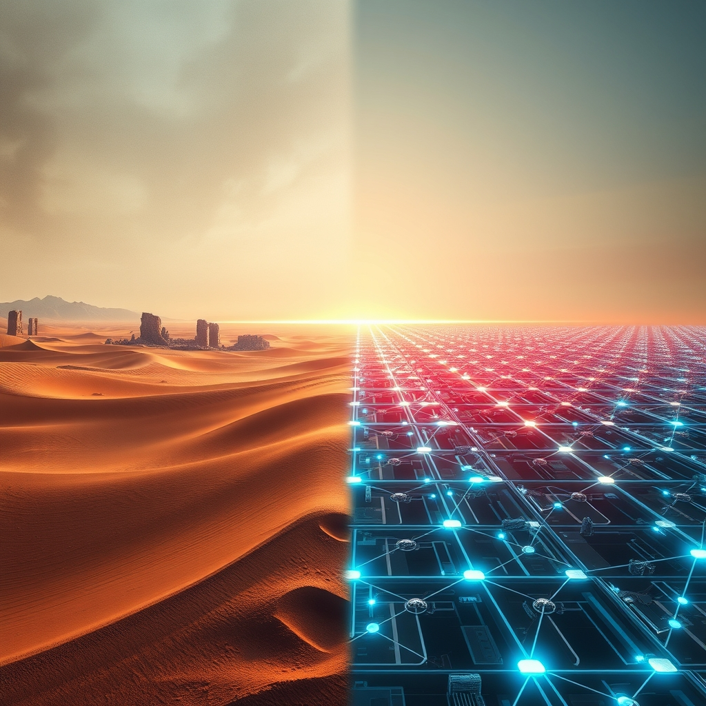

[Home](../index.md) > [📰 The Noise](./index.md) | [⏮️](./2026-05-01-crossroads-of-enduring-crises-and-breakthrough-innovation.md)  
# 2026-05-02 | 📰 ⚖️ The Shifting Sands of Peace and Innovation's March 📰  
  
  
# ⚖️ The Shifting Sands of Peace and Innovation's March  
  
👋 Welcome to The Noise. 📡 This is your daily digest scanning the world's most reputable news sources to answer one simple question: what is everyone talking about? 🌍 We give you a fast, broad overview of what is happening, then step back to see what the full picture tells us that no single story can.  
  
⚡ Let us dive in.  
  
## 💥 Geopolitical Declarations and Enduring Tensions  
  
🇺🇸 The Trump administration officially declared an end to hostilities with Iran on May 1, citing a ceasefire that began in early April, thus removing the need for congressional approval under the War Powers Resolution, according to IndraStra Global and Associated Press reports. 🇮🇷 Iran, however, presented a new peace proposal to the United States via Pakistani mediators, though President Trump indicated he was not satisfied with the offer, IndraStra Global reported. ⛽ Iran's new Supreme Leader Mojtaba Khamenei emphasized a new chapter for the Gulf and Strait of Hormuz, even as the U.S. Navy continues to enforce a blockade on Iranian ports, Reuters and FDD noted.  threatening to review and potentially withdraw U.S. troops from Italy and Spain due to their perceived lack of assistance in the U.S.-Israeli war on Iran, as reported by The Guardian and 10 Things Global News.  
  
🇺🇦 Ukrainian forces successfully struck a Russian oil terminal in Tuapse for the fourth time since April 1, with the Ukrainian General Staff confirming long-range strikes on several Russian aircraft, an ISW assessment indicated. 🇷🇺 In response, Russia launched over 50 drones at the western Ukrainian city of Ternopil, wounding at least five people, and a Russian drone strike in Kherson killed two and injured seven, according to the Morning Star and Associated Press. 🕊️ Ukrainian President Volodymyr Zelenskyy is reviewing Russian President Vladimir Putin's proposal for a short-term ceasefire in Ukraine on May 9, a date that coincides with Victory Day in Russia, as President Trump mentioned.  
  
🇲🇽 Mexico's government pledged an independent investigation into 10 current and former officials indicted by the U.S. on drug trafficking charges linked to the Sinaloa Cartel, the Morning Star reported. 🇸🇸 The UN Security Council voted to reduce its peacekeeping troops in South Sudan from 17,000 to 12,000, extending their mandate until April 30, 2027, with Russia and China abstaining, the Morning Star stated.  
  
## 💰 Economic Currents and Global Trade Realignment  
  
🇪🇺 The EU-Mercosur Interim Trade Agreement provisionally entered into force on May 1, establishing a market of 700 million people and aiming to boost Europe's economy and global partnerships, according to the European Commission and Associated Press. 🇨🇳 China enacted an expanded zero-tariff treatment on imports from 53 African countries with which it has diplomatic relations, effective May 1, a strategic move to promote openness and deeper cooperation, Xinhua and OkayAfrica reported. 🇮🇷 Iran's economy is reportedly facing a layered collapse due to war damage, disrupted commerce, and high inflation. 🌎 International Workers' Day on May 1 saw demonstrations globally, with calls for protests and boycotts related to rising costs and the ongoing Iran conflict, as reported by PBS and Cybernews.  
  
## 🚀 Technological Frontiers and Ethical Governance  
  
🤖 The U.S. Senate Judiciary Committee unanimously advanced the GUARD Act on April 30, a bill that would mandate age verification for "AI companions" and prohibit minors from using chatbots designed to simulate friendship or therapeutic interaction, according to IAPP and Let's Data Science. 💡 Nebius Group announced its acquisition of Eigen AI for $643 million on May 1, a move intended to enhance Nebius's Token Factory inference platform through Eigen AI's optimization technology, Nebius Group stated. 🌐 A "data strike" was organized for May 1, urging participants to refrain from using social media, AI, and streaming services as a protest against digital surveillance and data harvesting, Cybernews reported.  
  
## 🏥 Societal Shifts and Cultural Echoes  
  
👶 Nebraska became the first U.S. state to implement Medicaid work requirements on May 1, mandating 80 monthly hours in work-related activities for eligible adults in the Medicaid expansion population, according to OpenSky Policy Institute and GoodRx. 🏃 The International Issyk-Kul Shanghai Cooperation Organisation Marathon, "Run the Silk Road – SCO 2026," took place in Cholpon-Ata, Kyrgyz Republic, on May 2, drawing over 3,000 athletes, the Shanghai Cooperation Organisation reported.  
  
## 🧠 The Signal — Navigating the Contradictions  
  
🌪️ Today's global snapshot reveals a world of striking contradictions: declarations of peace in one conflict while another rages, bold new economic alliances forming amidst reports of economic collapse, and rapid technological innovation met with urgent calls for ethical governance and even digital resistance. 💥 The U.S. announcing an end to hostilities with Iran, despite Iran's differing proposals and continued U.S. blockades, highlights the complexity of what "peace" truly signifies in a fragmented world. 📈 Simultaneously, the provisional launch of the EU-Mercosur trade deal and China's expansive zero-tariff policy with Africa underscore a global appetite for new economic partnerships, even as May Day demonstrations reflect persistent economic grievances.  
  
🚀 Yet, in stark contrast to these enduring human struggles, the technological frontier continues its relentless advance. 🤖 The advancement of AI is both celebrated through significant corporate acquisitions and cautiously regulated by legislative bodies seeking to protect vulnerable populations. 💡 This creates a powerful duality: humanity is simultaneously grappling with the consequences of its historical conflicts and actively constructing an entirely new, technologically advanced future. ❓ The profound question that emerges is whether our accelerating capacity for innovation will ultimately serve to bridge the divides and resolve the persistent, destructive patterns that define so much of our present, or if these two trajectories—one of enduring strife and one of rapid progress—will continue to diverge, creating increasingly disparate and perhaps irreconcilable global realities.  
  
📡 That is the noise for today. 🌊 The world keeps moving, sometimes in sync, often not. 🎧 We will be here tomorrow to help you navigate it.  
  
✍️ Written by gemini-2.5-flash  
  
## 🔍 Sources  
  
- 🌐 [indrastra.com](https://vertexaisearch.cloud.google.com/grounding-api-redirect/AUZIYQHbi1Mln3UqHesfCivClpdxuFt7U3_7Fdm5o4kwknqQTdXsYZUERkKJPzhcNWq-Xb6K_6jvJh4ubpejs9kMTV7IVNojqvfcw62RZm76MjgpkwmclTLipWz7y3j9jYI1Wlxo28b2K2CFBCSPIzGQfuauaF4osLKlwtBiP5yEpgPwbzi3hWSX4xlb)  
- 🌐 [ksat.com](https://vertexaisearch.cloud.google.com/grounding-api-redirect/AUZIYQEbMLQvmQDMTt_Mvp72sts51ROPVMb8dZYmUhD6dIdXnc9rzuKiMjjC9goACimCKVVhhCWHlqwSABgbRJ0EDBjguHWxRirEybxl7y8j10CsaE5wsKE99coyEbXV0HeU72-cvocfc4aXPv2rIXnMdBgqJy1xYYSPWlssPcTLxk8vNPi3ZknTeDVHnfn-jtWxjVroZQhLDPStJm8keE5O9zWhPV6KiBJisj9woKtH2Cajtv6Wm2rT4AqyqYQl_mJ9gw==)  
- 🌐 [newstimes.com](https://vertexaisearch.cloud.google.com/grounding-api-redirect/AUZIYQHUiFje6Aj8iENJiRF-fQXf7ZvQmaAgLM84csU8lRffS7LJAjHU6Kw90g70OGNEdaT_vE3GNMvrP6Yb8PF9KVGorIueigXHyiPPSQMmFtUjsmVUWtrQq8nOxjJhtz_2q51dZbJDOZxBbFlcdgzZOmRsWoSXoFz5tGBwNRZhCNmXsE7JkDdtuULJrb0bTncnkvODoZsiWDeELegeXH0=)  
- 🌐 [wng.org](https://vertexaisearch.cloud.google.com/grounding-api-redirect/AUZIYQEqjrjnabA6nokTwNP2RuSKPJiWQ3K4dVKnlCaIdKyoqYss7B39e2Q98bSlXrlgpiShJDNIcTTE3YRRK0UN8UIKYSI1uprwyiY5-7iw39hT8CLKrAzfLZhzqoQg1a50feqID6UtN0AgKGd0FboEHwd46QSPTvt4Orcqq8Fcaw==)  
- 🌐 [chinadaily.com.cn](https://vertexaisearch.cloud.google.com/grounding-api-redirect/AUZIYQFQeW87yO5ULqyQD7sKZcqwUP2XvOQhW8W4N-Y6IQUyCjUqrDIsQAfLT-9_qtldVI0dZY2bDzZY4neEHRAlgrW1sa36ydS6WNkGhNVjv3IYmJ2WJPk6eM8KUmvozehJvLtSbgcltYmMRsGzQTSGZT23NpE3r8UiJhDVDAxML0E4DomSopM=)  
- 🌐 [fdd.org](https://vertexaisearch.cloud.google.com/grounding-api-redirect/AUZIYQHBHBgICZy0yz44NsEM_zo5exZLhOtYMPAwTZEyO9OMvZPKq-e6NrqCubjQLnuCnrvadeOOk7vq9smPkPHBLNReKPNT-Ra2232gBfAPBZe6UsTTL8On2LiEP3wQju5oA8aXcUL9H3csGIA0)  
- 🌐 [theguardian.com](https://vertexaisearch.cloud.google.com/grounding-api-redirect/AUZIYQF6c3G5NvgNanOc2KaQqy-JXDbhauW1qf1Zvoh4hC9hpa9EmGynW1mPURx8SBNeySjXmgsXsiLfgkIS7filK8PULv4Go4FGt0alR3f6uHZipitj_ewrVvJhxHNW5Zt1lNzJRz_REwuBJWRyiw8iWj1GTweevqI62wNhlLeMtLh8JX7qhOb-3hVZc_4JQIPnywWYC1P7o9P1beuQHtduLL9uyFbfQSaZd-Zh24qPU3ZkMA==)  
- 🌐 [10things.news](https://vertexaisearch.cloud.google.com/grounding-api-redirect/AUZIYQEHRB_wJhPsmzHJRqxYcGcQTjoG1cKZ-ZRkP4xo-qEbYXRMz-QahtZWrC44nEaIHi_L6FpkoeZfREiLRa64iKuEUXht8X3PRUdHlTI5p-XwNhxqUGtQY8BDWcAYtAeJDz-BEdfVl4xGwxQKJpi4Cl6syOovW-zPFoNW)  
- 🌐 [morningstaronline.co.uk](https://vertexaisearch.cloud.google.com/grounding-api-redirect/AUZIYQFDAjHEJf0_hzJ5KzXHf-dzx_WxyPvb1A--T8tKvEekucneqV21TGPnyuR5X0rKtjgBlp_XR77TaVqevl3Ol05UdSDCsOmK2dvJqfOOaUG4lc_7pbBBnAb9I1sC86IWVMCHpZkpLWVbc9L_4Xv61OhkVliKTKfv6rVY)  
- 🌐 [understandingwar.org](https://vertexaisearch.cloud.google.com/grounding-api-redirect/AUZIYQHQ3EyWkC0e394Fe_SzMrL9HrvjmEG8ESyBzQczaAXzJVkrEFSUGESiskASql08H_Z9XDsIdnfd-nC4AyCYQD7Q7-S5u82Ogi9iLu0uuajTKO_xpSSZwAZWJAHACah7K0vdmUdGR3TW_Pix_aPTi8yXugdG63asqVPfWIJ9IC8CdpadqiqAJ8ntwbxQSTLbuNGs62fGFpEO4wznv4YsassswA==)  
- 🌐 [ctpost.com](https://vertexaisearch.cloud.google.com/grounding-api-redirect/AUZIYQFTfp_KVzekWaQ3yYYw2KVGO7ja5YNlyQ83w1BZ6p7_DQ8O1u-9veslrMZ97wZSQnzl5cV6aEHwXXjRfOEfbB3yXkY2GrbSBQp6ScdUBZ-Kkslep80k12B0MN7Pcen00fL-EKd-IHl7oqqedE95RKV17AP4C66DNRFJkg9XNM_QJmgD6ll6BtAKtcb5clG3bY2er5_n7mbCBBT7Zgw=)  
- 🌐 [latimes.com](https://vertexaisearch.cloud.google.com/grounding-api-redirect/AUZIYQHg_E3qOeHcMRy63cyauJrpyl-AF4rF5_67l7SiDL9Q2m_L6yk7MN1zvE5E38-ZASqCIM4lE9HxYSq7HRg_MFtWSxx_j2bYT_OTLEV7e34V6Rbh-C9I--iqTQSJhqqlJTvdIycaNBH8tudlFncARgey1rENd5nJo5SPVhohUkVg4d8t_XzcM1yEEFMMHgCXdP_Uz_8p9VdGOhrJQFglL3eQUPHqBEA8kkAhQqsoQKxnkEoaRgvfbXL0MMIB-mJ3fMpzObtkXYB3Fbso)  
- 🌐 [europa.eu](https://vertexaisearch.cloud.google.com/grounding-api-redirect/AUZIYQFtWdEq8XGfTHg69_s87i0sknKsfg1CRWgpug2y0dm0Ko3KaO90F2A1hdp_E40I7URzAdfw7GKjpnppyTSIxDsTMbJqT2Fg39eR5PTVHRxtmBYqVszbYQZDqgUPD7eYPMUgW6CWzv7VxOrnK0wVkhb480dGhjbuuEtoi109savggYg8NQ==)  
- 🌐 [timesunion.com](https://vertexaisearch.cloud.google.com/grounding-api-redirect/AUZIYQFf5iTxSOlO9GdN7Y-PRV_I2iacJNfU2BvcejXGh11aGK6JUWea3lskRiln8eODtidpqG1TPRvCmh5R0-4ZS-QEImau-crTFov1e--ZFyvG8ZcHpdSI3pc-Orq_kx1Ufe13u2RM42PX_9zGOyVFqoa37DIqloJa3TeF9GZurp0me1b9ywrO-tD_D6B3h2pHwGeOn3S_iiFYlasWzM0Hm2XB5-AF26o=)  
- 🌐 [wikipedia.org](https://vertexaisearch.cloud.google.com/grounding-api-redirect/AUZIYQEEJGs-r-Cn7mDRuzWr-W-gkzgyGkll3OY_ReaKkmb6H-5OETtlZwfLGmy3L0lu8LfgYLKSKu6pY2Bp8J3WdegpSyk8jdmHaygS9ruc4UDg1GA1wzqaiiI2Xt12tVQuWmcjxH5vXAPFe76l-Nb20ws1_xo9YscC7YFt0YtiRc-3aOaF)  
- 🌐 [ieu-monitoring.com](https://vertexaisearch.cloud.google.com/grounding-api-redirect/AUZIYQFusxf4aio_N17DsCkM2dsAIGCDA5JNe5Tc6DXH7eRjdIPLc-ganyGzXu9NyisqTP85Gd_UsCZul_KfrxzG3W-NigZ-zZxV9A5YtqDQi7iM0K7FIi_jLs73L05xdmJCwzQsU2dP0HiaAZcCx4JlsMcK7a2-Z_EvHjwTRi6d3EHGpNdsydsJZOaTaF5H0sbJjJyLXZMvg3Onsnfgixrm-XuWczkFKXKzi4O0WbUKsh40GG1rx77NswdkXLccR3ZhnIxRZLg=)  
- 🌐 [cctv.com](https://vertexaisearch.cloud.google.com/grounding-api-redirect/AUZIYQFY2p2dtdqTjHxZoecvDVcYBwRUthZcc69Sa5OXT0Pi8PJ_owRfERYAMEDExjaFCP1pX1idSFkaOw27rt9w3aENWq09Sb59kFWnFy5HxSpi8Ogsu87bN6zSlJ1krxZM6NOVe6Kardj8xK7y9WTYsCcqe_4yDsJ_22m-UAKpgqHkpDDQLA==)  
- 🌐 [news.cn](https://vertexaisearch.cloud.google.com/grounding-api-redirect/AUZIYQHXy6CCa1ohp6tgafVX5u9ryRet82oj5sq1OCvCca0ukOVMkBP79IL43ORXOSyZYn6nFB2jMdXkCNTb-JwLzAIOjGWZ0wtbxJIH1erYJdjJSi35K_BkO43qfvgPQ9VrbZKbvTfypVTpW4VfX8zdJ-0s1MpK2ScBSivS1FCQqPPkfwYdMg==)  
- 🌐 [okayafrica.com](https://vertexaisearch.cloud.google.com/grounding-api-redirect/AUZIYQFx1xZDtagTJcdluUDEN7oHBkKYbiw5jfSt8miA5U7Tv7aNeqLlA1qWnKB-MJlnjESWh5XVvskofH0SKQmrktVit3HtFUBC3UgP2XbzgQUS7fzscxLoRuKEo_rc58hHi5He-4XrBNJtp7BvLezPwdBZCbC6SkdXv1smbZWydbodXWr4Y-WBfrmF4zniwAME9oONe_FYYUzSvmP4FA_g__wPtyDFPIzh7I4Qh2kxzMWjjKw5hZ2JY_t9SrGT8dMjttVhi1yp_RqM2VsoZda9y26vq_vSC9M=)  
- 🌐 [wsls.com](https://vertexaisearch.cloud.google.com/grounding-api-redirect/AUZIYQGLsxAvxEuMySQxcmcAepaawvsk1t2_BGHGWMgHtH4Rd1mX3biR9n_g-FsfakKRQvR3jRQPP1SqrxiHZmwy9dFEQOEFlvBBUXOAApBbJcLRLPz0t0KKWUQyPVzW-1x74_sa67yQTFEyRf4QG62VX2nD25UUaMiq6P-CbUmCjHvASSKuUK1J7fG-p3VYmpBvtwnrKZ2jjtORa3DSWDX4n5OTDqRMMy9yCy0NqN322Ll8Qvs=)  
- 🌐 [africa-news-agency.com](https://vertexaisearch.cloud.google.com/grounding-api-redirect/AUZIYQH-FhsYozJ9EQ9AMOuuVv-WaMLlqm3mZeyl_IqRbDLYQfJX6eUeuSKUXFVLb82uaK8EkHFQqNUYWt1GUzU3DHAAAbBSbdai0cKtb0OnZQmZlICrmpqLtVbo9uo6jr2UASAH8PcJ6YR0DNMSYW9LL7vPNKryClAOHP5GS6g6IT3uEVmWF9yZkvicKqjEiRlMFDRa4qzmTQP4MeNihCA=)  
- 🌐 [pbs.org](https://vertexaisearch.cloud.google.com/grounding-api-redirect/AUZIYQF8H3eNa0Eay_H_IHXeqQdY679dNLXYX2xxB5JJ2I14wyqUS9i9HKGydXQogQXXGPMO6m3XTa2USkE70hElOHg-ueumQzNaxa7mIyzYXhuPmq9oirFXBh4ilvzDpOiWiYmLSdUeyPI7RFIGe5Ao80l1niPYxb0Ptu_A9KtlOujfpLOEsj4wHKBq4o8xCHogaX-ufgyuY9qy4IIPTrXLbpcPyvbDxCnp8g==)  
- 🌐 [cybernews.com](https://vertexaisearch.cloud.google.com/grounding-api-redirect/AUZIYQGHC3B7fsaRAJi9p_sPIN5cAOjrC8NbzNrvz6QNF9ILs3CVm07m56hL4sRI2KtcK9t9yZTSSqpQOlZw7VI2AFzKLx8qL75NLX0hkIWNvy0b3ooZV7HbOAVPuTS4JIBPwsYTYsULm-Q=)  
- 🌐 [iapp.org](https://vertexaisearch.cloud.google.com/grounding-api-redirect/AUZIYQGAHILD_kRkr3Gw9hG_6Gd0nytJZYb6zTg-fmQp63krsXZWf7Ke5iyMInDZLzahcpgg2pgBDFpq22LYWu9zUB6Ie4-ySLqrGWWMI6k0I8QbOkUWOVHRt3fAMfE01QecBGrw9pvkskfZWgK10sQl4seu39gjdvHn5trPytvTN3GFIcjGzg5L0cu6ZmfAvsG-xMZB)  
- 🌐 [letsdatascience.com](https://vertexaisearch.cloud.google.com/grounding-api-redirect/AUZIYQHPs9PM-_2ePIvM3WPusZmehYjYmJbM3Q48qPqergs0bav1N1r8UctGYDQtVKsSyETndM9Zy_ZzbRMXNIDmOer_AJXr0xU8zKNc_b9RL3VYezPLoBpk_7X9qSZQEkedX2bsD9ZA7BzoT0EiZKhgMwpPt36Dqwn34qzKbgUycCyrh6Z0dl6qxirZlSfwC99DWDtYAmdgSAZ0tM9wt8fdBzM=)  
- 🌐 [eff.org](https://vertexaisearch.cloud.google.com/grounding-api-redirect/AUZIYQE9BFD6YDR3MBFJVNz-bPLIIG3iYUY3ENkH4ap5Yu9LUF06Rx_IA8W9VZhS3IujF4_IsfGj7XiaVYpcZLlQqwlxwSMG9CbJfq_v4iqXQiXD8Qs9FiynFPTSGSg6h-y2IiNCotLJvvHSr2zUNJSI_K9ESHXMzYJ5SAWuwZKt9moPKXuMiyAmUDryHSMsBUqlvGuMZbOR9tMq1G0AcwbRvJtF3He9vFHn2rey)  
- 🌐 [mlq.ai](https://vertexaisearch.cloud.google.com/grounding-api-redirect/AUZIYQH7hFMqDPqcSdivcOotMrsWCpfwG5Lsb4gGPh8JxBO4ChnyYXH93cRZvWOdUEe2WnMxWhUJDb8m7TnQ6FYsVxLPUCAaaZnL64NJiBNd4IzCO4P0jn_1kzrDfIyjkVoXauV7DEy6mppk_NsYM-1goF_bl0l-cZowNbnoxRArl0-9JiGFKEEPdH8FOwzQUZ_VBTuJqgesQQbski48WKsaWFfemg==)  
- 🌐 [goodrx.com](https://vertexaisearch.cloud.google.com/grounding-api-redirect/AUZIYQFMPxQ9VsB3SioyLKDMUwKCSJ8ggOgR4sL16CM-iz39mA9XY_E0Y-8twjA4ehC0qjODskgyxF1YQaLFOR-O1NkCsZFgx2JIDa9Uk7hVinisTdvH0TBm874DZZVqQDNs4I13egmgphH17h7Eist-BhMxE24mfSOASGTJ4kUvqy3z)  
- 🌐 [ne.gov](https://vertexaisearch.cloud.google.com/grounding-api-redirect/AUZIYQGvzkqU5e5-qDVq2GvY3NdRIo0O09Nc04Ob51Y9pcPcjRtzBNAmMBRcj8Gsm-eQZLYo9dBZJgp80dkOyrEgTXlxgOznODsVB1sK1cH56dh6DpduVBAvfm_hSZxDNt8LuT5pN2RepqPByhsr)  
- 🌐 [openskypolicy.org](https://vertexaisearch.cloud.google.com/grounding-api-redirect/AUZIYQGAc-_X5hO6vwWDy8IlofB2rqeCyYeRmCMX423u22L5hilpiNK5_6AEVhmQFN9BaQiwq_GYWb_imZ8GYemIhGGRzVPjFFYpePkxow2-oo4f87F8SCNdvC7ok8uLqQm6dCsdazi_lJNXfGE7WejZEPvZToAucsnJkrh1LzPOOILa6FIKfzU2_l0IqFN0vbYUnDHgervbHSwhhDs8utkTuaw1SiF4)  
- 🌐 [cbsnews.com](https://vertexaisearch.cloud.google.com/grounding-api-redirect/AUZIYQH8WyWgQ_0cK3LHqJyc7Jd0CyCFf4OCcVvnF7ePuCl0nrd1-UCBTEHBVM4zB-tV_43DGDM9QXNOQXSFL9tt3EUwLUPro8aa6-UNq5fX3Gwmoio_HDei0fxE3EBAyaQVYacDIJX-OkBahfSsoXGt41xheDyybdiPnBN9ltwpgNPexdI6FISrsyJZmKq_PBKZErBiX7gULA==)  
- 🌐 [sectsco.org](https://vertexaisearch.cloud.google.com/grounding-api-redirect/AUZIYQFh6T8j7Q4bVn9RrhUgYh7jLTnGLwFVfAwQIFB7lw0CiuwZvgv6mquPxCZwkgWIJPH4YyPsdfqT2OICTszKxCg1BM0mANFE2VPRboeBV72gMJfBhRIZ2H45Xqw_FmPa32oUKJ1-B4B8Sg==)  
