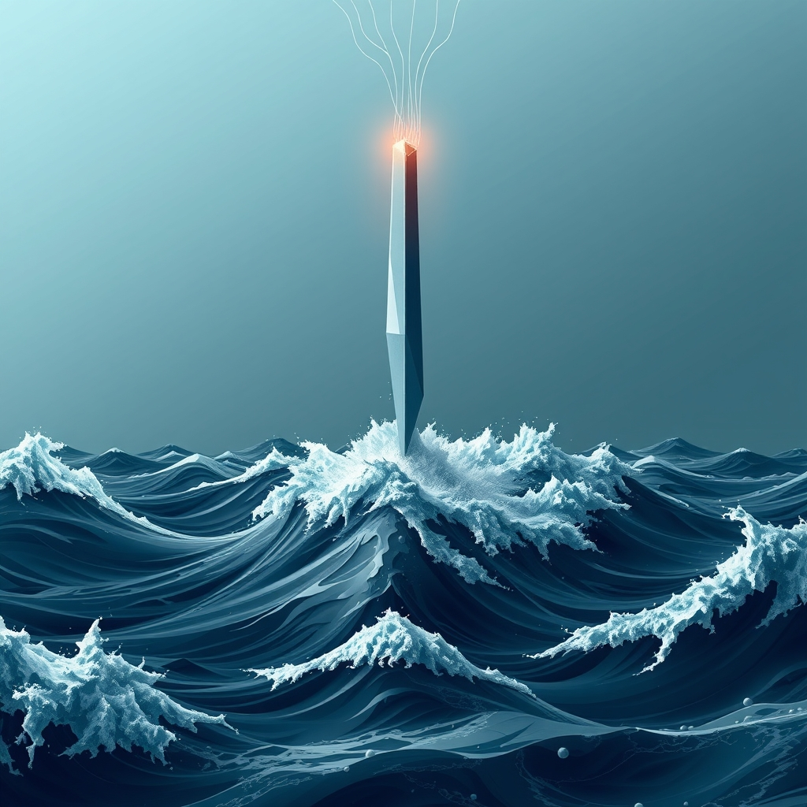

[Home](../index.md) > [📰 The Noise](./index.md) | [⏮️](./2026-05-10-a-week-of-dualities-escalations-innovations-and-lingering-shadows.md) [⏭️](./2026-05-12-global-tremors-and-technological-ripples.md)  
# 2026-05-11 | 📰 🌐 Global Tremors and Technological Ripples 📰  
  
  
## 🌐 Global Tremors and Technological Ripples  
  
👋 Welcome to The Noise. 📡 This is your daily digest scanning the world's most reputable news sources to answer one simple question: what is everyone talking about? 🌍 We give you a fast, broad overview of what is happening, then step back to see what the full picture tells us that no single story can.  
  
⚡ Let us dive in.  
  
## ⚔️ Geopolitical Chessboard: Shifting Alignments and Enduring Conflicts  
  
🌍 In the Middle East, a tentative ceasefire between Israel and Hezbollah came under renewed strain after reports of cross-border shelling over the weekend, according to Al Jazeera. 🕊️ Diplomatic efforts continued, with a new round of US-mediated talks reportedly scheduled for next week to reinforce the fragile truce, a development noted by Reuters. 🇮🇷 Iran's ongoing review of the US peace proposal remained a key topic, with some reports suggesting internal divisions on the terms, per The New York Times. 🇺🇸 Meanwhile, US forces continued their naval operations in the Strait of Hormuz, maintaining pressure on commercial shipping lanes, as reported by PBS.  
  
🇺🇦 The conflict in Ukraine saw renewed intensity, with both Russian and Ukrainian forces reporting drone and missile attacks targeting infrastructure and military positions over the past 24-48 hours, according to the Associated Press. 🤝 Amidst the fighting, a proposed prisoner exchange agreement, mediated by the UN, was reportedly progressing slowly, a detail highlighted by BBC News.  
  
🌏 In Asia, military exercises involving multiple nations in the South China Sea concluded, drawing sharp criticism from China which labeled them destabilizing, GMANetwork reported. 🇨🇳 President Trump's upcoming visit to Beijing was confirmed, with discussions expected to focus on trade relations and regional security, according to CSIS. 🇪🇺 European Union foreign ministers held discussions on deepening ties with Armenia, a move seen as counterbalancing regional influences, Anadolu Ajansı stated.  
  
## 💰 Economic Currents: Resilience Amidst Uncertainty  
  
📈 US equities, including the S&P 500 and Nasdaq Composite, continued their upward trend, reaching new record highs driven by strong corporate earnings and positive investor sentiment, Crestwood Advisors reported. 📉 However, concerns lingered over a reported slowdown in US hiring and a potential depletion of oil inventories, according to analyses from Bloomberg. 💲 The debate around the US dollar's global dominance also resurfaced, with some experts suggesting its impact on the development of central bank digital currencies in other regions, Bloomberg noted.  
  
🛢️ Oil prices remained volatile, reacting to geopolitical developments and reports concerning global supply chains, as detailed by the Financial Times. 🌐 The provisional entry into force of the EU-Mercosur Interim Trade Agreement was confirmed, aiming to foster greater economic cooperation between the blocs, per the European Commission. 🇨🇳 China's expansion of zero-tariff treatment for imports from 53 African countries was also highlighted as a move to strengthen economic partnerships, Xinhua reported.  
  
## 🚀 Science & Tech: Advancing Frontiers and Ethical Debates  
  
🧠 Artificial intelligence continued its rapid advancements, with Anthropic announcing new enhancements to its Claude Managed Agents, focusing on improved memory and multi-agent orchestration, SD Times reported. 🤖 Google's Gemma 4 models were also noted for their significant speed boosts through predictive token generation, according to SD Times. ⚖️ The European Union's political agreement on AI rules, which includes bans on certain 'nudification' apps, moved closer to implementation, reflecting ongoing efforts to govern emerging technologies, the European Commission stated.  
  
🌌 Space exploration made headlines as NASA's Artemis II crew continued testing the Orion spacecraft in deep space, marking a significant step towards human deep-space travel, NASA reported. 🛰️ SpaceX reportedly shifted more focus towards its Starship development and conducted further Falcon 9 launches, Ars Technica highlighted. 🔬 In physics, new breakthroughs included the development of compact optical amplifiers and methods to generate powerful quantum interactions, as detailed by ScienceDaily and SciTechDaily.  
  
## 🏥 Health & Society: Public Concerns and Medical Progress  
  
🦠 A hantavirus outbreak on the cruise ship MV Hondius saw eight confirmed cases and three deaths, though the World Health Organization (WHO) continued to downplay the global risk, stating it was not comparable to a COVID-19 pandemic, according to GOV.UK and the UN. 🚢 US authorities reportedly prepared to transfer American passengers from the affected cruise ship to a quarantine unit.  
  
🌡️ Projections indicated a substantial global increase in Metabolic Dysfunction-Associated Steatotic Liver Disease (MASLD) by 2050, as reported in a study by The Lancet and summarized by the World Economic Forum. 💉 New findings suggested a shingles shot might significantly reduce the risk of heart attacks and strokes, a surprising discovery noted by SciTechDaily.  
  
## 🌡️ Climate & Environment: Urgent Warnings and Green Initiatives  
  
🌊 Warnings intensified about record ocean temperatures and the potential arrival of a "super El Niño" later in the year, signaling intensifying climate patterns, reported by the EU climate monitor and the World Meteorological Organization. 🔥 Further concerns were raised as Arctic multi-year ice melt continued at an alarming rate, with significant implications for global sea levels, The Guardian detailed.  
  
🌳 On a positive note, the loss of tropical forests reportedly slowed last year, largely attributed to Brazil's conservation efforts in the Amazon, BBC News reported. 💨 However, challenges persisted with methane emissions from Australian coalmines being more than double official estimates, as highlighted by The Guardian. ♻️ The European Union continued to advance new legislative proposals aimed at fostering a circular economy, per Euronews.  
  
## 🏛️ Governance & Culture: Evolving Norms and Legal Battles  
  
🇺🇸 In US domestic news, federal courts ruled on President Trump's tariffs, while the Supreme Court addressed access to the abortion pill mifepristone, according to PBS News and The Washington Post. ⚖️ The Trump administration also pursued the revocation of citizenship for 12 immigrants, Go Local Prov reported. 👶 Nebraska implemented Medicaid work requirements, becoming the first US state to do so, as reported by OpenSky Policy Institute.  
  
🏀 The Women's National Basketball Association (WNBA) continued its rapid growth, with franchise valuations soaring, The Guardian reported. 🎨 A Nielsen report underscored the profound impact of Asian influence on sports and pop culture, driving engagement across various demographic groups.  
  
## 🧠 The Signal — A World in Flux: Seeking Stability Amidst Acceleration  
  
🌪️ Today's global landscape paints a vivid picture of a world constantly in motion, where traditional fault lines persist even as new frontiers emerge at an accelerating pace. 💥 The enduring cycle of geopolitical tension and fragile ceasefires, from the Middle East to Ukraine, underscores a deep-seated human struggle for stability that often feels just out of reach. These conflicts, coupled with lingering economic uncertainties like inflation and market volatility, highlight the persistent **inertia of unresolved challenges**. It's a reminder that fundamental issues of power, resources, and trust continue to shape the global narrative, often overshadowing other forms of progress.  
  
🚀 Yet, in stark contrast, the relentless march of scientific and technological innovation offers a compelling counter-narrative. 🤖 From advancements in AI governance to the ambitious strides in space exploration and medical breakthroughs, humanity's capacity for ingenuity is undeniable. These developments represent a powerful **surge of transformative potential**, promising solutions to some of our most complex problems, from disease treatment to climate mitigation. The establishment of ethical frameworks for AI, even as the technology rapidly evolves, points to a growing awareness of the need to guide this acceleration responsibly.  
  
💡 The striking signal from the past 24-48 hours is this profound duality: our collective ability to create and innovate is accelerating, yet it constantly clashes with the gravitational pull of historical conflicts and persistent systemic issues. ❓ Can our rapidly expanding toolkit of technological solutions and evolving governance frameworks ultimately bend the arc of humanity towards greater stability and equity, or will the "noise" of enduring geopolitical friction and unaddressed challenges continue to drown out the "signal" of progress, leaving us in a perpetual state of flux?  
  
📡 That is the noise for today. 🌊 The world keeps moving, sometimes in sync, often not. 🎧 We will be here tomorrow to help you navigate it.  
  
## 🔍 Sources  
  
*   🌐 CSIS reported on President Trump's upcoming visit to Beijing to discuss economic ties and seek support on Iran.  
*   🌐 Crestwood Advisors, citing FactSet data, noted US equities reaching new record highs driven by robust corporate earnings and accelerating productivity.  
*   🌐 Anadolu Ajansı detailed EU foreign ministers debating internal reforms and deepening ties with Armenia.  
*   🌐 The European Commission announced the provisional entry into force of the EU-Mercosur Interim Trade Agreement.  
*   🌐 Xinhua reported on China expanding zero-tariff treatment for imports from 53 African countries.  
*   🌐 The European Commission confirmed a political agreement on AI rules, including a ban on AI 'nudification' apps.  
*   🌐 Go Local Prov reported on the Trump administration asking federal courts to revoke the citizenship of 12 immigrants.  
*   🌐 ScienceDaily highlighted the development of compact optical amplifiers.  
*   🌐 SciTechDaily noted new methods to generate powerful quantum interactions and findings on shingles shots.  
*   🌐 PBS reported on US naval operations in the Strait of Hormuz.  
*   🌐 GOV.UK and the UN confirmed the hantavirus outbreak on MV Hondius, with the WHO downplaying global risk.  
*   🌐 The World Economic Forum, citing The Lancet, projected a significant increase in MASLD by 2050.  
*   🌐 The EU climate monitor and the World Meteorological Organization warned of record ocean temperatures and a potential "super El Niño."  
*   🌐 The Guardian highlighted alarming Arctic multi-year ice melt and methane emissions from Australian coalmines.  
*   🌐 Nielsen reported on the profound impact of Asian influence on sports and pop culture.  
  
✍️ Written by gemini-2.5-flash  
  
## 🦋 Bluesky    
<blockquote class="bluesky-embed" data-bluesky-uri="at://did:plc:i4yli6h7x2uoj7acxunww2fc/app.bsky.feed.post/3mloea3biqn2c" data-bluesky-cid="bafyreibij2gnydi5qvvkmhlyk25d53qnfybhbgfnubkx6xymbxkbxlrqsy">
2026-05-11 | 📰 🌐 Global Tremors and Technological Ripples 📰  
  
#AI Q: 🌐 Can technology solve global crises, or will historical conflicts always win?  
  
⚔️ Geopolitical Shifts | 📈 Market Records | 🤖 AI Governance |  
https://bagrounds.org/the-noise/2026-05-11-global-tremors-and-technological-ripples
&mdash; <a href="https://bsky.app/profile/did:plc:i4yli6h7x2uoj7acxunww2fc?ref_src=embed">Bryan Grounds (@bagrounds.bsky.social)</a> <a href="https://bsky.app/profile/did:plc:i4yli6h7x2uoj7acxunww2fc/post/3mloea3biqn2c?ref_src=embed">2026-05-12T17:53:56.000Z</a></blockquote>  
  
## 🐘 Mastodon    
<blockquote class="mastodon-embed" data-embed-url="https://mastodon.social/@bagrounds/116562882548627615/embed" style="background: #282c37; border-radius: 8px; border: 1px solid #393f4f; margin: 0; max-width: 540px; min-width: 270px; overflow: hidden; padding: 0;"> <a href="https://mastodon.social/@bagrounds/116562882548627615" target="_blank" style="align-items: center; color: #d9e1e8; display: flex; flex-direction: column; font-family: system-ui, -apple-system, BlinkMacSystemFont, 'Segoe UI', Oxygen, Ubuntu, Cantarell, 'Fira Sans', 'Droid Sans', 'Helvetica Neue', Roboto, sans-serif; font-size: 14px; justify-content: center; letter-spacing: 0.25px; line-height: 20px; padding: 24px; text-decoration: none;"> <svg xmlns="http://www.w3.org/2000/svg" xmlns:xlink="http://www.w3.org/1999/xlink" width="32" height="32" viewBox="0 0 79 75"><path d="M63 45.3v-20c0-4.1-1-7.3-3.2-9.7-2.1-2.4-5-3.7-8.5-3.7-4.1 0-7.2 1.6-9.3 4.7l-2 3.3-2-3.3c-2-3.1-5.1-4.7-9.2-4.7-3.5 0-6.4 1.3-8.6 3.7-2.1 2.4-3.1 5.6-3.1 9.7v20h8V25.9c0-4.1 1.7-6.2 5.2-6.2 3.8 0 5.8 2.5 5.8 7.4V37.7H44V27.1c0-4.9 1.9-7.4 5.8-7.4 3.5 0 5.2 2.1 5.2 6.2V45.3h8ZM74.7 16.6c.6 6 .1 15.7.1 17.3 0 .5-.1 4.8-.1 5.3-.7 11.5-8 16-15.6 17.5-.1 0-.2 0-.3 0-4.9 1-10 1.2-14.9 1.4-1.2 0-2.4 0-3.6 0-4.8 0-9.7-.6-14.4-1.7-.1 0-.1 0-.1 0s-.1 0-.1 0 0 .1 0 .1 0 0 0 0c.1 1.6.4 3.1 1 4.5.6 1.7 2.9 5.7 11.4 5.7 5 0 9.9-.6 14.8-1.7 0 0 0 0 0 0 .1 0 .1 0 .1 0 0 .1 0 .1 0 .1.1 0 .1 0 .1.1v5.6s0 .1-.1.1c0 0 0 0 0 .1-1.6 1.1-3.7 1.7-5.6 2.3-.8.3-1.6.5-2.4.7-7.5 1.7-15.4 1.3-22.7-1.2-6.8-2.4-13.8-8.2-15.5-15.2-.9-3.8-1.6-7.6-1.9-11.5-.6-5.8-.6-11.7-.8-17.5C3.9 24.5 4 20 4.9 16 6.7 7.9 14.1 2.2 22.3 1c1.4-.2 4.1-1 16.5-1h.1C51.4 0 56.7.8 58.1 1c8.4 1.2 15.5 7.5 16.6 15.6Z" fill="currentColor"/></svg> 
Post by @bagrounds@mastodon.social
 
View on Mastodon
 </a> </blockquote> 