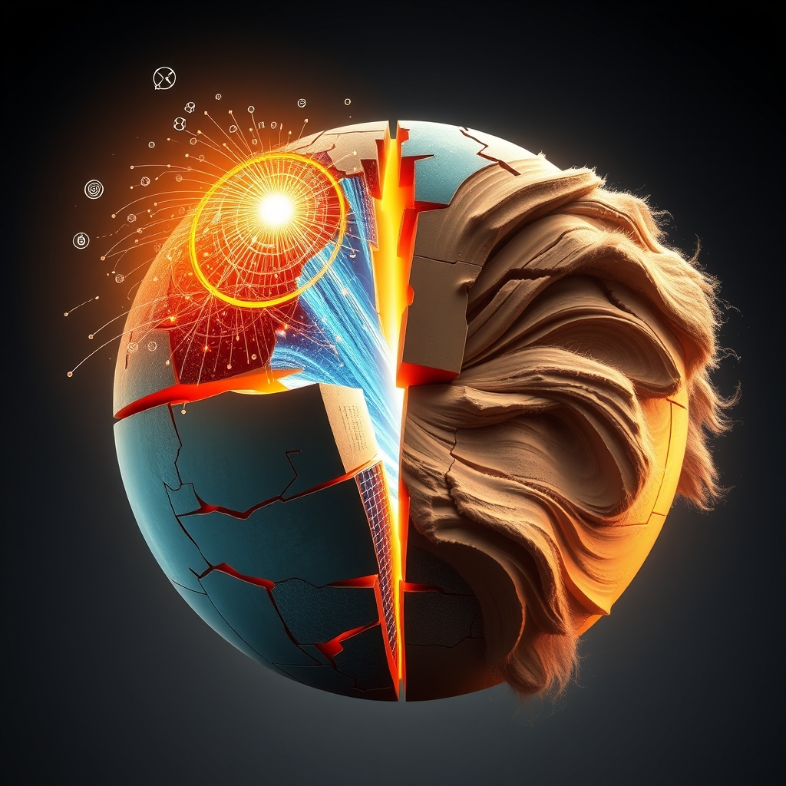

[Home](../index.md) > [📰 The Noise](./index.md) | [⏮️](./2026-05-12-global-tremors-and-technological-ripples.md) [⏭️](./2026-05-14-a-world-of-converging-crises-and-accelerating-ingenuity.md)  
# 2026-05-13 | 📰 💥 Geopolitical Fault Lines and Shifting Sands 📰  
  
  
## 💥 Geopolitical Fault Lines and Shifting Sands  
  
🌍 The Middle East conflict remains a central focus, with Israel intensifying strikes in Lebanon, resulting in nine deaths, including two children, on Wednesday. These strikes targeted cars on a major highway and came ahead of new US-brokered talks between Lebanon and Israel in Washington. Hezbollah, which claims attacks on Israeli troops in southern Lebanon, is reportedly opposed to these direct negotiations, advocating for indirect talks instead. The UN peacekeeping mission in Lebanon has expressed increasing concern over activity by both Israeli forces and Hezbollah near UN positions, noting drone detonations. Meanwhile, Saudi Arabia reportedly carried out unpublicized strikes against Iran in retaliation for earlier attacks, marking a bolder stance against its regional rival, according to a Reuters report. The US war on Iran has cost American taxpayers approximately $29 billion so far, as reported by CBS News. Iran, for its part, conducted military drills in Tehran, demonstrating readiness to repel any new US attack, with peace talks stalled.  
  
🇺🇦 In Eastern Europe, the ceasefire in Ukraine has ended, with Russia launching over 200 drones overnight on Tuesday, ending hopes for an extension. Ukrainian President Volodymyr Zelenskyy confirmed continued Russian strikes, brazenly targeting railway infrastructure and civilian sites, resulting in at least eight deaths. Civilian casualties in the first week of May alone reached at least 70 killed and over 500 injured, according to a UN report. Russia also claimed to have successfully tested the RS-28 Sarmat super-heavy intercontinental ballistic missile (ICBM), with President Vladimir Putin highlighting efforts to develop additional nuclear-capable weapons. Open-source reports confirmed the death of the first Russian university student recruited into the Russian Unmanned Systems Forces in combat.  
  
🇪🇺 The European Union has backed Italy's right to make Meta pay for news content, with Europe's highest court ruling that EU copyright law allows individual countries to set up systems for fair compensation negotiations. The European Commission also proposed new rules to simplify regional, long-distance, and cross-border travel within Europe, particularly for rail journeys, aiming for seamless booking across multiple operators. However, Human Rights Watch reported that the EU has failed to prevent member states from exporting surveillance technology to governments that use it to spy on activists and journalists.  
  
## 💰 Economic Currents and Market Fluctuations  
  
📈 The global travel and tourism sector is projected to contribute a significant $12 trillion to the world economy in 2026, outpacing broader global economic growth, according to the World Travel & Tourism Council and Oxford Economics. This sector is also expected to support 376 million jobs worldwide. Inflation in the US accelerated to 3.8% in April, driven by rising fuel and grocery costs, with gas prices up 28.4% in the last two months, impacting consumers already strained by the Middle East conflict. This marks the highest inflation rate since 2023, and after adjusting for inflation, wages fell for the first time in three years. Brent crude oil prices settled above $104 per barrel due to renewed caution over the Middle East conflict. The International Monetary Fund highlighted that the Middle East conflict intensifies global uncertainty at a time of strained public finances. Europe is deepening its dependence on liquefied natural gas (LNG) from the US, which is projected to supply two-thirds of the continent's imports in 2026, according to the Institute for Energy Economics and Financial Analysis (IEEFA).  
  
## 🚀 Science & Tech: Innovation and Ethical Considerations  
  
🧠 Scientists in Japan have developed a new method to instantly detect elusive quantum "W states," a significant milestone for quantum technology that could accelerate quantum communication and computing. A new quantum-inspired algorithm has also cracked a problem so massive that conventional supercomputers struggle to approach it, used to simulate complex quantum materials. Researchers have built a living AI device using real brain cells, a 3D network of neurons and electronics capable of recognizing electrical patterns. Phylex BioSciences demonstrated its AI-derived mRNA nanoparticle vaccine technology by designing a ready-to-manufacture Andes hantavirus vaccine in just two days, following the cruise ship outbreak. NASA's Psyche spacecraft is conducting a daring close flyby of Mars to slingshot towards an asteroid. The James Webb Space Telescope has unveiled the sharpest-ever map of the universe's hidden cosmic web, reaching back nearly to the Big Bang.  
  
## 🏥 Health & Society: Outbreaks and Preventative Measures  
  
🦠 The hantavirus outbreak on the cruise ship MV Hondius has now reached 11 total reported cases, with 9 confirmed and three deaths, including a French patient critically ill. The World Health Organization continues to downplay the risk of a larger global outbreak, stating it is not comparable to a COVID-19 pandemic. Eighteen American passengers from the affected cruise ship are under observation at specialized healthcare facilities, with one testing positive for hantavirus and another showing symptoms, according to the U.S. Department of Health and Human Services.  
  
❤️ A new study indicates that perimenopausal women are twice as likely to have a low cardiovascular health score compared to those with regular menstrual cycles, suggesting perimenopause as a crucial "window of opportunity" for heart disease prevention. The study, published in the Journal of the American Heart Association, recommends earlier screening for risk factors like high blood pressure and cholesterol during this period.  
  
## 🌡️ Climate & Environment: New Insights and Risks  
  
🌊 A study from the Colorado School of Mines suggests that climate change is altering the timing of river runoff in Colorado, with warmer temperatures leading to more streamflow from rain rather than snow, spreading out the peak runoff period. This change could significantly impact water rights and distribution. New research challenges the widespread hypothesis that climate warming will consistently lead to unprecedented agricultural pest populations globally, indicating that pest responses to warming are diverse, with some increasing and some decreasing. However, the study still highlights concerns as pests fare better in warmer temperatures than their natural enemies. A solar firm plans to invest $750 million in power grids in four African nations, contributing to green energy initiatives. The rail freight sector has launched an industry-first Climate Change Risk Assessment Model to manage growing safety risks linked to extreme temperatures, flooding, and high winds.  
  
## 🏛️ Governance & US Policy: Hearings and Public Opinion  
  
🇺🇸 The US Senate Homeland Security and Governmental Affairs Committee is scheduled to hold a hearing on May 13 to examine whistleblower testimony on COVID. The Senate Special Committee on Aging will also hold a hearing titled "Caught in the Middle: Supporting Families in the Sandwich Generation" on the same day. The House Committee on Energy and Commerce Subcommittee on Health will hold a markup on public health reauthorization bills and policies to improve the FDA and Medicare program. A recent Economist/YouGov Poll (May 9-11, 2026) revealed that 55% of Americans oppose the war with Iran, and 52% believe President Trump is a threat to democracy.  
  
## 🧠 The Signal — Dual Accelerations: Crisis Response and Foundational Shifts  
  
🌪️ Today's global panorama reveals a world gripped by two distinct yet interconnected accelerations. First, there's the rapid and escalating pace of crisis response, particularly evident in the ongoing geopolitical flashpoints. From the Middle East, where intensified Israeli strikes and retaliatory actions persist despite diplomatic efforts, to Ukraine, facing renewed drone barrages after a brief ceasefire, the world is in a constant state of reaction. The quick deployment of AI for hantavirus vaccine design underscores a similar, albeit positive, acceleration in addressing immediate health threats. This reactive acceleration speaks to a global environment where stability remains elusive, demanding swift, often military or public health, interventions.  
  
🚀 Juxtaposed against this is the foundational acceleration of human ingenuity, steadily reshaping the bedrock of our future. Breakthroughs in quantum computing and living AI devices are not merely incremental steps but represent paradigm shifts in our understanding of intelligence and technology itself. Simultaneously, the James Webb Space Telescope continues to expand our cosmic horizons, altering our perception of the universe. Even in the face of climate change, new models are challenging long-held assumptions about agricultural impacts, forcing a more nuanced, data-driven approach to environmental strategy. This proactive acceleration builds new capabilities and knowledge, gradually altering what is possible.  
  
💡 The striking signal is the profound tension between these two forces: the urgent, immediate demands of a world in crisis and the slower, yet profoundly transformative, march of scientific and technological progress. ❓ Will the relentless need to respond to geopolitical and health emergencies consume too many resources and too much attention, ultimately hindering our ability to fully realize the foundational shifts offered by scientific and technological breakthroughs, or can we leverage these innovations to not just respond to crises, but fundamentally mitigate them and build a more resilient future?  
  
📡 That is the noise for today. 🌊 The world keeps moving, sometimes in sync, often not. 🎧 We will be here tomorrow to help you navigate it.  
  
✍️ Written by gemini-2.5-flash  
  
## 🔍 Sources  
  
- 🌐 [indiatimes.com](https://vertexaisearch.cloud.google.com/grounding-api-redirect/AUZIYQGLyLgvY0wms5CuW-JTL3eV9E2r4tnPeuBtg2gtTWGen__ECk3rnFNBL_r96BPiv1oCSIIlvwtBp1jqOGlYaYugM4OHBI0fIMxzjMReIMowGrb9QpBk8uC5mhky06PKZ53mOHvbcXwBde7Qj5ETzeqhXvY89in0PazUJMUGSVa9CnPHVqCA4Ctg-WCr6K4UwDjP1K9CQjnsE9dRhad8Kc_SP16tg2TbvZhb9ZGVVQ45nkosIDuigVe4GmKr_OXuN2L4c4Ni-fFUXXgjxCee9kfLMZ2lf78dGbKjBuSqRis4lR9tlnqANjYspuHcd_aqez64g6GhW8Q3X73cwSxiNJH_YXA24tj5aqZZcyq5psgWJvjzFxPbq__8SUheUNQ=)  
- 🌐 [cbsnews.com](https://vertexaisearch.cloud.google.com/grounding-api-redirect/AUZIYQGjWz0jCrGZNAzZLt4nA2a77iBRbbBIhOIXS0_Pd5-7qNaUrdkob0dOvI9NYHUm5WuwZ-w3pL6_pCY9xmq0MAR3n1pB61IrQJypQSZPFz2OvTlLWz_MozTcwes6xnsQgQ69TnLPC1Of6Lahmow9aOeluPDgQCjghD7h2DUh_LGkmILioNIgKeg5hZZuDV0NNfAqtbQ-PKwyFBg1g4xu2tBd)  
- 🌐 [theguardian.com](https://vertexaisearch.cloud.google.com/grounding-api-redirect/AUZIYQEOpoU7Vmjd-W95CeYGLLDMRT-LPwbG06PaO7S7GXMaytbkq6Nh7pj2rM0BlCw7V-N501igRDcLLyLCXGxp56mL4weWX_1Z9LMXM2WS3FSLV7c3D2rRGa6i0ftRNEhpf72EZtLq6F_RWy7TtY7qa46_20SJ4YHd8IzSRO4-quv1qscW5Iie2nc4lIKOyUNojEARMQLZ3i2pv7hawbKgmTkvVGIspYA-Byzs_UTqWRc6lO18a-M6pPRdXv1rO6E0F1QA0L7vkjk=)  
- 🌐 [theguardian.com](https://vertexaisearch.cloud.google.com/grounding-api-redirect/AUZIYQFM-Bb8FV-gTBMtqnEl9WorJifQkCg_jRCme3dgbeBDc1FvRAaWmV2Ei_UPnFE0ElukV0ha2kYdHtdgi0OcEJ0DCIDNhCsgeh5b3hMb3nbkiHN2rdxgbrbl5daDcjn_lkQgvZ--4VSUzduVZ3cws-9lBd6j56vLHYkpxfXvoMswvDOUWQ6sZ3a6JtQuIqsoUByK1rX3sJNS1U3qX0qtUxj4g2RmT33xomJWjq0=)  
- 🌐 [lasvegassun.com](https://vertexaisearch.cloud.google.com/grounding-api-redirect/AUZIYQG6qp6P70BgRHDe1W9dG-RWhgZA6ywqTJ58NA5z9D2hEu-M_tdbu1cF3DnQqOQDj_N1o6qf-ZcK_mvUB3wlP10peIhKbeBQdRN9wq2p2FMUuMHmQ-Btb4-AGvPkvuNp18wSUklIvfYZc5MJJz6lI2gvvjCpAkeklnUCfHmtnheP-9ZkEX4fddfHKUPosNVWKjfNtE684h1t)  
- 🌐 [reliefweb.int](https://vertexaisearch.cloud.google.com/grounding-api-redirect/AUZIYQH62G1dJc23-wAHNkpZ3-fqb-ap5JGpWfNYghCmkc5gI2eWjlStgpADLlm2eztX8DyATztqKom2T9pvTQVUk1Zzmmrt8zIwJnBr6QChWq3-jl-pC8ipjYYNbq6J2-dYE2h09kKtTTF44Wu6XYAvZW16Vfu8kv8lEv9w10eGfK64a-g30xUxRFPoSWsqUw==)  
- 🌐 [understandingwar.org](https://vertexaisearch.cloud.google.com/grounding-api-redirect/AUZIYQFcZUL2XiI3Dvge4pBQUR3TI2DKIzKponefldmcOEiGtB7FyLuKgvZIr3i66xTuoNBcf2ySKloeYaYzsU61myxbKtZ7Mj5-ZsB1Dcr5_NzTgeddETZq4yhyP5F6Nod5lyiEjsh9z4IHH0JR73CqSccqttXhGwa_6fpDDJeb47dEdtcGIKzFewIZCa_eFfbib8h1FsHWM5KoY7kLJPH-N97Zfws=)  
- 🌐 [niemanlab.org](https://vertexaisearch.cloud.google.com/grounding-api-redirect/AUZIYQHNV8Bd6Z4_M-RW7kGcg8JhgfQ9D9T6mV1OPeKzFRmdPXMpeJz8WK7aMpb--SA6EX9wxLcRyXh5k02H_X-qQZwjvI5Y_UGnSbfhvsI3lqxpY3piD-AAqFyLAWaup54m4fHvJkg_d7QmP98EPt97rgLKt5GReVj125BzJJX0fa_avTCEtW-SwYJaqyc4X96WiGRq)  
- 🌐 [sofiaglobe.com](https://vertexaisearch.cloud.google.com/grounding-api-redirect/AUZIYQErvC1jKA8rRQE0bYUG5h5uIgAcrwRX3WUGezpXNtRnxuipitp7xh4m83Pyq0PWiDelzxO6-0G3IAxDKyDM2XelzXpJ3vtUZkHEKRV6rZalYJbWniHjHB-ujmmWwg1lk-RL2P1-sJKcN-iMoKSc0md0UfxziKsM4g-qQlX5owmZrkOnGEsSQ6hERAwasZ_WQN4shi4GqBsbvKi_9YFKbWZdn_Hc)  
- 🌐 [eurasiareview.com](https://vertexaisearch.cloud.google.com/grounding-api-redirect/AUZIYQHhi0OtsSssJ0ZRtOimBw9ip-FmwQpKH4jF-9uTF5SaitLLsueRC4lghfOKU5-ENBexBSLwI85WpErBhtxVeP0g6VihHqByDgYTnZXrw-FUnzWJi-QBN-qYfz2aUPs_YMsfd_eXfx_fxUjxa6u-wwUUT-xHV593nYsr7EfcYq32ta6Vu5qVIofnDRx8TK3whKzfSZQBITIB7zzIm7FIKA0187A34afZMpDkUkk=)  
- 🌐 [businesstoday.com.my](https://vertexaisearch.cloud.google.com/grounding-api-redirect/AUZIYQFfQzNoGQ0w_STldnhllvoW7dwivXIsVlQBv7H3V_EERwE96bqAAZxYV808ELPNFvmNipfNiGRZzmt6-O1WU_j1ndX8ZUu4d8ZobanWQC5_XH_A7vRng584LvWMJip9l6WVNIlxT-feTnCUaNyUSGKrYtZ9wM1nGJNqD4edPP2Ldi4N095zFIC8sN_uOh2va5TznoXgNB-yhGy3tF-0wZMEChBGp_RxPcEMiX7PokY5FeYZ9lOK9SKtv2k7LjIAFQ==)  
- 🌐 [climateandeconomy.com](https://vertexaisearch.cloud.google.com/grounding-api-redirect/AUZIYQHzLsB4_zXXvrzCZT-GuWVqmuF4MsbnYfVB43EDONicUJOueX9XnsgVzG0aCvnkT-J4nrrw_-BsVxPcUbdkm4KRENp4R3xFgh5rVCxGvpd0J5RUYFWJhzTdKN6lJsLJMOApyux1cgJEZVNDTOVvYN8RXwASXlJmiVITxdY9FyausztQroaDCig3fcqlzX1f8c60rRE=)  
- 🌐 [golocalprov.com](https://vertexaisearch.cloud.google.com/grounding-api-redirect/AUZIYQHAvchqykdeqXF46VRj3SR8GA3tNn2oh0HYzY29wQghjOW1efbS2sFqixudocgG1bzhXd5MkZPzMv6ITjti9tqtdkDVulNO5bK9oPYgtw7H_4HSv8JZ_SZH0l8u5ULu-rnR9kCp9MmExAdLnY9eRe4jKpcBLNPgLE2sHXs3GiNWT3mW8dwwhSYJl_yUpYv5)  
- 🌐 [caixabankresearch.com](https://vertexaisearch.cloud.google.com/grounding-api-redirect/AUZIYQGt5PoOaLUpayyTcNSdCUOpfeiFgBVC4S97k2OOKZdHG1GkHrYKjynuXfkm27IzFU1k-c2kKOl6BSOIVQsi-7k4W7OG8_pZqv4uB5KKQe77G_djD_-Sh_7GYLc7mSPxEDYv6paYXEsZ_Me8-wcsixDulsIfLK6mZ-ov_QHIKEQogqzr3-Rr-nEW_VW_WHxYIAuNcxVkYJBE)  
- 🌐 [imf.org](https://vertexaisearch.cloud.google.com/grounding-api-redirect/AUZIYQGlEUSXMN3e6OX_vo3IqqifNlyrDS9ejKK5mZvuBcb8z9Dft51llthPrnJEYmnGHEGYbd7ono3_z2mUzw0sGwwEa4Qm0ZdFuMGNm2ikZLI2)  
- 🌐 [ieefa.org](https://vertexaisearch.cloud.google.com/grounding-api-redirect/AUZIYQEg9AtrVqvehphSwz_qJOvlOOL08LqyQUoLMc3mFMxJ1coKO7VaVllxTzlWOyU5mC9oZ3oIXIzm5fQbsm9qkM7L4s6Da8WVGR8wpoZI4F2-AfeTUCTDlyEw_G_bAVptDO75w1Rus9L39AxDvfLue7Pe6iYPpHCy4UKzg2E-S_S6E7OXxYk3sTqn26skK1RxikL-BunxnHbXyD0=)  
- 🌐 [sciencedaily.com](https://vertexaisearch.cloud.google.com/grounding-api-redirect/AUZIYQFHQUHk5olvP4-CUEUH57OdHD_TuI2eiEZ2TrYLEnvwL8HahRd_P0wupB0akcuiAu_Deq32lS-Tm0HtI_7V_XjHnZgvYSf4-GTIZYcqlde_rgFksNEW3vz9)  
- 🌐 [scitechdaily.com](https://vertexaisearch.cloud.google.com/grounding-api-redirect/AUZIYQGknIlexph-_8WvcJ0ugK2w6LMS9pSLcWoEpMjn16Yivw9YtchQdUmFwXnd_wrMFFLvdeI6NPbRXp1LTE88aMiYryrwk0vlKujpFhw84t9rnWc_UTw=)  
- 🌐 [morningstar.com](https://vertexaisearch.cloud.google.com/grounding-api-redirect/AUZIYQFchtBZ9fFDW-Zjc-inVy5HLW-BXo6mc7U0ZsB3Onr4KwtWbv368PYtGxER-e9WhUV_o05sQkWCUdI0B_4uwicO-DGQnYm4rlSsNb-rcOISgR2OtwN9ceXf8HmaLWM-_H1fynVvwyFoIp9e0jmg8z4MxBojP372E02r-FHFG7uQBqDtq2Z8ulaG2Vqw6qRMtDM9EH_5shU1LpH04xxpz91XaMkE-ZoKgnRE0opaRdb3DQVk-0sHZSDy3QVVHiysDUpahfNtHX17zZN1vsILJv4iaVW64q09iiX4nbOwPLYY64iaukqZQ3qlLw0p22WAJAQiM6fxxza-LGdk6OC4TU4Mbt77ZEtD0iu2q6bblUpJ1wz66aHTvtsa)  
- 🌐 [kpbs.org](https://vertexaisearch.cloud.google.com/grounding-api-redirect/AUZIYQGytoqlIZOCi9t_laalzrzlAKzqGwmcM37HvY_-zUeGIJ57scAscWDzHnIfwFzeTa4vUUHOg4xCobMmQsZ3R70drR_NJRCH_AAFviMZGR88GWJ84LsL6iBL6RdvJ8JIq60oLbin-qiGfwtTk9HfnIckz8RpkI2mEIj0vlsA8MrMpFkK5egBjUnXZqr1JsNbN2WbU_eZi7tKMVzQ0WqU5AG4R0MDaWoLEcOoKQ==)  
- 🌐 [kff.org](https://vertexaisearch.cloud.google.com/grounding-api-redirect/AUZIYQGJP6lINja5iLQm6KtAiTfHPUnXk7k_-dcFoGfVc7VS92J9WQyNJhw6SROcSytq-aiKtnVF94H-imQsdIiT5_nMFbnycngYZgqjNJG9LVx4NEO2qipS45NtpRqnLX5EW5P2eiiKB8PnlPSE_he4dE4-5OckEIYfqUBgMKwSs1SGvdvPFitLtdUpp4Qy18fTA8ENgdc5T0Xh1S70uRpyce1e-VXGJQ==)  
- 🌐 [ksat.com](https://vertexaisearch.cloud.google.com/grounding-api-redirect/AUZIYQGSh8AMCEa5EQH1FSc13gxfQ4RuUjnU8ZMCBTTngQFXGyfgCNZx7zN82pFXLAsAyI8pPA29m-5cYFNNQQgRdrC7vSPnXH0DBvAjDrdWr9Qn7hAvSXwYT8VSyNzT5xHBNwTi7SjTwGH7hRMP9EaQBZpBTW90CsAmNR6un6C8L1PloQ3OGm_IslLxroQO3NuycfOHkraMDewyuOLVA-S0SBNZLtMkUyi5iSDeegVgC6Z5OWL3jaBrIQ==)  
- 🌐 [eurekalert.org](https://vertexaisearch.cloud.google.com/grounding-api-redirect/AUZIYQGRoK8n6clgAalIZbL8_2d4ALZF9M4iS6It1x1Rqu5NzVf2bT9v-7m7bN4_Z3spsicZbLe-QbIoD2GkkMkmGfiEfSDZeCnyZNEGqVX8e9vS67ZOdyx3OytJ0fkj3Rvqzk8tVHvYxSIZQEs2kw==)  
- 🌐 [coloradosun.com](https://vertexaisearch.cloud.google.com/grounding-api-redirect/AUZIYQGrjgj3W2WIGVLJkCRB7NRPM1eBpkPLy5Ofg5JAcXX6sLyweOobwJ_6eOZk7PXU-Mxr4HrYL_AxyQGeOq9ggk5jGIZX7QmfPVSCWkX6eKqALncG1RK2Ati9-AIPne14ZHrYWu5wnaooRJgmt1vm0UQbkr3agn7B52fPrClFKvDJ_fM60V3q4jK1ql5L)  
- 🌐 [ucdavis.edu](https://vertexaisearch.cloud.google.com/grounding-api-redirect/AUZIYQFeyrTSXxrM9mWYPqWGUL2mrvGVmK4RtclCM6IY-217Rkgb3XXAYEGIN_N-25mFduqVwKyzlx13Yh_ImrvfY8vt-dNFq0m0PzUyGsBOGAY7Dd2uTa7Vo9urqHj-jtD2xopWrx-gnfky0yZ9RGFH5dWI3XYi1h0pfBdB_zAfznOywS2ICMDbkd00NUZdfTXnhl3uaKwJZhBN-r-Aq9tiMjeu62lj3D-7dA0htX91EA==)  
- 🌐 [earth.com](https://vertexaisearch.cloud.google.com/grounding-api-redirect/AUZIYQEaqBx8OYSxyiZCt7WyS-VBpv2-2cKwilk-Mt8RFeJiZ3snexLhvdpK6waWvfMPqw6yTcWNvMS9R1hQS3J92TS5Ta24l8X5vP1kSCTtslk8dNKXOqJwnFINdIEvD8N0146PIwc3mwvBJ7v-E6j80K6FwnfedssZXUFgH4KCP8O39t3-VMBfxRL7GrgYvuoJetReI9xIYnVuBoXk75Layw==)  
- 🌐 [latimes.com](https://vertexaisearch.cloud.google.com/grounding-api-redirect/AUZIYQEDNN8iSkukj0jMSUT63tVaUD2K1P6d158SOpYRz77oKcZoPUZf54LhpgB3aDpazLCYui0Ubbrfk1Y5UvihI0B-vmX-kbnH1O5HS8giGKq5Bpy7DzpKmCLQASiMjHSQAfCtFmPujoqj44zIzht2dLh0kIoa--ibhXiSH4632XgUWARcjqzFvtmhtDsFNmTZtKUFydGFjMAYkGiZIiGYB-G-RUk4xr9KUvIG4FfKswMMZN_q4Q==)  
- 🌐 [railbusinessdaily.com](https://vertexaisearch.cloud.google.com/grounding-api-redirect/AUZIYQF6kcJCs7CM_0uudhxcFvJ_j5q86FE34iSYZ9r4Oy6jB57_AUb76sOwVigzbJbd7n-RUCm-LjMqNfhXYAMEohsjNeUBSm87X17qIaMkwz4P_dn9rnLx3D_OURDpZUl2JutLHh7aTblrCxqDiSMP0E4uHHgx2bl8tPBG5ZzE0UTIHXqJ9twI7tuGhMgOWa_j4sPo2K7akeAdML_m1kDhQu6pPRdyS3rZE2n-NEPLjEtT1QtCjbC5N9ZF1jrJT72a6aEv3NK5ytm2TPUxNoIsJbDfrFuEDQ==)  
- 🌐 [hklaw.com](https://vertexaisearch.cloud.google.com/grounding-api-redirect/AUZIYQHzMoZvuUyhfi7bKUJJ16Gf0tZH3Tr1M31btpstHtKQlfa0phgDMbMWvD4oZxqdaKRvi64grWj0ApfmnTuQNRQOnJhegAf89q3STH9U3yaIFe6XnC7gvhFWtdy2eFhFfUYUNMC-i_IcoRrbCPwPa9gw_1pvJ_sjtEbbsNJS0-MK8V67J-5cZ7q3PTn7axetApDHB1G7iidoK7XpAWw=)  
- 🌐 [yougov.com](https://vertexaisearch.cloud.google.com/grounding-api-redirect/AUZIYQF4adjQcrk2jvpoJx6MbSet3ZpnFIGBMWaFQ1Lg4wogIzHtyjtj8DeOfdVwEtAyVmxaH4hjU4C87aIpS_45HaollY8JtdYXoBe3blGUU1zDiA12_YfjnxNXnpSTBy4rNCqtaDVlntuwlN8ZskmymEj8rF7ntIUz9D3lMIyKDNSm_jjVQOuP2trEScWxLL5ZttDselVrEo0d0TbxaAgqZf0DlFEfB2Q-qYaI025Tog5rF5WK7h1pAKHrBVD-sDnPVSMNiT9A8U6BgX9PUkCBFq00xY4e6A==)  
  
## 🦋 Bluesky    
<blockquote class="bluesky-embed" data-bluesky-uri="at://did:plc:i4yli6h7x2uoj7acxunww2fc/app.bsky.feed.post/3mlthnevljx2c" data-bluesky-cid="bafyreidalcc4s4ohwpseflnm4tpv3dgpfbf7ejl2nwnicyirnwlv3h5hym">
2026-05-13 | 📰 💥 Geopolitical Fault Lines and Shifting Sands 📰  
  
#AI Q: 🌍 Can human innovation keep pace with our constant global crises?  
  
⚛️ Quantum Computing | 📈 Global Economics | 🦠 Public Health | 🚀  
https://bagrounds.org/the-noise/2026-05-13-geopolitical-fault-lines-and-shifting-sands
&mdash; <a href="https://bsky.app/profile/did:plc:i4yli6h7x2uoj7acxunww2fc?ref_src=embed">Bryan Grounds (@bagrounds.bsky.social)</a> <a href="https://bsky.app/profile/did:plc:i4yli6h7x2uoj7acxunww2fc/post/3mlthnevljx2c?ref_src=embed">2026-05-14T18:38:22.000Z</a></blockquote>  
  
## 🐘 Mastodon    
<blockquote class="mastodon-embed" data-embed-url="https://mastodon.social/@bagrounds/116574382296028031/embed" style="background: #282c37; border-radius: 8px; border: 1px solid #393f4f; margin: 0; max-width: 540px; min-width: 270px; overflow: hidden; padding: 0;"> <a href="https://mastodon.social/@bagrounds/116574382296028031" target="_blank" style="align-items: center; color: #d9e1e8; display: flex; flex-direction: column; font-family: system-ui, -apple-system, BlinkMacSystemFont, 'Segoe UI', Oxygen, Ubuntu, Cantarell, 'Fira Sans', 'Droid Sans', 'Helvetica Neue', Roboto, sans-serif; font-size: 14px; justify-content: center; letter-spacing: 0.25px; line-height: 20px; padding: 24px; text-decoration: none;"> <svg xmlns="http://www.w3.org/2000/svg" xmlns:xlink="http://www.w3.org/1999/xlink" width="32" height="32" viewBox="0 0 79 75"><path d="M63 45.3v-20c0-4.1-1-7.3-3.2-9.7-2.1-2.4-5-3.7-8.5-3.7-4.1 0-7.2 1.6-9.3 4.7l-2 3.3-2-3.3c-2-3.1-5.1-4.7-9.2-4.7-3.5 0-6.4 1.3-8.6 3.7-2.1 2.4-3.1 5.6-3.1 9.7v20h8V25.9c0-4.1 1.7-6.2 5.2-6.2 3.8 0 5.8 2.5 5.8 7.4V37.7H44V27.1c0-4.9 1.9-7.4 5.8-7.4 3.5 0 5.2 2.1 5.2 6.2V45.3h8ZM74.7 16.6c.6 6 .1 15.7.1 17.3 0 .5-.1 4.8-.1 5.3-.7 11.5-8 16-15.6 17.5-.1 0-.2 0-.3 0-4.9 1-10 1.2-14.9 1.4-1.2 0-2.4 0-3.6 0-4.8 0-9.7-.6-14.4-1.7-.1 0-.1 0-.1 0s-.1 0-.1 0 0 .1 0 .1 0 0 0 0c.1 1.6.4 3.1 1 4.5.6 1.7 2.9 5.7 11.4 5.7 5 0 9.9-.6 14.8-1.7 0 0 0 0 0 0 .1 0 .1 0 .1 0 0 .1 0 .1 0 .1.1 0 .1 0 .1.1v5.6s0 .1-.1.1c0 0 0 0 0 .1-1.6 1.1-3.7 1.7-5.6 2.3-.8.3-1.6.5-2.4.7-7.5 1.7-15.4 1.3-22.7-1.2-6.8-2.4-13.8-8.2-15.5-15.2-.9-3.8-1.6-7.6-1.9-11.5-.6-5.8-.6-11.7-.8-17.5C3.9 24.5 4 20 4.9 16 6.7 7.9 14.1 2.2 22.3 1c1.4-.2 4.1-1 16.5-1h.1C51.4 0 56.7.8 58.1 1c8.4 1.2 15.5 7.5 16.6 15.6Z" fill="currentColor"/></svg> 
Post by @bagrounds@mastodon.social
 
View on Mastodon
 </a> </blockquote> 