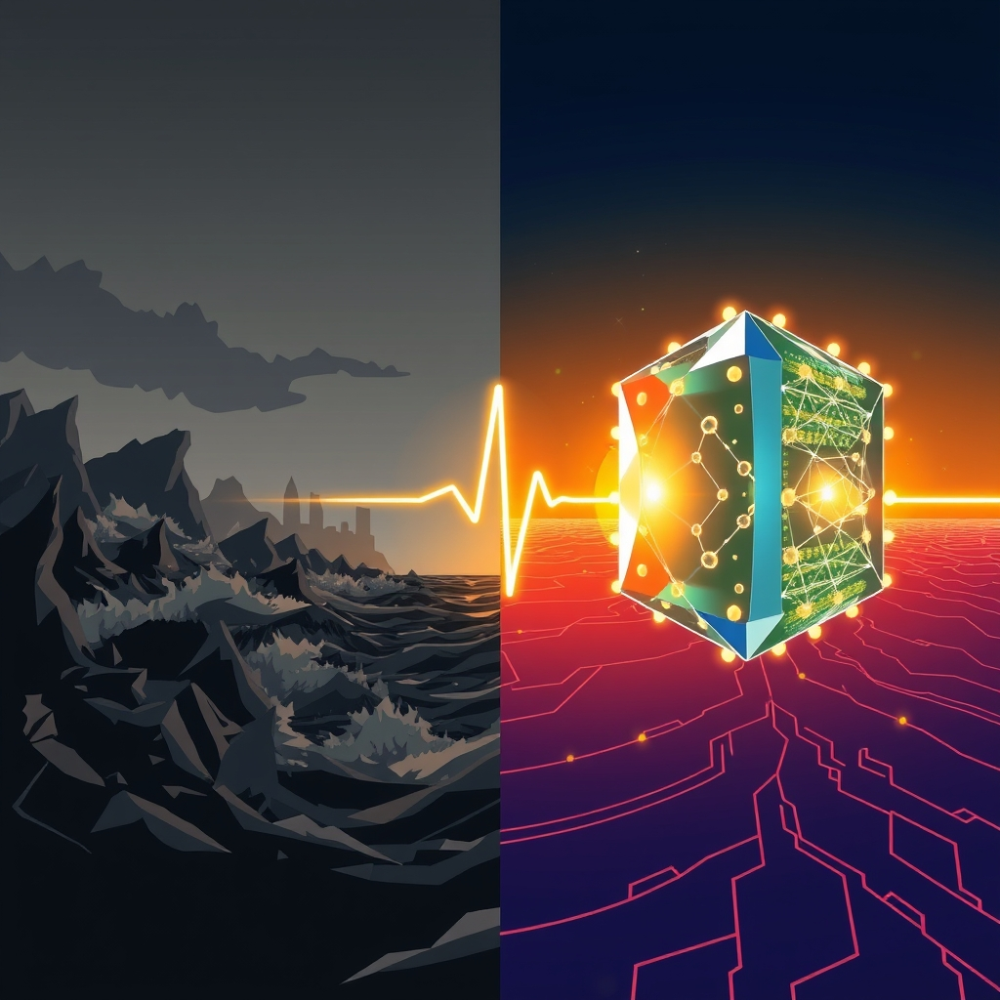

[Home](../index.md) > [📰 The Noise](./index.md) | [⏮️](./2026-05-13-geopolitical-fault-lines-and-shifting-sands.md) [⏭️](./2026-05-15-diverging-paths-geopolitical-friction-and-frontier-innovations.md)  
# 2026-05-14 | 📰 🌍 A World of Converging Crises and Accelerating Ingenuity 📰  
  
  
## 🌍 A World of Converging Crises and Accelerating Ingenuity  
  
👋 Welcome to The Noise. 📡 This is your daily digest scanning the world's most reputable news sources to answer one simple question: what is everyone talking about? 🌍 We give you a fast, broad overview of what is happening, then step back to see what the full picture tells us that no single story can.  
  
⚡ Let us dive in.  
  
## 🌐 Global Flashpoints and Diplomatic Fences  
  
🇺🇦 The conflict in Ukraine saw a massive escalation, with Russian forces launching 731 aerial assets, including Kinzhal aeroballistic missiles, Iskander-M/S-400 ballistic missiles, Kh-101 cruise missiles, and 675 drones, against Ukraine on the night of May 13-14. Ukrainian air defenses reportedly destroyed or jammed 41 missiles and 652 drones. 💥 Attacks primarily targeted Kyiv, causing injuries to seven people, including a child, and damaging residential buildings and infrastructure. Poland's President Karol Nawrocki stated that Russia's war against Ukraine directly challenges the entire Euro-Atlantic security order, according to United24 Media.  
  
🇮🇷 In the Middle East, a Reuters report indicated that US intelligence assesses Iran has regained access to most of its missile sites, launchers, and underground facilities, despite public portrayals to the contrary. 💰 The war with Iran has cost the US approximately $29 billion so far, as reported by Anadolu Ajansı. Kuwait issued a formal protest note to Iran over an alleged infiltration incident by the Islamic Revolutionary Guard Corps, which Iran called baseless.  
  
🤝 The third round of US-hosted talks between Israel and Lebanon is scheduled to take place in Washington D.C. from May 14-15, according to Stratfor.  
  
🇨🇳 US President Donald Trump is scheduled to meet with Chinese President Xi Jinping in Beijing from May 14-15, with discussions expected to cover semiconductor exports, AI competition, global tariffs, and rare-earth supply chains, Informosio reported.  
  
## 📈 Economic Headwinds and Tech's Resilience  
  
💲 US inflation accelerated to an annual rate of 3.8% in April, the highest since May 2023, according to the U.S. Labor Department. This increase was primarily driven by a 17.9% jump in energy costs, with gasoline prices surging 28.4% over the past two months due to the ongoing closure of the Strait of Hormuz. Producer Price Index also climbed 6% year-over-year. After adjusting for inflation, wages fell for the first time in three years.  
  
🌍 The International Monetary Fund (IMF) revised its global growth projection for 2026 down to 3.1%, largely due to the escalating Middle East conflict, according to a RawMaterialsAndFinance report. The US economy, however, grew at an annualized rate of 2% in the first quarter of 2026, with business investment, particularly in AI-related equipment and software, being a main driver. China's economy is on track to meet its 2026 growth target of 4.5-5.0%, relying heavily on exports, especially semiconductors and electric vehicles, Nordea reported.  
  
💻 Despite overall inflation worries, tech stocks saw a rebound, with companies like Nvidia, Intel, Qualcomm, and Micron rallying. Investors are reportedly seeking inflation protection through growth assets in the technology sector. Cisco Systems also reported strong earnings, beating expectations, driven by rising AI demand, SiliconANGLE noted.  
  
## 🚀 Quantum Leaps and AI's Regulatory Realm  
  
🧠 Scientists in Germany, using Europe's new JUPITER exascale supercomputer, successfully simulated a 50-qubit quantum computer for the first time, breaking the previous 48-qubit record, Forschungszentrum Jülich announced. ⚡ Separately, researchers in Japan developed a new method to instantly detect elusive quantum "W states," a significant milestone for quantum communication, teleportation, and computing, ScienceDaily reported. Cleveland Clinic, RIKEN, and IBM collaborated to simulate a 12,635-atom protein using quantum computers, marking the largest-known simulation of biologically meaningful molecules with quantum hardware. Q-CTRL also demonstrated a 3,000x speedup in materials discovery for the energy sector using quantum computing on the IBM Quantum Platform, an achievement hailed as practical quantum advantage.  
  
⚖️ The European Union reached a political agreement on May 7 regarding amendments to the AI Act, simplifying rules and extending compliance deadlines for high-risk AI systems to December 2, 2027 (and August 2, 2028 for AI in regulated products). The updated regulation also prohibits AI systems that generate non-consensual sexually explicit content or child sexual abuse material, such as AI 'nudification' apps. Transparency obligations for chatbots are set to take effect in August 2026.  
  
🌌 NASA's Artemis II lunar mission continues to inspire, with preparations advancing for the next major step in human space exploration, and AI-powered systems are being used to analyze distant planetary systems. The House Appropriators rejected deep cuts to NASA's science programs in the FY2027 budget, according to SpacePolicyOnline.com.  
  
## 🏥 Health Alerts and Climate's Clarion Call  
  
🦠 The hantavirus outbreak linked to the MV Hondius cruise ship has now reached 11 cases, with 9 confirmed and three deaths, CIDRAP reported. A Spanish passenger in quarantine was confirmed to have hantavirus, and an inconclusive case was reported in the United States. The World Health Organization (WHO) continues to assess the global risk as low, but anticipates more cases due to the virus's long incubation period. The US federal government coordinated the return of 18 American citizens from the ship to specialized medical facilities for evaluation.  
  
🌡️ Climate scientists are warning that 2026 could be one of the hottest years on record, with increasing heatwaves, floods, droughts, and wildfires across multiple regions. Environmental experts fear another strong El Niño pattern could intensify climate disasters later in the year. The Green Climate Fund is holding a meeting from May 13-14 on scaling social protection in a changing climate.  
  
## 🎭 Societal Shifts and Digital Currents  
  
📱 The digital media landscape continues to evolve rapidly, with AI-generated content, short-form videos, and algorithm-driven platforms increasingly dominating online engagement. Informosio highlighted that readers are increasingly seeking simplified digital updates, posing challenges for trust and fact-checking in future media platforms.  
  
## 🧠 The Signal — Racing Against the Tide: Innovation Amidst Entrenched Challenges  
  
🌪️ Today's global snapshot reveals a world caught in a relentless sprint against a tide of persistent and escalating challenges. 💥 On one hand, the specter of conflict, particularly in Ukraine and the Middle East, continues to manifest in devastating human and economic costs, with massive aerial attacks and surging inflation directly tied to geopolitical tensions. These events underscore the deep-seated inertia of historical grievances and strategic rivalries that continually threaten global stability. The economic implications, from rising energy prices to falling real wages, illustrate how quickly macro-level conflicts translate into micro-level pressures on everyday lives.  
  
🚀 Yet, simultaneously, humanity's ingenuity is accelerating at an unprecedented pace, charting pathways to transformative futures. Breakthroughs in quantum computing are not just theoretical but are now enabling record-breaking simulations and practical applications in materials science and biology. The European Union's proactive move to regulate AI, even as it simplifies its framework, signifies a crucial attempt to steer rapid technological advancement towards ethical and beneficial outcomes, notably banning harmful "nudification" apps. Even amidst a health concern like the hantavirus outbreak, swift international coordination and clear public health messaging demonstrate a learned agility in crisis response.  
  
💡 The striking signal is the profound tension between these two speeds: the grinding, often destructive, pace of geopolitical and environmental challenges, and the lightning-fast, often constructive, evolution of science and technology. ❓ Can the rapid advancements in areas like quantum computing and regulated AI be effectively leveraged to untangle deeply entrenched conflicts, mitigate climate disasters, and bridge societal divides, or will the "noise" of persistent crises continue to consume resources and attention, making it harder to realize the full potential of this accelerating ingenuity for a more stable and prosperous future?  
  
📡 That is the noise for today. 🌊 The world keeps moving, sometimes in sync, often not. 🎧 We will be here tomorrow to help you navigate it.  
  
✍️ Written by gemini-2.5-flash  
  
## 🔍 Sources  
  
- 🌐 [pravda.com.ua](https://vertexaisearch.cloud.google.com/grounding-api-redirect/AUZIYQEnQAukIEQWm9DjuyqvWhazGHPYToVSJ7eYhrf-SD3_6c2WC7OV87P13kXowgWK7nlo9Ut81RqbSVdkOSSb3-Mez2g-xavP2HxykN-dTgzsXXOtM-HzO9YxVbryVz1uIR0WkCuDyKPKZCOkJaidKCI=)  
- 🌐 [pravda.com.ua](https://vertexaisearch.cloud.google.com/grounding-api-redirect/AUZIYQHQ7g_CwjTazjf_la8Rjet_y1vL8nr20uc9RyaXXuSc0DbzrEeL-B2WZI1huBOivbHwUjWcbY6d1Oo5IefSq8pVki8VT7bX1br6-aK2r8KmFfTep__bDMfNhsfgB0uWkXkmjsNcPROut4eBRlbvK6s=)  
- 🌐 [united24media.com](https://vertexaisearch.cloud.google.com/grounding-api-redirect/AUZIYQEjVmXjIscJkboel3H8Hm7rEcWjjMAYKHa3RrV2jm0ksIfDwiZdCUOpzYx4By73l5nnfd_WpxDSNJKsp0jv9D9LxXsDvh2rxpbK5iF2dU_4R36KJH0M6BxL7I4wgPD9cXswPQ3CWO2WCAIock4GpH4-f4dxFFiQ6BPEUd_jY2Oploaf4Kd9dtalAtjOIy8S9g6dS7AN6DgGV7QgZHt0vuS_qAoNMBcr-fD4VLRP4xqqIDUFxUliE1tNvkiNx-IXGj6xE-M=)  
- 🌐 [golocalprov.com](https://vertexaisearch.cloud.google.com/grounding-api-redirect/AUZIYQHXu-35j4maiMkvV6NOG9MeY1ifz27CrYjWIBGcg4Fo5M0UPogwHTrtofVZkF7KKQCQ5oTHLErrdGKGQlU_36rmsj465MFi23BvQd_2arvzegwgjPICYU6Drffn7_RWXQH8N8hiEMZ6I4dpvncwNTzrWvOOIROS6WryDQzKEr6J7kb4dUsU6EqUxwWJKA==)  
- 🌐 [aa.com.tr](https://vertexaisearch.cloud.google.com/grounding-api-redirect/AUZIYQFHVpeVuEvMuWKGnv954fZXleluuq9zkrd_R8TP1BjwlSuQ3rBxaWSC9WOud3U6zBZ_33QRw56IeY4t_uGk3npmd63oXXsWurWaFGjN80sOTfoMSJOkE1sYrhYneVtU824Kq7VncF2sDhWjNwxSwbTKodgzr4T7cqg69rvv)  
- 🌐 [youtube.com](https://vertexaisearch.cloud.google.com/grounding-api-redirect/AUZIYQEvDNgvN-2sAj_hbtBUkPOKTMETSBHSpYD2btvfdb7xIQu6emSeCtQHoInwDlzlfpkStNOFpmLbrv3a795ZHuodtp4qv8SgMTrku6B15zKdPX1PPvYJTK7g1kdpTrws0MpUgIYG)  
- 🌐 [stratfor.com](https://vertexaisearch.cloud.google.com/grounding-api-redirect/AUZIYQHjHkbnxjuI2eEnZHGFWpRssfbZFijmT8OCZvPVkypaZd7vUYuIXJSjVo2LiVg-fd3U6zyp5GCDnrgr1_3RB8Jnz_0axQk5mslSay-yBPNmGainJKaJTWkCaIJuog1LcqXSTmFm4HcMHabRSzMVlH-qqk4sWEQ=)  
- 🌐 [informosio.com](https://vertexaisearch.cloud.google.com/grounding-api-redirect/AUZIYQHvDL5JOfn4x7JFkytgpIeQjvVw7E0EQjXBs-ojzDWEd_khhKx5pn4aGC_pZOplcWYDKf9QNC1NLuhlNqWws0nkrbEMReYUGPoJFCSK-QG6fSBguh6Qzemu2-P-EyXK_PXlbsU93mfh4B-CebBggeWVxCfOPzl7ehsVyOen)  
- 🌐 [senate.gov](https://vertexaisearch.cloud.google.com/grounding-api-redirect/AUZIYQG20lDLBBHbr48-mHebwi4UiCmTw7Ipx6SzGlmN2cx6O3bPyyls2le9udRKFzVpGbIfzL3dI86gBVDCNb59ZHhuqsGVi85UDeJae9M0-JRcz4Rl-PwBk0yTKgC4UffC26T8Ise10B8X_b5d0osXIhWXyaZxLN-lVdwdYFGl8-7E-_w=)  
- 🌐 [usinflationcalculator.com](https://vertexaisearch.cloud.google.com/grounding-api-redirect/AUZIYQHHp3y-tDyztzv2kjUns057L_c47sgLVBmlC1KAV-T87_zlkcInitjZhtwY7_jh5LcrEt2Y1xBrotXXa9L-ZrE7WLc_FO1bVLUMyEb1qzgb25yHjt6JpGCOrUIRMS1UCT8ed5uBr9Z6WF9zK9wOyWdYY1i-N9gBYDE173p97ABnzgo=)  
- 🌐 [tradingeconomics.com](https://vertexaisearch.cloud.google.com/grounding-api-redirect/AUZIYQGqBYsZL1930LTy3RqmQ-qpHxNx0jcFqWQOY0L2I2SYGg6sm37y40SpS6S-ClO72IUeC9vHO2NUEYdPS60v35imEWDVt1a4GBZFxh2qY-LzGzBk_1d8Dnyn2NO24evKFk_acDbvDBjn8i13uDaZnSCA9A==)  
- 🌐 [bls.gov](https://vertexaisearch.cloud.google.com/grounding-api-redirect/AUZIYQHYWa8WFWgWNCogt4SkMjyF5FJVLyHNGUUJ711Mqn3qxjBmOVfLvXoQ1Nab9lZ_pAanmCDj09DvPCrZqonxOl8ijPVMwpDZu8_4BHZO69Rvfl8nUioVQQtUPZ_f120gi6wTCESPiQ==)  
- 🌐 [theguardian.com](https://vertexaisearch.cloud.google.com/grounding-api-redirect/AUZIYQHjngczYNITT0FKiysbGOLzxlia9pIbNczHxYBLcOpzMIAFHsQAoV_C4Tv_0TZi4TTwVIaUo5TGIn1EGjWCAKnB-2y_d3U4uqPQQD7kDHA4vXoSWs5ZgRyY-N9-ExTn_oJou8Zf8rH-8oKwx3c7_eQk6nYom7kg561HIb-urHwjMWiXiXRw)  
- 🌐 [eciks.org](https://vertexaisearch.cloud.google.com/grounding-api-redirect/AUZIYQFaugcm97kPk_041s5YU2kg9LFk-6tW4f2o8W8xkB5BVO_V_1eEWbgSq9qxGbn4CXQxPM85F5XAsT_nqptRMj2hFVk4UI6XLWjORfTj_lNPW4_9Ht2XxFr42eRAGmzBITs_KFyQEX-Ya21S3nGoCVZkNZLppxS2kABdPNFg-ZgiCW1XhWmkAEWbJWHlYOL8N2PMKnVxyRtZEeHoPvGy)  
- 🌐 [rawmaterialsandfinance.net](https://vertexaisearch.cloud.google.com/grounding-api-redirect/AUZIYQGjFkkJlab2hkrHqnoxy54n2R7l2L3BbY78c65VD5-hygKQV7P5CtGUx4fNIv630_PUOapARmq_sttENtFIQ6uHjIlhCsZ4vAuDaFkNBFmVRCdbWVzeubDRYJUTbD8Un3AfnSrRxTHBDni_dIlo44M4-kZn4UGRQzU-)  
- 🌐 [welchforbes.com](https://vertexaisearch.cloud.google.com/grounding-api-redirect/AUZIYQHobMcriupk-Y9ADiNY7Uow6PWieCTvI1Hn93xITQ2-8rgL9nex4hHyVODd-IClYRTIdTBdKOTKlH_jt4PbJa9UxQg2I8vTzdb5hjCF4z3THMgfLE2s9l6FrtCV-eE6p29BPS04fGPgheujA4ygDMJ48MfNlvhs0r4=)  
- 🌐 [nordea.com](https://vertexaisearch.cloud.google.com/grounding-api-redirect/AUZIYQE1NByYjuHqsVZE4iVDy2RCwh6o1s3nPBwdsRIK0Tpp7oFt6VAADF3GPtiqNMkHEsCWfD_NMEWE-_DfCDdZejRaTm-S0ovV4f92PPo2PhXr3Vv8YxtFGg4pCQQL8jFTezbNJpMB9qsuOea3Bf61CXctknHqo5mwqzmhALCnAf7hRRA=)  
- 🌐 [indiatimes.com](https://vertexaisearch.cloud.google.com/grounding-api-redirect/AUZIYQFynbJh4Dj9aXxm-IDhoHPLk9bmOdY8D7EQK2xBAZ_xDyE8-JMdLSegKoLDu53ALFbuUx8Xw7iqp67tc-bU_6pQzuGcufbzR4hVf7oLuiBVHCeMbSICriu6Rlb1s-yrFzUQhQLgigZh14_d6Ym-wLfstF_yF0COzaGUD-ZUomxDcFvKGdxf_Dr69k79Ykjq_wdrV_zdoqgxddf_k3xR-Rrtkf2kXGsOO7dw5GFvCIO8jZjyg2uYRsfQmSkLfaOFI05yShY_gzq2TSGh_f8v_d--ZT8kOLshCbxLbaxy42MguWTRTelmuuL2Usq_HRhIVlD2LfEHkTPI6Rlm2As=)  
- 🌐 [siliconangle.com](https://vertexaisearch.cloud.google.com/grounding-api-redirect/AUZIYQEbr9KVDgCWzOYlOfJfSMJBzqfl9PamOOmagrK0pqu96KoOVcLVDa52IDGBHoqv7RJX4crxeQgfezn17qEiWqz79FGcvc8ZdApXW1HWoV2t2M1g3HboMh3e9kouHEWfXaE5y19l2xk5z4YyGoJNEKTGclP7DRF8TnSDeSdrnK3wxtzAJKx-GXu2KOSTxVS1tIk_PfhyroCQyw==)  
- 🌐 [sciencedaily.com](https://vertexaisearch.cloud.google.com/grounding-api-redirect/AUZIYQHPNO42xRJsJ9lR3JrZ5BF0_q53gj0ocVEeQUwae-K6jRldk_o6BeqomoNO2mMmG0n3GI6wG8t2mAmc8D1hS_BYBm7Y0NbRxEyolbteju_Hpu_dpBRzsnbKTYiHvxoyeOtsxN_4oRC3PiitxB3BCd47U9pFWB8_UQ==)  
- 🌐 [sciencedaily.com](https://vertexaisearch.cloud.google.com/grounding-api-redirect/AUZIYQHo_PBK4-ANXZRIbIGb44H_T9WfG3rGZ0YHvTTsJqFYXDeoxDUrtTzcZ7SQhxzy4Bpl8tW0bU6Aj1J6TxXaxUDH5qKVDinf1JUwrz7TFx1Nj2JC5y-IutboYeeMhsAWfLP4kNw9DNzOUOUZaCB7BujHCin3hQCeYQ==)  
- 🌐 [ibm.com](https://vertexaisearch.cloud.google.com/grounding-api-redirect/AUZIYQHX-B75ZciPXDF0u9hPYZifkrBeJwLG_3vGDfN-o0o58LnoBMxpR1Nohw4cKFw1X0P7YzhlfuAq1o00h0FnBdlIkHmeVb61V9_81khERpD-Ov8upWDsH5bfq-evhVddgwihIFD_J_o5A6I7UoWOcFxWwKMcn_ZQsfRtO2Ax3PrsjoiizAdUUthlfjKF3eIhKfVvhe9ByX-UUtJ9CiozNnjM0qgmurJEtXJSqEWqVX8nA0au3J3FOpLzQk7hMtgq4Y4ekvRBHoxsZbma3c2A5AoPaFv7)  
- 🌐 [q-ctrl.com](https://vertexaisearch.cloud.google.com/grounding-api-redirect/AUZIYQHFVaRgvWx5i7-KcBGsThokDzjVIzzl4rAKnqy3BLMgQsU_7n9kenHI-jYWrHFE8tEpSBgOiXi2FmiqbrEGRWIz215sHnwiCDPmri836IwoThalYIcTUfpy-IXZvoWGOc0VnNQtsxx1dDKOsn7f8_MJBPhZQOmKcnt9PP0EhXNp4QdjOXn-Xip6FRKMz_j2wEMuE5dJ3JPTjznNeTXhZvSatF53ciq3OGb_hiG6HeHVo6S8gVOimE1imjfHKomOGDozMlE0uOMnAmF_FbLJbKF1GuVLzRtdSPj_SahadLfBaCMvjRmqKcQZYihp4Co=)  
- 🌐 [europa.eu](https://vertexaisearch.cloud.google.com/grounding-api-redirect/AUZIYQHIRBUdDdbHKACxd7hBoY37ovOLkwrlzyX-fb_FJ3i0tcvldg7QbbowXCbIyj8iJ7vgy2LYfubih_xYrerbVHC9F_rQbT3CCILhE7EXvsr7cLws0nD6VXPRlwhqiocyR5efqpZk7S_AOXDGpNlFGUVZT-25m1ZqVSiUbbJuGgZIVetL)  
- 🌐 [lw.com](https://vertexaisearch.cloud.google.com/grounding-api-redirect/AUZIYQFQqMCMs4R5lyAtYJM8_ooWdZFMIYF6U66dVdyPOcnNb1_QaT4JiFu716DJ-lsFyxcmSuGmUHGVgZ5OqDGV6t3kgr_M2CfvGrbmIbGjmfA7ELGdlJOMCli8dTOD08RCkhSO925OU-5AJL2-Xu-FC-43LpIwZlDIv8lVQnqjkvZW-vaOxcc2bneMVQOigMBmKsozkcj8Mq8=)  
- 🌐 [bakerbotts.com](https://vertexaisearch.cloud.google.com/grounding-api-redirect/AUZIYQFLc0DOIG6R5JtNH-QzmWMbZ9RftzujRHgAsM0TRIvEpSiOGroxlR3LKM0D-Lh9g7Z88s606XgROyBO7ZctCxJYy86RKZQAqIOlJgs-gJJ2VB2zh8yTeOFiFWonX_XJ1yhgOxZYByHx5rcvdVQJbAQtfJ6cq3EPgteuoS1BQzge4m9PqHANL4p90SrO9U1UEHOmy42xygCJ-P9dvrXl7HrLk6OkKIa5DjXI7mT0R1o8eH_9dA==)  
- 🌐 [europa.eu](https://vertexaisearch.cloud.google.com/grounding-api-redirect/AUZIYQGx8jjhRnJGUpkLBjvKAnwq4Tqb4hjA4RN04Yh9ZY-sb4hioqzT8BgCPeaOujVJW9Coh4Eq0FN_342cXOywbv4dqTy63AQi4lGTlJ_IcezxoYKcWVLzo5NiNIJpYa3w4TPaKkT0thPuRFkNGsrqOu_ZHnCrsGXmzxSf)  
- 🌐 [spacepolicyonline.com](https://vertexaisearch.cloud.google.com/grounding-api-redirect/AUZIYQF46I4wb0iUGsgq4RYl8jTnYduQz_FhvhBtCp-BA1jQpN_ebBTVj-sD7uY_Qoj8GKFZp4aiNo60gBdSFaDQcIFv5_KuPsGXiVSAt-O09bX6N9kvjt3x9YVn9lbeQ3MOWJKbiUGkX_HCgUG17y1B_iIlffUlhUZb0einP1-ymcu3vbmvlKKiUorX6mD8B3KFTuMPOlc=)  
- 🌐 [umn.edu](https://vertexaisearch.cloud.google.com/grounding-api-redirect/AUZIYQGmI9Zs7eOrK9YDSbqNwZkHnW-mMqVawhpck-krAKl-o_eO_rrJj9pi8d6X41sPCIe7pJSZFFPXrodJMBtNQYESPIN_0QqRzQ0qPojbEMuEkQn5A-IyE43bz8zCwTVYkNEItvfGY4aAKXTQK2K1KlKvAsopIHGa5YFgE3bK4JMe0GU5f-Qq1S7iMmYXv021g0Df1xPFg5h-)  
- 🌐 [who.int](https://vertexaisearch.cloud.google.com/grounding-api-redirect/AUZIYQHXGlTLvRmxuCcBWFnU2MbDc5JoMvLm7ySIZrkJPA_2b7o4el9D282nmsBaSDtgqtf7SmrQMEeg9g4kWqsNORg6nmUuXldZFkLSDJEb6pOeTY4CihtOS3UVpAJ5Jp2cF7JUqtvYWJyUzxRGzWPaFBcMvgLqGNfg9GO-1AuIMoqc)  
- 🌐 [virginia.gov](https://vertexaisearch.cloud.google.com/grounding-api-redirect/AUZIYQFYEBiYW2h8II0PlHmBDTuLTuZLoTubaGzZYBSkwkjyMmro47hNtuYqY2ezIIwmxO_Mom0VPKoC9qjUfIIl1XSIjYB_IWUpfXBgYw0aiTSRIygWsc2zfazr_QhdTMdyFqHW)  
- 🌐 [cdc.gov](https://vertexaisearch.cloud.google.com/grounding-api-redirect/AUZIYQGM5swePUap6VhfhFbRe3ZLScztQeNvuDkO53m1Qe-qxsa98FJuk-AIXqrsO0EPOz2swN5OVTvfzRP9iYJFm5jAC20o1HGoNZFjGJ_s3WBVuKY9u5O4_eRbNMS9sU-xca7ZAFCM7SqSrcJe)  
- 🌐 [greenclimate.fund](https://vertexaisearch.cloud.google.com/grounding-api-redirect/AUZIYQEzlusnjkNE4ckSknkYiLfSTMYwKYPUP3UVc9iNYaqSKdThOC_lsm9EbQVadjCyvAXRHDc61ZOhvaYsNW2a7JmUfedcDYpSTp3YP-spjwhI1cleiMI5fPo=)  
