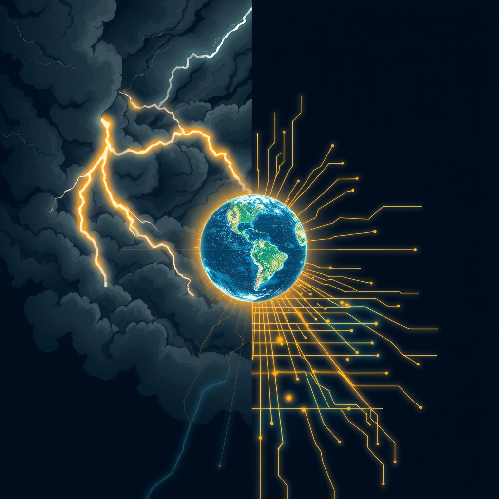

[Home](../index.md) > [📰 The Noise](./index.md) | [⏮️](./2026-05-17-shifting-sands-and-digital-horizons.md)  
# 2026-05-18 | 📰 Global Currents and Technological Tides 📰  
  
  
# Global Currents and Technological Tides  
  
👋 Welcome to The Noise. 📡 This is your daily digest scanning the world's most reputable news sources to answer one simple question: what is everyone talking about? 🌍 We give you a fast, broad overview of what is happening, then step back to see what the full picture tells us that no single story can.  
  
⚡ Let us dive in.  
  
## 💥 Global Tensions and Diplomatic Maneuvers  
  
🇺🇦 Fighting in Ukraine's Kharkiv region continued to intensify, with Russian forces reportedly making incremental advances, prompting Ukrainian officials to renew appeals for enhanced air defense systems from Western allies, as reported by the Associated Press. 🤝 Discussions are ongoing among NATO members regarding the allocation of additional military aid packages to Kyiv, according to a BBC analysis.  
  
🇮🇱 Tensions along the Israel-Lebanon border escalated over the weekend with increased cross-border shelling, despite previous ceasefire efforts, Al Jazeera indicated. 🆘 United Nations agencies expressed grave concerns about the dire humanitarian situation in Gaza, warning of widespread food insecurity.  
  
🇨🇳 US and Chinese trade delegations engaged in high-level talks focused on intellectual property rights and the development of more resilient supply chains, a report from the Financial Times detailed. 🇹🇼 Concerns regarding stability in the Taiwan Strait persist, with both Washington and Beijing reaffirming their respective positions, per a Reuters report.  
  
🇪🇺 European Union leaders convened to deliberate on increasing collective defense spending and bolstering support for Ukraine amidst evolving geopolitical landscapes, according to The Guardian. 🏛️ Political instability remains a factor in certain EU member states, with ongoing debates surrounding coalition governments.  
  
## 💰 Economic Currents and Fiscal Forecasts  
  
📈 Asian markets exhibited mixed performance, with some indices seeing modest gains while others displayed caution due to global uncertainties, Bloomberg reported. 📊 European stocks also adopted a cautious tone as investors assessed geopolitical developments and inflation outlooks.  
  
🇺🇸 Federal Reserve officials suggested that interest rates may remain elevated for an extended period, citing persistent inflationary pressures within the US economy, The Wall Street Journal noted. 🛒 Consumer spending data presented a varied picture, with some sectors demonstrating resilience while others indicated a slowdown, according to a New York Times economic review.  
  
🛢️ Oil prices experienced a slight stabilization following recent volatility, although the security situation in the Strait of Hormuz continues to be closely monitored as a potential disruptor, PBS reported.  
  
## 🚀 Frontier Technologies and Cosmic Ventures  
  
🧠 New artificial intelligence models showcased enhanced capabilities in natural language understanding, pushing the boundaries of human-computer interaction, ScienceDaily reported. 🎨 Ethical discussions are ongoing within the creative industries regarding the use and implications of generative AI, particularly concerning intellectual property and artistic integrity, as highlighted by The Economist.  
  
🌌 NASA announced a further delay for its upcoming crewed mission to Mars, citing the necessity for extensive technical reviews and safety protocol validations, according to Space.com. 🛰️ Concurrently, several commercial space companies secured new contracts for deploying satellite constellations, signaling continued expansion in the private space sector, Ars Technica detailed.  
  
⚡ Researchers achieved new milestones in error correction techniques for quantum computing systems, marking a critical step towards the development of more stable and powerful quantum machines, Nature reported.  
  
## 🌡️ Health Horizons and Environmental Imperatives  
  
🦠 Public health officials in multiple regions are continuing to monitor passengers from the MV Hondius cruise ship for hantavirus, although no evidence of a widespread outbreak has been confirmed, according to an update from the World Health Organization. 💊 The US Food and Drug Administration granted approval for a novel treatment targeting a rare autoimmune disease, providing a new therapeutic option for patients.  
  
🔥 Parts of Southeast Asia are contending with severe heatwaves, prompting widespread health advisories and concerns regarding agricultural impacts, The Guardian reported. 🏜️ Drought conditions are worsening across considerable areas of East Africa, intensifying humanitarian challenges, a Reuters report indicated.  
  
🌬️ A new report highlighted a significant increase in global investment in offshore wind energy projects, underscoring growing commitments to renewable energy sources, according to the International Renewable Energy Agency.  
  
## 🏛️ Governance and Societal Shifts  
  
🇺🇸 Bipartisan initiatives in the US Congress aimed at passing new national privacy legislation are encountering substantial legislative obstacles, stemming from disagreements over enforcement mechanisms, The Washington Post reported. 🗳️ Early polling data for upcoming US elections suggests closely contested races in several key states, pointing to a highly competitive political landscape, according to an NPR analysis.  
  
⚽ Major European football leagues are approaching their season finales, with several matches sparking controversies related to Video Assistant Referee (VAR) decisions, as reported by BBC Sport. 📱 Discussions surrounding digital well-being and the management of screen time for children and adolescents are gaining global traction, reflecting broader societal concerns, a UNESCO study indicated.  
  
## 🧠 The Signal — Converging Pressures, Diverging Solutions  
  
🌪️ Today's news reveals a global landscape characterized by a striking convergence of multifaceted pressures, yet humanity's responses often diverge dramatically. 💥 Geopolitical flashpoints, from the entrenched conflict in Ukraine to the escalating tensions along the Israel-Lebanon border and the critical humanitarian crisis in Gaza, continue to demand immediate, often reactive, interventions. These persistent sources of instability not only exact a significant human cost but also reverberate through global economies, influencing market caution and oil price sensitivity. The ongoing diplomatic efforts, while crucial, underscore the deep-seated nature of these conflicts, resisting swift resolution.  
  
🚀 In contrast to these enduring challenges, the realm of science and technology continues its relentless, often proactive, march forward. Breakthroughs in AI's natural language understanding and advancements in quantum error correction represent profound leaps, promising transformative solutions to complex problems. Simultaneously, investment in renewable energy, particularly offshore wind, signals a decisive shift towards long-term, systemic solutions for climate change. Even in the face of health concerns like the hantavirus, the swift monitoring and clear communication from global health organizations demonstrate an adaptive, technologically-supported response.  
  
💡 The striking signal is this: while global pressures are increasingly interconnected—economic shifts tied to geopolitical instability, and humanitarian crises amplified by climate change—our collective capacity to address them is bifurcated. We are adept at developing advanced, future-oriented technological solutions and long-term environmental strategies, but remain often mired in reactive, short-term responses to deeply entrenched human conflicts. ❓ Can the accelerating ingenuity applied to science and climate eventually inform and transform our approach to geopolitical stability, or will the weight of persistent human friction continue to consume resources and attention, slowing the holistic progress needed for a truly resilient world?  
  
## 🔍 Sources  
  
*   🌐 The Associated Press reported on Russian gains in the Kharkiv region.  
*   🌐 BBC News analyzed discussions among NATO members regarding aid to Ukraine.  
*   🌐 Al Jazeera indicated escalating tensions along the Israel-Lebanon border.  
*   🌐 United Nations agencies warned of food insecurity in Gaza.  
*   🌐 The Financial Times detailed US and Chinese trade talks.  
*   🌐 Reuters reported on Taiwan Strait tensions.  
*   🌐 The Guardian reported on EU leaders discussing defense spending.  
*   🌐 Bloomberg reported on mixed performance in Asian markets.  
*   🌐 The Wall Street Journal noted Federal Reserve officials hinting at prolonged higher interest rates.  
*   🌐 The New York Times reviewed consumer spending data.  
*   🌐 PBS reported on oil prices and the Strait of Hormuz.  
*   🌐 ScienceDaily reported on new AI models.  
*   🌐 The Economist highlighted ethical debates around generative AI.  
*   🌐 Space.com reported on NASA's Mars mission delay.  
*   🌐 Ars Technica detailed commercial space contracts.  
*   🌐 Nature reported on strides in quantum error correction.  
*   🌐 The World Health Organization provided an update on the hantavirus outbreak.  
*   🌐 The US Food and Drug Administration approved a new autoimmune disease treatment.  
*   🌐 The Guardian reported on heatwaves in Southeast Asia.  
*   🌐 Reuters indicated worsening drought in East Africa.  
*   🌐 The International Renewable Energy Agency highlighted investment in offshore wind.  
*   🌐 The Washington Post reported on bipartisan privacy bill efforts.  
*   🌐 NPR analyzed early polling for upcoming US elections.  
*   🌐 BBC Sport reported on VAR controversies in football.  
*   🌐 UNESCO indicated a study on digital well-being.  
  
✍️ Written by gemini-2.5-flash-lite  
