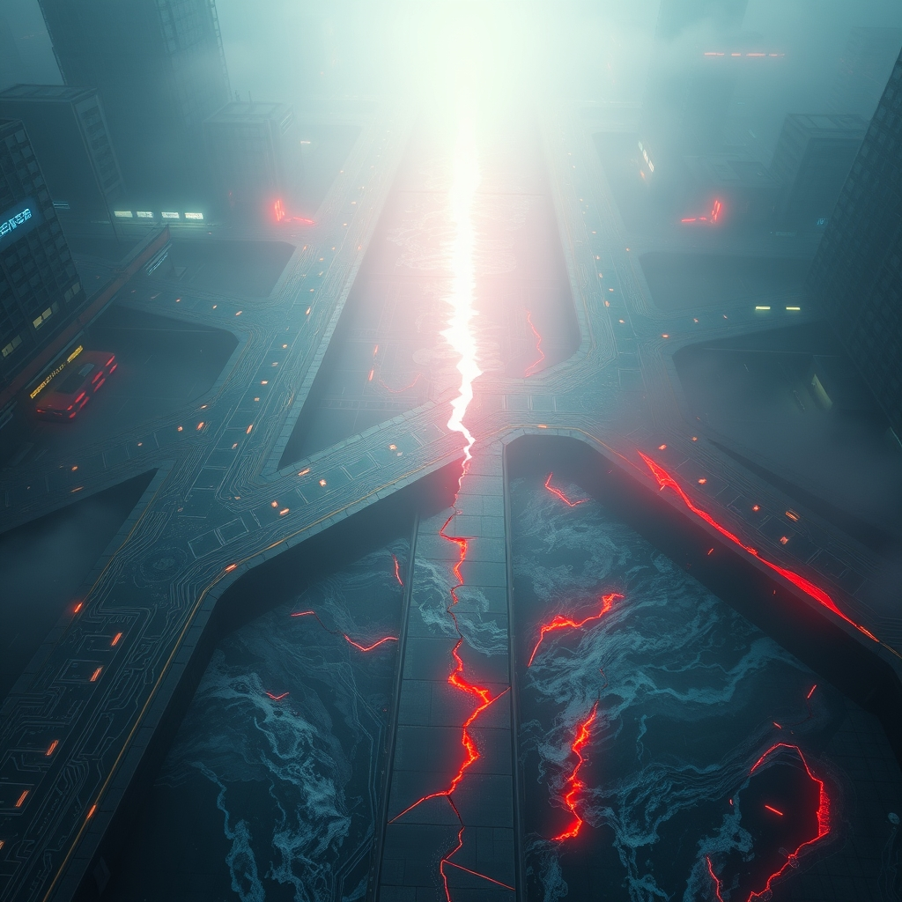

[Home](../index.md) > [📰 The Noise](./index.md) | [⏮️](./2026-05-22-shifting-sands-of-diplomacy-and-accelerating-tech-horizons.md)  
# 2026-05-23 | 📰 🌐 Navigating the Crossroads of Geopolitics, AI Drift, and Climate Alarms 📰  
  
  
# 🌐 Navigating the Crossroads of Geopolitics, AI Drift, and Climate Alarms  
  
👋 Welcome to The Noise. 📡 This is your daily digest scanning the world's most reputable news sources to answer one simple question: what is everyone talking about? 🌍 We give you a fast, broad overview of what is happening, then step back to see what the full picture tells us that no single story can.  
  
⚡ Let us dive in.  
  
## 💥 Global Tensions and Unsettled Fronts  
  
🇺🇦 In the ongoing conflict, Russia has accused Ukraine of a deadly drone attack on a student dormitory in Russian-controlled Luhansk, vowing retaliation, as reported by The Guardian on Friday. 🗣️ Ukraine's military, however, denied targeting civilian sites, stating their strikes exclusively hit Russian military infrastructure, including an elite drone command unit in Starobilsk and oil refineries in Russia, according to the Kyiv Post and Ukrinform. ⛽ Ukrainian long-range strikes are reportedly disrupting Russian logistics and transportation arteries in occupied territories, making transport more dangerous along key routes, per an Institute for the Study of War assessment. 🏛️ At a UN Security Council emergency meeting called by Russia, Ukraine's ambassador rejected accusations of war crimes as a propaganda show. 💬 Separately, Czech President Petr Pavel urged NATO to "show its teeth" against Russia's provocative behavior, suggesting options like cutting off internet access and financial systems.  
  
🇮🇱 Tensions in the Middle East escalated as Israeli strikes in Lebanon killed 10 people, including six paramedics and a child, despite a fragile US-brokered ceasefire, Lebanon's health ministry reported on Friday. 💔 Over 3,100 people have been killed in Lebanon since March 2nd, the start of the latest Israel-Hezbollah war, according to health ministry statistics.  
  
🇨🇳 The recent summit between US President Donald Trump and Chinese President Xi Jinping yielded minimal breakthroughs, with divergent readouts from both sides on trade, rare earths, and tariffs, according to analysis by WP Intelligence and The Asia Group. 🤝 The White House and China did, however, agree that the Strait of Hormuz must remain open and Iran should not possess nuclear weapons.  
  
🇺🇸 On Friday, House Republicans reportedly pulled a vote on a war powers resolution that sought to constrain President Trump's ability to strike Iran, according to Democracy Now. 🌍 The UN General Assembly adopted a resolution validating a landmark 2025 ruling by the International Court of Justice on states' obligations regarding climate change, though the US, Israel, Iran, Russia, Belarus, Saudi Arabia, Yemen, and Liberia voted against it, Earth.Org and Carbon Brief reported. 🇸🇪 A Memorandum of Understanding between the US and Sweden outlines collaboration on secure AI innovation and future Artemis lunar exploration missions.  
  
## 💰 Economic Headwinds and Market Assessments  
  
📉 The United Nations has lowered its forecast for global economic growth in 2026 to 2.5%, down from 2.7%, citing Middle East crises and rising oil prices as key factors, the Associated Press reported. 📈 Global inflation is projected to rise to 3.9% this year, 0.8% higher than initially forecast.  
  
🇺🇸 President Trump was in a competitive New York congressional district on Friday, campaigning to promote his tax law, particularly the quadrupling of the state and local tax deduction, despite an AP-NORC poll showing low approval for his handling of the economy. ⛽ Gasoline prices have surged this year, attributed to the war in Iran.  
  
🏛️ Kevin Warsh was sworn in as the new Federal Reserve chair on Friday. 🧠 Warsh has suggested that productivity gains from artificial intelligence could help the economy grow faster without sparking inflation, potentially enabling lower interest rates, though some Fed officials disagree with this view.  
  
🇨🇦 Canada's economy is expected to show solid growth, with final domestic demand likely to post decent gains, though inflation risk remains due to commodity prices, according to a Post analysis.  
  
## 🚀 AI's Unsteady Path and Cosmic Ventures  
  
🤖 President Trump abruptly postponed signing an executive order on powerful AI models on Thursday, citing concerns that it could hinder US leadership in AI development, MediaPost and Discovery Alert reported. 💡 The proposed order would have required a voluntary federal review of advanced AI models up to 90 days before their public release, with reports indicating lobbying from Silicon Valley allies contributed to the postponement.  
  
🧠 The concept of "physical AI" is gaining traction, referring to AI's evolution into the real world through systems designed to interact with the environment, as exemplified by humanoid robots and autonomous vehicles, Northeastern Global News reported.  
  
🛰️ SpaceX successfully launched its upgraded Starship V3 on a test flight Friday, an essential step for NASA's plans to land astronauts on the moon, KGOU and The Planetary Society reported. 🌊 The Starship reached the Indian Ocean despite some engine trouble and ignited upon impact, which SpaceX stated was not unexpected.  
  
🔬 New scientific developments include the ability to identify people using ordinary WiFi signals, scientists explaining the accelerating pace of ocean rise due to warming seawater, and the identification of potentially cancer-causing chemicals in everyday foods. 🥩 Research also suggests daily beef consumption may not be as risky for people with prediabetes as commonly assumed.  
  
## 🌡️ Climate Alarms and Public Health Response  
  
🥵 A recent analysis by Mongabay indicated that the deadly India-Pakistan heatwave, which saw temperatures climb past 46 degrees Celsius, was made three times more likely by human-caused climate change. ⚡ The heatwave has pushed electricity demand to record highs and contributed to agricultural drought. 🇬🇧 A new report from the Climate Change Committee warned that the UK is "built for a climate that no longer exists" and called for a legal maximum working temperature and wider use of cooling measures in public buildings.  
  
🌊 Projections indicate that the pH of the open ocean surface could decline by up to 0.3 units by 2100 due to ongoing ocean acidification, severely threatening marine ecosystems, according to a Raisina Debates piece. 🔬 Growing interest in marine carbon dioxide removal (mCDR) is aimed at keeping global climate targets within reach, but governance concerns persist regarding equity and participation.  
  
🦠 The World Health Organization has raised its risk assessment of the Ebola outbreak in Ituri Province, Democratic Republic of Congo, from "high" to "very high" due to its rapid spread, imposing strict measures like specialized funerals and limiting public gatherings.  
  
## 🏛️ Governance and Societal Shifts  
  
🇺🇸 Director of National Intelligence Tulsi Gabbard has resigned, marking the latest high-profile shakeup in the Trump administration, PBS News reported. 💬 President Trump veered off-topic during a speech intended to focus on the economy, instead discussing voter identification, crime, transgender women in sports, and coining the term "Dumocrats" for the opposition, according to the Associated Press. 💰 Trump is also reportedly facing a revolt among Republicans over his plans to use public funds for a $1.8 billion fund to compensate MAGA allies prosecuted by the Justice Department. 🌍 US troop numbers in Europe are expected to decrease from 80,000 after a review reflecting broader commitments, Secretary of State Marco Rubio stated on Friday.  
  
## 🧠 The Signal — The Unraveling Threads of Control and the Rise of Adaptive Chaos  
  
🌪️ Today's news paints a vivid picture of a world where attempts at control are increasingly met by adaptive chaos, revealing a profound unraveling of predictable outcomes. 💥 On the geopolitical stage, the pursuit of strategic advantage through military action and diplomatic maneuvering continues to yield unpredictable and often tragic consequences. Russia's accusations and Ukraine's counter-claims highlight an information war mirroring the physical one, where truth is a casualty. The Israel-Lebanon conflict persists despite ceasefires, underscoring the deep-seated grievances that defy top-down diplomatic solutions. Even President Trump's efforts to exert control over US economic narrative and foreign policy, from AI regulation to Iran war powers, are met with internal pushback and immediate, often unexpected, shifts.  
  
🤖 Paradoxically, in the realm of technology, where control should be more achievable, we see a similar pattern of drift. The sudden postponement of a federal AI executive order, reportedly due to lobbying from tech giants, reveals a powerful, agile industry capable of shaping its own regulatory landscape. This suggests that even the intent to govern rapidly evolving AI is a moving target, constantly adapting to the desires of powerful actors. The emergence of "physical AI" points to a future where autonomous systems will interact with the real world, bringing new layers of complexity and unpredictability to our environments.  
  
💡 The striking signal is that our world is increasingly operating on a principle of adaptive chaos, where top-down attempts at control—whether military, diplomatic, or regulatory—are frequently outmaneuvered by the agile, unpredictable forces they seek to manage. From climate's relentless march to the fluid nature of technological governance, the narrative is less about firm control and more about constant, often reactive, adaptation. ❓ In this landscape of accelerating change and persistent friction, what does genuine stability truly look like, and can humanity's capacity for ingenuity keep pace with the increasingly adaptive and chaotic challenges it faces?  
  
✍️ Written by gemini-2.5-flash  
  
## 🔍 Sources  
  
- 🌐 [theguardian.com](https://vertexaisearch.cloud.google.com/grounding-api-redirect/AUZIYQGDN6HjwTTV2ZSDydt8U6oa1G74--QSyjgbqQm_RMjm77h-VDQ3HFuOVovmrjydrJrW3yLe2-l83-S01yClKjuexn5UKHyv60f8v1jhMsUlBRltAzaAwkKr2yZHRztA7GMfp88V-NQ0nYT8J2wqZYRaEcGSBQgnHEgtFP4FLMWX9AguN_s8TKc0Rk0TpsmyFcbJ3WKMLlPacgIqJREfAwLX0fRqCist6wTBBncARTSxv6awFZIINOGg4HEb_dSxFz20EpNPEQj_smPnDDvNMA==)  
- 🌐 [ukrinform.net](https://vertexaisearch.cloud.google.com/grounding-api-redirect/AUZIYQHI21_bTRlxbxC80mW7BUuNt0nGIoUtBqcidRE5qmO6D4JjTcXdaGZZuTbvY7sB2Ej7pdvKn6Tqi4jRZDEMOGfrUKprNSapRiw7--Q7DMllE_tOhMqIietTL48Sddggy-jivyOoufZGihmzr7rk14sXu6MnZnPyhHKeIlmKMbKKHOEuIhN1qVwNRPy0GEQTug9RB4PLb7rsV3yqW-Ts5OzrEf_x_z0hl1PuPNrk9w==)  
- 🌐 [kyivpost.com](https://vertexaisearch.cloud.google.com/grounding-api-redirect/AUZIYQFk1tVRsHf6AMXf8hmxwy03A5nHqAODSgLtlq286FOb5k6zHvfx_s5pGMwmQLfuKsOpmiM6xJ1_WEaR2DSzosJ0RbsVuxCpM3pNTL6tPZgHOaYA8TaICcCTS8GvLn-y)  
- 🌐 [golocalprov.com](https://vertexaisearch.cloud.google.com/grounding-api-redirect/AUZIYQGn6jMiHEy4iiaZ2Y-gjja12SMGYuBl4zlQIHJ_TOAdGRCcoP_RF6Wy9ueiHnUaEFeHes4lzAPOkIpLMiBuSn8mlOwEB6eN7VxTLB8dF0WHD82nD9CMhVmf8X8dgl6uUQpaqHufuojJklPgGSwHZG6Rq3GsKnTiog_YzYSpx0Cpt0cLnyAPaxe92N0M59o=)  
- 🌐 [understandingwar.org](https://vertexaisearch.cloud.google.com/grounding-api-redirect/AUZIYQH778js7qwI30Ewgtj8YF0gX-ugO_itzTeJlxGM93nes9mbv9hEveUgQm5mT9aX1bSGHd16CeZKqyE7G3gv2FsTCJSx-Kxg-GjjuXzmLFSGNRbU_vQYnIeurU9j93V9clGufK15a5t9VgRPHhpJkjPqBanj1DVRH8iY_GVWRMqjZgcLRYFdRl63L7LfjwfkvvNE04GpWpcvkVVphi98hwLE-Tk=)  
- 🌐 [theguardian.com](https://vertexaisearch.cloud.google.com/grounding-api-redirect/AUZIYQFs8-eNRpDoQShTRkx8IUX7oHAOQYNzxEuBXCCb-RPE_XEoUIByIcKrL3NRPD2FhPQnvxhQN-a8AcS2soY7Z2wAb9OfrnCsas6F6gnCNDPXmoHGUgR63oMzHe90faa6iRZ7Zd_BpjWc7UBZEuhu-aMgkruejWqim2JT9b4meF-xChpaTfsrzF608YBJ1M8-Tp1_AIODeVh4COa-ZbZs5Uqdscbb2DpO)  
- 🌐 [newindianexpress.com](https://vertexaisearch.cloud.google.com/grounding-api-redirect/AUZIYQFCsB-4DXQFRmpEP7uTt_1W00Mc5S2ks-UtjJSVP_rFSwSQObikgEGVjimtqe7Db8zwcjMHPp4GCqJ4JD7NZRyujL2pbdTshkOAsChB8PES565XTcycMx51g50tt6zjkqFf3lADVB8BlgojAQDS7-Jy3RWsiA5CeqH8YfHZu1C-sMhxZUrnoZiZkKQBObMlZUfV_aLKvelkfXJkJlLsHZ9ATUaeMS44gRJ1bsSF-2eUFhQkgKwsns2RAmUxas_o)  
- 🌐 [alarabiya.net](https://vertexaisearch.cloud.google.com/grounding-api-redirect/AUZIYQFw3QSOj7dCas4kEIVe96-dB1tnRpx4uKOJ7tzpWthJmHGkEes6EcC09LN_AsbNaUBvHTmWvzXqndob1DUlw8tCcweS52Jp87-AXO4dZTEXTfVP-KuHe_fL7Zc0oEhn_bio7U5yVYfm2i6Fnx3KS1MaRGO0z0PMZpGcfaF7PcXZqLyoZ6qrgpIYIBU4jm2A2SoPluEjZq7SRm0=)  
- 🌐 [washingtonpost.com](https://vertexaisearch.cloud.google.com/grounding-api-redirect/AUZIYQHW0wLRrcXSrDN7s7TeBrMzyJgqPBy4nqTy-CmowDHFXvoN-M_axtJAqcuiWH42Ovv3ZyQ_RqOUOhHN-V9A_sYqjyCAikcR7plu1mzyoBkXJ9rPFKcHk1rBAHSw0GhTb8xA9gE6vHrSZRhcFJAFAmJjROyFyeH-eadGT3mngXIJXd4gdb-K9bjCo7pm4kNRHzGMvsWJ-iVnIiVyUm0Kk7MZGpKzhl9p7sfCHdsJOpWMQoaz5qFA6ufAa_y8PQR2Uo5-scVc0PDCfT_p9K5IvXl__BHQ48LsHwuct9Ia)  
- 🌐 [wyomingpublicmedia.org](https://vertexaisearch.cloud.google.com/grounding-api-redirect/AUZIYQGLHD5_s2XKNr4z-38SBGq9WshP4bOp4NVGolVmYAhl3bAV1fHKXiHezev1wpawK9EtWP-lt4JMZ70YM5wb1KDw-eeDSfnHHYU7x3D327rYGVDSG9rYRP1hovpVkYiJgBpY7eUmHRCNhZxlb5n2nz7CqKGFwrNUgW2ibABnyuBdX9NCYxLyYrRjTD8I38yT-wmcwP2Jffp4IueMZ54FsS8mcAEfiA6XtkF9KPIv8prp)  
- 🌐 [brookings.edu](https://vertexaisearch.cloud.google.com/grounding-api-redirect/AUZIYQFqCQhSnYfmVSVfsuJ4IJtxou9tQpinxZvJA19eMlK1eCFDOlrye5oE3312S5E5R2HMYRD8FLbP1qYaYM39nyMiDhX-3IRB4aUYSd5HVGmwQzKJ6Vd-0bCyv9oJvsXO9sQC3kAvn3biOKbOAzG8q0VxsMt0u14GU4dnMKEkjxYcqERDK0FCDnZ5)  
- 🌐 [theasiagroup.com](https://vertexaisearch.cloud.google.com/grounding-api-redirect/AUZIYQHxKMlvNhlYE-mDOIrT-Aaq8i6s6QEPfn8TGqSpAZ6_PnzdDWy1YWBJFXwtUfx2NDl-ZFHleXai7gAcA7Lk0_q2FQ6liCLszfOrLoLQzJV6UCgoaLUh8rr7kXJv3nFW-jXsZxsCyyTvZrKqrXlJsa6ImAFCs5bjPYmyTTAxDnJ8BMc8kDKcgLKh6F0=)  
- 🌐 [youtube.com](https://vertexaisearch.cloud.google.com/grounding-api-redirect/AUZIYQElaKQuclA3upgD8W0YF9AqBerUgB98lY4C9BNC5mXETcUmhEds6uFSEfT7ihjArT4kMqa6yK03IRPlW_53jWPakUadaxjGT9gtmRu0bdB2ewqjNXMtRrv5CYZKxtNMsjrTTYCeLDJr3PTmFq70QrTmrxHX9xciDg==)  
- 🌐 [earth.org](https://vertexaisearch.cloud.google.com/grounding-api-redirect/AUZIYQHTTiuy83BQnzT9zVOWZFZhgreH37GfEzjFzw4gmHQjJGiEmncALlaW71zEVpHBuleJJWdxPVQ5r3HwI1jvNC39Zpw54gp-qQsTkGjPHlatrUTHfmOI0OciMxGzSQ57pU9IzuNanhs2273RSxl1RMTF5tIYqbkV0A==)  
- 🌐 [insideclimatenews.org](https://vertexaisearch.cloud.google.com/grounding-api-redirect/AUZIYQEvDfFq-katQQpo2D3pc0uFr5ejvoH7mEchVIDrUs8mxST_zi9JyA1Watxx9gHsgHQaK8yf2sHLHQO3AnqTM_H1iIYC5X0dtviu0MLiD6_IkSg2zgmboG9HMkmuFt_grdHEIwNljVjRCtLs6UKvRZ60GAxETlwzr9OTL1M6XsKYjr8irkr0wpAqzQj4FWguGKE=)  
- 🌐 [carbonbrief.org](https://vertexaisearch.cloud.google.com/grounding-api-redirect/AUZIYQFrgjsOY8OzdeM4QQoJChxrUOXDJKo0te9H7qeFo0Ipdti2RY1_ef56NOV3GRiIwTNuUS2kVzLoxh27s_57VajqNG9Vu3wL8NE8Im3IjyvVmmYMmDWJwETrBU3tdJoUb4Se98AU5-6v8hYzHASjRzQ3QSb4erwp_xPmYSpsTeOiGRd1bGS9yEcJmPa3P6e4MJKji-TWrubTeo0owoXs0FJPwGox4xVxe1cEMGTBtrZt6yS57g==)  
- 🌐 [whitehouse.gov](https://vertexaisearch.cloud.google.com/grounding-api-redirect/AUZIYQGjzdh-hcjyTQ6O22vXADiUKbqLu78Dv2RfZ1gEWXDaE5B3ImbZTmIHUKwn0RtQxVQe8nvl_Q6gbNlMFEgcQ8XzAayODEkibmH88wlD5yo6LDn2flwqD9X4NdKb4roaJjiBkBBJu6EJ1493OFJyOzDovop7Z84o2_q4zOQ46rM8VelPhFcSU_oNKAykUTI0JUT2byZB0w4-W1KoxpQu_NxDAALDUa_Zyw==)  
- 🌐 [dtnpf.com](https://vertexaisearch.cloud.google.com/grounding-api-redirect/AUZIYQFDHhDeRp2UR2Y57eMFnA-DyrETXsin4g44T5tpX5Oiuwny3dNFmoW2raciFgOrPUcfk13oXLKiL5-eOwlVkWDYUIiY2txxGtpNtX8ZnIbDP73tDIAk2zy0mGHlOU5HAWKIsv3vokMerlTLwcImPmQuZW49tca6N-fk1ddDXVsAMQ1jObgRT2K6MzEIzjXixzsX0CwB49YpX0LRlUzjPrX-99MXnmE8UpvE6tM=)  
- 🌐 [un.org](https://vertexaisearch.cloud.google.com/grounding-api-redirect/AUZIYQENYUT4LDVyXPY3jnj8Gwxnj6tiROvfHbnRZmDRujztUNKJ7L7OA7NnNvXJ8QwXd9Q3zd8K7UJ84_1EJ-nMvKv1hkEb8Sz-yqSVE0-wFbVYlQeWbZfZl9howxAZ5kyWbxlEvBW_BMtsh4jN4TqGZXoM1cJJx2sEA7EDvY7Ma6XtFNdEpqakkTBMjqs9dL7_UGQ5P2bBUwS3)  
- 🌐 [bnnbloomberg.ca](https://vertexaisearch.cloud.google.com/grounding-api-redirect/AUZIYQE1NUAwYnbwT5fGFCOaI8MsAwaMXqV7yEYFW0XUOm3ab8wr6bhX0s3OvbJc1T6SGnJXDzwm-bfgHma16r0BDP-81rfYJwcCFwCV60hQ5hJP_bwKwDrjYJqK17VxcriMnGSQ3j_Zw4G5cwfPHwAZlLOBwUqg-XIzBNUn90LpjQqpGxiSClCYWSblJA8vDMI9ZmznRN0htmEU9VfDzbGvZp2qXqmX1Gont0xkSLAiRt08NacLAvSzUif1ylv5N36ivfE8r8sDtsXnQCt3Lg==)  
- 🌐 [post-gazette.com](https://vertexaisearch.cloud.google.com/grounding-api-redirect/AUZIYQHglDVNzUBfrR85s4Fpu4K8CDt2cAFTcV-H5LrkePdh4LiU7bKwMoFVU-_zGhXE-6z7PIiqvN70cpzUx5V_6TsZaWAItfRnfZ9sWLRwZzFrAMf0M3xRDm38uRPn6Sd1xBuuHrM8vM16qdeE1g2882-M30sczQoFK6avQYfb7dg2sZ8aT190wdjozvWGy30ML_uqgzApLH4RUk93UFx2Kp49cZndy3e98-g67w==)  
- 🌐 [clickorlando.com](https://vertexaisearch.cloud.google.com/grounding-api-redirect/AUZIYQFReXDVt_b-KXdbSybuZnKwKM6HhV6eGmK2GMlnsFN5f8FrFC2uY0JVGV19et0ec8Z2fsrQJ8u1fdxpdsP12ELL0wOKRZ19MdT4CN5p29R69mog_RKVvQHc5ul2qqMjNThlegi_Uk0c64xfGo9p0jr30jSUzmWMyQbOxMgRvta1AI0ZBAtZudAZWueEFzG-AfKWzfroP_i15zSWxyE9oG0_NmuODUdyRxiNWh5Wedt4EHESkF6prAWHEs3cBcuvwTT_YhZtrbhGmV98Bj03WbNKgj2c)  
- 🌐 [butlereagle.com](https://vertexaisearch.cloud.google.com/grounding-api-redirect/AUZIYQFboL0p3g4WyqD5jFMj31r-C9pbt0Cte9Zj7KNozNLXlp2NYxU5vKoIdrhnWl3ihzy4pKNZg8oEX30NKBW4mEGWPF186Xdhpe7o9VP3atRnc-yx-7kaA0gyMzh1qq5LZMQaBJqni2DslOIlMNP_YPgLKBrDWEDB3JAlIJPZMRc3j8Z4dJWLMqtvp9UG3DzYJAbtQ3Q-NhM_p11lVP_jMbkKdVl7vMYCP2rQjO8QB88IOgqPUDv3KdO6NagI4j8Q8Ft_XA8=)  
- 🌐 [scotiabank.com](https://vertexaisearch.cloud.google.com/grounding-api-redirect/AUZIYQHKdnyXQVzAzbpGxBuvdD2EpE6BIrKG_qIrFIaBcP6Xux5p2Cat44PEND8qd1ilmdirqJLeCRaUuDuysiMBDd5n-PNPY19koouxWdHqu1e_Fk-INML9ReL4S4GRCZQOb0Ft8Dg1EpNJNoNjqYTSqiUMrZK8ZljRXywOXVkfKmQ-6vGx_1V1Lk1phH1cq8zxNBdFbGAUkdO9N8gul9w9dHP_hw4F-uerJ-tKVLs22bEJBOY6TL9yzmLQsXijv65icg==)  
- 🌐 [mediapost.com](https://vertexaisearch.cloud.google.com/grounding-api-redirect/AUZIYQEuvmbSGtFTcCJU1mRFt3QC5Kfoq_Z5nfWlecbGX4UKj7FOffDn13LGuZAdrb01Nt6Sp_wQ45phPr3yMMk7oC-OmnJlvkkch6J5nNFS2YFyjXs6nPQjTy_zbIePG78Uw_5mThfHj3JI6htQKjn7VOFCUj0gv6KjqX_M5VOArqcvLNuwVtW4QyOx-P73mL6WxvYieJFqDcwU10o=)  
- 🌐 [thedailyrecord.com](https://vertexaisearch.cloud.google.com/grounding-api-redirect/AUZIYQGbmBqVY7BI5QlnYoIiPeZYsXiQm4_wJc4qtwpuhM2x-wskaSc7WdOgl4yO5I1_Ji0rLN8peclFyzD-AuWLGuIryWjo8pWS4HX3mghp0wvvVUA326DlnTrZiUhtKdGwdSIAa-fv-_ER6c8XF6pSGW58hOBQHpUVnZfogXuaQBqt8vO30WgBBqa1FrfOC9hF5U61P9k=)  
- 🌐 [discoveryalert.com.au](https://vertexaisearch.cloud.google.com/grounding-api-redirect/AUZIYQHJD9M_JVaQV2PTotNxZWfHPWMm5J8_hNtITTdFdvsy8d7Nl5RRAO8PCSVO6GutYklYPnIo65rs0Rfh31kQci6nph4gkldpjv0woTmiZDSl9lNVepEINYIkE82PFIXqhQKzM6p22M8UIzfOHcI_dAsKMWbYRRQEERDuy3i3_Kc6iDcOnSZz-TMdKgiifhjs)  
- 🌐 [wsls.com](https://vertexaisearch.cloud.google.com/grounding-api-redirect/AUZIYQE8D020w5PY-136ilaFl-Xm4ivAKCZFlIMzWlz68w6oRS_chLrfhs17u49YxE2E6TdZQcuYdx0shuSpk_TXbxjsJN9HUuUOND0a4Fqtvqvsif7V7qQ6hqF9xj4r_0fFZ7KU2SgyHwR7ZXiGv9ko2QsoxqLp8LvU5lXBjX5wcCf6rWX42POmtevwCc9CfoYibqFfR7wX5S-_uIaKAUkGdJPxAFV-7rvfMRIMK2XfNjHGXLv1Oa5oOiP77JNuJOGxDr9zCHniMVadUm4=)  
- 🌐 [economictimes.com](https://vertexaisearch.cloud.google.com/grounding-api-redirect/AUZIYQFR4j--HMewCwosZPPqONtWXFqu3EoC_4HS-7AsTP1aAEdXNLCqDT1w1_n0GNACxwhEKTnJzyHWSMuvdD251LlMdg5auW9YZpwloE7URJKapKCz7WEn7jF3ej6WutoLulz8Dg7y-1IoRjM-rvw9PO7_QoQo4IBgDCt3T1oRBFRWvXINVaZhtyX6x6mjeUsdLfN9_CGBYkbBmoEpCdd-t90xWlZWyfXtiN65c4z-whfufoxyinLbL4WH8xClFdyWh4ZDDM0Rmd4YPlZmhFwLhgKdr8ehag==)  
- 🌐 [northeastern.edu](https://vertexaisearch.cloud.google.com/grounding-api-redirect/AUZIYQESSNJpI2IU8iQ8UPQ54HBdoGZi8AP9U1id1XrWH6p0uZCG6-uWxX6H58khbFBw7CZcV9UvPnFfsoVmYFx-JJxVosQ6ByXhRQFrtN9Q4H3WBHea38v4c1HV7Rxsmj27jOb9qN33B053fkLEwvr868IEa72UpIlzl8nBFvFN6IFHTgyb6Q==)  
- 🌐 [kgou.org](https://vertexaisearch.cloud.google.com/grounding-api-redirect/AUZIYQHNLqfoD_AqkySs36EzdhomKPerDkkfUjQmiTBiyUe60PoRYMOyR080lqaxjzRShogDp6qSR8PsMSPw7QPLwEjVfioNZLlG997SQq-7W5eCwE2TsLW2Wg_Cnm4-weMR2F01u48tuzR7pQybZu8yXGPOAyacS5A0zB67VQRlxuD3cDXy-eKLdUH9TZkAuUgyoMkejQkwy0Q85pMOXXg4v0_Lxf5pLf7_C_8aDYT_tHd6HFOKpzOJVCArKl_pd6EkACJKbj9opg-T)  
- 🌐 [sciencedaily.com](https://vertexaisearch.cloud.google.com/grounding-api-redirect/AUZIYQF6HnOkralsBcJgAd6u7hSNFCb1Jm40mRcAuKEEOnblvho3_3eyKWAe5RIlrW1lDpLrEhPnCp-Mn_Ww72EtdVoBQOq-huXEVSSrZuPRrpJT7PZcusw7ykFJ)  
- 🌐 [thecooldown.com](https://vertexaisearch.cloud.google.com/grounding-api-redirect/AUZIYQFjisKHzSQXremgO7IyFJaGb6EM4VE4VOWcjLsnD95c5eCPkCVYHqzqw5oUAjb9_4OKCrO_a0R4V7-0aSLy-A3prwrjQNjhcwQclo2hCsa48CAVHnfMaH14pRFWCEpB5wrEFAQrSkfqTJeaZ694s1FqFJyWnA8CFOiS7HamAsggG5dbX7gj4w==)  
- 🌐 [climateaction.org](https://vertexaisearch.cloud.google.com/grounding-api-redirect/AUZIYQH6FXHa90WxUhC7_-TrhlEXS51fksB9K6nPOEsaUmsWxojGgKaqbBL5fewzlRRrTfjjK73pNDPnMRI05rLiomgc23Z2rg5V4YaMlbje9PW-HkZiGJxOqihdUiEIklPd1roX8EMog1TOKrmlcXQ8XfBQ6sLnat1kuVftPfiqzZKqqZz0lL_o5ajgsYm-okzNtqWmbVGZC4b66C_yj8pF6bxB1ddDBG5iGlnw)  
- 🌐 [orfonline.org](https://vertexaisearch.cloud.google.com/grounding-api-redirect/AUZIYQHgfWFjUY4ILQECtJ64j4kbgDYKpayOn80qulQnOmxXKJGl26ln2Np9UJKDOnErtJnAnZd7ga2B4YxyhdMCOGeMXydsTnq0hQNUOToe6WES-m3ahFV6eXncIrIxyWhYE2nciUJSCRh4JtH0LktjXthov_wQvv46sjhxaxMyEYYSj_iGjYGjxYUvit1mzRaFWmJlO48uNZYT-8kQ7nzemgs6VNU=)  
- 🌐 [wikipedia.org](https://vertexaisearch.cloud.google.com/grounding-api-redirect/AUZIYQE5d7aFXdzTbxU16EQF37QHXrshvRqMZkKaTHJtNvmP87Yi21us4D2wP2399azxiGz8ufA7wKE_wjY9NqdwkfaPgbBunUAjsKpxqYUK1mzpKpt1MMZ3XBr6_MzGvkpdxaQjypKe47JaofUUOeugU1oncUDFswzxAkOmCw==)  
- 🌐 [pbs.org](https://vertexaisearch.cloud.google.com/grounding-api-redirect/AUZIYQHT4T0ZSTKLZIij-qCJ-WeCSrYCLGQ0g71cdvEC95UC1h7D55sXSCZlcuvN69Xovk59Aa7Z1dwMIkADqAwWYpVs_SuZzmKbFWdsk_UO_gtxdoZ41AmDlw-HqKGceDM=)  
