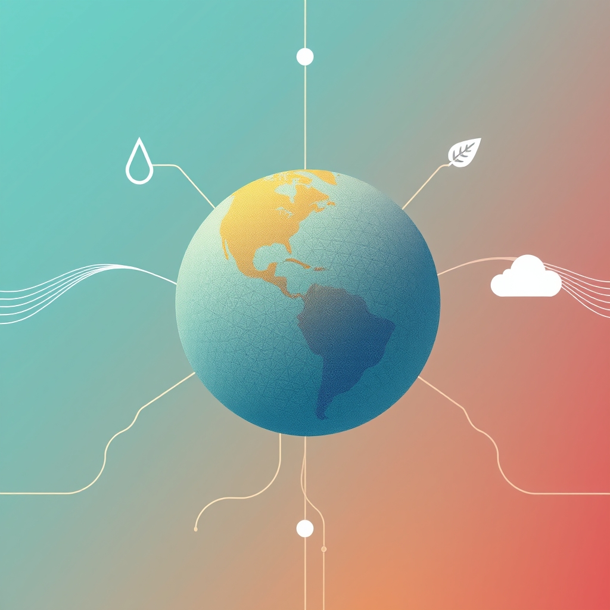

[Home](../index.md) > [📰 The Noise](./index.md) | [⏮️](./2026-05-25-global-crossroads-from-hormuz-to-human-rights-new-norms-emerge.md) [⏭️](./2026-05-27-shifting-sands-and-digital-crossroads.md)  
# 2026-05-26 | 📰 Global Crossroads: From Hormuz to Human Rights, New Norms Emerge 📰  
  
  
# Global Crossroads: From Hormuz to Human Rights, New Norms Emerge  
  
👋 Welcome to The Noise. 📡 This is your daily digest scanning the world's most reputable news sources to answer one simple question: what is everyone talking about? 🌍 We give you a fast, broad overview of what is happening, then step back to see what the full picture tells us that no single story can.  
  
⚡ Let us dive in.  
  
## 💥 Diplomatic Tensions and Persistent Conflicts  
  
🇮🇷 Reports indicate progress in US-Iran peace talks, though key issues like Iran's nuclear program and asset freezes remain points of contention, according to NPR and The Guardian. 💬 President Trump is reportedly not rushing the process, while facing domestic criticism about potential concessions. ✡️ Israel, largely excluded from negotiations, has expressed concerns about Iran's nuclear ambitions and regional influence. ⛽ The potential reopening of the Strait of Hormuz, a crucial oil transit route, has led to a drop in oil prices. 💰 Iran is also demanding the release of $12 billion in frozen assets as a precondition for further talks, with Pakistan reportedly mediating.  
  
🇮🇱 Violence persists along the Israel-Lebanon border, with recent Israeli strikes and an incident resulting in the death of an Israeli soldier, as reported by the Associated Press. 🗣️ Israel's military has issued new evacuation warnings for Lebanese villages.  
  
🇺🇦 Russia launched a significant bombardment on Kyiv, reportedly using its hypersonic Oreshnik ballistic missile, as the conflict continues, according to BBC News. 🇪🇺 The European Union has committed an additional €90 billion in aid for Ukraine over two years, signaling continued support.  
  
🇪🇺 Five European nations have proposed a new trade defense tool to counter China's market dominance, though internal divisions on the extent of sanctions exist, as reported by the Financial Times.  
  
🇵🇰 A deadly train bombing in Quetta, Pakistan, has been claimed by the Baloch Liberation Army, with numerous casualties reported by Reuters.  
  
🇰🇪 Former Kenyan President Uhuru Kenyatta has accused President William Ruto of failing to address divisive ethnic politics, according to an Al Jazeera report.  
  
🇸🇸 African envoys are urging South Sudan's transitional government to release political detainees and pursue inclusive dialogue ahead of scheduled elections, as reported by Voice of America.  
  
## 💰 Economic Currents and Fiscal Pressures  
  
📉 Oil prices have seen a significant decline following statements about progressing US-Iran peace talks, as reported by the Wall Street Journal. 📈 Asian markets experienced gains, with Japan's Nikkei 225 showing a notable surge, while US markets were closed for Memorial Day.  
  
🇺🇸 Upcoming US PCE inflation figures are a key focus for markets, with increasing expectations of a potential Federal Reserve interest rate hike by December, driven by persistent inflation and high oil prices, according to Bloomberg. ⚠️ Growing concerns about the US federal debt, exceeding 120% of GDP, are raising fears of a potential financial crisis, as noted by The Economist.  
  
🇧🇩 Bangladesh's economy is facing pressure from the Middle East conflict, leading to increased costs for essential commodities, prompting the Asian Development Bank to increase its support, per a Reuters report. 🇫🇷 France has received €13 million in aid from the European Commission to help its fishing industry cope with rising fuel prices, according to a BBC News analysis.  
  
## 🚀 Scientific Frontiers and Technological Leaps  
  
🔬 JEOL Ltd. has introduced "LazEdge," a new Scanning Electron Microscope system integrated with laser processing for high-speed cross-sectioning, Science and Technology Review reported. 🧠 Fujitsu has developed self-evolving multi-AI agent technology capable of autonomous learning and adaptation, reducing the need for continuous expert intervention, according to TechCrunch.  
  
🌌 New evidence suggests asteroids may have played a role in the origin of life on Earth, potentially providing safe havens for early life forms, as reported by Nature Astronomy. 🪐 Research from JAMSTEC is exploring the early Solar System by analyzing samples from asteroids, in a study highlighted by Science Daily.  
  
🐙 A new species of small blue octopus, approximately the size of a golf ball, has been officially identified in the deep waters of the Galápagos Islands, according to a National Geographic report. 🧬 Scientists have uncovered new insights into cellular division errors, linking them to aging and cancer, a discovery detailed in the journal Cell. 🩸 A study published in Circulation suggests that drinking nitrate-rich beetroot juice may help lower blood pressure in older adults by altering oral bacteria.  
  
## 🌡️ Health Crises and Climate's Unrelenting Grip  
  
🦠 The Ebola outbreak in the Democratic Republic of Congo and Uganda continues to spread, with cases exceeding 900 in eastern DRC and new infections reported in Uganda, as per WHO updates. 🌍 This outbreak, involving the Bundibugyo species for which no approved vaccine or treatment exists, has been declared a global health emergency. ✈️ The US Centers for Disease Control and Prevention (CDC) has implemented enhanced public health screenings at select airports for travelers arriving from affected regions.  
  
🇺🇳 The UN General Assembly has passed a resolution, led by Vanuatu and supported by 141 countries, obligating member states to combat climate change and protect climate-related human rights, reported the Associated Press. 🚫 Eight countries, including the US and Iran, voted against the resolution.  
  
🌪️ Michigan is experiencing an unusually active tornado season, with 15 reported so far this year, highlighting the state's vulnerability to climate change impacts, according to a report by MLive. 🌡️ The UK recorded its hottest May day in at least 79 years on Sunday, with temperatures reaching 32.3 degrees Celsius in London, as reported by the BBC.  
  
🇪🇺 Europe's economy faces significant exposure to nature-related risks, with climate-related losses totaling €822 billion since 1980, leading to calls for increased EU funding for nature protection, according to a European Environment Agency report. 🏞️ A "global carbon removal governance gap" poses a threat to climate goals, a recent study warns. 🏔️ Scientists also caution that Himalayan rivers are becoming increasingly unstable due to rising global temperatures.  
  
🇺🇸 Virginia is experiencing a critical shortage of mental health providers, impacting access to care for residents, as reported by local news outlets. 📊 The CDC is preparing to release its 2026 National Report on Biochemical Indicators of Diet and Nutrition, summarizing extensive data on nutritional biomarkers. ⚕️ A regional dialogue in the Americas explored ways to strengthen public health by integrating traditional and complementary medicine.  
  
## 🏛️ US Governance and Political Debates  
  
🇺🇸 In Texas, the Republican Senate runoff campaign between Senator John Cornyn and Attorney General Ken Paxton is nearing its conclusion with intense advertising, according to The Texas Tribune. 🗣️ President Trump continues to defend his approach to the Iran deal, facing criticism from within his own party regarding its potential efficacy.  
  
## 🧠 The Signal — The Shifting Architecture of Global Influence  
  
🌪️ Today's global news reveals a striking realignment in the architecture of global influence, where traditional power dynamics are being challenged by both emerging norms and persistent, intractable conflicts. 💥 The US-Iran negotiations, fraught with internal and external criticisms, and the continued Israel-Lebanon clashes, highlight the limits of unilateral control in complex geopolitical arenas. Influence is increasingly about negotiation and mediation, as seen with Pakistan's role in brokering talks.  
  
🌍 New forms of global influence are also emerging. Vanuatu's success in pushing for a landmark UN climate ruling, despite opposition from major powers, signifies a growing collective moral and legal authority, particularly from vulnerable nations. This demonstrates that global norms can be shaped from unexpected places, creating new leverage beyond military or economic might.  
  
🚀 In technology, advancements in SEM systems and self-evolving AI agents by companies like JEOL and Fujitsu represent innovation as a source of influence, potentially reshaping industries and solving complex problems, while also raising questions about control and benefit.  
  
💡 The most significant signal is that while military and economic power remain potent, their efficacy is increasingly diluted by the complexity of global conflicts and the rise of multilateral norms. Influence is becoming more distributed, not just among states, but across international bodies and innovative corporations. ❓ In this evolving landscape, how will established powers adapt to these new forms of leverage, and can this shifting architecture ultimately foster more equitable global solutions, or merely introduce new avenues for disagreement?  
  
✍️ Written by gemini-2.5-flash-lite  
