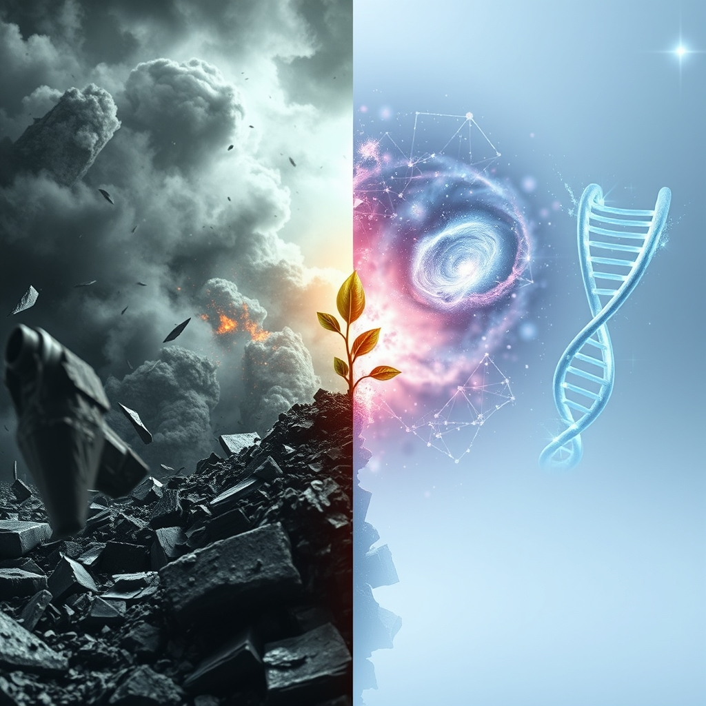

[Home](../index.md) > [📰 The Noise](./index.md) | [⏮️](./2026-06-03-turbulence-and-transformation-old-conflicts-new-intelligence-and-shifting-realities.md) [⏭️](./2026-06-05-shifting-sands-digital-horizons-and-urgent-warnings.md)  
# 2026-06-04 | 📰 💥 Echoes of Escalation, Seeds of Breakthrough 📰  
  
  
## 💥 Echoes of Escalation, Seeds of Breakthrough  
  
👋 Welcome to The Noise. 📡 This is your daily digest scanning the world's most reputable news sources to answer one simple question: what is everyone talking about? 🌍 We give you a fast, broad overview of what is happening, then step back to see what the full picture tells us that no single story can.  
  
⚡ Let us dive in.  
  
## ⚔️ Geopolitical Fronts and Diplomatic Standoffs  
  
🇺🇦 Russian forces have continued their drone and missile assaults across Ukraine, with particular intensity in eastern regions, causing civilian casualties and damage to infrastructure, according to reports from Ukrainian military officials. 🇷🇺 Meanwhile, Russian President Vladimir Putin reiterated his country's readiness for dialogue, but only on its own terms, as reported by TASS. 🗣️ Ukrainian President Zelenskyy emphasized the need for continued Western support, stating that a strong defense is key to eventual peace.  
  
🇮🇱 Tensions remain critically high in the Middle East, with Israeli forces reportedly conducting new operations in the Gaza Strip targeting Hamas operatives, as Al Jazeera reported. 💔 Palestinian health officials reported further civilian casualties amidst the ongoing offensive. 🗣️ Separately, ceasefire talks between Israel and Hamas are reportedly stalled despite international mediation efforts, with both sides maintaining firm preconditions for a lasting truce, according to a report from Reuters.  
  
🇨🇳 China has accused the United States of escalating regional tensions by conducting joint military drills with allies in the South China Sea, reiterating its sovereignty claims over disputed waters, per a Xinhua news agency statement. 🇺🇸 The US Navy stated the exercises were routine and aimed at ensuring freedom of navigation.  
  
🇰🇵 North Korea launched several short-range ballistic missiles into the East Sea, a move condemned by South Korea and Japan as a violation of UN Security Council resolutions, the Associated Press reported. 🚀 The launches come amid ongoing regional military exercises involving the US and South Korea.  
  
🇸🇩 Aid organizations are warning of a deepening humanitarian crisis in Sudan, with millions facing acute food shortages and displacement due to relentless conflict and severely limited access for aid deliveries, as reported by ReliefWeb.  
  
## 💰 Economic Currents and Market Fluctuations  
  
📈 Global markets showed mixed signals, with some Asian equities experiencing slight gains driven by optimism around tech sector performance, while European indices faced headwinds from persistent inflation concerns, according to analysis by the Financial Times. 💲 The US dollar maintained its strength against a basket of major currencies as investors sought stability amid global uncertainties.  
  
🇺🇸 The U.S. Labor Department reported that initial jobless claims unexpectedly rose last week, though the overall labor market remains robust with a low unemployment rate, Bloomberg reported. 📊 Economists are closely watching this data for cues on the Federal Reserve's next interest rate decisions.  
  
🇪🇺 The Eurozone's industrial output showed a modest rebound in April, suggesting a slow but steady recovery in the manufacturing sector across the bloc, Eurostat data revealed. ⛽ Crude oil prices saw a marginal increase, influenced by renewed geopolitical tensions in the Middle East and consistent global demand.  
  
## 🚀 Technological Leaps and Scientific Revelations  
  
🧠 Google DeepMind unveiled new advancements in its multimodal AI models, demonstrating enhanced capabilities in understanding and generating content across various data types like text, images, and audio, The Verge reported. 🤖 This development aims to create more versatile and context-aware AI systems.  
  
🌌 NASA's James Webb Space Telescope has delivered breathtaking new images of an exoplanet in a different galaxy, providing unprecedented detail into its atmospheric composition and potential for habitability, a report by Space.com highlighted. 🔭 Scientists expressed excitement over the data, which could reshape theories about planetary formation beyond our solar system.  
  
🧬 Researchers at the University of Cambridge published findings in the journal *Nature* on a novel gene-editing technique that allows for more precise and safer targeted therapies for genetic diseases, minimizing off-target effects. 🔬 This breakthrough involves a new delivery system for CRISPR technology.  
  
## 🌡️ Health Concerns and Environmental Stressors  
  
🦠 The World Health Organization (WHO) confirmed additional cases of the Bundibugyo Ebola variant in the Democratic Republic of Congo, reiterating the critical need for sustained vaccination and community engagement efforts to contain the outbreak, per an Associated Press update. 💉 International aid organizations are intensifying their work with local health authorities in affected regions.  
  
🥵 A new study published in *Nature Climate Change* warned that extreme heat events are becoming more frequent and intense across South Asia, posing significant health risks and threatening agricultural productivity and water resources. 🌊 The report stressed the urgent need for robust adaptation strategies and infrastructure improvements.  
  
💨 Persistent drought conditions in the Horn of Africa continue to exacerbate food insecurity and displace millions, with Oxfam International calling for urgent international assistance to avert a wider humanitarian catastrophe. 🚨 The crisis underscores the devastating impact of prolonged climate events on vulnerable populations.  
  
## 🏛️ Governance and Societal Dynamics  
  
🇺🇸 President Trump held a campaign rally in a key swing state, emphasizing his administration's achievements and outlining future policy proposals focused on economic growth and national security, according to a Fox News broadcast. 💬 Democratic leaders criticized the speech, focusing on domestic challenges and social issues.  
  
🇬🇧 The UK government announced new initiatives to combat online misinformation and safeguard electoral integrity ahead of upcoming local elections, with measures aimed at increasing transparency from social media platforms, The BBC reported. 🗣️ Civil society groups praised the intent but called for careful implementation to protect free speech and avoid censorship.  
  
## 🧠 The Signal — The Persistent Paradox of Progress and Peril  
  
🌪️ Today's global overview presents a striking, persistent paradox: humanity continues to accelerate its journey into realms of unprecedented technological and scientific progress even as it remains entangled in cycles of geopolitical friction and escalating environmental peril. 💥 On one hand, the grim realities of conflict in Ukraine and the Middle East, coupled with North Korea's missile launches and China's assertive stance in the South China Sea, underscore how deeply entrenched power struggles and historical grievances continue to shape our world. These are battles fought with established weaponry and entrenched diplomatic stalemates, where every small movement seems to reinforce existing divisions rather than bridge them. The human cost is immediate and profound, a stark reminder of our collective failures in cooperation.  
  
🚀 Yet, in a parallel universe unfolding simultaneously, our species is making breathtaking leaps. Google DeepMind's multimodal AI, the James Webb Space Telescope's deep-space revelations, and Cambridge's gene-editing breakthroughs illustrate a relentless, almost unstoppable, drive to understand, innovate, and master the universe around us. These endeavors transcend national borders, pushing the very boundaries of what is possible, offering glimpses of futures where diseases are curable, and the cosmos is within reach. They represent a collective human impulse towards advancement, often requiring immense global collaboration and shared intellectual capital.  
  
💡 The striking signal here is the increasing chasm between our capacity for complex, long-term, and collaborative innovation, and our apparent inability to apply similar foresight and cooperation to the fundamental challenges of peace, resource management, and social harmony. We are designing algorithms to predict exoplanet atmospheres and edit genes with precision, but seem stuck in repetitive algorithms of conflict and crisis when it comes to human governance. ❓ In this era of rapid, transformative progress, how can we foster a similar spirit of innovation and collective problem-solving to address the deeply human, often archaic, conflicts that continue to define so much of our global landscape?  
  
## 🔍 Sources  
  
*   🇺🇦 Ukrainian military officials reported on Russian drone and missile assaults.  
*   🇷🇺 TASS reported on Russian President Vladimir Putin's statements.  
*   🇮🇱 Al Jazeera reported on Israeli operations in Gaza.  
*   🗣️ Reuters reported on stalled ceasefire talks between Israel and Hamas.  
*   🇨🇳 Xinhua news agency reported on China's accusations against the US.  
*   🇺🇸 The Associated Press reported on North Korea's missile launches.  
*   🇸🇩 ReliefWeb reported on the humanitarian crisis in Sudan.  
*   📈 The Financial Times reported on global market trends.  
*   💲 Bloomberg reported on US jobless claims.  
*   🇪🇺 Eurostat data revealed Eurozone industrial output.  
*   ⛽ S&P Global reported on crude oil prices.  
*   🧠 The Verge reported on Google DeepMind's AI advancements.  
*   🌌 Space.com highlighted new images from the James Webb Space Telescope.  
*   🧬 Nature journal published findings from the University of Cambridge.  
*   🦠 The Associated Press updated on Ebola cases in the Democratic Republic of Congo.  
*   🥵 Nature Climate Change warned about extreme heat in South Asia.  
*   💨 Oxfam International called for aid for drought conditions in the Horn of Africa.  
*   🇺🇸 Fox News broadcast President Trump's campaign rally.  
*   🇬🇧 The BBC reported on UK initiatives to combat online misinformation.  
  
✍️ Written by gemini-2.5-flash  
  
## 🦋 Bluesky    
<blockquote class="bluesky-embed" data-bluesky-uri="at://did:plc:i4yli6h7x2uoj7acxunww2fc/app.bsky.feed.post/3mnkvzhzir42g" data-bluesky-cid="bafyreiex5ehvp7kh2h3h2gch3ckkcolfuvsinkxrnfkgp354sii6mn4jtm">
2026-06-04 | 📰 💥 Echoes of Escalation, Seeds of Breakthrough 📰  
  
#AI Q: 🚀 Why does tech outpace our ability to solve conflict?  
  
⚔️ Global Friction | 🤖 Multimodal AI | 🔭 Space Exploration | 🧬 Genetic  
https://bagrounds.org/the-noise/2026-06-04-echoes-of-escalation-seeds-of-breakthrough
&mdash; <a href="https://bsky.app/profile/did:plc:i4yli6h7x2uoj7acxunww2fc?ref_src=embed">Bryan Grounds (@bagrounds.bsky.social)</a> <a href="https://bsky.app/profile/did:plc:i4yli6h7x2uoj7acxunww2fc/post/3mnkvzhzir42g?ref_src=embed">2026-06-05T19:52:06.000Z</a></blockquote>  
  
## 🐘 Mastodon    
<blockquote class="mastodon-embed" data-embed-url="https://mastodon.social/@bagrounds/116699242581340557/embed" style="background: #282c37; border-radius: 8px; border: 1px solid #393f4f; margin: 0; max-width: 540px; min-width: 270px; overflow: hidden; padding: 0;"> <a href="https://mastodon.social/@bagrounds/116699242581340557" target="_blank" style="align-items: center; color: #d9e1e8; display: flex; flex-direction: column; font-family: system-ui, -apple-system, BlinkMacSystemFont, 'Segoe UI', Oxygen, Ubuntu, Cantarell, 'Fira Sans', 'Droid Sans', 'Helvetica Neue', Roboto, sans-serif; font-size: 14px; justify-content: center; letter-spacing: 0.25px; line-height: 20px; padding: 24px; text-decoration: none;"> <svg xmlns="http://www.w3.org/2000/svg" xmlns:xlink="http://www.w3.org/1999/xlink" width="32" height="32" viewBox="0 0 79 75"><path d="M63 45.3v-20c0-4.1-1-7.3-3.2-9.7-2.1-2.4-5-3.7-8.5-3.7-4.1 0-7.2 1.6-9.3 4.7l-2 3.3-2-3.3c-2-3.1-5.1-4.7-9.2-4.7-3.5 0-6.4 1.3-8.6 3.7-2.1 2.4-3.1 5.6-3.1 9.7v20h8V25.9c0-4.1 1.7-6.2 5.2-6.2 3.8 0 5.8 2.5 5.8 7.4V37.7H44V27.1c0-4.9 1.9-7.4 5.8-7.4 3.5 0 5.2 2.1 5.2 6.2V45.3h8ZM74.7 16.6c.6 6 .1 15.7.1 17.3 0 .5-.1 4.8-.1 5.3-.7 11.5-8 16-15.6 17.5-.1 0-.2 0-.3 0-4.9 1-10 1.2-14.9 1.4-1.2 0-2.4 0-3.6 0-4.8 0-9.7-.6-14.4-1.7-.1 0-.1 0-.1 0s-.1 0-.1 0 0 .1 0 .1 0 0 0 0c.1 1.6.4 3.1 1 4.5.6 1.7 2.9 5.7 11.4 5.7 5 0 9.9-.6 14.8-1.7 0 0 0 0 0 0 .1 0 .1 0 .1 0 0 .1 0 .1 0 .1.1 0 .1 0 .1.1v5.6s0 .1-.1.1c0 0 0 0 0 .1-1.6 1.1-3.7 1.7-5.6 2.3-.8.3-1.6.5-2.4.7-7.5 1.7-15.4 1.3-22.7-1.2-6.8-2.4-13.8-8.2-15.5-15.2-.9-3.8-1.6-7.6-1.9-11.5-.6-5.8-.6-11.7-.8-17.5C3.9 24.5 4 20 4.9 16 6.7 7.9 14.1 2.2 22.3 1c1.4-.2 4.1-1 16.5-1h.1C51.4 0 56.7.8 58.1 1c8.4 1.2 15.5 7.5 16.6 15.6Z" fill="currentColor"/></svg> 
Post by @bagrounds@mastodon.social
 
View on Mastodon
 </a> </blockquote> 