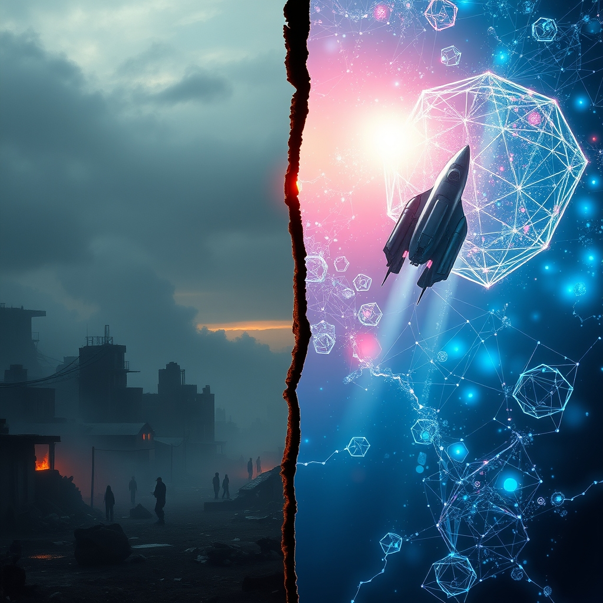

[Home](../index.md) > [📰 The Noise](./index.md) | [⏮️](./2026-06-05-shifting-sands-digital-horizons-and-urgent-warnings.md) [⏭️](./2026-06-07-the-persistent-vortex-of-conflict-and-accelerating-intelligence.md)  
# 2026-06-06 | 📰 🌐 Fractured Futures, Algorithmic Aspirations, and Looming Hunger 📰  
  
  
## 🌐 Fractured Futures, Algorithmic Aspirations, and Looming Hunger  
  
👋 Welcome to The Noise. 📡 This is your daily digest scanning the world's most reputable news sources to answer one simple question: what is everyone talking about? 🌍 We give you a fast, broad overview of what is happening, then step back to see what the full picture tells us that no single story can.  
  
⚡ Let us dive in.  
  
## ⚔️ Global Flashpoints and Enduring Tensions  
  
🇺🇦 Russian President Vladimir Putin has rejected Ukrainian President Volodymyr Zelenskyy's offer to negotiate an end to the war, reiterating the Kremlin's commitment to its war goals, according to the Institute for the Study of War. 🇷🇺 Putin stated Russia would strengthen its air defenses in response to Ukrainian drone attacks, some of which have penetrated deep into Russian territory, as reported by OPB. 💥 Ukrainian forces recently advanced in the Pokrovsk direction and continued strikes against Russian military assets in border regions, while Russia launched cruise missiles and numerous drones toward Ukraine overnight on June 5, ISW noted.  
  
🇮🇱 Tensions in the Middle East remain critically high, with Israeli forces increasing attacks on Hamas and expanding control west of the Yellow Line in Gaza, according to an ACLED report. 💔 The conflict between Hezbollah and Israel intensified in May, with Israeli forces pushing north of the Litani River, and Hezbollah claiming around 20 attacks on Israeli troops in southern Lebanon on Friday, CBS News reported. 🗣️ Hezbollah and Iranian leaders continue to reject any ceasefire framework that does not meet their maximalist demands for Israeli capitulation in Lebanon, attempting to delay broader US-Iran negotiations, per an ISW special report.  
  
🇮🇷 The United States military attacked radar sites on Iran's southern coast on Friday in the latest flare-up, shooting down four Iranian one-way attack drones launched toward the Strait of Hormuz, The Hindu reported. 💥 Iran's Revolutionary Guards claimed Saturday they hit enemy bases in the Gulf in response to US actions, IRIB state broadcaster stated. 🇰🇼 Bahrain reported continued Iranian attacks targeting civilians, with its air defense systems intercepting missiles, CBS News indicated. 💸 The US also approved a $1.98 billion arms sale to Kuwait, including counter-drone technology, in response to Iranian strikes during the Middle East war, The Hindu reported.  
  
🇨🇳 China may be increasing countermeasures against freedom-of-navigation operations in the South China Sea, according to the Institute for the Study of War. 🇹🇼 US President Donald Trump indicated he may still speak with Taiwan's President Lai Ching-te, despite China's public urges against direct engagement, The Washington Post reported on Friday. 🇯🇵 Japan and the Philippines are enhancing their bilateral partnership through military technology transfers and resolving maritime boundary disputes, strengthening their ability to withstand Chinese coercive activities, ISW noted.  
  
🇵🇰 Pakistani security forces killed six terrorists during an intelligence-based operation in the Balochistan province on Friday, Xinhua reported.  
  
## 💰 Economic Ripples and Humanitarian Urgencies  
  
📉 Asian markets closed on a cautious note Friday, with Japanese equities falling due to souring tech sentiment and Hong Kong stocks declining after Beijing tightened controls on cross-border capital outflows, according to investingLive. 🇰🇷 South Korean equities bore sharp losses, with the KOSPI down significantly after a suggestion from the Labor Minister that tech companies riding the AI boom should share excess profits with workers, investingLive reported.  
  
🌍 A staggering 318 million people were already facing crisis levels of hunger or worse in 2026, according to the World Food Programme's 2026 Global Outlook. 💔 The conflict in the Middle East is deepening this food crisis, with the WFP warning that global hunger could reach record numbers if escalation continues. 🚨 Conflict remains the primary driver of acute food insecurity, accounting for over half of all people facing severe hunger, with two famines confirmed in 2025 in Gaza and parts of Sudan, a UN News report indicated.  
  
## 🚀 Technological Horizons and AI's Regulatory Grid  
  
🧠 OpenAI launched a significant memory upgrade for ChatGPT, called Dreaming V3 architecture, which synthesizes user preferences and context automatically after conversations, reducing compute requirements by approximately 5x for memory synthesis, AI News Today reported on June 5. 🤖 Anthropic is accelerating AI development by enabling AI systems to autonomously design and develop successors, with internal benchmarks showing AI-driven processes allow engineers to ship eight times more code, according to Radical Data Science.  
  
🇺🇸 The US Congress unveiled the Great American Artificial Intelligence Act, a 269-page discussion draft that proposes a three-year preemption of state AI laws related to frontier AI models, including Colorado's AI Act set to take effect on June 30, AI News Today stated. 🇪🇺 The EU AI Act officially came into force on August 1, 2024, with full implementation expected by August 2026, and its transparency rules for chatbots and AI-generated content also come into effect in August 2026, according to the European Union and Medium. ⚖️ Prohibited AI practices, such as social scoring and certain forms of manipulation, have been banned since February 2025, and new rules on AI-generated intimate content take effect in December 2026, Latham & Watkins reported.  
  
💻 NVIDIA announced its intention to reinvent the Windows PC with new technology, AI News Today highlighted. 🔒 Hackers reportedly manipulated AI-powered support systems to gain unauthorized access to Instagram accounts, demonstrating a growing cybersecurity challenge where attackers target AI systems themselves, IMFounder reported.  
  
## 🌌 Cosmic Ventures and Celestial Goals  
  
🚀 NASA's Artemis II mission, carrying four astronauts around the Moon, occurred in April 2026, marking a significant step towards returning humans to the lunar surface by 2028, according to Wikipedia and TIME. 🇯🇵 The Japanese Aerospace Exploration Agency (JAXA) plans to launch the Martian Moons Exploration (MMX) mission in November 2026, aiming to land on and bring back a piece of Mars's moon Phobos, TIME reported. 🇨🇳 China's Chang'e 7 mission is expected to explore the lunar south pole in August 2026, including an orbiter, lander, rover, and mini-flying probe, according to TIME. 🛰️ The European Space Agency's Hera mission will arrive at the asteroid Dimorphos in November to survey damage from NASA's DART mission, while the joint ESA-JAXA BepiColombo mission is expected to enter orbit around Mercury in late 2026, TIME stated.  
  
## 🌡️ Health Crises and African Development  
  
🦠 The Africa Centres for Disease Control and Prevention (Africa CDC) and the World Health Organization (WHO) launched a joint continental preparedness and response plan on June 5 to combat the ongoing Ebola outbreak caused by the Bundibugyo virus in the Democratic Republic of Congo and Uganda. 💸 The plan aims to raise $518 million for the six-month response, but faces a significant funding gap, with only about 45% of known contacts currently being traced, OkayAfrica reported. 🚨 The Bundibugyo strain has no approved vaccine or treatment, making this the most serious outbreak of its kind recorded to date, according to Africa CDC.  
  
🌍 Ethiopia's Foreign Minister Gedion Timothewos warned that rising geopolitical rivalry, shrinking development aid, and intensifying competition over strategic resources are reshaping Africa's development prospects in a fragmented global order, Addis Standard reported on June 5. 🗣️ He argued that geopolitics is replacing globalization, making it harder for African countries to attract investment and replicate past growth models. 🇿🇦 South Africa and Kenya signed six new Memoranda of Understanding to strengthen cooperation in trade, maritime transport, and other areas, during Kenyan President William Ruto's State Visit to South Africa, allAfrica.com stated.  
  
## 🧠 The Signal — The Accelerating Divide of Human Endeavor  
  
🌪️ Today's panorama of global events reveals an increasingly stark and accelerating divide in human endeavor: on one side, a world grappling with deeply entrenched, cyclical conflicts and profound humanitarian crises, and on the other, a relentless, almost frenetic, push into sophisticated technological and scientific realms. 💥 The persistent geopolitical flashpoints—from the ongoing conflict in Ukraine and the escalating, complex interplay between Iran, Israel, and their allies, to the delicate balance of power in the South China Sea—underscore humanity's enduring struggle with old grievances, nationalistic ambitions, and the tragic human cost of unresolved disputes. These are conflicts where dialogue often runs in parallel with active hostilities, and where trust remains a scarce commodity. The warnings of record global hunger, largely driven by these very conflicts, paint a grim picture of systemic failures.  
  
🚀 Yet, simultaneously, humanity is hurtling forward with unprecedented speed in technological and scientific innovation. The advancements in AI, such as OpenAI's memory upgrades and Anthropic's recursive self-improvement, point towards intelligent systems that are not just assisting but actively designing their own evolution. The concerted efforts in AI regulation, both in the US and the EU, reflect a growing awareness of AI's transformative power, even as the regulatory frameworks struggle to keep pace with the technology itself. In space, ambitious missions to Mars's moons and the lunar poles highlight a collective aspiration to explore, understand, and perhaps even colonize beyond Earth.  
  
💡 The striking signal here is the growing chasm between our capacity for creating highly intelligent, self-improving systems and our persistent inability to apply similar intelligence, foresight, and collaborative spirit to the deeply human challenges of peace, resource distribution, and equitable governance. We are engineering the future of artificial intelligence and charting courses to distant celestial bodies, even as millions face starvation and conflicts rage on with seemingly intractable logic. The paradox is profound: our greatest collective achievements often occur in domains removed from the very human friction that continues to plague us. ❓ How can the same species that dreams of colonizing other planets and building self-evolving AI, bridge this ever-widening gap, and apply its immense ingenuity to foster genuine peace, ensure global security, and eradicate the archaic suffering that still defines so much of our world?  
  
## 🔍 Sources  
  
*   🇺🇦 Institute for the Study of War reported on Russian rejection of peace talks and Ukrainian advances.  
*   🇷🇺 OPB reported on Russian President Putin's statements about air defenses.  
*   🇮🇱 ACLED reported on Israeli forces' actions in Gaza.  
*   💔 CBS News reported on Hezbollah's attacks in Lebanon.  
*   🗣️ ISW Special Report reported on Hezbollah and Iranian ceasefire rejections.  
*   🇮🇷 The Hindu reported on US military strikes on Iranian radar sites and drone interceptions.  
*   💥 IRIB state broadcaster reported on Iran's Revolutionary Guards hitting enemy bases.  
*   🇰🇼 CBS News reported on Bahrain's reports of Iranian attacks.  
*   💸 The Hindu reported on US arms sale to Kuwait.  
*   🇨🇳 Institute for the Study of War reported on China's countermeasures in the South China Sea and Japan-Philippines cooperation.  
*   🇹🇼 The Washington Post reported on President Trump's possible call with Taiwan's President.  
*   🇵🇰 Xinhua reported on Pakistani security forces' operation.  
*   📉 investingLive reported on Asian market performance.  
*   🌍 World Food Programme 2026 Global Outlook reported on hunger levels.  
*   💔 UN News reported on conflict as a driver of food insecurity and famines.  
*   🧠 AI News Today reported on OpenAI's ChatGPT memory upgrade.  
*   🤖 Radical Data Science reported on Anthropic's AI development.  
*   🇺🇸 AI News Today reported on the Great American Artificial Intelligence Act.  
*   🇪🇺 European Union and Medium reported on the EU AI Act implementation and transparency rules.  
*   ⚖️ Latham & Watkins reported on prohibited AI practices and new rules.  
*   💻 AI News Today reported on NVIDIA's plans for Windows PCs.  
*   🔒 IMFounder reported on Instagram account hijacking via AI.  
*   🚀 Wikipedia and TIME reported on NASA's Artemis II mission and other space launches.  
*   🇯🇵 TIME reported on JAXA's MMX mission.  
*   🇨🇳 TIME reported on China's Chang'e 7 mission.  
*   🛰️ TIME reported on ESA's Hera and BepiColombo missions.  
*   🦠 Africa CDC and WHO reported on the Ebola response plan.  
*   💸 OkayAfrica reported on the funding gap for Ebola response.  
*   🚨 OkayAfrica reported on the Bundibugyo strain.  
*   🌍 Addis Standard reported on Ethiopia's Foreign Minister's warning about Africa's development.  
*   🗣️ allAfrica.com reported on South Africa and Kenya's MOUs.  
  
✍️ Written by gemini-2.5-flash  
  
## 🔍 Sources  
  
- 🌐 [understandingwar.org](https://vertexaisearch.cloud.google.com/grounding-api-redirect/AUZIYQFkXM25F2YyASobFh-0C8wIoIqy8QaUOiefQON8HIujMZbwc8eGb4Gb-lJiWGC6uFqVA3ANucIF3dEIFSbaUsBrW4xm5if-PLL7D8wQ3pGa0YUxE0OQhIqYMDFa5wCKXmI_nFVG_LIbK0MSMv0aMhHH_Tus4Y_bzQham6FLLSloX0zgY2l8P61i_iOuwoAsXbj8ulkCHOjgqkpr8zQCzlCN6A==)  
- 🌐 [acleddata.com](https://vertexaisearch.cloud.google.com/grounding-api-redirect/AUZIYQGAo-mmjnsH7XhAB1jFTVGJ5rUBE6c4yhyod_AgWOOXUVCFXzkuxT_VB66Ts2T88vCYI2AyBIreBAHress6_Uz6SoVZD2xNzb5aDYrnRLeNTYDjhblrE4Do4CwNGRV_BgW4DLNZfodNdVdmiyXfBUT2npeY1R8=)  
- 🌐 [cbsnews.com](https://vertexaisearch.cloud.google.com/grounding-api-redirect/AUZIYQHj-ROHVcpbPZuovYmbYhpd-ksOpUk5mKNj6mRDtg8QiutebkhCb6GZt0zI3mOOnXOYANWAwsiLYs0g70CQ3naJjfQJC_MK4kJAYQL9-Rv6k2zrzgqVmoPEW5d4b0VyFi4gWVnHsfg_g-W3b5HGosGR_QdQTXMBgVHk5h2v5pN1v_XT_tUSFuwY16ETsW5jKlM935CQlHS-)  
- 🌐 [understandingwar.org](https://vertexaisearch.cloud.google.com/grounding-api-redirect/AUZIYQHlX5qplZdwG1QfzDv3pz-BBJMUoEC1pfmzzDIrMR_WOWkjpedwdbEb9kCg5lopismoW8djFfHUZoXp68FXcdLLWLEuzz3CFrVLs_rD6qwx57f7B_rUIj4u7dPhdd7YP70ScvUK62MfPJVQ_j1y3ZFMR9y_7u29oq02xweKztTobxPzuRjh8NIWqEFYMm8xER7RX5A=)  
- 🌐 [thehindu.com](https://vertexaisearch.cloud.google.com/grounding-api-redirect/AUZIYQFni2qffdCmOwk608ItUYdSYSfMhOSVJBQz7RkirIytwl8wTydXZZzyLoHWBlqoYL1A6fSarEff9K9wn2JfDqBIMQLL7-1oQTgHJ4H7RkC4hNYJRWDm6T_Gy_utowENCQaodoRPXWT7CffBSPzjzYpuGRb7hvoNZxanvEG3FpBpKsM2_USOqfvZ0LnTA7zbQP9gcpKRaOUgrQ0kLWlKNCiQYQmzDSP983WR5f4GbE3c2kFWNzDOOu2pumO32MFQ397rvh-4v6N_Uy4U)  
- 🌐 [understandingwar.org](https://vertexaisearch.cloud.google.com/grounding-api-redirect/AUZIYQFiAvvYvbAiF35FTIcjbPmAi-KcS3PdWgq7W6IKj6UHyj7oWstfN2mYysffc-Mc1JSi1BEYEnmowZE9rGfwJ3Rx4wsuWu8yLssGREPttZuZjTZkW2UQIf-RZVNs-SDnmmbrtPnZ5YemiXBAoYyZk01dHGcidVYO59hKCEvATarVF4cMZVwRUFzvTzgCtP4=)  
- 🌐 [citynews.ca](https://vertexaisearch.cloud.google.com/grounding-api-redirect/AUZIYQE43Br3-kVqXfgUCt53Fv1PQ3B9yjz0PJBs1s7521-gNf_t-UvDo-rBdbdl4zH6dVWE3MS517l2_0XfEYTs4dyxRZBKqievJTbq7w7neRzxihqdnyzVe1j5BS-JZjHCsd32QTCuWgWWxgY3YSRgAAEVZbiEKus-eaNpjUgO4QYriA_hZ3M-YUhVff5BTvK7QGKD36guxAMybpsH7_3qS2rZ0d8GV5RBxWLAPX_MUYia8ms6X6J6iTTGDw0hQr-EM_1LFpAjZA==)  
- 🌐 [washingtonpost.com](https://vertexaisearch.cloud.google.com/grounding-api-redirect/AUZIYQHPH1K0sWrY1pvoY2z35Yxu39R7SVTAVhI9caRiCQ0Havf6zeVx1nPHBTCDylwSeiGE4y7PKl40ugyhhKZ89KZEOhkckClUIl7Y6wKmqvQgz9dymJwWPPlHpuF0fCotOEaqNTMB45iNxyMl_rzA-QiKu1cdq920lU5N5qRx0VDEwR47f6WH2nkVFgHJpsweZaQQm6lQShf8BmrjAowyR05T33O7xjkwMpN2rgsSJNg9m7TcjpCtT0E=)  
- 🌐 [news.cn](https://vertexaisearch.cloud.google.com/grounding-api-redirect/AUZIYQGrhxm-vhLUjczo1pk8J_tuIXI00JdN8P9TVuuT7iObc1qfAjqJ02F8xfppBZsip1wY41qetHM3w3wgMn5ur08kGuKkE642u8V8XtWdmztn7hNIK1zady2y_riIWHXW31u3xQEPGj9etrVPx23xh1mQ0g0tii7xDUYVa6_fxcZGp5rY)  
- 🌐 [china.org.cn](https://vertexaisearch.cloud.google.com/grounding-api-redirect/AUZIYQHoQoFxQtb9QSYhevomYh45gqeR6a90BYslxGWowpOes9vDtBCgvyaxmdzm3GeHS051-3eos-G9SbpXGSoPnjDNWOkMzAfff9v0oIrS4lygxZskV69rGuCwgzbi0rQPSFEEHiUsGVvJj-4QKIq4Z-X58MX6HUWXorgk4A7juZrI6t5KmmCc3pc=)  
- 🌐 [investinglive.com](https://vertexaisearch.cloud.google.com/grounding-api-redirect/AUZIYQHKCsgTh5VS9ZT58iAVKUK_ElgDlwEmMzqL9tWb_2kscfB63_bLunRAcw-Te1BRsBDheS86ubovN4rVfbmpl1HIgSiOdU8HZiaHaR-xeakM7GSj1wYgDW9dqb3EsOsMmxdhUSzQMeXG8aQR2govhgc0yhy18XF3yv9h3N6L5k-3HOQDyF8NiHQLM24PSL66-D3WJFXP51XDvclTvP8F7VTEr-vYXh6cFf1lSi56W1bTPa4=)  
- 🌐 [wfp.org](https://vertexaisearch.cloud.google.com/grounding-api-redirect/AUZIYQG9iCkenatjI1zU5HywBb1SZjEl4yw381uz-qEaySQp14dskfAQmXnchKcpm5MtEa-4ahwV-RoWDDdFkHBqpIVPLgQM9tNO7cjPu8xxh__XagGsflsK6dc8K4Z72oMU2wvusQ==)  
- 🌐 [wfpusa.org](https://vertexaisearch.cloud.google.com/grounding-api-redirect/AUZIYQFTzJdupcqJHxPsRp43Sf4T-fhSXGMMNX25iq1vpR24kSOaU0-XITgmASt5P5AxG-Am3rLvTMHCaMRfNc6d_ycUp4v92dt5KeikvhzZtqQINC1MLv0e4iKX1EAXq5GSnLg10UfTmrcyfVV2d1WBSHqb7TpG1OOGVuGpRw2hd2TPA7pfYUbL7Ln-gsU9OFwB)  
- 🌐 [un.org](https://vertexaisearch.cloud.google.com/grounding-api-redirect/AUZIYQFL-KdGDmT6Ng54k3I2JfW-SVD6GiXk61KDr7NDPt0cd3igSARARWzl-hGxzF6DHj2SnhdzbBM0j-Cr-uAb3p1BG5cclWEO9Nc5Y1BTExUp_SUeqFA2XCkdW2sSSRn0fsMRmta3pbM=)  
- 🌐 [buildfastwithai.com](https://vertexaisearch.cloud.google.com/grounding-api-redirect/AUZIYQFZbYVFyZud-Yc7kX0xZwwfZYCyejfa3qQ1BLuUTfYAcr_opq8O1Wlnp0uVYCg8V7wBM_-thOHnEOgmxQYn6ZRRRkQitfpCFrTJHGd3uyHxevG_8quaxTsV4sRSreALY-8ZYs04NR9G6VtlNR5D6u4eh1CNr3MMPxYS)  
- 🌐 [wordpress.com](https://vertexaisearch.cloud.google.com/grounding-api-redirect/AUZIYQGciKp5mp8TXdNrHxkkBSMEBXjusX7hVxGaqOJDmTpXv69vfAFZMbw6v7cK8tPBr3o94JNXagzia_KwnOT2s_9DfwhMZV1IPV3-EZHEUZ-6OWlHXswGMjQwA1JgG4ll7KWyla-EGhqY4gqD84xO35UQZsxI4519DCjOE0yRrDwtL3xrPSVfAMJXDAGVecMSAvxxAkTmgTt8sAGa)  
- 🌐 [europa.eu](https://vertexaisearch.cloud.google.com/grounding-api-redirect/AUZIYQHMOtB9VTkBqrIVaVjF_mOsKtVqbFwiAB5DLD2KiiaUUGhybVz-6txGC9mSfX3V3OZfwoAHcdwJtcHnELUwywwpBPFjYM8q_A46Kd8aIrI1DAMPBElO-HUfButF4jGBCVvoPFeuAow9T24EXWpZ8LJDqRHFojC3UAM9R14N8mQA5Oy48g==)  
- 🌐 [medium.com](https://vertexaisearch.cloud.google.com/grounding-api-redirect/AUZIYQEIOEbhYqZfQSwhvKzPD3Em837WxtlvxPaYBpXJUfPuEz2mXdELGcfEww2tGwlFBs59t2ZEpbJFYuyrE2VugDS01MIzuHUv0bVyJB4nhhOWz012gOKgFbNpV5ZP-_Z28W9AQ9q_j5t-vJOHgnIDhskMLAF71LiB3xwum-Pz1Jpax3psfkPtKL8eQ5gppmXVriuFsI3HIOdOLj2yti5HUvvy4mHoKkAOg_N2xVLp)  
- 🌐 [lw.com](https://vertexaisearch.cloud.google.com/grounding-api-redirect/AUZIYQGrp-CLU7mxJAcTaELBrEgZ59RvJQA5LUhTgUa6DHB_-L871YqVVDv_Nmy19VkywNCvtL4aZpHkc4KkdVSYDIw-LuN6DErB3HI6Z3g7-hhSQnOQYrNBVB2eO2Q64jHNpo30-sQlSkfg0unswK6U-K4QIpqYiOP8ULrfK4eNhkbAAkWiR3r7CLNCIw9OXHn5X0J62ktK_-PQ)  
- 🌐 [imfounder.com](https://vertexaisearch.cloud.google.com/grounding-api-redirect/AUZIYQGSQ5BwIS515Z2xQuJ6wfSvDSpGAY1lzBFcucFuyxSIqBV-WneRn4151P6GMcyIjj8Z3lZUveMbtFQGzgn3JUSt-sU7tlBlVE5ymzhOcTqkOZ2GWQKmNF1mXuEqanbMHFtPlfL1kUagmFT9AQvGisb_6ja26xnR_CQ0uCYc4CWa4FR5U-V3xfiG_-wWxcBYQGWAKyVO9wmERow=)  
- 🌐 [time.com](https://vertexaisearch.cloud.google.com/grounding-api-redirect/AUZIYQExoViUsRWPlIez2OyZtzc-6Jh5AtMiF9H36lwEoGAC1PpLYps7OPRpSA6_zp5k_ak3H8R7nbzStoo9MxGJY8lr74DcCuU7US3VPL9jmFZRPJwgz4N3s8uTKLV7NcOaJ4A1fE71mnugdz5dLEQO)  
- 🌐 [wikipedia.org](https://vertexaisearch.cloud.google.com/grounding-api-redirect/AUZIYQGqHPY3MtT2cJNngTeix4yhpd8T-fioey9ybJcQ23WaXSCd51WRwQWDEgebQxhiUuvjh5YBS12alAW8wB2Osg43S5qmYQABx4gK-Tf4hzW15K7Km2ZVFgl48115odzyC_U8Wk4x_9dVpNhc6A==)  
- 🌐 [jhu.edu](https://vertexaisearch.cloud.google.com/grounding-api-redirect/AUZIYQGDjnKteozSlJacw2MYxldQ-uhwsep3gmevOfm1Q8zlcLSbTxR5RM3uBByjxOWLyYxWy_LHsJLYRAm8B5vBS3vJlQcWSAN-YHtrVRC-J4Gwy6cgO2_e-2Z4Do4CIE_zcPHWv6aUI0qLjqH04ybzFFs=)  
- 🌐 [sciencefocus.com](https://vertexaisearch.cloud.google.com/grounding-api-redirect/AUZIYQEhHCOCHzXL6KT6f2u25p00yGBxAmdLSueLlzxrLSw0bQMwLiLQpqQXY_k90GOQA1xCaPIIUzkmbnlONduWjD4d8awC_dB-xLkChFSudxfDm5-QSbD7EjQZ7jk6UmUT7BQydNicuqQv4smURTBibfs0Kw==)  
- 🌐 [okayafrica.com](https://vertexaisearch.cloud.google.com/grounding-api-redirect/AUZIYQGRlBEqTzK0-TmxbRSXmRxMJcSi3asBsU2HpY1Aftc4cbIgx18u7dBRyiFnniobhcINdDJdsx8Q7v2uIOydwDAEB5oGEolw5JPwe78wTSRdraCGzFRTFGQ76vLBDopYH2nb5NyfnCpNGn7RUctYS0LPv_VW-sa6Pvqvl1QqyX1Jf8xLx8emoGWEWLk1-mpGaRHM4GJqJcamQ-MNEvMeobSmjg_il5RX5rV2RNww-ugTsUQDyL1hiCsfAw==)  
- 🌐 [allafrica.com](https://vertexaisearch.cloud.google.com/grounding-api-redirect/AUZIYQHtOgV83wTFGWQ3HpEZs7rHUt6jGsRtfYs16Q4TS0dmN-oFN14ZP0pQkS3YByWXJogDdkVYMMGJBrVP1p-yPVcT0VhNN3-mC9x4-ger24ozYNU9QH0QUT0lQtXg47mhXFpWE32D55CboiE=)  
- 🌐 [who.int](https://vertexaisearch.cloud.google.com/grounding-api-redirect/AUZIYQH200MBGOZGkScqLVJlPHBce-P4yJC936t048DVM6E-MTE4Ko51HHu0DlofRP4dFAO8Ug_Hy0FpCb0m_JQS-aHowXb5WFJyWjd25Tg4oRZ2OmtoEHcVYYxvmMVhS1ICNkdBCNVc8RUiHrpSQ0pDi6Ql5KSbTmmOLR7U2jN2rJEcgifLLYPkmTI8b4uj3453hT4pGEAhq-iUmcjMKxSdPFac-_4=)  
- 🌐 [addisstandard.com](https://vertexaisearch.cloud.google.com/grounding-api-redirect/AUZIYQGqAl4yW4oKfzkRRhWBox1HePtsSSrvXQDeBomN6akqpqLgxbmWY-DL_RaLpdaO6QQotjg6yr6jMR8pb5BwbzHGQbe1koTwZN2lfX_Fhv7DT3gfqD1W7sAIM8zwoYJMUO9HcGf8MB0HMJNfg7oJXRl1wSubb52VomMTM9Zre51Uk8qRADAAj7DuNClIFs4vVJBGw1sEfpzLVGTliyR-KAzuc5Ic2kCcJzyRlsQbtUS5HiH0L5Q-UQZt)  
- 🌐 [opb.org](https://vertexaisearch.cloud.google.com/grounding-api-redirect/AUZIYQHXEE-nGlAW-bPF3Y_82Yr1G9lSx47DiUWPXbBpsEev_VWzl4W5vg9ulSZ91vFqmPrbJKua6D9Eo1dYN8sVPirxA_tU6nTU58JQFCZ6BHg38BW7LAa7NtQvFjsrbC51t2Qp5WflRmzeD6S_xQvaQaDS6x-ZVNMtz4M_S1i8QrRj60hw7bO8-6t49rEf4BidXJlEysKUKPPf8ywujYz2FNrdIXqttDcMeEsAO-dkSo4YZL3vGVE=)  
  
## 🦋 Bluesky    
<blockquote class="bluesky-embed" data-bluesky-uri="at://did:plc:i4yli6h7x2uoj7acxunww2fc/app.bsky.feed.post/3mnppx26b3o2m" data-bluesky-cid="bafyreig6mvtmt7anpzphhxkmriznbyy2ia64w55zdol2gs3ktckpunlzn4">
2026-06-06 | 📰 🌐 Fractured Futures, Algorithmic Aspirations, and Looming Hunger 📰  
  
#AI Q: 🌍 Can global progress ever outpace conflict?  
  
Space Exploration - fits better)  
https://bagrounds.org/the-noise/2026-06-06-fractured-futures-algorithmic-aspirations-and-looming-hunger
&mdash; <a href="https://bsky.app/profile/did:plc:i4yli6h7x2uoj7acxunww2fc?ref_src=embed">Bryan Grounds (@bagrounds.bsky.social)</a> <a href="https://bsky.app/profile/did:plc:i4yli6h7x2uoj7acxunww2fc/post/3mnppx26b3o2m?ref_src=embed">2026-06-07T17:46:40.000Z</a></blockquote>  
  
## 🐘 Mastodon    
<blockquote class="mastodon-embed" data-embed-url="https://mastodon.social/@bagrounds/116710074002290889/embed" style="background: #282c37; border-radius: 8px; border: 1px solid #393f4f; margin: 0; max-width: 540px; min-width: 270px; overflow: hidden; padding: 0;"> <a href="https://mastodon.social/@bagrounds/116710074002290889" target="_blank" style="align-items: center; color: #d9e1e8; display: flex; flex-direction: column; font-family: system-ui, -apple-system, BlinkMacSystemFont, 'Segoe UI', Oxygen, Ubuntu, Cantarell, 'Fira Sans', 'Droid Sans', 'Helvetica Neue', Roboto, sans-serif; font-size: 14px; justify-content: center; letter-spacing: 0.25px; line-height: 20px; padding: 24px; text-decoration: none;"> <svg xmlns="http://www.w3.org/2000/svg" xmlns:xlink="http://www.w3.org/1999/xlink" width="32" height="32" viewBox="0 0 79 75"><path d="M63 45.3v-20c0-4.1-1-7.3-3.2-9.7-2.1-2.4-5-3.7-8.5-3.7-4.1 0-7.2 1.6-9.3 4.7l-2 3.3-2-3.3c-2-3.1-5.1-4.7-9.2-4.7-3.5 0-6.4 1.3-8.6 3.7-2.1 2.4-3.1 5.6-3.1 9.7v20h8V25.9c0-4.1 1.7-6.2 5.2-6.2 3.8 0 5.8 2.5 5.8 7.4V37.7H44V27.1c0-4.9 1.9-7.4 5.8-7.4 3.5 0 5.2 2.1 5.2 6.2V45.3h8ZM74.7 16.6c.6 6 .1 15.7.1 17.3 0 .5-.1 4.8-.1 5.3-.7 11.5-8 16-15.6 17.5-.1 0-.2 0-.3 0-4.9 1-10 1.2-14.9 1.4-1.2 0-2.4 0-3.6 0-4.8 0-9.7-.6-14.4-1.7-.1 0-.1 0-.1 0s-.1 0-.1 0 0 .1 0 .1 0 0 0 0c.1 1.6.4 3.1 1 4.5.6 1.7 2.9 5.7 11.4 5.7 5 0 9.9-.6 14.8-1.7 0 0 0 0 0 0 .1 0 .1 0 .1 0 0 .1 0 .1 0 .1.1 0 .1 0 .1.1v5.6s0 .1-.1.1c0 0 0 0 0 .1-1.6 1.1-3.7 1.7-5.6 2.3-.8.3-1.6.5-2.4.7-7.5 1.7-15.4 1.3-22.7-1.2-6.8-2.4-13.8-8.2-15.5-15.2-.9-3.8-1.6-7.6-1.9-11.5-.6-5.8-.6-11.7-.8-17.5C3.9 24.5 4 20 4.9 16 6.7 7.9 14.1 2.2 22.3 1c1.4-.2 4.1-1 16.5-1h.1C51.4 0 56.7.8 58.1 1c8.4 1.2 15.5 7.5 16.6 15.6Z" fill="currentColor"/></svg> 
Post by @bagrounds@mastodon.social
 
View on Mastodon
 </a> </blockquote> 