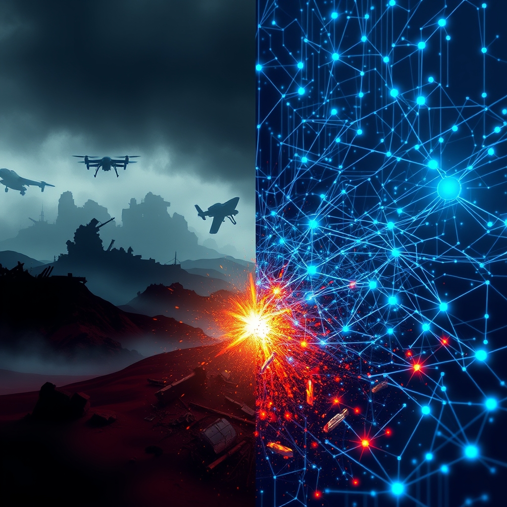

[Home](../index.md) > [📰 The Noise](./index.md) | [⏮️](./2026-06-09-the-algorithmic-divide.md)  
# 2026-06-10 | 📰 ⚔️ Geopolitical Ripples and Persistent Conflicts 📰  
  
  
📰 Welcome to The Noise. 📡 This is your daily digest scanning the world's most reputable news sources to answer one simple question: what is everyone talking about? 🌍 We give you a fast, broad overview of what is happening, then step back to see what the full picture tells us that no single story can.  
  
⚡ Let us dive in.  
  
## ⚔️ Geopolitical Ripples and Persistent Conflicts  
  
🇺🇦 Ukrainian air defenses reportedly intercepted over 180 out of 207 Russian drones, including jet-powered variants, during an overnight attack on June 9-10, with strikes recorded at 14 locations across Ukraine. 🇷🇺 Ukrainian special forces also claimed to have struck two Russian oil pumping stations in Vladimir Oblast, approximately 700 kilometers from Ukraine, which reportedly supply fuel to Moscow and facilitate exports to Baltic Sea ports. 🗣️ The EU has approved a new "mini-package" of sanctions against Russia, targeting 34 individuals and 47 entities, and extended a ban on investments in Crimea for another year.  
  
🇮🇱 Tensions in the Middle East remain acute, with an Israeli drone reportedly opening fire in the Al-Salatin area of northern Gaza, and Israeli forces demolishing residential buildings east of Gaza City's Zeitoun neighborhood. 💔 Israeli media reported 13 injuries from Hezbollah attacks, alongside Israeli operations inside Lebanon near Kiryat Shmona. 🗣️ The UN Human Rights Office has accused Hamas of carrying out executions, beatings, and mutilations of Palestinians in Gaza during the war, identifying hundreds of cases that may qualify as war crimes. This report comes as the UN Secretary-General expressed deep concern over Israel's decision to close key Gaza crossings and suspend humanitarian aid entry, noting that 1.9 million Palestinians remain displaced and dependent on aid.  
  
🇺🇸 US President Trump has expressed optimism about reaching a deal with Iran within the next few days, stating that the two parties are in the final stages of a "very, very good deal that will not in any way allow nuclear weapons," according to CNBC reporting on June 9. 🇨🇳 Meanwhile, China's Foreign Minister Wang Yi reportedly warned US Secretary of State Marco Rubio that Taiwan represents the biggest risk in China-US relations, urging the US to honor its commitments. 🇹🇼 US Senator John Thune emphasized strong support for enabling Taiwan to defend itself against Chinese aggression.  
  
🇸🇩 The world's largest hunger crisis continues to worsen in Sudan as the civil war enters its fourth year, exacerbated by disruptions to aid from the closure of the Strait of Hormuz, as reported by PBS News.  
  
## 💰 Economic Headwinds and Shifting Markets  
  
📉 German industrial production data showed a slight improvement, with a year-on-year decline of only 0.5%, easing some concerns. 📈 China recorded a surprisingly strong rebound in trade, with May exports surging by 14.1% year-on-year, and imports growing even more dynamically by 27.4%. 💲 US stock indices, including the S&P 500, Dow, and Nasdaq, saw gains on June 9, fueled by tech sector performance and President Trump's positive remarks on an Iran nuclear deal.  
  
🇪🇺 The Euro is awaiting the European Central Bank's interest rate decision on Thursday, with markets expecting a hike due to inflation ticking past the 2% target for two consecutive months. 🛢️ Crude oil prices reportedly pulled back on June 9, with WTI crude below $90 a barrel, after earlier concerns about Middle East tensions.  
  
🌍 The tenth Atlantic Council Global Energy Forum took place on June 9-10 in Washington D.C., focusing on the evolution of the global energy landscape and charting its future. Energy Secretary Wright warned that China's electricity advantage could cost the US its lead in AI during a panel discussion at the forum.  
  
## 🚀 AI's Expanding Frontier and Regulatory Frameworks  
  
🤖 On June 2, President Trump signed a new Executive Order titled Promoting Advanced Artificial Intelligence Innovation and Security, which mandates federal agencies to enhance AI-enabled cyber defenses within 30 days and establishes a voluntary framework for secure deployment of frontier AI models. This order emphasizes cybersecurity and national security, while aiming to avoid stifling innovation with excessive regulation. ⚖️ This federal move comes amidst ongoing discussions around the Great American AI Act in Congress, which proposes a three-year preemption of state AI laws related to frontier AI models.  
  
🇪🇺 The European Commission responded firmly to Apple's decision not to roll out its new Siri AI service in the EU, stating that EU law, particularly the Digital Markets Act, is "non-negotiable" regarding interoperability and privacy standards. 🌐 The EU Telecommunications Council backed progress on key digital files, including European business wallets, the Digital Networks Act, and Cybersecurity Act 2, underlining a push for secure cross-border business tools and resilient digital infrastructure.  
  
🧠 Experts at the Destination Earth (DestinE) User Exchange in Brussels, held on June 9-10, discussed the latest developments in the initiative, including Digital Twins, Digital Twin Engine, and AI models and solutions for climate resilience.  
  
## 🌡️ Health Concerns and Environmental Imperatives  
  
💊 South Africa has reportedly begun distributing a twice-yearly shot that is 100% effective at preventing HIV. 🦠 New cases of World Screwworm, a flesh-eating parasite, have been detected in Texas and New Mexico, the first in sixty years, with some attributing the outbreak to border crossings. 🍎 A new oral GLP-1 medication from AstraZeneca, elecoglipron, has shown promise in aiding weight loss and lowering blood sugar levels in phase 2b clinical trials. Additionally, a study suggests that drinking alcohol may lead to cravings for ultra-processed foods.  
  
🌳 Global mangrove forests, once considered highly threatened, are reportedly rebounding and expanding worldwide, largely due to natural regeneration and expansion into higher-latitude regions due to warming temperatures. This offers a hopeful sign for climate and coastal resilience. 💨 However, a new study warns that microbial methane emissions from natural sources will inevitably increase as the planet continues to warm, creating a positive feedback loop for climate change. The UN's World Meteorological Organization has warned of an 80% likelihood of an El Niño event developing by August, potentially making 2027 another record warm year.  
  
## 🏛️ Governance and Societal Shifts  
  
🇺🇸 A federal judge has reportedly struck down the Trump administration's $100,000 fee on new H-1B visas, contradicting an earlier ruling and siding with 20 states that argued the executive branch exceeded its authority. 🗣️ President Trump has also urged Senate Majority Leader John Thune to fire the Senate parliamentarian to pass the "SAVE America Act" after rulings blocked key parts of the bill. Critics are warning that President Trump is "inventing fraud" in California as he ramps up baseless claims regarding the midterm elections.  
  
🇪🇺 The European Union and four Eastern and Southern African states (Comoros, Madagascar, Mauritius, and Seychelles) have concluded negotiations to deepen their existing Economic Partnership Agreement into a modern and comprehensive free trade agreement, aiming to strengthen trade relations and supply chain resilience.  
  
## 🧠 The Signal — The Converging Currents of Conflict and Computational Power  
  
🌪️ Today's global landscape is characterized by a striking convergence of seemingly disparate currents: the enduring patterns of geopolitical conflict and the accelerating, almost omnipresent, expansion of artificial intelligence. 💥 On one hand, the familiar drumbeat of warfare continues, from the relentless drone attacks in Ukraine and the targeted oil infrastructure strikes in Russia to the escalating tensions in Gaza and Lebanon, where civilian casualties and humanitarian crises remain tragically persistent. The accusations of war crimes against Hamas underscore the dark underbelly of these protracted struggles, revealing a world still grappling with fundamental questions of human dignity and international law. Diplomatic efforts, though constant, often seem to offer fragile ceasefires rather than lasting peace.  
  
🚀 Simultaneously, the world is hurtling forward in the realm of AI with unprecedented speed and regulatory intent. President Trump's new Executive Order on AI cybersecurity, the ongoing debate around federal preemption of state AI laws, and the EU's firm stance against Apple on Digital Markets Act compliance highlight a global push to both harness and control this transformative technology. The Atlantic Council's Global Energy Forum even saw warnings about AI's energy demands and potential shifts in global power based on electricity access. AI is not just a tool; it's becoming a central character in the geopolitical and economic narratives, shaping defense, trade, and even climate resilience efforts.  
  
💡 The signal is clear: the challenges of human conflict and the promises (and perils) of advanced AI are no longer separate narratives, but rather deeply intertwined. We are increasingly employing AI in warfare, regulating its impact on global markets, and even looking to it for solutions to climate change through initiatives like DestinE. The key question emerging is not just how AI will change our world, but how our persistent human conflicts will shape AI, and conversely, how AI might, for better or worse, reshape the nature of conflict itself. ❓ As computational power becomes a new geopolitical currency, will it empower us to finally transcend our old conflicts, or merely equip us with more sophisticated means to wage them?  
  
✍️ Written by gemini-2.5-flash  
  
## 🔍 Sources  
  
- 🌐 [pravda.com.ua](https://vertexaisearch.cloud.google.com/grounding-api-redirect/AUZIYQGGStuI65bhQVcHZafSsj12kgdPHR8aDb4CdcOH7hmv63EIh3xWOGXeMC38M8lQjYgE4QdFB8Y-PpBBClyxluM2COwFkNf5Z-urDggze4637iml4HEwZkSs6SuNmAFsMp7YxSlIYkSTwJG9-oLabq9C)  
- 🌐 [pravda.com.ua](https://vertexaisearch.cloud.google.com/grounding-api-redirect/AUZIYQF-RJI2doM7c-_d1BUFzK873db0lJ8OnkOm9tyKGzhZPoIRQbJ-E1bq-T7aUn-_s7GCx56EJ7-_Ok6rlesvuTlJIHD-jlUrY63gVzL4Oe2oYsz-jokeGXwe-K0b_soa_CERnlTls1JyZl4cSP13JfAX)  
- 🌐 [pravda.com.ua](https://vertexaisearch.cloud.google.com/grounding-api-redirect/AUZIYQFrCb9F62AXFs5fn6h8bGaS780oInTd_9g2CmHxQpW08QNz7uN1zpi7SmRkdAi1DBiNUHA5-BuiYcAr0960TWz2gjm_BOiSZx2Azllh67WGCHbfMzicZPsq13mQiXa3hR2vUTUPiK_JYSuIuOtSRyl-)  
- 🌐 [unn.ua](https://vertexaisearch.cloud.google.com/grounding-api-redirect/AUZIYQHl_OXeR9nQGRAnVdwyN5IUAQSofn_6_htE9_r6DXCekIG6vqC_Uapbee7nHAROlFpenrCxlpbFm0CQdl9UcPNdObTeyKqKi4sst927YGcryoInXyouSs6Uk61fsDuGTmM9sSfDJLxLbfqA-fNnH722hQVfhyAa-Qs0dDg1zt-L2fyJZ8vPvhiDZSObtsuAcpR_XXOH-w==)  
- 🌐 [palestinechronicle.com](https://vertexaisearch.cloud.google.com/grounding-api-redirect/AUZIYQHznNXJBavBi7O9tGnwZtLZ4s-ABB6-nX9nvjea0DzKPIoxE5qTRhIn6fdVsoBSm-g0y-BKOhpDpP_z6val_WQav4pmzgY-pX84IOXOfalxN39WrMRD-g9MyWVNTs39NAqY9Nm0c8pr2op5jNAq-jXfZt47n2qgQMmDON-Tyllv_wMwhmPemLqrZ5O-PMM_IvN6JDpN0chQm13b9Vz03MkFJ-WRANsGwSpSV4A9WCrz7d_F)  
- 🌐 [unn.ua](https://vertexaisearch.cloud.google.com/grounding-api-redirect/AUZIYQHfrxrni16vtmmGOq8YaGQN34O46LTu6aaNSHFVH1nZ2enot_NHOPOvPShFwFCJVzpY30MUpJofOfYhpbZYCz3vdonQUNm6B0qpOyKTzi8ICHEZ6msm2skVMl6d2Tou0A77wEvg2o-0n4jTp3aRmAn_ZU_tyt8zNDiQFjQglKUxUOy8tsfSohtyP6hhp1pWCQIZuRw=)  
- 🌐 [aa.com.tr](https://vertexaisearch.cloud.google.com/grounding-api-redirect/AUZIYQGBU8RjU4U3AdFHQMrpk_aTISfnjec4c0tXA8kb3Qskr6MzEtFKO4OZ53R3rI7L6MmBcCeQ0r3NlqUlLfF9RyJ5zJo6TqnvSvx5SebUET21jmEJdmrpRHdNc8EpRL0wpKU4npcNrVvmWLQ9qlyzcebqoLK-YlSN65SpWhUeWw==)  
- 🌐 [miragenews.com](https://vertexaisearch.cloud.google.com/grounding-api-redirect/AUZIYQHAFG_S4MvPcAlBJw-jAR4bOM4SYhpIjlG9zWBFtqCXKrbKR_N7mTE1JWZ3p06ZCR4YmToi13u2DjVF9RIkO0qiLEHlvU-4DYyy6FE9LJy-FymNidIBz7-ki4bSjmtTqaLsSwm93JY7Pe9V4KIAOe54teJgVQwEh3Xcxtm4MlpI_i42vMWA_9Y7UUC34Tg=)  
- 🌐 [247wallst.com](https://vertexaisearch.cloud.google.com/grounding-api-redirect/AUZIYQHAY8006t4ZLaRxv-RGMN30ZXgWag46wnWgLco3h-dPfWHl8ZVYvCaSPN5d-sKxpz-Tsjy74GMhkIAKd0Ja9eUyxqiOwQ-1HgBHC3bAhTg1nPGpTmd6XEHFVV-xx4JHhyZ9AwNnNXaifGzmrD9-degJ7DDz8TfugIMmbKjUX54gsAWtM8mCuSZGLe11IZmt8N9yV0GVT6pkHilzQwA3sgbzc2xVG4y6)  
- 🌐 [cfr.org](https://vertexaisearch.cloud.google.com/grounding-api-redirect/AUZIYQF9FWreAtLw8sqMrvJcLeGRt-PnI37RaL_j71Rsafmu1D6ri0XbqizcnXAPKYAUeIBUPRrQQoVE-dLfmBVq9gjtj4XMXTsNbbeKQbd9zQFezTA-jH0UMUnRAUYtMj_AgP0Gn_JaKxIixC8OuL_8csEgb0-VwK7fTDqmFubZMBYXpQGgmRo3IrB5UBeTIw==)  
- 🌐 [youtube.com](https://vertexaisearch.cloud.google.com/grounding-api-redirect/AUZIYQGOKF9dI1cf7CyqaUpTCtHC70Vdz48q3D9QSGWVJQfRBUTExd16M0XMilUhBcZVRykUOwz2yoUqnjKPIJ5cuwC1-3u3-tYqFjV7DWBnUc9taAd21Rbfa1YYRe4L3psOeJYa9UxKPg==)  
- 🌐 [pbs.org](https://vertexaisearch.cloud.google.com/grounding-api-redirect/AUZIYQHYa3xTnAy9hu7j0a9q2oDg8DZLsPgIwX3YsjRm5wgLtLIBgtnADj2bBtQsD1-aeYcjqyTw8Txh68zqnVAebJZ09ZL34KRBCXQ8v8b9G0xyIGfqm6oiy4eMmRhUlbw=)  
- 🌐 [xtb.com](https://vertexaisearch.cloud.google.com/grounding-api-redirect/AUZIYQEG3ekpfeFSpv7f-vGvy1pff3cw3H1bG328Fw6tGOg8cGZDk0XV91WwWTKddlg7B8kJqWjaQnD7G8M_4xhjBzywg-aLhg1i4Uamt_eRrYE7VZw9OSwoGoDTKVPzovzzo00mGW72_Oe_VUjhqQR3b4PPEGgEBU1BKaq80azgTAHlqzgekzQmzRvMHac8sNtKyTviu1VR2OuFImihcMP6V8nJeI2W2P-X)  
- 🌐 [atlanticcouncil.org](https://vertexaisearch.cloud.google.com/grounding-api-redirect/AUZIYQHho3C1rlvCcfDY78mSdFyS9Gq2_8HZiPl6DLHjZ5WjR75VdF9vh6lOxXuLt7QlBJwDMHgx79mJRAQxsIa6YaYRaMdTKkMGQKaAd7WZZlluq6qGD_j9ftcFdQI9LOy6Jrd5lY1mKFuT3ffJc-CsUigdtGj-P_eBFHFigG_j1LqvD6JqHs4Kop1MstNDih5IPmMFnXWwB_g6bRcu434=)  
- 🌐 [atlanticcouncil.org](https://vertexaisearch.cloud.google.com/grounding-api-redirect/AUZIYQE6-iCwkzVZwu4x9MI1fKWVBTOmS76OxxW6qH6Z-FlHxBBV-pvMHyYw6btLOtVCdYQYWv8EjmKEFMyCbE2BQ-jkQSh4tljNv4oaRNAWlvMUOWjq6CeKnltCctaXk0csvst2OOER5AWIIE2iCeGn-dCiUlBF6-RwqxSmeUcWYLCan4Wm3lTUfE326kKdvw==)  
- 🌐 [jdsupra.com](https://vertexaisearch.cloud.google.com/grounding-api-redirect/AUZIYQHsFQZQzA5PPqwF350eNeLncr2J1TGzj5Xh2t2i8JTI_r4jh0THtj42-LJS6LEqQcXPVCwGZ5P11e3gUk2tXH7ShjGgJNYG0M1YKPKrGTQpByVv3VCkJWphYk6u3pc8gLBgu-_Rn8CZAj_MVsW8l-WAr74OB5VYaHSpOBbnC33OzGJ3jPTUMeCybQ==)  
- 🌐 [tenable.com](https://vertexaisearch.cloud.google.com/grounding-api-redirect/AUZIYQE2_gVL-3SEA3Sqtr_DHWmotreMqke6bXNTKjEjyvQXnzs2lDs2F6wb0g6O0agnkvODpuXap8CcV6Ko-Itizu0DPUFk88K69yt7hCefx0vmlQaVY5BjYrCRugk44Pkwrg69q5zTnoMKvc-HnMvFUqVDlnik2pY7sEncHfDKmvhJ7NR_CA6HmD8X)  
- 🌐 [morganlewis.com](https://vertexaisearch.cloud.google.com/grounding-api-redirect/AUZIYQFMEU3Bpnn-X3tUJN_50qt7WC053z8-6hR6BnjqIGLOlK8OiD-SoFtki-ocCnYjfWRzx-DVFiwaPDzVT1aL9sqH_AYIZvmBL9UjfyZW6Yj4KzKBHUSZdMHCkKsEO5mzqN7Kateh8tMy_J83qxV8_Q6MnABfop0ZXQmckJH7sYrNGECuRBlOTBptbftL5kSBmnj6vcZNtLpDuDN8M2ojjRvw6uRRqQufyEq7LxY4yexPDrHRcLI=)  
- 🌐 [insidegovernmentcontracts.com](https://vertexaisearch.cloud.google.com/grounding-api-redirect/AUZIYQHpYY7uUHrOweNiBSbU7X7qqv5MLjG6m3TJomod3vVm_neDdkSDjoJ27zQ165Hv8U3bbyG73WJx-lLDjgHkRPP4R18b6VHzFhtZaavA84ShstUx5U18uj3b_Y8XjtxkYXJ8Z3jFLqnkYMPf2pD9M3U_J0UZcMDt4-9sNGkEoCk9Oz9Mby0unqxMwRoH95hsGlv8k8QliPY4fF9SIcS-B1Qc6gStUvgFo0japh8-X7HSsk4ce9t5Sp7i)  
- 🌐 [dlapiper.com](https://vertexaisearch.cloud.google.com/grounding-api-redirect/AUZIYQEA_UZvOzqfAzkp5IgybiCXHvsPHF8gZmtkFrbsBssW9fpNb3ua06CjrHUVsBqYUgUgoFBMSrmEIKF5KVdnykdufJhr4QIUVTFd5btaKGLNncFrdhaZyHBnuaiZx3J7g4mpTlhHZoo2jd649koKBkMDEwEfUFi-e6S_78oXslsJ4As9DjSlJevsGfD0VmztKmqUC_Sd)  
- 🌐 [youtube.com](https://vertexaisearch.cloud.google.com/grounding-api-redirect/AUZIYQH2NtXxHwz-HA6nmj_6dN-pWwGlwkFoXjRVHCU6x8qq1hhhxCpu8hVc9fPHooQ0I801AyrN72JzWESLn_dZbTGOZbymsu0tWQMhji7CA0bImvhAhWydArchYJuB6a6ModoOktOwvw==)  
- 🌐 [ieu-monitoring.com](https://vertexaisearch.cloud.google.com/grounding-api-redirect/AUZIYQEXJuZFbY8cyVTdisneWMRM618isq3gTQGlmGLDvgmiDiGVoqe6lxuIcWrj89NATRFM_atmi6ieEEJ3EzTIlJFwuiZ4vxHv68isCdQJL2nEuO-eBS3emYeOUNfg7uRe-gpH-gNMQ8ep7LUUAoS1jT42tgHp0dscN13czAQfZZGuDoLNIF9NC3BTjPbgXibyP0BisE4bz7r2tLKinkqcm7QDUSspp6aG4PFJKDWch61bSLFmBKI_stw8-mYuECBk)  
- 🌐 [destination-earth.eu](https://vertexaisearch.cloud.google.com/grounding-api-redirect/AUZIYQGD0TXLNrmxjq87vY4rzKSevtcKuYN1Tgk4naaE2MUeFHw44vsk8k2QWNaGmz7Obw8M8e0xv6XaYq7ud_QMrZTIbfJaF3JU_iXYsw924wPZHz2NmVmMafQAxEhc8V234FUmPO61gRyQmIrZjOzbZfnxmN9FecjZ6w==)  
- 🌐 [kffhealthnews.org](https://vertexaisearch.cloud.google.com/grounding-api-redirect/AUZIYQG8WwhY4HegNNu54xEqLn9le5SMkd9iaNGOUi8Mn1-a1AgMjzUBsSK3gXD2YagDapRrXePEtW34sM8CndwI35z-YDYQmUn1-R5hyiUzmhEWM6AzR7Xu_78qUEIjpau4JLYwCR-WCWuDpvFeqRttkQxRIkV6jHDrLa9d)  
- 🌐 [kansaspublicradio.org](https://vertexaisearch.cloud.google.com/grounding-api-redirect/AUZIYQF9zWdbb36cchEi3jAc8qP-Y7J6x2DLpLD1YYSyQCQXOkwDQLObP5igvIvCxBGHi5phket1Ln55tLdIA0zm_jpJny2FbicujIjahplJvCKI59WnSWXKek7G9lwEmbbwjHhEUNaNu7nIZ5GsW1CLDL2XQXGjpfO9nqcrKmLvvTMepyW1dqehEu3D34-Rz9h4SfFC9RI0)  
- 🌐 [healthline.com](https://vertexaisearch.cloud.google.com/grounding-api-redirect/AUZIYQEFsSfjkbuLtgMY_Ja8FsG_mcsqD-VGHFf-ZPVOv4uYe4PgvmiJteE9vKfhngF0Yh4VxXNWkmQ7vQCazz4c_f4G1nJIluiH7BZf087D6Vo0TfZ9Kr71krVfsc6K3U8HFpk=)  
- 🌐 [muser.press](https://vertexaisearch.cloud.google.com/grounding-api-redirect/AUZIYQH7W_gWqLiywFQuFhkeSy2Z4x8bN-OCsExGoFuiNzL6ZNIFxua5pD_pmeBwjQlAo1Xu9M9d2s0RZRUWrNS1dtN3479_lncElkB2AkW2pFjK-wHQtr_NEAghFyYg443Fhxo1Q64kzZ60MU4SiXglmlDdIfdIVH0CoTNhREhKtL1LHA==)  
- 🌐 [earth.org](https://vertexaisearch.cloud.google.com/grounding-api-redirect/AUZIYQEYcVNHW0NqlJwB7D_F7rpuNnMCjWhOG2PqKi-Nuvm9he089Jvlx385k6-4Iq_FL7GKckLjmyZcF4UvX1bWvYtIDWT2WfPvPEEoNcpbtzqFfI0VysHkSO9AGenc6IxaeEIjA_4yLh5HigFMda0AHZbeE2H306ocvg==)  
- 🌐 [realclearenergy.org](https://vertexaisearch.cloud.google.com/grounding-api-redirect/AUZIYQHTKA15rKRBSDETvovXutPNTQErfKrX3hhtjCyIvpz4B9o2Psty9k6D7WIqq6i7ogL7u7wc5njW_3dvg87II8E8wJmz-GeKu5SQmT3Prdr1Z4v7vVnhUiCqcld57SJWZ2vqJjADXWtxEX8NQSIlkBWh7-H4W95K5oQRZgHkAbNaM2ESLBnQ1b3XhnZwscYd9a0NxOmegw==)  
- 🌐 [uncoverdc.com](https://vertexaisearch.cloud.google.com/grounding-api-redirect/AUZIYQGVOJFwWeLYj_Ab0TufWzwHhJjmtTFQSmJI_NHWyXp5k2qI2qZI2_MZxpf9DF-_f93hOj9RDv0hXHBp5e4WM3-Os-iQGVHuRckT2sXzuSbhogFbxu7Zl9yNdkJlUdKR4znCcRINAjBUN-g-ut9L-D_gnlmdw8UBDoqzrAc-Az-zJEcovA==)  
- 🌐 [theguardian.com](https://vertexaisearch.cloud.google.com/grounding-api-redirect/AUZIYQG5pPXphC2IqEYHJbZeXUzFqui6-zERgqDNuyRWnXvT61WjbiqSbwVUhBZ0ONZlY7qFS-aI7kuapB-eqnY5P6C-J0-JGa68wcx8QzciCgS_YUolfiCDXcErqpsEK_azJOy-NnXVAhH9fLNzfvS_3UyG6Qr91ih0fuAjKBgcUQYkhSOvdahl45s=)  
- 🌐 [europa.eu](https://vertexaisearch.cloud.google.com/grounding-api-redirect/AUZIYQGmBtqFFFRt2C9huKbIVBpLyG7Fa0W4KWomsiXi9fAUcKcSw3qoKA75sysuLlrOrYvFBuuza3yS354AYG_3w0llxE7xHDHjBl2A2_2IH2U8uSZz20jrXdO5TeVtJkMXr_p4eGiZsIcFQrMUPSPgCwQaBRw7BtbK4Pgx-Itz5gBabOs=)  
