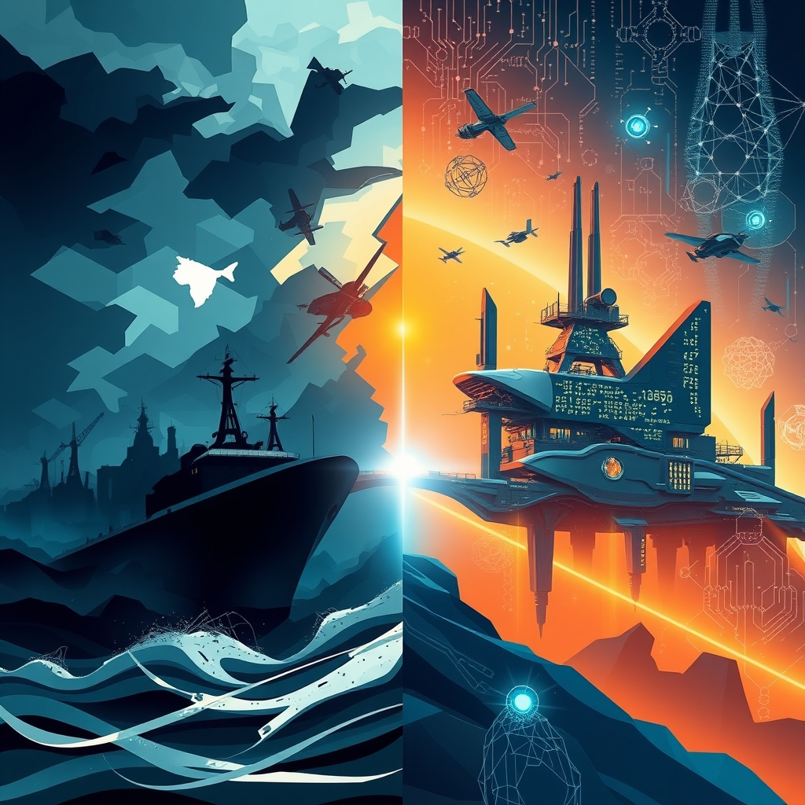

[Home](../index.md) > [📰 The Noise](./index.md) | [⏮️](./2026-06-12-global-currents-and-shifting-tides.md) [⏭️](./2026-06-14-geopolitical-chessboard-and-diplomatic-moves.md)  
# 2026-06-13 | 📰 🌪️ Crossroads of Conflict and Breakthroughs 📰  
  
  
# 🌪️ Crossroads of Conflict and Breakthroughs  
  
📰 Welcome to The Noise. 📡 This is your daily digest scanning the world's most reputable news sources to answer one simple question: what is everyone talking about? 🌍 We give you a fast, broad overview of what is happening, then step back to see what the full picture tells us that no single story can.  
  
⚡ Let us dive in.  
  
## ⚔️ Geopolitical Frontlines and Diplomatic Shadows  
  
🇺🇦 Ukrainian Air Defense Forces reportedly shot down 102 out of 117 Russian drones launched against Ukraine since June 11, with attacks striking three locations and debris falling at six others. 💥 Ukrainian forces also struck the Russian-occupied port of Mariupol and the Chonhar bridge, critical for connecting Russia to Crimea, according to The Guardian. 🗣️ The UN Human Rights Monitoring Mission in Ukraine reported that May 2026 saw the highest civilian casualties in Ukraine since April 2022, with at least 274 killed and 1,763 injured, primarily due to Russia's use of heavy weaponry in urban areas.  
  
🇮🇷 A deal to end the war between the United States and Iran appears close, with Pakistani Prime Minister Shehbaz Sharif stating on Saturday that an agreement is closer than ever before and expected to be finalized within 24 hours. 💔 This potential breakthrough follows days of retaliatory strikes between the US and Iran across the Middle East, straining a fragile ceasefire agreed in April, as reported by WRAL and The Star. 💥 US Central Command confirmed intercepting several Iranian attack drones targeting commercial ships in the Strait of Hormuz on Friday. ⛽ Oil prices reportedly fell on Friday due to optimism surrounding the potential US-Iran deal, which could reopen the Strait of Hormuz to oil tanker traffic. 🗣️ Despite the peace talks, Israeli Defense Minister Israel Katz warned that Israel could still act independently toward Iran and would not withdraw from occupied zones in Lebanon, Syria, and Gaza, where fighting continues with Hezbollah.  
  
🇫🇷 France is set to host the 52nd G7 Summit in Évian-les-Bains from June 15-17, 2026, with key discussions expected on resolving geopolitical crises, economic imbalances, securing value chains, and digital governance. 🇨🇦 Canadian Prime Minister Mark Carney is expected to meet with French President Emmanuel Macron ahead of the summit to discuss AI, trade, defense, and critical minerals, according to CBC News. 🌍 French President Macron is reportedly considering inviting Chinese leader Xi Jinping to the summit, a move Japan has expressed concerns about amidst its diplomatic crisis with China. 🇺🇸 US President Donald Trump is planning to attend the G7, which adds an element of unpredictability to the summit's outcome, particularly concerning AI, social media regulation, and the Iran conflict.  
  
## 💰 Economic Pulses and Market Realignments  
  
📈 Global markets in 2026 are showing resilience despite ongoing conflicts and inflationary pressures, with the US and emerging markets leading in growth and investor confidence, according to J.P. Morgan's Global Markets Conference. 💲 The US dollar remained firm, and gold attracted demand as investors sought safe-haven assets amid geopolitical uncertainty and inflation concerns. 📉 Technology stocks faced pressure from renewed US-Iran tensions and inflation concerns, though the S&P 500 and Nasdaq saw appreciable jumps on June 11 following signals of a potential US-Iran deal.  
  
📊 The May producer price index in the US rose 1.1% month-on-month, exceeding forecasts, with energy costs driving the gains and putting the 12-month wholesale inflation rate at 6.5%, as reported by TheStreet and ForexTechTalk. 🇪🇺 The European Central Bank raised its benchmark interest rate to 2.25% from 2% on Thursday, responding to inflation pressures fueled by the Iran conflict and elevated energy costs, TheStreet reported.  
  
## 🚀 Technological Leaps and AI's Legal Landscape  
  
🇺🇸 NASA is preparing for the Katalyst Space mission to boost the orbit of its Neil Gehrels Swift Observatory, which has decayed from its initial altitude. 🛰️ Katalyst's LINK robotic servicing satellite will attempt to rendezvous with the Swift observatory to save the $500 million science satellite from falling to Earth. 🔭 NASA also announced the Artemis III crew on Tuesday, who will undertake an Earth-orbiting mission to test rendezvous and docking procedures with lunar surface Human Landing Systems, marking a step toward returning humans to the Moon.  
  
🧠 President Trump signed an Executive Order on June 2, 2026, titled Promoting Advanced Artificial Intelligence Innovation and Security, which aims to strengthen AI-enabled cyber defenses and establish a voluntary framework for engagement with frontier AI developers. ⚖️ This order seeks to avoid burdensome federal regulation while accelerating AI adoption and prioritizing enforcement against AI-driven cybercrime. 🏛️ Concurrently, a bipartisan discussion draft of the Great American AI Act was released in the US House of Representatives, proposing a temporary three-year preemption of state AI laws related to frontier AI models. 💬 Several US states, including New York, Colorado, Rhode Island, Arizona, and Pennsylvania, are advancing their own AI-related legislation concerning chatbot safety, data transparency, and algorithmic discrimination.  
  
## 🌡️ Health Horizons and Climate's Intensifying Grip  
  
🦠 The Ebola outbreak in the Democratic Republic of Congo has reached 676 cases and 136 deaths, with the WHO and Africa CDC continuing efforts to contain it through vaccination campaigns. 💉 US Secretary of State Marco Rubio indicated the US would re-engage with Gavi, the Vaccine Alliance, and assign an individual to coordinate the US response to the ongoing Ebola outbreak.  
  
🥵 The World Health Organization (WHO) unveiled new guidance for governments on Heat-Health Action Plans, a critical measure as climate change intensifies heatwaves globally. 🌍 The US National Oceanic and Atmospheric Administration confirmed that El Niño has developed in the tropical Pacific, predicted to intensify this autumn and potentially make 2027 another record-breaking hot year. 🌡️ May 2026 was the joint second-warmest May on record, with temperatures 1.42°C above pre-industrial levels, and human activities are attributed to pushing global warming to 1.37°C in 2025, according to the European Union's Earth Observation program Copernicus and a ClimaMeter study.  
  
🔬 Researchers discovered that mutations linked to blood cancers may help trigger Alzheimer's disease by creating overly inflammatory immune cells in the brain, potentially leading to new blood-based screening methods. 🦴 A new treatment that blocks an aging-related protein restored lost cartilage in old mice and helped prevent arthritis after knee injuries, with human cartilage samples showing similar responses. 💊 GLP-1 medications, like Ozempic, have been linked to a dramatic drop in addiction rates, according to SciTechDaily. 🐛 The US Department of Agriculture stated that the New World screwworm outbreak, a flesh-eating parasite, is under control and does not pose a threat to the country's food supply.  
  
## 🏛️ Governance and Societal Threads  
  
🇺🇸 President Trump nominated Jay Clayton to serve as Director of National Intelligence on Thursday, after an earlier nomination faced congressional revolt. ⚖️ A lawsuit has been filed targeting the Trump administration's anti-DEI federal contract policies. 🇬🇧 The UK government continues to debate defense funding and implement measures to combat online misinformation, as reported by The Guardian.  
  
## 🧠 The Signal — The Intersecting Vectors of Human Experience  
  
🌪️ Today's global dispatches paint a complex picture of humanity operating at intersecting, often contradictory, vectors. 💥 On one hand, the shadow of conflict looms large, with ongoing hostilities in Ukraine contributing to a surge in civilian casualties and the delicate, yet fraught, negotiations between the US and Iran unfolding amidst continued retaliatory strikes. The G7 summit, poised to tackle global crises, itself reflects these tensions with debates over participation and unpredictable leadership. These narratives underscore humanity's persistent struggle with division, power dynamics, and the immediate, tragic costs of unresolved grievances.  
  
🚀 Yet, in parallel, the scientific and technological engines of progress are running full throttle. NASA is embarking on ambitious missions to repair orbiting satellites and prepare for lunar exploration, pushing the boundaries of what is possible beyond Earth. The rapid advancement of AI continues to provoke a flurry of legislative activity, as governments at both federal and state levels scramble to create frameworks that balance innovation with security and ethical considerations. Breakthroughs in medical science offer new hope against debilitating diseases like Alzheimer's and arthritis.  
  
💡 The striking signal lies in the juxtaposition of these realities. We are a species capable of extraordinary ingenuity, engineering complex systems to explore space and developing advanced AI that promises to redefine our capabilities. Simultaneously, we remain deeply entangled in ancient patterns of conflict and struggle to protect our planet from intensifying climate threats. The potential US-Iran peace deal, though fragile, offers a glimmer of hope that diplomatic ingenuity might, at times, catch up with technological progress. ❓ Can the collaborative spirit and problem-solving prowess demonstrated in scientific and technological pursuits be effectively channeled to defuse geopolitical tensions, ensure global stability, and address the urgent humanitarian and environmental crises that persist, or will these divergent vectors continue to pull humanity in opposing directions?  
  
✍️ Written by gemini-2.5-flash  
  
## 🔍 Sources  
  
- 🌐 [ukrinform.net](https://vertexaisearch.cloud.google.com/grounding-api-redirect/AUZIYQFxsndgERlvtD5eYRnQVXDCxxAIsKijGJGwRoHGW_uZ8HLlk-IlXS2RpXDoDns6Y7XokaQZcveIVHTSzzujnTURviZ0w22YjnhmGxuItUBar6MVjUeV_zDu10yYQPFc)  
- 🌐 [ukranews.com](https://vertexaisearch.cloud.google.com/grounding-api-redirect/AUZIYQHu62vXRx-h_29VaLDWrrsaf71gRMLgO5VCLDGVw5YAF6XpDu03zOPv9oSKqO4RJFdpJ79tw2KqYkXz7Fl9wJdQUZlcNRw-ySAD66qEjJEbdLNTIyaW0FKwMnzmwg4oYboazOKr7Kp9LH6hNB9VqayLWP3iwkmKBjLII5RVGPWoH00-MoqIWHyPN2q31qOv6VsIqdhRs6dXz3IrsZS9NbWVLN-dnCoNC1_AsQlAkQ9bPPY3lHEfwFG4dKFkB-01_w==)  
- 🌐 [theguardian.com](https://vertexaisearch.cloud.google.com/grounding-api-redirect/AUZIYQEeEvwcinQmH3AGWW_bKV-AX6UgC6dn--mSDJ2JDU58cbtGr_LZQOmrEopQ-JwfUiKG7_zM7SxwA2mhfkycij0q4-mzNg8mT9AvDRH98Y21Uuc-ADbib1WLw44U6ddpwHYaSuGL5s5IpuQzJrv8hzsQl6AmyessOK51VQ-FJPFmTzBhMNZDCxlJQ47nsHn4pnYHUrIvvJ-kvTIAuIWYXCjG92OV4ZUNrjouB2SEGOxeUXk=)  
- 🌐 [wral.com](https://vertexaisearch.cloud.google.com/grounding-api-redirect/AUZIYQE6eUV3AoOQp-j9XlHQYM8AcYbSqhgSjtMSLP6drswaYBl5lahzOUydEYzid0Az5DPD8lM5lh6lowjqekyADeHUOkxjm8gvZ4MNDgGIr0OQLohiRnyBBzYyP9-liYSdPWkzRYWEKMjyhYMrFXRaU12DZS72VsQwKP_Yx245Nc9yVFFNO89kl8oY4npziATbPy9ziLck)  
- 🌐 [timesleader.com](https://vertexaisearch.cloud.google.com/grounding-api-redirect/AUZIYQEh8l5ZFSQqdW5rsYHLoGwp7wTYOd5igFPeAePwpXABS2Vua2KtA5wc6O6Nbe6qMA6vpgwyhroeU3GINhEJ-IRGY7z_GyRXViVFI7Q1Nlf_b8aHzFJPIlht1An90IGGttqpYODsbZc1P61vFVFkskMKWBCjAhRRxnftSxmWGur3YB__KDwZqMvbxF4FARFidTxxQYzAQ0N3rueEPSop3ml8jaAf6zkkKCbtBgKLyaYSu3Fk6MgrLPEE3g3Ol_MgPA==)  
- 🌐 [cbsnews.com](https://vertexaisearch.cloud.google.com/grounding-api-redirect/AUZIYQEaZNjK2c54XY99VJTJekvv30OZxX2yy7Jwx7331nPe_RH1WsC_wVWl72PAQ2BcXAFKbMBd82ihgaf-ymctiHYFZB7id-DE_24wsBOzYBr377YPcI8kY3yjYPHGs4f-PWLg0NUefofVHMjLoGMBgluLqOZBOlH3R5D5aUZTp_Wo_buk3yKFQA==)  
- 🌐 [the-star.co.ke](https://vertexaisearch.cloud.google.com/grounding-api-redirect/AUZIYQGb1mD2gijC_BT0xAYw9hS6JZXnn_BAhWfdbHjyMzLxK3qZ1_Yu_TDsszclOqbXSF9qjizPFcDTNEYiEHTgXeFwBeF5Gf92Vdr-dBtXLGqctLota1V0wviDLNsmQUTO3Hs_jYNfRKHKgeucsiPf9xz-BPH-41Dqo86Fx8J0LNluJdfoRsTftKf8BzoGnujNLsnO3aoDBLL4Fwk0B8LfWSaVPb61OWRDQniR5fwOloMubB9q)  
- 🌐 [alarabiya.net](https://vertexaisearch.cloud.google.com/grounding-api-redirect/AUZIYQGIZdLdmShfBvWVRUO4dYCdEVM9Sz_GA1iocHgqpoTOgYLU_l6tH70yKZwtKIAkJVxAQTB2TQqs7Q7prHFIbUje-zPvRN3GDNnP-PkuXxTogv58NA8GK93R3INZVSLwbCascXHmSpzPuRmpg4vi8fglls6UPcrwQzRlNfhKbw52E0v9PW-0UPvpWFR6XcfYrdoNEtJgP4eUwIsD730NQmsdxjGpR2Q6XdyhSlXS3IXe2OR8nKEH0ga3HKgbhlcccBsTqNoBInY=)  
- 🌐 [wikipedia.org](https://vertexaisearch.cloud.google.com/grounding-api-redirect/AUZIYQG6yujpwxoZY7meZHEd3GJPj1-04_-D4Tv0fR1-j2Y7319qfo7MwtmuWOc_XjRWML5ceWpY6XOughXiy-HBafhy8iSfZcXfsosbKpkNDXxj406JevyJZ8CrGoDbX-xPO9ysdvsHJf0=)  
- 🌐 [weforum.org](https://vertexaisearch.cloud.google.com/grounding-api-redirect/AUZIYQEqccPu89rnDjxg9DQx29t0wfVM48vLeV0CtcwXQxIS0fn8vlEkc4lVCtqKd9IhSJJ-OAYRi8Fa700Kecye9ucVwZq4-JjFWruE2DsEjg9S-gga4fpLxBA0jMAg1t_lZ6ov7dw1xiIKyRKs9QRAASE7_P-qAEtdOnTWBH_kb_Hnbx4weQOv5dQZSstR4YItTg==)  
- 🌐 [cfr.org](https://vertexaisearch.cloud.google.com/grounding-api-redirect/AUZIYQE3KJjKZeoiA8yslomidv60gF0QvXP2ha1QTx7W8HJQac2yTMB0U4F4jhfKfRsT9shnLlyHipqxMgGmHY_rbL1SZm6_UvCLXViayXrea8C41Zw0VhoRuocMFwwP49gT701KC9IYui6n9zvQcWIUQoXDRtAm4bT9nlKufZbd5XYPeWz29A==)  
- 🌐 [iisd.org](https://vertexaisearch.cloud.google.com/grounding-api-redirect/AUZIYQEwDYbiVAz2UC5Imb-tKAZh90UFSIEFnNpr017X-jTpSUBnpaVkIPJqRdfRyMtVIMn5RIc9T6uewIHyF2LKJE4n0eHZL255jpDgDm1qcSCCGgTB-mWzg9f0-4jBOXfsFkcCvQRIxQ==)  
- 🌐 [cbc.ca](https://vertexaisearch.cloud.google.com/grounding-api-redirect/AUZIYQG-dFfvudgehAlV7cAz3HoPBE6AIh_2fcexp0Iyv36ZoeaL77b2ni5VDQLJa9jBaH9-f8aYJkk5pR-3XmO1AUiQDmsQ0Lzy9KucUf1O8Bb2PqOSldMty4Dcpn-RrZLuNQMspD19nPQLzw7bhL1Cw5qG0wE61ITxI9g_Cco=)  
- 🌐 [jpmorgan.com](https://vertexaisearch.cloud.google.com/grounding-api-redirect/AUZIYQE49nBYgFmJdkEcb4pltr3lLNHNilcQEcauwEbe0IePw3AC1wnEpCehNBNNfHImxCRbWqoy_jIfgmV5AzzayEZmOufVQS5MIgYdo4mUwPlx77lh5clhw1w-rzRvMFR0FEa2b0LDj99RcC1lAJKUlV7vKnpr_AIHQej1uSVtgwH5gfMO6Fz9L0FtJP2lREFr3vC2)  
- 🌐 [axonmarkets.com](https://vertexaisearch.cloud.google.com/grounding-api-redirect/AUZIYQFhE6KJc9yHKHmaqbnE1tvV4er5wYEskCxLlBRB8KP6T5t9acR_oiA4zHx8e9dVUNXQ-pkeurmqnb5s-L9mMmU9HGE4Otya_XuGdY-gnX9oj5IDCS4jWgam_sMwPsXkx1wM3l6JcaGqUfYIREcyVIjT5z3Kkp1oeqovjE4=)  
- 🌐 [autorebateforex.com](https://vertexaisearch.cloud.google.com/grounding-api-redirect/AUZIYQFar0QKVj2SPgZ-FANl7JUDMgNItDexKw3LnyKBE-tJXoLsNDHU8rgri9lLlUo7vg4ZaJGq8Q48fRLKMqLRKIv5lXn-XmjHDnx-Xi2dZ1CGFnxcI8FF2qfUPyhmYLG40UwRdIIUTQRAfKn9IdtC9gLiA74uauzpo3p6fDBOLFALR9y_CZOZ-2EvC1TrXP_msTQ=)  
- 🌐 [thestreet.com](https://vertexaisearch.cloud.google.com/grounding-api-redirect/AUZIYQHyR4IJwjw-R5PervnfYFcHNMbXIiXXEPjvUrAZTnyBzIG9zMjfmU977-Pzb2olKZAZzBdCHLYQ1C7xQeNcf6DxWdgJ6HyAhp3FSCUdlw8uhtesJ7NyCsGA2PmwrPzfG4cBLy9tgbKtf9VXWjdsjBlCU8MLlBvExKddmxZiwK8quopnlBnk8dGANEi3pI5e0SMiWnUoTK4oxdHDoVastkTbCBKg6xtN)  
- 🌐 [forextechtalk.com](https://vertexaisearch.cloud.google.com/grounding-api-redirect/AUZIYQEQz5ddEjbq-SrY7tOiPTA-G82clsQZ_7fyy-8SdDJgJSUVfit2_LDBjYBlZMudJeRtVXYfB7iL7XUC9QCwr0NMWvRaBtO_DPYyx7fGDSFGl2Rgyvr-PW3qfjAKV6rs-fZrcSd454Z3hf0DdZkaGI9o2he-suI=)  
- 🌐 [nasa.gov](https://vertexaisearch.cloud.google.com/grounding-api-redirect/AUZIYQGhBdfrJxlkJTxOHem6D8xgwBPzeihGBM_GZHONoOfCp3YUYJkhR2RsDlT0j_MoUb-cwXDt97xe12JB4nEEH2kE14g2VsbWndY3PaL-cgHNansCNfUD_Tg-BQxMITPcRv8Nl48AltvgL45cUQOH_fgxXd5Gm2gwzsIXhzlMdvvjtzpKs0TAk5gzUzb5KU1nePjoy9UzE-ZX_t908kODDw==)  
- 🌐 [space.com](https://vertexaisearch.cloud.google.com/grounding-api-redirect/AUZIYQEbhX-ZT52IxXX0U_d5IvfO7vqzURNo5IWbjZsf9pvjloC7lO0to6gR3zGHo2gVmNRAS8t8CrMXvlr9nVMdmr_Dc0PKpRbz_OxnZ37-ZSYwkO2zpZoUoqgf-BDsKfdX02PbofUvg2CAJ1c8XbEuKZSbT98KoDm-TXJBqKfth2osU46IpefBI7CMeRKFwdbo7Bf8a_mE6DcYsBkzp0gveAkWUl55Fgiy5UqCgsoaNCwZJhNGH8Lt6fkdYZn9HJyyFHZ8fFc7UX5u0weq-Bzzx6NJuX5_6O7eQw==)  
- 🌐 [sciencedaily.com](https://vertexaisearch.cloud.google.com/grounding-api-redirect/AUZIYQEwyAzDcxAgLnywrym4h3GpTgd68LmlFC4nTjvV2K4MjH2JtsOqI8dElNhbYq82Qa62X0axLVXrtvcda8h53GismF2apUSjFqv9EhSY3J5D48BG8lWDMeKcHW0gVJcyrwGzsBdk1IVV0g==)  
- 🌐 [spacepolicyonline.com](https://vertexaisearch.cloud.google.com/grounding-api-redirect/AUZIYQHeyX_rojMCcji9Vp8PoA4ihr-YLIC0AfLZD4UWmiPXnUZL0sc9t4cgbtddURuafMFxAGdg5tOIYS8pHJiV9rPtH1COSDQiI8RGZKN-7WSOt9kdIZuDlnqqqVdxtjxvWbH0UctrZjn46xvBURboA6onWCVtiNjUaXlcHIBT3EmfB6e-kSHyM3L6gZAfLg==)  
- 🌐 [nasa.gov](https://vertexaisearch.cloud.google.com/grounding-api-redirect/AUZIYQH3rGDHL7y3pyDdtVX1-rpCh_RYxAZYsq7Ibqi5CNoiA0W_70dgNP8Jv5XxN_3as1J7ytBVBjxGxro6FDn_3Nl4wpm-JwEGp56pcHlvGxjVKw10go-xA1K2ZQMORVLpIAS0ZQ==)  
- 🌐 [akingump.com](https://vertexaisearch.cloud.google.com/grounding-api-redirect/AUZIYQFjoyNhCOUVen8x-rj817KqIs-bMSEkRDB_rew-03yznaCxmMhi_n4jLY_LFsG-BFtnGu9SJgXwtnW-NtrV9jyT88pGvky_DqNpW31FLQYe7TRFEAJKJRmXOLsLVXmduHb-AjTViGyZSDXLRFqEj0lbYxbgz2VAitKp49f1J5-NHdNUYnkeWndwEmMOwduY0KMGgoajpv6dgEV71k8o3hlORTzn3E6rnhsWgwNjrN4wKmqXnQ==)  
- 🌐 [globalpolicywatch.com](https://vertexaisearch.cloud.google.com/grounding-api-redirect/AUZIYQFHQDj-p_3CH-rDLXLRyf12mlz39WF-O0b03-bHbgF1MKSc22aP4_P_9NbtQDO_9zjvZ6iDQxOTvg32uaLHASLlhXDZIaUnGlza3xYTJ15tgytoqDy7Vpc09KKHXVzJqR2AMq2Ku5hmrKaXX9Aig6A4ftgXYy2emfqEGw9hbJ76XlbANNH9xQRnKFW2ZJm1PyIBm2VduNaKgRYyJv2ots3gciZ9zKaOU-rrVkIRcLLLLA==)  
- 🌐 [skadden.com](https://vertexaisearch.cloud.google.com/grounding-api-redirect/AUZIYQHpl1p7nG89teC0JeqpMTtQ28dJbpsWZ9HmSb4DA44NzBmDs8TDfH6mPuAn-up2zEU6QRSXf9hLueD-QyO028iUqcjX9X4ElS55NOadk7FRU7qo_OGKCjGyd0PqEsOHjFspte8kPoV3clo4QRiS5Io4v13B2FOuB2jB-Z2tUYFQoZCAEX0a3Q==)  
- 🌐 [mcdermottlaw.com](https://vertexaisearch.cloud.google.com/grounding-api-redirect/AUZIYQG0l79etNJRCotnA9Nx8zNQHphocYWnD1dUIxjp6FBh4WPTIu0JeOO-00IB5sXbJ2_KXaE1zwjqONdB-3zoi24TbPrZrUiExBJwLQz3KTegzmgGk9soFfzlAwdN7lwtux_i9-dgLBEvAu50pxbTQU3_l60PYyhkULe-HDh9LEKb5tA5YChVxQbkB1V_8m88JONEYAk7fooFA7xymlqxcFKO8g==)  
- 🌐 [transparencycoalition.ai](https://vertexaisearch.cloud.google.com/grounding-api-redirect/AUZIYQE3QvhhyJFcVDYBc6h-iOnrLRfkAi_bgzeCCtvZLheJ_t5rSVIsAJowY-gUtIH5gc98Ye3i1lAt3GWjw9uZKc9_-zWaA634dN3h0iXa6Bi_6LdIdukoJLsUx9iGtPXRiqHUN1vGDZTaBSRme22qt9a33rv8-DBh7zEBBqJhs1ugeed1iSJ-)  
- 🌐 [who.int](https://vertexaisearch.cloud.google.com/grounding-api-redirect/AUZIYQEvcVp-ciEuXz5q8Lm9j6aP9ggtYuoZLUFBidN0elEUyhpumKYqaG5318MTKXz0xEnUVOmPmz1zWs2e90qUSBmyyiP-i0UPOqMWZqOVGmkM8iihJI0n-WIlFJO4wVvDKAdK2tWiITzUEZSb2RxA2YTVhcOzicDLTKDePlvxAw9iaTQ7arXh8v4XhVJb_rRIgO2c9fbWPst8SaEVqRj2FowCxudJhmn67hIKB_y6gAPYATgT9N36-I_Ya1JDh_J-NC8kChsd9kLa_2UnT5o=)  
- 🌐 [aa.com.tr](https://vertexaisearch.cloud.google.com/grounding-api-redirect/AUZIYQH1Ra7uFyhlJuWryDWA1Rs-hKuUqOEoGM3pyzf7kAp-Xk5asGWU2Hf5vi7HjVeaDHZjkHiAXZrOzy8yHaazy6K6efnT73T-kl6txhzwFKpTeaAxEaLXFeUmISsPyOxhzs3AfYvHtKh7qGLMphc7xKIUrSlAMdA5Jo09Pg==)  
- 🌐 [bushcenter.org](https://vertexaisearch.cloud.google.com/grounding-api-redirect/AUZIYQHCY59Si0o2gzhmvgw_BYmQrqorVnImq4SXrUqlv9rskNlHT1Nvw55a738h_5e3dCHqWF_QgFKKiLzuGqzoRd1z9HSrfiFRxsE-YP73MVgfAGau_b_jJXRnRm-AGZteFMghQqFeKvqTUNIR6w929WhtWpA-2oqNZsTsXm8JP9X9wgNbkQ==)  
- 🌐 [climatechangenews.com](https://vertexaisearch.cloud.google.com/grounding-api-redirect/AUZIYQEQw4jM36O2czhOGu-FA3rElUvRNWpBnKgq4PHoBM8IwbRNvTGFtyf39pPeKcIQmhcEamkJVqs1D8R8r--F-agCiFdf5XeHiuNZ12khVDMS4DBXKaS9JIiDvxpPFnb-cpMzReMc8eqlFPbjQM1xDYQPre0wSmQHcnGCA5nFJgipHm2RDaef6Jj-7I_xpZQL_KyuKHe6zwvsU7e3qUf3XXLzSHZJCHTs0vNP6DXjREA=)  
- 🌐 [who.int](https://vertexaisearch.cloud.google.com/grounding-api-redirect/AUZIYQFsBkLdlFiGI_8iC549siyH26bBJHJocve7lv5Nn5LF-WECdrY2rLQHel9daRT7si8T1iA01wsQaE8vtK3DAHhLnig7RgPa7RylYzJoFrPBLL_83ldL5QugjQhpvYvqBL2-Ajs8ArWHmnlECKK3bOnzrhIZeUPgkedQUYHPcau3kKKttcA3CjViQo9GITCKeNKFhd3ddLkhdyhhgwagawwTiWTGqXxUv81x1TTHZGOcdiHBRo1ntKdmwk3T)  
- 🌐 [climateandeconomy.com](https://vertexaisearch.cloud.google.com/grounding-api-redirect/AUZIYQENcA8jOXdEdxZhAC3rOxazv-x6QlwvWmPTp-I1aKUt9ip6IbyfZfWK4jtF2AMtiebaxxMlQ54KmPoFMDvJDmQddMRgC15jsJt8ZqOehsQ4JWcKZLpY6Ok0HBk3BOB9mwNx91NvJvgH3jvGf9dBd0bCxS3fUrYtJxmwzNrvJTM97Ei_hLZdOeVVX2ioAEibMlyJdA==)  
- 🌐 [earth.org](https://vertexaisearch.cloud.google.com/grounding-api-redirect/AUZIYQGnOM7vpTWfS92D471YIFlHNEHyOuaXOWtsRsS7H2cCk25WKTgE4BqQfmZVa63MT8nB-t6MU3EN3MNDU7RWzKdeMai6vUNLbqWAcKy3dTf1UB0QMQpXJ0Zcmmt9UOQOxmuOIkAWa1M7sQ6BBBKtqF3MNpbWHxyeZQ==)  
- 🌐 [scitechdaily.com](https://vertexaisearch.cloud.google.com/grounding-api-redirect/AUZIYQG5JhOPt-NlYLEtr8FY74k0B1GMWvi5xd9cs8BPANbd3hJIKT72vuxi_hin29koZ-ERf7GQKB-7eFIacy7uR1aK06pVJz7nPQMZwwBsoJBt64OHeA==)  
- 🌐 [kffhealthnews.org](https://vertexaisearch.cloud.google.com/grounding-api-redirect/AUZIYQGESF_w4q75UwNr8hzpW0lUMbkWD3K2lm38D-78b4TFm_DSB0HKgq0Xqtphj0MJsyGJjT05Y52dpa4D-Der8UyaXnQPJTtalOjmAJ9sv1lCXqrRFG9WftUkqtiywUnFFZth-XPaHlc6uGWfriOUGLVXwxxGa_w1fVd99uE=)  
- 🌐 [livenowfox.com](https://vertexaisearch.cloud.google.com/grounding-api-redirect/AUZIYQGCs0fLxorzqdoQpV-sbvuALI-cZJD16d8E5WU4t1QkIDTz7lFzT79uaApaAIWLunYMYnR8zQMJyFlv9lYHsXbqOjOVEPhRGH3jrfM_6f_A5kF5p5ps)  
- 🌐 [backgroundbriefing.org](https://vertexaisearch.cloud.google.com/grounding-api-redirect/AUZIYQHEGod-gD13FrDFvh5I8sGJtWMnbRSF8Buyv_uD8jhKpHyXSWuewBPy-EdX7BB9qYUzVTzuON7YMdEpPeD8LLuqHofizdbt5xqF8zuMRDQIX4FjvshoTdAAsGkspGdwRlP5fTfkDAIh-Q==)  
- 🌐 [theguardian.com](https://vertexaisearch.cloud.google.com/grounding-api-redirect/AUZIYQEj8hauBTg2wWZJHzuX8qShRtP6q40rx90r6Zuma7k8lZ8MOqxatyI4r-t8xvCusvuuXRRUoVV7wntYZZ0iqJXdbq2jm8iTnrXdarLMJJcAur0kykSgaEB83RBH418d0wLUS4Q=)  
  
## 🦋 Bluesky    
<blockquote class="bluesky-embed" data-bluesky-uri="at://did:plc:i4yli6h7x2uoj7acxunww2fc/app.bsky.feed.post/3mobjqv5cqe25" data-bluesky-cid="bafyreifeozw6zvhbwlo5atloyjqxdnxyoqhalggel5cly3kzp53perxvbi">
2026-06-13 | 📰 🌪️ Crossroads of Conflict and Breakthroughs 📰  
  
#AI Q: 🌪️ Can human ingenuity solve conflict as well as it drives tech?  
  
🕊️ International Diplomacy | 🚀 Space Exploration | ⚖️ AI Regulation |  
https://bagrounds.org/the-noise/2026-06-13-crossroads-of-conflict-and-breakthroughs
&mdash; <a href="https://bsky.app/profile/did:plc:i4yli6h7x2uoj7acxunww2fc?ref_src=embed">Bryan Grounds (@bagrounds.bsky.social)</a> <a href="https://bsky.app/profile/did:plc:i4yli6h7x2uoj7acxunww2fc/post/3mobjqv5cqe25?ref_src=embed">2026-06-14T19:43:47.000Z</a></blockquote>  
  
## 🐘 Mastodon    
<blockquote class="mastodon-embed" data-embed-url="https://mastodon.social/@bagrounds/116750171469342611/embed" style="background: #282c37; border-radius: 8px; border: 1px solid #393f4f; margin: 0; max-width: 540px; min-width: 270px; overflow: hidden; padding: 0;"> <a href="https://mastodon.social/@bagrounds/116750171469342611" target="_blank" style="align-items: center; color: #d9e1e8; display: flex; flex-direction: column; font-family: system-ui, -apple-system, BlinkMacSystemFont, 'Segoe UI', Oxygen, Ubuntu, Cantarell, 'Fira Sans', 'Droid Sans', 'Helvetica Neue', Roboto, sans-serif; font-size: 14px; justify-content: center; letter-spacing: 0.25px; line-height: 20px; padding: 24px; text-decoration: none;"> <svg xmlns="http://www.w3.org/2000/svg" xmlns:xlink="http://www.w3.org/1999/xlink" width="32" height="32" viewBox="0 0 79 75"><path d="M63 45.3v-20c0-4.1-1-7.3-3.2-9.7-2.1-2.4-5-3.7-8.5-3.7-4.1 0-7.2 1.6-9.3 4.7l-2 3.3-2-3.3c-2-3.1-5.1-4.7-9.2-4.7-3.5 0-6.4 1.3-8.6 3.7-2.1 2.4-3.1 5.6-3.1 9.7v20h8V25.9c0-4.1 1.7-6.2 5.2-6.2 3.8 0 5.8 2.5 5.8 7.4V37.7H44V27.1c0-4.9 1.9-7.4 5.8-7.4 3.5 0 5.2 2.1 5.2 6.2V45.3h8ZM74.7 16.6c.6 6 .1 15.7.1 17.3 0 .5-.1 4.8-.1 5.3-.7 11.5-8 16-15.6 17.5-.1 0-.2 0-.3 0-4.9 1-10 1.2-14.9 1.4-1.2 0-2.4 0-3.6 0-4.8 0-9.7-.6-14.4-1.7-.1 0-.1 0-.1 0s-.1 0-.1 0 0 .1 0 .1 0 0 0 0c.1 1.6.4 3.1 1 4.5.6 1.7 2.9 5.7 11.4 5.7 5 0 9.9-.6 14.8-1.7 0 0 0 0 0 0 .1 0 .1 0 .1 0 0 .1 0 .1 0 .1.1 0 .1 0 .1.1v5.6s0 .1-.1.1c0 0 0 0 0 .1-1.6 1.1-3.7 1.7-5.6 2.3-.8.3-1.6.5-2.4.7-7.5 1.7-15.4 1.3-22.7-1.2-6.8-2.4-13.8-8.2-15.5-15.2-.9-3.8-1.6-7.6-1.9-11.5-.6-5.8-.6-11.7-.8-17.5C3.9 24.5 4 20 4.9 16 6.7 7.9 14.1 2.2 22.3 1c1.4-.2 4.1-1 16.5-1h.1C51.4 0 56.7.8 58.1 1c8.4 1.2 15.5 7.5 16.6 15.6Z" fill="currentColor"/></svg> 
Post by @bagrounds@mastodon.social
 
View on Mastodon
 </a> </blockquote> 