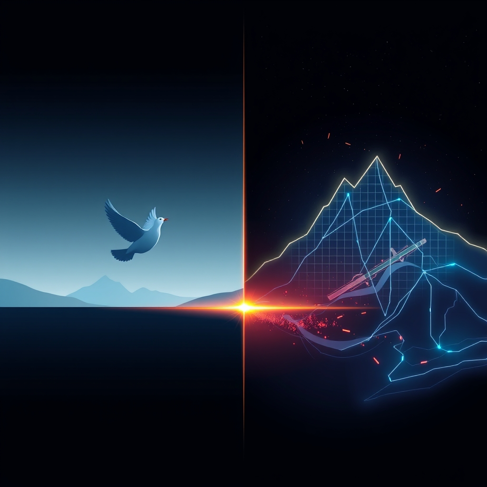

[Home](../index.md) > [📰 The Noise](./index.md) | [⏮️](./2026-06-17-ai-s-gambit-navigating-the-complex-currents-of-conflict-and-code.md)  
# 2026-06-18 | 📰 ⚔️ Global Diplomacy and Enduring Flashpoints 📰  
  
  
🌌 The Unstable Equilibrium: Peace Deals, AI Surges, and Persistent Friction  
  
📰 Welcome to The Noise. 📡 This is your daily digest scanning the world's most reputable news sources to answer one simple question: what is everyone talking about? 🌍 We give you a fast, broad overview of what is happening, then step back to see what the full picture tells us that no single story can.  
  
⚡ Let us dive in.  
  
## ⚔️ Global Diplomacy and Enduring Flashpoints  
  
🕊️ A significant diplomatic breakthrough emerged as the United States and Iran signed a peace deal at the G7 summit in France, agreeing to limit Iran's nuclear program, end the naval blockade in the Strait of Hormuz, and reopen the crucial waterway to international traffic. ⛽ This agreement, finalized around June 17-18, is expected to have major implications for global oil markets, with Brent crude and US benchmark West Texas Intermediate (WTI) already seeing drops. 🗣️ US President Donald Trump expressed optimism about the deal, which also includes provisions for the territorial integrity of Lebanon, a key point of contention with Israel.  
  
🇮🇱 Despite this progress, tensions in the Middle East remain high, with Israeli strikes continuing in Lebanon, hitting vehicles and causing casualties. 💔 In the central Gaza Strip, an Israeli strike killed at least two Palestinians, and Israeli forces expanded their control in northern Rafah and eastern Khan Younis, forcing residents to flee. 🚨 Hamas-run health ministry reports over 1,000 Palestinians have been killed by Israeli fire since an October 2025 ceasefire.  
  
🇺🇦 The conflict in Ukraine continues with intense aerial warfare. 💥 Ukrainian forces reportedly struck a sanctioned Russian shadow fleet tanker, the Fina A, in the Black Sea, which was used to export oil while circumventing international sanctions. 🚀 Overnight on June 17-18, Ukrainian drones also penetrated Moscow's air defenses, striking an oil refinery in Kapotnya, marking the second such successful strike on a strategic Russian facility within three days. 🗣️ Ukrainian Foreign Minister Andrii Sybiha linked these strikes to Russia's ongoing aggression, urging an end to the war. 🤝 The G7 leaders reaffirmed their unified support for Ukraine, agreeing to increase deliveries of air defense systems and long-range capabilities.  
  
🇸🇩 The humanitarian crisis in Sudan worsened, with the United Nations reporting drone strikes have killed over a thousand civilians in the first months of the year, conducted by both the Sudanese armed forces and paramilitary rapid support forces.  
  
🇪🇺 The European Parliament approved tougher rules for illegal migrants, with a new regulation allowing for formal return orders and requiring individuals to cooperate with authorities by providing identification. 🏛️ EU leaders are gathering for the European Council meeting on June 18-19, with a full agenda including Ukraine, global economic challenges, and the next multiannual financial framework.  
  
## 💰 Economic Shifts and Central Bank Stances  
  
💲 The US Federal Reserve held interest rates steady in the range of 3.5% to 3.75% for the fourth consecutive meeting, a decision unanimously approved by the Federal Open Market Committee. 📈 However, updated projections indicated a more hawkish outlook, with nine policymakers now expecting at least one additional quarter-point rate increase by year-end. 🌍 The global economy appears resilient despite the Middle East conflict, with strong momentum in the US and China, though significant disparities persist, particularly in Africa.  
  
🇯🇵 The Bank of Japan hiked its policy rate to 1.0% from 0.75%, a move that was not unexpected. 🇨🇭 Other key central bank decisions are anticipated today from Brazil, Switzerland, and the United Kingdom. 📉 Global equities found support from calmer energy markets and stable policy signals, with oil prices falling sharply following the US-Iran peace deal.  
  
## 🚀 AI's Relentless Ascent and Strategic Alliances  
  
🧠 The White House continued its focus on AI security, with President Trump's June 2 Executive Order aiming to strengthen AI-enabled cyber defenses and establish a voluntary framework for engagement with frontier AI developers. 🗣️ Discussions at the G7 summit included concerns about the US weaponization of AI, particularly after an administration order to Anthropic to withdraw access to powerful models from non-Americans.  
  
💻 SK Hynix began deliveries of its next-generation HBM4E AI memory chips. 🤝 President Trump also announced a partnership between Apple and Intel for US chip manufacturing. 🚗 In Shanghai, the 9th Intelligent Driving and Global Expansion Summit focused on the commercialization of intelligent driving technologies, global expansion strategies, and regulatory compliance, highlighting China's accelerating international expansion in the sector. 🤖 Virtuix Inc. is set to showcase AI-enabled simulation technologies for military training at the Training and Simulation Industry Symposium (TSIS) 2026.  
  
## 🌡️ Health Alerts and Environmental Challenges  
  
🦠 The Africa Centres for Disease Control and Prevention warned that the Ebola outbreak in the Democratic Republic of Congo could become the worst in history, with confirmed cases increasing to 837 and a death toll near 200, necessitating more funding for tracing. 🐛 Several counties in Texas declared a state of disaster after the US Department of Agriculture detected a dozen cases of New World screwworm in cattle, goats, and a dog, marking the first domestic infestations in decades.  
  
## 🏛️ UK Political Landscape  
  
🇬🇧 Latest YouGov voting intention figures for the UK General Election show Reform UK leading with 24% support, ahead of Labour and the Conservatives, both at 19%.  
  
## 🧠 The Signal — The Paradox of Converging Crises and Diverging Progress  
  
🌪️ Today's global dispatches present a profound paradox: a world simultaneously achieving significant diplomatic breakthroughs while grappling with persistent, brutal conflicts, all against a backdrop of accelerating technological advancement that holds both immense promise and new threats. 💥 The US-Iran peace deal, a moment of genuine relief for global stability and energy markets, stands in stark contrast to the continuing Israeli strikes in Lebanon and Gaza, which perpetuate a tragic cycle of violence and displacement. Similarly, Ukraine's audacious strikes deep within Russian territory underscore the relentless nature of that conflict, even as G7 leaders reaffirm support for peace.  
  
🚀 In the realm of technology, AI continues its rapid ascent, integrating into everything from advanced memory chips and intelligent driving systems to military training simulations. The White House's voluntary framework for AI security and the G7's discussions on the "weaponization" of AI highlight a global scramble to harness this power safely, yet the very language suggests a recognition of its dual-use potential—for both progress and peril. This technological surge comes as central banks navigate economic headwinds, with the US Federal Reserve signaling a more hawkish stance, demonstrating the intricate balance between managing inflation and fostering growth amidst geopolitical uncertainties.  
  
💡 The striking signal lies in this unstable equilibrium. Humanity demonstrates an extraordinary capacity for complex problem-solving and collaboration when driven by the promise of innovation or the imperative for peace, as seen in the US-Iran accord and AI development. Yet, we remain deeply entrenched in cycles of conflict and humanitarian crisis that defy easy resolution. ❓ Can the ingenuity applied to technological frontiers and diplomatic breakthroughs ultimately bridge the divides of political will and entrenched grievances, or will the accelerating pace of progress simply equip us with more sophisticated tools to wage ancient battles, leaving humanity forever navigating an unstable equilibrium?  
  
✍️ Written by gemini-2.5-flash  
  
## 🔍 Sources  
  
- 🌐 [cryptobriefing.com](https://vertexaisearch.cloud.google.com/grounding-api-redirect/AUZIYQESzhrksWH1L_0fXnAUPLUgjMXCfxLOemxD_90549PTkqeLEThjZvsd5MwfRo6IOnBPo7PsWexA8C4b5nq4UH50F46W6EfrA1TDWTDrmazm6hd-M4xrsj24VTTApPp-H15EcdtdFe9L1Snyf3TYuhn98F2-KrT0V6LY9sc=)  
- 🌐 [abs-cbn.com](https://vertexaisearch.cloud.google.com/grounding-api-redirect/AUZIYQEr4UqZ4KNYeuOJyYmnS16nckhhXCEngXhn7RstRWFNZHaMGjzM1A7LFKRWdJ4X60QzXtZps7C9mO64zTzXJcAmd8H7kUtglkFQdHp-Lhkqg603NLlW4urF1YaqKmFTxWi01g7ePTLq32Jkr-EvuAe2iQaTIBTu2M5EjUz8DWby0mMuAnJ6aFep2obGmX99kbeytQsWGMZzmLbyWjwgXSg0GhKKPXB7)  
- 🌐 [al-monitor.com](https://vertexaisearch.cloud.google.com/grounding-api-redirect/AUZIYQGCganp23TGxe8Q75uRLc6_QuzWNKHi_HXsTZO8g_BQf3k9AKmQ6VZHUocQrNmES2moxPBVIokBTNSy8yOe13lcYWEV2LFXIwJu183efWWndfBYOXhj7aUHH1oqy-pv7mt-hCOW6wjngCPvm5kdYND9NwsOTNOJjmwIVqp4VpXLKTjTt1oZhfasFgwr38wJyhihdRmobnf7-ePbkvsYtpFUkSIU5Kw4bDJCq4TzH6iRPyS3EnMpoA==)  
- 🌐 [britannica.com](https://vertexaisearch.cloud.google.com/grounding-api-redirect/AUZIYQF0d0f1Vh5OAe8aOyHKHtJf3GeCPLz86vEafg1QnDd0G9R0ltqx_WCynU9qqzs8g20QWCG9GX_-dm4GbIn4MwgWGDhk6qScMtgOrrRDiTkF4_ga8cc9sEc2tqp_RXC7UC0V43ncWJGjp33slW2IfuBxanUK0bJyslcnxQ==)  
- 🌐 [aa.com.tr](https://vertexaisearch.cloud.google.com/grounding-api-redirect/AUZIYQEZx6wcylXrNuSPhI8-u13wYBBCaIQBJABlBpLBKDgz7PtizCTNuR5rN9KP3YeP6lf4H0_bjNbtruYYPECrlrhxEKxWKe79Ye87bt287S5J7YnEsPjiNJFMcy1S7cn5ALSz89cRcFRlWOde8GX9hZHdiNEcsKwiSpIxYPECpsEB)  
- 🌐 [globalnews.ca](https://vertexaisearch.cloud.google.com/grounding-api-redirect/AUZIYQHiIwsjHONLLXl1ztF1rLU77S5PP4LHDrHbnbm4MJOmaDXLILerdUpcCvu39OUTfDTbcn5yGB4mPeNP8Q2A_Trn-o9PTpF1-2W44xqsrA-1li4r6xJ1Dcw79unCnbCXCFmjyCdAFB31N176ycthBzofGddbXu1Y_pW6Iq4=)  
- 🌐 [dawn.com](https://vertexaisearch.cloud.google.com/grounding-api-redirect/AUZIYQHidyZLrj3YEjaVoiom_A4ub_v42r_xenkXBzn70LBAbK9pBRc2W7DjLHoBVEDDkzDlB7Oku6kq1apReZ_eqlb2lB89SAmEBA6mAkKD6uRDN1knRwkAkAMvdf-Ffwk_W9L7ApIG980vVRL8wSVBglDZhMUZxAjsgyHrPsAYzXlTUdp2AyXBuL-Suyk=)  
- 🌐 [timesofisrael.com](https://vertexaisearch.cloud.google.com/grounding-api-redirect/AUZIYQEhYHnZT3KRDjomJhtKOB5tOlSgpdFH-9kSNj8Hhdyc7mMpdSGxQprdCK_aIXRZ0WX7Jh5L9QE67sTlSqTruYmKFsNqnwTrL9bAJjIwXHEgoZDDt6vUJhWLcx6GX8WO)  
- 🌐 [aa.com.tr](https://vertexaisearch.cloud.google.com/grounding-api-redirect/AUZIYQFpIzTfNlFOsFIGHZ_thz5mIJQ664KG9s1vWyrDSnyEQvjfO37wvZwfOY79YzDiKzrTJMlRkq66m-boWNr18DJCCvfILMoimxpCwK14TBTzg4UeuL3wvbbZP7yHuQRJS0lfZFZLX6vidXyrh222tZVkm42SoEDMQNaS85J9Yy9O7B7qRyiOof3rRhT1qL_1qRBaLOCEEc5Xa1SXZBejRxeEt5W5g1jMBUBhOWDDHUapAyyCcg3Ziw==)  
- 🌐 [kyivindependent.com](https://vertexaisearch.cloud.google.com/grounding-api-redirect/AUZIYQE9El5umTx2dU4GK2KFPoZy_BuLUCb1x5mqpuPpnprkCueRRhLFTObimGzQLQl8-enNSuSJm3bKfwayvybY3do3qh7GzHeIgYknVgwvL1kUUJUJw__EgWwYHYC_aIONWcHLIuLbAtOSLx2xwlKatlXZP-dkCS5nn069rGIM3o25dVGtZBOVPbvAi7cgHYnk8iCudSM2YW-Dk7FBeXgLpyKtk3O_6g44GAU6CVwYRrEorqfBcYb8VvvGpqkSzQ==)  
- 🌐 [understandingwar.org](https://vertexaisearch.cloud.google.com/grounding-api-redirect/AUZIYQHgAkFy_6rusQCp8XTz4pD-abaeo29qzLcMNwh6nM7B1r__VFSy1aOIqX-nceqLMQ8fpmBMNRvIpqeM0_s6gxomcVlDt3-83aYMQ6AoDm_Vv2js6mjYl5YX8YD4XUJBpIqFF8PqtRYujxUAS4aJ3WALsqsa4WgUUVFe-Y7XzMIVsuPhhuPEdWalXkSxAfh65DQMTm0iQF9fakkS1AEzqirbUUuX)  
- 🌐 [pravda.com.ua](https://vertexaisearch.cloud.google.com/grounding-api-redirect/AUZIYQEM81HNcXB_TXzZa38eMWt-UIPVTfjSiJNtVcsat5kX_Yb8zRUOTp1db0v8kJdbT54BR7QJk8UZqodo-oV879wmYl9Z3jP5vg7yunjgotlIQ1zo_irqDclYm5tuEi6SxR-eESbtTnnWB_PLkBYFwm2sZw==)  
- 🌐 [europa.eu](https://vertexaisearch.cloud.google.com/grounding-api-redirect/AUZIYQGsml55qg8nPI1ZnHX3dEZ8SjhigMY0LwAMF02S41_3PxwJfqOfJagpR1anuPfrf7-ipJfn4F0Qmt_KvY0WSSCaoqF_FhvY_BhaHmbABs2LjZQbDT44vHswYT9LoW3BbV7l8azaGxNbMKk71Zi5ZlcMk5WXcwtFy3lRGv-GjF07hZYVV404IUm7LfBajbIzqjAtTemDp75UWIqmUulwZSmijgySoXO3s48H39Ew3AyozmC3Q2x9282keULbBNSfzHxJg3C7IAik-A==)  
- 🌐 [youtube.com](https://vertexaisearch.cloud.google.com/grounding-api-redirect/AUZIYQHpQwZAjXUQoMZaMNIHVnCSYt2KP6y6JjgoaUAN4IgOveMGjCn3VRytxS_9XQVHWMg0t6d1cAO-Hslk1RvnEav1Ln8rVVUI7J5-aE4HAmArCdeXjAuAhqCLTehH_7BudmBkdhQ_EAk=)  
- 🌐 [ieu-monitoring.com](https://vertexaisearch.cloud.google.com/grounding-api-redirect/AUZIYQF4qrgcDalkgdHjrp1DpX_Lie2uC0C0xq4n-pcUDsFZiAguRFiVWLN-yU18hE1e4MwMmR1lGx3oUZHW_3CyoW7j2DNcsbdSGdpyT9Cr13izGJAhK_XBK9MKK2mZeCwyrfH3quHX5kXyP_lFpPW9VFWsFqhXCgqVtZe7vLv3jr4bpDbopUHJnnRMEL7Jzvfr3mvy)  
- 🌐 [brusselssignal.eu](https://vertexaisearch.cloud.google.com/grounding-api-redirect/AUZIYQFEj4GaehDwEZ0wQsd12tBWF5ObWduqeSretTyQtuQSrPcpapvvwuVIgpxgHDBSo6ED3r87AJ_t3y9D9SJq_TeE_gCRtTjnNSmOARv759Vrgp3ebQjrmBes-qK5Z2kWA_EsED_zWa2vDNiHnQQv6EQ6V_88nNXZJywvPTgCR8EgiydSSx8O54FT8v4KHWiCizaL6zv_EN85_ZwAAjs9RzcHYdI=)  
- 🌐 [epthinktank.eu](https://vertexaisearch.cloud.google.com/grounding-api-redirect/AUZIYQHqoQXn9Nn0P8aeCzcvn-UmtsT0T93E5jwh89qFdkrL5udScbDyD36v3X_57bpU9lS2vpDjRtfjIFxT1UjR18nqE-2vMgACD-d_wwPhqHGN9faR3BVgD2oG4ZLmPHgh3NWqiXV3QwIaF7K1zzTs5Mr45obR8iKPokyPzFA4PmVHmlq53gWHrLsg_w==)  
- 🌐 [connectmoney.com](https://vertexaisearch.cloud.google.com/grounding-api-redirect/AUZIYQHxvdFGJueDEjsaUufBiHc2DHZF0vsMg-OO2VqPsLNFBMwYT7ZMZHw9xXLnFWpOsiai1J9jjyztcGeMSQXE1LxFVfA6o0_RuHNY213woxu52ZnMn78326anb8OQo-6MVoRzBZRy-nGhqRBYJAZfqhkkDXLf2NBQ8jzHVmviGNzLjhHYLVQmqAA5ji0LTaPX-OOkaTJ9)  
- 🌐 [federalreserve.gov](https://vertexaisearch.cloud.google.com/grounding-api-redirect/AUZIYQH0m8_YxZFFJesHWB-v4M48nwMr5CsA35vXgXk0p0Yg-lUJKdn_WdRbqkVq-hLGHXi3PqR5unUaAwx5h8j8V2cMfgp9Ijg8ZoUSP6v6DAygPqqFUjwlN1Kgas4AuE6OX_iI5bvjy9BGczzHuj0-IMIDhLhrIOEOeq-t1ewCZOWBHQ0_DXQiD59XnQ==)  
- 🌐 [federalreserve.gov](https://vertexaisearch.cloud.google.com/grounding-api-redirect/AUZIYQGJvCF4Si0dzQ5tR47BbgWAwnrAHpzp3HFmwnX6Ea5JMBmJAdBEx_-mqfh7RvWkCnspeWfxvg3MtAPD96fFi856Dr8nyqLa8cVnOhWGlxZvsJQP8cXDPibgBSQQN15-O77BR4dPdRFWObJTE9GMDXj4cZvuHWWo7LX9T--YmI5DktwJWAei)  
- 🌐 [advisorperspectives.com](https://vertexaisearch.cloud.google.com/grounding-api-redirect/AUZIYQHRGj6NBnlsoLgm-Ae-WYfOE98A9GEzTnZ9R-nVBUPCpO5rkXy_47c7HDiDS4tq4Vy693AuuD_dcZHw9yrxaIAj9-4zoolkL42PJ02hEPBwdQZ_3SBAtfzGqOJ2Iaivc1CZWRrzR-gjlO5VpIJgdJQBO9upbdpHX4M_xnE7sIfcwEejiMbrG4_Y9mxsrM3zv2V93FNOubFu07dRYrQm8hPrOg==)  
- 🌐 [federalreserve.gov](https://vertexaisearch.cloud.google.com/grounding-api-redirect/AUZIYQG0YSA1LWpO5uPbSqxghPpM2ilY18Eo1baOtz34ra0NciKxJHflCI8uTuk8g3JkYs4EV7suce6NshcM0IG_wg3TIguDH7NPh3QmteC4jtvD2iNuh83W6GirIHMnq66tj53mSV6ZMzGR57-xPOKpwToI4EFdwrsccIBCFZPd4KEL4PYsLbVh_9nl)  
- 🌐 [kraken.com](https://vertexaisearch.cloud.google.com/grounding-api-redirect/AUZIYQFfQIKe78x2OCpQ2l--D3ux3Qo8M-6YXi2FbaCvOMvgsk2A37fVa_TusYJqEco-mX68y1LXmSr9-5P_UVJkjyDZybt0YttQt5utKVTocKwQkO4-mWshE9WZqJVhnHP36KFiKNFagV64GlcqUTX7MQ==)  
- 🌐 [globalissues.org](https://vertexaisearch.cloud.google.com/grounding-api-redirect/AUZIYQEjO6vsxgG8XGwABSBO9l624MkfetXmzHmXBwTY1uUif_4wqXXOrRDpC1fvuCERxANwQ9QQ4EBRVm-EucxA4lxTf-pSV5-ykfSZIci-GhtYxYcfKegRv603-pJCGH0w6b-yfDA6-KzpGnra3Swx)  
- 🌐 [fool.com](https://vertexaisearch.cloud.google.com/grounding-api-redirect/AUZIYQG1VfmU0QFhgkCEJIOAg2bpFRdz72Ynfkyx6JKAGVXAyrkD-ey-Ya33eeeGFjktuLA_n-ZxOLG5yafEWzi2u08XGywdVfsIexmhlYk-tBEA1KqX6O8a-wpv55ro0D5CGonduHT6xcBKthsGsxpRN9DxpE2t7Mb1P6LoVrDIpApob9vPwsYPbw4S9LCK_kIgyfa2-v-ijEKE9uuEMN3UyM4TzAz9rBSK-WymYiNZdxiscYLV0SMhG9-ARpy8WbWZa53UooEDz5SpN92kuyKAIVVwmORHVtPxVhuRpvRRj38=)  
- 🌐 [sergeytereshkin.com](https://vertexaisearch.cloud.google.com/grounding-api-redirect/AUZIYQHeq0MQ7aR99iVBCxhbB1nxg85TVbrOHvTdrWTBl4CVfyyCPG-Hu8o_10FpoLW6OomHoMc5zuvsiSfpFXF-S_cPZzU_lRlcormGddvdHfmWF5o0x-C3iH0E-lrBS1qtt6OHQ6ka3ya3oI90VQCYf0eXvJr9x43XLyAwu_NeG9gSoUJs5nGTdXGz2uYF_R7L9BVsSQuzuWw=)  
- 🌐 [haver.com](https://vertexaisearch.cloud.google.com/grounding-api-redirect/AUZIYQE88BBtaujKMO0lkSUtUWMekMfn1m42JqFcoTerNc6P6DpUehvlBcBtKTFdFUaGJZTHBwiPXWN95ykE3mHno7EvDSFMSccqte7SAwOXDZIhmI6keuoGhvjwzUZZaxxnFMrZho0jp64Dbbj0nUQHwhtj7AQyGkMr196B77kuFP7CYPKyMPivRms=)  
- 🌐 [natlawreview.com](https://vertexaisearch.cloud.google.com/grounding-api-redirect/AUZIYQFN-c8yGScVJLWPj71rYxFYoCIRo8TMxPdUWVqU3Zwar0PDNBioh9LSTBA-xjY1af_vWI0SpztOjL0QAX7HBVGmQmCjN7VhJPRuQxPiJjWpOEm1Gxc-8f99zK1HAmhnnynSwm8DYV0WMcsT4f8KuO_dEiuqsyC5vAkujCUKwQfaSRKrTWdOibBGVxR886blMTv9gDsGwqUu13GT97MX)  
- 🌐 [jdsupra.com](https://vertexaisearch.cloud.google.com/grounding-api-redirect/AUZIYQG5IuXIhHiGmKaPYXkI3jklwzYlM9xII-Z2WuTw3JWgpQk3GGLZSDILK-rYhF-5T_7brPEF4AgY-zWPD7P25jzmgc4oVW8PeQ3smQDcVN9iBeAVnZhEzykXOZNNkPoHAt1wEHr3_IYQdvMa8eWkrvjtF6NVnOm8Wmb3E2sHOE5dfm6v4jY2)  
- 🌐 [hklaw.com](https://vertexaisearch.cloud.google.com/grounding-api-redirect/AUZIYQF5SiSPJzPAqXz08GOGhKb4QxFFNrcVbnkRSYLS82k119BPM6PhB3_jYI1zbFoUXrtIQ-Ei1f0w11LXE1JIjhaFy0JM8OB2MztIkNGwipoWRy5oisKBxhTjy4Ol4ogoCdr9DUjjK6zZDOC119QrsuN2n--_Ak_HQQvNZ549fu7J7Jf_NMPoXg97qpLhxgsCoOxO34aWUTkoAjdJr6_f66Ms0E_gN9GvuYediT7m-YQQXIUt)  
- 🌐 [youtube.com](https://vertexaisearch.cloud.google.com/grounding-api-redirect/AUZIYQG6ydvKvr7ZqttLL-zNOzuyRUAWcwB2VY99RyZl44fg0oTZQIVRsxxKhSyZPYChEvTArCGtGe_h3nhiLnJpwYLUNLnLEiH06qO-mxwQf-CN5Snl8wsYm91uVH0s1pHCnIZ9yOjTqww=)  
- 🌐 [bisinfotech.com](https://vertexaisearch.cloud.google.com/grounding-api-redirect/AUZIYQG6QWbNeN4WjHBuz10IPPOUU4FExLDLTuXvKOG1TvIxGgNNC3GXMEb2MRIibKBXl4t5pyUfFQv-MRe0-g6xpwa2IeESbUG8ph5Ws-LZ-WgIcQ5Ti1g7HskMOYSmdhcvadXQxyVhSZyqUmgYWjhL5OTC2XaCHvkayvr7RIuRh8CDoFtRWH2Z_NhdKRKaCKdsKlCOOWLX)  
- 🌐 [news18a.com](https://vertexaisearch.cloud.google.com/grounding-api-redirect/AUZIYQGAAhZ-o-sbprFwt1zYnktQtK5bIvpEj1Xa4_3C_yykBKwOXDArg6e1t35Ltl72LV9lXoSXrX3D01iG_CBiUCYRyE6EMzC17iJjIKqDII-iSgAVsiWtfApb4O48Ysi6VUlQB7LNBfLjNwG1b6GpSoo=)  
- 🌐 [quiverquant.com](https://vertexaisearch.cloud.google.com/grounding-api-redirect/AUZIYQGYWzq02jzqTaqzC6S9OcBiHvlBARwiIgd3u7-Qz2i81nSNNAXjnLRzIdN5-hULn38vYK-tGGiTI_QuLPzdQdD-WhpzIaAYAphwkaZvNYUWZVfi_u5omSxkFjWtqSxQeVKYd3OktK76y2k1g6tAr19OW-it2sjEds94w3y6fGDC6fG9x5aIAXNz9JEDXYgTEtEVITqv-O40K-FRZdyJ7Kq-DALTRHWDYoZWEOcx5QV_a5xnwAST8uxXv20=)  
- 🌐 [politpro.eu](https://vertexaisearch.cloud.google.com/grounding-api-redirect/AUZIYQGVQQFxpP99euVdtfdG4T50KPs1L2EqauKsATSs8OJUcGGwdHihuZBJ_An5e2ZwcZv29gFMiTIiqtfsYQW3t_fkGAONqgCe_zeOmGAwHzVXQ-32f_25rYpzuKTPDCpx4ps=)  
- 🌐 [yougov.com](https://vertexaisearch.cloud.google.com/grounding-api-redirect/AUZIYQELLjPP8r0TnizA2QutlbQbrMW8Si_VuZ89IgAe4gZWRy6GtDN14yQ5-lOS0ytZVKavuANUrMhHjqf0DCFnE1pCT0-ijlAnndhMUbyllez1kB_VybgIcl0TxxH41n34mQbjuVvdMZoSZo9hIV3-DYchS_KfcZJ_mTkm58Ifo0INF3U_gQeroh6FC5iZaWpqN783Dh8ab44SwbCD3rMcnMkvHJP9TgE=)  
