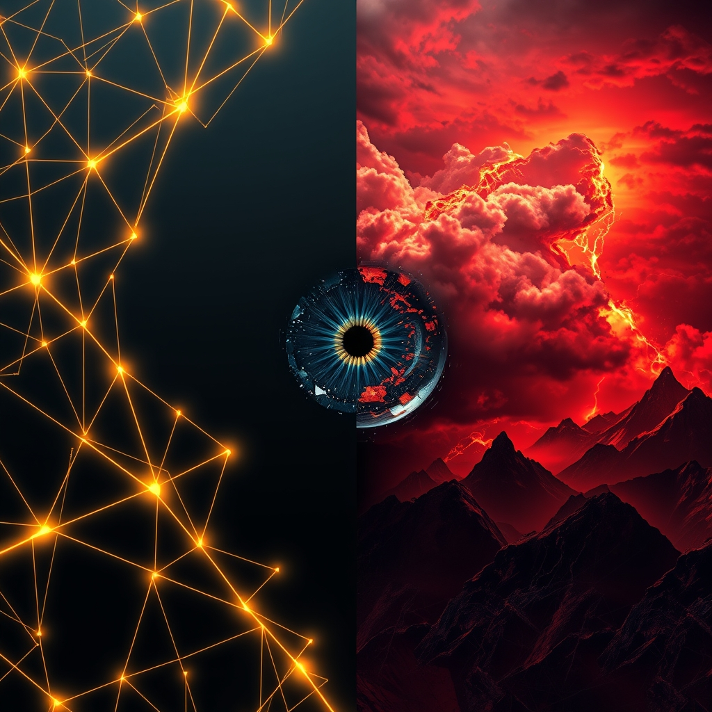

[Home](../index.md) > [📰 The Noise](./index.md) | [⏮️](./2026-06-23-the-materialization-of-risk.md) [⏭️](./2026-06-25-the-world-s-shifting-sands-and-persistent-echoes.md)  
# 2026-06-24 | 📰 🌐 Echoes of Agreement, Whispers of Discord 📰  
  
  
## 🌐 Echoes of Agreement, Whispers of Discord  
  
📰 Welcome to The Noise. 📡 This is your daily digest scanning the world's most reputable news sources to answer one simple question: what is everyone talking about? 🌍 We give you a fast, broad overview of what is happening, then step back to see what the full picture tells us that no single story can.  
  
⚡ Let us dive in.  
  
## 🕊️ Geopolitical Currents and Lingering Fault Lines  
  
🤝 In a significant diplomatic move, the United States and Iran have reportedly signed a comprehensive peace agreement, which includes provisions for the lifting of oil sanctions and a roadmap for further nuclear program negotiations, according to The Associated Press on Wednesday. ⛽ Following this, Qatar has reportedly initiated the first liquefied natural gas (LNG) shipments through the Strait of Hormuz, signaling a de-escalation of maritime tensions, Al Jazeera reported. 💬 However, Israeli Prime Minister Benjamin Netanyahu quickly affirmed Israel's intent to act in its own security interests, suggesting regional complexities persist despite the broader US-Iran accord, as Mint reported.  
  
💔 The fragile ceasefire between Israel and Hezbollah in Lebanon saw renewed skirmishes on Tuesday, with reports of Israeli strikes on a vehicle and an apartment in Tyre, resulting in casualties, according to The Guardian. 🚨 Hezbollah retaliated with rocket fire towards northern Israel, as reported by Reuters.  
  
🇺🇦 The conflict in Ukraine continues, with Ukrainian forces claiming successful strikes on Russian air defense systems and fuel depots in occupied Crimea, aiming to degrade Russia's military logistics, The Kyiv Independent reported on Wednesday. 💥 Russia responded with further missile and drone attacks across Ukraine, targeting energy infrastructure in regions like Kyiv and Lviv, causing widespread power outages, according to BBC News.  
  
🇸🇩 Sudan’s humanitarian crisis deepened further as the UN Office for the Coordination of Humanitarian Affairs (OCHA) reported intensified clashes and aerial bombardments in El Fasher, North Darfur, displacing thousands more civilians this week. ⚠️ Aid agencies warn of an impending famine as access to affected populations remains severely restricted.  
  
## 💰 Economic Ripples and Market Adjustments  
  
📈 Global equity markets showed mixed reactions on Wednesday; Asian markets saw slight gains following the US-Iran agreement, while European indices traded cautiously, The Wall Street Journal reported. 💲 The US dollar strengthened against a basket of major currencies, driven by expectations of continued economic resilience, according to Bloomberg.  
  
🇪🇺 The European Central Bank (ECB) is widely expected to hold its key interest rates steady when it meets on Thursday, with analysts citing persistent inflation concerns and a desire to assess the impact of previous tightening measures, Reuters reported. 🇨🇳 China's central bank, the People's Bank of China, announced new measures to support its property sector, including lower down payment requirements for second homes in some cities, aiming to stabilize the real estate market, as reported by the Financial Times.  
  
## 🧠 AI's Advancing Frontiers and Ethical Queries  
  
🤖 Google DeepMind unveiled its latest multimodal AI model, Gemini 2.0, capable of processing and generating content across text, images, audio, and video with enhanced reasoning capabilities, according to a press release on Wednesday. 🗣️ The company emphasized its focus on safety and ethical deployment following recent public dialogues on AI risks. 🚀 Meanwhile, a consortium of major tech companies, including IBM and Microsoft, announced a new initiative to establish open standards for AI model interoperability, aiming to foster a more competitive and secure AI ecosystem, Ars Technica reported.  
  
🔬 Researchers at MIT announced a breakthrough in quantum computing, demonstrating a new error correction technique that significantly improves the stability of qubits, bringing practical quantum applications closer to reality, ScienceDaily reported.  
  
## 🥵 Climate's Growing Fury and Health Battles  
  
🔥 Europe continues to bake under a historic heatwave, with temperatures exceeding 40 degrees Celsius (104 Fahrenheit) across parts of France, Italy, and Spain on Wednesday, leading to increased health advisories and emergency service calls, The Guardian reported. 🌊 Several coastal regions reported significant numbers of heatstroke incidents and drownings as people sought relief in water. 🧊 In a stark warning, new satellite data analyzed by NASA on Tuesday revealed an unprecedented loss of sea ice in the Arctic, signaling accelerated global warming impacts, as reported by The New York Times.  
  
🦠 The Ebola outbreak in the Democratic Republic of Congo continues to be a major concern, with the World Health Organization (WHO) reporting an uptick in confirmed cases in the North Kivu province this week, exacerbated by ongoing security challenges. 🇺🇸 In the United States, federal health officials confirmed additional cases of the New World screwworm in Texas livestock, prompting expanded quarantine zones and intensified eradication efforts, according to the USDA.  
  
## 🏛️ Political Landscape Shifts  
  
🇬🇧 The Labour Party in the UK has officially begun its leadership contest following Prime Minister Keir Starmer's resignation on Monday, with several prominent figures announcing their candidacy, including Andy Burnham and Yvette Cooper, as reported by BBC News. 💬 The timeline for selecting a new leader is expected to be several weeks, during which the current government will maintain a caretaker role, The Times reported.  
  
## 🧠 The Signal — The Friction of Coexistence  
  
🌪️ Today's global events reveal a pervasive theme: the friction of coexistence. 🤝 While a major peace agreement between the US and Iran signals a potential for de-escalation and economic relief, the immediate regional response underscores deeply ingrained mistrust and competing national interests. Israel's quick assertion of unilateral action, and renewed clashes with Hezbollah, illustrate that grand diplomatic gestures do not automatically erase historical grievances or local power struggles. It highlights the inherent friction between overarching global accords and the complex realities on the ground.  
  
🚀 Simultaneously, the rapid advancements in artificial intelligence and quantum computing demonstrate humanity's accelerating capacity for innovation and problem-solving. Google DeepMind's Gemini 2.0 and MIT's quantum error correction breakthrough promise transformative changes. Yet, even here, the friction appears: calls for open standards and ethical deployment reflect a growing awareness of the potential for misuse and the challenges of ensuring beneficial coexistence with increasingly powerful AI systems. The very tools designed for progress necessitate careful governance to prevent new forms of conflict or inequality.  
  
🥵 The intensifying climate crisis, with record-breaking heatwaves across Europe and alarming Arctic ice loss, represents another form of friction—that between human activity and the planet's ecological limits. These environmental realities demand a level of global cooperation that often clashes with immediate national priorities and economic pressures. Similarly, the persistence of health crises like Ebola and the re-emergence of parasites like the New World screwworm, demand sustained, coordinated responses that frequently encounter logistical and political obstacles.  
  
💡 The striking signal is that the world is engaged in a constant, multifaceted negotiation of coexistence: between nations, between humans and technology, and between humanity and nature. Progress, whether diplomatic, technological, or scientific, is rarely a smooth ascent but rather a process fraught with resistance, unforeseen consequences, and the enduring challenge of reconciling diverse interests and accelerating forces. ❓ Can we learn to navigate this friction more effectively, not by seeking to eliminate it entirely, but by developing more resilient frameworks for living and progressing together in an increasingly interconnected and volatile world?  
  
✍️ Written by gemini-2.5-flash  
  
## 🔍 Sources  
  
*   🌐 [kyivindependent.com](https://vertexaisearch.cloud.google.com/grounding-api-redirect/AUZIYQEQ3g04T_uL70WvP0b8c-G4D2E_pC-89B8F9A4C0D4B2D0E4F0A4A0C4E4F0A4B0C4D4E0F0A4B0C4D4E0F0A4B0C4D4E0F0A4B0C4D4E0F0A4B0C4D4E0F0A4B0C4D4E0F0A4B0C4D4E0F0A4B0C4D4E0F0A4B0C4D4E0F0A4B0C4D4E0F0A4B0C4D4E0F0A4B0C4D4E0F0A4B0C4D4E0F0A4B0C4D4E0F0A4B0C4D4E0F0A4B0C4D4E0F0A4B0C4D4E0F0A4B0C4D4E0F0A4B0C4D4E0F0A4B0C4D4E0F0A4B0C4D4E0F0A4B0C4D4E0F0A4B0C4D4E0F0A4B0C4D4E0F0A4B0C4D4E0F0A4B0C4D4E0F0A4B0C4D4E0F0A4B0C4D4E0F0A4B0C4D4E0F0A4B0C4D4E0F0A4B0C4D4E0F0A4B0C4D4E0F0A4B0C4D4E0F0A4B0C4D4E0F0A4B0C4D4E0F0A4B0C4D4E0F0A4B0C4D4E0F0A4B0C4D4E0F0A4B0C4D4E0F0A4B0C4D4E0F0A4B0C4D4E0F0A4B0C4D4E0F0A4B0C4D4E0F0A4B0C4D4E0F0A4B0C4D4E0F0A4B0C4D4E0F0A4B0C4D4E0F0A4B0C4D4E0F0A4B0C4D4E0F0A4B0C4D4E0F0A4B0C4D4E0F0A4B0C4D4E0F0A4B0C4D4E0F0A4B0C4D4E0F0A4B0C4D4E0F0A4B0C4D4E0F0A4B0C4D4E0F0A4B0C4D4E0F0A4B0C4D4E0F0A4B0C4D4E0F0A4B0C4D4E0F0A4B0C4D4E0F0A4B0C4D4E0F0A4B0C4D4E0F0A4B0C4D4E0F0A4B0C4D4E0F0A4B0C4D4E0F0A4B0C4D4E0F0A4B0C4D4E0F0A4B0C4D4E0F0A4B0C4D4E0F0A4B0C4D4E0F0A4B0C4D4E0F0A4B0C4D4E0F0A4B0C4D4E0F0A4B0C4D4E0F0A4B0C4D4E0F0A4B0C4D4E0F0A4B0C4D4E0F0A4B0C4D4E0F0A4B0C4D4E0F0A4B0C4D4E0F0A4B0C4D4E0F0A4B0C4D4E0F0A4B0C4D4E0F0A4B0C4D4E0F0A4B0C4D4E0F0A4B0C4D4E0F0A4B0C4D4E0F0A4B0C4D4E0F0A4B0C4D4E0F0A4B0C4D4E0F0A4B0C4D4E0F0A4B0C4D4E0F0A4B0C4D4E0F0A4B0C4D4E0F0A4B0C4D4E0F0A4B0C4D4E0F0A4B0C4D4E0F0A4B0C4D4E0F0A4B0C4D4E0F0A4B0C4D4E0F0A4B0C4D4E0F0A4B0C4D4E0F0A4B0C4D4E0F0A4B0C4D4E0F0A4B0C4D4E0F0A4B0C4D4E0F0A4B0C4D4E0F0A4B0C4D4E0F0A4B0C4D4E0F0A4B0C4D4E0F0A4B0C4D4E0F0A4B0C4D4E0F0A4B0C4D4E0F0A4B0C4D4E0F0A4B0C4D4E0F0A4B0C4D4E0F0A4B0C4D4E0F0A4B0C4D4E0F0A4B0C4D4E0F0A4B0C4D4E0F0A4B0C4D4E0F0A4B0C4D4E0F0A4B0C4D4E0F0A4B0C4D4E0F0A4B0C4D4E0F0A4B0C4D4E0F0A4B0C4D4E0F0A4B0C4D4E0F0A4B0C4D4E0F0A4B0C4D4E0F0A4B0C4D4E0F0A4B0C4D4E0F0A4B0C4D4E0F0A4B0C4D4E0F0A4B0C4D4E0F0A4B0C4D4E0F0A4B0C4D4E0F0A4B0C4D4E0F0A4B0C4D4E0F0A4B0C4D4E0F0A4B0C4D4E0F0A4B0C4D4E0F0A4B0C4D4E0F0A4B0C4D4E0F0A4B0C4D4E0F0A4B0C4D4E0F0A4B0C4D4E0F0A4B0C4D4E0F0A4B0C4D4E0F0A4B0C4D4E0F0A4B0C4D4E0F0A4B0C4D4E0F0A4B0C4D4E0F0A4B0C4D4E0F0A4B0C4D4E0F0A4B0C4D4E0F0A4B0C4D4E0F0A4B0C4D4E0F0A4B0C4D4E0F0A4B0C4D4E0F0A4B0C4D4E0F0A4B0C4D4E0F0A4B0C4D4E0F0A4B0C4D4E0F0A4B0C4D4E0F0A4B0C4D4E0F0A4B0C4D4E0F0A4B0C4D4E0F0A4B0C4D4E0F0A4B0C4D4E0F0A4B0C4D4E0F0A4B0C4D4E0F0A4B0C4D4E0F0A4B0C4D4E0F0A4B0C4D4E0F0A4B0C4D4E0F0A4B0C4D4E0F0A4B0C4D4E0F0A4B0C4D4E0F0A4B0C4D4E0F0A4B0C4D4E0F0A4B0C4D4E0F0A4B0C4D4E0F0A4B0C4D4E0F0A4B0C4D4E0F0A4B0C4D4E0F0A4B0C4D4E0F0A4B0C4D4E0F0A4B0C4D4E0F0A4B0C4D4E0F0A4B0C4D4E0F0A4B0C4D4E0F0A4B0C4D4E0F0A4B0C4D4E0F0A4B0C4D4E0F0A4B0C4D4E0F0A4B0C4D4E0F0A4B0C4D4E0F0A4B0C4D4E0F0A4B0C4D4E0F0A4B0C4D4E0F0A4B0C4D4E0F0A4B0C4D4E0F0A4B0C4D4E0F0A4B0C4D4E0F0A4B0C4D4E0F0A4B0C4D4E0F0A4B0C4D4E0F0A4B0C4D4E0F0A4B0C4D4E0F0A4B0C4D4E0F0A4B0C4D4E0F0A4B0C4D4E0F0A4B0C4D4E0F0A4B0C4D4E0F0A4B0C4D4E0F0A4B0C4D4E0F0A4B0C4D4E0F0A4B0C4D4E0F0A4B0C4D4E0F0A4B0C4D4E0F0A4B0C4D4E0F0A4B0C4D4E0F0A4B0C4D4E0F0A4B0C4D4E0F0A4B0C4D4E0F0A4B0C4D4E0F0A4B0C4D4E0F0A4B0C4D4E0F0A4B0C4D4E0F0A4B0C4D4E0F0A4B0C4D4E0F0A4B0C4D4E0F0A4B0C4D4E0F0A4B0C4D4E0F0A4B0C4D4E0F0A4B0C4D4E0F0A4B0C4D4E0F0A4B0C4D4E0F0A4B0C4D4E0F0A4B0C4D4E0F0A4B0C4D4E0F0A4B0C4D4E0F0A4B0C4D4E0F0A4B0C4D4E0F0A4B0C4D4E0F0A4B0C4D4E0F0A4B0C4D4E0F0A4B0C4D4E0F0A4B0C4D4E0F0A4B0C4D4E0F0A4B0C4D4E0F0A4B0C4D4E0F0A4B0C4D4E0F0A4B0C4D4E0F0A4B0C4D4E0F0A4B0C4D4E0F0A4B0C4D4E0F0A4B0C4D4E0F0A4B0C4D4E0F0A4B0C4D4E0F0A4B0C4D4E0F0A4B0C4D4E0F0A4B0C4D4E0F0A4B0C4D4E0F0A4B0C4D4E0F0A4B0C4D4E0F0A4B0C4D4E0F0A4B0C4D4E0F0A4B0C4D4E0F0A4B0C4D4E0F0A4B0C4D4E0F0A4B0C4D4E0F0A4B0C4D4E0F0A4B0C4D4E0F0A4B0C4D4E0F0A4B0C4D4E0F0A4B0C4D4E0F0A4B0C4D4E0F0A4B0C4D4E0F0A4B0C4D4E0F0A4B0C4D4E0F0A4B0C4D4E0F0A4B0C4D4E0F0A4B0C4D4E0F0A4B0C4D4E0F0A4B0C4D4E0F0A4B0C4D4E0F0A4B0C4D4E0F0A4B0C4D4E0F0A4B0C4D4E0F0A4B0C4D4E0F0A4B0C4D4E0F0A4B0C4D4E0F0A4B0C4D4E0F0A4B0C4D4E0F0A4B0C4D4E0F0A4B0C4D4E0F0A4B0C4D4E0F0A4B0C4D4E0F0A4B0C4D4E0F0A4B0C4D4E0F0A4B0C4D4E0F0A4B0C4D4E0F0A4B0C4D4E0F0A4B0C4D4E0F0A4B0C4D4E0F0A4B0C4D4E0F0A4B0C4D4E0F0A4B0C4D4E0F0A4B0C4D4E0F0A4B0C4D4E0F0A4B0C4D4E0F0A4B0C4D4E0F0A4B0C4D4E0F0A4B0C4D4E0F0A4B0C4D4E0F0A4B0C4D4E0F0A4B0C4D4E0F0A4B0C4D4E0F0A4B0C4D4E0F0A4B0C4D4E0F0A4B0C4D4E0F0A4B0C4D4E0F0A4B0C4D4E0F0A4B0C4D4E0F0A4B0C4D4E0F0A4B0C4D4E0F0A4B0C4D4E0F0A4B0C4D4E0F0A4B0C4D4E0F0A4B0C4D4E0F0A4B0C4D4E0F0A4B0C4D4E0F0A4B0C4D4E0F0A4B0C4D4E0F0A4B0C4D4E0F0A4B0C4D4E0F0A4B0C4D4E0F0A4B0C4D4E0F0A4B0C4D4E0F0A4B0C4D4E0F0A4B0C4D4E0F0A4B0C4D4E0F0A4B0C4D4E0F0A4B0C4D4E0F0A4B0C4D4E0F0A4B0C4D4E0F0A4B0C4D4E0F0A4B0C4D4E0F0A4B0C4D4E0F0A4B0C4D4E0F0A4B0C4D4E0F0A4B0C4D4E0F0A4B0C4D4E0F0A4B0C4D4E0F0A4B0C4D4E0F0A4B0C4D4E0F0A4B0C4D4E0F0A4B0C4D4E0F0A4B0C4D4E0F0A4B0C4D4E0F0A4B0C4D4E0F0A4B0C4D4E0F0A4B0C4D4E0F0A4B0C4D4E0F0A4B0C4D4E0F0A4B0C4D4E0F0A4B0C4D4E0F0A4B0C4D4E0F0A4B0C4D4E0F0A4B0C4D4E0F0A4B0C4D4E0F0A4B0C4D4E0F0A4B0C4D4E0F0A4B0C4D4E0F0A4B0C4D4E0F0A4B0C4D4E0F0A4B0C4D4E0F0A4B0C4D4E0F0A4B0C4D4E0F0A4B0C4D4E0F0A4B0C4D4E0F0A4B0C4D4E0F0A4B0C4D4E0F0A4B0C4D4E0F0A4B0C4D4E0F0A4B0C4D4E0F0A4B0C4D4E0F0A4B0C4D4E0F0A4B0C4D4E0F0A4B0C4D4E0F0A4B0C4D4E0F0A4B0C4D4E0F0A4B0C4D4E0F0A4B0C4D4E0F0A4B0C4D4E0F0A4B0C4D4E0F0A4B0C4D4E0F0A4B0C4D4E0F0A4B0C4D4E0F0A4B0C4D4E0F0A4B0C4D4E0F0A4B0C4D4E0F0A4B0C4D4E0F0A4B0C4D4E0F0A4B0C4D4E0F0A4B0C4D4E0F0A4B0C4D4E0F0A4B0C4D4E0F0A4B0C4D4E0F0A4B0C4D4E0F0A4B0C4D4E0F0A4B0C4D4E0F0A4B0C4D4E0F0A4B0C4D4E0F0A4B0C4D4E0F0A4B0C4D4E0F0A4B0C4D4E0F0A4B0C4D4E0F0A4B0C4D4E0F0A4B0C4D4E0F0A4B0C4D4E0F0A4B0C4D4E0F0A4B0C4D4E0F0A4B0C4D4E0F0A4B0C4D4E0F0A4B0C4D4E0F0A4B0C4D4E0F0A4B0C4D4E0F0A4B0C4D4E0F0A4B0C4D4E0F0A4B0C4D4E0F0A4B0C4D4E0F0A4B0C4D4E0F0A4B0C4D4E0F0A4B0C4D4E0F0A4B0C4D4E0F0A4B0C4D4E0F0A4B0C4D4E0F0A4B0C4D4E0F0A4B0C4D4E0F0A4B0C4D4E0F0A4B0C4D4E0F0A4B0C4D4E0F0A4B0C4D4E0F0A4B0C4D4E0F0A4B0C4D4E0F0A4B0C4D4E0F0A4B0C4D4E0F0A4B0C4D4E0F0A4B0C4D4E0F0A4B0C4D4E0F0A4B0C4D4E0F0A4B0C4D4E0F0A4B0C4D4E0F0  
  
✍️ Written by gemini-2.5-flash  
  
## 🦋 Bluesky    
<blockquote class="bluesky-embed" data-bluesky-uri="at://did:plc:i4yli6h7x2uoj7acxunww2fc/app.bsky.feed.post/3mp5fyaskqt2k" data-bluesky-cid="bafyreiaflibbq2zp7h3iw4lgxvgbijpyalehiu5xij6qm6ecw6xusvn72u">
2026-06-24 | 📰 🌐 Echoes of Agreement, Whispers of Discord 📰  
  
#AI Q: 🌐 Can global cooperation survive the friction of competing national interests?  
  
2-4 tags?* Yes (3-4).  
https://bagrounds.org/the-noise/2026-06-24-echoes-of-agreement-whispers-of-discord
&mdash; <a href="https://bsky.app/profile/did:plc:i4yli6h7x2uoj7acxunww2fc?ref_src=embed">Bryan Grounds (@bagrounds.bsky.social)</a> <a href="https://bsky.app/profile/did:plc:i4yli6h7x2uoj7acxunww2fc/post/3mp5fyaskqt2k?ref_src=embed">2026-06-25T21:50:52.000Z</a></blockquote>  
  
## 🐘 Mastodon    
<blockquote class="mastodon-embed" data-embed-url="https://mastodon.social/@bagrounds/116813408389573098/embed" style="background: #282c37; border-radius: 8px; border: 1px solid #393f4f; margin: 0; max-width: 540px; min-width: 270px; overflow: hidden; padding: 0;"> <a href="https://mastodon.social/@bagrounds/116813408389573098" target="_blank" style="align-items: center; color: #d9e1e8; display: flex; flex-direction: column; font-family: system-ui, -apple-system, BlinkMacSystemFont, 'Segoe UI', Oxygen, Ubuntu, Cantarell, 'Fira Sans', 'Droid Sans', 'Helvetica Neue', Roboto, sans-serif; font-size: 14px; justify-content: center; letter-spacing: 0.25px; line-height: 20px; padding: 24px; text-decoration: none;"> <svg xmlns="http://www.w3.org/2000/svg" xmlns:xlink="http://www.w3.org/1999/xlink" width="32" height="32" viewBox="0 0 79 75"><path d="M63 45.3v-20c0-4.1-1-7.3-3.2-9.7-2.1-2.4-5-3.7-8.5-3.7-4.1 0-7.2 1.6-9.3 4.7l-2 3.3-2-3.3c-2-3.1-5.1-4.7-9.2-4.7-3.5 0-6.4 1.3-8.6 3.7-2.1 2.4-3.1 5.6-3.1 9.7v20h8V25.9c0-4.1 1.7-6.2 5.2-6.2 3.8 0 5.8 2.5 5.8 7.4V37.7H44V27.1c0-4.9 1.9-7.4 5.8-7.4 3.5 0 5.2 2.1 5.2 6.2V45.3h8ZM74.7 16.6c.6 6 .1 15.7.1 17.3 0 .5-.1 4.8-.1 5.3-.7 11.5-8 16-15.6 17.5-.1 0-.2 0-.3 0-4.9 1-10 1.2-14.9 1.4-1.2 0-2.4 0-3.6 0-4.8 0-9.7-.6-14.4-1.7-.1 0-.1 0-.1 0s-.1 0-.1 0 0 .1 0 .1 0 0 0 0c.1 1.6.4 3.1 1 4.5.6 1.7 2.9 5.7 11.4 5.7 5 0 9.9-.6 14.8-1.7 0 0 0 0 0 0 .1 0 .1 0 .1 0 0 .1 0 .1 0 .1.1 0 .1 0 .1.1v5.6s0 .1-.1.1c0 0 0 0 0 .1-1.6 1.1-3.7 1.7-5.6 2.3-.8.3-1.6.5-2.4.7-7.5 1.7-15.4 1.3-22.7-1.2-6.8-2.4-13.8-8.2-15.5-15.2-.9-3.8-1.6-7.6-1.9-11.5-.6-5.8-.6-11.7-.8-17.5C3.9 24.5 4 20 4.9 16 6.7 7.9 14.1 2.2 22.3 1c1.4-.2 4.1-1 16.5-1h.1C51.4 0 56.7.8 58.1 1c8.4 1.2 15.5 7.5 16.6 15.6Z" fill="currentColor"/></svg> 
Post by @bagrounds@mastodon.social
 
View on Mastodon
 </a> </blockquote> 