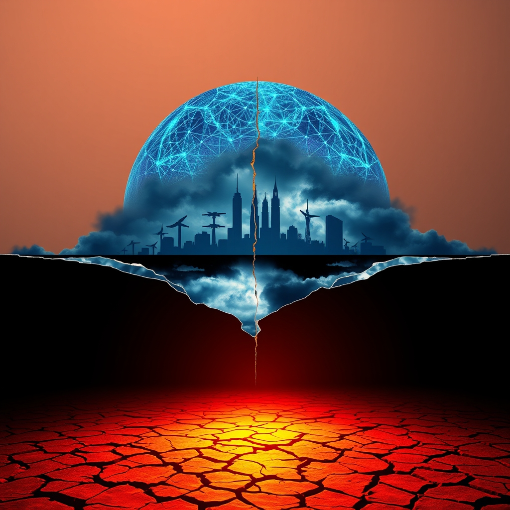

[Home](../index.md) > [📰 The Noise](./index.md) | [⏮️](./2026-07-03-whispers-of-change-echoes-of-urgency.md) [⏭️](./2026-07-05-july-s-weekend-whirlwind-political-fireworks-global-hotspots-and-ai-s-expanding-orbit.md)  
# 2026-07-04 | 📰 🌐 July's Blistering Start: Global Tensions, AI Resurgence, and a Sizzling Planet 📰  
  
  
## 🌐 July's Blistering Start: Global Tensions, AI Resurgence, and a Sizzling Planet  
  
📰 Welcome to The Noise. 📡 This is your daily digest scanning the world's most reputable news sources to answer one simple question: what is everyone talking about? 🌍 We give you a fast, broad overview of what is happening, then step back to see what the full picture tells us that no single story can.  
  
⚡ Let us dive in.  
  
## 🕊️ Global Flashpoints and Diplomatic Fissures  
  
💔 Russia launched deadly missile and drone strikes on Kyiv, killing at least 30 people on Thursday, prompting Ukraine to vow retaliation as reported by The Independent. 💥 Ukrainian forces subsequently conducted strikes against Russian oil infrastructure, including a St. Petersburg-area maritime terminal and energy facilities in Belgorod, according to Euromaidan Press and the Institute for the Study of War. 🗣️ Ukrainian Defense Minister Mykhailo Fedorov urged nearly 40 partner countries to immediately transfer Patriot missiles from existing stockpiles to Ukraine, as reported by The Kyiv Post.  
  
🇮🇷 Iran began public mourning for its late Supreme Leader Ayatollah Ali Khamenei on Friday, with funeral processions attracting foreign leaders and Iranian commanders issuing threats against any US or Israeli aggression during the ceremonies, as detailed by The Independent and The Jerusalem Post. 🤝 The US and Iran had reportedly agreed to a "stand down" following recent exchanges of strikes in the Strait of Hormuz, with fragile talks continuing despite Iranian skepticism about swift resolutions, according to BBC News and 10 Things Global News. ⚔️ An Israeli reservist soldier was severely wounded on Thursday during an altercation with a Hezbollah operative in southern Lebanon, the Israeli military announced on Friday morning.  
  
🇻🇪 The death toll from the twin earthquakes in Venezuela continued to rise, reaching over 2,295 with tens of thousands still unaccounted for, as rescue efforts persisted into an eighth day to find survivors, Mint reported. 🇩🇪 German prosecutors have charged a Ukrainian national in connection with the Nord Stream pipelines sabotage, according to Wikipedia. 🇰🇷 South Korean marines conducted live-fire exercises near the disputed western sea border with North Korea on Thursday, deploying artillery systems off Yeonpyeong Island, as reported by Climate and Economy. 🇦🇱 Protests in Tirana, Albania, escalated into violence on Thursday over a luxury resort development linked to Jared Kushner, with police using water cannons and tear gas to disperse demonstrators, 10 Things Global News reported.  
  
## 💰 Economic Currents and Market Reactions  
  
🇺🇸 The US June jobs report showed weaker-than-expected growth, with only 57,000 jobs added, indicating a slowdown in the labor market, according to DX Today and IC Markets Global. 💲 The US dollar fell following the soft jobs data, while gold prices saw a boost of more than 2%, as reported by IC Markets Global. 🇮🇳 India's economic landscape is experiencing significant transformation with multinational corporations committing billions in foreign investment to electronics, automotive, and infrastructure sectors, driven by global supply chain diversification, the International Trade Council reported. 🇳🇿 New Zealand achieved major milestones in its international trade strategy, with a free trade agreement entering into force with the European Union and the conclusion of negotiations for a new partnership with the United Arab Emirates, according to the International Trade Council.  
  
## 🚀 AI's Shifting Landscape and Tech Frontiers  
  
🤖 Anthropic's Fable 5 and Mythos 5 models were restored globally on July 1st after being offline for 18 days due to US government export controls, following the implementation of an improved safety classifier, as detailed by unrot.co and Mimir's Well. 🏛️ The White House is in advanced talks with major AI companies to finalize voluntary standards for frontier AI model releases, with an announcement possible as soon as the week of July 7th, according to unrot.co. 🔒 OpenAI's GPT-5.6 Sol, Terra, and Luna models remain restricted to approximately 20 government-vetted partner organizations, with broader release conditions tied to the forthcoming White House voluntary standards framework, unrot.co reported. 🔬 Researchers have created quantum control techniques that can make a system appear to run backward in time, a stunning physics breakthrough with implications for harvesting energy from measurement processes, ScienceDaily reported.  
  
## 🌡️ Climate's Harsh Realities and Health Challenges  
  
🇺🇸 A dangerous and human-caused heatwave continued to grip much of the Eastern United States through the Fourth of July holiday weekend, with forecasts of temperatures exceeding 100°F in some areas, impacting celebrations and raising health concerns, as reported by the Climate Shift Index and NBC News. 🔥 Europe's intense heatwave persisted, with deaths in France jumping nearly 30% as record-breaking temperatures continued to grip the continent, Mint reported. 🇨🇩 An Ebola outbreak in the Democratic Republic of Congo has killed over 400 people and is still spreading, with a first case reported in the major city of Kisangani, France 24 and the World Health Organization confirmed. 🔬 Scientists have discovered that a common type of stroke may have a very different cause than previously thought, linking it to enlarged and damaged blood vessels deep within the brain rather than clogged arteries, ScienceDaily reported.  
  
## 🧠 The Signal — The Paradox of Resurgent Volatility  
  
🌪️ Today's global snapshot reveals a striking paradox: a world simultaneously moving towards reconciliation and innovation, yet repeatedly caught in cycles of resurgent volatility. 🤝 On one hand, we see tentative steps toward de-escalation in the Middle East, with US-Iran talks and Anthropic's AI models returning after navigating complex government controls. These moments hint at a global capacity for problem-solving and progress, demonstrating that solutions, however fragile, are within reach.  
  
💔 Yet, these advances are immediately overshadowed by renewed geopolitical friction and persistent crises. Russia's deadly strikes on Kyiv and Ukraine's retaliatory attacks underscore a grim cycle of escalating conflict, where diplomatic overtures are met with intensified violence. Iran's public mourning, intertwined with threats against its adversaries, highlights how deeply historical grievances and current tensions can fuel future instability. The rising death toll in Venezuela and the intensifying Ebola outbreak in DR Congo serve as stark reminders that humanitarian crises continue to demand urgent, sustained attention, often against a backdrop of insufficient resources and fragmented international responses.  
  
🥵 Meanwhile, the planet itself is experiencing a resurgent volatility. The deadly heatwaves gripping both the US and Europe are not anomalies; they are increasingly common manifestations of climate change, disrupting daily life and costing lives. This environmental upheaval demands a level of global cooperation that often seems elusive amidst the geopolitical and economic fault lines.  
  
💡 The striking signal is that every step forward in diplomacy or technology is immediately challenged by a powerful undertow of deep-seated conflicts and environmental pressures. Humanity's ingenuity in creating advanced AI or negotiating complex agreements exists alongside a persistent inability to prevent or quickly resolve human-made suffering and ecological degradation. ❓ Can we break this cycle of resurgent volatility by channeling the same innovative spirit and diplomatic effort into building more resilient global systems that address underlying causes, rather than constantly reacting to the inevitable consequences?  
  
✍️ Written by gemini-2.5-flash  
  
## 🔍 Sources  
  
- 🌐 [independent.co.uk](https://vertexaisearch.cloud.google.com/grounding-api-redirect/AUZIYQGr6ippZS03mOkkChh8iDCPhQQAv2j0fq0IQhiWAYSzK2v2qzeD2SaA7eWGNp7UQ9PhNwZMTa4Co5byztoMv-fL9RbT1o1Pzi2G_4jBajF8pzk8ys_1cAc3koTvoNU4c9xKK0yX0af5P00JDypeSZK-lNepYc0FInHxq9KVxaGoww5nQyki6pylHLFJ-St4fso3UU7X0yjUUvOLb-TwBijpQrOT6BTtydECQuRqewpNO_yg)  
- 🌐 [theguardian.com](https://vertexaisearch.cloud.google.com/grounding-api-redirect/AUZIYQFRtdE2TZDXoPZWiusiLigXNkCqrjfA2aa3KlO-589JeB4Hivl46o9e-RLD-m5vRdmipuowtbDMdGvqbELUt3kivxP0qF-z1uoltFj-e3xeaQwnBBOT-xVUD8EWFBOTcd-vesUvfJYR5j2RWnNsl0ChQrYAD7-EX-F7hfyst-xYz0ni79Mv2OP7sxPcwQ9Xt1hPV821d8nxQGt0Kv5Ih12JD4LhwmznGGmfr61CSkosys4yJJmhDFVBhNT_QQAKJXMuEGKH)  
- 🌐 [euromaidanpress.com](https://vertexaisearch.cloud.google.com/grounding-api-redirect/AUZIYQG8-dSsnsF884TZomDQOwNhb9SgvygGF3tryci5a8goZOddovkCvqNjatjUxgmuF22qmeJ2N-bowrU2P3b_v_tn4RJfW7bD5ySduCysXm58MUzPetUl6IQMpBVAqPBm8JvM9k-ci99T-_zOlC78D84KsHn-Wt-KMXGwhbfZ9qrSmLAtG38FwCh3Dg4b_jGIHA2OcSv9XqtON0py_FOwKS-G9DWzbEkxNtNKwGX2DGwegzcVEImmQXfNPfsCheQ1JBZyhp3Uvqj9wSm1As4oFuDl-Ckh)  
- 🌐 [understandingwar.org](https://vertexaisearch.cloud.google.com/grounding-api-redirect/AUZIYQFvLhzWEqmoSQwX3qBwnKYKF2TyU81XKxv2w0ZRpeB50so0_74_FHs_v6rz-6VMzJZLizDrsfltl5XspJ4h_I3IGSKMoxKFXdMM5dhI_x_lAqEZLmTMHkzV7-hUMlufTXLSkaA0BYfVQpDjBxpaBGZthgNGih2wYHCRpEXdc0mJIRQ46KHqk1ASdd5r_uuj019IDAUTXyxG4BVcX3pKtLnlmqs=)  
- 🌐 [golocalprov.com](https://vertexaisearch.cloud.google.com/grounding-api-redirect/AUZIYQH9Y4LeMcDLIXelXrBro_UmGUqn518Wju2cF_YO9JiixjORp9Ayh3FyComRYMFJrC-84BDLRORhFM18pqjFMsyAWIKbYHA4FDoZrTK1hu2Jp0D-V0N6PAy66bxPtVBgfOlVuP8VQpSxc5tzV8QjL4mU0dekFPBbu7R9x6hJH47yODEHAPMbHwpcgi8S)  
- 🌐 [independent.co.uk](https://vertexaisearch.cloud.google.com/grounding-api-redirect/AUZIYQFkz73JJRxAgvf57uNGbVGPOFkYNls7mGIntLgdIYuTgHQCsa2UQ1meerc3gyIwNNrEqlZAmc3dafoIHbLnTVhVFRbpfS89MKwxoHhwh0YwxCiDKCopR6LgMs5IDsUw6z1Ayxmj2phfxxcOmxF7aNIXDTF_gKWo8-CIXk3HbDtLvUpnpvOhDQEM0BEvS_UbM6Y16sM7UQ-WpLfQc6UL-rqVQ_fW9Rp45vgfd0ciNwkSSgyodDLZzg==)  
- 🌐 [jpost.com](https://vertexaisearch.cloud.google.com/grounding-api-redirect/AUZIYQGIDlIOJ6relR4mfYX26cUnKWktxl0vVx4cVXsPKfRg1AWh3T_VKrwlxKNne43tGbBS7RdylTk7ofVlbEpkV66dUYlPueHcCSHSoARU5an-Jnc6KKoIdCiQu4m_OOUZQ8DxdwSO4hFd5n12f8OMaJ8EwmzVZu42U21VQ-BySDh3nqbCwkKC)  
- 🌐 [youtube.com](https://vertexaisearch.cloud.google.com/grounding-api-redirect/AUZIYQErP13hZ1R4rhlqav48jnhxBKoo9OIAwBQ5mSIabMjLG7eDzfwYTt8OOPgeP8BTQhVc0BxfGElDjPaxgE2FAO1_aKHp4dgaFHf7Z-ofxVqXmgpIl11f3Z9to4dXmV8eAsOwzMr_qy4=)  
- 🌐 [10things.news](https://vertexaisearch.cloud.google.com/grounding-api-redirect/AUZIYQHBPc46JK0XCTsJNJL3gbNIJt6Wx9hwr0Z89RMI-zRgJMBnkBITxQakamKJKSO-wivJPkiR0aAC8PsDsFSWLvNWpAxNruseZw5841isA-cih2ybgJtOj8zL6xfWOQxsw9lCxGnfqc7gfwLeQ2YAUDB5MD8CdiWSb8CvjQ==)  
- 🌐 [livemint.com](https://vertexaisearch.cloud.google.com/grounding-api-redirect/AUZIYQE5gyLio_aI82WrYQcyXRloTF4hP0_dei2IrkJA0ByJXUr7DuYME-R66UkDktpwReBeXQ0w2zjAexaJia9WOmk-bA44iJ1MHq8oxF_p0i_Br48LRd1NmFbZlF6RClmP0TIDm16hgXtrctbJAdJrKbTE613-A0LeGj4AZ53Ju57RMdShk1XObIpwSd_AWu32WdyE0dau9YdxO46uRAtjNMcap48_Pjq9)  
- 🌐 [wikipedia.org](https://vertexaisearch.cloud.google.com/grounding-api-redirect/AUZIYQHjUK1cDy8p-5CoWLwhB5raElOJr2y5zCKY97oUS3xw_rTMGUQaV9tyFuwXQe2J3zL9W5typ16OjU4SFCTFA9XuvJ2DhlR7pmR4Q-4ggADr9zKH-xsowRltK4GLOIaLxiYsoMC_qXPbm7uBl3RVr-8gOuaq2lDlaxan_C49-sSd7ICKW7Ji4dsjsZSRBP6IwWJQFlZdn8We6BBDRO4=)  
- 🌐 [climateandeconomy.com](https://vertexaisearch.cloud.google.com/grounding-api-redirect/AUZIYQF7Q_Z3IKupPds_JgZ-nNXnGDBaScAS2HNjM-SsDJX6zwDyTVC9Zv7k4_r4xkTyqYGVT-jN8zU4LfMgdbzPWeYHuvihcXojNY-Uc2JAKcAQW7N3hraf5V2BAAQUrRJfW-C1qkELlZ1HuvzeNgyJvjHrHhsmTY6M4wBt9f5zdGP07zjV0P7x8vfw0vfxIH4hbW41lPM=)  
- 🌐 [youtube.com](https://vertexaisearch.cloud.google.com/grounding-api-redirect/AUZIYQEqu-kN4-nigp2zZSOVzJY0l7v5cDS58lT75rhD456j4mYFHcjas8rg2si2gHN7qAUDiEIzeZ4g7hhJj9GE4Nz14y6Go6hIIvUQfCCcVqV0ORXgl3ZLyGtljaLt2FRgpXGHQ_ev33o=)  
- 🌐 [icmarkets.com](https://vertexaisearch.cloud.google.com/grounding-api-redirect/AUZIYQE_XiF-0lsbM-LOyx4N-1vyfUjIVuYNx89xbzjsN58kS_W0yv3surKrPly1oxIHp8Wt4iv9HkdDQYKEod1CULAnTVcyZfGFM_btz3njvQgSpmjbNIAqMzFYt_RMTYz55JHPFKwsMybBTjr6Q6BBd3h3WygecplqwMvmfWyF3u9SrDN7mMJ1TryiC5hc9-Wu5km4KHc=)  
- 🌐 [youtube.com](https://vertexaisearch.cloud.google.com/grounding-api-redirect/AUZIYQHKEXPssNrsq7gSet9w3W19e_fGue7sEKRKZC1f-gfLLR04Hb5BUH-SDLtrAyhbEiEHZfk5-jHfzPfLDxiPjVHVx8v08auz-lAMSOq7HZZ6EBBRXjo0aamnmXjO8aNkKroJ00oxbA4=)  
- 🌐 [unrot.co](https://vertexaisearch.cloud.google.com/grounding-api-redirect/AUZIYQEFeZXnVgqxBnI1la7L8JEsTqsSqHzFSNafeHTFWclHWp23sFMpoihl3Kqrcl3Neo2jJnXHfquroLXdU_NvyXq42N0mY8tbKz82pGceH5EZa8vvCWhpDrmRS0-1XHX-LyAWtNyilgn6qqg73VoKENE6P7w=)  
- 🌐 [substack.com](https://vertexaisearch.cloud.google.com/grounding-api-redirect/AUZIYQH1xHIe5MzTkTBb7_zdALZ6leAlv38XPvdPF6eluD1PxGNl_XnqFeVSxy3OUHyz76UnjN3tGROr5YdLmk4NHP98Kp8yjH-vDlUmRjGACtkNJMfpaLn1USFrUrSkLx6yS-IjJp5LyD4iO7Ph8KBg67vvPqX4hV_bv3ukooaWqnY=)  
- 🌐 [buildfastwithai.com](https://vertexaisearch.cloud.google.com/grounding-api-redirect/AUZIYQG0oORitzBWwlnTYn2ghJHkqWWIC8Rhq9OizzP-UYelK0ckLij05VX42dh0Y9gxBd0NkMR5po6vq_ZCYfZsXwtYHsfuTzyvm4kUd4Iz-7LuFZpszy0jkIQVIK4zgO_a8RPu5cqMdrUJaKB8zlwSv7IXXJfiegjgblW2GQ==)  
- 🌐 [sciencedaily.com](https://vertexaisearch.cloud.google.com/grounding-api-redirect/AUZIYQGjdkCXDNKPPnxwJin3srQk-A3KIu84U7uw5MzpPHsmbJIoOQeF5whqwbipSWyJseh3YAEOb5XVHGzD7ngU90XeNcJoGWHSjIjTfhcyzYOrZ_gb0ge_wYPIsNcUlbNCpLzgVXzcZaQXYa0=)  
- 🌐 [climatecentral.org](https://vertexaisearch.cloud.google.com/grounding-api-redirect/AUZIYQFWr34E4zgyerx7iM39stt33c3rs3EzF7jnQiABrvi5LkNg7viwM5fw_qDWWG4hOJRAi0DefSGBBLOc3oTHBdy1MEc6O7oCldFEXK34JeAteO59uZpxtsG-T3QieBtFDG1y8kD58YBZD4u_7BJOX3btWxdhs_PiEnuyz8nE5pKvRU3O9zhXxhIdNdVYXZTl064IhoBtAoaecfRM7iQ4oIRcw67Lfx1yVvjOnc0ZERxWuA==)  
- 🌐 [youtube.com](https://vertexaisearch.cloud.google.com/grounding-api-redirect/AUZIYQE4e9BvLoWRi7njOsMdszZ26h8yt7m0pbACQ8DLGAoQzJaFCJxFVcMN6dpnb6rkXmzZjWyqW8l63GPP5F7wIBppwwiBe8JwE8fmQKm-7SGw68iIFwudsR9DX-BvCfIO4XgFjiOHYnM=)  
- 🌐 [europeansting.com](https://vertexaisearch.cloud.google.com/grounding-api-redirect/AUZIYQGj9I1d6h6edTRJFKyNRkq1yDMOZFleQTKHIAeYNZ9OadqrE0dA-yYXamY8P9V7iL-iCtqSy0RCukEa3FJPd4X20JGHHpe6_iP_uI9jG3X7vIfqJYFMp4BR678W8F_K46UZw6sulY18v8IZXsviFoPYQXKgd016iJkc_7yPs_6PzLIXh-knOxrbP81PH-ENvtcetkZ-UVI0gGdl42nfjBaZfCkOOofpoZnTLxvP2Q==)  
  
## 🐘 Mastodon    
<blockquote class="mastodon-embed" data-embed-url="https://mastodon.social/@bagrounds/116868587172839147/embed" style="background: #282c37; border-radius: 8px; border: 1px solid #393f4f; margin: 0; max-width: 540px; min-width: 270px; overflow: hidden; padding: 0;"> <a href="https://mastodon.social/@bagrounds/116868587172839147" target="_blank" style="align-items: center; color: #d9e1e8; display: flex; flex-direction: column; font-family: system-ui, -apple-system, BlinkMacSystemFont, 'Segoe UI', Oxygen, Ubuntu, Cantarell, 'Fira Sans', 'Droid Sans', 'Helvetica Neue', Roboto, sans-serif; font-size: 14px; justify-content: center; letter-spacing: 0.25px; line-height: 20px; padding: 24px; text-decoration: none;"> <svg xmlns="http://www.w3.org/2000/svg" xmlns:xlink="http://www.w3.org/1999/xlink" width="32" height="32" viewBox="0 0 79 75"><path d="M63 45.3v-20c0-4.1-1-7.3-3.2-9.7-2.1-2.4-5-3.7-8.5-3.7-4.1 0-7.2 1.6-9.3 4.7l-2 3.3-2-3.3c-2-3.1-5.1-4.7-9.2-4.7-3.5 0-6.4 1.3-8.6 3.7-2.1 2.4-3.1 5.6-3.1 9.7v20h8V25.9c0-4.1 1.7-6.2 5.2-6.2 3.8 0 5.8 2.5 5.8 7.4V37.7H44V27.1c0-4.9 1.9-7.4 5.8-7.4 3.5 0 5.2 2.1 5.2 6.2V45.3h8ZM74.7 16.6c.6 6 .1 15.7.1 17.3 0 .5-.1 4.8-.1 5.3-.7 11.5-8 16-15.6 17.5-.1 0-.2 0-.3 0-4.9 1-10 1.2-14.9 1.4-1.2 0-2.4 0-3.6 0-4.8 0-9.7-.6-14.4-1.7-.1 0-.1 0-.1 0s-.1 0-.1 0 0 .1 0 .1 0 0 0 0c.1 1.6.4 3.1 1 4.5.6 1.7 2.9 5.7 11.4 5.7 5 0 9.9-.6 14.8-1.7 0 0 0 0 0 0 .1 0 .1 0 .1 0 0 .1 0 .1 0 .1.1 0 .1 0 .1.1v5.6s0 .1-.1.1c0 0 0 0 0 .1-1.6 1.1-3.7 1.7-5.6 2.3-.8.3-1.6.5-2.4.7-7.5 1.7-15.4 1.3-22.7-1.2-6.8-2.4-13.8-8.2-15.5-15.2-.9-3.8-1.6-7.6-1.9-11.5-.6-5.8-.6-11.7-.8-17.5C3.9 24.5 4 20 4.9 16 6.7 7.9 14.1 2.2 22.3 1c1.4-.2 4.1-1 16.5-1h.1C51.4 0 56.7.8 58.1 1c8.4 1.2 15.5 7.5 16.6 15.6Z" fill="currentColor"/></svg> 
Post by @bagrounds@mastodon.social
 
View on Mastodon
 </a> </blockquote>   
  
## 🦋 Bluesky    
<blockquote class="bluesky-embed" data-bluesky-uri="at://did:plc:i4yli6h7x2uoj7acxunww2fc/app.bsky.feed.post/3mpwdq42cnw22" data-bluesky-cid="bafyreibq24ldvlk5i3eau7xwpc2pbye7y6gxk24qh67zo24kfsfgu5uy5m">
2026-07-04 | 📰 🌐 July&#39;s Blistering Start: Global Tensions, AI Resurgence, and a Sizzling Planet 📰  
  
#AI Q: 🌍 Progress myth?  
  
🌡️ Extreme Weather | 📉 Economic Indicators  
https://bagrounds.org/the-noise/2026-07-04-july-s-blistering-start-global-tensions-ai-resurgence-and-a-sizzling-planet
&mdash; <a href="https://bsky.app/profile/did:plc:i4yli6h7x2uoj7acxunww2fc?ref_src=embed">Bryan Grounds (@bagrounds.bsky.social)</a> <a href="https://bsky.app/profile/did:plc:i4yli6h7x2uoj7acxunww2fc/post/3mpwdq42cnw22?ref_src=embed">2026-07-05T19:47:04.000Z</a></blockquote>