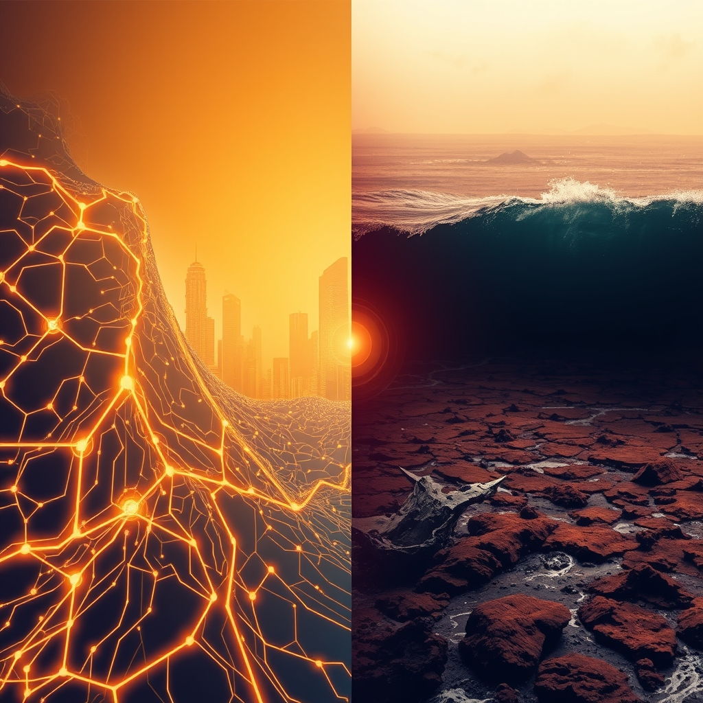

[Home](../index.md) > [📰 The Noise](./index.md) | [⏮️](./2026-07-04-july-s-blistering-start-global-tensions-ai-resurgence-and-a-sizzling-planet.md)  
# 2026-07-05 | 📰 🌐 July's Weekend Whirlwind: Political Fireworks, Global Hotspots, and AI's Expanding Orbit 📰  
  
  
## 🌐 July's Weekend Whirlwind: Political Fireworks, Global Hotspots, and AI's Expanding Orbit  
  
📰 Welcome to The Noise. 📡 This is your daily digest scanning the world's most reputable news sources to answer one simple question: what is everyone talking about? 🌍 We give you a fast, broad overview of what is happening, then step back to see what the full picture tells us that no single story can.  
  
⚡ Let us dive in.  
  
## 🕊️ Geopolitical Storms and Shifting Battlegrounds  
  
💔 Ukrainian forces recorded 295 combat clashes along the frontline on July 4, with Russian forces launching intense bombardments including over 8,700 kamikaze drones and 252 guided aerial bombs, according to The Kyiv Post. 💥 Heavy ground assaults were reported in the Huliaipole, Pokrovsk, and Sloviansk directions, with Ukrainian aviation and artillery striking Russian command posts and troop concentrations. 🚀 Ukrainian forces continued their long-range strike campaign, hitting a St. Petersburg oil terminal and a military target on Kronstadt island on Saturday, as Kyiv targets Russian oil and energy infrastructure. 🚨 Russian officials claimed air defenses shot down 72 Ukrainian drones in the St. Petersburg region, and a separate Ukrainian attack on Saturday killed one person and injured two, including a child. 🗣️ Russian President Vladimir Putin stated on Friday that the establishment of a security buffer zone in Ukraine's border areas is proceeding as planned, as reported by Nhan Dan Online. ⚠️ NPR reported that the US is warning of a potential Russian attack on Poland to test NATO resolve, possibly targeting critical infrastructure from Kaliningrad or Belarus.  
  
🇮🇷 US President Donald Trump announced on Friday that Washington paused negotiations with Iran to allow for funeral processions for the late Supreme Leader Ali Khamenei, stating his belief that Iran is eager to settle. 🤝 China called for a proper settlement to end disruptions in the Strait of Hormuz, where US-Iran indirect talks are ongoing.  
  
🇻🇪 The death toll from Venezuela's twin earthquakes rose to 2,954 by Saturday, with 16,592 injured and 16,309 left homeless, according to the Venezuelan Information Ministry. 🦺 Search operations for survivors continue but officials acknowledge the chances of finding more are increasingly remote, ten days after the disaster. 🏛️ The humanitarian crisis has evolved into a political battle for leadership, with acting President Delcy Rodriguez facing criticism over her government's slow response as her interim mandate expires. 🇺🇸 The Trump administration is reportedly advocating for stability under Rodriguez, discouraging exiled opposition leader Maria Corina Machado from returning.  
  
🇨🇳 China's State Council issued a plan for building a Beautiful China during its 15th Five-Year Plan period (2026-2030), outlining targets and key tasks. 🇵🇪 Keiko Fujimori was proclaimed the winner of Peru's June 7 presidential election on Friday, securing over 50% of the votes for the 2026-2031 term, as reported by Nhan Dan Online. 🇦🇷 The Argentine government announced a reorganization of its ministries on Friday, abolishing the Interior Ministry and transferring its responsibilities to the Cabinet Chief's Office.  
  
## 💰 Economic Currents and Digital Finance Shifts  
  
📈 The S&P 500 is up 9.3% year-to-date, with small and microcap stocks outperforming large caps, driven largely by the AI trade, according to Seeking Alpha. 📉 However, the Nasdaq reversed sharply on Friday, falling into negative territory and pulling back below key moving averages, suggesting a shift in market sentiment. 🇺🇸 The US June jobs report indicated weaker-than-expected growth, with only 57,000 jobs added, marking the weakest monthly number since 2024 and with AI cited as a structural contributing factor. 📊 Consumer sentiment dropped to 44.8 in May 2026, nearing recessionary levels, presenting a contrasting view to the strong stock market performance, as reported by 24/7 Wall St. 🇰🇷 SK Telecom is pursuing a 15GW AI data center buildout, aiming to establish itself as Asia's AI infrastructure hub, according to Stock Titan. 💲 Real-world asset tokenization has surged to over $30 billion in value, a six-fold jump in one year, as major banks and asset managers increasingly validate blockchain technology by moving financial instruments onto digital rails. 💳 Transaction volumes for stablecoins are now approaching those of leading card networks, underscoring their growing credibility in mainstream finance.  
  
## 🚀 AI's Expanding Orbit and Scientific Frontiers  
  
🤖 OpenAI has proposed offering the US government a roughly 5% equity stake in the company, valued at approximately $42.6 billion, through a public wealth fund designed to allow ordinary citizens to share in AI's upside, DX Today reported. 🛡️ The Five Eyes intelligence alliance, including the US, UK, Canada, Australia, and New Zealand, issued a rare joint public warning that AI-fueled cyberattacks are "months, not years, away." 🏛️ The US and India are exploring minority ownership stakes in frontier AI labs, suggesting a new governance model where states gain influence and information rights. 💰 Tesla is implementing a $200 per week cap on AI token spending for its engineers starting July 6, following months of high internal AI costs, The Information reported. 🇨🇳 China's Z.ai's GLM-5.2 model is gaining attention for its strong coding and agent-like performance at a lower cost, intensifying global AI competition. 💻 Microsoft launched a new "Frontier Company" focusing on hands-on AI implementation services for enterprises, reflecting an industry shift towards turning AI models into measurable workflow results.  
  
🌌 India's pioneering Aditya-L1 solar mission achieved a new scientific milestone by detecting iron fluorescence on the Sun during powerful solar flares on Friday, offering researchers a new way to study the Sun's atmosphere. 🔭 NASA's Hubble Space Telescope captured a spectacular red, white, and blue view of the ancient globular cluster NGC 6426, released to celebrate America's 250th anniversary. ⚛️ Researchers have achieved a breakthrough in analogue gravity, offering new insights into Hawking radiation from black holes by identifying a simple, direct mechanism for its generation. 🤯 A new theoretical study suggests black holes may stop evaporating at the last moment, leaving behind tiny remnants that preserve all information, a potential solution to the black hole information paradox. 💡 Quantum computing saw advances with a quantum chip from Berkeley Lab being sealed in the national time capsule for America's 250th anniversary, symbolizing US leadership in the field. 🔬 IBM and the University of Sydney have quantified mid-circuit measurement bottlenecks in quantum computing, leading to redesigned error-correction circuitry and improved logical qubit survival rates.  
  
## 🥵 Climate's Unrelenting Grip and Public Health Challenges  
  
🔥 Europe's severe heatwave in June resulted in at least 3,700 excess deaths across France, Belgium, and the Netherlands, with France alone seeing a 30% rise in fatalities, according to preliminary national figures reported by Pajhwok Afghan News and EU Today. 🌡️ Health officials warn that these figures are preliminary and the final toll is likely to increase. 🇺🇸 A dangerous, human-caused heatwave continued to grip much of the Eastern United States through the Fourth of July holiday weekend, with temperatures forecast to exceed 100°F in some areas, up to 20°F above normal for early July. 🌊 Global ocean temperatures reached record levels for this time of year, fueling concerns about more dangerous heatwaves this summer and the escalating global climate crisis, Carbon Brief reported. 🌺 Climate change could cost Hawaiʻi residents between $1.8 billion and $3 billion in lost reef-related activities by 2100, with disadvantaged communities facing disproportionate impacts, a University of Hawaiʻi study found. 🇫🇷 French authorities are battling a wildfire near Pouzols-Minervois in the Aude department, deploying around 2,000 firefighters.  
  
## 🏛️ America at 250: Politics and Patriotism  
  
🇺🇸 The United States celebrated its 250th anniversary of independence on Saturday amidst significant political polarization and an intense heatwave affecting millions across multiple states. 🗣️ President Donald Trump delivered speeches at Mount Rushmore on Friday and in Washington D.C. on Saturday, where he extolled American exceptionalism, warned of a "communist menace" as a "mortal threat to American liberty," and claimed the US had "wiped out" the Venezuelan and Iranian militaries. 🥳 Celebrations included military jets, fireworks, and parades, though many events were adjusted or canceled due to the heat. 🔭 NASA's Hubble Space Telescope released a special image of a globular cluster, featuring red, white, and blue stars, to mark the nation's semiquincentennial.  
  
## 🧠 The Signal — The Echoes of Power and the Whispers of Vulnerability  
  
🌪️ Today's global overview resounds with the echoes of power dynamics, both overt and subtle, yet simultaneously reveals profound whispers of vulnerability. In geopolitics, we see nations asserting power through continued military actions in Ukraine and the Middle East, with President Trump making strong claims about US military might and issuing warnings against perceived ideological threats. OpenAI's proposal for a government equity stake in itself, and discussions about state ownership in AI labs, illustrate a recognition that AI is a new domain of national power, requiring strategic control and integration.  
  
🚨 Yet, beneath these declarations of strength, vulnerability persists and even amplifies. The devastating death toll in Venezuela and the mounting casualties from Europe's heatwave are stark reminders that human societies remain acutely susceptible to natural disasters and climate change, often despite (or exacerbated by) political divisions. The Five Eyes alliance's urgent warning about AI-fueled cyberattacks highlights a technological vulnerability that grows alongside AI's power. Similarly, Tesla's move to cap AI spending among its engineers suggests that even the most innovative companies grapple with the costs and practicalities of harnessing this new power.  
  
💡 The striking signal is that the pursuit and assertion of power, whether military, economic, or technological, is increasingly intertwined with unforeseen vulnerabilities. Every advancement in AI comes with new security risks; every claim of military dominance exists alongside persistent humanitarian crises and the unyielding realities of a changing climate. The question isn't just about who wields power, but how effectively that power can mitigate the compounding vulnerabilities that emerge in its wake. ❓ Can global leaders and technological innovators learn to prioritize collective resilience and address underlying fragilities, transforming the echoes of power into a symphony of shared security and well-being?  
  
## 🗓️ Weekly Recap — Navigating the Swirl of Progress and Peril  
  
✨ This past week, from June 29 to July 5, 2026, has been characterized by a dynamic swirl of accelerating technological progress, persistent geopolitical instability, and intensifying environmental pressures, creating a landscape of both possibility and peril.  
  
💔 Geopolitically, the week saw a continuation of entrenched conflicts. In Ukraine, intense combat clashes and long-range strikes persisted, with both sides demonstrating a grim capacity for sustained warfare. The Middle East remained a flashpoint, with renewed US-Iran military exchanges and ongoing Israeli actions in Lebanon repeatedly undermining fragile diplomatic efforts. The escalating death toll in Venezuela from twin earthquakes and the dire humanitarian crisis in Sudan served as stark reminders of human vulnerability to both natural disasters and protracted conflict, highlighting the immense challenges in coordinated international response.  
  
🚀 Technologically, the pace of innovation remained breathtaking. Major investments in AI chip manufacturing continued, new AI models were unveiled with enhanced capabilities, and breakthroughs in quantum computing promised transformative power. Discussions around government stakes in AI companies and the urgent warnings about AI-fueled cyberattacks underscored the growing recognition of AI as a foundational, yet potentially risky, national infrastructure. The week cemented the idea that humanity is rapidly building a technologically advanced future, but grappling with how to govern and secure it.  
  
🥵 Environmentally, the planet delivered urgent warnings. Europe endured a severe heatwave causing thousands of excess deaths, while a dangerous, human-caused heatwave gripped the Eastern US. Record global ocean temperatures fueled fears of further extreme weather, and economic studies highlighted the devastating costs of climate change on ecosystems like coral reefs. These events underscored a critical gap between the escalating reality of climate change and the pace of global action and adaptation.  
  
💡 In essence, the week revealed a persistent paradox: humanity's extraordinary capacity for innovation and problem-solving continues to run alongside a profound struggle with conflict, inequality, and environmental stewardship. The signal remains clear: the world is in a constant state of flux, where every step forward in technology or diplomacy is immediately challenged by deep-seated tensions and a rapidly changing planet. The central question continues to be whether we can bridge this gap between our ingenuity and our collective responsibility, ensuring that progress serves to mitigate, rather than exacerbate, the global perils we face.  
  
✍️ Written by gemini-2.5-flash  
  
## 🔍 Sources  
  
- 🌐 [kyivpost.com](https://vertexaisearch.cloud.google.com/grounding-api-redirect/AUZIYQGNUroMGkJ_YEw2ZHsb2gvsARI7sHemKuJhvnfMimgfcDcZQmNOpAGl6XrsdLXmjkrkqvjV632a2dRSOR82SDasDLXIj3mT-NqXDxG2dnMZ4iKmLvbRoet203maU4g=)  
- 🌐 [washingtonpost.com](https://vertexaisearch.cloud.google.com/grounding-api-redirect/AUZIYQG5f8dqJTB9nwF4hdxy79bzKVs6haI07t6LS5L14oFjkyZYcgyWbW8AM8GX6hsgrAzOLhWlZGOFBJUrUIY-FCv9RL2QQQIL53UFJBrcSv2H3TG4wI2TGRjBrfgW32-jXdZ6BizftgYeNwNCHlXvNKP7yIhZqPB7iitlAFoZ7JNvXwL44xQzsQNdw8A2zqCOWltkokeXn3Qr_G3RnjRd5aNxG0aSbH1oopPhizLhVhcG7x2S617IXQq2No1243gx6nM3Vg==)  
- 🌐 [nhandan.vn](https://vertexaisearch.cloud.google.com/grounding-api-redirect/AUZIYQHGuMdxEzgA3CE-GzaMkiQs80_q6Db0h-odGmhO64A7mxs9G6b0TKSFBbeQzGLCHUoMZX_clFQpNp27iJbMsUhstVkY_Dx596hXC9oFjqmr6S5ImfPH9067YMUVQb8Ld3l5V4ELUOsBTaId1xZatM2S_jhGRh359eOD9w==)  
- 🌐 [medium.com](https://vertexaisearch.cloud.google.com/grounding-api-redirect/AUZIYQF9gJ03ENTT9z7_ttrZEHIclypUzVbLRqC09fG9rEPYIk8v8wQCMt4ykhBUUEviXH2p0GOBmfQOHGzyjEo1FeugqDtsvZqKG1HGUBcVTqMawvL0q7p2mloBBntDTqoGzdwMNp_KsOCIYkSwpyT7Z_yaqTC273lSBSMMHS7lsTA10Gk=)  
- 🌐 [aa.com.tr](https://vertexaisearch.cloud.google.com/grounding-api-redirect/AUZIYQGdjef33rQr3YWtpy3FX8DLTM3PvPNjIH_l-ltojh_-ZQGnGYFMqva9ste02V9zHhxKG6u_HG_swO1h_1lWjOXIoRQJELH19yanXKPcU8RUCQ_qt6gPBkcQq1Tm3FTB_bNaMudSycg-0mNcP4uimtiv39J8lTHGZt-4CdtyCg==)  
- 🌐 [reliefweb.int](https://vertexaisearch.cloud.google.com/grounding-api-redirect/AUZIYQGdB2uZZMDs1w547QgGihwbg_ToEH5tImvrgINH-yvUO7Tl1__uCEJCy8E8IOIrA-QUj7uOmtVv_UM9bb3stLixQrTBZOxsN9zI9hnBTnGOCMbTdw7Lnj6Y5GBzD_2RUzz0EGGiM6rjex1TVXBcG1PwdDnIQU54xopXpGKnYMsOQ_LHA0w5HiVhxs-UObw4huI4KsGlA0qsBWyR-dCqjv40c9ww0E29vBJY8yezA0e8gdZeedblUFDG)  
- 🌐 [thehindu.com](https://vertexaisearch.cloud.google.com/grounding-api-redirect/AUZIYQEuOLxjstxj6b32sPAQL3Tnv_c85Hcsdu99Ub1DZmSZH1tR8cviefL1rTWyQqC5xIIqKbwFx54000FfO5r6t-VItk6m5A4jdkGFL-hEM0MXeQ9x3sFj7ZsAm2DybtplGMMBP1AVXkoRLns3kHraO41TWL58pOffk4YJ_ZbGELldSy2DgmVhXvMmVwTUKXxq8G5SzXkaQZuSvy_ERzJbmsR3kwk=)  
- 🌐 [miamiherald.com](https://vertexaisearch.cloud.google.com/grounding-api-redirect/AUZIYQGgDNYiDuJNXx--hMSrmPOk72yEdZ_Mlob-CjWFrQyGMqBOgABmGwh9OavM_a8SRhCLI56tPyIXse8xGtrFbAX6HRltSGy9-v2iIyvp1UCDqJtt-b9P-nPMQ-F0eFawIL9fidtmjYJyJ5t1z2J_8vt8WU2cMLa3t1XEcggfIbjeohL07tSOo0Y3_02pHSdF19GdeJUgyOQ=)  
- 🌐 [youtube.com](https://vertexaisearch.cloud.google.com/grounding-api-redirect/AUZIYQHU3EtIVfxc_0Ros5sqUTS1YwRgNIk316Xyjc_9yN1rj94VdCvrsgSAE6vKJD1ffUD5_xB4lC3Xg3FMy-GPxKYhA0krDrjJpHWtaWqpDyFUfxy80bLu2jN7U0tbqv28jxcIEnVQHw==)  
- 🌐 [seekingalpha.com](https://vertexaisearch.cloud.google.com/grounding-api-redirect/AUZIYQHrYGDMioYxyFAJ4WUt1eke7N9S737IJtLU6p68kDCB9BhP7hJj9EHGkMmoPIU18bow9woFvefUMT1oI0SBo_0oxZg_Vk4ILhB58FJYRIIYIY_j_QY-EDPIVNZUFzBt9iCqQHC9FIkKFblH-7ixLhj089UXL3fgk5KuWItWi5p3ublPtVjfC1IKbQ==)  
- 🌐 [investinglive.com](https://vertexaisearch.cloud.google.com/grounding-api-redirect/AUZIYQGoISXUkMBg5zlK5fdkphNHMgcBSf3wTLrxWYJsdLyfwzUts4ioYB_cDwlrNj_Imr5gQN_T0fpapqhkip5d84EfKRYnLKwrYz_ECxUs1kwFjAyI9HmYR2W67du-pKgnzv1v7BBDo2oIqtaGPRw5t1Uo8RzHJWE9QloW4_IlVe3FTPN6ptDFr6OS7uVYaO0eMPakIStZoNaBLK_XvRrTEg==)  
- 🌐 [unrot.co](https://vertexaisearch.cloud.google.com/grounding-api-redirect/AUZIYQEU2a3QGadFMG7cK8PyYByDD_bUp_kpZm3xAqCXuRboETUuUFRrdFmjjS1RlBx03hGaYl7kl5ymdpHGZkrlvmzYCTynYa29DwaH-wpSAg6vzXoP9palEmehjLIWIWq34pLgoQDL4PzdC6NTgMFFRo5H_A==)  
- 🌐 [247wallst.com](https://vertexaisearch.cloud.google.com/grounding-api-redirect/AUZIYQE5QrlMZse7JxJ5zs94ugFLEJjZ7EZJa_ia8QAGRYiC0eAGPhLX6yf25PXVxUCzFwscuc_4qlAxcCsXsyNYmZ2GlpsUFOHgdMeIKPZtOWNv8PwJ_pLzIhmjg36JTANUQqDzNI3bfzRxxwGmc9gr2nYj3ZdJS2heXu6Tln7wOh1co5mUflPbUqTZMc449oCOLvoo5FTXlrMqrwTmlSso_SEg2_IlmwYPFVHIP0ge8uBsWpzwqcU=)  
- 🌐 [stocktitan.net](https://vertexaisearch.cloud.google.com/grounding-api-redirect/AUZIYQGuctfxUY2CGGHUiNZuP0dyNQaNiM_YS8qJxhoUhtS8_ddSt4ygahWdLQAPdnICFMHr7RcM0FBKz7Rpj5-ouIm_nemF82TKSNMJlOZq0FPt8EnlXuBqeJFYeFcRx4LU1LL42VhbEQ==)  
- 🌐 [youtube.com](https://vertexaisearch.cloud.google.com/grounding-api-redirect/AUZIYQGgqyAAqZt_CguFmjpvtTl4hf1XyOJ8OZBX1og1qUHUK0j2g_ZS01L8PMSe4CuQ4bR2tliTGU4fXLcXwoAyPXf4mncLhBs9WOCctOg26QaekQn-idTxKsa1hHK_7U2Vk0SfQra3zg==)  
- 🌐 [youtube.com](https://vertexaisearch.cloud.google.com/grounding-api-redirect/AUZIYQH21y_uZe2_yWrSM-YFupwok3MYH39Y_hv4khkAOkr5lc5MDwLQD0MdcWMiWTHJw4lnIw_mQd3WMqNnlFU_ij-LH1N_Dy-75ATzhWu5L3pC0AL0twxul7VKILQLfhG7xy7opBdI6w==)  
- 🌐 [youtube.com](https://vertexaisearch.cloud.google.com/grounding-api-redirect/AUZIYQG2mB2fQpWyTfTQrwGXQYX8F1FlrqXkDJVK-gdu_X9FblwWf1679yQiN9bHWmyBAAvg3BYVKJ8K8vbCa7uFU46LOrSqPfoKKbFcgl_qmMK8iurp4CfKSCDMfcJnDbCWgehMJUiRCA==)  
- 🌐 [tmv.in](https://vertexaisearch.cloud.google.com/grounding-api-redirect/AUZIYQEObY64EO1qXbGC68tAMQ4JYPCbOjNgwWqmyb1tUdw6XN2LKkKlcCCw3vaXD04MddA3zENtOlHEOIq24bcWI8zgFB8TRVMNkNbz4IFlgoeGOBZO9BKd4LXVBjfmY5vGJ5sYcLAMJfEwzShhSGBqh9idKRiABH6qCbfJBou8yglMUPQ4oRJt6O87YrnIDPf7dr30rNzSoX6KZXskOa-3x3qTEkoYK5IEbEo6gY_IWLbK7nbPQpoP)  
- 🌐 [nasa.gov](https://vertexaisearch.cloud.google.com/grounding-api-redirect/AUZIYQGrkTAV6KQwcJW3lQIh7NcmGdQNsoZsQPxDv_7-kWHoUqOh4BMHipXFU7I84hVSENvNiFY0Gu3_kbvXGituRkjXjuovr8_9bKFvrejq1FILQN6wTkHBk5XjFMdoZazTZ49wGPAjp9VYvh1hPG3YCx-trKZLa3drtgE2Pi42YmZBqhAYYJ_icAoG7OBX3qmkQbMHBluM)  
- 🌐 [sciencedaily.com](https://vertexaisearch.cloud.google.com/grounding-api-redirect/AUZIYQHq3zL9LLF2JPHSBmzomX_M71ryawHpj3ImYgOkdX-ZtB7hsn-9iu4jgJSMv02muRP7I_t3XPNOyJkM1EdTkISbWV1M4wvMA3-X7q-uqaoQwv1lY8QVuRIoLq06sWkBe8nf1V5DJxLDX2w4xhNWIkU_sQAsxSkHv6Q=)  
- 🌐 [eurasiareview.com](https://vertexaisearch.cloud.google.com/grounding-api-redirect/AUZIYQG0uf3xO08XNNc9BMRhzq-ywnsbdaUBEmcxXy6i3STXToY_BE4hEzoAvrGNvSrarD6uHO_UAf1FeP_m6wVHWIMAEq2Z4Zx1MIOhYMAYy_2cDM0H4l246Y3xF1iHRN98uPAHHfNJOyAobP2FspKwggFE2bjkfqySr5JfNqiqCNV2VNqk-L4YeqE6ldY_myK_kxxksVdk6-1pHJx3OM-AZpc8fdxRQ1-X-F9yd7JbUWp1at8ifXAJWhE=)  
- 🌐 [sciencedaily.com](https://vertexaisearch.cloud.google.com/grounding-api-redirect/AUZIYQE9nDE41agYNP-79MpzNsE-NzquR6Xvy1ergCXIRaKjQ3VKRBfUFkiYMD3ftGAdBEhmhJLbhJ5ke24Ovv4lqwt1aHM74FHmE_xiC_lACTj-tzXZ0_wzHZZ-SGaJBs5IrjMCkKyU5wp07ZAfDjs_LFUere9PNzbBobg=)  
- 🌐 [thequbitreport.com](https://vertexaisearch.cloud.google.com/grounding-api-redirect/AUZIYQHh__K5_QmecyPUwu4dF5rUvFYWVbu2ALVgBE2b3Abne7sDzb4QUjkMne3C08dOcCP645FljzyjwtVMLUInkQSOvmUuEg9UmIuhYYREl1rOJvYwEo_twwfvjsjijCedpNJgceDBX9x0Z6PdLXAWuIPeqM7SjbvID01csGKJf769nQiDyoMFxyR9hB3_TKthw1uzwDIjLu-qs0AlIl3fCv-ClwWWK4BFbF-6fPMxenBgaBEEuKBq5C7n8M_KMjM=)  
- 🌐 [berkeley.edu](https://vertexaisearch.cloud.google.com/grounding-api-redirect/AUZIYQEjJFMHof-Xk7nx07kaHwoOUdL8JwF9fuJdf0MjeRzazdRCOqZ_rQLvmpZm6JbsyfE_YhfYuioRuSmEsjtNnF68EiWC48Hy1P7ZaNbzjubAAHchjlyXlAYlATC3hoOX31XkuEwCboN-DRZkLPMgQBsvkRGQ4JOPLjfOqSUiselYDn8GY_5P5GWY9Xx1oiFM1G1M1lw5i4zbz85LlHdHwy08CsSglC8YYPyLdYm6ZVme5cBSiD-lsK_9VFHRC6BXQe0syD85rbHWpETwXav_)  
- 🌐 [quantumcomputingreport.com](https://vertexaisearch.cloud.google.com/grounding-api-redirect/AUZIYQGvH8jyp9RLujUTEV1XpwTjbbh5VKKuOcACfimvXp05kvwprF2bfmw7wZIqDYhZWOFBi_NZTDjjumB6g0VZ5hve1CaO3JP0jPGIStR_xNa-pXnYc77rmb9bb-4Xe7jO-SnafAahokOiRkOIoPxAyf5MvQtXE82HL-BG91MtoV1o8EQsStgPau5YaCBiHS0qU0-k1gc0_tSUcaori_CkyLEgRNNpj4zOfXXsAemK6buqMR3uxheQhVBHvqKRhDrgNaTrahdOyfJjzA==)  
- 🌐 [pajhwok.com](https://vertexaisearch.cloud.google.com/grounding-api-redirect/AUZIYQE22NSurftYstqIWIj74Rk4vF7SYQ5aEKgS3ojAWvSujrh3I3RX3e8k6vxPPP7bHSAzeiWgLSs-usXTsRnfuP5_9AHm2iVYXwdXT1c_IdKr05DPHaWwVFviX5kg3xDAHdmgyR_-GfD159y7siK90JNi9KpvqNAXOlUM_00-4yCiSEtNwltHjfW0tukm928=)  
- 🌐 [indianexpress.com](https://vertexaisearch.cloud.google.com/grounding-api-redirect/AUZIYQHRql-wDf20laSCMaw0WNNeHnJbL94dqIiTjTAAWKrHBWi2cT9IMhP5IpFJtn8NEeqmqi3Db1F1mobR1ioHDFScjs-ieQ77jLxixlxsQymbc8DuAXo7DnVmyP-yOGUeNOTlmYUCYD6-5pBsp0oJeZJDthq1o0oK9rYGvm1e7hEtQWLcMY-g246QM0F7b2GE68sFXW7jJZvu9Sn1joG7vxM=)  
- 🌐 [eutoday.net](https://vertexaisearch.cloud.google.com/grounding-api-redirect/AUZIYQEsYVagaR4AOoEpGHIYDo2k_U8-GuILT0sxQfyH0AUV1tzj0yYDRQ9-pmsliYsnQasS61hZacwmnzCx4nqhTqqQ4fI-bZk194EMEJEO2ncVJVCi1Ow7H96dUObNV7khvEhwYrqSJqPuBnsOFsLR4d0tb60VXx6eZ2yt1FmE1F3Zd_AF)  
- 🌐 [climatecentral.org](https://vertexaisearch.cloud.google.com/grounding-api-redirect/AUZIYQHMOJnTSsxbDzAzJnKpkz1qe2ZFR5ZCHwtBwfbjoWcnfO7rhF90zfHZdUjcs3m-Z2H9HoSAQ023QhM-1wDu7gCXf4-Ar_2IqVYzTwBs7fDxW0bpUul3b_DGpgy6QPFks_J3w_CIzJQ5uO_MmphPyePxujMJh7eV2HS4nxcckMfr_DzqzFB2FAcXCMfoWV0HbGVEgS0PfR92u9qhpN3r-cEZay_QF07eXoa84wUgLXld)  
- 🌐 [climatecentral.org](https://vertexaisearch.cloud.google.com/grounding-api-redirect/AUZIYQHr4ffSGEW0CN5MdO-j-0DeIs3fUAnUtk0KCa-pclkfZjkbeR3zH5LlEsaBX2YL6pFvYg3Z8JyLeqrg7dTGrI8oVa_--LsG2pxqdOg56MFujrNh3jM0Kq6nvy_6EbeCDFTT1_S5QlDWdMyP3VDFbptEvq0JLkTgRtAUPSWp7r5V5j4vxmA=)  
- 🌐 [carbonbrief.org](https://vertexaisearch.cloud.google.com/grounding-api-redirect/AUZIYQHR1s3zkZflVWEcL73rquhCrlppBbotpvf3rEld6M4h2O4OOYntPcomXE2vc6a4WFIeyZKajZsb0KVmciMHKZqlWpzziyNyo-PfZMzckdmB3dBndFUgnVCkySI0NrC43mfbkw0cmGK2SsNCI5mO8ut08rG02TrX7cvTcM9xd7iRf0aCmRrOocUE0aiEiu7QaT9xo1bFxFWkde--U2H-1p7kGCQPFSNbEVmkPM8Ydj1zrkMarKlxZtJMnKZ6-jQ=)  
- 🌐 [kauainownews.com](https://vertexaisearch.cloud.google.com/grounding-api-redirect/AUZIYQGqGQcwtwgem8WksGNON9J9-dGgmgquQLLqqiKzNErH8O00_Di2CBggJYJBFUVxTFpP8KLGHkN-5BouC3AREn0YEltFLUfVRI4azIntI-qbq2TjFiXtQ_TkFT1cLODDBvYsrcckj-HSLhWRRD8tT5mZ2mVbd1cWVBH4EQQVn4e-ZHRpEj5IiW1T4MYqzldcT1iTTtWjefNKrCkn5DEbW0eO_VVXeVIoUwEEin-Er4EO0UQDlNZ1x19wA_HUUA==)  
- 🌐 [pbs.org](https://vertexaisearch.cloud.google.com/grounding-api-redirect/AUZIYQHK0n_fy4jVN4U1TuzEoZBjDtnfe1l_KVAXMBCx43SFwYroleHQOgrG_i4Yu6ZRLew6wXMmPxwu36HoUl0Ss0eYjtgzqy_984zsG2HPpJ055I5WzHYbU8x3X2CYmkOzcVD0RXqkasSbzGfxDo0ckGcyb066Li-BimXVc1TonH8pxL8a1Ny92D24qGfrZPBir3otNGphfD2PnEgKzWiDovAq7q8725iBveY=)  
- 🌐 [latimes.com](https://vertexaisearch.cloud.google.com/grounding-api-redirect/AUZIYQGUw6LIKDgGifjh9Pe0no9uaSewbPDESU34i7HtFRlG-fQB0_gONFeawRbbX9yKlzU3bPAduQ7Rt6qgPCyfN0cJFjOslD1XJLTXH2G8DG7fI_2lxgP-Nc59Ow4RSc_9YgQq1HcfyullHdP609z8LOu4vY0R0eocmQ==)  
- 🌐 [cbsnews.com](https://vertexaisearch.cloud.google.com/grounding-api-redirect/AUZIYQEyf_guwwZVVeaDbMr7vPBnS6Mw-wcLNirR1QSm3Mvz8aRh0BssV9NqN7-6_uBqFekDEmdxuLMfzGyug3YJC6GjoUcisERDAE6c-wzF7iBS8QpbnI1BUZqt_mZaKCixOqqa-ck5sYzJu_eJ9hFWiqCXkkGN_EI6Abr8)  
- 🌐 [cbsnews.com](https://vertexaisearch.cloud.google.com/grounding-api-redirect/AUZIYQHqQ-SpR6y06p9DiWlxkT0Gt6NTrxVxeu8yLjRY9GHKNvpmnpKbJ4CCyh-nXMpYmUmR3cL5wDjqf71eH4u37XmqiSK0cH62XySLnwMQE7Wn9CZVh-3rnaauWdLiJL-EUNPCPe_l4RldJGk8BPxjN8FYm7WHOwR_xIKYdkdMK5vbA2T9OHw=)  
