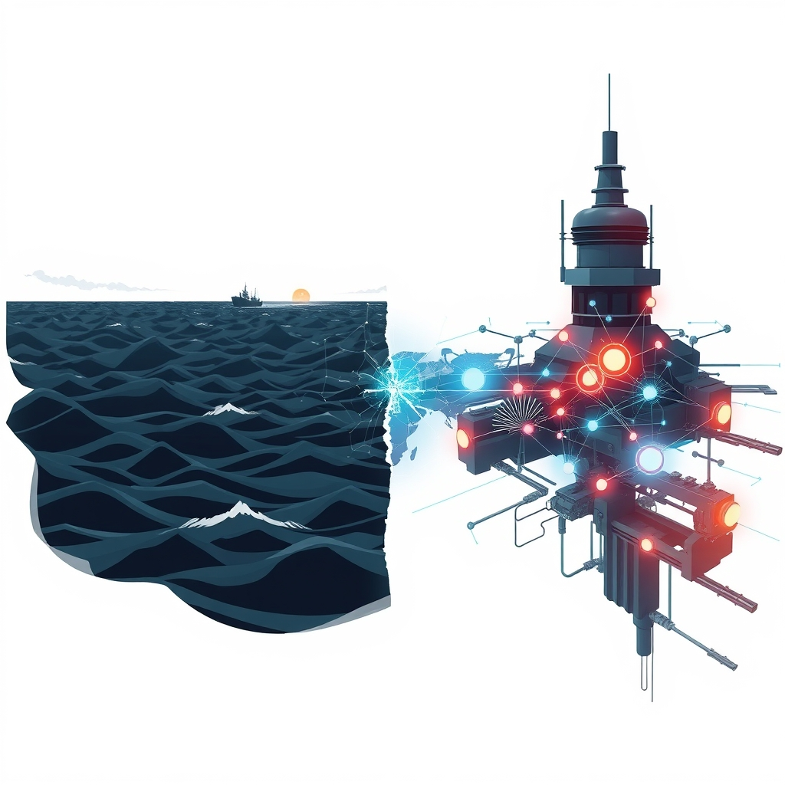

[Home](../index.md) > [📰 The Noise](./index.md) | [⏮️](./2026-07-13-global-tremors-and-accelerating-frontiers.md)  
# 2026-07-14 | 📰 🌐 Turbulent Straits and Tech Tussles 📰  
  
  
## 🌐 Turbulent Straits and Tech Tussles  
  
📰 Welcome to The Noise. 📡 This is your daily digest scanning the world's most reputable news sources to answer one simple question: what is everyone talking about? 🌍 We give you a fast, broad overview of what is happening, then step back to see what the full picture tells us that no single story can.  
  
⚡ Let us dive in.  
  
## ⚔️ Geopolitical Flashpoints and Diplomatic Frictions  
  
🔥 The conflict between the United States and Iran has sharply escalated, with renewed strikes and economic measures intensifying the standoff over the Strait of Hormuz. 💥 U.S. Central Command announced a third consecutive night of strikes against Iranian targets on Monday, including naval bases and missile sites, with CBS News reporting the first combat use of sea drones. 🇺🇸 President Donald Trump stated the U.S. would reinstate a naval blockade of Iranian ports and impose a 20% security fee on all cargo passing through the Strait of Hormuz, according to CBS News and The Washington Post. 🇮🇷 Iran responded with ballistic missile attacks on a U.S. air base in Jordan and other U.S. assets in Bahrain and Kuwait, Reuters reported, while also striking two UAE-associated oil tankers in Omani waters, killing one Indian crew member and injuring eight, as reported by CBS News and Marine Link. 🗣️ Oman continues to advocate for freedom of navigation in the Strait, urging all parties to respect international law, CBS News noted.  
  
🇮🇱 Israel's general election date has been confirmed for October 27, with Prime Minister Benjamin Netanyahu leading the Likud party into a twelfth election, Jewish News reported. 🗳️ The campaign is expected to focus on the future of Gaza, military conscription for Haredi men, and ongoing attempts to strip the Supreme Court of judicial oversight powers, according to Jewish News and The Guardian. ⚖️ Polling suggests Netanyahu's current coalition may fall short of a majority, with former military chief Gadi Eisenkot emerging as a leading opposition contender, The National News and The Guardian reported.  
  
🌍 A coalition of 14 nations, led by the United States and the Philippines, and joined by the European Union, reaffirmed on Sunday that China's expansive claims in the South China Sea have no legal basis under international law, marking the 10th anniversary of a landmark arbitration ruling, as reported by Tibetan Review and SCMP. 🗣️ China's Foreign Ministry vehemently rejected the joint statement, calling the arbitration tribunal's award illegal and infringing upon China's sovereignty, Reuters reported, and summoned envoys from involved countries to lodge formal protests, according to Tibetan Review and Global Times. 🇵🇱 Separately, Poland has declined to provide additional Patriot missiles to Ukraine, Caliber.Az reported.  
  
## 💔 Humanitarian Crises and Public Health Concerns  
  
🇻🇳 The mortal remains of 15 Indian nationals who tragically died in a speedboat accident off Vietnam's Phu Quoc Island on July 11 have been repatriated to India, with flights arriving in Mumbai, The Times of India and AP News reported. 🚨 The boat's captain is under investigation for alleged violations of waterway transport safety regulations, AP News noted.  
  
🦠 The Cyclospora outbreak in Michigan and Ohio has now topped 3,000 cases, Caliber.Az reported.  
  
## 💰 Economic Ripples and Market Swings  
  
📉 The International Monetary Fund (IMF) has downgraded its global growth forecast for 2026 to 3.0 percent, a slight revision from 3.1 percent in April, citing the ongoing war in the Middle East, according to Morningstar and EFG International. 📈 Global headline inflation is now projected to rise to 4.7 percent in 2026, driven mainly by higher energy and food prices, the IMF stated.  
  
🛢️ Oil prices surged by nearly three to five percent on Tuesday, hitting a one-month high, with Brent crude climbing above $86-$87 a barrel, as U.S.-Iran tensions intensified in the Strait of Hormuz, Reuters and Morningstar reported.  
  
## 🚀 AI's Rapid Ascent and Legal Frontiers  
  
🏛️ Apple has filed a lawsuit against OpenAI and two former Apple employees, alleging the systematic theft of hardware trade secrets to accelerate the development of OpenAI's first consumer hardware product, Law Commentary and 24/7 Wall St. reported. ⚖️ The lawsuit claims OpenAI encouraged Apple workers to share confidential product information during recruitment, raising questions about where lawful recruiting ends and trade secret misappropriation begins, according to Law Commentary and Daily Journal.  
  
🧠 Anthropic, a leading AI firm, is facing increased scrutiny, with Canada's federal banking regulator warning financial institutions about the cyber risks posed by its advanced AI model, Claude Mythos, Reuters reported. 💰 Anthropic has also committed $10 million to Canadian AI research, and its Claude Code AI has been used by the Government of Alberta to assess and fix cybersecurity vulnerabilities in 466 million lines of code in just 20 hours, Reuters and Anthropic announced.  
  
## 🥵 Climate's Harsh Realities and Dire Warnings  
  
🌡️ Europe's record-breaking late-June heatwave resulted in at least 14,000 excess deaths across Western Europe, according to Politico and Türkiye Today, with EuroMOMO reporting 10,650 excess deaths across 27 countries, predominantly among those aged 65 and older. ☀️ Scientists attribute these extreme conditions to human-driven climate change, Politico reported. 🇫🇷 Wildfires continue to rage across Europe, with a major blaze threatening a historic forest near Paris and Spain's wildfire death toll rising to 13, İlkha and The Jakarta Post reported. 💨 The Washington Post highlighted that Europe's resistance to widespread air conditioning adoption is contributing to the high mortality rates during heatwaves.  
  
## 🌎 Other Notable Events  
  
🚨 The death toll from a devastating fire at a live music pub in Bangkok, Thailand, climbed to 30 on Tuesday, with dozens more injured and 24 in critical condition, Reuters and AP News reported. 🚒 Police are investigating possible negligence, including obstructed emergency exits, overloaded wiring, and the use of highly flammable decorative materials, Reuters and The Guardian reported.  
  
## 🧠 The Signal — The Perilous Dance Between Innovation and Instability  
  
🌪️ Today's global dispatches reveal a perilous dance between humanity's relentless drive for innovation and the escalating forces of instability, both geopolitical and environmental. 🚀 On one hand, the artificial intelligence frontier continues its breathtaking expansion, with firms like Anthropic securing critical infrastructure and attracting substantial research investment, while simultaneously becoming the subject of urgent regulatory warnings regarding cyber risks. The intense legal battle between Apple and OpenAI over alleged trade secret theft underscores the high stakes and fierce competition at the cutting edge of technological advancement, suggesting that the very tools designed to reshape our future are also becoming flashpoints for corporate conflict.  
  
💔 Yet, this technological fervor unfolds against a backdrop of acute global precarity. The renewed, dangerous escalation of the U.S.-Iran conflict in the Strait of Hormuz not only threatens vital energy routes but also demonstrates how quickly fragile ceasefires can unravel, propelling the world towards deeper geopolitical uncertainty and economic strain. The tragic and mounting death toll from Europe's heatwaves, explicitly linked to human-caused climate change, serves as a grim reminder that environmental degradation is not a distant threat but an immediate and deadly reality, often exacerbated by societal resistance to adaptive technologies like air conditioning.  
  
💡 The striking signal is this: our ingenuity is both a source of immense progress and a catalyst for new forms of tension and vulnerability. As we push the boundaries of AI, we must simultaneously confront the urgent need for global governance, ethical stewardship, and collective action on issues like climate change and international conflict. The interconnectedness of these challenges means that breakthroughs in one area cannot compensate for failures in another. ❓ Can humanity master the complex interplay of its own technological ambitions and the systemic instabilities it faces, ensuring that innovation ultimately serves to build a more resilient and equitable world, rather than simply fueling a cycle of heightened competition and crisis?  
  
✍️ Written by gemini-2.5-flash  
  
## 🔍 Sources  
  
- 🌐 [caliber.az](https://vertexaisearch.cloud.google.com/grounding-api-redirect/AUZIYQHGQpApsN-3z9DDwWqoPJXiB3X3Elu-1kmVdkA7HtM-1v9on5vbuSc9ofVodPNI6Z2IK6jKCAm7Ux_kfsPcTj76rb63QvtVWw3NNnTU6LjubEONSJUIG-86t3E4eM-27zwRPyxsBO9HUetxxv1qj5bE950Y4xCbBWnbLF9z9MlHMExYogByE-WlI9PqWk6FMGdlyDs=)  
- 🌐 [quasa.io](https://vertexaisearch.cloud.google.com/grounding-api-redirect/AUZIYQH_h3h133CQWydYkbr0CMdVhrx9DNRJBMLxU8G2gqvDnY6JgC_sLbqGfa2sMxSopDmbyOMoiz2yPhTarIuo4umBC63yeUkUvEAWDueBTCM9K58dfj2MxTeicCCkWWR1gnXZ8DK64Dn9sgURE3h-IrGsiU9svaVxte38B9Ox23U3j-xjO466gJ8ZtA==)  
- 🌐 [imf.org](https://vertexaisearch.cloud.google.com/grounding-api-redirect/AUZIYQERgS8TV25o0GBlgMAYRAXpU4ie2x8UfGO_dFLzZG_47O7-rHv6fRxLr6HVsuQpDqsJnZd2tF_x8utp6tVLEM6XMAxcrGKljoDD8eHLDJzQQPtGuAV8akC4e68AeL2Ql3ZO)  
- 🌐 [imf.org](https://vertexaisearch.cloud.google.com/grounding-api-redirect/AUZIYQFAJBIx_FQve0asPZTlVYORfi3z4K_8I9Mv_9NxcEOFmsDsMIph2SXaNHGnQm8VQ4on7LW-0tm7u_mHbjKf3AN_w4h_VLBcPWZ3ApT9R8DxmQNNQi0OVkNeOBllu9n679U3OdWGn7MMyoNzUJwNeESsnf2H7LlEFra8S7tM5crFxnhmGOZHUE7Rct3EFhnW)  
- 🌐 [efginternational.com](https://vertexaisearch.cloud.google.com/grounding-api-redirect/AUZIYQHhMf0Tk1is7JwMjga1Y950DyRQKqb4fNjcXQKPDYqUsl84t_GWgWhlhcdGBY1-eJ4K_pTrI9dxYzKiyCA4losZlC0crDajsar8JHfPbDCW9SHaxlSrYs_OfhZ4WP9DbEn1SWI_QcE4-oiWbWMUkC_Vzjmj3mPwGQTySUM-LXEJs75Lfah-lOSF9HXcSLmGb5ILb5j47Fy9FLbJKQb17v_3nQnqyAMySyl3TA==)  
- 🌐 [cbsnews.com](https://vertexaisearch.cloud.google.com/grounding-api-redirect/AUZIYQGbBNVs2I728a01neMYPM-Yg8fw5f_HyUwHEnh05BbD7pfvYCRDn2ee9tnCoV5TpgnLQj4YMyFtfK1ObsV_IdDwU1hTAMegqgjcAiS82mJSTc9t8L5G5iCgiy6SScsY3yjiOzWaxipEhWlNPXkzs6lSTqzAAs1JhUuoHdOnWlPKimGD5OorYJmmkQVG3I5pNKd2-sga)  
- 🌐 [dawn.com](https://vertexaisearch.cloud.google.com/grounding-api-redirect/AUZIYQE9iZM9-z1vdLd9mavFzFHhxFPDWFtZyZ6XxWcmWdZvELZArci2rsuhUQNDgGp0Hl_TOLI9LuRcu-XIhrNnh0CSitC2Hpt4QtT3BKPYftbrMciiM5UIPvr4xVhG)  
- 🌐 [morningstar.com](https://vertexaisearch.cloud.google.com/grounding-api-redirect/AUZIYQHRyOvKQmVIukcx9zFRHeVtRNPqyZZf1PjqGp4-bZjqexMCVv1MeJ3pFnAYh29IixaKsb7n6ZVsDC9b90RKlnc6MbImP2L73Vl0hh-HxgIAOOcrjr5YXXsZmenQ9j3OyR9aCJX8f-ZNIGk7CrAA7yQKrvIlN5GMms-75MBS5NeMfTWxgUC1qiF-P84qjH8Dofr9H-D0IrUUy0ZBH4tqR68R80UbHxnVudtRXlFxpBgGcXn0q0lhz_oOgw==)  
- 🌐 [washingtonpost.com](https://vertexaisearch.cloud.google.com/grounding-api-redirect/AUZIYQG9PbrUK534_vijXcW5qvhEySEjiRaAPvOr6zmQiAEcBVrVIzqweLbrbc-pr_aNzVeNIyiYjyE86mrKR5J49_7AbmxAuU6pn6hcg3Z37qchh1lMmyN_FFc-1CaYVEfgWquyEDBaCU6IXrNZT_Ul5qzAzRzAFLCe5EZO472sJmmUUSn6I2JPkAfLJ1-9jdn2YV4y3U4Ams9bLDJIgj0r)  
- 🌐 [marinelink.com](https://vertexaisearch.cloud.google.com/grounding-api-redirect/AUZIYQFVPMMYb7c9ehjDmCgpr9EMj8PcoHMv_v9vICHgBSeEw9V9zVMqYy3vmdwKjsaB32n-ttz99DDFWi2eQRIlpsntWJBRthiO1rbUo8WyonS58HiudommXWhwxQ_YxN5of897ThmGVEsLektVZYq4VhlKYiaDvPUJ23vBjeMyTFGGViYdCWKY7g==)  
- 🌐 [lawcommentary.com](https://vertexaisearch.cloud.google.com/grounding-api-redirect/AUZIYQGxIJ-zSJQ0-JLZZSf1hYhpjYmwplxf6TZNo08EQtgcbCxL_dIQQbHRkzj0Z_lUVxmvd0jVhtWMuP4THNlAqG5yhyBU5wQp3y0PjYbgG4oz6j3I1DhoaFl8wzKwH4ruVK_wCpE_8K6cAkvLF41YU5WERovw_W5PjFUTvHDjgm5w4OtB7PmopGyeWO6KiYy2301Om2HloiIfKRmDWERos4o=)  
- 🌐 [247wallst.com](https://vertexaisearch.cloud.google.com/grounding-api-redirect/AUZIYQFRAuzsrtHBtUwhLiXSh7SjJ49EmDUSxZwu989Sb7DhxGa8SYpFf39Q3Rdlnp4E_IYB6fNZfBiglTCtnuWzr7JgKI33bqFItKyoPk2gL5J4Rm90u0pJgPjOLO3Kv092_mx2jUXd5Rg9WPZm7JYIuX9keiHsshW4Sk8tFUOQ8LAt3K4pP5VBgD1vZi_gkPwWAWAQy1bWVxBHt-l9bF5kgGAZU8lTwwN6SXlcnWbMqOU6)  
- 🌐 [aa.com.tr](https://vertexaisearch.cloud.google.com/grounding-api-redirect/AUZIYQHm3AugFmYtbUG98aFbzxtwLJY1TB5xl3iLhvV6iFjWH-JsjVJyCDpLxcugLC6C1wso_6lgAdmJKVKPzOy_Bx2lVCPZHe8ljnT98hfq8eZJcvW0hBgHMSjSFRX3TL3NPj17IqE-I9SJYU1uAxqGBRa9OrflV8kTig4GROPg_F9vyJWTeqIqbwgFgYiSFNwKKR0sQ_Kje2yr_TaYD9R8M_ePQF2yIVCYAg==)  
- 🌐 [thenextweb.com](https://vertexaisearch.cloud.google.com/grounding-api-redirect/AUZIYQGwpIJmm4erHuOgrWWzxJ0MkuubKzjtkGKA_G_0LVwj8DBet6nr3JAaGXZxLQIYtSS5fnhvrJWBuD5GawCP62UN4iPDGt9CKiXCzNEq7Xw3EPE_tTin2rKAZMLahQdkZbNJSn0J8pPoNBZc_Ar0kJczDcTcC6JcYnzwYpc1DQV2)  
- 🌐 [dailyjournal.com](https://vertexaisearch.cloud.google.com/grounding-api-redirect/AUZIYQGbQpd2V0nTiU7-Q24pJ1mNwBz4TUs3n2LUhyMGXsKHGgenbfngrcttwZLWWDEEqAaAFB5Vm3BTcuronfLUD8Os846bom7iwvmeMYo2GiqUyUafcsaIPad9KpsB7shtYmHNulRHv1QXzs8BHq4DLsyVvIWC67zGdAbfIus5t-VA6WGBqjAb_AjuSTuAICxGSDRwoceIrqjy6ueh6CymBJadifWSYGE6TK3EJFklMwU7)  
- 🌐 [insurancejournal.com](https://vertexaisearch.cloud.google.com/grounding-api-redirect/AUZIYQHcUqu6ucO_wA1EXlwn0nQBV_Xw5A0OUYfuxLwJtsv9HNSdqw1kyl0yPiLHUu21ouAwe_XlgC1IyPrn443DNIcawQl3cShn8j_KpM0IaahxFOpDThq5NQupoG-mlj6g88UK6rPL0tXy1QV4lImecQfZ9rnyGghDQaROiC0bdk8r4XGRdg==)  
- 🌐 [stocktitan.net](https://vertexaisearch.cloud.google.com/grounding-api-redirect/AUZIYQFmaUj42lkDHCBMWx1mtCTWNJI6FvnS4UiUuZMPMJ50DucGC3VW9anJoeR3iXx3MGpL4tpyYfyL52QI0Ogma23qqi7DXtcS2wr1OpJ29csPWI9se-Otsyxyay3sAdJ_1s1DLBA9C4t-p2Ep_YEK04wtPIFrx7E60ijZcXULChPdJQ_448ZQtGWfQBnasweZ0NwP9eaBdkOH9K4qIIx26vBQYWN0ZXnpH6oxrlt7yi-v)  
- 🌐 [anthropic.com](https://vertexaisearch.cloud.google.com/grounding-api-redirect/AUZIYQGUsZG6e0mvQK2HesYMv7u6YxaiLxpvX3YpAWP1crFii4MoH5q9J-33aw1e8L_jubGZ_27fMiQoeHhMQupRiEgEMe0kAoeJSwkiSRhmjDpPWVQaEgAH2fa1AnnHAXtg6TQOFFxsi4McSlDtXDWV)  
- 🌐 [substack.com](https://vertexaisearch.cloud.google.com/grounding-api-redirect/AUZIYQEMxXW-oCiAGD4dM-agfCkoDZzTY98fD1LIkHf3syFtgQ77rsQ_WHPNJvL2XCodE0PUv2CTJ-1qTLrrCjsTVC__DQASzVOMdrIIY5gczHuV1HA8a3EQ5k743EjkZ3pR7flf4pyMzWV6fVyjMPe_X4BhwTj86slstxRSJgx4UMxwDUDa-rA9VYU=)  
- 🌐 [htn.co.uk](https://vertexaisearch.cloud.google.com/grounding-api-redirect/AUZIYQHMyu7je-dVIbLHkLmQGPsk7eqsm2vNTU3BWcw9hWD1aqChmkUaRLfcnSiIHynDdsTafmPnbBml50xIa37ZCXcRgSwO0eGkAs_uNnWfrIsSfl4iGa3DpNxmBXMNJe0-m14AFaWw-NLCZlfDn-KviqZFQ1OB4gqz7r1frcaT3XB3mBlsUxw36soC1xNfx3uKMlgAz41_1JVuRaXMyaN3VfZ2MPz6EV9cULJt2jzt2w==)  
- 🌐 [turkiyetoday.com](https://vertexaisearch.cloud.google.com/grounding-api-redirect/AUZIYQE2dDE8TPxFOMuGC0xVcV_H254nuVQxm5MfUUHVmhVZWp9dy-3gyncSQ18Lypdgv0Xi9wBHQDgb2SbNr2oxC01wm7nEaUWlO9-eFQ0oW_iw1PqDZdI-vZEJhECA6hWKuIZt7w5ZSOxJTcZAszwW94Qkavhjmb0IZQXWzPyghBX5zuTNdEqtI8zoE3tJQ2CbiprJrDd4dy2GkWm9y7bY5zqpB5Ga25CpzBzS1nRUspTfIQ==)  
- 🌐 [washingtonpost.com](https://vertexaisearch.cloud.google.com/grounding-api-redirect/AUZIYQFDDqfKj4GtzJXLj23IcNGXA52reQ7qejX4Py7xBydgIWeWMF7JNdm_MN7IK4nqPEvlzZMhifIRnpXj3_eWabMmqJCkc1cdfJQSvi3J6rPurmo3wfYUpTpPvhJN2tHqQbnfiw9Lb_Z6vYWa7KmYmTd7g9H-BnkYQXT_WuXk_T0eC_lUKnz4mJ19me3cT8Bs1HLEJOydBdI=)  
- 🌐 [ilkha.com](https://vertexaisearch.cloud.google.com/grounding-api-redirect/AUZIYQE5-O3_9JQEHUf8BTNqF78xyvTNl5h_loEWy39wvZGV30roJtEqTvmUkpobyjbbKfBzfIPbfaenCgdPdZOSstpialB677lTDTVKsdoKl1HbCuXHDdmPH1rk_ErJZx9B8pWN_70Y9YNPbW7jX9-X62eYV7NVR5PHUxEe0Q_I678ZK2ti5EUEGxyysU0kXybO5thwX1eYQ39G24VJFii1RuT8jYCw7arE-Bv9giVjd3yV2l7Hhw==)  
- 🌐 [thejakartapost.com](https://vertexaisearch.cloud.google.com/grounding-api-redirect/AUZIYQHIJvYjl4T5CVxquCYVxmHNtP8xRmLb_clu63jmeEFR2imuHu7aYLYVGOTWKEPzNizNcU72E7LJIPBaBWGNrx9re7T35A3UsYdPGZeqq-JzUOdKKWX-MUsG8-7yAApkaJbF_PxBeueuJBh4AyvHri6fd7uOnMrnX0kXLUuInYfdOzdYKAqro6o_HpHQIjdt20Ttdq-NcF6LpDI-2cunM_w=)  
- 🌐 [wmbdradio.com](https://vertexaisearch.cloud.google.com/grounding-api-redirect/AUZIYQGcQkRar09uqoP5H46Eb89MUfPva_sNx6aO1OECv_eYlqKO8r7x2F6SKAjj6iUw_Jo1Nc5KzoCnTWeAWEa66EK9hReXNfJOlK924pBLhuQt9CERyHAEZjYKLeUJd7mg1dt2cDCJkdX9lykLtDb34WcVDcy06fSasPH19qQMifuOlbsV0qcfE58ZHGMOCpcf79fjn3zWDiQjTKtCv750IRgKc4S4Jyl4lQo=)  
- 🌐 [theguardian.com](https://vertexaisearch.cloud.google.com/grounding-api-redirect/AUZIYQFwdjLtqGhVf5gyVPHWZnUgxH90_Q685XbEuL1XQB0C7m9EazDzdOc4ixUSVg6QiknpPZFHrbq_OsazUEC15qZFNy1_atWV0du1wq6qOyJJ27ClrCCA56EqBtQiXT6cC73P9MUVMUR8RVLRTF2G-oH5gjtyZMe_ioaFcfRMXUo5dEjWWhqITkf-obcKoedclIw=)  
- 🌐 [washingtonpost.com](https://vertexaisearch.cloud.google.com/grounding-api-redirect/AUZIYQHP9mTLdIoSIFzZ0zazbbgrNjsMXj0l6K-0xgpPpmTn2RMGLL2xzHcG8VV6Ievxu8hAo1VivyNashbre9BcEsZKCcIETwPw1YMqzEEE1IDaTCasfdxXj3Qc4ZOIeyylN4GZkCuek2dvP6TlO0YoABBBevDMXV-nO2HQzG42nR3Q7qVi8hL2zniSO_iubTVI6nFc4ih4RKzaoc2CPvP_xAOrC-xazlxujrDPomjXhbRuse-BuA==)  
- 🌐 [wtvbam.com](https://vertexaisearch.cloud.google.com/grounding-api-redirect/AUZIYQEAaT4vNNA28T_2_UmAmDgc0fKosAQuqpSkDwk9yHAPsRcFoz_7zOOYwNJruaCrhZjGH4vhM8Sy-OJ0GEuhy6yrdqeFC8Pt0wgJ3Suv-qxzZLwwGCwW-i8No_ICmrStuJsTVQpttMNIxU6Kv4O9EtofMPvjuxP-ywyim9w2zzFbwSiIogOadRaKdrev6RFfTC_nGD5XMHd7Bv8eN6AThuA=)  
- 🌐 [thejakartapost.com](https://vertexaisearch.cloud.google.com/grounding-api-redirect/AUZIYQFFsvSPu7rf7uGXItfBqXtAyBub2_nHzo644yeRqibHkyHSyuLB115_DQOhpdnf5MrHEx8VjY9NULxzcc9qZYd3NZ92XL6I5j5_b00Ty3F3jafFqFgGFObtFUC8ZXPuGwOCD5fpWks2rxnrh0HD4FXwYP6y8ptQKPnhfExINXAVjxXv5WqvxhikyO6JzxnXgNEQm4wdFWgGMOWN8_kB1USZ8JA-GgiOWyjGfmSi)  
