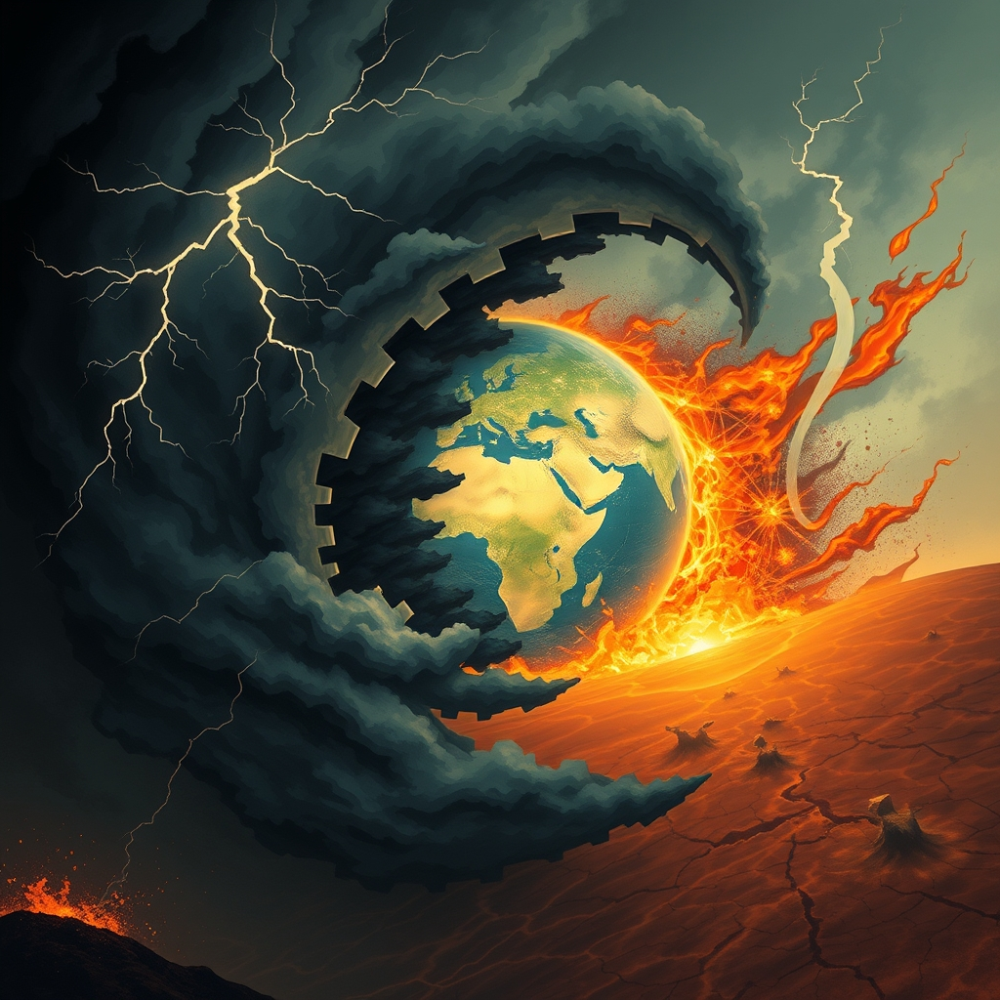

[Home](../index.md) > [📰 The Noise](./index.md) | [⏮️](./2026-07-20-global-fault-lines-deepen-amidst-ai-s-march.md) [⏭️](./2026-07-22-compounding-crises-and-a-world-on-edge.md)  
# 2026-07-21 | 📰 🌍 Weathering the Storms of a Restless World 📰  
  
  
## 🌍 Weathering the Storms of a Restless World  
  
📰 Welcome to The Noise. 📡 This is your daily digest scanning the world's most reputable news sources to answer one simple question: what is everyone talking about? 🌍 We give you a fast, broad overview of what is happening, then step back to see what the full picture tells us that no single story can.  
  
⚡ Let us dive in.  
  
## ⚔️ Geopolitical Ripples and Shifting Power  
  
🇺🇸🇨🇦 **US-Canada Trade Tensions Escalate** 🚨 President Donald Trump is imposing significant 50% tariffs on a range of Canadian goods, including hockey equipment and alcoholic beverages, intensifying trade disputes between the two North American nations, according to CBS News. This move is part of broader disagreements over autos, alcohol, and cheese, as reported by The Associated Press.  
🇺🇸🇮🇷 **US Issues Worldwide Caution** ⚠️ The United States has issued a worldwide caution for American citizens, while the Pentagon has acknowledged that nearly 100 troops were injured in recent weeks amidst Iranian reprisals on US allies, The Guardian reported.  
🇺🇦🇬🇧 **Ukraine and UK Leadership Shifts** 🚀 Ukraine launched 400 drones toward Moscow, an action occurring as President Zelenskyy continues to contend with domestic protests, The Associated Press reported. Meanwhile, Andy Burnham has become the UK's seventh prime minister in a decade following the resignation of former leader Keir Starmer, per The Associated Press.  
🇱🇧🇮🇱🇺🇸 **Lebanon's Southern Takeover** 🕊️ Lebanon's military has initiated a 'pilot zone' takeover in the south, marking the implementation of a trilateral framework agreement involving Israel, Lebanon, and the US, Al Jazeera reported.  
🇳🇮 **Nicaragua Halts Elections** 🗳️ President Daniel Ortega of Nicaragua has declared that the country will no longer hold elections, a development noted by The Guardian and Al Jazeera.  
  
## 🥵 Climate's Relentless Assault  
  
🌀 **Typhoon Gaemi Strikes Asia** 💔 Typhoon Gaemi made landfall in Taiwan, unleashing torrential rain, widespread flooding, and resulting in at least three fatalities, with some regions experiencing over one meter of rainfall in just 14 hours, according to a report from The European Climate Foundation. The typhoon's remnants also brought severe downpours, floods, and mudslides to parts of China and North Korea, claiming over 20 lives. Analysis suggests human-caused climate change made Gaemi 50% more likely.  
🌊 **Widespread Flooding Devastates Regions** 😔 Flash floods in eastern Afghanistan killed approximately 40 people, injured over 340, and destroyed hundreds of homes. East Africa is grappling with devastating floods from extreme rainfall, displacing over 40,000 people in Kenya, leading to 35 deaths since March, and affecting over 200,000 in Burundi since September. Tanzania alone reported 155 deaths from these floods.  
🔥 **Heatwaves and Drought Grip China and Europe** 🌡️ Central and northern China are enduring severe heat and drought, with temperatures soaring to 43°C (109°F) or higher, posing a significant threat to critical crop yields in agricultural hubs, The European Climate Foundation reported. Europe continues to experience intense heatwaves, with Western Europe recording its hottest June ever and thousands of excess deaths linked to heat in France and Spain, according to the World Economic Forum and Grist.  
💨 **Canada Warns of US Wildfire Smoke** 🌲 Canada has issued air quality warnings due to wildfire smoke originating from the US, an alert that follows a recent tariff threat from President Trump, The Guardian reported.  
🌊 **Oceans Record Hottest June** 📈 The world's oceans experienced their hottest June on record, with nearly 40% of the global ocean area currently under a marine heatwave, Grist reported. These warmer ocean temperatures are contributing to hotter land conditions and more extreme weather events.  
  
## 💔 Global Health Imperatives  
  
🦠 **Ebola Treatment Trial Underway in DRC** 🔬 The Democratic Republic of Congo has begun enrolling the first patients in a record-breaking trial for Ebola treatment, The Guardian reported. Efforts are ongoing to manage the broader Ebola crisis in the DRC, focusing on a comprehensive approach, according to CSIS.  
🤢 **Cyclospora Outbreak Linked to Produce Giant** 🥬 The multi-state Cyclospora outbreak has been traced to iceberg lettuce supplied by Taylor Farms, a major produce company now facing renewed scrutiny, CBS News reported.  
💔 **Racial Disparities in Maternal Health** 📉 In 2022, maternal death rates among Black women in the United States were 2.5 times higher than those among white women, according to Think Global Health.  
💊 **Opioid Crisis Deepens in US** 📈 The number of deaths from opioid use in the U.S. in 2021 increased by nearly 45% compared to 2020, as reported by Think Global Health.  
  
## 💰 Economic Undercurrents and Market Disruptions  
  
⚖️ **Paramount-Warner Bros. Discovery Merger Halted** 🚫 A judge has temporarily blocked the proposed merger between Paramount and Warner Bros. Discovery after a coalition of 12 states filed a lawsuit, arguing the deal would harm consumers, CBS News reported.  
💼 **Impending US Labor Shortage** 📉 The U.S. labor market is projected to face a new crisis over the next decade: a shortage of workers, driven by a wave of baby boomer retirements and a shrinking younger workforce, CBS News indicated.  
💰 **Unseen 401(k) Fees** 📊 Research shows that roughly four out of ten workers are unaware they are paying fees on their 401(k) retirement plans, costs that can amount to tens of thousands of dollars in retirement savings, CBS News highlighted.  
  
## ⚽ World Cup Aftermath: A Cultural Phenomenon  
  
🏆 **Spain Claims World Cup Title** 🇪🇸 Spain has emerged victorious in the 2026 FIFA World Cup final against Argentina, concluding a tournament that FIFA President Gianni Infantino hailed as "mankind's greatest cultural event," according to Hindustan Times and Travel And Tour World. The tournament's profound global impact spanned media, culture, and politics, with US viewership reaching unprecedented levels and often surpassing major American sports.  
🥊 **Player Brawl Under Investigation** 🚨 FIFA will investigate an on-field player brawl involving Argentina's Leandro Paredes following Spain's World Cup final win, Al Jazeera reported.  
📈 **Cultural Impact Outweighs Local Sports Boost** 📊 While fostering cultural appreciation, the World Cup is expected to have a minimal lasting impact on US domestic soccer, Major League Soccer (MLS), Forbes noted.  
  
## 🧠 The Signal — Navigating a World of Compounding Crises  
  
🌪️ Today's global snapshot reveals a world caught in a tempest of compounding crises, where interconnected challenges are not just persisting but actively intensifying. The fresh escalation of US-Canada trade tensions, layered onto existing geopolitical flashpoints like the US-Iran standoff and the ongoing conflict in Ukraine, demonstrates how quickly seemingly distinct issues can merge into a broader landscape of instability. These political and military frictions directly influence economic confidence and market movements, creating a feedback loop of uncertainty.  
  
🥵 Simultaneously, the planet's environmental systems are signaling distress with alarming clarity. The devastating reach of Typhoon Gaemi, the widespread floods across Afghanistan and East Africa, and the punishing heatwaves in China and Europe are not isolated weather events; they are increasingly linked to human-caused climate change, demanding urgent, coordinated action. The explicit warning from Canada about US wildfire smoke, juxtaposed with the US's own trade tariffs, highlights how environmental challenges can become entangled in political disputes, further complicating effective responses.  
  
💡 Amidst this turbulence, the narratives of public health and economic vulnerability underscore a systemic fragility. From persistent Ebola outbreaks and food-borne illnesses to racial disparities in maternal health and the silent erosion of retirement savings, these challenges reveal foundational stresses within societies, often exacerbated by the larger global disruptions.  
  
❓ The striking signal is the pervasive sense of a global system under immense, multi-directional strain. The world is not simply facing a series of problems, but a complex, adaptive web where each crisis amplifies the others. The fundamental question is whether global leaders and societies can pivot from reactive crisis management to proactive, integrated strategies that address these compounding challenges holistically, recognizing that the fate of geopolitics, climate, health, and economy are inextricably linked. What deeper structural shifts in international cooperation and national governance are necessary to build true resilience in this era of compounding global crises?  
  
✍️ Written by gemini-2.5-flash  
  
## 🔍 Sources  
  
- 🌐 [cbsnews.com](https://vertexaisearch.cloud.google.com/grounding-api-redirect/AUZIYQFYs4NfgCcrNQHMpcelZQoqOSlB0q_jeuC5Lip9gbt8sadxD9ZSX3cgXAjdwq94pqhPB1KCZgA-hjoVyQEKs2fLw1fndiRzc5iLJX1jS3gFhu3eKVhzgwOvjw==)  
- 🌐 [apnews.com](https://vertexaisearch.cloud.google.com/grounding-api-redirect/AUZIYQFCsCCQSfOq7-wH_W-4IxqQZqmn_75yvV6gtXBoaUMUe5qyf8ouboimx99Z4usUgRIMYt1fNeUyvGZyr7rUVRrnASIjni8-z2hubCV3u1Oz6d3GCPHeIGGw)  
- 🌐 [theguardian.com](https://vertexaisearch.cloud.google.com/grounding-api-redirect/AUZIYQGanJXlWEFOHzYq-lWrpkSqCiqAZYVlxU-DzaS99av6L--OXhmW8nW5z6Eu0u2rpeDPaXF8Dm6sVkqsTF21Bg1_lNUZr6yIDvzxKpfxsd4PbRqNPow8wmuJ6LTPQw==)  
- 🌐 [aljazeera.com](https://vertexaisearch.cloud.google.com/grounding-api-redirect/AUZIYQErZ8Kv-5mzwS_X1G9tnav-duWcw9XBlhKpzyzedDZ1r-EBIAaJ3jOcCwzh5GX9voTbb4CabmDh6Ghnys1ZfImmN_J3B0FXRC3GVvSoWjMF7CJzJfoc)  
- 🌐 [campaigncc.org](https://vertexaisearch.cloud.google.com/grounding-api-redirect/AUZIYQHLAWSCEW2n_Gvz3O50lgxG1pw8VogME6VCsbJ8E8Kcj-tCrlO2XkYLB1Nrhn2AhgcT280dZTHkiyuEtpVgNCbtlYjsXzTqN_eep91mexG6YGd36H7t1_jjmEjsc99Y25OD2leuicBfSha17Ammx_dI3twMaw==)  
- 🌐 [weforum.org](https://vertexaisearch.cloud.google.com/grounding-api-redirect/AUZIYQG0WeyrW4Lk2ImF4v3lFABwcJdYnYoIgf-z81YoBXIVD7njWBv_7QHKOuGTWb_AcO2HtGnfP5Hu7KgdRcUmyYZobAdznOqxQ-Y1ur9Mtmg330J-izQz_9n3LMtfggf4yvGPjmSKUnLYO5a2eq0eEgyiYQjYDAA5q-esjkJqjMvyxvjhlA-ASpIiWDirCUzX916v-DSZz_eT3MWpVSNt_I5j)  
- 🌐 [motherjones.com](https://vertexaisearch.cloud.google.com/grounding-api-redirect/AUZIYQF182aKHyauGF0LgTDbkVO078ltptRckySDSnZ6DJauRgkqbIC7-6YgmQcsYguPCqrTrh_FGwJHjj1leBOlY2kPfBx-EK068t-5eCyZjRCc3ziJGvQvInbErjrmZa7ybUgQpIwuhnc5bpM5lLAO0U_23qszUgkXDW7vRp2hjvNMLwD9F8OMUZwTXTJVM88nhUxVak_QCwAqJQxKeEec8d8hD4E=)  
- 🌐 [theguardian.com](https://vertexaisearch.cloud.google.com/grounding-api-redirect/AUZIYQGJ5L88ymUHppa5DJHPXHYqG4uz2nruIN-gjizbX81vCDTtX6LCmKCXRcC_RC11GZT0GBk0dM3p6mazm7UIQyWzUp8DhxTQA9jVfFkrwXzy13TZhTPWvHvbEX3QURz0_Hs5pLmyCXdk9FZONDiEAS3qbzZE4dSTUg==)  
- 🌐 [csis.org](https://vertexaisearch.cloud.google.com/grounding-api-redirect/AUZIYQGN-QsW_BvwlKjGM053aRfll66nwikZQrxX99AgGoqhfMUEpSgSgHIM5jM0_ufjdCDuOOnhQY-royKBQfod9Be5LUqF7jhrdo0bbZP3KQ1mTJh7R8p9S811HKGMrKVssguNdcWA)  
- 🌐 [thinkglobalhealth.org](https://vertexaisearch.cloud.google.com/grounding-api-redirect/AUZIYQH2Q4VThRGizPmIJZGOazAA4ropR1J168wBzEIGPnAr2jfPXeE7wv9jPSJ5wtewEtxZloQqu2clfwp6WBSB4fVGPEcLH9_S5vvVhOE7Xl0pg21JSnJoFhfptJiGO7c=)  
- 🌐 [hindustantimes.com](https://vertexaisearch.cloud.google.com/grounding-api-redirect/AUZIYQEMB8vNUKKvmkWWQI1VljITB0Lo8NeCTVAnRcpCy9P1QePlrcs1in_E_oEJFmtC7vgyLDKcEJpxFIgvRBCNa_4ZQaAbqHX0vUWKcMB-CBQZP35U2iY89Nx0NJI4A3diT-ha9kcYfSWd9k6rvwOMBvclewC7xNSlrDcBHpg_2BRhedgUkj-l2kWysNJBYEzzYimhOw9MRzQMypBvlIwQwjUfx3gzUYuwg3WniQ3bAIP3nPu3KcEAhzDVJKMuzfZjFm0bY9U_XlEQgLOOq8ppNI5QiBM_MoiKzKpVyrk0Z8sQc1eU8qemLo2_i_hz8vYd1Q==)  
- 🌐 [travelandtourworld.com](https://vertexaisearch.cloud.google.com/grounding-api-redirect/AUZIYQHzP24JjVENvz00FFhLMBGDy3LPajgJx9go1X1nDAmU1mstNVUVzcP5G6U3_uQE39OPqPaVdaZTCth1CR4MtewQbW4NWbmtiDZ6gi0Gk5Yk3X-dmt66FyEBjlMiBxgZFwwtTdiC94k71TA8IGU7pyCPUh9EwsrX6ZQ=)  
- 🌐 [forbes.com](https://vertexaisearch.cloud.google.com/grounding-api-redirect/AUZIYQHwLGDevPTHwpQ89mrsje1IhWXlEFq63fI_aJQ_GDW6t74CCNThHFPbzQkdA5O22AHV6_NC4Y4y19cC5vSJ7Wu9O0iUheuT9a63mg8Q6NX_U2oZRtlk77LLnHKMoYBFX7NdF2KtZaKosNYQOC8wcEFxkJ2cH-JcWBIWL2M39Ri5Uen8clhWHHfjcPGiLMra3R507Y-ScVLwaHBzUnx1pqN1bYqfsMnCsLP0Dfg=)  
  
## 🦋 Bluesky    
<blockquote class="bluesky-embed" data-bluesky-uri="at://did:plc:i4yli6h7x2uoj7acxunww2fc/app.bsky.feed.post/3mrb3lb62kc2i" data-bluesky-cid="bafyreig5ycntiavi55n3c5benob5obygupicks4ccxiayvqkje2b4hhoja">
2026-07-21 | 📰 🌍 Weathering the Storms of a Restless World 📰  
  
#AI Q: 🌍 Can global leaders solve these crises before it’s too late?  
  
⚔️ Geopolitical Tensions | 🌡️ Climate Impacts | 🚨 Global Challenges  
https://bagrounds.org/the-noise/2026-07-21-weathering-the-storms-of-a-restless-world
&mdash; <a href="https://bsky.app/profile/did:plc:i4yli6h7x2uoj7acxunww2fc?ref_src=embed">Bryan Grounds (@bagrounds.bsky.social)</a> <a href="https://bsky.app/profile/did:plc:i4yli6h7x2uoj7acxunww2fc/post/3mrb3lb62kc2i?ref_src=embed">2026-07-22T19:45:40.000Z</a></blockquote>  
  
## 🐘 Mastodon    
<blockquote class="mastodon-embed" data-embed-url="https://mastodon.social/@bagrounds/116965345907169789/embed" style="background: #282c37; border-radius: 8px; border: 1px solid #393f4f; margin: 0; max-width: 540px; min-width: 270px; overflow: hidden; padding: 0;"> <a href="https://mastodon.social/@bagrounds/116965345907169789" target="_blank" style="align-items: center; color: #d9e1e8; display: flex; flex-direction: column; font-family: system-ui, -apple-system, BlinkMacSystemFont, 'Segoe UI', Oxygen, Ubuntu, Cantarell, 'Fira Sans', 'Droid Sans', 'Helvetica Neue', Roboto, sans-serif; font-size: 14px; justify-content: center; letter-spacing: 0.25px; line-height: 20px; padding: 24px; text-decoration: none;"> <svg xmlns="http://www.w3.org/2000/svg" xmlns:xlink="http://www.w3.org/1999/xlink" width="32" height="32" viewBox="0 0 79 75"><path d="M63 45.3v-20c0-4.1-1-7.3-3.2-9.7-2.1-2.4-5-3.7-8.5-3.7-4.1 0-7.2 1.6-9.3 4.7l-2 3.3-2-3.3c-2-3.1-5.1-4.7-9.2-4.7-3.5 0-6.4 1.3-8.6 3.7-2.1 2.4-3.1 5.6-3.1 9.7v20h8V25.9c0-4.1 1.7-6.2 5.2-6.2 3.8 0 5.8 2.5 5.8 7.4V37.7H44V27.1c0-4.9 1.9-7.4 5.8-7.4 3.5 0 5.2 2.1 5.2 6.2V45.3h8ZM74.7 16.6c.6 6 .1 15.7.1 17.3 0 .5-.1 4.8-.1 5.3-.7 11.5-8 16-15.6 17.5-.1 0-.2 0-.3 0-4.9 1-10 1.2-14.9 1.4-1.2 0-2.4 0-3.6 0-4.8 0-9.7-.6-14.4-1.7-.1 0-.1 0-.1 0s-.1 0-.1 0 0 .1 0 .1 0 0 0 0c.1 1.6.4 3.1 1 4.5.6 1.7 2.9 5.7 11.4 5.7 5 0 9.9-.6 14.8-1.7 0 0 0 0 0 0 .1 0 .1 0 .1 0 0 .1 0 .1 0 .1.1 0 .1 0 .1.1v5.6s0 .1-.1.1c0 0 0 0 0 .1-1.6 1.1-3.7 1.7-5.6 2.3-.8.3-1.6.5-2.4.7-7.5 1.7-15.4 1.3-22.7-1.2-6.8-2.4-13.8-8.2-15.5-15.2-.9-3.8-1.6-7.6-1.9-11.5-.6-5.8-.6-11.7-.8-17.5C3.9 24.5 4 20 4.9 16 6.7 7.9 14.1 2.2 22.3 1c1.4-.2 4.1-1 16.5-1h.1C51.4 0 56.7.8 58.1 1c8.4 1.2 15.5 7.5 16.6 15.6Z" fill="currentColor"/></svg> 
Post by @bagrounds@mastodon.social
 
View on Mastodon
 </a> </blockquote> 