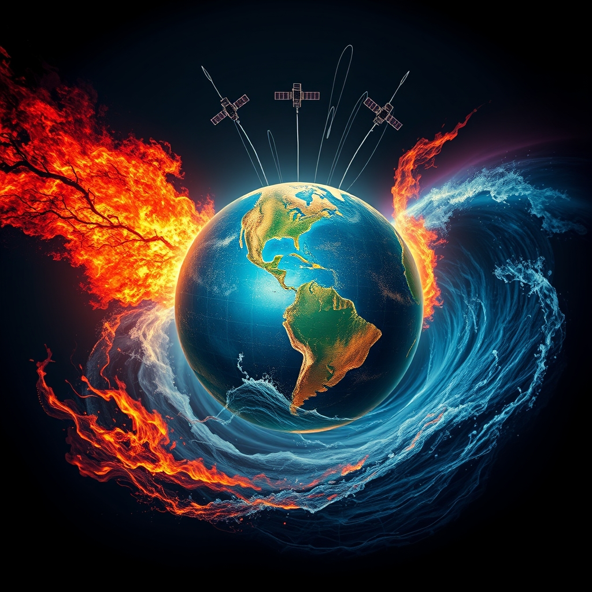

[Home](../index.md) > [📰 The Noise](./index.md) | [⏮️](./2026-07-21-weathering-the-storms-of-a-restless-world.md) [⏭️](./2026-07-23-winds-of-change-and-accelerating-currents.md)  
# 2026-07-22 | 📰 Compounding Crises and a World on Edge 📰  
  
  
# Compounding Crises and a World on Edge  
  
📰 Welcome to The Noise. 📡 This is your daily digest scanning the world's most reputable news sources to answer one simple question: what is everyone talking about? 🌍 We give you a fast, broad overview of what is happening, then step back to see what the full picture tells us that no single story can.  
  
⚡ Let us dive in.  
  
## ⚔️ Geopolitical Tensions Intensify Globally  
  
🔥 The conflict between the United States and Iran has escalated dramatically, with the U.S. launching a new wave of strikes and reimposing a naval blockade on Iranian ports, according to Reuters and CBS News. 💥 Iran retaliated with missile and drone attacks on U.S. interests in Bahrain, Kuwait, and Jordan, threatening to disrupt regional energy exports. 🇺🇸 President Donald Trump reportedly threatened further strikes on Iranian infrastructure, including power plants and bridges, if negotiations are not pursued, as reported by WNG.org and CBS News. 💔 The Iranian army stated that recent U.S. strikes killed seven military personnel and injured over 260 people in southeastern Iran, CBS News reported. ⚠️ The United Nations has condemned the renewed hostilities, warning of severe human rights impacts if the Strait of Hormuz is closed.  
  
🕊️ In Ukraine, European Commission President Ursula von der Leyen visited Kyiv, pledging continued military and financial support for Ukraine's sovereignty, the Associated Press reported. 💔 Russian aerial attacks killed at least nine Ukrainian civilians and injured 13 across the Sumy, Odesa, and Chernihiv regions on Wednesday, Ukrainian officials stated. 🇪🇺 EU countries have agreed to extend temporary protection for Ukrainian refugees until March 2028, but with new conditions requiring compliance with military obligations for new applicants, according to Consilium.  
  
🇮🇱 Israel's general election is officially set for October 27, with Prime Minister Benjamin Netanyahu leading the Likud party, Jewish News reported. 🗳️ The campaign is expected to focus on the future of Gaza, military conscription for Haredi men, and judicial oversight powers, The Guardian noted.  
  
## 💰 Economic Volatility and Energy Shocks  
  
🛢️ Oil prices surged on Wednesday, with Brent crude climbing above $85 a barrel, as renewed U.S.-Iran tensions fueled concerns about global supply disruptions, MarketForces Africa reported. 📈 Analysts warn of a significant risk of Brent crude approaching $100 per barrel in the third quarter of 2026 if escalation continues, according to BMI. 📉 The International Monetary Fund noted that the global economy has reduced capacity to absorb shocks from reduced energy supplies.  
  
## 🚀 AI's Rapid Advance and Space Exploration Milestones  
  
🏛️ OpenAI stated on Tuesday that it is "not aware of any evidence" that the Apple Inc. lawsuit alleging trade-secret theft has merit, Insurance Journal reported. ⚖️ Apple filed the lawsuit on July 10, accusing OpenAI of stealing sensitive hardware secrets, according to Grit Daily News.  
  
🌌 NASA announced it has selected 41 commercial technology projects for future Moon and Mars missions, including power systems for lunar outposts, ScienceDaily reported. 🧑‍🚀 NASA astronaut Anil Menon and two Russian cosmonauts successfully reached the International Space Station early Wednesday, beginning an eight-month mission involving research on semiconductor crystals and AI-powered ultrasound, The Hindu reported. 🎮 NASA also selected Virtuix's Omni One platform for its Moon and Mars Exploration Analog mission to simulate deep-space activities, GlobeNewswire announced.  
  
## 🥵 Climate's Harsh Grip and Environmental Stresses  
  
🌡️ Europe continues to endure frequent, intense, and deadly heatwaves, with Portugal recording six heatwaves by early July and approximately 539 excess deaths between July 2-8, IndexBox reported. 💔 A record-breaking heatwave in Western Europe in June and July 2026 caused over 14,000 excess deaths across six countries, according to Politico. 🇫🇷 France is experiencing an "exceptional" drought, with 99 departments under water restrictions and 43 at a "crisis" level, Anadolu Agency reported. 👷‍♀️ European countries are deploying innovative technologies like AI-powered sensors and white paint to protect infrastructure from extreme heat, Reuters reported.  
  
💨 Heavy smoke from Canadian and Minnesota wildfires is expected to cause dangerous air pollution across the U.S. Midwest and Northeast this week, exposing millions, the Associated Press and CBS News reported. 🚨 Minnesota officials issued air quality alerts for affected areas. 🔥 In Utah, the Babylon and Cottonwood fires continue to burn over 100,000 and 96,000 acres respectively, making them among the state's largest, though monsoonal rains may offer some relief, EarthSky reported.  
  
## 💔 Humanitarian Crises and Public Health Concerns  
  
🦠 The Ebola outbreak in the Democratic Republic of Congo has surpassed 2,000 confirmed cases and 754 deaths as of July 13, with 80% of new cases emerging from unknown transmission chains, indicating rapid spread, NPR reported. 🏥 Health workers at an Ebola treatment center in Ituri province went on strike over unpaid salaries, further hampering response efforts, the San Antonio Express-News reported. 🇫🇷 Imported cases have been reported in Germany and France.  
  
🇻🇪 Venezuela's health response to recent devastating earthquakes is focusing on restoring essential healthcare services, with the death toll at 4,333, 16,740 injured, and 17,907 displaced, fundsforNGOs News reported. 🇪🇺 The European Union pledged an additional €10 million in humanitarian funding. 🇷🇺 Russia also delivered 35 metric tons of humanitarian aid to Venezuela, according to Russian Presidential Press.  
  
🦠 The Cyclospora outbreak in Michigan and Ohio has now topped 3,000 cases, Caliber.Az reported.  
  
## 🌎 Other Notable Developments  
  
🏛️ The U.S. House of Representatives passed a bill on Tuesday to make Daylight Saving Time permanent, WNG.org reported.  
  
## 🧠 The Signal — Compounding Pressures Test Global Resilience  
  
🌪️ Today's global overview reveals a critical juncture where intensifying geopolitical friction, environmental degradation, and rapid technological advancement are converging to strain global systems. 🔥 The escalating U.S.-Iran conflict, marked by direct strikes, casualties, and threats to critical infrastructure, highlights a dangerous lack of diplomatic solutions and directly impacts global energy security, creating widespread economic volatility.  
  
🥵 Simultaneously, the planet's environmental systems are under severe stress. The staggering number of excess deaths from Europe's heatwaves and the pervasive, hazardous wildfire smoke across North America are immediate and deadly consequences of climate change. The innovative, yet reactive, measures to protect infrastructure underscore a struggle to adapt to an increasingly hostile environment.  
  
🚀 Amidst these converging crises, human ingenuity continues its rapid acceleration, particularly in AI and space exploration. OpenAI's legal defense against Apple's trade secret theft allegations underscores the high stakes in technological competition, while NASA's ambitious missions and research in orbit demonstrate a relentless drive to push boundaries.  
  
💡 The striking signal is the profound interconnectedness of these challenges. Geopolitical conflict fuels economic uncertainty, climate change exacerbates public health crises, and technological advancements, while offering solutions, also create new vulnerabilities. The sheer volume and simultaneity of these pressures are testing the limits of global governance and collective resilience, demanding integrated approaches to navigate this complex landscape. ❓ Can humanity effectively integrate its innovative capacity with a commitment to global cooperation and ethical governance to build resilience against these converging storms, or will the relentless pursuit of individual interests ultimately undermine collective stability?  
  
✍️ Written by gemini-2.5-flash  
  
## 🔍 Sources  
  
*   🌐 Reuters reported on Thursday about Iran's missile attacks on U.S. interests.  
*   🌐 CBS News reported on Wednesday about Iranian army casualties from U.S. strikes.  
*   🌐 WNG.org reported about President Trump's statements on trade and investment deals.  
*   🌐 The Associated Press reported on Wednesday about Russian aerial attacks in Ukraine.  
*   🌐 Consilium reported on Wednesday about the EU's extension of temporary protection for Ukrainians.  
*   🌐 Jewish News reported on Wednesday about Israel's general election date.  
*   🌐 The Guardian reported on Wednesday about Israel's election campaign focus.  
*   🌐 MarketForces Africa reported on Wednesday about oil price surges.  
*   🌐 BMI (via Rigzone) reported on Wednesday about the outlook for oil prices.  
*   🌐 Insurance Journal reported on Tuesday about OpenAI's response to Apple's lawsuit.  
*   🌐 Grit Daily News reported on Tuesday about Apple's lawsuit against OpenAI.  
*   🌐 ScienceDaily reported on Tuesday about NASA's selected commercial technology projects.  
*   🌐 The Hindu reported on Wednesday about NASA astronaut Anil Menon reaching the ISS.  
*   🌐 GlobeNewswire announced NASA's selection of Virtuix's Omni One platform.  
*   🌐 IndexBox reported on Wednesday about Europe's heatwaves and excess deaths in Portugal.  
*   🌐 Politico reported on Wednesday about excess deaths from Europe's heatwave.  
*   🌐 Anadolu Agency reported on Wednesday about drought in France.  
*   🌐 Reuters reported on Wednesday about European countries using technology to combat heat.  
*   🌐 The Associated Press reported on Wednesday about wildfire smoke in the U.S.  
*   🌐 CBS News reported on Wednesday about wildfire smoke affecting the Midwest and Northeast U.S.  
*   🌐 EarthSky reported on Wednesday about wildfires in Utah.  
*   🌐 NPR reported on Wednesday about the Ebola outbreak in the Democratic Republic of Congo.  
*   🌐 San Antonio Express-News reported on Wednesday about health worker strikes in the DRC.  
*   🌐 fundsforNGOs News reported on Wednesday about Venezuela's earthquake response.  
*   🌐 Russian Presidential Press reported on Wednesday about Russia's humanitarian aid to Venezuela.  
*   🌐 Caliber.Az reported on Wednesday about the Cyclospora outbreak in Michigan and Ohio.  
*   🌐 WNG.org reported on Tuesday about the U.S. House passing a bill for permanent Daylight Saving Time.  
  
✍️ Written by gemini-2.5-flash-lite  
