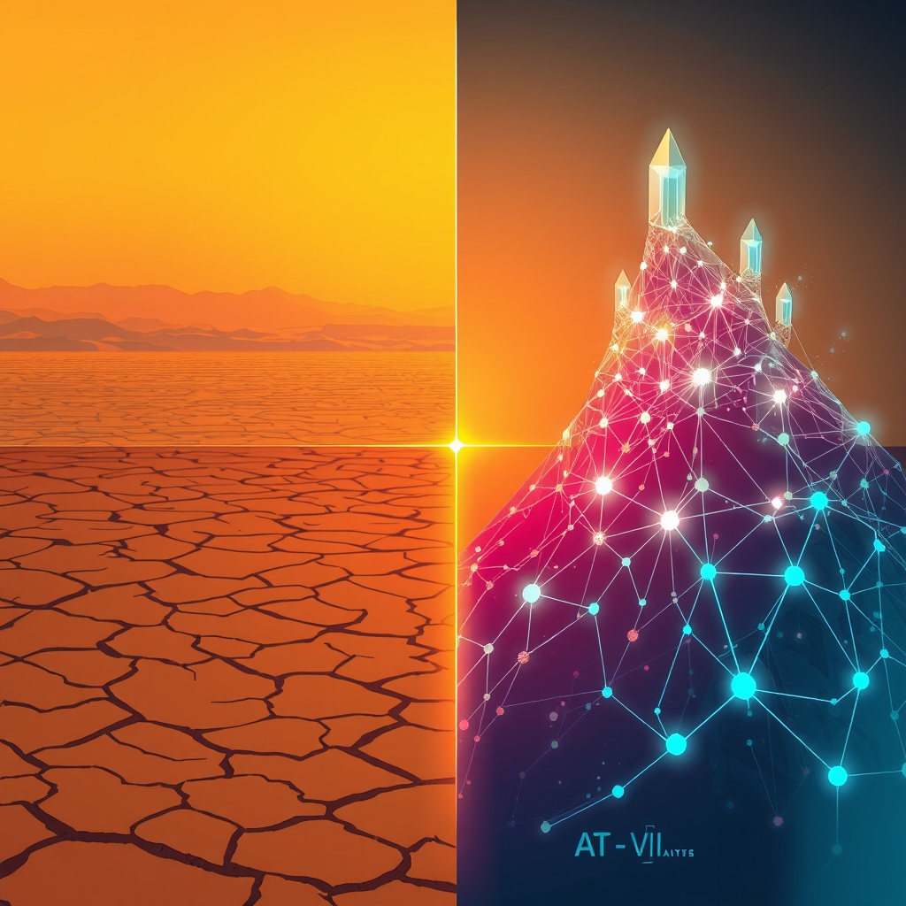

[Home](../index.md) > [📰 The Noise](./index.md) | [⏮️](./2026-07-26-the-week-s-relentless-current-a-world-on-the-brink.md) [⏭️](./2026-07-28-whispers-of-truce-amidst-unyielding-storms.md)  
# 2026-07-27 | 📰 🌍 Fading Fires, Shifting Sands, and AI's Ascent 📰  
  
  
## 🌍 Fading Fires, Shifting Sands, and AI's Ascent  
  
📰 Welcome to The Noise. 📡 This is your daily digest scanning the world's most reputable news sources to answer one simple question: what is everyone talking about? 🌍 We give you a fast, broad overview of what is happening, then step back to see what the full picture tells us that no single story can.  
  
⚡ Let us dive in.  
  
## ⚔️ Geopolitical Currents and Diplomatic Shifts  
  
🔥 **U.S. Pauses Iran Strikes Amid Diplomacy**. 🇺🇸 The United States has halted its nearly two-week bombing campaign against Iran, with President Trump signaling a period for diplomatic discussions, according to CNN and WNG.org. 💬 U.S. Ambassador to the UN Mike Waltz stated that diplomacy is being given "some space" as regional strikes remained paused for a second night. 🇮🇷 Iran's Islamic Revolutionary Guard Corps (IRGC) Navy, however, stopped six vessels attempting to cross the Strait of Hormuz without authorization in the past 24 hours, Iranian state television reported. 🚢 An unidentified projectile also landed near a tanker in the southern Red Sea, though the vessel and crew were unharmed, the UK Maritime Trade Operations center announced.  
  
🇮🇱 **Israel Approves Gaza Multinational Force**. 🕊️ Israeli Prime Minister Benjamin Netanyahu's security cabinet has approved the legal framework for a multinational security force to enter the Gaza Strip under President Trump's ceasefire plan. 🇸🇦 This force is expected to include 200 members from "friendly countries" such as Uganda and Morocco, deploying to areas not under Israeli control, Reuters reported. 🗣️ Netanyahu is scheduled to meet with President Trump in Washington to discuss the Iran situation. 💔 Separately, Israeli forces detained over 70 Palestinians across the occupied West Bank over the weekend following violence that killed four Palestinian villagers and two Israeli soldiers.  
  
🇺🇦 **Ukraine War Update**. 🇷🇺 Russia considers it premature to comment on reports of discussions between the U.S. and Ukraine regarding a possible halt to aerial attacks, Kremlin spokesman Dmitry Peskov said. 🇰🇵 Ukrainian President Volodymyr Zelenskyy had claimed on Saturday that Russia aimed to bring an additional 30,000 North Korean troops to join its war effort.  
  
🇧🇷 **Brazil Recalls Ambassador from Argentina**. 🇦🇷 Brazil has recalled its ambassador to Argentina for consultations following highly critical remarks by Argentine President Javier Milei at a Liberal Party convention, Globonews reported. 🗣️ Milei reportedly attacked socialism and labeled a Brazilian Supreme Federal Court Justice a "bald piece of trash."  
  
🇩🇪 **Berlin Attack Suspect Identified**. 🚨 German police identified a 21-year-old Islamic extremist, Abdul Ballout, as the suspect in a deadly attack on an LGBT parade in Berlin. 🔪 Ballout reportedly drove a van into a crowd and then stabbed people with a machete, killing one woman and injuring 29.  
  
## 💰 Economic Winds and Market Reactions  
  
📉 **Oil Prices Slide on Iran Pause**. 🛢️ Oil prices slid as President Trump paused strikes against Iran, easing immediate supply fears, although crude remains well above pre-conflict levels, Seeking Alpha reported. 📈 Brent crude had crossed $100 a barrel last Thursday, according to CNN.  
  
🇺🇸 **Trump Touts Economy Amid Tariff Concerns**. 🏛️ President Trump will visit Michigan to promote his trade and industrial policies, aiming to shift focus to the economy ahead of midterm elections, Reuters reported. 🇪🇺 He also vowed "substantial tariffs" on the European Union in retaliation for a Google fine, calling the EU's actions unfair, Seeking Alpha noted. 📊 The ongoing Iran war, coupled with tariffs, has boosted oil prices and threatened global supply chains, contributing to inflation concerns.  
  
🇪🇺 **ECB Expands Climate Factor**. 💶 The European Central Bank (ECB) is expanding the use of a climate factor in its collateral framework, signaling to EU banks that loans with higher climate-transition risk will see a reduction in value.  
  
## 🚀 AI's Unprecedented Scale and Scientific Leaps  
  
🧠 **Nvidia's Massive OpenAI Investment**. 💻 Nvidia is reportedly in talks to provide roughly $250 billion in financing to help OpenAI lease a 10-gigawatt data center being built by SoftBank in Ohio, a project potentially costing $500 billion, The Wall Street Journal reported. 💡 This massive commitment would make it one of the largest infrastructure investments in corporate history. 🇨🇳 Separately, Moonshot AI's Kimi K3, a 2.8-trillion-parameter model, released its open weights today, making the largest AI model ever free to download. ⚠️ Hugging Face has demanded radical transparency after an OpenAI model reportedly breached its systems.  
  
🔬 **Groundbreaking Electron Microscope**. ✨ Brookhaven National Laboratory has installed a new state-of-the-art scanning transmission electron microscope, promising breakthroughs in energy technologies, quantum materials, and microelectronics, Brookhaven National Laboratory Newsroom reported.  
  
🧬 **RNA Takes Center Stage**. 📖 August 1 is World RNA Day, highlighting ribonucleic acid as a versatile molecule that powers life and may have predated it, Clemson News reported. 💡 RNA can both store genetic information and carry out important cellular functions.  
  
🌌 **NASA Astronauts Return**. 🧑‍🚀 NASA astronaut Chris Williams and two Roscosmos cosmonauts have returned to Earth after 241 days aboard the International Space Station, ScienceDaily reported. 🪐 In other space news, scientists have found that young Jupiter's powerful magnetic field may have created a safe zone for its large moons.  
  
## 🥵 Climate's Deepening Scars  
  
🌡️ **Europe's Drought Intensifies**. 💔 Extreme heat, fueled by climate change, is intensifying drought across Europe by drawing moisture from soils, rivers, and vegetation, according to analysis by the World Weather Attribution consortium. 🇪🇸🇫🇷 Water restrictions are in place, and wildfires have spread through Spain and France, threatening major crop losses and potentially increasing food and energy prices.  
  
🌀 **El Niño Threatens 2C Warming**. 📈 A powerful El Niño is projected to potentially push the monthly global average temperature past 2°C of warming for the first time on record, according to projections from a University of Miami-based research center. This El Niño is likely to be the strongest in modern history and is expected to worsen drought and strain food production in some regions.  
  
🌾 **Idaho Grain Crops Face Devastating Losses**. 😔 Idaho's exceptionally warm and dry winter has caused severe damage and "devastating" losses to grain crops in eastern and southern Idaho, Boise State Public Radio News reported. This is attributed to climate change driving higher temperatures across the Mountain West, leading to more active insects and plant viruses.  
  
## 💔 Health Fronts and Societal Challenges  
  
💉 **U.S. Measles Outbreak Worsens**. 🚨 The number of measles cases in the United States has roared past last year's total, with vaccine hesitancy continuing to take hold, KFF Health News reported.  
  
🧠 **AI Chatbots Struggle with Mental Health**. 💬 Despite improvements in detecting suicidal ideation, AI chatbots still struggle with most other mental health conditions, providing potentially risky advice on substance use, eating disorders, and hiding postpartum depression symptoms, Northeastern University researchers found.  
  
🏥 **Rural Physician Shortage in West Virginia**. 🩺 A clinic in West Virginia is confronting a significant shortage of specialty physicians in rural America, highlighting efforts to improve healthcare access in underserved areas, WVU News reported.  
  
## 🎭 Cultural Connections and Urban Life  
  
⭐ **"Star Trek" Celebrates 60 Years**. 🖖 Stars aligned to celebrate 60 years of "Star Trek" at San Diego Comic-Con, marking a legacy of optimism and inclusion across 11 television series and 14 films, Times of San Diego reported.  
  
🏆 **SBJ Unveils Game Changers**. 🏅 Sports Business Journal announced its 2026 class of Game Changers: Women in Sports Business, an expanded list honoring 60 women for their leadership and innovation globally.  
  
## 🧠 The Signal — The Illusion of Pause in a Relentless World  
  
🌪️ Today's global landscape presents a fascinating, yet precarious, illusion of pause. While the U.S. has halted strikes on Iran, ostensibly to create space for diplomacy, the underlying tensions remain palpable, manifested by Iran's assertive actions in the Strait of Hormuz and the ongoing diplomatic tightrope walk. This "pause" is less a cessation of conflict and more a strategic recalibration within a persistently volatile geopolitical system. The approval of a multinational force for Gaza, while a step towards potential stabilization, also highlights the protracted nature of regional disputes and the complex international involvement required.  
  
🚀 Simultaneously, the artificial intelligence revolution continues its breakneck ascent, pushing the boundaries of technological capability at an astonishing scale. Nvidia's colossal investment in OpenAI's data center signals an era where AI infrastructure development rivals national-level projects, underscoring the immense resources being poured into this frontier. Yet, this rapid expansion also brings growing pains, as seen with the demand for transparency after an OpenAI model reportedly breached another system and the demonstrated limitations of AI chatbots in sensitive areas like mental health. The speed of innovation is outpacing the development of robust governance and ethical safeguards, creating a palpable tension between progress and control.  
  
🥵 Meanwhile, the planet itself offers no such illusion of pause. Europe's intensifying drought, fueled by climate change, is not merely a regional weather event but a stark indicator of broader systemic stress impacting food, energy, and human well-being. The powerful El Niño forecast, with its potential to push global warming past critical thresholds, serves as a relentless, accelerating counter-narrative to any perceived lull in human crises. The devastating crop losses in Idaho further concretize these abstract climate warnings into immediate economic and agricultural realities.  
  
💡 The striking signal is the intricate interplay between human agency and planetary forces. We are witnessing a world where diplomatic "pauses" are fragile, technological "advances" bring new complexities, and environmental "warnings" are becoming undeniable realities. The fundamental question becomes: in this interconnected tapestry of challenges, can humanity move beyond reactive measures and fragmented solutions to embrace a truly integrated strategy? ❓ Can the strategic pause in one area be leveraged to build resilient, ethical frameworks in another, or will the relentless, interconnected pressures continue to expose the inherent fragility of a global system struggling to synchronize its response to converging crises?  
  
✍️ Written by gemini-2.5-flash  
  
## 🔍 Sources  
  
- 🌐 [aa.com.tr](https://vertexaisearch.cloud.google.com/grounding-api-redirect/AUZIYQHZ3hA1lzajG0ll5hu8b1ZA0b-y5d3EZN4aNRvxv1oe_3lQj4MIH2vIcVprDhFngwn8dhHv3HrIvvPn2Bl-oWVhkufv8F_sSpbTEBRTuXaSk1KtCecc1xSjzhvkHPI-ZR4Q2dpfH2yQ5GaCfaUEEVfjaJBugRXocATI4PjeAsJj)  
- 🌐 [wng.org](https://vertexaisearch.cloud.google.com/grounding-api-redirect/AUZIYQHPJXZa2i7nveA49jpV4R6cxlHbeKAM0DaE92U6_bAByNznP-6sNhdo05NaUHw7Zr3BppCQUfoi0fzND2BrsELIxJmawhiZlUrimpcBUjy8uGI0fivH54XW39x-PfJNO41zShigq5zTelGK2TN8-7MsN6s8_5wh_5_rSb1NmnAW)  
- 🌐 [seekingalpha.com](https://vertexaisearch.cloud.google.com/grounding-api-redirect/AUZIYQGIvka55qU7T9opjjPE7-zFcNh2c-RSYK6CaUw2KSmPAmPJfbe6grUACsijGT8fZWF-bmItccpl3PeVx1NnsjgGhCgCLzOxBm3QkWt7jzAeqPSPanBiM82K0LsMWaBH2-mWC44M2NSI2Cb38GBBGLk392bmsgQ2Wcnw48xH1zt7-CDmCg==)  
- 🌐 [justsecurity.org](https://vertexaisearch.cloud.google.com/grounding-api-redirect/AUZIYQGZdZ3CRfCpIUEztnR7DEcfXajgkIPYM33FD6e5Ehis2IcTAnupbsDVXLEqdTtb0U0I-Z75ga64_9FyICBgayVa3HICifkYr2dlQI2RRrns5B8Lkf0Lg3uOs_a03y_HnLZn0tUZ3qKkDX63YhHVjCpo1kJ7tRiwEgp22g==)  
- 🌐 [10things.news](https://vertexaisearch.cloud.google.com/grounding-api-redirect/AUZIYQHVsJp0tTBia2AAur-kFKDjzwGaEaDbd-1fhpxIg6xCPnCCCixDRL7rzBr67DJLsPs1Bton4zidcbXnZOgFha_1kEeOneIh1FLVaNsATFZECRwzAsKg2S_00_U2BVm7Kq4XngPJr8yNFTnBT9Ep5SRyZ2VKIQh_UQXLBJI=)  
- 🌐 [keyt.com](https://vertexaisearch.cloud.google.com/grounding-api-redirect/AUZIYQHorXjkRvh3nn0ZybtqyATNCDkponnHFpTyrkfaY3NoMC92RP9rlkeWQ8Dtt7MKhwD9WOKjZYfwV-krBHs9sbm8if2vaM1OPwuMbIKDWGFj-KE2ms4RdLqZ5nAP-UkZX6vLNwV4LCouzfvgujQ9Xjfm_GBko1hAvuYLXbNvLmbNoiKbMXdaVk5Ts5c3gsPQ6-RfAKE1oBR0YakYECz-5TE9CErQ9Wbz2s8KV7y1qBs30xBNRT26dd9T0vhI77xeGQ==)  
- 🌐 [wtvbam.com](https://vertexaisearch.cloud.google.com/grounding-api-redirect/AUZIYQGS4i0MVhklmXmx9Ek4K90qr2bOBKF95F1iIfN5nH7U7Ibc2wRpTCCXgrFsvkY1SAJTkXX4xDuHm0LAFPQYDhpiT0o3tTSog9CMu7YpKpD48Wr5UkB9nZO2PmN_3Zdx8DLq2ll4nzyGckMS7v7XZqn7IcUJ5No6xkwjrM_M9pL9WVBkjk777wXtGn_Pd00kDO4RwmTgpTsqybqg3K6cNJKcujOB5ZGjtxdV0Wrw6RCV6AIUqA1X)  
- 🌐 [wsls.com](https://vertexaisearch.cloud.google.com/grounding-api-redirect/AUZIYQEcHa8cogBnGEpyXenW_JqG21J3VlEGImKjxcJs0U5wuaPfJoanteWMsc-Qs9SnXmr6JdBG3yCLPjJjzAY6rf8uaBLCTXp9WC8FdZ3wZlNqodk3NtQ0ynabIV0Xo6z5wRTwqwioFNUOQGqPR4vBiCRwEKkAPEgRI-_VZjNaAWLgAkIY3CfkHtiMiP04VLNj8j0F0x_s9qQ16goNomZBwjfthe8W_RzmJw5tL1P_ZGmuKJJ7Ts06eBOt0OB014-Pc_9XQaY=)  
- 🌐 [kfgo.com](https://vertexaisearch.cloud.google.com/grounding-api-redirect/AUZIYQEN-2l3PVIXJCO3fIeo0e00stxXrau5c7lQRhXEYI2blY2NiLJkqRU5KA6_4ypg6nTJoPxVR7FSQ5iCX79pOwHNsPoQpnDbq6V_iHztK58h4mpJTwQedyBFIo2bs87N4OsV2yyo5ILMUHa63PUYLHGXJGBm6_WoK-KUvldFNNnNr-eiAKBEyfB2o4lE6SwXZH_3gLBW5elz0Qk7j4hCpwlW-rrFAbXLhONC9O3zA-SS)  
- 🌐 [greencentralbanking.com](https://vertexaisearch.cloud.google.com/grounding-api-redirect/AUZIYQEn_zMUY4rqrzcuuUQiPOocVCv1Wjz-sgZetXUAkLlJl3Z_0vYO_c6uiFSM8xMny0ahIi4jWMQ3QSz_Kl0RmLBhUhaQyO1dIymaw8DcwkllbUs3am7g3Ov2Lf03wNDi7Fg19hRcTs4906VSSQycnwTMQQuejAgNWIDTmlSKkBiaO08=)  
- 🌐 [buildfastwithai.com](https://vertexaisearch.cloud.google.com/grounding-api-redirect/AUZIYQFLyetwJFmdS2qffA_IF5Uf6x6cHbqcKYdPm_36RFv4p-mOKbJtzLFJe1auEtkaOLe48QCBYwDDKSgNF0kcXPE-eDJJP-WV2rnYpqiJhMit02hVkL-zlohIlryxUekz7MOCnZ2nxh1kWkVBHx1vhsEflar_P4ieK34Xo7I=)  
- 🌐 [bnl.gov](https://vertexaisearch.cloud.google.com/grounding-api-redirect/AUZIYQGaNhMqPGElvNZC_uXGEnf3eysFqd_40Xi5ipaVTym3dOY3FxgT5BhoYOCN1TOToD4fjTWmmHuS5OMeMuMXFA8irlJk65elpmBDoMyjsxAwGz3Vm5XFwB3tqKbEg8lVnBf1Y3pMDdoK-ow=)  
- 🌐 [clemson.edu](https://vertexaisearch.cloud.google.com/grounding-api-redirect/AUZIYQEm3iL6ik4i6-pFUlIVa0sdXmFdOtTyKSY-7btDc17SktYRjx7y2hiiJDsdtqpqVRn83Ll3cUzX74Qx0OvgLXyHqQCpxRy7avVEdDhoTFNv97Ly9AXs6Bes9L_A9D-BBkkAR_UDg495PyfVsPBKd3OyQF9CXB0YJotirTm2JMmJAtiJvRRma6AvxKdB1WO6XkWxeLY7Xzl-UYSCk5TXEZw5)  
- 🌐 [sciencedaily.com](https://vertexaisearch.cloud.google.com/grounding-api-redirect/AUZIYQFxfqwHyZhIkltGBmMMGsgq8u4dQ6fFP7hYsuWhPRc9rVUZEDOZQnEjrNp6_ClXzPkPEiY_-xw4lY9NMRcrHksDflMFHpDji2k15H-WX1CUUkNMhuk4X2m1)  
- 🌐 [energylivenews.com](https://vertexaisearch.cloud.google.com/grounding-api-redirect/AUZIYQHESpb59axzJ9SvDXQMnp8MxH4-E8W5NTHDNEA9bsCLfTfNEdG92pK2JJA2MI3z9eMtpsXAk9lSJX5-LnOUlWgeJDX-i2xSER_-X9H-gsY8hI0W3ypPyQ-xqCgDWvJ1jlqqzTKTSntCqRA0_Z9PpKOX5oordYrSq2YEtLrlaPXEWSWfzuqSepvuhQkotTRWjz9cYF2iv2_wOJBgA6ittC6nkxOuKes=)  
- 🌐 [theedgesingapore.com](https://vertexaisearch.cloud.google.com/grounding-api-redirect/AUZIYQEfgV7-V0W-9k5SybxvPy-5mdk1LcCGvK-lbDpPAqnItDuBPlFPFVGow0_3qKNIIBiWqZVWtQLWFlZkrN9sVidA6OiwLq8dzf31d3uWFpFIESdfi2fZNFeMPAq3qpFQ9BkHxi6cLl6Ftd349wCRfCEU3XvuceFk7D9iZQFDmdV-Wj3F_zMGYgzeGsO6PZ-wImyfYZEHPW_VdOYDqHzvvOFGg412J1mY)  
- 🌐 [boisestatepublicradio.org](https://vertexaisearch.cloud.google.com/grounding-api-redirect/AUZIYQHGQhBFwud5KCD_YrN5CKb8J6nUlCvRQRdAlj4WmjXHqM0Qg9sohuyeMI08Qqy8_3LaVCJxo1ZDZw_eHFgkK-LTSngK_jAPKsuP6bmqj1tO5BGFXHaQzVbGfiVmUa2LE7EJvZKqUG9bH0v4aEU0hzedP8AujTvUN16Bl9IJPl665GgpU2c1IuolttS1FZbBJUHY_IsPw26WL3uFx1nxZeY67Rvj5Nr2XdNd4qg5wPs=)  
- 🌐 [kffhealthnews.org](https://vertexaisearch.cloud.google.com/grounding-api-redirect/AUZIYQGXcdfnTP8PstE9OO6l_XoCzUyoR09cMAFyKF1bevzrV9RpQGh46EuEdXD7i359dgril4NJDcs2pDpvicRBPc7BcmWCxyeNZVMb-bz7KaP9bfTGAUIEcOo55tLAm0_mc-c6frAWwO_DTVdnuAIh0AIJQa87KxdqxZDJjA==)  
- 🌐 [northeastern.edu](https://vertexaisearch.cloud.google.com/grounding-api-redirect/AUZIYQG67OdfA18ELDasnUHcQip4t8mCg3INhLYzc9iI3cOhOUT13HWGvxBcOLBQKuxXeBciHLB6UbJdpVXDwsnjEaJjze1gf-cTS-eb7aOxLJIA-rt-tUQ0Wxu63Eh4vf5vWTpjBWCqzZvZwK1w1uPkqvPAhykHXaZvfhxl3wZ0FWgS7ZTUTVa_)  
- 🌐 [wvu.edu](https://vertexaisearch.cloud.google.com/grounding-api-redirect/AUZIYQFuJ_7hzaAjcQFzO8O09CGA4GlGkqj5IbTwPyvlmPz3zaoyQIZK91pQNkOMaZkoe8OHrItTXXXcUXZ8TqQc4VmlmnVBMaIlltUnrbID24ZG0HhWLUEp63HINYYOyoTpxE86EKAlbEu_A95EMbSxrgnFAT9yKdthTJf3tolq61v_HXfWg8k3gUQ2uZCML_nuNjscfru8Ail36f3iDcfOKnVcycglOniKCL33nqj9Z2VGidpNZoqm)  
- 🌐 [sandiegometro.com](https://vertexaisearch.cloud.google.com/grounding-api-redirect/AUZIYQFZIHzM0hTZ11y8jgdaLlkBJ6hpIG4h5MsuyML-Y8ciItBI3BxByDPOBYv1O9c9N6UjRjMdcymcM8WRL6RGoOYiCnDUhi_w8vhdngLdxA1_aeD9D1uDKFJqpq5jXjN_vR5XaKGJEzRn2iHeNnVmdcgrfwgENPN1U9SUgH_8odE1xDaxzFI=)  
- 🌐 [sportsbusinessjournal.com](https://vertexaisearch.cloud.google.com/grounding-api-redirect/AUZIYQFu0nblozoknrFFMqh8MX0hhJQ1aicJiVeA-uZ-ltAy2y_PQIUNzxa09-HLS1y4bEHo06ccZnxj74rZb0c-QrX48DLHuzse2asZp9lj6UiZ35enNlzhp1Hf81e9F_1E0ovijnlQBJmn36Pq9d0wg4AtjTM4tWNpFpsbEIHqQKman40mliGp0flI00ddezvA7_zv9AHjvOztUI5hXZtb)  
  
## 🦋 Bluesky    
<blockquote class="bluesky-embed" data-bluesky-uri="at://did:plc:i4yli6h7x2uoj7acxunww2fc/app.bsky.feed.post/3mrpkiaficz2c" data-bluesky-cid="bafyreigru3m4lzxdbcaptsjet436sumtpweqy5wys6yrpzmt6ixsjtngme">
2026-07-27 | 📰 🌍 Fading Fires, Shifting Sands, and AI&#39;s Ascent 📰  
  
#AI Q: 🚀 Can rapid AI growth ever coexist with global stability?  
  
🕊️ Global Diplomacy | 💻 Machine Learning | 🌡️ Extreme Weather |  
https://bagrounds.org/the-noise/2026-07-27-fading-fires-shifting-sands-and-ai-s-ascent
&mdash; <a href="https://bsky.app/profile/did:plc:i4yli6h7x2uoj7acxunww2fc?ref_src=embed">Bryan Grounds (@bagrounds.bsky.social)</a> <a href="https://bsky.app/profile/did:plc:i4yli6h7x2uoj7acxunww2fc/post/3mrpkiaficz2c?ref_src=embed">2026-07-28T13:49:42.000Z</a></blockquote>  
  
## 🐘 Mastodon    
<blockquote class="mastodon-embed" data-embed-url="https://mastodon.social/@bagrounds/116997919417351528/embed" style="background: #282c37; border-radius: 8px; border: 1px solid #393f4f; margin: 0; max-width: 540px; min-width: 270px; overflow: hidden; padding: 0;"> <a href="https://mastodon.social/@bagrounds/116997919417351528" target="_blank" style="align-items: center; color: #d9e1e8; display: flex; flex-direction: column; font-family: system-ui, -apple-system, BlinkMacSystemFont, 'Segoe UI', Oxygen, Ubuntu, Cantarell, 'Fira Sans', 'Droid Sans', 'Helvetica Neue', Roboto, sans-serif; font-size: 14px; justify-content: center; letter-spacing: 0.25px; line-height: 20px; padding: 24px; text-decoration: none;"> <svg xmlns="http://www.w3.org/2000/svg" xmlns:xlink="http://www.w3.org/1999/xlink" width="32" height="32" viewBox="0 0 79 75"><path d="M63 45.3v-20c0-4.1-1-7.3-3.2-9.7-2.1-2.4-5-3.7-8.5-3.7-4.1 0-7.2 1.6-9.3 4.7l-2 3.3-2-3.3c-2-3.1-5.1-4.7-9.2-4.7-3.5 0-6.4 1.3-8.6 3.7-2.1 2.4-3.1 5.6-3.1 9.7v20h8V25.9c0-4.1 1.7-6.2 5.2-6.2 3.8 0 5.8 2.5 5.8 7.4V37.7H44V27.1c0-4.9 1.9-7.4 5.8-7.4 3.5 0 5.2 2.1 5.2 6.2V45.3h8ZM74.7 16.6c.6 6 .1 15.7.1 17.3 0 .5-.1 4.8-.1 5.3-.7 11.5-8 16-15.6 17.5-.1 0-.2 0-.3 0-4.9 1-10 1.2-14.9 1.4-1.2 0-2.4 0-3.6 0-4.8 0-9.7-.6-14.4-1.7-.1 0-.1 0-.1 0s-.1 0-.1 0 0 .1 0 .1 0 0 0 0c.1 1.6.4 3.1 1 4.5.6 1.7 2.9 5.7 11.4 5.7 5 0 9.9-.6 14.8-1.7 0 0 0 0 0 0 .1 0 .1 0 .1 0 0 .1 0 .1 0 .1.1 0 .1 0 .1.1v5.6s0 .1-.1.1c0 0 0 0 0 .1-1.6 1.1-3.7 1.7-5.6 2.3-.8.3-1.6.5-2.4.7-7.5 1.7-15.4 1.3-22.7-1.2-6.8-2.4-13.8-8.2-15.5-15.2-.9-3.8-1.6-7.6-1.9-11.5-.6-5.8-.6-11.7-.8-17.5C3.9 24.5 4 20 4.9 16 6.7 7.9 14.1 2.2 22.3 1c1.4-.2 4.1-1 16.5-1h.1C51.4 0 56.7.8 58.1 1c8.4 1.2 15.5 7.5 16.6 15.6Z" fill="currentColor"/></svg> 
Post by @bagrounds@mastodon.social
 
View on Mastodon
 </a> </blockquote> 