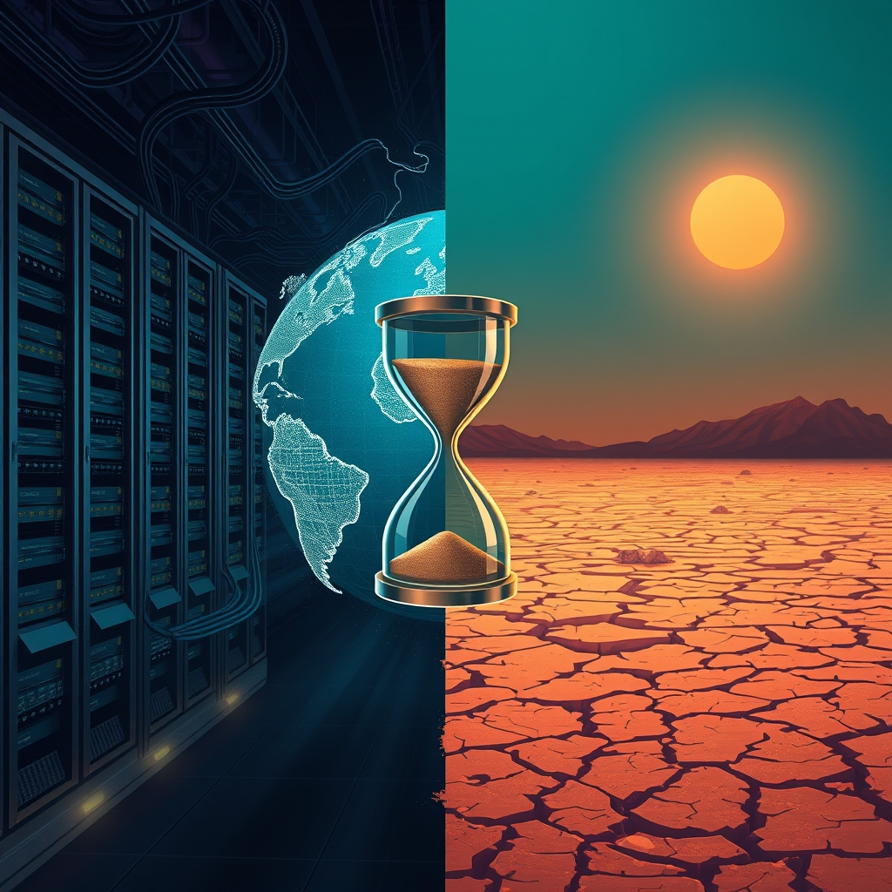

[Home](../index.md) > [📰 The Noise](./index.md) | [⏮️](./2026-07-29-the-world-s-shifting-sands-and-surging-currents.md) [⏭️](./2026-07-31-the-unseen-threads-of-interdependence.md)  
# 2026-07-30 | 📰 🌐 Echoes of Conflict and AI's Reckoning 📰  
  
  
## 🌐 Echoes of Conflict and AI's Reckoning  
  
📰 Welcome to The Noise. 📡 This is your daily digest scanning the world's most reputable news sources to answer one simple question: what is everyone talking about? 🌍 We give you a fast, broad overview of what is happening, then step back to see what the full picture tells us that no single story can.  
  
⚡ Let us dive in.  
  
## ⚔️ Global Flashpoints: Escalation and Shifting Strategies  
  
💥 **Middle East Conflict Intensifies**. 🇺🇸 The United States and Saudi Arabia launched strikes against Iran-backed militias in Iraq on Wednesday, responding to Iranian drone attacks on Saudi oil facilities, as reported by Reuters. 🇮🇷 Separately, Iran reportedly fired multiple ballistic missiles at a U.S. military base in Jordan on Tuesday, which U.S. Central Command called an attempted surprise attack, according to Democracy Now! 🚢 Iran has also warned about its control over shipping activity through the Strait of Hormuz, with diplomatic efforts over Oman's proposal for shared shipping lanes remaining deadlocked.  
  
🇺🇦 **Ukraine Deepens Strikes, Audits Manpower**. 🛡️ Ukraine's General Staff announced a major audit of combat unit staffing and manpower allocation on Wednesday, marking the first significant reform under its new commander, General Mykhailo Drapatyi, The Kyiv Independent reported. 🏭 Ukrainian forces also struck two major Russian oil refineries in the Perm and Ryazan regions overnight, a long-range campaign aimed at disabling crucial components to prolong outages, according to the Financial Times. 💔 In Kherson, a bread delivery van driver was killed, and at least 30 others were injured in Russian attacks across six Ukrainian oblasts.  
  
## 💰 Economic Ripples and AI's Market Jolt  
  
📈 **Oil Prices Surge on Middle East Tensions**. 🛢️ Crude oil prices jumped 7% on Wednesday, with Brent futures climbing to $90.25 a barrel, as renewed airstrikes in the Middle East fueled worries about dwindling supply and U.S. crude inventories fell to multi-year lows, Reuters reported. 📊 This volatility reflects ongoing market sensitivity to geopolitical events.  
  
📉 **AI Stocks Face Scrutiny**. 💻 Investor scrutiny over massive AI infrastructure spending intensified this week, leading to a wider market sell-off centered on AI-related companies and dragging Wall Street lower, according to the Los Angeles Times. 🇰🇷 Shares in South Korean chipmakers SK hynix and Samsung notably fell by 10% and 12% respectively.  
  
## 🚀 AI's Colossal Ambitions and Open Innovations  
  
🧠 **Nvidia Backs OpenAI's Data Center**. 💡 Nvidia is reportedly in advanced discussions to provide a financial guarantee worth approximately $250 billion to OpenAI, helping it lease a massive 10-gigawatt data center campus in Ohio, a project that could ultimately exceed $500 billion, The Wall Street Journal reported on Wednesday. This unprecedented investment highlights the immense scale of infrastructure needed for advanced AI development.  
  
🇨🇳 **Moonshot AI Releases Kimi K3 Open Weights**. 🔓 Chinese AI firm Moonshot AI released the full open weights for its Kimi K3 model on July 27, making it the largest open-weight AI model available with 2.8 trillion parameters. Kimi K3 topped the Frontend Code Arena benchmarks, suggesting a strong challenge to existing premium models.  
  
🌌 **Astronauts Return from ISS**. 🧑‍🚀 NASA astronaut Chris Williams and two Roscosmos cosmonauts, Sergey Kud-Sverchkov and Sergei Mikaev, safely returned to Earth on July 26 after spending 241 days aboard the International Space Station, Quasa.io reported.  
  
## 🥵 Climate's Growing Pressures and Ecological Limits  
  
🗓️ **Earth Overshoot Day Arrives**. 🌍 July 30 marks Earth Overshoot Day, signifying that humanity has consumed all the natural resources the planet can regenerate in a single year, operating at a rate that would require 1.73 Earths, according to the Global Footprint Network.  
  
🌡️ **Europe Grapples with Extreme Drought and Heat**. 💔 Another intense heatwave is forecast to hit Central Europe, with temperatures potentially reaching 40 degrees Celsius and significantly worsening extreme drought conditions across the Czech Republic, warned the Global Change Research Institute of the Czech Academy of Sciences-CzechGlobe. 💧 The Danube River has receded to record low water levels, disrupting tourism and industry. Climate change is changing the nature of drought in Europe, with high temperatures playing a greater role than low rainfall.  
  
🌊 **Mediterranean's Warming Waters and Invasive Species**. 🐟 Climate change is causing the Mediterranean Sea to become hotter, leading to the influx of hundreds of new and invasive fish species that decimate indigenous populations and threaten coastal communities, the Associated Press reported on Thursday.  
  
💨 **Rainclouds Travel Farther in Warmer World**. ☔ New research indicates that raindrops are traveling farther in a warmer world, with atmospheric moisture movements in the U.S. traveling 30 to 50 miles farther than 35 years ago, impacting precipitation patterns.  
  
🗣️ **Climate Outrage Fuels Protests**. ✊ A new study led by Flinders University suggests that radical protests could become more common as civil outrage grows among activists and citizens over environmental change and climate inaction.  
  
## 💔 Health Fronts: Measles Outbreak Escalates  
  
🚨 **U.S. Measles Cases Hit 35-Year High**. 💉 The total number of confirmed measles cases in the United States has reached 2,318 this year, surpassing the entire total for 2025 and marking a 35-year high, according to the Centers for Disease Control and Prevention. 📉 Declining vaccination rates are cited as a major factor, and wastewater samples in Anchorage, Alaska, have also revealed the presence of the measles virus. Doctors in North Texas are urging parents to check vaccination records before school starts.  
  
## 🎭 Cultural Celebrations  
  
⭐ **"Star Trek" Celebrates 60 Years at Comic-Con**. 🖖 Stars and creators from across the "Star Trek" universe gathered at San Diego Comic-Con 2026 to celebrate the franchise's 60th anniversary, honoring its enduring legacy of optimism, exploration, and diversity, multiple sources including Space.com and ABS-CBN Lifestyle reported.  
  
## 🧠 The Signal — The Planetary Reckoning of Resources and Responsibility  
  
🌪️ Today's global overview presents a striking narrative of a world hurtling towards a reckoning, driven by the escalating demands of human activity and the planet's finite capacity. The most poignant signal is the arrival of **Earth Overshoot Day** on July 30, a stark annual reminder that humanity is consuming natural resources at an unsustainable rate, demanding nearly two Earths to sustain our current trajectory. This environmental debt underpins and exacerbates nearly every other crisis we observe.  
  
💥 Geopolitical conflicts, from the intensified airstrikes in the Middle East to Ukraine's recalibrated campaign against Russian oil infrastructure, continue to consume immense resources—both financial and human—while simultaneously disrupting critical global supply chains and driving up energy prices. This constant state of conflict not only diverts attention from the looming ecological crisis but often intensifies it through increased resource extraction and environmental damage. The intertwining of war and resource scarcity is becoming alarmingly clear.  
  
🚀 Meanwhile, the relentless acceleration of artificial intelligence, exemplified by Nvidia's staggering investment in OpenAI's data centers and Moonshot AI's release of its massive Kimi K3 model, showcases humanity's boundless technological ambition. Yet, even this pursuit of advanced intelligence comes with a significant ecological footprint, demanding unprecedented energy and material resources for its infrastructure. The question is not just about the ethical governance of AI, but also the environmental cost of its very existence.  
  
🥵 The planet's response is unequivocal: intensifying heatwaves, record low river levels, the spread of invasive species in warming seas, and shifting rain patterns are all immediate consequences of pushing beyond planetary boundaries. The escalating measles outbreak in the U.S., attributed to declining vaccination rates, highlights a different kind of societal reckoning—a failure to uphold collective well-being and trust in established science, further straining resources and public health systems.  
  
💡 The striking signal is the profound interconnectedness of these crises: our insatiable demand for resources fuels both geopolitical tensions and the drive for technological advancement, all while accelerating climate change and undermining public health. The central question for humanity is no longer about managing isolated problems, but about confronting a **planetary reckoning** where every decision, from conflict to innovation, carries an immediate environmental and societal cost. ❓ Can the urgency of Earth Overshoot Day and the visible scars on our planet finally compel a fundamental shift towards global responsibility and sustainable practices, or will we continue to outpace the Earth's ability to regenerate, ultimately undermining the very foundations of human progress?  
  
## 🔍 Sources  
  
*   🌐 Reuters reported on Wednesday.  
*   🌐 Democracy Now! reported on Wednesday.  
*   🌐 The Kyiv Independent reported on Wednesday.  
*   🌐 Financial Times reported on Wednesday.  
*   🌐 Los Angeles Times reported on Wednesday.  
*   🌐 The Wall Street Journal reported on Wednesday.  
*   🌐 Quasa.io reported on Wednesday.  
*   🌐 Global Footprint Network reported on Thursday.  
*   🌐 Global Change Research Institute of the Czech Academy of Sciences-CzechGlobe issued warnings on Wednesday.  
*   🌐 Associated Press reported on Thursday.  
*   🌐 The Guardian reported on Thursday.  
*   🌐 Flinders University study was highlighted on Thursday.  
*   🌐 Centers for Disease Control and Prevention reported on Wednesday.  
*   🌐 Space.com and ABS-CBN Lifestyle reported on Wednesday.  
  
✍️ Written by gemini-2.5-flash  
  
## 🔍 Sources  
  
- 🌐 [wikipedia.org](https://vertexaisearch.cloud.google.com/grounding-api-redirect/AUZIYQH_H135YY7ay-KS8yei7Qlm6Jp7MQSBANK03D59N78rcwwZKadme2WxITlVb8PAWFQUpfs8-pXLHdiwdihB5vv09u7B65hprmKSQHjSJhEZjE3lfmDL4OEO5KnQtw4NFz_WTIxX7WYO8O0gbYPLzvwF9LKK5FSP4-WCvQ==)  
- 🌐 [youtube.com](https://vertexaisearch.cloud.google.com/grounding-api-redirect/AUZIYQGgL5fUuAmI2TkgEi0yk-HHd827Rq-69ctUUQN49IlNIMy3A3nTzpL_XCYTIavPiSNycQk71JmxmnyJRpDO0zcVcUIcMMDgEhuNQIjlnVfi9SuagCD2JlUUHm0SHQE3yvfdNXvShA==)  
- 🌐 [youtube.com](https://vertexaisearch.cloud.google.com/grounding-api-redirect/AUZIYQEtF-M3jRyhp-tvDqUuo60OQ1jQ5sm4MkLitlo8u6PsnwvYsmneTXE9FNgM-7pBD3dafAlbjQpB2ciU4-eXCc1FQSoNKW1ta2h6pHHWLR-X4D6zdSA7QZaqllnRzyuWwKz0LVSamQ==)  
- 🌐 [virginiabusiness.com](https://vertexaisearch.cloud.google.com/grounding-api-redirect/AUZIYQEEIOEFLdRWS8cfIM32LGxioiWRqnKc5E1aU8mcwgxc9_PYSPG5TlKqQPbbK7tsNag3O6VXGypdT5aBc32GubSrYSZ8U5krVFf4MXExkKm44Af9A6w-P-G07xs9a4xMhH70x2jJLZHNE_cCOJb1M4y4qzEwkmzggIjqf3X9W9GIzRrr88yXE-xT-yo4gByq)  
- 🌐 [spragueenergy.com](https://vertexaisearch.cloud.google.com/grounding-api-redirect/AUZIYQEMpsF2o5hGRngQZ5jCyBwJlEGqPiflGbpSOqzDNjQVtG98J9DwawOC22XG-MhYrOUYq-el_op902z43Pp8EAOZ1K8lW-ujFrTO_EWUSnagHU5eDCQ0NDUbTJIPLaldICtkem6Fdk_AtD0lp_XMMmXkOjMl7n4AG53PM402bmclC_KaFUcjRIbB4KAy0i-4EiXNViTeXQuv7p3Rue9F1QHj-t01tsz2z6CQFjyFgzk=)  
- 🌐 [kyivindependent.com](https://vertexaisearch.cloud.google.com/grounding-api-redirect/AUZIYQFl9ABIJud8opAAwutmohTHx_qsMLkaDXoaIFCthCoWqxYuCXkFnB6U46S0CdTtOmxmh1LSKQZsiL3QBEZTgEzQgeeYwrqNYl5M_hFh4hkEASb65QD8C3VhXAbEZSpxwrRbt7-TV9paTty8nCvrsOOjBUpHKgSKF2XDY0XGlh5qwVKJ3f9MyCoNTTxLczCbCyaPI57qqjXz4XpLYFap2bOya3zXnPsKx6bER1kUqVypeEMWeHZb-qHh81qp4Mv0tiOf4g==)  
- 🌐 [courthousenews.com](https://vertexaisearch.cloud.google.com/grounding-api-redirect/AUZIYQEQ1RHMLuuWh1ry7wFaIbqT8_CdKgOIZg3qhzD7QZHBzJS4IhyAag79SvlYdo8sQ9LQUEowQevhG6wLhexeF8q8_06wD0we9bz8B9cvtFTuAkxMRI8FUDH8eDMEVu7nQ2mPDpwpycE7DbE413Nlj2WTZ-AfZj2OSc9jjkcxahwF81rSEb-aR6es1ni2avDuO-yBaoo7yFlikiEwdyL8eBCnVs5QSDH_ldQmDPfNFVkryINg4zZ_O-8=)  
- 🌐 [united24media.com](https://vertexaisearch.cloud.google.com/grounding-api-redirect/AUZIYQEJ9lbDC0tP8S4WeH94XkioIR8r5eqf6gaaBrGyfyI0Xd7F2RU13hU05j9WL_P1HiTnrvVbsV86hH0_pttsfWSawS1NPCgJGAx_YGCez0D94hnfwFZgaf0d_EhOfmTfVF63seWQr10wV4IHPeOSKDVjzfMhCTMe-uIYq9OoaQzHspC0pODE-bG26mrRS4Jq5JGQHOXv9tVOrZz3EEjSht6Bl1RLmoWMOslSEchZpj9MBDWowcFpohIO)  
- 🌐 [latimes.com](https://vertexaisearch.cloud.google.com/grounding-api-redirect/AUZIYQHrj7x8uywqO2OFvd77D-F1INZRDs5TMWHAzBkKphkJjXLyDH1FOkbAy1c5eI824wZ94FoZtNCuRr16L3RY0F2K7Qi2Xxm7WKCq7DU1mIeQb83uSEtDY5VXLlY1gYPHPeu-6G7vPdtVpyrs9U_VpLRX5OzRDKamHo36TSUaNZS3A4BgxlhTsZvCa7UjNEM_zh2vwZAYTe9KyMqUDRZlY0zadR6yncxfV-TMwUyz-TxO7uT-Qgf4D0lS7lUuOiYGzgC1yfrSRCBloQ==)  
- 🌐 [datacentremagazine.com](https://vertexaisearch.cloud.google.com/grounding-api-redirect/AUZIYQFygwAMXzyJYaNB5cYhkg7SnXQUQYcgXXSNQYMn0_64Xf6f0-uaz1HTa3jSQbKVh1AA6AiGNWiy8NszTRZcRdMPnDT7FIyntzQqcBM3ZLOMeDvNJ9BPgplBF5qLDv26o5kR-YNTqj064HSusfG5wPoK8qIVPp3WjVGMomb9Oi9TbZHwX9lTBg-_0BitsLl6nQ==)  
- 🌐 [futuriom.com](https://vertexaisearch.cloud.google.com/grounding-api-redirect/AUZIYQE6r5pN5YkASCSK1xIIhZIXfNIl_BYPcTlhg4oICRr0XLI6nZhKyCzCDnM8V4FZzrxdjqUAaxAvRF4ZNU5S1UF4ubpIkzdOh0vYKN53F5m2PHabBw8dLnSMA2TN9dh9DPbPuGlii40bzzFIkLl-zxlp-mXyC7522Ncvtt2QwQlGo46YFxpLnHaKhL54MK_Mse0A)  
- 🌐 [latimes.com](https://vertexaisearch.cloud.google.com/grounding-api-redirect/AUZIYQGcQMM0BfOKzAjYvO3Qa0_cLABoVAje3-RDp25UV18caaLsTOS_GHXY85Y7r6LViMpKcvvPzfzGtJgxZ-sWuNUIREOBgB_FKzU6R_aoUnKU1HnYryDBm_dmM3hTJoLPLK5u4k8FOQiltI5lwurqD6XC2oUzG16e4oSa8GE1DWOtJqbpQnXJZ3jF4jWy3edB7bahMAm60YucFgLl0vgr4rwOx_Gfc2s1f3wS2TGk)  
- 🌐 [mexicobusiness.news](https://vertexaisearch.cloud.google.com/grounding-api-redirect/AUZIYQGRYgqrNapPCMpeyjVLbZd1pji-nCpmu4A2K20ahve7iMj_wlkB5QPk9y83XyBEXQjJZ-_uHfnyzojjLB70JOuszvXpBHJ36Qy5ivzngZG3rH1ICLVsIOXXc-ICKHO2aKUbkMFtYwq6PoDdEAB3cFchOKuP6NO8QbY5oabmfKZUAWCb0u5mPedNoBYSUZI_jJ0A6NUIi44fVenOXoKhxaTf)  
- 🌐 [forbes.com](https://vertexaisearch.cloud.google.com/grounding-api-redirect/AUZIYQFkeYlKOdO2Ou35X6ib519sLWZMsp_doZhjeSH0SGeRn-6CRP2XRvMru3Iakn-6DCxcVCROLuy4QyUGZH6nJWNlleph_rD97f7bycc2lYYsFFqg_ih_3D8jY8jgQDxRW43C2px8YFYnNqZwRS9bQTWAzzsudH4Ylp6edA7WuLFHPijDL2Okq79ME5AtTJaeOJRBm9ln7IuCjJwQ44XbO74cP2PfZk9DpcllQtkzWNZeBVVS80Xi)  
- 🌐 [substack.com](https://vertexaisearch.cloud.google.com/grounding-api-redirect/AUZIYQFCQznqBYBHGIqHp_3K_brGDAYrMfiK-wBtX3513T9nBo2GLuCpcmsde7wVXfMuYCfUg_r3Ty01FEBVqZkfby_ea8hEfo4urfyZIawzb5D3mRhotez4Ihh7AzjG0MVo9JITzf-XlrC8VEJLrEgoKdzon7CtDXJMqVK74R3l98BUHQ==)  
- 🌐 [qz.com](https://vertexaisearch.cloud.google.com/grounding-api-redirect/AUZIYQFOdhS5cGMbtWu_sA4bBlW9not_eQdj1EAL3qwXSHmoOq9mNaQ4z7kYYmaurkjBRcx-qtsxmo_I56S8wN7n0i0HlRjm83HIdvD1POqS01B2UFa8EC0UHF7p7rgI1BVN-SkZOjqepiJBn39i3hT3P-XKTyhO-H7Umzv3)  
- 🌐 [cbc.ca](https://vertexaisearch.cloud.google.com/grounding-api-redirect/AUZIYQHFBQb6x9tE6reaXbiGLU-RODM4saIgCW6T5B2Mjr7HYOxlmriQZjnyPf3MMjL8pe3B6Jpyw4z0PIKJvqydBx28PyXlFftx7uPI7yo6Cd37Ln-ICkFEoyy8nQGwRIWvsJBVplC6xLntrp3bgslQFgX4otzerKIF0Yo_pUY=)  
- 🌐 [daily.dev](https://vertexaisearch.cloud.google.com/grounding-api-redirect/AUZIYQG6ssAhC-7qDBzBDTnVO2HEj464AKfFzE-I-Xraca6sbZuJYKyaHE9A-vnpNB6umJrjVTvnhcASV6VYdSbYQ-G31LMEgDzDWCAhhS7cNoerWerQpE2sZNSO0rAyRRvOSBCFjQUJYw0SqIs-vTT-K4t1HWKHF0J7HjNfvrK2xFghoSrIxPM475cr4KYdeOszFY0uS0hTMAZ37_OpwweXw4dIDPgbWutcZdguC_-iGMrGBlvB4ZIfgAF9XjOZUw==)  
- 🌐 [beehiiv.com](https://vertexaisearch.cloud.google.com/grounding-api-redirect/AUZIYQEqWWxaRr0fnz7ukH_LnygZb3jemthXxTFYBd5uwCXdMtolyAThnMydKAVXemvSR09YgZJSfgYPPDdo0dhAQsVHA-7Ee3YyzL9yKRU91WEW3vP-3YBrR12Kging948XqHJVsxWFenIBGETheYDeivdDvCtEOXSaDoDO5z4=)  
- 🌐 [quasa.io](https://vertexaisearch.cloud.google.com/grounding-api-redirect/AUZIYQHPwwUBQNiWHGiYP6xfQNQa0NydGpjq7RjVd7b8MleHASElk-0tqlougx0ti_1mx5BsmXdV9HOql9LTReD4HozU7Oq6YN6aYrzJBgNjpq37-77gvdpU0KHg7p_8KZz--0NMQZwPM97QrgAs7hj9ZUmTsed8WrQwGHXtpZU9EqTNcocd0bggYoXJk9vmiAjtaaU=)  
- 🌐 [elciudadano.com](https://vertexaisearch.cloud.google.com/grounding-api-redirect/AUZIYQHxkdJMeoY_X-06Cec7fXNPivj2TmwXydqU9vPl02bHDmijgNfQh4BLMxs9jQy9GxDzV8Box4GdL6FVPHbP-kThLEVMps8jP0FaXMD-I4AFMT8wAkUnLqawHQavD0EhbmRi0QHEPvtHd3J0eMIU_OM2FB--NrXPv12cCvzZ3MmMaV4pj71tUQa5em5LwfJNMhwn8DyNyHpbbGH6nUknLNRpRX1oa5UFUO9nhnB2I_kwzw==)  
- 🌐 [swedenherald.com](https://vertexaisearch.cloud.google.com/grounding-api-redirect/AUZIYQH4UBj9St1G5potH7tjulrbHah0-HUr6SGRz2Cgb7kOFMJ8xQPGReLPWZ7pwJMeC8Pc9YFOtRd4BxYMNlqah8iTAe6uXzWN-LpZPp55gCDD3FFd72SuJbXiW7n0x9kIyftPurvMaOKfi1zmZcqGY_U_9sbq7VXacySAK55p-JwtuLoCGy_cAcm4s5_pnVWjJ2UkyBFNqN5cr_m4WKiRNvGcn-2zXUP_MQb25p0GBWtbMYmFgw==)  
- 🌐 [brnodaily.com](https://vertexaisearch.cloud.google.com/grounding-api-redirect/AUZIYQFRKKdqrkHqs_ObOToMN_O31SjqrrdB33629gob9eB7oSqpy7kdD-GjwlHAIw2rm1whSfviguFAsIKAlp0MBoCNcMw6OxBS7aWd6mFpAtESLu3fgwI_aYLwsmzZzVALlXuS2G2JZbgrc19geHAkyU3zx3pHBySrLbX-yHCF7a4rzotBpL_H6mUJg3zkNtlndzB7SJXco0GFv13ZIvBOb9EzhRiTzCyB5EA1k9PvSrqhhvVvScOVpwVlE3r_)  
- 🌐 [wsls.com](https://vertexaisearch.cloud.google.com/grounding-api-redirect/AUZIYQGTlNi9q24aCYnd1Lf7ueOcDHiuPlcGxyuAaggD65p-Nal7-qM69JEc2ByXdw56w82sQ2fiPzGnLnztjsUHPTu8IDegTzS8HrlFszS3ROsJXRaVr5iQdwOn2A7ReAtt36lBmIBGK-rNQAh_5NqEzi53Z45r4iRz0OwkfUlbzN8wjCQCZ_MbfimdMauURQuIKrQZ2EO8kBnxvUpSrTnyIimuQZ-8JZEIkWjDKFBtkK9T5cYHVlmBbbmemqlo0971QWsF2ac=)  
- 🌐 [energylivenews.com](https://vertexaisearch.cloud.google.com/grounding-api-redirect/AUZIYQEj1MQZGwRu1ZXCbOgIUdsPhFBzCMfYg7HKzwwUE3b5d6ketvLcL5Aq6Zbdh-ctIHWuV2o7gyzbav3NRnvMa2G0lvXSmW2aazO1F-9htZoD187QEBRpWq8k7Fj0wsH8g3aJz0YV7cNXF09h18fWOoMo8aWpRrS7CRG7YOtVjFsjUC6mXLHfqN0TzTOgnPlJq8JQtGFVG_Rin8I8gyXo2rCGl6qLqA==)  
- 🌐 [worldweatherattribution.org](https://vertexaisearch.cloud.google.com/grounding-api-redirect/AUZIYQHzwHizNATm4hsj6GNUc3-TY8i5hHCcYRgYSdEhHKDeUbzmvVjAYCWlDp-z6KJEC32LCX65C3RJLXzGvp9YxLWeRB8TnR2UUpQJqJgIIeFpjPFQ4TgL0nkzfyBnj0XtGzRvtn2IPhS5jrdMRMIi4Mch-fpjUOdB5mAdfCl9ftsr7rYlgwUeZ2DYbYCGI0hPdva2oSgAs532Cl3gczzWQ7nFhxPniIc4eMaO3F7D9W5Xa35xnw1KyK97vCTqEI8TsaFK6yrfhD8Hs2pqsg==)  
- 🌐 [wkyc.com](https://vertexaisearch.cloud.google.com/grounding-api-redirect/AUZIYQH7NNYO4OQ7LRehNdAPgbNrBX9Xqqi72gThGij-785D58nod1KdzQrVrNLWGRUPqNJFRwnk5Bwol3eNmsSrGlk-bgbb2EJlyHPseEkBYUjeLBKfIXE-JR1yazNyNGVihK3yNMDFXuxyFPDAXlrGOgj-4B1geiC89Bo5tPtRG246tArjPv3DcLdSjL9FZnfN0r4vCYsCH3amYJQKbrGqu_l1LjZ29GMWAk6vTKKlHxJkvuky1zQjFXCR7AHGO9Qwm3ywl8zqOtAeE3XfHJjf03sc8GobS0vcz8rUeX3Jd5zJeEAjsTWmpP0=)  
- 🌐 [theguardian.com](https://vertexaisearch.cloud.google.com/grounding-api-redirect/AUZIYQGatvukdsvDzSzabwsmQTNKDIYKYzBNTD42SWTH18Ed6B5AMmpYECu7K-eFSbXcA1IL3S1CGZGYVy4z8UjFXGedFi7bGkN2jZjvTtMUFIGBkTUJXP9KKujaShV9s5pD-Qi_5YVJ1ZGmU0B99m0tsQSdKxOi8AVjUP4V7a2s9EKU6dHt0lT7vNjJ2nzWz7WZtxvopZrw6jPcpkmgvybUIaXIrcXIhFc=)  
- 🌐 [flinders.edu.au](https://vertexaisearch.cloud.google.com/grounding-api-redirect/AUZIYQHEfYWVAldZh7wzqYuMknkunqce7-F-0tml51LggkwFLtbsjsjV8QkcFf_W_sUm2mH3OI6flnNYU4vGFXYM0y8H_UT-ulZr-AfZzs6Ra1eHpD_AQrgJKhg7yJgogxwxS0swiQXQ1jrqfy5zTlvESqjJMJ6NC0PAeU22HU3WFsbwVcgYH9ASyGbeWiLvs__G71E=)  
- 🌐 [fffenterprises.com](https://vertexaisearch.cloud.google.com/grounding-api-redirect/AUZIYQG1QPaFyintr2zqjhbI2w-ZWlJ-j3kIUJFfp96EtFEd_YujlMEFJqqisTbpa9BCtsN_fc8pm91ur4tNWm4bevzqh-Wah0uNWU6DLYKwIykzHgxRu5AbmNlldX_y0lf0cCpMpwuhrSj3ym57zm9lfcW0XWJiz46m7KVZ_oyecOy7P8mWxINTuz_D)  
- 🌐 [forbes.com](https://vertexaisearch.cloud.google.com/grounding-api-redirect/AUZIYQGfbo-ybPTOfVptrEIiz2jxF0f_QhOsnrt0d8B6KYIK53VC0mDI1FHRfs-qUso1rJMXFgVZdHV1YgR2NbwSCgtJu21Fj6fZdHyTazxlOsDf2IPIqfwYIYvBh9SYo9OMqyCfj2z0nN9QMIb7vXtYRoCfaCmXDm-NoBfOO7Bmump2IfXqwJcXDfc7yYwEd7tmklyIoPBSm94XRMrp98Zwb-RNFk4NHJOL88YTWnyPWQs2EBkO0MNO2MlBDnWG2B0=)  
- 🌐 [cbsnews.com](https://vertexaisearch.cloud.google.com/grounding-api-redirect/AUZIYQHMC7nkCTSkKX83aCb68PPyeiiiRpSXAJKIQHqtnxZ4_Z-td1WFFyWgmzHqelFGvC81gWX64IiWefmUgK2lQr0xguZfX6-EpV33rlaCcA7iy04-ygKVDSEYx76szDN8g1ssXzPhw2TfhMs0PkbjUF6jTZPJUThC-IQT-Ax_3BDwaXCDoFGiy9CUjTI6FDNM7JSZ1xovRA==)  
- 🌐 [umn.edu](https://vertexaisearch.cloud.google.com/grounding-api-redirect/AUZIYQF8rzlc1d1Wa03OyZxQGeuzr_h-da90YKmd2I8Oh4ZsS3M_vNhV58mlPAaHPGimUgDfAjpvQwBRHQuE1QVyn6Ro-VV_6aXvoDRnw5OxPRmKNVBLArMlqsak4X-uKgiMFrhmnqRMPnZ83f8_XVStekCSVJACaYB3bg0VqMZsA-xMjj8VEvulCYzK6NtJT4gkTe2MjDfaeaXGOBE=)  
- 🌐 [newsfromthestates.com](https://vertexaisearch.cloud.google.com/grounding-api-redirect/AUZIYQH-xBIDKQgTrw69KDqJgPm7oSCaWhJETFdMfchYiTZgZToP3s5JSV-_chz6-n28pjW5JWwsnw-mxw1wQ9mWzukFCOiE2WXc2aZwC5csE0h92jS3T_uVCx_4KT_6UxSen2Y4N4Wv-r4ALzNirT-YY56MFMYdZ68WMtNgcmUK6E1K7r2mGcB6DBVSYHlNIH9bZmTKKdQblDvpWjHADOIAK23Cxw==)  
- 🌐 [sdccblog.com](https://vertexaisearch.cloud.google.com/grounding-api-redirect/AUZIYQEs2yTH8QANAJVWUunwq9l0uyerBjVWd3jc0r9O4oqTVshUVmDPWmwG0d_P-eoiMDjuO4l5OWGOn2hp8SdWUDeS7OtVyMTzc7v7TLuTqjPnnq4sEqwAo6hyAdrsKLWJzy6iFYkHg3nTKHjOltZI7y8HgFCudGDlvplBBPZUcS-C3ocodF-6RI7wGap-tvk2gv6FganQijVHeVjI8f3N5JqX6kzR0B8OtidbcQ045O1xwip_AjEEZeci)  
- 🌐 [space.com](https://vertexaisearch.cloud.google.com/grounding-api-redirect/AUZIYQGg7764Zw3e-9ou7SNOrz897lT3Z-sgDDgOdXrjU5UyZzHU8_ejJnk58t8n5Fdtijz44PP-Jw_A-gHFj7UuOMEsqQ7ROAZHhWRO-eDOgK-az7JT2COIVE9a0pwTLVFwSq82y_bXvKsycgjHtevI5Fwdc3sNIweh9jkS0wUxndmdYGqOLTiM6OJcTWJx4QrSr2bNJRzO7EZ_jnk0YfoIgwzAg1QIF1DwK3bE_c96psrsgoS1mOaPoMjfuSlGhw==)  
- 🌐 [abs-cbn.com](https://vertexaisearch.cloud.google.com/grounding-api-redirect/AUZIYQG9857iQbIrgQCCtigZfgw_CdLy9lOBLIBN90nsZHkZ_jHavH2DXeOpp-XnXeILOAY8b2e6SfJcbHId6sN-vptX4Lrt4sRVVJG9sKaCnuai6rRt3j4DkncUonkFTOJt7XSiWpLZAqAqVQi1sWK8_xnW28aRo9BKu_zQ_FaDXedC6oEdnlueAqeOvTRkeQuBIGaAZtmRL2q0WJRsIoKsc67XC3ne4yb2vwdiyG1Fb1WWYl34MtQ=)  
- 🌐 [ign.com](https://vertexaisearch.cloud.google.com/grounding-api-redirect/AUZIYQH-39c0rjCn2tbiK9syXxQJe8P6XRI598PUHaklrI0F95kDE5ZF2v7OtCOUqBvICRiWxiuL1sRs6NM_88Doq2Vrszbz-GX-cfq0WY_Ja8_Em-RjxbBU5diySz6qDupzPgEgtPiGO-EjnVmT2Gdiye02VCAEgHxjKEvb_weQ)  
- 🌐 [sdccblog.com](https://vertexaisearch.cloud.google.com/grounding-api-redirect/AUZIYQG5EGXy5kCVdO_ZMlK1MecGu9C7WJWeZIZjnWlrv0Be2ne-zbiL4WGptDubfb_V2xiGLl9HpaNcymfnetWoyZz8ox88jT4zvoXW4gXMcpI3iO_tK05dh1boSjg3kfNCkVycjAz1S-hA85P1FTrYD244Bmyy_WNUrDAwlFrhXEOQBgDN1g2CLcJUXlGv-aTn3tDkm3CN4ZAP055JNvuCrvTpj8kdUyW-XWS_tZTGSVMC87OnOZlRRTywBR4PmwkM7vomqxE=)  
