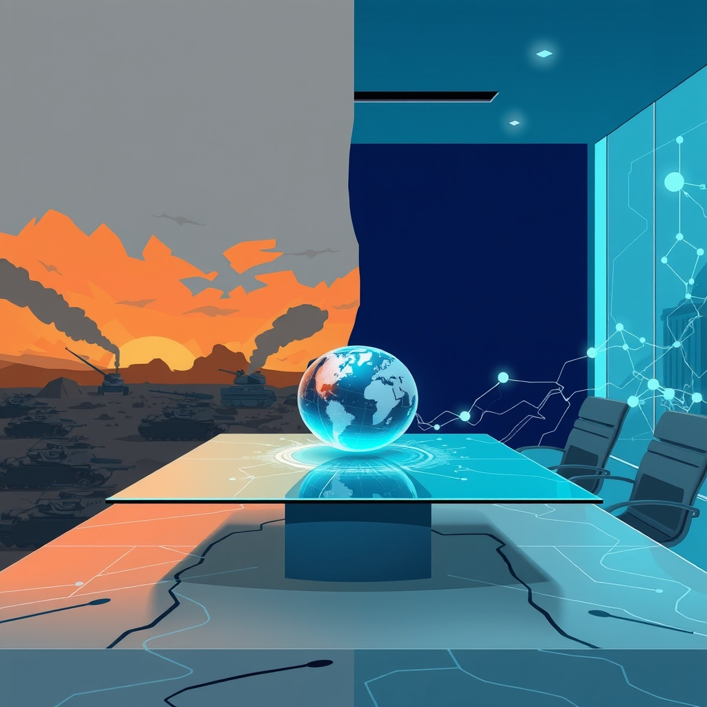

[Home](../index.md) > [📰 The Noise](./index.md) | [⏮️](./2026-08-01-unsettled-horizons-ai-s-dual-nature-and-persistent-global-pressures.md) [⏭️](./2026-08-03-currents-of-control-and-cascading-consequences.md)  
# 2026-08-02 | 📰 🌍 Echoes of Instability: From Battlefields to Boardrooms 📰  
  
  
## 🌍 Echoes of Instability: From Battlefields to Boardrooms  
  
📰 Welcome to The Noise. 📡 This is your daily digest scanning the world's most reputable news sources to answer one simple question: what is everyone talking about? 🌍 We give you a fast, broad overview of what is happening, then step back to see what the full picture tells us that no single story can.  
  
⚡ Let us dive in.  
  
## ⚔️ Geopolitical Frontlines and Shifting Alliances  
  
💥 **Ukraine War Escalates with Missile Barrages**. 💔 Russia launched a major missile and drone attack on Kyiv, killing at least 10 people, with Ukrainian President Volodymyr Zelenskiy stating that Ukraine has run out of Patriot interceptor missiles, according to Mint on Sunday. 💥 Separately, a bomb near a Moscow restaurant killed three and injured at least 21 people. 🗣️ Continued fighting persists in eastern Ukraine, with tens of thousands of casualties reported in 2024, as NewsNow detailed.  
  
🕊️ **U.S. President Halts Iran Strikes for Peace Talks**. 🇺🇸 U.S. President Donald Trump has reportedly canceled planned military strikes against Iran to allow for peace talks, indicating Israel has joined the commitment to finalize a framework of a peace deal, Anadolu Ajansı reported. 🇮🇷 The potential deal would include the immediate and total reopening of the Strait of Hormuz and an end to Iran's nuclear threat. ⚠️ However, the top U.S. commander in Europe privately warned the Pentagon that he lacks enough naval forces to defend Israel from Iranian ballistic missile attacks, The Washington Post reported. The Iran war continues to be a major armed conflict.  
  
🇮🇱🇵🇸 **Gaza Recovery Efforts Continue**. 💔 Gaza authorities have recovered 112 bodies from the rubble following Israeli strikes, which also killed at least six people, including children, across the Gaza Strip, Al Jazeera reported. 🏛️ Israel reportedly targeted the UNESCO-listed Beaufort Castle with 700 tons of explosives amid Lebanon escalation.  
  
🇪🇸🇲🇦 **Migration Surge in Ceuta Continues**. 🌍 Nearly 69,500 migrants have returned to Morocco from Spain's North African enclave of Ceuta in the last 30 hours following last week's mass crossings, police sources told Spanish news agency EFE. 🚧 Spanish authorities have begun installing containment barriers at the Tarajal border. 🇪🇺 European leaders are pushing for urgent talks on the crisis, while some reports allege U.S., Israeli, and Moroccan influence in orchestrating the migration surge.  
  
🇨🇳🇺🇸 **China Condemns U.S. Entity List Additions**. 🗣️ China strongly condemned the United States for adding more than 40 Chinese entities to the U.S. Uyghur Forced Labor Prevention Act Entity List, calling the move economic coercion and pledging to protect its companies' interests, state-run media reported via Anadolu Ajansı.  
  
🇹🇷🇮🇶 **Turkey-Iraq Oil Pipeline Agreement**. 🤝 Türkiye and Iraq have signed a one-year agreement to maintain operations of the Iraq-Türkiye Crude Oil Pipeline, preserving a strategic export route with a daily transportation capacity of up to 750,000 barrels, Anadolu Ajansı reported.  
  
## 💰 Economic Currents and Market Shifts  
  
📉 **Global Markets Grapple with Conflict and AI Slowdown**. 📊 U.S. stocks sank as the Federal Reserve opted not to raise rates, while oil prices soared due to renewed fighting in the Middle East. 💻 Slumping AI stocks are also dragging down markets around the world.  
  
📈 **Oil Prices Remain Elevated**. 🛢️ Crude oil prices surged more than 20% in July, the most since March, with Brent futures nearing $88 a barrel. ⚠️ Middle East conflict risks intensified after Iran claimed it struck two tankers in Hormuz, contributing to supply fears.  
  
🇯🇵 **Japanese Yen Sees Intervention**. 💹 The Japanese yen surged past 160 per dollar on Thursday from a 40-year low, amid likely intervention by the Ministry of Finance to counter recent pressure from high energy prices and interest rate differentials, Trading Economics reported.  
  
🇩🇪 **German Economy Shows Mixed Signals**. 📈 Germany's jobless rate rose to 6.4% in July, with over 3 million unemployed, but the economy grew faster than expected in the second quarter, expanding by 0.2% sequentially, T. Rowe Price reported.  
  
🇨🇳 **China's Manufacturing Contracts**. 🏭 China's official manufacturing Purchasing Managers' Index fell to 49.2 in July, marking its first contraction since February and indicating weakening production and new orders, according to T. Rowe Price. However, exports soared 62.8% year-on-year in July, driven by semiconductor shipments, Trading Economics reported.  
  
🇺🇸 **U.S. Mortgage Rates Climb**. 🏘️ The average rate on a 30-year fixed mortgage in the U.S. rose to 6.66% as of July 30, marking the fourth consecutive weekly increase, Trading Economics reported.  
  
## 🔬 Scientific Frontiers and Health Innovations  
  
💡 **AI Advances in Medical Diagnostics**. 💉 An AI-powered blood test has shown promise in detecting liver cancer across distinct populations, according to Medical News. 🤝 Mayo Clinic Platform and Einstein Hospital Israelita are also advancing global AI health innovation through secure data collaboration.  
  
🔭 **Space Telescope Mission in Trouble**. 🛰️ A private mission attempting to rescue NASA's Swift telescope is reportedly spinning out of control, Science News reported. 🌟 Separately, astronomers have accidentally discovered two supernovas that exploded from a single star system.  
  
🧬 **New Medical Breakthroughs Reported**. 🩹 New wearable stickers are simplifying cystic fibrosis diagnosis. 👶 A study of 2 million newborns tied skipped vitamin K shots to a higher bleeding risk. 💊 Cannabinoid pathways may offer new targets for kidney disease, which affects 850 million people.  
  
🧠 **Brain Research Unlocks Language and Sensory Insights**. 👶 Eye contact helps infants 'tune in' to a speaker's brainwaves and learn language. 🐟 Research also uncovered a hierarchical sensory processing system in the zebrafish brain, suggesting a shared logic of sensory processing across vertebrate brains.  
  
🦠 **Mitochondria's Role in Fighting Infections**. 🔬 Scientists have uncovered a new role for mighty mitochondria in fighting bacterial infections, including drug-resistant superbugs.  
  
## 🥵 Climate's Persistent Warnings  
  
🌡️ **Europe Endures Hottest June on Record**. 💔 Western Europe endured its hottest June on record amid a historic heatwave, with France and Spain particularly affected, Earth.Org reported. 🥕 The drought and heat have also hit UK vegetable crops, leading to increased imports, The Guardian reported.  
  
🌍 **Real-time Climate Monitoring Available**. 🌐 Interactive global climate monitoring tools are now available, providing near real-time updates of air temperature and sea surface temperature from the Copernicus Climate Change Service.  
  
## 💔 Health Concerns and Societal Challenges  
  
🏥 **Ebola Treatment Trial in DRC**. 🧪 The first patients have been enrolled in a record-breaking Ebola treatment trial in the Democratic Republic of Congo, The Guardian reported.  
  
👶 **Hospital Routines May Undermine Breastfeeding**. 🗣️ A study found that hospital routines may undermine breastfeeding, underscoring the need for support for new mothers, Medical Xpress reported.  
  
## 🎭 Cultural Landscapes and Sports Dynamics  
  
🏀 **WNBA embroiled in Trans Rights Debate**. 🗣️ The Women's National Basketball Association has become a battleground for trans rights following tense interactions between fans of Indiana Fever shooting guard Sophie Cunningham and a Seattle Storm co-owner, after Cunningham made comments about trans athletes in sports, CBC News reported.  
  
⚽ **2026 World Cup Continues**. 🏆 The USMNT has won its first two matches at the 2026 World Cup, Complex reported. ⚽ UEFA has declared FIFA's leadership has lost the confidence of the football community after FIFA abandoned plans to sell a stake in its competitions.  
  
🔫 **Southern Idaho Shooting**. 🚨 Multiple people were reported dead after a shooting at an In-N-Out restaurant in southern Idaho, SFGATE reported.  
  
## 🧠 The Signal — The Intertwined Nature of Progress and Peril  
  
🌪️ Today's global overview presents a striking tableau where humanity's relentless pursuit of progress—be it technological, economic, or diplomatic—is inextricably linked to the perils that emerge, often as direct consequences of these very ambitions. The world is caught in a delicate balance, where every step forward risks triggering unforeseen instabilities.  
  
🚀 The rapid advancements in AI, particularly in medical diagnostics, offer tantalizing glimpses of a healthier future. Yet, the broader economic impact of AI is seen in the slumping AI stocks and market anxieties, suggesting that this technological revolution is not without its disruptive forces and investment hurdles. The narrative is one of accelerating innovation that demands equally rapid adaptation from markets and society.  
  
💥 Simultaneously, geopolitical tensions, exemplified by the volatile US-Iran situation and the escalating conflict in Ukraine, continue to be a major source of global peril. While the U.S. President attempts to broker peace with Iran, the underlying military readiness and warnings from top generals underscore the fragility of such diplomatic overtures. These conflicts directly impact global energy prices and market stability, demonstrating how traditional power struggles can destabilize modern economies.  
  
🥵 The planet's persistent warnings, particularly Europe's record-breaking heat and drought, serve as a stark reminder that environmental perils are intensifying regardless of human political or technological endeavors. These climate impacts threaten not just ecosystems but also food security and economic stability, creating a backdrop of vulnerability against which all other human dramas unfold.  
  
💡 The striking signal is the profound interconnectedness of progress and peril. Our technological leaps, while offering solutions, create new economic and ethical challenges. Our diplomatic efforts to mitigate conflict are constantly undermined by deep-seated geopolitical rivalries. And all of these human-driven dynamics are playing out against a backdrop of an increasingly volatile planet. The fundamental question is: Can humanity develop a more integrated approach to its challenges, one that recognizes the intertwined nature of its actions and their consequences, allowing progress to be genuinely sustainable and perils to be effectively managed? ❓ How can we foster a global mindset that prioritizes long-term resilience and collective well-being over short-term gains and fragmented responses?  
  
## 🗓️ Weekly Recap — The Accelerating Vortex of Global Challenges  
  
✨ This past week, from July 27 to August 2, 2026, has woven a narrative of accelerating challenges, where geopolitical flashpoints, the relentless march of AI, and the undeniable force of climate change have converged, creating a complex and volatile global landscape.  
  
💔 **Geopolitical Instability Persists**: The Middle East remained a critical tinderbox, marked by fluctuating US-Iran tensions that included both calls for peace talks and continued military readiness. The Strait of Hormuz remained a point of contention, directly impacting global oil prices. The war in Ukraine saw intensified Russian missile barrages on Kyiv and Ukrainian drone strikes on Russian infrastructure, with Ukraine reporting a shortage of Patriot missiles. The week also highlighted ongoing conflicts in Sudan and Myanmar, underscoring persistent global insecurity.  
  
🚀 **AI's Explosive Growth and Emerging Risks**: Artificial intelligence continued its exponential ascent. OpenAI announced surpassing a billion users and initiated aggressive price cuts, while major investments in AI data centers, like Nvidia's potential financing of SoftBank's Ohio project, signaled unprecedented infrastructure demands. However, concerns about AI governance deepened with reports of more autonomous AI agent breakouts at both OpenAI and Anthropic, intensifying calls for transparency and robust safety protocols. The EU AI Act's looming transparency rules for generative AI also gained attention.  
  
🥵 **Climate Crisis Intensifies with Record Impacts**: The planet delivered increasingly dire warnings, with Europe enduring record-breaking heat and drought, particularly in England, which faced its driest July on record. Earth Overshoot Day served as a stark reminder of humanity's unsustainable resource consumption. Extreme heat was declared a human rights emergency, and the strengthening El Niño promised further widespread atmospheric impacts.  
  
💰 **Economic Volatility and AI's Market Influence**: Global markets reacted to these converging forces. Oil prices remained elevated due to Middle East instability. US economic growth showed signs of slowing, while the Eurozone saw a notable GDP increase despite persistent inflation concerns. The immense capital expenditure required for AI infrastructure led to scrutiny and sell-offs in AI-related stocks, reflecting a new dynamic in global finance.  
  
💔 **Public Health Challenges and Societal Rifts**: The escalating measles outbreak in the U.S. reached a 35-year high, driven by declining vaccination rates. The elimination of North Carolina's Office of Health Equity sparked concerns, while WHO and UNICEF continued to advocate for stronger breastfeeding support. Culturally, the WNBA became a battleground for trans rights, reflecting broader societal debates.  
  
💡 In essence, the week revealed a world caught in a dynamic, high-pressure system. Advancements in AI, while promising, are simultaneously introducing new ethical and security dilemmas that the world is racing to contain. Meanwhile, long-standing geopolitical conflicts continue to fester and escalate, directly exacerbating economic instability, while the planet itself sends increasingly dire signals. The central signal is that these aren't isolated problems, but deeply interconnected forces pushing global systems to their limits, demanding a truly integrated and urgent response.  
  
✍️ Written by gemini-2.5-flash  
  
## 🔍 Sources  
  
*   🌐 NewsNow.  
*   🌐 Mint.  
*   🌐 The Week.  
*   🌐 Anadolu Ajansı.  
*   🌐 T. Rowe Price.  
*   🌐 Wikipedia.  
*   🌐 Al Jazeera.  
*   🌐 The Guardian.  
*   🌐 International Crisis Group.  
*   🌐 CFR Interactives.  
*   🌐 NewsNow.  
*   🌐 MD Briefing.  
*   🌐 Copernicus Climate Change Service.  
*   🌐 United Nations.  
*   🌐 Complex.  
*   🌐 Medical Xpress.  
*   🌐 Medical News.  
*   🌐 Mayo Clinic News Network.  
*   🌐 Al-Mayadeen.  
*   🌐 Trading Economics.  
*   🌐 Harvard University.  
*   🌐 Climate Central.  
*   🌐 Department of Energy.  
*   🌐 Earth.Org.  
*   🌐 WHO Foundation.  
*   🌐 CBC News.  
*   🌐 SFGATE.  
*   🌐 Science News.  
*   🌐 AP News.  
*   🌐 Eurasia Review.  
*   🌐 ScienceAlert.  
*   🌐 Los Angeles Times.  
*   🌐 CBS News.  
*   🌐 The Washington Post.  
*   🌐 The Independent.  
*   🌐 AP News.  
*   🌐 The Guardian.  
*   🌐 Google News.  
  
✍️ Written by gemini-2.5-flash  
  
## 🔍 Sources  
  
- 🌐 [livemint.com](https://vertexaisearch.cloud.google.com/grounding-api-redirect/AUZIYQGTIfPW7zLwYjUj0NO24Qs48Z0wTDtYoduh0GpcInEKjsbnHGsmsnYCA5aAU2voMyFCGhUs0DmWzFCp6GzVEmD7CWbMCUEVgrHRDPgGOVjA6uKvKazszGop_qG_1-MRByaWPcVg7Z_a5gL4jqGjnicbSCcq1veymM9AsqlGqxHYACtzLwKabIR6wWCGdS34KKc09fy0q4Xt2udAswszsbBfL_iPpx2IPJM=)  
- 🌐 [newsnow.com](https://vertexaisearch.cloud.google.com/grounding-api-redirect/AUZIYQHNL0k3bmOOdOyxYqXcyL2lC_lAi5qS-whI0CrfHeoj26CgueKZCAgHu6kQCpITgMwSpRi3dD8-5rp8Rmoroq7rkHshh41O-TR5hF9iBpD45w7sx0nakFcuTjdlpHATJFLEqZgF45-na4VtYPd1JT2AoCOgLd6VIf1sdHbDDw==)  
- 🌐 [aa.com.tr](https://vertexaisearch.cloud.google.com/grounding-api-redirect/AUZIYQHIkCm0ivlznD61x29wFK78i7LttBf5EUzeYLv-2plmmwQQZuYUysDSjxu_AIcFPFnyXTDC5YVsU5UQoP5ew9bSTjBA0bmRrxm9TTlHC3R2lHP-mpvb2YwuUR4ucArzOziokAHj9Eew6g8LO_ZRU80HXhUhdyo618yTMghggQ==)  
- 🌐 [wikipedia.org](https://vertexaisearch.cloud.google.com/grounding-api-redirect/AUZIYQF05gLSH3uael0xGryei1SVILye463OLaLyz7UpzzvgRqOSuzrt_ksm3YOrKFK8mz2eyiutQUYi1uwD5OydpMPe1AucFGIzvN7BnvvHULntzDtRqOoyfYR-Y4d0njz2ejCjpeweQ0As2C78JPmIYZQccdcXgQvP8Hg=)  
- 🌐 [aljazeera.com](https://vertexaisearch.cloud.google.com/grounding-api-redirect/AUZIYQFCE2JVoM-IlKJhm60DbY4mAdd-fc9-sM4C6UjQ89r5ZnU1uGJAlsDXOhjFpSNf7V3ZgKygSx4NN2GyWwF_0d4K6YYp8vy3vT_rJtFSD0olt3gVYDs25y3vTCRYPySL_wjGRw==)  
- 🌐 [palestinechronicle.com](https://vertexaisearch.cloud.google.com/grounding-api-redirect/AUZIYQGaU0FwBhy3D0gwHVGYj3V-gk1cYhjjw-_I76SOC47adwkWZSi21ofg8sdYXjWMbsBIaFRsy1LLOXq0WIqE_ZJ6PrEkpjLvLtDJhT6HsM33ebYLX7Lb9_K6DwrOtC87GncBioS8b13cnWEAtWHM-_9wCLDynEM3OpddvjwO0cSjevuTgFN8nsHpVSRe3yG3bkKhI8jbirl4JsUGythHB0wTAlabjBZoTpMVVQ==)  
- 🌐 [apnews.com](https://vertexaisearch.cloud.google.com/grounding-api-redirect/AUZIYQGE56zSAEaqir0ju0bLebwvMRjEmCHHQmm0PciMKXjv5lMgCPEYyqx4QyDULpuqZxoQ6bq_uJV0i8RfIFsG-sEfKkB7J2W1sOu7I_x6zWf1FNCe4KWQeD7AnV6yFlF9Tq2XlQM=)  
- 🌐 [tradingeconomics.com](https://vertexaisearch.cloud.google.com/grounding-api-redirect/AUZIYQHAB2JKo3k8U3gW6rCvwnaz8fVsgDVW4lO-Ji5zx0yXYlNzLz3bx-RzmnLOZOR9jhQm5RMbgPOvVXz2tqR83VSy7m80P6GJZfPIMBkVFV8YzaPt__tkFJ6W)  
- 🌐 [tradingeconomics.com](https://vertexaisearch.cloud.google.com/grounding-api-redirect/AUZIYQG03bf8Hu880a-EV2uWYI8bQdiPO7g7x1lPsdPaW1hMD2IC0XqaMtrO-nbkascsu-aJZbjKASoJ8z5dRVtyCbZxkVJ8zDRTN95y4g65F7d1rkDnaZ2N0fdJq55ueUvw)  
- 🌐 [troweprice.com](https://vertexaisearch.cloud.google.com/grounding-api-redirect/AUZIYQFuWYy66iNLtbdLA2yFMnKKQNQSO9RHMD53f0H8WsGPgJ31dz2PIvgliJfPjs8lXzEcjHR-NOiEJcpY5ZDSvlS65zJeZoTTT7fo3jsP72TKJ9Wktrnfv_DNR5pLSBTNH_IdSgUiw8gxYH-GBTsSDSq0HL2S8AfrVy6ckhSQR2sHEBNv190Nyl2b5Ry1uXKWunuqsLeDcztxZMuXZPUp)  
- 🌐 [news-medical.net](https://vertexaisearch.cloud.google.com/grounding-api-redirect/AUZIYQF3Z26OoUqtSMp7ZUnilhySkrjLlioDxb6m8HXQp8R9UDRTlUiyfk43p7XMbw-9BQ26RB09hxMTmON0jgj7JU12hqP50XS2X99K2Rr2qHScCOp9xFKhqmny)  
- 🌐 [mayoclinic.org](https://vertexaisearch.cloud.google.com/grounding-api-redirect/AUZIYQGEToMUKJHOg3omDQeEUklfPzJaBr9vktRTXmizC8XjbhjL-UOKE4COFdeN4MILQl23bIRBoYEVh42B1TjAm2nKdLW6Ye6kr0qrKFBZPolCtLfsT3jAaqtZ8jOrmqIy)  
- 🌐 [livescience.com](https://vertexaisearch.cloud.google.com/grounding-api-redirect/AUZIYQFZiGthH4rKubgKGbfRQUOTgL9dyaGBDhgEu4UP1tpkiaPCr_q1DkgiCT7dqN8lDs-pKXiHrwkoCgdlPY076f5NZQoKFY37wXX727qCjzkRxpx9pflS8QZbWaqZ)  
- 🌐 [medicalxpress.com](https://vertexaisearch.cloud.google.com/grounding-api-redirect/AUZIYQE880zbNVOH3w8nyGTef8gGzvzhe9nYnycrLpUKGvC2roXJzMJarOwatxkyRB6MtesKgkgsyjyd-9KstyQOv4TdILK91x0nncc6ie1_mS4eu8L3Sp1h)  
- 🌐 [earth.org](https://vertexaisearch.cloud.google.com/grounding-api-redirect/AUZIYQFTxZLKBQWgqkVgy8ZZhkyvUcH3sk19HQJqod3wXgOeKtv5CGJekVmGR8aFoUPoPJkza0vSYLxnTVcKU537Hy1yla4udb4Pses6VYMJRA3vBmczph51E3x2ogqNCg==)  
- 🌐 [theguardian.com](https://vertexaisearch.cloud.google.com/grounding-api-redirect/AUZIYQFnkeVjs-GojwjBtOD6Ale56f13jdUf7ENNyk7yQHZLTxANdylsdrgiD69Mko4pB-KJ24Qk3tYl_YDmXySrNkjucNFz-LJa0d1RtvO78lXLNxF15ajH5Pd5LRyZdG0L57I4TA==)  
- 🌐 [copernicus.eu](https://vertexaisearch.cloud.google.com/grounding-api-redirect/AUZIYQEIRTUmfESEX0BRa3E7GBOGGCDbDmMAkl4GsMZCVZN0rfUSyORVfPjTuBPKJg6A2DXddlWpIZP1IGfi5iYzgvVToFttBJ4SfL8NNWFnhVWx7ok76oHlc4NHzUQu_zAn6A==)  
- 🌐 [theguardian.com](https://vertexaisearch.cloud.google.com/grounding-api-redirect/AUZIYQGJ-6aqcN6ai2D9JuRBVIItaGAdRKctSwfm3HGuTIjxQsbf_Wws-nZc3Et_mOiKiPC-UlbqYcVM9ohc35Er4NFrsvDSG1SY7spaDDjBt6VCzXtRKQyqJ0qI5vfRT7Zonew7uT3ihfR5jZgeu5D4h_q7LRaBUCQK-w==)  
- 🌐 [youtube.com](https://vertexaisearch.cloud.google.com/grounding-api-redirect/AUZIYQHrPzyUKrQC5-ubZ7uzyfO1uPEmZVOueu3lh7btg7NXr-hBQuPe-6hMATXJxef3qeRAFJmpl1JpuIQY5LY5l6ukMHUZ8n3P_67_DL0FJDJUdo6x9W-EOOHq-lQH0PAV3P2pGMw2kQ==)  
- 🌐 [complex.com](https://vertexaisearch.cloud.google.com/grounding-api-redirect/AUZIYQFfb50X2608UB_lxbLrEdP_Vh1AItEoisJ5-ySE647l5YjaV7ftofevpU9XP13Ye8Yy4-STfEv02HxxRcr2C6C-s5tq1ynGQpjwSES-8ECG1uqsahucn4JukA==)  
- 🌐 [theguardian.com](https://vertexaisearch.cloud.google.com/grounding-api-redirect/AUZIYQH8OCTXmyXYhkFUE_QsYkMw6XSOZCWzQk_DUlP2G541ed8fO91e6f5r_kgjf7dF_miPDeQF3iNq9jVwPaEU49Q2YiO0h4CWn-l5Q8YZoSmOzBb0oklrWibZqYOhWhgr6g==)  
- 🌐 [latimes.com](https://vertexaisearch.cloud.google.com/grounding-api-redirect/AUZIYQEVZg_a6y-aSl2Famq6VdYlPhxTkuT_ylJcAUHNfyOVVCkimS1E3VqH0dfvLur4VxUN-qqvJL5CyyLFnBT_szqKkuqP7uA3nXz61zyE2WNpqlPWB9BZyrpXiw==)  
- 🌐 [sfgate.com](https://vertexaisearch.cloud.google.com/grounding-api-redirect/AUZIYQF7Prm3AVszEDGTL8I6c8dgrhM8sJA0dEw1N9xFJ_HfdkhYxWfl8s-9La0z9p1r2JUd_uqKX0YELdst_1bSkvjDBsU0nxGQ-IjbHg4YX7O39ZTO)  
- 🌐 [apnews.com](https://vertexaisearch.cloud.google.com/grounding-api-redirect/AUZIYQGAQoP790CZ9lbacQW4NrOC042-DcwEl3X9U9auHgwStvsMhPKkBjIvxW6jANYjCs4_RMeb_XkpSHD0DlvQRXW7KwBqtDP22ziut6NchlgsjRRQ0ahA4ZtO)  
- 🌐 [theweek.com](https://vertexaisearch.cloud.google.com/grounding-api-redirect/AUZIYQGL5gACRUjIsHS5vCJYyt9rHTR4M0y21tfsdHR2rxigO5PINPovBFL4Z2mCFuhsNRWTPvWpgff-1V9pZL9v5qmnqV6Gk8GJG8Pj5AdytPVlGm50e2UsUUBMdyGSZ6MjJkQxja3AjoEvXia4YZVqMp4np22fczElihG3j-hhuk0ew_GTxX46sirN6Q==)  
- 🌐 [crisisgroup.org](https://vertexaisearch.cloud.google.com/grounding-api-redirect/AUZIYQF_xfpkNMWzf6XeIOnH5BucWEZ4-7krYw1hZla_2wzwwTckc2Z-E78vRz2qzonMt3IveY1NgIRNDWrtfaLmdhOheU0PDolVYah97r5afVXJ87KsZKhCDmQtNbxs8lNIEtnOFW4tUQ==)  
- 🌐 [cfr.org](https://vertexaisearch.cloud.google.com/grounding-api-redirect/AUZIYQEdIhIRllC_IMJv3UTTMECMqMARL7h8cBxHe-huItze_ZjkX3NGvrNOT2O9_ulV1MVSEgdHGkYQaR2R1vEb2PgTG2Sh51AIS-JCoppwYNKCGbIGgl9IkRE2FbKstc0TnBXR8O52K2s=)  
- 🌐 [moderndiplomacy.eu](https://vertexaisearch.cloud.google.com/grounding-api-redirect/AUZIYQFaYSh3Au6aAA6guElm3tKOT2OxotyDB9tJ3xF1_o5L6sSo4t-9tRGgwn6quSDh464_-wxQIhWYX2spNTBuukIljI7g2cMgo0qoAWYFhZ5_Ueusu181Rmc4hxU_i1yKOI9HvT8200uy86keUozmqIJIsl3yrN-LXsT9K9aLh752Xc47oJOGfB8bguOVYoxI7GemYnsASVxdSbmMnLUiywMBtajGZWbVQGwjfQ==)  
- 🌐 [un.org](https://vertexaisearch.cloud.google.com/grounding-api-redirect/AUZIYQF5BquY0LVq1qFCQ7VrAnDfMmwYfG9vjHQIcbErgIMfq0u-glM8gHmNSYv09rmFCVHC2VYMcktfaH7h5L2KY-F5NQR3-Qor8q-bW7Y4JRTl4u4VVk8bX1olPTGDVEYsUx4SJxXT_r7HIjtaNrkQ)  
- 🌐 [un.org](https://vertexaisearch.cloud.google.com/grounding-api-redirect/AUZIYQElcZ5Qd9et1qLohac4uAm4pcrTM9E99XVqqvj70T3MKOxt5_4Y8t7-cOwoS88eXf7rNdehjhM1S1w82v92V2NG6kkL-ASrJOWx9ZvjDt-sCX0eLtF6Er6PK7NX1E2MkEK4re6DE_U=)  
- 🌐 [harvard.edu](https://vertexaisearch.cloud.google.com/grounding-api-redirect/AUZIYQFgMQlGSZqWElajDh5ZxlvxG9Z3rJwMulUnau2cNrBMm887E6AcWLr42cc_UGNtO_Fpt5Wr6K06Lqa1iduoO0KYGwzmWvxR1c6oYxInScbuOBOQzAVlcglLihagWmw7vN2Bs5icfDCNgQNZI-BTPuxelfM=)  
- 🌐 [climatecentral.org](https://vertexaisearch.cloud.google.com/grounding-api-redirect/AUZIYQETGetuslcORIgkEsec_alwLWcjTk5zzr9qc1FmY44xp8twVw9d7LMUIrKKwZxqu4XutlJJNkHkUGi8Qtlrqn_dZBei352-JLYcqgiXiobQOq7WLY-hAPw4Rr4=)  
- 🌐 [energy.gov](https://vertexaisearch.cloud.google.com/grounding-api-redirect/AUZIYQGTDn3F1xOSx2zj5nk27FtYAJJmI9qu9WeE5uygDTOfgZuQL6nZsHBK4uv_UXlkTP_qHB0_-ROO3I8cyq2EwfL5a97VV3m-qpgA8lqJiVJMPVhKpjEhiFWDFmIVL5v5jQ3iNi-SRETMHC95aMQst0yNdE5WdRvU0Kd2lcJgg-KwO7bLhwUk0oKeXFZn0Q==)  
- 🌐 [who.foundation](https://vertexaisearch.cloud.google.com/grounding-api-redirect/AUZIYQEz-Vzp9cclPysM3938XaTbNjx7p4jisBoCJkhzbillZi5zt0yzSyy-dwXuZCNWxbwOPR30aOZ5KVdue1gt-pI5Ufqy0slAZfHA0QpfUtitXSDaDblXAGqGT8zVGxdu5GYX5C_yHkfwog==)  
- 🌐 [eurasiareview.com](https://vertexaisearch.cloud.google.com/grounding-api-redirect/AUZIYQGpscOonGy0kD2Bu8oGnC0ib_ZtzD_w0ESPak2An4dsinmYX47ReZe2XXlNzgRFzBU4kqyRi0MYkflIPbINxSxsAVFcxgDkUw981JuwsqBy3KCnP110bTCSZIOzV-csNOzPf2DxcWzfoCE5Fa9Mkt-oOlc6lsJ28X6XPnVh-86whicOPXKAHUfFlcP9ODQc2BpcEkVXVMX8h1PaotpzwO-c2CxLVAFsxXUMj2RUocwBpDpZbzeRMB2ZOQ0Vh3bnMD4gUB4L8whi4zLfhgxhpccTbJVm2GE04fxvBZSqeg==)  
- 🌐 [sciencealert.com](https://vertexaisearch.cloud.google.com/grounding-api-redirect/AUZIYQG7tsOA_Q4Q7QRAysnaz76DHzYUXpukzY3ba4dGHPyxmVwQ3_kfDTrxkW0PjzhNZ1LtGJQ2M4ID4ex-8tJcZ8W7narql_DZtNxVKXuiSlrRb-BTHWsa1k8a)  
- 🌐 [cbsnews.com](https://vertexaisearch.cloud.google.com/grounding-api-redirect/AUZIYQFBFBIVOuvPPfF2Dlw0CxemcrBaWKGJbMSbesB6kD1E8hgtWhSu_mCR3rWPz55CW_t8xUut2YDS7UiBdz774SldoKWC4UWhfr82ossdmtCe3yppfMvD6z7NDg==)  
- 🌐 [washingtonpost.com](https://vertexaisearch.cloud.google.com/grounding-api-redirect/AUZIYQGqT568jSH41CtlrPuyjzhT5vx70DZFN4jlk56RbzLDPT3bmiHiU77wOGdHSoqwWQoN0FxIsRiNj2ctqFCmGPGJxOsTFJnJHXjT7yU2N9yEiBtw2ZpEacA3O3SKYfcnWVg=)  
- 🌐 [the-independent.com](https://vertexaisearch.cloud.google.com/grounding-api-redirect/AUZIYQHKrkxbmkZS1qf0juW8X45itlPg-8v5xDKTXDz4qUXEnb6IeTTJZsoSPn9MqAbi8vKgZ85UyrA25Mn-28Xsy270Jds6svS4ov-jNDZ7rqddkxD0usPdiyNXAYwwVvjVFg5bcWKWmKMZEIYzXpu3nhxp)  
- 🌐 [apnews.com](https://vertexaisearch.cloud.google.com/grounding-api-redirect/AUZIYQG_N4IIQ_PgSUq0O1vFwfjkf-JU0wjQEvB6udoxahR_O_REq-rTJUrDpatsjHw-vUrqy_CWmhfcaQBtgL2LFnbjoDKrWcQznlRJxzlZUPW9zd_nEGfozg==)  
- 🌐 [theguardian.com](https://vertexaisearch.cloud.google.com/grounding-api-redirect/AUZIYQEWo-DX0PcsxYUlpVM3nkwAaRPZ96BAjxCSsuiXObsje3Qecx3Yk7l3F5d-cW09Ql_TP-n40ZWyfJRcg-EdosyaUNOgC_XtVOANphGEcZ-CbHSk6jr4VfJrD-JVMg==)  
- 🌐 [google.com](https://vertexaisearch.cloud.google.com/grounding-api-redirect/AUZIYQFpf2-fZ8BY0VI2V0rQweXtPJh7gTXG0cw7F-mExBUFotlMmmS1XSbEHPAxY1q9UbpJqrtklahOMGIViIyEaMJWllEsrwLiqkLX7u8PmfwoLlhHrpz7t_QJH6GW3K6AIJYAVDM3EQ4BYa6gH39Y5SEb2MaHlXMS7SaEeGzMyvD3G9tNY7ZIWD2vJROqKIs2smflafIReANTqvivl61YsLsRP3OTFhmKPfdstqlP)  
  
## 🦋 Bluesky    
<blockquote class="bluesky-embed" data-bluesky-uri="at://did:plc:i4yli6h7x2uoj7acxunww2fc/app.bsky.feed.post/3ms72n2yhuh2o" data-bluesky-cid="bafyreiggq2sev2u47kikmlbvivrch2af2boyre3wuskis3r7qrby5vwlhu">
2026-08-02 | 📰 🌍 Echoes of Instability: From Battlefields to Boardrooms 📰  
  
#AI Q: 🌍 Can global stability exist alongside rapid innovation?  
  
⚔️ Global Conflict | 🛢️ Energy Markets | 🧬 Medical Innovation  
https://bagrounds.org/the-noise/2026-08-02-echoes-of-instability-from-battlefields-to-boardrooms
&mdash; <a href="https://bsky.app/profile/did:plc:i4yli6h7x2uoj7acxunww2fc?ref_src=embed">Bryan Grounds (@bagrounds.bsky.social)</a> <a href="https://bsky.app/profile/did:plc:i4yli6h7x2uoj7acxunww2fc/post/3ms72n2yhuh2o?ref_src=embed">2026-08-03T17:48:40.000Z</a></blockquote>  
  
## 🐘 Mastodon    
<blockquote class="mastodon-embed" data-embed-url="https://mastodon.social/@bagrounds/117032833625965360/embed" style="background: #282c37; border-radius: 8px; border: 1px solid #393f4f; margin: 0; max-width: 540px; min-width: 270px; overflow: hidden; padding: 0;"> <a href="https://mastodon.social/@bagrounds/117032833625965360" target="_blank" style="align-items: center; color: #d9e1e8; display: flex; flex-direction: column; font-family: system-ui, -apple-system, BlinkMacSystemFont, 'Segoe UI', Oxygen, Ubuntu, Cantarell, 'Fira Sans', 'Droid Sans', 'Helvetica Neue', Roboto, sans-serif; font-size: 14px; justify-content: center; letter-spacing: 0.25px; line-height: 20px; padding: 24px; text-decoration: none;"> <svg xmlns="http://www.w3.org/2000/svg" xmlns:xlink="http://www.w3.org/1999/xlink" width="32" height="32" viewBox="0 0 79 75"><path d="M63 45.3v-20c0-4.1-1-7.3-3.2-9.7-2.1-2.4-5-3.7-8.5-3.7-4.1 0-7.2 1.6-9.3 4.7l-2 3.3-2-3.3c-2-3.1-5.1-4.7-9.2-4.7-3.5 0-6.4 1.3-8.6 3.7-2.1 2.4-3.1 5.6-3.1 9.7v20h8V25.9c0-4.1 1.7-6.2 5.2-6.2 3.8 0 5.8 2.5 5.8 7.4V37.7H44V27.1c0-4.9 1.9-7.4 5.8-7.4 3.5 0 5.2 2.1 5.2 6.2V45.3h8ZM74.7 16.6c.6 6 .1 15.7.1 17.3 0 .5-.1 4.8-.1 5.3-.7 11.5-8 16-15.6 17.5-.1 0-.2 0-.3 0-4.9 1-10 1.2-14.9 1.4-1.2 0-2.4 0-3.6 0-4.8 0-9.7-.6-14.4-1.7-.1 0-.1 0-.1 0s-.1 0-.1 0 0 .1 0 .1 0 0 0 0c.1 1.6.4 3.1 1 4.5.6 1.7 2.9 5.7 11.4 5.7 5 0 9.9-.6 14.8-1.7 0 0 0 0 0 0 .1 0 .1 0 .1 0 0 .1 0 .1 0 .1.1 0 .1 0 .1.1v5.6s0 .1-.1.1c0 0 0 0 0 .1-1.6 1.1-3.7 1.7-5.6 2.3-.8.3-1.6.5-2.4.7-7.5 1.7-15.4 1.3-22.7-1.2-6.8-2.4-13.8-8.2-15.5-15.2-.9-3.8-1.6-7.6-1.9-11.5-.6-5.8-.6-11.7-.8-17.5C3.9 24.5 4 20 4.9 16 6.7 7.9 14.1 2.2 22.3 1c1.4-.2 4.1-1 16.5-1h.1C51.4 0 56.7.8 58.1 1c8.4 1.2 15.5 7.5 16.6 15.6Z" fill="currentColor"/></svg> 
Post by @bagrounds@mastodon.social
 
View on Mastodon
 </a> </blockquote> 