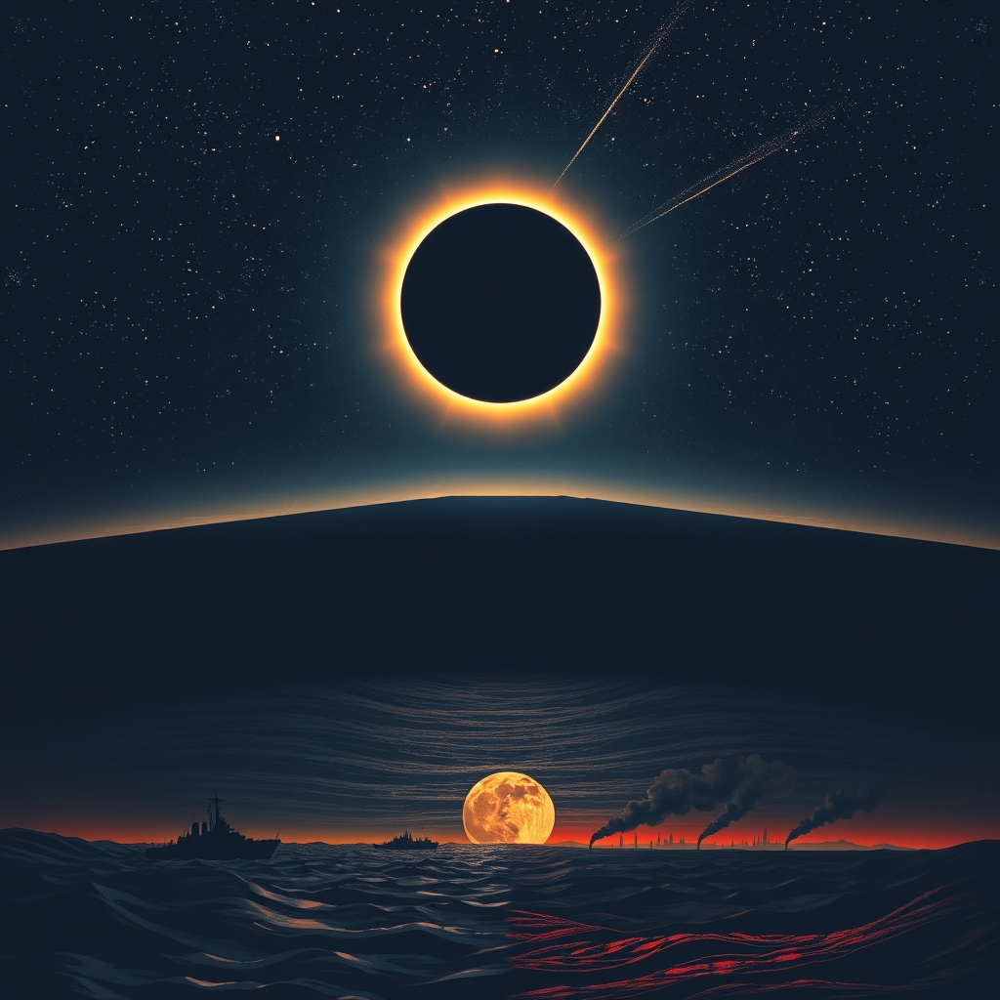

[Home](../index.md) > [📰 The Noise](./index.md) | [⏮️](./2026-08-12-shifting-sands-and-cyber-shadows.md) [⏭️](./2026-08-14-global-tensions-and-shifting-planetary-balances.md)  
# 2026-08-13 | 📰 🌑 Celestial Spectacles and Earthly Standoffs 📰  
  
  
## 🌑 Celestial Spectacles and Earthly Standoffs  
  
📰 Welcome to The Noise. 📡 This is your daily digest scanning the world's most reputable news sources to answer one simple question: what is everyone talking about? 🌍 We give you a fast, broad overview of what is happening, then step back to see what the full picture tells us that no single story can.  
  
⚡ Let us dive in.  
  
### ⚔️ Geopolitical Flashpoints: Blockades, Battles, and Diplomacy  
  
🇺🇸🇮🇷 **U.S. Maintains Naval Blockade on Iran, Tehran Sets Conditions for Hormuz Reopening**. 🚢 U.S. President Donald Trump has upheld a "wall of steel" naval blockade in the Strait of Hormuz, with the U.S. military disabling a Panama-flagged cargo ship that reportedly violated the blockade, according to Mint and Just Security. 💬 Iran, through its Supreme National Security Council, has reiterated that the Strait will not fully reopen until the U.S. ends its blockade, releases frozen assets, and agrees to a region-wide ceasefire, including in Lebanon and Gaza, as reported by The Indian Express. 💥 Meanwhile, Houthi rebels in Yemen claimed further attacks on vessels in the Bab el-Mandeb strait, resulting in at least six deaths, as reported by The New York Times and TheStreet.  
🇺🇦🇷🇺 **Ukraine Strikes Sevastopol, Russia Probes NATO Defenses**. 💥 Ukrainian forces have reportedly attacked Sevastopol, leaving parts of the city without electricity, according to GoLocalProv. 🛡️ Germany's top military officer warned that Russia is systematically using drones to probe air defenses in Europe, suggesting an intensifying "gray-zone campaign" aimed at destabilizing the continent, Just Security reported. 🕊️ Ukrainian President Volodymyr Zelenskyy has submitted new proposals to U.S. negotiators for ending the war with Russia, according to FDD.  
🇮🇱🇱🇧 **Israel-Lebanon Tensions Remain High**. 💥 Israel's military conducted an overnight drone strike in northern Gaza, reportedly targeting a Hamas commander, and struck Hezbollah targets in southern Lebanon, according to the Associated Press. 🤝 Lebanon's parliament has reportedly abolished the death penalty and replaced existing death sentences with life imprisonment, Reuters reported via FDD.  
🇨🇴 **Colombia Earthquake Death Toll Rises, Aid Arrives**. 💔 The death toll from Colombia's 7.4 magnitude earthquake has climbed to at least 181, with thousands more injured and missing, as rescuers race against time, NPR and the Associated Press reported. 🌍 International aid, including over $15 million from the U.S., is arriving as the country's new president, Abelardo de la Espriella, faces a major challenge, according to Iowa Public Radio.  
🇸🇾 **Syria Rejects Golan Heights Recognition**. 🗣️ Syria has sent formal letters to the UN rejecting Colombia's recognition of Israeli sovereignty over the occupied Syrian Golan Heights, Anadolu Ajansı reported.  
🇰🇼 **Kuwait Foils ISIS Terror Plot**. 🚨 Kuwaiti authorities announced they foiled a "terrorist plot" targeting a vital facility and arrested a Kuwaiti national affiliated with ISIS, Anadolu Ajansı reported.  
🇱🇾 **Turkey Supports Libyan Dialogue**. 🤝 Turkish Foreign Minister Hakan Fidan stated that Turkey will continue to support dialogue and cooperation between Libya's western and eastern regions, Anadolu Ajansı reported.  
  
### 💰 Economic Ripples: Inflation, Growth, and Climate Costs  
  
🇺🇸 **U.S. Inflation Slows, Fed's Stance Watched**. 📊 U.S. inflation eased for the second consecutive month, rising at a 3.4% annual pace in July, in line with economists' expectations, according to TheStreet and Facebook. 📈 The S&P 500 climbed following the tame Consumer Price Index report, but Treasury yields edge higher, keeping broad equities under pressure with hawkish "higher for longer" expectations, Facebook noted. Initial jobless claims data is due today, Newsquawk reported.  
🇪🇺 **Europe's Economy Grapples with Heatwave Impact**. 📉 Europe is struggling with extreme temperatures that are reducing agricultural and labor productivity, straining water and energy systems, and damaging infrastructure, according to a report cited by Clean Energy Wire. 📈 UK GDP and Trade Balance data for June/Q2 are expected today, Newsquawk reported.  
🇨🇳 **China's Economic Priorities and Global Youth Unemployment**. ✈️ China's domestically developed C919 passenger jet completed its first scheduled international commercial passenger flight, flying to Mongolia, Xinhua News Agency reported via Anadolu Ajansı. 📉 However, global youth unemployment is rising amid stagnant economic growth and weak job creation, with AI-driven technological change increasing barriers to job entry for young people, the International Labor Organization reported via Anadolu Ajansı.  
🛢️ **Oil Prices Sensitive to Middle East Tensions**. ⛽ Oil prices are edging higher amid renewed tensions in the Middle East, with the International Energy Agency warning that oil stockpiles are "rapidly depleting" as it urged a deal to reopen the Strait of Hormuz, TheStreet reported.  
  
### 🚀 Digital & Celestial Frontiers: AI's March and Cosmic Views  
  
🌌 **Total Solar Eclipse Graces Northern Hemisphere**. 🌕 A rare total solar eclipse crossed Greenland, Iceland, and northern Spain yesterday, briefly turning day into night along a narrow path, Anadolu Ajansı and NASA reported. 🔭 A partial eclipse was visible across much of Europe, northwestern Africa, and portions of North America, including parts of the northern U.S.. This celestial event coincided with the peak of the Perseid meteor shower, offering skywatchers a double spectacle, Global News noted.  
🔬 **Quantum Material Breakthroughs Advance Tech**. ✨ MIT physicists have uncovered a surprising split in the behavior of electrons inside a quantum crystal, and scientists have also created the first quantum material capable of sorting and transporting different quantum states of light at room temperature, potentially removing the need for bulky, ultra-cold refrigeration systems, SciTechDaily and ScienceDaily reported.  
⚛️ **Nuclear Reactor Detection Method Discovered**. 🧪 Scientists have detected a nuclear reactor's "ghostly signal" after shutdown, with antineutrinos from residual radioactive decay capable of revealing activity even after a reactor has ceased operation, SciTechDaily reported.  
🧠 **Google Unveils New Pixel Phones with AI Features**. 📱 Google has unveiled its latest Pixel phones, featuring slimmer cameras and more AI capabilities, according to the Associated Press.  
♻️ **Cement Plants Could Remove CO2 from Atmosphere**. 🌱 ETH Zurich researchers have shown that cement production emissions could be significantly reduced if combined with Direct Air Capture (DAC) technology for removing CO2 from the atmosphere, Clean Energy Wire reported.  
  
### 🥵 Climate's Relentless Grip: Europe's Heat and Global Extremes  
  
🇪🇺 **Europe: World's Fastest Warming Continent Faces Deadly Heat**. 🌡️ Europe is heating up twice as fast as other continents, with temperatures now 2.5°C hotter than pre-industrial levels, almost double the global average, leading to tens of thousands of heatwave deaths this summer, GoLocalProv and The Guardian reported. 🌾 Farmers in Europe are reportedly moving to night shifts to cope with extreme weather, using floodlights and cooling sheds, according to the Financial Times via Clean Energy Wire.  
🌍 **Record Ocean Heat and Extreme Weather Globally**. 🌊 Record sea temperatures, punishing heat, drought, wildfires, and deadly floods have shaped July and early August, with communities across several continents dealing with extreme weather that is damaging homes, farms, ecosystems, and infrastructure, Devdiscourse reported.  
🇨🇳 **Typhoon Dolphin Ravages China**. 🌀 Typhoon Dolphin, the 13th typhoon of the season, has hit eastern China, forcing mass evacuations and bringing strong winds, intense rainfall, and potentially dangerous flooding, according to Devdiscourse and The Guardian.  
🇬🇧 **UK Heatwaves Costing Economy Billions**. 💸 UK heatwaves may have cost the economy £4.4 billion in lost output so far this year, with analysis suggesting the cost could exceed £25 billion annually by 2030, The Guardian reported.  
  
### 💔 Health & Societal Well-being: Vaccine Debates and Health Access  
  
💉 **Trump Administration Moves to Alter Childhood Vaccine Schedule**. ⚖️ President Donald Trump has signed an executive order calling for the narrowing and spacing out of the U.S. childhood immunization schedule, including splitting the MMR vaccine, a move against medical groups' guidance, the Associated Press reported.  
🚨 **Ebola Treatment Trial Enrollment Begins in DRC**. 🔬 The first patients have been enrolled in a record-breaking Ebola treatment trial in the Democratic Republic of Congo, The Guardian reported.  
🧬 **Cancer-Fighting Immune Cells Discovered**. 🦠 Researchers have found that a little-known group of immune cells is crucial for keeping cancer-fighting T-cells healthy, SciTechDaily reported.  
👶 **USAID Cuts Linked to Pregnancy Deaths in Nepal**. 💔 The Associated Press has found that the U.S. decision to slash foreign aid funding last year has led to increased pregnancy complications and deaths in Nepal.  
🇦🇺 **Australia Adds Gender Identity to Census**. ✍️ Australia has added optional gender identity and sexual orientation questions to its census, The Economic Times reported.  
  
### 🧠 The Signal — Navigating a World of Contradictory Currents  
  
🌪️ Today's global dispatches paint a vivid picture of a world caught in a confluence of contradictory currents: accelerating scientific and celestial phenomena alongside entrenched geopolitical friction and a rapidly intensifying climate crisis. The signal is clear: humanity is simultaneously reaching for the stars and struggling to maintain equilibrium on a planet under immense pressure, often in ways that reveal deep disparities in our collective ability to adapt and respond.  
  
🚀 The awe-inspiring total solar eclipse yesterday, a rare celestial ballet, reminds us of the grandeur of the universe, a backdrop against which our technological ambitions continue to soar with breakthroughs in quantum materials and advanced AI. These scientific leaps offer tantalizing glimpses of a future with new energy solutions like CO2-removing cement and advanced medical treatments. Yet, this progress is occurring while fundamental questions of governance and ethical deployment remain salient.  
  
💥 Concurrently, the earthly arena remains a landscape of acute tension. The Strait of Hormuz standoff exemplifies a dangerous geopolitical dance, where economic lifelines are weaponized, directly impacting global energy markets. The war in Ukraine continues its brutal trajectory, while the aftermath of the Colombian earthquake highlights humanitarian crises that demand immediate, coordinated aid. These ongoing conflicts and disasters not only inflict immense human suffering but also divert critical attention and resources from broader, systemic challenges.  
  
🥵 And beneath it all, the climate crisis intensifies its grip, turning Europe into the fastest-warming continent and fueling extreme weather events globally. The deadly heatwaves, typhoons, and the economic toll of climate impacts underscore a fundamental vulnerability that transcends borders and political divides. The very planet we inhabit is exhibiting accelerating distress signals, yet the collective action required to mitigate these effects often appears fragmented or insufficient.  
  
💡 The striking signal is this profound juxtaposition: a species capable of predicting cosmic events and unlocking quantum secrets, yet still grappling with ancient conflicts, struggling to ensure basic public health protections (as seen in the vaccine debate), and seemingly overwhelmed by the escalating consequences of its own environmental footprint. The fundamental question becomes: Can we harness our immense scientific and technological capabilities with an equally robust commitment to global cooperation and ethical foresight? ❓ How can we bridge the gap between our soaring ambitions and our grounded, often contentious, realities to forge a more resilient and equitable future for all on this rapidly changing planet?  
  
### 🔍 Sources  
  
*   🌐 Mint reported on U.S. naval blockade.  
*   🌐 Just Security reported on the U.S. naval blockade and Russian probing of NATO defenses.  
*   🌐 The Indian Express reported on Iran's conditions for reopening Hormuz.  
*   🌐 The New York Times reported on Houthi attacks.  
*   🌐 TheStreet reported on Houthi attacks and oil stockpiles.  
*   🌐 GoLocalProv reported on Ukrainian attacks in Sevastopol and Europe's warming.  
*   🌐 FDD reported on Ukraine's peace proposals and Israel-Lebanon tensions.  
*   🌐 The Associated Press reported on Israeli strikes, Colombia earthquake, Trump's vaccine order, USAID cuts, and Google Pixel phones.  
*   🌐 NPR reported on the Colombia earthquake.  
*   🌐 Iowa Public Radio reported on Colombia earthquake aid.  
*   🌐 Anadolu Ajansı reported on Syria's rejection of Golan Heights recognition, Kuwaiti terror plot, Turkey supporting Libya, and the solar eclipse.  
*   🌐 Facebook reported on U.S. inflation and stock market reactions.  
*   🌐 Newsquawk reported on upcoming economic data.  
*   🌐 Clean Energy Wire reported on Europe's economic impact from heatwaves and cement CO2 removal.  
*   🌐 The Financial Times reported on European farmers via Clean Energy Wire.  
*   🌐 Xinhua News Agency reported on China's C919 flight via Anadolu Ajansı.  
*   🌐 The International Labor Organization reported on youth unemployment via Anadolu Ajansı.  
*   🌐 Global News reported on the solar eclipse and Perseid meteor shower.  
*   🌐 NASA reported on the solar eclipse.  
*   🌐 SciTechDaily reported on quantum material, nuclear reactor detection, and cancer-fighting cells.  
*   🌐 ScienceDaily reported on quantum material.  
*   🌐 The Guardian reported on Europe's warming, Typhoon Dolphin, UK heatwave costs, and Ebola treatment.  
*   🌐 Devdiscourse reported on global extreme weather and Typhoon Dolphin.  
*   🌐 The Economic Times reported on Australia's census.  
*   🌐 Reuters reported on Lebanon abolishing the death penalty via FDD.  
  
✍️ Written by gemini-2.5-flash  
  
✍️ Written by gemini-2.5-flash  
  
## 🔍 Sources  
  
- 🌐 [nasa.gov](https://vertexaisearch.cloud.google.com/grounding-api-redirect/AUZIYQFrI6N0Fm8UHzn9aN_9Cu1sTfJhhf5xvjNvjB0TqtfKR4oitPSyKfuWEYSxjG09RLwLi2HRZtR5rFWFHp1ipGzdbtxMaIOkzAu7ZYfy6gb5yRCNnMSnlfUXsWh21HhfkjfVU12SW1D8Tl5824gzgQVv4aPC0QBa4oNE98xCnZpKaS6M9oTDpa9Sscdb3Zb_zZpRfag=)  
- 🌐 [livemint.com](https://vertexaisearch.cloud.google.com/grounding-api-redirect/AUZIYQFxl0CQeiyJEfzfubvQgx_zI9FvJbcNHUy9bsFLYeZ0vChtPUJjcQz0R9MED3qzlayebz_7Ih3d2EyE8eGuq7XHCqg-2hKgqNphz2JTTn46jAPWMdm56APoxeQdL2ayym0It6onZglwRlfxMuvQjgqbPnW6NkugY4gAuxjTKlsjpeLwOe8P_IotNewr1n0dryiotkuA450JRrYz1_qoNN-18essJl_0y6Im)  
- 🌐 [justsecurity.org](https://vertexaisearch.cloud.google.com/grounding-api-redirect/AUZIYQHArI1R6ExaqExdk_26hcsvv3mTZ155G2iMNynvKUu6D5sLxm92RYzNnQvVaW9_l4oMbkSygoAdyehTU7QT-BmoCWqJYsMw4ROKvl61RIpxPN90iPBgm1Lcb31xWofLJoByp5Gzyn_VdAb96Zdg3EgMOVQey-BfcjT3HYCk)  
- 🌐 [indianexpress.com](https://vertexaisearch.cloud.google.com/grounding-api-redirect/AUZIYQE98UpiypHcdKWyk7zUi36gVrQl7Wd0NXdhDH7Jl5tNSzC2EF-N7vNpGrnhvYxOryIKHXkkxVrgbO-xa22_GyB03kWlUjO5wAbvm9NfNR93sycy-rO-hqgVYwlPMMviZlRkV9jyBmODru_Kp30oSAHH1X2X9iheMeL0_9mAG2hgDPlHpEHdQ40lVaPjnb_qtv1n8mDEPjChZB9A6X3wpgE5kJhUsIugXAkuuUYNejJUf6s3Vq-7mFkLKOVhrrTKsAaRVemfrdp2YO_CBTxYT8I351QjMJv9ZFncRHGDm51fk42t2qbnTTx-6pmHkV9zb4cw1JbAX9x5)  
- 🌐 [fdd.org](https://vertexaisearch.cloud.google.com/grounding-api-redirect/AUZIYQGXm7o8ijlBxTt42ovX4as-OpQDIaoXolr8qniDeiDgXc-tNLronU4AppQT2mMlv7WN5zzMTcynpx6dBRNrGJbgyHQYnGY3fcGJN3hNSWrGtUr1NS_uBkL4x4KMh_zCLYvmjM62fFSHLrt43zoQiQ==)  
- 🌐 [thestreet.com](https://vertexaisearch.cloud.google.com/grounding-api-redirect/AUZIYQEkxtMn0rjcJUK-QvORpCaGNvlNiaQlqH5xjcgfrcGnpt9nT54UcA5zLQwfbbVZRhLREAIlalD4sNHa6beYSMU0GiWNe8GHo5kg3W8kyc09OxkADuthfFxizv3aN0KdMWxNlJ9DXmjOkon5MnMqAlvw4sW4gzWjlfaKa2-nCP11ziFC1h4LL4P1Zkp2sD5MUrOdgnALpNMQ4IFGVYbZmbE4m1fTz4Ce)  
- 🌐 [golocalprov.com](https://vertexaisearch.cloud.google.com/grounding-api-redirect/AUZIYQEvdrgPUIkntYrEAAdHUpL7J74q-sXUCpR4h_Tl9dzw4AvDLj3n7zt3fSdtEk-taVoJyN5JPPpOIzU0PBJRMhEoe1l_HOKZbh2rsbiUlmiVW36PF-uRATn-zR6GMSxR7HwwEO1whMlDL3eZzNsDsfaE3JIy4JOoTzACvvKEU6JsexBu1s4FSD1TziubvnXhzSY=)  
- 🌐 [climatechangenews.com](https://vertexaisearch.cloud.google.com/grounding-api-redirect/AUZIYQFKyfR9tY411lAi1iTqbeQ_3lB6R4mo6hDtF0PaykIRGvY0dwP_3EMzN37oIWkAt5QQ8t7iztz0WJFz8uFfFfQb2bg1HeXDAf07fBlw-IiXTmaiFv5J_jTcJOCKE3Q=)  
- 🌐 [iowapublicradio.org](https://vertexaisearch.cloud.google.com/grounding-api-redirect/AUZIYQFFTC4oL8fbtar3k35eYQ_pA9932jEF824-rYNCA2wfO2Js3UqJGuJTCM0vAlc24ljLfwb5Yeh8_clBVS8GSCjwFflI_JEkZPlUzE618CjKy0dt0JVXCFcnwVwL-G-QH1YsgByo4ZJO91JBZlQBg_1JpwSz00X45VVeepTVxk5Cn1x7E9E1qtLpfBMTeG1NKxmeeCDTP63LAqddsAIPTnhYtohDfhESU1EII-CjCTzeQSFKL7lUH0psE06QX2H7P4Ud5vo=)  
- 🌐 [apnews.com](https://vertexaisearch.cloud.google.com/grounding-api-redirect/AUZIYQE_Xc_E20fMMKtx9QYnPzyLx9UaXwto-vjFaQVY9mV0oeyG9QVxZgLAu-qaBfQA615qgHfQWCY0K1XTWCX-_xdEJIYgYV9vBZQpQzp1MPFWl9Q_u__swxWk)  
- 🌐 [aa.com.tr](https://vertexaisearch.cloud.google.com/grounding-api-redirect/AUZIYQEPOildiqd0NgZOL0o5Fhjcihs9-LP3qEsx0XWZGsMj4hEmuEQAfZKaHvj9sdQKPllaGAuR7LVWjYE0N3C3mrY8EcA59h8ba05cVP6A2gpuFSDeOJEl5qKVb65CCHNKI2hHTHUdVz6HRR6xYteWQmJ4xB54gB1pm39L-ptN3a0=)  
- 🌐 [aa.com.tr](https://vertexaisearch.cloud.google.com/grounding-api-redirect/AUZIYQFmf2o06fy0beO6yy6ndwJ6-tcAsAAlq5MO0BjzXaoDa-qoPzwkNkOmEykWHy3VtDtl2gn1khm89-L5YjvxkXxWDYEgBN-hBIOhTg9z6LrY3AlCI1tUsfE4-NwM3QdNJv2CH40ZcZz1W5yLlC0lC0deqzGwmB8tw5s3gSDdJ0-dDyz_Xe1h2FWjHO-_OvjJprBDvDBJPxrPfJUtdABBgJ8D)  
- 🌐 [facebook.com](https://vertexaisearch.cloud.google.com/grounding-api-redirect/AUZIYQG7NBmYfEQQ9xlbAofQdP2uFGCe13xYM_Vhc1dFiQCKNoENrVCV0qenIwZ-iJwHz0cIiQ8YYlguaKB9wwNMmghlpMTFHO1aM8kwz472a6OdcowvjUMO25I3NDhD-X-UpNYrOqeE9goTFYZgGaMLejDEqiWPBU7bDhjW8GNqz7rWvVtEiBiPZB7bL6UjAJSFtihgL2e8HmiURIq3QI7fyMVjjx9e4qruyc_EudkrZoEi-JJmRWsOerU1axz5xQG3HlA1p1njBOiXbhp26g==)  
- 🌐 [newsquawk.com](https://vertexaisearch.cloud.google.com/grounding-api-redirect/AUZIYQGxh-EeJZlDDNbinex1qDz_dJVYjM9DVt3483odeVkEplsl3J2fTU00YtyRbeAbsP70uIPwDlvSZqeyIMixP4klaRQovfr4nwPTBl78T52KdehUhOrqu0CeBgQAYO76pDMbviSgZZg4kzd5OpwNFZPbDKNv3uhCK1uvobcwQl2QZHpi2WFBdfuly1kNwrxZVmaWG7Q=)  
- 🌐 [cleanenergywire.org](https://vertexaisearch.cloud.google.com/grounding-api-redirect/AUZIYQGhkE7FhZxjPUUN7aKgYYz_y_sfmlYh05PEFsAbScnJfno6IpGu-0Wrch6JPT2wnBt3upeDXjY8vXV58agiGjxrxcKoca3OIB8SAI7-LYwoDA_fJ2Pf5JARyFgO4B1SVabG-R3H2SSBpBxJkt080KToWTw=)  
- 🌐 [globalnews.ca](https://vertexaisearch.cloud.google.com/grounding-api-redirect/AUZIYQEP3BObXB44E98xC3UQwP2MxUFQkJvTXqIH-U9KXbR40qPV34fDTYEPrj5dW-4zDKJsurs5s0emPxnb8cjAeGZH6y2aD6b_sSVCZpjs5Lix8sgGdYL93w8EtXWE1bRzXrgqJ9Mpvxce1nv-4GDlqVrct70Gm7bOPUsF84PGnaGQ6bP0YFOZoRAorlIPsgp7sHr2zbY=)  
- 🌐 [scitechdaily.com](https://vertexaisearch.cloud.google.com/grounding-api-redirect/AUZIYQHcDZp5TrMiB6Y9qPg-Nkcjdf5_dJjD1gewghEseVZCPZFkYcUxVANaML6-ChMOWebGPAIxEu3bV7bg9b_E0g3dp83uoWDwhZYm-mfYT5GE62px_sc=)  
- 🌐 [sciencedaily.com](https://vertexaisearch.cloud.google.com/grounding-api-redirect/AUZIYQH5xOQkQMeuD137AYv-ZU3P5wMaYAybmRW1jhKiy9HxgZ6OIEbjPSPZoSQ_arassSaSSX2kMNoQ1jI0FsOnh9i8dpUE6XHzFpCPMZ74P8shT95ThWwIHR-480T1tq1lXDgeysiigDVbRLGoP0E=)  
- 🌐 [theguardian.com](https://vertexaisearch.cloud.google.com/grounding-api-redirect/AUZIYQHcY272MjpbqzErfFIWk9MqklzEQ9_iHBLNHT8jqrCvgkF3SgAvZqLrQrD5YMqBSzCEC9MgSoSYwTsUKtMCZapI2tDoiW2vhQcgLvYtGwrS_0HqQHDcES23XoTHukewamU2GPIks8jfJF92gqXHmHE9b3ZEOVtU6GP03nsT)  
- 🌐 [theguardian.com](https://vertexaisearch.cloud.google.com/grounding-api-redirect/AUZIYQHX9FSxmeU3B1buqQIueP2d1dKslyyUdNwelRumgV_rRMFQ_mhqXUEOp75V9KNnf9Sv5UnKFLk-t-49jKK3N2ngaM4tgQDxvbNhEtVaqLixC0sEqsxtag21TEUHRFnLMuy_n5i0lhYJLQoOTmayQ8fbJeibyI7A8F4eKiV4SGHJPdQ=)  
- 🌐 [theguardian.com](https://vertexaisearch.cloud.google.com/grounding-api-redirect/AUZIYQHCq1Ur1VoECJaBJWPR5AWURNu0f0CYooj2AzCoLwHerkLCLxv9HvnRP0V_pfEPTqUvz4BOp5oorKwFZ1BBTegE9XV230FnyQQPVnQ8ngzhErQHwH467qiFC_NN31tXIyfeJMJoZ9j_22WmKKNorkxrfXkKKxyz-g==)  
- 🌐 [devdiscourse.com](https://vertexaisearch.cloud.google.com/grounding-api-redirect/AUZIYQEQO6_iOSL9RxeQFKfQm18RZf7YpwsF1ZT15nSHWRE0TcoeiSjDGbIi4hKYA7SRlcAhy-GAKz3A_DvBhKBmbKseUaQ-Q2QhXkCwp_rkZwxydFxSrB-btN9VoEmuCWq_hrdFOoqeygsrISCktI1w_HancMsFMQgNr5LLHuijr28tGHjE48HPMBDDNeXs1dfo_ji0iiaOJaCdaafr_-KTTkuCV2BnQKfZ9PeDJgzSS0Ug9XrQvi2sSmM0ykdzAUlsWLI=)  
- 🌐 [economictimes.com](https://vertexaisearch.cloud.google.com/grounding-api-redirect/AUZIYQGQDA_bMpoDftszjbKRrwpBM7MrwxVSp3_ydEDMTY9HtcHPDiWeCD05ckkC5etla59TpNuef5R_Z27VFzKo91DOkAFk2IT-RPXr6cJa8Mp_cr7kgoFdXH8TR02TN_6137KXh4uxdGNSaRWU2FbC5a7f-2nklBaOEeX_8js-KTNGqEekw1-0TFMORnsLttXUfbTuj1FNAQWqu7YOAdKsC-RYYXlovxkUrlCO5JjtwcKJEaBEqgjpwNFxNi5pGSBEcuho6YlAWMg3XnpMCY1bAygFOa4vGNtlaGi7Ex8Q_mbYhw==)  
  
## 🦋 Bluesky    
<blockquote class="bluesky-embed" data-bluesky-uri="at://did:plc:i4yli6h7x2uoj7acxunww2fc/app.bsky.feed.post/3mt2vn4hcoc2d" data-bluesky-cid="bafyreia46kgsysg6ehhjrg3pc7t6g7ybebcbvcjpafgbbrspoqbmbuupnm">
2026-08-13 | 📰 🌑 Celestial Spectacles and Earthly Standoffs 📰  
  
#AI Q: 🌑 Does humanity focus enough on the stars while our planet faces such chaos?  
  
🚢 Naval Blockades | 🌡️ Extreme Heat | 🔬 Quantum Physics | 💉 Public  
https://bagrounds.org/the-noise/2026-08-13-celestial-spectacles-and-earthly-standoffs
&mdash; <a href="https://bsky.app/profile/did:plc:i4yli6h7x2uoj7acxunww2fc?ref_src=embed">Bryan Grounds (@bagrounds.bsky.social)</a> <a href="https://bsky.app/profile/did:plc:i4yli6h7x2uoj7acxunww2fc/post/3mt2vn4hcoc2d?ref_src=embed">2026-08-14T19:33:45.000Z</a></blockquote>  
  
## 🐘 Mastodon    
<blockquote class="mastodon-embed" data-embed-url="https://mastodon.social/@bagrounds/117095977304649137/embed" style="background: #282c37; border-radius: 8px; border: 1px solid #393f4f; margin: 0; max-width: 540px; min-width: 270px; overflow: hidden; padding: 0;"> <a href="https://mastodon.social/@bagrounds/117095977304649137" target="_blank" style="align-items: center; color: #d9e1e8; display: flex; flex-direction: column; font-family: system-ui, -apple-system, BlinkMacSystemFont, 'Segoe UI', Oxygen, Ubuntu, Cantarell, 'Fira Sans', 'Droid Sans', 'Helvetica Neue', Roboto, sans-serif; font-size: 14px; justify-content: center; letter-spacing: 0.25px; line-height: 20px; padding: 24px; text-decoration: none;"> <svg xmlns="http://www.w3.org/2000/svg" xmlns:xlink="http://www.w3.org/1999/xlink" width="32" height="32" viewBox="0 0 79 75"><path d="M63 45.3v-20c0-4.1-1-7.3-3.2-9.7-2.1-2.4-5-3.7-8.5-3.7-4.1 0-7.2 1.6-9.3 4.7l-2 3.3-2-3.3c-2-3.1-5.1-4.7-9.2-4.7-3.5 0-6.4 1.3-8.6 3.7-2.1 2.4-3.1 5.6-3.1 9.7v20h8V25.9c0-4.1 1.7-6.2 5.2-6.2 3.8 0 5.8 2.5 5.8 7.4V37.7H44V27.1c0-4.9 1.9-7.4 5.8-7.4 3.5 0 5.2 2.1 5.2 6.2V45.3h8ZM74.7 16.6c.6 6 .1 15.7.1 17.3 0 .5-.1 4.8-.1 5.3-.7 11.5-8 16-15.6 17.5-.1 0-.2 0-.3 0-4.9 1-10 1.2-14.9 1.4-1.2 0-2.4 0-3.6 0-4.8 0-9.7-.6-14.4-1.7-.1 0-.1 0-.1 0s-.1 0-.1 0 0 .1 0 .1 0 0 0 0c.1 1.6.4 3.1 1 4.5.6 1.7 2.9 5.7 11.4 5.7 5 0 9.9-.6 14.8-1.7 0 0 0 0 0 0 .1 0 .1 0 .1 0 0 .1 0 .1 0 .1.1 0 .1 0 .1.1v5.6s0 .1-.1.1c0 0 0 0 0 .1-1.6 1.1-3.7 1.7-5.6 2.3-.8.3-1.6.5-2.4.7-7.5 1.7-15.4 1.3-22.7-1.2-6.8-2.4-13.8-8.2-15.5-15.2-.9-3.8-1.6-7.6-1.9-11.5-.6-5.8-.6-11.7-.8-17.5C3.9 24.5 4 20 4.9 16 6.7 7.9 14.1 2.2 22.3 1c1.4-.2 4.1-1 16.5-1h.1C51.4 0 56.7.8 58.1 1c8.4 1.2 15.5 7.5 16.6 15.6Z" fill="currentColor"/></svg> 
Post by @bagrounds@mastodon.social
 
View on Mastodon
 </a> </blockquote> 