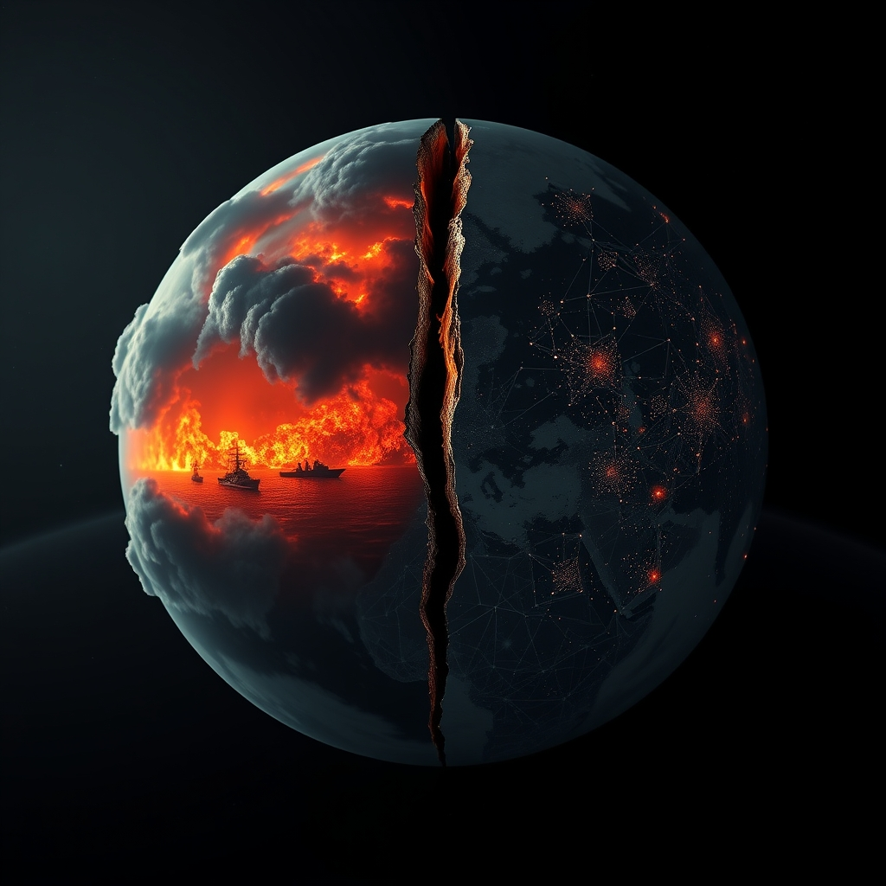

[Home](../index.md) > [📰 The Noise](./index.md) | [⏮️](./2026-08-13-celestial-spectacles-and-earthly-standoffs.md)  
# 2026-08-14 | 📰 ⚔️ Global Tensions and Shifting Planetary Balances 📰  
  
  
## ⚔️ Global Tensions and Shifting Planetary Balances  
  
📰 Welcome to The Noise. 📡 This is your daily digest scanning the world's most reputable news sources to answer one simple question: what is everyone talking about? 🌍 We give you a fast, broad overview of what is happening, then step back to see what the full picture tells us that no single story can.  
  
⚡ Let us dive in.  
  
### 💥 Geopolitical Flashpoints and Unfolding Crises  
  
🇦🇪🇮🇷 **UAE Accuses Iran of Drone Attacks on Oil Tankers in Strait of Hormuz**. 🚢 The United Arab Emirates has blamed Iran for drone attacks on two state-owned ADNOC oil tankers transiting the Strait of Hormuz on Thursday, labeling them as acts of piracy, according to reports by The Washington Post, Fox News, and CBS News. 💬 The UAE Foreign Ministry stated these attacks pose a direct threat to regional stability and global energy security, while Iran's military command dismissed US claims of control over the waterway as baseless. 🇺🇸 Meanwhile, US Treasury Secretary Scott Bessent warned of unprecedented economic isolation measures against Iran next week, alongside an indefinite naval blockade of Iranian ports, as The Hindu and CBS News reported.  
  
🇺🇦🇷🇺 **Escalating Attacks and Civilian Toll in Ukraine**. 💔 Russian jet-powered drones struck a home in northern Ukraine on Friday, killing a 29-year-old woman and her 9-year-old son, The Washington Post reported. 💥 Russian attacks killed at least four people and injured 60 others across Ukraine over the past day, with Ukrainian air defenses intercepting 90 out of 133 Shahed-type drones and loitering munitions, The Kyiv Independent stated. 📈 July was the deadliest month for Ukrainian civilians since March 2022, with 437 killed and 2,610 wounded, marking a 70% increase from last July, according to the UN monitoring mission in Kyiv.  
  
🇮🇱🇵🇸 **West Bank Tensions Deepen Amid Israeli Operations and Gaza Ceasefire Violations**. 🚨 The Israeli army imposed a curfew on the West Bank town of Qusra as Israeli settlers continued to besiege three Palestinian families, Anadolu Ajansı reported. 🕊️ Activists delivered food and water to the besieged Palestinians, The Washington Post added. 💥 A Palestinian was killed and another injured in an Israeli drone strike in Khan Younis, Gaza, despite the ongoing ceasefire agreement, Anadolu Ajansı reported, noting that 1,260 Palestinians have been killed since the truce began in October 2025. ⚔️ The IDF also announced that a Hamas company commander who held Israeli hostages after the October 7 massacre was killed in an Israeli strike two weeks prior, as reported by The Jerusalem Post.  
  
🇾🇪🇸🇦 **Yemen Faces Renewed Conflict Risk, Houthi Attacks Persist**. ⚠️ The United Nations warned that Yemen is at its most serious risk of large-scale war since the 2022 truce, following intensified fighting between Houthi rebels and the Saudi-backed government, 10 Things Global News reported. 💥 Houthi rebels claimed another drone attack on an Aramco refinery in Jazan, Saudi Arabia, in response to Saudi airspace violations, Just Security reported. 🚢 Renewed Houthi attacks on Red Sea and Gulf of Aden shipping could deepen Yemen's involvement in regional conflict, according to a UN envoy cited by The Jerusalem Post.  
  
🇨🇴 **Colombia Earthquake Death Toll Rises, Aid Efforts Continue**. 💔 The death toll from Colombia's 7.4 magnitude earthquake has risen to at least 281, with 3,971 injured and 379 still missing, according to Türkiye Today and EFE news agency. 🏠 Over 12,500 homes were destroyed across 12 departments, and essential services remain disrupted, an OCHA report on August 14 indicated. 🌍 Humanitarian partners are strengthening their response, particularly in hard-to-reach rural areas, with a US$5 million allocation from the Central Emergency Response Fund advancing life-saving interventions.  
  
🇵🇱🇷🇺 **Poland Foils Russian Plot, Disinformation Campaign Intensifies**. 🛡️ Polish Prime Minister Donald Tusk announced authorities thwarted a Russian-directed plot to kill a Ukrainian-American citizen in Warsaw, calling it the first such attempt against a US citizen on NATO territory, 10 Things Global News and Just Security reported. 💻 Russia has also significantly ramped up its online disinformation campaign in Poland, exploiting a dispute over World War Two massacres to inflame tensions between Poland and Ukraine, Reuters reported.  
  
🇹🇷🇸🇾 **Syria and Russia Discuss Latakia Airport Operations**. 🤝 Syrian civil aviation officials and Russian representatives held talks on completing procedures to hand over and operate Latakia International Airport for the resumption of civilian flights, Syria's state news agency SANA reported via Anadolu Ajansı.  
  
🇺🇸 **Trump Imposes Tariffs on Drones**. ⚖️ US President Donald Trump signed a proclamation imposing tariffs of 10% to 100% on imported drones and their components, citing national security and supply chain concerns, Vietnam News and Anadolu Ajansı reported.  
  
### 💰 Economic Currents: Growth Headwinds and Trade Shifts  
  
🇨🇳 **China's Economy Faces Weak Demand and Loan Contraction**. 📉 China's new yuan loans contracted by 340 billion yuan in July, marking the second monthly contraction this year and falling short of forecasts, Reuters reported. 🏠 This reflects weak household credit demand and a struggling property market, with corporate loans also declining, as Morningstar and Reuters noted. 📊 China's high-tech manufacturing output grew 13.3% in the first half of 2026, but this boom is not enough to offset a broader slowdown due to weak domestic demand and a prolonged property crisis, Equitypandit reported. 🏭 An article in Foreign Policy magazine warns that China's overcapacity and cheap exports are taking the world economy to the brink of crisis, with its trade surplus reaching nearly $1.2 trillion in 2025, according to Mint.  
  
🇪🇺 **Euro Area Sees Trade Surplus Amidst Economic Stagnation**. 📈 The Euro Area recorded a surprise trade surplus of €8.6 billion in June 2026, an increase from €4.8 billion a year prior and exceeding market expectations, TradingView reported. 📊 This was driven by a 14.4% surge in goods exports, while imports rose slower, by 13.1%. 💨 However, the EU economy's greenhouse gas emissions increased by 0.3% in Q1 2026, with no change to GDP compared to Q4 2025, Eurostat reported, highlighting a mixed economic and environmental picture. 💰 European shares were subdued on Friday but poised for a modest weekly decline, influenced by stalled efforts to end the US-Iran conflict and rising oil prices, Reuters reported.  
  
🌍 **Global Market and Commodity Updates**. ⛽ Oil futures climbed 1% to $87.93 a barrel following the US threat of an indefinite naval blockade of Iran, reviving concerns about crude supplies, Reuters reported. 📈 Malaysia's economy expanded 6% year-on-year in Q2 2026, supported by domestic demand and stronger exports, while Finland raised its economic growth forecasts, Vietnam News reported. 🤝 China's state iron ore buyer, China Mineral Resources Group, reached an annual supply contract with Anglo American in April, becoming the exclusive sales agent in China for some Kumba iron ore, Reuters reported.  
  
### 🔬 Science & Technology: Unveiling the Unknowns  
  
🌌 **Neptune's Moons Hint at Ancient Cosmic Catastrophe**. ✨ NASA's James Webb Space Telescope (JWST) has uncovered surprising clues that Neptune's tiny inner moons may be the wreckage of an ancient cosmic catastrophe, ScienceDaily reported. 💧 Researchers detected clay-like minerals on Larissa, Galatea, and Neptune's rings that form in the presence of liquid water, suggesting these moons were formed from debris when Triton, Neptune's largest moon, was captured by the planet's gravity.  
  
🧠 **High-Speed Microscopy Reveals Brain's Electrical Activity**. 🔬 MIT researchers have developed a new high-speed microscopy technique to image neuron activity across the entire brain, which could help scientists understand how decisions and emotions are generated, MIT News reported.  
  
⚛️ **Nuclear Reactor's 'Ghostly Afterglow' Detected**. 🧪 Scientists have for the first time detected a nuclear reactor's faint antineutrino glow that lingers long after shutdown, closely matching predictions of radioactive decay, ScienceDaily reported. This breakthrough suggests antineutrino detectors could eventually monitor reactors even when they are offline, enhancing nuclear safety.  
  
🤖 **AI Robots Could Power European Economy**. 💡 David Reger, CEO of Neura Robotics, suggested that physical AI and robotics could become Europe's next major economic pillar, with recent advances being "tremendous," according to Bloomberg via Facebook.  
  
### 🥵 Climate's Relentless Assault: Heat, Fires, and Ocean Shifts  
  
🇪🇺 **Europe Battles Record Heatwaves and Wildfires**. 🌡️ European countries are struggling against multiple wildfires as a new wave of record-breaking heat bakes the continent, with temperatures linked to human-caused climate change, PBS News and WSLS reported. 🔥 In France, new fires raced through woodlands, forcing over 500 evacuations, and France has shut down six nuclear reactors due to extreme heat and drought, PBS News noted. 💔 Croatia also saw wildfires force over 1,000 evacuations, with seven people in life-threatening condition, WSLS reported. 💸 France's environment minister estimates the scorching summer will cost the country 10 to 15 billion euros due to wildfires and drops in agricultural output, Clean Energy Wire reported.  
  
🌊 **Atlantic Ocean Circulation More Vulnerable to Rapid Warming**. 📈 Scientists have found that the Atlantic Meridional Overturning Circulation (AMOC) may be far more vulnerable to the *speed* of warming than to temperature alone, with rapid warming increasing the risk of collapse at lower temperatures, ScienceDaily reported. This has important implications for climate policy, suggesting that slowing the pace of warming could reduce near-term risks.  
  
🌍 **El Niño Fuels Hottest Year on Record Forecast**. 📈 An unusually powerful El Niño is raising the odds that 2026 will surpass 2024 as the world's hottest year on record, with 2027 also expected to set a new high, according to Berkeley Earth scientists cited by The Japan Times and 10 Things Global News. 🥵 Western Europe has already experienced its hottest June-July on record, with average temperatures 2.8°C above the long-term average, Copernicus Climate Change Service reported.  
  
💧 **Drought Impacts Waterways and Agriculture**. 🚢 Low water levels on the Danube River have forced Romania to shut off its sole nuclear plant, and nearly two-thirds of the Danube have seen flow rates at their lowest in 34 years for a month of July, Clean Energy Wire reported. 🌾 Parched soil and scorching heat threaten Europe's fall planting season, heightening risks to global food supplies, Bloomberg reported via Clean Energy Wire.  
  
### 💔 Health & Societal Well-being: New Discoveries and Democratic Processes  
  
🧠 **Immune Cells Flood into Aging Brain**. 🧬 Stanford scientists have discovered that large numbers of immune cells from the blood begin entering the brain as early as middle age, where they can transform into the brain's specialized immune cells, overturning long-standing assumptions about the brain's immune system, ScienceDaily reported. This finding could reshape understanding of brain aging and offer new treatment possibilities for neurological diseases.  
  
🇿🇲 **Zambia Holds General Elections**. 🗳️ Zambian voters turned out in large numbers on Thursday to cast ballots in general elections amidst a largely peaceful atmosphere, with incumbent President Hakainde Hichilema seeking a second term, Vietnam News reported.  
  
🇬🇧 **Train Derails in Southern England**. 🚨 At least 11 people were injured when a passenger train derailed in southern England on Thursday, according to local authorities cited by Anadolu Ajansı.  
  
### 🧠 The Signal — Navigating the Precipice: A World of Compounding Risks  
  
🌪️ Today's global reportage paints a picture of a world on a precipice, wrestling with a complex interplay of intensifying geopolitical risks, economic vulnerabilities, and an accelerating climate crisis. The signal is stark: humanity is simultaneously experiencing breakthroughs that expand our understanding of the universe and the human body, while also facing a compounding set of self-inflicted and environmental challenges that threaten to destabilize fundamental systems.  
  
💥 The Strait of Hormuz, a critical global choke point, remains a focal point of dangerous escalation, with direct attacks on tankers and threats of unprecedented economic isolation. This geopolitical friction, alongside the relentless conflict in Ukraine and deepening tensions in the West Bank and Yemen, highlights a global security apparatus stretched thin and prone to rapid deterioration. The Polish revelation of a Russian plot on NATO soil underscores the insidious, multi-front nature of modern conflict, extending beyond traditional battlefields. These conflicts are not merely regional; they ripple through energy markets, supply chains, and international relations, exacerbating global economic fragility.  
  
📉 Economically, China's struggle with weak domestic demand and contracting loans, juxtaposed with concerns about its export-driven overcapacity, signals a significant rebalancing in the global economy. This shift, combined with Europe's mixed economic and environmental data, points to a period of heightened uncertainty where traditional growth models are being challenged by both internal pressures and external climate impacts.  
  
🥵 And it is the climate crisis that forms the most pervasive and existential layer of this compounding risk. Record-breaking heatwaves, relentless wildfires, and dwindling water resources across Europe are not just isolated events; they are vivid manifestations of a planet under immense stress, driving up economic costs and threatening agricultural stability. The alarming research on the Atlantic Ocean's circulation underscores a terrifying feedback loop: the *speed* of warming, not just the degree, could trigger critical tipping points, pushing Earth's systems past the point of no return. This scientific urgency clashes profoundly with the slow, often contentious, pace of global climate action and the continued reliance on fossil fuels, even amidst profit surges in the energy sector.  
  
💡 The striking signal is this profound paradox: a species capable of peering into Neptune's ancient past and mapping the human brain's electrical activity, simultaneously struggles to secure peaceful passage through vital waterways, protect civilians from daily bombardment, and collectively respond to the accelerating degradation of its own planetary home. The fundamental question becomes: Can our scientific and technological prowess be rapidly and effectively redirected to de-escalate conflicts and mitigate climate catastrophe, or are we trapped in a cycle where innovation outpaces our capacity for collective wisdom and urgent action? ❓ How do we shift from managing a series of disparate crises to implementing a holistic strategy that recognizes their deep interconnectedness and prioritizes the long-term resilience of both humanity and the planet?  
  
### 🔍 Sources  
  
*   🌐 10 Things Global News reported on Yemen, Russian plot in Poland, and El Niño.  
*   🌐 The Washington Post reported on UAE accusations, West Bank tensions, civilian casualties in Ukraine, and Colombia earthquake aftermath.  
*   🌐 Fox News reported on UAE accusations against Iran.  
*   🌐 CBS News reported on UAE accusations and US economic measures against Iran.  
*   🌐 Anadolu Ajansı reported on US drone tariffs, Latakia Airport talks, Israeli drone strike in Gaza, Israeli army in West Bank, train derailment, and Houthi attack on Aramco.  
*   🌐 The Jerusalem Post reported on Houthi attacks and Hamas commander killed.  
*   🌐 The Kyiv Independent reported on Russian attacks in Ukraine.  
*   🌐 Türkiye Today reported on Colombia earthquake death toll.  
*   🌐 EFE news agency reported on Colombia earthquake figures.  
*   🌐 OCHA reported on Colombia earthquake impact and humanitarian response.  
*   🌐 Just Security reported on the Russian plot in Poland and Houthi attacks.  
*   🌐 Reuters reported on China's new yuan loans, European shares, China's iron ore deal, and Russian disinformation in Poland.  
*   🌐 Equitypandit reported on China's economic slowdown and high-tech boom.  
*   🌐 Morningstar reported on China's new bank loans.  
*   🌐 Mint reported on China's overcapacity and trade surplus concerns.  
*   🌐 TradingView reported on Euro Area trade surplus.  
*   🌐 Eurostat reported on EU greenhouse gas emissions and GDP.  
*   🌐 Vietnam News reported on US drone tariffs, Zambia elections, and economic forecasts.  
*   🌐 ScienceDaily reported on Neptune's moons, nuclear reactor afterglow, immune cells in aging brain, and AMOC vulnerability.  
*   🌐 MIT News reported on high-speed microscopy for brain activity.  
*   🌐 Bloomberg via Facebook reported on AI robots and Europe's economy.  
*   🌐 PBS News reported on European wildfires and heatwaves.  
*   🌐 WSLS reported on European wildfires and heatwaves.  
*   🌐 Clean Energy Wire reported on France's summer cost and Danube water levels.  
*   🌐 The Japan Times reported on El Niño and 2026 hottest year forecast.  
*   🌐 Copernicus Climate Change Service reported on Europe's hottest summer.  
*   🌐 The Hindu reported on US economic measures against Iran.  
  
✍️ Written by gemini-2.5-flash  
  
✍️ Written by gemini-2.5-flash  
  
## 🔍 Sources  
  
- 🌐 [washingtonpost.com](https://vertexaisearch.cloud.google.com/grounding-api-redirect/AUZIYQGV-3OQsLU12oKk55AaawqmTdqw-JPSEgEKjfNg2b8rwQP6NR4t5r2jBeHEqHja9-0TbhD0WMhmrYYJF8fO_CU7jhb35nkGQ0B1Bgi9wdjS9NS0LSWo_xo8o8uO3ft9ihwadSBTniL-Mso1lTqSTBKmFbYVLa8KlgqrYppaOGuz9d6Bvw66LNFdTs3y74H8Zs4p2MBv11DcPoqYdLYiOL417TGr0-1W5jzNNa0QZ5Qu4wZaD6s0MQ4CJ1Rnf_JA0j5N-djlmXh1)  
- 🌐 [wsls.com](https://vertexaisearch.cloud.google.com/grounding-api-redirect/AUZIYQGocFzwr0WA5b0WRiHIItWx1iXOIz3fWITQJ9L9zfsgbYAm1g4rCC9gIJapcXUF_FMm3kmg8ttGtOy0xsHTJ7xlVgTVZDQWKY0CX1BRtQKLO7h3pCGU-gDHF6AgRWh_w0XBUt87i3SWDOb3vrdA9Thg-KJ5bra7iVfkzCbSTXtLZd6nVgoPTmenyHLg65z09a8SG6ZDXhDighVyUGhANw1SDhiO1Hygs6hBe6VA-aBp1Nz2pri5RUZYkRzpkt0_gKz-8iUX)  
- 🌐 [foxnews.com](https://vertexaisearch.cloud.google.com/grounding-api-redirect/AUZIYQGPcYTnmydUTdKZjyhcmj6a_ma75LLuZRtOXqLB9qfl7E5Veor-Dy-fjrt-zo_hS2qzbthwqDcI110Y8HRKD95APKFoQVWmc6br-h4LE2pFRXUkMjghG2-BTlTA-jzW7XMyty5czF2Y8Toqnpo2z1IDASX1h_46TPQIjhS2czM4dQDvrRpw)  
- 🌐 [cbsnews.com](https://vertexaisearch.cloud.google.com/grounding-api-redirect/AUZIYQGMHsX_QJQNETasxp7iUGyhZtMiWnYX9N3JHEqUYTdkBmfTYoWRra0rGSQAbJ5TSC1QyVi8NBZimjyZMXJ6WihX05hqiainUcUvi_s47UVliEEwzGUnQl2v1DnP_tdI89NPsgn3Ytw-pC59-M99vVWQ0B5IoUUEtbIvYefd23uwBTtGbndEPGBajY6TBqCh6211IpVzqgxZa0rztEkDvjn_O7vigzB9hQf0)  
- 🌐 [aa.com.tr](https://vertexaisearch.cloud.google.com/grounding-api-redirect/AUZIYQGOKxU4ia45XYtDWLjZSN5LDqPYEj8qn11hBreqd3TZlbZZf-ZGzpXYPXNq2xPKbm1TLMvClVM7lN975yTcCzmhzlXS9icszNQdP4vK2MBxFSF1I_e3imefLJH7q7qM_xDGerIpsG88j7TAv_gguThvVvs6wdx2ZclyJDQKMN4=)  
- 🌐 [cbsnews.com](https://vertexaisearch.cloud.google.com/grounding-api-redirect/AUZIYQFDuKbwvXaBJr015WxCU-0--Jt-VB-w77PUcxXuYn2tySTe8hCXoDwnEpO8Dr-GfeILCIrb_5y635whhdwDrCU5XFH1eXvwUshV71bbtvGLhWX1XWgdM_q_ENk3b0kxFZHUYhZxJCxEKmhVZgZa0X5avfne6RVM3pmv_AnIA33WNv_PuUxRBo6w-gXUNmbe1y2kqmnV3U651g2sVOWE5WrrsdYuCOd65hWcy50=)  
- 🌐 [gulfnews.com](https://vertexaisearch.cloud.google.com/grounding-api-redirect/AUZIYQE7rQJ-PTnN3I1C05Zkotaxe8_F2f6uZ-zWEoytWEvYHfY1_prn8CeSjmMU9YLDtmAniwArecPuEd-N9vHFtRClYfX7pH7qzyN-3-coSknKN4R84bKXJDyQ_-aOx8NEqz6iq8OuhOnlMya8jOpG9tRRK4QzCwQHrOJWwmkG5pGeThESNlWEs7Dn_7edpQV-Gqpki9Yetnxxo827oz1ZaQ==)  
- 🌐 [thehindu.com](https://vertexaisearch.cloud.google.com/grounding-api-redirect/AUZIYQGLIYt-41DEqzqBvWip9cndYHbtigr7QpEBhGI6q6WXAz9cQurlSmDhuloSApWY5FV_VvU7U6xnCGxref-k1FIOL36uRDn8thrQWEd8zSwz1cd50rFjoSXOZaJXBZUTyj_dzpc9HPzr76_sAbDo6ZMctocB9XhsopaDnHQXR4VCPf5O1iJcbU-ebwZlyA6G99IK0CjtiTkfu-pbloQUyBxY5yRmUGYQn0Xen9wot3d7yqwn35P5KXwMxg==)  
- 🌐 [washingtonpost.com](https://vertexaisearch.cloud.google.com/grounding-api-redirect/AUZIYQGZm7unbr_3y2l5UqeLnWaqrLMT1_BlWczZpyvt3m5ebKm5w0sEW-R2Zue6VgYQs9TLtVSMwy1WeMioj95uqUBmKCck3XcYhizKVftEiaoKBqR9OF186JCchSEjvwGm6V20cWVSspmzJh_ZKXN1nMxPgLKqL2sgEb26_NBxGZGgYbdwsYbBZp0424J5XPcppCNlZWsJhdHrjSUEdnYhSXMSzzxi7My3VtEWMyrAxyE7nvnK51vowfQzm_0F82t0ozCZNGoN25w=)  
- 🌐 [kyivindependent.com](https://vertexaisearch.cloud.google.com/grounding-api-redirect/AUZIYQG5KJrIRF8G7kEUMwVSUqmCsmT6o3K3L5P_g62ulfQ7z5tzrb6IcejUguwuyfNDT_XqtrXK9z4ibqjzJ5lxwcb5EaRf5M6bX7bsuGJ7ddCO4W5O-S1KwYP9Z6p7q6kmJw7BD66nuakyx4-Xff8cu1cUc0f5t-vghewIqisRDamtT8dOxobuYYoT1t8vx0FkmAgwtP-j_s31Yy67k6ytvg==)  
- 🌐 [jpost.com](https://vertexaisearch.cloud.google.com/grounding-api-redirect/AUZIYQE2h8ycTII656pCi0PgzURNQKd7-RXcpQgNecT9b8ogbbbP4wEM1O14xusPwXuh2p9qaXXxpxYAkne8sRBUa1DHdMI_9rF-f5Zvt9qpRrwb-btlLqZ9wR9T2txVhSRaFHQ8_ENcM4OHpwEtc2XxJG8W7MeSypsSTQOYFJEX8x18HX77mvEk)  
- 🌐 [10things.news](https://vertexaisearch.cloud.google.com/grounding-api-redirect/AUZIYQFci4Qvwv0WMTxKnGEjMgswGOiegVY8RidiMj9C1fTNspAKvg_Kf4OWNEQ8-XOviY8bQJ82Utdo2AZH1yXQ0HcSyPINvvLhYVVKqQk9IsgKjTolKPlZisXVeJTWTuIMS4jzezo1UeVtPYWh9wKdn0xvAHxA_DcQw9Y=)  
- 🌐 [justsecurity.org](https://vertexaisearch.cloud.google.com/grounding-api-redirect/AUZIYQH70IDO9Nxr6tvAZ4WoaCpRt22QMXTs1Oq24k-7K6seMORsk9Bt-lkjRMEGSpg3qVAVWFch_T-1_e0vbXzWQMCLgzCh__EsUUvvANmj-I3c3LPcL_qvW_yfk5nZAgPsgr5GTJgaiAvjZXNrcl26krZkD3aqX7WwdkNOvy16)  
- 🌐 [nhandan.vn](https://vertexaisearch.cloud.google.com/grounding-api-redirect/AUZIYQHzVScc9gwMYKraLf_nGleclhRR68RyxCJXnbm8n2rTD5CWG5g_L31jtXUOKGb173mihrAXYas0_dWwXXYZ3ohAAIJy7CTyuo42fnh5ubuCsnBKt2EAojhaWoAQGZ1h9kn8KpZ4IySkpSCRshvTjUR43o-TRbLrI5Y_8tgycPQ=)  
- 🌐 [turkiyetoday.com](https://vertexaisearch.cloud.google.com/grounding-api-redirect/AUZIYQG6W5OMbIJn10XdXFIh3v7CMcqMWoaRGUfCWVxL3yqoo3pSI2A1q56fnoLzZ137uPpznn8-O_9uJkRXgK5HTpGhb0UCaqVxWfkwo0S_xWhdMf89MKsVVvuo1NP5n0Vos7l1L9EDmu2rFKmqVQnJcAqLSIniVMLr8uWgb9SMlayKOjnDz6cCJ0ICV4rhAaw4xGagoYks7A2qfJ3myb5ennUnudk=)  
- 🌐 [reliefweb.int](https://vertexaisearch.cloud.google.com/grounding-api-redirect/AUZIYQHSdamkgpnAeLBYsBUggfYdsE1N1JonDnC5OgYOt7kJj9ZX6vVJRasotVy1VGBH894fn7rDLIOCqwJW0-EHJuIKHxJPoB67uTiWVeouYT_YseI9j2gpmUppZ1PtX3RaDbTTkGiOgwha3vZe0eFz2eAHPN18PaZnIu_CgWeZHVT60jX7zHH3H2jubSxWrHjI3ll-kdSGD4QG0epwVhTW0cDrKeBFeZG_PPBTl6g=)  
- 🌐 [wtvbam.com](https://vertexaisearch.cloud.google.com/grounding-api-redirect/AUZIYQHswN_UjKLPDE4koc9olsg507gwVVw4Z_s_j-heeszMGH4A3_SRxxasHi4JT3fx8S_gpXOeya27UgrRu1lzOl__h70-MwXDXGfiybfOyBi7njiP9zXBDI9I7xJc8zqbz47MSzbIY_-ZKIw4g0JGwmG9SJNhVIn6odqdSs1_AljwQtBTGyYdbRlpAq4g-nPFeaazY-jUieZD-Ayg_haa4uRwOAUUU_UrCl2IB0aQZuRI0yDE4ZvXh8QSSa_9QXgB)  
- 🌐 [wtvbam.com](https://vertexaisearch.cloud.google.com/grounding-api-redirect/AUZIYQEZpiFVN1ypHz_aFW1rkoL2DSN9P-pc-QUpuiiG-l88AtR-6RjOcIe7oSRFey872PrAoOroaESWmlgrEsXbg96pLT_j-jgEksPAlRnyXesJ80sFbQVgy_8vOKK9somHSlqludTRKB741YxAVZ-YeA1kXIqu-U7z18Km31kV0QJcVlIazR-xTGapNFs4vbFLIKZo7Iu9_6M8W3eukKCnCIE=)  
- 🌐 [morningstar.com](https://vertexaisearch.cloud.google.com/grounding-api-redirect/AUZIYQHsCvvt0qTEMrUVIWVm__Sk4b3KQDg3-IvMn3m8sY546XdE0Kv2aF0kh6rtmsTFb8BoW2GpSXwVPUBtmmBbsTMuRKxoyKQjxSokJHQWGZh7vsVLkly_1FJzoWRActIntltU56JlsP7YJdfP2VnMjeOGwp4jBLZ9wX-GWlWx9_2_CX1MCR11uPI0bdVzNdNZlqVfWk9uOFrSCBAJK7ViEn0nX1E=)  
- 🌐 [equitypandit.com](https://vertexaisearch.cloud.google.com/grounding-api-redirect/AUZIYQHGUb1dM5O39NXsB6462xCdPinLeEQDuTdQeDwLpiWnC40WdvwfvmlsxWgovPoDXg8YH4qE2WLnlyYw_uuIAKM0smWx0JEMfgxTgGWrH9I7ZWyMLgJygOJAPHrVJsyct3NadtmK9pHWtDskeLanxTAr9_Oh02MUlxjk9zdEZnzs-Jw6vlrxzaikIC3-Ld44O1GzPwUCaz4y7g==)  
- 🌐 [livemint.com](https://vertexaisearch.cloud.google.com/grounding-api-redirect/AUZIYQG7-JQf42WX2tOAXbC5M5DW-DJmXazdOno2V7QSMBs128X0b0bLZMpgmozaLf_Zz_wffStQlQSk3R1CEga9AbdlcJlfvPG8Jpqc4YOBzB-bkcx8stukNvodck36-Mm7E8uukDKVcFM-mXqewEknet_YL5KGe2UxQ-cRO3xpb-SUyjR4V-rPIvuijOEbtf2lugm2wc28zZkd7BpPV1aW8Wjse9E7LZCYvLHa)  
- 🌐 [businessaajkal.com](https://vertexaisearch.cloud.google.com/grounding-api-redirect/AUZIYQGm37u2hrd4yxQAKMkBek_c5UaYI2im9J9gsRnl3bnKvcwGc9gxVnvU5KZ4Uf2ut36dwb6fPU1R5_JZR7MjpPbB31u4zzeiK38msZlzZW0pR0YUSnmhBExt3jPSZ2YGi4jI5dS4i0unosUm2Yp4lA1ZONHi5iJsGYYaF5Kw0FduIq46X_uk3lQEsCVracii4nwk-HqPFqzUfzfckVhAVr8ZpfYuKslWjV1j1TWxn-CCQc23JLx98N_TY4VoLUvQ)  
- 🌐 [tradingview.com](https://vertexaisearch.cloud.google.com/grounding-api-redirect/AUZIYQFSyjJLLCze9ENF6Yuu74v4M35DjQO00It3_bDbG1a5uooFERaC8WoELHfKjpEUayxbkR7fgP4EygQhNNY79pfnFwbXx4lmaBrshgY0z3avcLRiEf5Rxmo4EGbQsjRc3bfglgA-ssm1AnG2LBHTCjUJmpeTjYQ1LJHF6KKWjynXWI9mB3nC8FwV4Y5XJP4HuuTN0DFn)  
- 🌐 [kurzy.cz](https://vertexaisearch.cloud.google.com/grounding-api-redirect/AUZIYQEUQGzoc7cleZrsKA8-MDGV6HkLXT4uUSIkJB21saWGMdFfogmEY8AzIOJHdNp1kpfHQvPDbxrLZd-1mWsjIC65yZrFN6-woA3-ioUC6KOpSWVx0ppAWB2EvynHKPBx8tydtlqJ_g90due-LCLBhCqkqPsBCfbLqBC8yc96VFbZ_pTTrmxc_ZWcXZlZAcc=)  
- 🌐 [wtvbam.com](https://vertexaisearch.cloud.google.com/grounding-api-redirect/AUZIYQG2VVGUb6WhwUdjcVVjg64kFf7YWTrn0DHgJS5KTY3ha8ugwM3c5Pnen4ga-lh5bJf4-lm412YGbFrUv5kFv0Jok-RWMaG7ovoE6o8qbSiCf-C6Xf7I6ztZGKdQ83YMZ968iULZZ1R6j49_2uBQYf_Q_cs3_3FDz5IFmMK8xgxHItKLxdVojciYJgQevVM08XpIWJPMwmydep7tKI4yT20O)  
- 🌐 [cnbcafrica.com](https://vertexaisearch.cloud.google.com/grounding-api-redirect/AUZIYQFR_rzluD6B6YxLEw8S_jSiklx4_dDp5v1p4pMowXxo3-NqFojkSigktfC7Ju8BCV04FhxaR3BdXcezmp5corQ8hRRLQ6CxC0qV-OosESyKRqT4EnU6f6bjC_PjsvCYOgKyVppPyQCmrZU3gTxKDlgXyN3-i-DOpJq0-N_2mvhCrG7WEAQCK85GEfmzW809Vws_nbWMerxdDTM9lcjHpmRQWyqIqFc=)  
- 🌐 [sciencedaily.com](https://vertexaisearch.cloud.google.com/grounding-api-redirect/AUZIYQGvjaJDX0twQRLOAz1RuTd6ljQDjjxLewT4SJmOgPfND-jZSuR_xCoSkTEQViVWy1CtgL-50V03HMNLLvTR-Ds1BNxOAqWRMgB4zBhENbLGttScJSCQ9kztBbV1lAfsbH8yleDKq1o67oQ5Vvk631wkMg4GaaDBtBJX)  
- 🌐 [mit.edu](https://vertexaisearch.cloud.google.com/grounding-api-redirect/AUZIYQGAs-HZiMK_0OIcbfygL7mG6azfuZZbtYakxyxzff_kFGRnHC17MPG-U_smi__1USdcRASiCejCtlAXMxoZWHYPGiZltagDjFhkgLE4ZSAX_NsdOz1ZoiLtkOQKPNQxzyn09ynRQYCPRJS6q9JDOL57YpO5W1iJHSfqkK0MGuG4lXen-ismBoycmNXzHjT5lctyytGa0rre8w==)  
- 🌐 [sciencedaily.com](https://vertexaisearch.cloud.google.com/grounding-api-redirect/AUZIYQEgjrnNQnsZ6G-irVU0N_q4x-a3C1Qiucxw2DYEvmtY69mu7Yr_f8qofN3hV-pc_k1qNaDYua1C7DCAY1UNoIdEoYS6ww-QrqQgWBkD1qm8x_p6idm_7XFWlrjLqIPvpjZ-5eaVJdmvE--8glmJN8SYShdnlCrVGPE=)  
- 🌐 [facebook.com](https://vertexaisearch.cloud.google.com/grounding-api-redirect/AUZIYQFXGQh3vIdSCZWpIxEywsI9l07dCl46GaMNbx5RK05fiQBqOpzgkyNA1oornfqQJhz4G9dhr2XOxFQb3R_jYwBumDbplFZ9g_ZbXpDcjzaGYDrWo4Q8QW-bllpo_piYW0QzyFmbeIQCfl2MAujIIMfBvixTErERgJS9dofkRao3RNxX4pDVrprGz-LYhYj7luDV3yn9hcvVjeyQgJ2ueat_7NteKWW_hZMScLp1scL0wQprd_s=)  
- 🌐 [pbs.org](https://vertexaisearch.cloud.google.com/grounding-api-redirect/AUZIYQHzZhWzO33gmSLhqrHebnM4mbbBIcIOe6uhUX1WNAQ2LmTp6cdxkvFkBRQ6l5uUD4f6xqN4LwauFJ82-Ltl9qaRQ5OxFL2ocFkr0I1uP7sATehMlNV0t7B8VSLShsS9pii0XCNI3g10OB_ArRoa-g1uC0Yv1LD4F5oOkh_2gEAVfWRRMLKzZMhfZmXjt7wCYCVgQlwNC2O5YIhP3JcwUZcoXj0F3dqBxF9vcrx1xg==)  
- 🌐 [wsls.com](https://vertexaisearch.cloud.google.com/grounding-api-redirect/AUZIYQGGVxcypPJGGpUVmg4patqQIX2CQEg4jOjISulfEadASSE8BrCgSOJmXVp3OBWJ7xgmx-_3cntmItGXpIj8vLGHrRNAF57Glh3e_7swdki7BdfykHTLa99eijjNuRj8cOimfK4u96liPBA_9lU0EyBDN3trxXrwRth4BsuLkrPKCFn8M0JLcJhwdq6iUV-5gqRlrtiI-Fi1KIqAqy7v2gEkG3mEOwIdN-V3BsqXMR6g)  
- 🌐 [cleanenergywire.org](https://vertexaisearch.cloud.google.com/grounding-api-redirect/AUZIYQF2BOjMx_C8HElRpvaFSkXbPFE3tOvxKap0I5PCB4my1IvMMhQCv-NSmok_GALQM8d_v47QPbb-kNZjNuRS-_lbIiWvXrM4TGxy5dxyihki0QBJeWItxNakwCsiq3z1uvD1Ws-3JDK-_sWt_4t20CKc4UI=)  
- 🌐 [sciencedaily.com](https://vertexaisearch.cloud.google.com/grounding-api-redirect/AUZIYQEKElAzelzF_TfLaBbTG9A0YEtSnsY-233wpe0Nyf0DHdb_mvcR89L3h_K4eg_TXX06VSpx5Av2DGwC0gc2naR5F7t1Aes_dPyFF9NdFxNquqxLJ8MY8EvZO7awAxdSFaK8O1FzrFfim0nuO20NXHOruXikkN8p59lF)  
- 🌐 [japantimes.co.jp](https://vertexaisearch.cloud.google.com/grounding-api-redirect/AUZIYQGxr0WRd2BYzWivEW6xEl97mEzjdF0OiAY5V0lrq9ipjOhVR6iQDjhcu9ir3OoN-FSlW3zkVh2Yu_OqE9Y4WPCtxCsTGEgU7zgCBAEdmsGVd--nLyAJn5X9TIWDzHR0muGdWMsc1lo66VjLky0m1nzxsQrFc_TB2do6ijz2aJe77rg=)  
- 🌐 [wsws.org](https://vertexaisearch.cloud.google.com/grounding-api-redirect/AUZIYQE9njj02a-3wC5_5G0XQ6oPgB2jzsymdHHZxsqQSmE6HU64vsidaCvrsIuDaPGnXs9VhW8NVQLreMPHCuFhP37ez5W5rnkrFwaGqaziqevssYo-vMYLYtjzJ1vvCZNzVFH5ScFS66Pn4kQ5EFWGt0Qfw-4QSQ==)  
- 🌐 [sciencedaily.com](https://vertexaisearch.cloud.google.com/grounding-api-redirect/AUZIYQG5vO-PQsA9wZ3Da4XrW1INchQHEo-rLHUMD7RXbw40xW7cvtLUoZ50UiWafIb6to6BwviWDQ983gTbrIX7caATNum1TVDc31NJXtZlAuMeZUjxqhAP1FbzBxUrXAKBGmsnHSPbme8cG59gxeuBxBGwFuLiTPztvpc=)  
- 🌐 [washingtonpost.com](https://vertexaisearch.cloud.google.com/grounding-api-redirect/AUZIYQG1lnXpI3NEoCGsCnXOPnCp1lRTrq8WGOoyksAbsIgAXEwPa7a9tWJlyex5YSc7rupHQbXinM30izVuWAQ9azPX-bdYJg_JPJTicXmDkmPd6IQCmdghocxvCYMZh-Ro6pfnMa3MMTOopqIPLUfVOBcVZHaHtGeUKwqJwg7JElUZM6Fsh_suT2wysaZkQtTtmZ6_C0O0VSKHTOwKM4bEq0oW9_7n1wWq10RGZSOrtB04mnyzjQTw3Nhh79_zKCZ4Kljkelh2YhuQh7pKNZecJmU=)  
